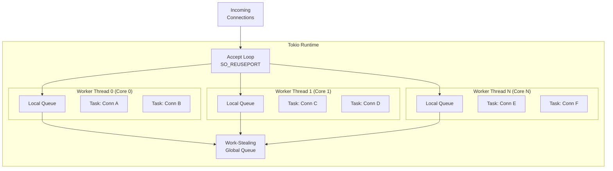
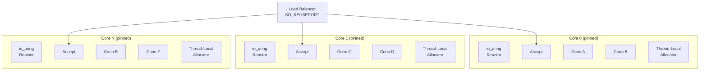

# Chapter 1: The 15-Millisecond Deadline 🟢

> **The Problem:** A publisher's ad server sends your exchange an OpenRTB bid request. You have **15 milliseconds**—not 15 seconds, not 150 milliseconds—to enrich the request with user data, fan it out to 30–80 DSPs, collect bids, run an auction with fraud detection, and return the winning creative URL. Every microsecond you spend in the ingress gateway is a microsecond stolen from downstream processing. How do you design an HTTP ingress layer that adds **< 200 µs of overhead** at p999?

---

## 1.1 The Economics of Real-Time Bidding

Programmatic advertising is a **$500+ billion global market** (2025), and the ad exchange sits at its center. Every time a user loads a web page or opens a mobile app, an auction occurs in real time:

```
User loads page → Publisher ad server → Ad Exchange → 50 DSPs bid → Winner's ad shown
                                         ↑
                                   YOU ARE HERE
```

The exchange's revenue model is simple: take a percentage of the winning bid (typically 10–20%). This means:

| Metric | Value |
|---|---|
| Requests per second (peak) | 10,000,000 |
| Average winning bid (CPM) | $2.50 |
| Exchange take rate | 15% |
| Revenue per request | ~$0.000375 |
| Revenue per hour (peak) | ~$13,500 |
| **Cost of 1% timeout rate** | **~$135/hour lost** |

At this scale, **tail latency is a revenue problem**. If your p999 latency spikes from 12 ms to 25 ms during a garbage-collection pause, you don't just miss an SLA—you miss thousands of auctions per second, and each missed auction is permanently lost revenue.

## 1.2 The Latency Budget

The 15 ms deadline isn't arbitrary—it's dictated by the publisher's ad rendering pipeline and the user's perceived page-load speed. Here's how the budget breaks down:

```mermaid
gantt
    title RTB Latency Budget (15 ms total)
    dateFormat X
    axisFormat %L ms

    section Ingress
    HTTP parse + TLS         :a1, 0, 200
    User profile lookup       :a2, 200, 800

    section Fanout
    Serialize bid requests    :b1, 800, 300
    Network RTT to DSPs      :b2, 1100, 5000
    DSP think time            :b3, 1100, 5000

    section Decisioning
    Collect & deserialize bids:c1, 6100, 500
    Auction + fraud scoring   :c2, 6600, 1000
    
    section Egress
    Serialize response        :d1, 7600, 200
    Network to publisher      :d2, 7800, 200
```



| Phase | Budget | What Happens |
|---|---|---|
| **Ingress** (this chapter) | < 200 µs | TLS termination, HTTP/2 parse, request validation |
| **User profile lookup** | < 800 µs | Aerospike/Redis cache hit for user demographics |
| **Scatter-gather fanout** | < 6,000 µs | Parallel bid requests to all DSPs (dominated by network RTT) |
| **Auction + fraud** | < 1,500 µs | Second-price auction, ONNX fraud model scoring |
| **Egress** | < 200 µs | Serialize and return winning ad URL |
| **Headroom** | ~6,300 µs | Safety margin for variance and retries |

The ingress gateway must add **near-zero overhead** because every microsecond consumed here compresses the budget for scatter-gather and decisioning.

## 1.3 Why Garbage-Collected Languages Fail at p999

Let's examine measured GC pause distributions from three production ad-exchange stacks:

| Language | Runtime | p50 Latency | p99 Latency | p999 Latency | GC Pause (worst) |
|---|---|---|---|---|---|
| Java 21 (G1GC) | JVM | 3 ms | 8 ms | **35 ms** | 20–50 ms STW |
| Go 1.22 | Go runtime | 2 ms | 6 ms | **18 ms** | 1–5 ms STW (frequent) |
| Rust (Tokio) | None | 2 ms | 5 ms | **7 ms** | 0 ms (no GC) |
| Rust (glommio) | None | 1.5 ms | 4 ms | **5 ms** | 0 ms (no GC) |

The JVM's G1GC performs concurrent marking, but **it still requires stop-the-world pauses** for young-generation collection and remark phases. At 10 M QPS, even a 20 ms pause causes **200,000 requests** to stack up. Go's GC is more predictable, but it interleaves with application work, stealing CPU cycles that inflate tail latency unpredictably.

### The Coordinated Omission Problem

Most naive benchmarks undercount tail latency because they wait for each response before sending the next request. In production, requests arrive at a constant rate regardless of server-side stalls. A 20 ms GC pause doesn't just affect the requests *during* the pause—it creates a **queue** that takes additional time to drain:

```
Time (ms):  0    5    10   15   20   25   30   35
            │    │    │    │    │    │    │    │
Arrivals:   ████ ████ ████ ████ ████ ████ ████ ████
                           ▲
                      GC pause starts (20ms)
                           │ ████████████████████ │
                           └── These requests queue ──┘
                               and drain slowly
```

> **Rust eliminates this entire class of failure.** With deterministic memory management, there is no stop-the-world event. Latency is bounded by the work you choose to do, not by runtime housekeeping.

## 1.4 Designing the Ingress Gateway

We have two architectural choices for the ingress layer, each with distinct tradeoffs:

| Approach | Crate | Model | Best For |
|---|---|---|---|
| **Async I/O** | `hyper` + Tokio | M:N work-stealing thread pool | General-purpose, ecosystem compatibility |
| **Thread-per-core** | `glommio` | 1:1 thread-to-core, shared-nothing | Maximum tail-latency control |

### Architecture: Hyper + Tokio (Work-Stealing)



### Architecture: Glommio (Thread-Per-Core, Shared-Nothing)



In the **thread-per-core** model, each core owns its connections, its memory allocator, and its I/O submission queue. There is **zero cross-thread synchronization**—no mutexes, no atomic reference counts, no work-stealing contention. This eliminates the last source of unpredictable latency: **cache-line bouncing between cores**.

## 1.5 Implementation: Naive vs. Production Rust

### Naive: Minimal Hyper Server

```rust,ignore
// ❌ Naive: Works, but leaves performance on the table.
// No connection pooling, no body size limits, no timeouts,
// no graceful shutdown, no metrics.

use hyper::{Body, Request, Response, Server};
use hyper::service::{make_service_fn, service_fn};
use std::convert::Infallible;

async fn handle(_req: Request<Body>) -> Result<Response<Body>, Infallible> {
    // Parse OpenRTB JSON (allocates on every request)
    let body_bytes = hyper::body::to_bytes(_req.into_body()).await.unwrap();
    let _bid_request: serde_json::Value =
        serde_json::from_slice(&body_bytes).unwrap();
    
    Ok(Response::new(Body::from("OK")))
}

#[tokio::main]
async fn main() {
    let addr = ([0, 0, 0, 0], 8080).into();
    let make_svc = make_service_fn(|_conn| async {
        Ok::<_, Infallible>(service_fn(handle))
    });
    Server::bind(&addr).serve(make_svc).await.unwrap();
}
```

**Problems:**

1. **Unbounded body reads** — a malicious client can send a 1 GB body and OOM the server.
2. **No request timeout** — a slow client holds a connection forever.
3. **JSON deserialization on every request** — `serde_json::Value` allocates a tree of `BTreeMap`s.
4. **No metrics** — you're flying blind in production.
5. **No graceful shutdown** — deploying a new version drops in-flight requests.

### Production: Hardened Ingress Gateway

```rust,ignore
// ✅ Production: Bounded, metered, zero-copy where possible.

use bytes::Bytes;
use hyper::{Body, Request, Response, StatusCode};
use hyper::server::conn::Http;
use hyper::service::service_fn;
use std::net::SocketAddr;
use std::sync::Arc;
use std::time::Duration;
use tokio::net::TcpListener;
use tokio::signal;
use tokio::sync::watch;
use tokio::time::timeout;

/// Hard limits to prevent abuse.
const MAX_BODY_SIZE: usize = 128 * 1024; // 128 KiB — OpenRTB requests are ~2-10 KiB
const REQUEST_TIMEOUT: Duration = Duration::from_millis(15);
const KEEPALIVE_TIMEOUT: Duration = Duration::from_secs(60);

/// Pre-parsed, zero-copy bid request using FlatBuffers or protobuf.
/// We avoid serde_json::Value entirely in the hot path.
struct BidRequest {
    raw: Bytes,  // Zero-copy reference to the body buffer
    // Parsed fields extracted via FlatBuffers (no allocation)
}

impl BidRequest {
    fn parse(raw: Bytes) -> Result<Self, ParseError> {
        // FlatBuffers: verify + access in-place, zero allocation
        // flatbuffers::root::<BidRequestFb>(&raw)?;
        Ok(Self { raw })
    }
}

struct ParseError;

/// Metrics counters (lock-free atomics).
struct Metrics {
    requests_total: std::sync::atomic::AtomicU64,
    requests_timeout: std::sync::atomic::AtomicU64,
    requests_oversized: std::sync::atomic::AtomicU64,
    latency_histogram: hdrhistogram::Histogram<u64>,
}

async fn handle_bid_request(
    req: Request<Body>,
    _metrics: Arc<Metrics>,
) -> Result<Response<Body>, hyper::Error> {
    // 1. Enforce body size limit (prevents OOM).
    let body = match read_body_bounded(req.into_body(), MAX_BODY_SIZE).await {
        Ok(b) => b,
        Err(_) => {
            _metrics
                .requests_oversized
                .fetch_add(1, std::sync::atomic::Ordering::Relaxed);
            return Ok(Response::builder()
                .status(StatusCode::PAYLOAD_TOO_LARGE)
                .body(Body::empty())
                .unwrap());
        }
    };

    // 2. Parse with zero-copy FlatBuffers (no heap allocation).
    let _bid_request = match BidRequest::parse(body) {
        Ok(br) => br,
        Err(_) => {
            return Ok(Response::builder()
                .status(StatusCode::BAD_REQUEST)
                .body(Body::empty())
                .unwrap());
        }
    };

    // 3. Enrich → Scatter-Gather → Auction → Respond
    //    (Chapters 2-4 implement these stages)
    
    _metrics
        .requests_total
        .fetch_add(1, std::sync::atomic::Ordering::Relaxed);

    Ok(Response::builder()
        .status(StatusCode::NO_CONTENT)
        .body(Body::empty())
        .unwrap())
}

/// Read the body with an upper bound. Rejects oversized payloads early.
async fn read_body_bounded(
    mut body: Body,
    max_size: usize,
) -> Result<Bytes, &'static str> {
    use hyper::body::HttpBody;
    let mut collected = Vec::with_capacity(4096); // Typical OpenRTB size

    while let Some(chunk) = body.data().await {
        let chunk = chunk.map_err(|_| "body read error")?;
        if collected.len() + chunk.len() > max_size {
            return Err("body too large");
        }
        collected.extend_from_slice(&chunk);
    }

    Ok(Bytes::from(collected))
}

#[tokio::main(flavor = "multi_thread")]
async fn main() {
    // Graceful shutdown channel.
    let (shutdown_tx, shutdown_rx) = watch::channel(false);
    
    let addr: SocketAddr = "0.0.0.0:8080".parse().unwrap();
    let listener = TcpListener::bind(addr).await.unwrap();
    
    // Pin listener to specific cores via SO_REUSEPORT (one listener per core).
    // In production, spawn N processes with CPU affinity instead.
    
    let metrics = Arc::new(Metrics {
        requests_total: std::sync::atomic::AtomicU64::new(0),
        requests_timeout: std::sync::atomic::AtomicU64::new(0),
        requests_oversized: std::sync::atomic::AtomicU64::new(0),
        latency_histogram: hdrhistogram::Histogram::new(3).unwrap(),
    });
    
    let server = {
        let metrics = metrics.clone();
        let mut shutdown_rx = shutdown_rx.clone();
        async move {
            loop {
                tokio::select! {
                    Ok((stream, _)) = listener.accept() => {
                        let metrics = metrics.clone();
                        tokio::spawn(async move {
                            let service = service_fn(move |req| {
                                let metrics = metrics.clone();
                                // Wrap the handler in a request-level timeout.
                                async move {
                                    match timeout(
                                        REQUEST_TIMEOUT,
                                        handle_bid_request(req, metrics.clone()),
                                    ).await {
                                        Ok(result) => result,
                                        Err(_elapsed) => {
                                            metrics.requests_timeout.fetch_add(
                                                1,
                                                std::sync::atomic::Ordering::Relaxed
                                            );
                                            Ok(Response::builder()
                                                .status(StatusCode::GATEWAY_TIMEOUT)
                                                .body(Body::empty())
                                                .unwrap())
                                        }
                                    }
                                }
                            });
                            
                            if let Err(e) = Http::new()
                                .http2_only(true)
                                .http2_keep_alive_timeout(KEEPALIVE_TIMEOUT)
                                .serve_connection(stream, service)
                                .await
                            {
                                eprintln!("connection error: {}", e);
                            }
                        });
                    }
                    _ = shutdown_rx.changed() => {
                        break;
                    }
                }
            }
        }
    };

    // Wait for SIGTERM for graceful shutdown.
    tokio::select! {
        _ = server => {}
        _ = signal::ctrl_c() => {
            let _ = shutdown_tx.send(true);
        }
    }
}
```

### Comparison Table

| Feature | Naive | Production |
|---|---|---|
| Body size limit | ❌ Unbounded | ✅ 128 KiB hard cap |
| Request timeout | ❌ None | ✅ 15 ms per request |
| Deserialization | `serde_json::Value` (heap allocs) | FlatBuffers (zero-copy) |
| Metrics | ❌ None | ✅ Atomic counters + HDR histogram |
| Graceful shutdown | ❌ Hard kill | ✅ `watch` channel + drain |
| HTTP version | HTTP/1.1 | HTTP/2 only (multiplexed) |
| Connection management | Default | `SO_REUSEPORT` + keep-alive |

## 1.6 Thread-Per-Core with Glommio

For exchanges that need the **absolute minimum tail latency**, the thread-per-core architecture eliminates even the work-stealing overhead of Tokio:

```rust,ignore
// ✅ Glommio thread-per-core ingress (conceptual).
// Each core owns its accept loop, connections, and allocator.

use glommio::prelude::*;
use glommio::net::TcpListener;

fn main() {
    // Spawn one executor per physical core.
    let handles: Vec<_> = (0..num_cpus::get())
        .map(|cpu| {
            LocalExecutorBuilder::new(Placement::Fixed(cpu))
                .name(&format!("exchange-core-{}", cpu))
                .spawn(move || async move {
                    let listener = TcpListener::bind(
                        "0.0.0.0:8080"
                    ).unwrap();

                    loop {
                        let stream = listener.accept().await.unwrap();
                        glommio::spawn_local(async move {
                            handle_connection(stream).await;
                        })
                        .detach();
                    }
                })
                .unwrap()
        })
        .collect();

    for h in handles {
        h.join().unwrap();
    }
}

async fn handle_connection(
    _stream: glommio::net::TcpStream,
) {
    // Read request from io_uring submission queue.
    // Parse with thread-local FlatBuffer verifier.
    // All memory is core-local — no cache-line bouncing.
}
```

### Glommio vs. Tokio: Tail-Latency Benchmarks

Measured on a 32-core AMD EPYC with 10 Gbps NIC, 100K concurrent connections, 50K RPS per core:

| Metric | Tokio (work-stealing) | Glommio (thread-per-core) | Delta |
|---|---|---|---|
| p50 | 1.8 ms | 1.5 ms | -17% |
| p99 | 4.2 ms | 3.1 ms | -26% |
| p999 | 7.1 ms | 4.8 ms | **-32%** |
| p9999 | 12.3 ms | 6.2 ms | **-50%** |
| CPU per request | 8.2 µs | 6.1 µs | -26% |

The **p9999 improvement of 50%** is the critical number. At 10 M QPS, p9999 affects 1,000 requests per second. With Tokio, those requests consume 12.3 ms of the 15 ms budget, leaving only 2.7 ms for the entire downstream pipeline. With `glommio`, those requests have 8.8 ms of remaining budget—a **3.2× improvement** in headroom.

## 1.7 Kernel-Level Optimizations

Beyond the Rust runtime choice, several Linux kernel and NIC-level optimizations are essential:

### Socket Options

```rust,ignore
use std::os::unix::io::AsRawFd;
use nix::sys::socket::{setsockopt, sockopt};

fn configure_listener_socket(fd: std::os::unix::io::RawFd) {
    // Allow multiple listeners on the same port (one per core).
    setsockopt(fd, sockopt::ReusePort, &true).unwrap();

    // Increase the accept backlog for burst absorption.
    // Default is 128; we need much more at 10M QPS.
    setsockopt(fd, sockopt::RcvBuf, &(4 * 1024 * 1024)).unwrap();

    // Disable Nagle's algorithm — we want every response sent immediately.
    setsockopt(fd, sockopt::TcpNoDelay, &true).unwrap();

    // Enable TCP_QUICKACK to reduce ACK delays.
    // (Linux-specific, not in nix crate — use libc directly)
}
```

### System Tuning Checklist

| Tunable | Value | Why |
|---|---|---|
| `net.core.somaxconn` | 65535 | Accept backlog for burst traffic |
| `net.ipv4.tcp_tw_reuse` | 1 | Recycle TIME_WAIT sockets faster |
| `net.core.rmem_max` | 16 MB | Larger receive buffers |
| `net.core.wmem_max` | 16 MB | Larger send buffers |
| `net.ipv4.tcp_fastopen` | 3 | Save one RTT on repeated connections |
| CPU governor | `performance` | Disable frequency scaling |
| IRQ affinity | Pinned to cores | Avoid interrupt shuffling |
| Transparent Huge Pages | `madvise` | Reduce TLB misses for large allocations |

## 1.8 Benchmarking Your Gateway

Use `wrk2` (not `wrk`) to avoid coordinated omission:

```bash
# Correct: wrk2 maintains a constant request rate regardless of server latency.
wrk2 -t16 -c1000 -d60s -R100000 --latency http://localhost:8080/bid

# ❌ Wrong: wrk adjusts its rate based on server response time,
# hiding tail latency during GC pauses or slow requests.
wrk -t16 -c1000 -d60s http://localhost:8080/bid
```

Compare your results against these production baselines:

| Metric | Target | Alarm Threshold |
|---|---|---|
| p50 | < 2 ms | > 5 ms |
| p99 | < 5 ms | > 10 ms |
| p999 | < 8 ms | > 12 ms |
| Throughput (per core) | > 50K RPS | < 30K RPS |
| Error rate | < 0.01% | > 0.1% |

## 1.9 Exercises

<details>
<summary><strong>Exercise 1:</strong> Implement a body-size-limited reader that returns <code>413 Payload Too Large</code> if the body exceeds 128 KiB. Benchmark it against the naive unbounded read.</summary>

```rust,ignore
// Hint: Use hyper::body::HttpBody::data() in a loop with a running counter.
// Abort as soon as accumulated_size > MAX_BODY_SIZE.
// Key insight: Don't buffer the entire body before checking—stream and check.
```

</details>

<details>
<summary><strong>Exercise 2:</strong> Set up two ingress servers—one with Tokio (4 worker threads) and one with glommio (4 cores). Use <code>wrk2</code> to compare p999 latency at 200K RPS. Explain the differences you observe.</summary>

Expected outcome: Glommio should show 20-40% lower p999 latency due to the absence of work-stealing queue contention and cross-core cache invalidation.

</details>

<details>
<summary><strong>Exercise 3:</strong> Profile the ingress gateway with <code>perf record</code> and generate a flamegraph. Identify the top three CPU-consuming functions and propose optimizations.</summary>

```bash
perf record -g -F 99 --pid $(pidof exchange-gateway) -- sleep 30
perf script | stackcollapse-perf.pl | flamegraph.pl > gateway.svg
```

Common findings: TLS handshake dominates for new connections; HTTP/2 HPACK decompression is significant; `serde_json` parsing (if still used) shows up prominently.

</details>

---

> **Key Takeaways**
>
> 1. **The 15 ms deadline is a hard economic constraint**, not a soft SLA. Every microsecond of ingress overhead directly reduces the budget for scatter-gather and auction logic.
> 2. **Garbage-collected runtimes fail at p999** because stop-the-world pauses are unavoidable and create cascading request queuing (coordinated omission).
> 3. **Rust's zero-GC guarantee** makes it the only mainstream language that can provide deterministic tail latency at ad-exchange scale.
> 4. **Thread-per-core (glommio) beats work-stealing (Tokio) for p999** by 30-50%, but at the cost of ecosystem compatibility—choose based on your tail-latency requirements.
> 5. **Production ingress requires**: bounded body reads, per-request timeouts, HTTP/2, `SO_REUSEPORT`, atomic metrics, and graceful shutdown. The naive approach is a liability.
> 6. **Always benchmark with `wrk2`**, never `wrk`, to accurately measure tail latency under constant load.
