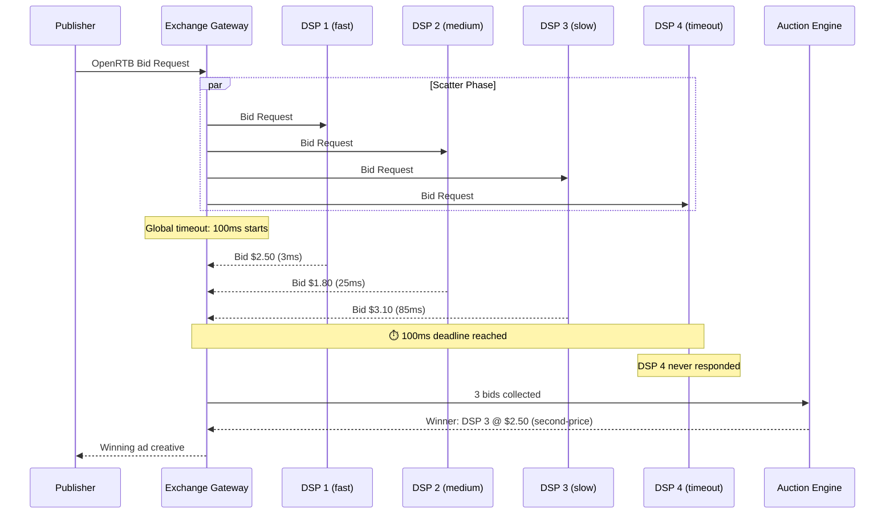
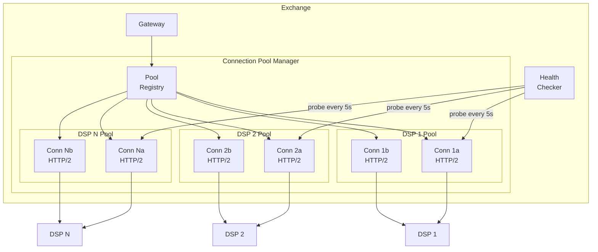
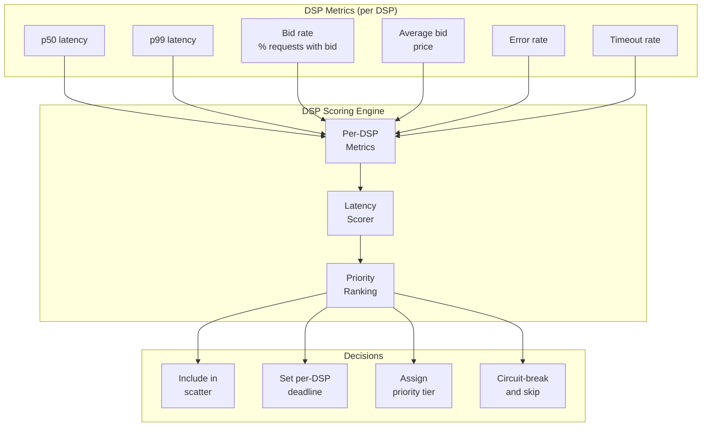

# Chapter 2: Scatter-Gather and Timeout Management 🟡

> **The Problem:** Your ingress gateway has parsed an OpenRTB bid request in under 200 µs. Now you must broadcast that request to **30–80 Demand Side Platforms (DSPs)**, each of which may take anywhere from 2 ms to 100 ms to respond—or may not respond at all. You need every bid you can get to maximize auction pressure and revenue, but you **cannot wait for stragglers**. How do you fan out to dozens of endpoints in parallel, collect the maximum number of responses within a hard deadline, and gracefully discard the rest?

---

## 2.1 The Scatter-Gather Pattern in RTB

Scatter-gather is the **dominant I/O pattern** in an ad exchange. The exchange acts as a coordinator:

1. **Scatter:** Serialize and send the bid request to N DSPs in parallel.
2. **Wait:** Collect responses as they arrive, up to a global deadline.
3. **Gather:** Return all collected bids to the auction engine.



The **key constraint**: the industry-standard DSP timeout is 100 ms, but our total budget is 15 ms on the exchange side (the 100 ms is the DSP's *network round-trip* budget from the exchange's perspective). In practice, the exchange imposes a **tighter deadline of ~8 ms** for the scatter-gather phase to leave room for auction and fraud detection.

## 2.2 Connection Pool Architecture

Establishing a TCP+TLS connection to each DSP per-request would be catastrophic—a TLS handshake alone costs 5–20 ms. Instead, we maintain a **persistent HTTP/2 connection pool** to every DSP:



| Pool Parameter | Value | Rationale |
|---|---|---|
| Min connections per DSP | 2 | Survive one connection drop without cold-start |
| Max connections per DSP | 16 | Limit file descriptor usage (50 DSPs × 16 = 800 FDs) |
| HTTP/2 max concurrent streams | 100 | Multiplex requests on fewer TCP connections |
| Idle timeout | 60 s | Reclaim unused connections |
| Health check interval | 5 s | Detect dead DSPs before bid requests hit them |
| Connection timeout | 500 ms | Fail fast on unreachable DSPs |

## 2.3 Implementation: Naive vs. Production Scatter-Gather

### Naive: Sequential with No Timeout

```rust,ignore
// ❌ Naive: Sends to each DSP sequentially (!!) and has no timeout.
// Total latency = sum of all DSP latencies. Completely unacceptable.

use reqwest::Client;

struct BidResponse {
    dsp_id: u32,
    bid_price: f64,
    creative_url: String,
}

async fn scatter_gather_naive(
    client: &Client,
    dsp_urls: &[String],
    bid_request: &[u8],
) -> Vec<BidResponse> {
    let mut bids = Vec::new();

    for url in dsp_urls {
        // 🐌 Sequential! Each DSP blocks the next.
        match client
            .post(url)
            .body(bid_request.to_vec()) // Copies the body every time
            .send()
            .await
        {
            Ok(resp) => {
                if let Ok(body) = resp.bytes().await {
                    // Parse response (error handling omitted)
                    bids.push(BidResponse {
                        dsp_id: 0,
                        bid_price: 0.0,
                        creative_url: String::new(),
                    });
                }
            }
            Err(_) => {} // Silently drops errors
        }
    }

    bids
}
```

**Problems:**

1. **Sequential I/O** — 50 DSPs × 20 ms average = 1,000 ms total. Fatal.
2. **No timeout** — one slow DSP blocks the entire pipeline forever.
3. **Body copied per DSP** — `to_vec()` allocates 50 copies of the bid request.
4. **No error tracking** — silent failures make debugging impossible.
5. **No circuit breaker** — a dead DSP gets retried on every request.

### Production: Concurrent Scatter-Gather with Bounded Timeout

```rust,ignore
// ✅ Production: Concurrent fanout with global + per-DSP timeouts,
// circuit breakers, and zero-copy request sharing.

use bytes::Bytes;
use std::sync::Arc;
use std::time::{Duration, Instant};
use tokio::sync::mpsc;
use tokio::time::timeout;

/// Hard deadlines.
const SCATTER_GATHER_DEADLINE: Duration = Duration::from_millis(8);
const PER_DSP_TIMEOUT: Duration = Duration::from_millis(100);

/// A DSP's bid response, parsed and validated.
#[derive(Debug)]
struct BidResponse {
    dsp_id: u32,
    bid_price_micros: u64,  // Price in microdollars to avoid floating-point
    creative_url: String,
    latency: Duration,
}

/// Circuit breaker state for a single DSP.
struct DspCircuitBreaker {
    failure_count: std::sync::atomic::AtomicU32,
    last_failure: std::sync::atomic::AtomicU64,
    state: std::sync::atomic::AtomicU8, // 0=closed, 1=open, 2=half-open
}

impl DspCircuitBreaker {
    const FAILURE_THRESHOLD: u32 = 5;
    const RECOVERY_WINDOW_MS: u64 = 10_000;

    fn is_open(&self) -> bool {
        let state = self.state.load(std::sync::atomic::Ordering::Relaxed);
        if state == 0 { return false; } // Closed — allow requests
        if state == 1 {
            // Check if recovery window has elapsed
            let now_ms = std::time::SystemTime::now()
                .duration_since(std::time::UNIX_EPOCH)
                .unwrap()
                .as_millis() as u64;
            let last = self.last_failure.load(std::sync::atomic::Ordering::Relaxed);
            if now_ms - last > Self::RECOVERY_WINDOW_MS {
                // Transition to half-open: allow one probe request
                self.state.store(2, std::sync::atomic::Ordering::Relaxed);
                return false;
            }
            return true; // Still open — skip this DSP
        }
        false // Half-open — allow one request
    }

    fn record_success(&self) {
        self.failure_count.store(0, std::sync::atomic::Ordering::Relaxed);
        self.state.store(0, std::sync::atomic::Ordering::Relaxed);
    }

    fn record_failure(&self) {
        let count = self.failure_count
            .fetch_add(1, std::sync::atomic::Ordering::Relaxed) + 1;
        if count >= Self::FAILURE_THRESHOLD {
            self.state.store(1, std::sync::atomic::Ordering::Relaxed);
            let now_ms = std::time::SystemTime::now()
                .duration_since(std::time::UNIX_EPOCH)
                .unwrap()
                .as_millis() as u64;
            self.last_failure.store(now_ms, std::sync::atomic::Ordering::Relaxed);
        }
    }
}

struct DspEndpoint {
    id: u32,
    url: String,
    client: reqwest::Client, // Connection-pooled HTTP/2 client
    circuit_breaker: DspCircuitBreaker,
}

/// Send a bid request to a single DSP with per-DSP timeout.
async fn send_to_dsp(
    dsp: &DspEndpoint,
    body: Bytes,         // Shared, zero-copy via Bytes refcount
) -> Option<BidResponse> {
    // Skip DSPs whose circuit breaker is open.
    if dsp.circuit_breaker.is_open() {
        return None;
    }

    let start = Instant::now();

    let result = timeout(PER_DSP_TIMEOUT, async {
        dsp.client
            .post(&dsp.url)
            .body(body)
            .send()
            .await?
            .bytes()
            .await
    })
    .await;

    match result {
        Ok(Ok(response_bytes)) => {
            let latency = start.elapsed();
            dsp.circuit_breaker.record_success();
            
            // Parse the bid response (FlatBuffers or protobuf).
            parse_bid_response(dsp.id, &response_bytes, latency)
        }
        Ok(Err(_http_error)) => {
            dsp.circuit_breaker.record_failure();
            None
        }
        Err(_timeout) => {
            dsp.circuit_breaker.record_failure();
            None
        }
    }
}

fn parse_bid_response(
    dsp_id: u32,
    _bytes: &[u8],
    latency: Duration,
) -> Option<BidResponse> {
    // Production: FlatBuffers zero-copy parse.
    // Validate bid price > 0, creative URL present, etc.
    Some(BidResponse {
        dsp_id,
        bid_price_micros: 2_500_000, // placeholder
        creative_url: String::new(),  // placeholder
        latency,
    })
}

/// The main scatter-gather function.
/// Returns as many bids as arrive within SCATTER_GATHER_DEADLINE.
async fn scatter_gather(
    dsps: &[Arc<DspEndpoint>],
    bid_request_body: Bytes,
) -> Vec<BidResponse> {
    let (tx, mut rx) = mpsc::channel::<BidResponse>(dsps.len());

    // Scatter: spawn a task per DSP.
    for dsp in dsps {
        let dsp = dsp.clone();
        let body = bid_request_body.clone(); // Bytes::clone is O(1) — refcount bump
        let tx = tx.clone();
        
        tokio::spawn(async move {
            if let Some(bid) = send_to_dsp(&dsp, body).await {
                let _ = tx.send(bid).await; // Ignore send error if receiver dropped
            }
        });
    }

    // Drop our sender so the channel closes when all tasks finish.
    drop(tx);

    // Gather: collect bids until the global deadline expires.
    let mut bids = Vec::with_capacity(dsps.len());
    let deadline = timeout(SCATTER_GATHER_DEADLINE, async {
        while let Some(bid) = rx.recv().await {
            bids.push(bid);
        }
    });

    let _ = deadline.await; // Ok = all responded; Err = deadline hit (expected)
    bids
}
```

### Comparison Table

| Feature | Naive | Production |
|---|---|---|
| Concurrency | Sequential | All DSPs in parallel |
| Global timeout | None | 8 ms hard deadline |
| Per-DSP timeout | None | 100 ms per DSP |
| Body copy | O(N) clones | O(1) `Bytes` refcount |
| Circuit breaker | None | 5-failure threshold with recovery |
| Error handling | Silent drop | Tracked per DSP |
| Dead DSP impact | Blocks pipeline forever | Skipped automatically |

## 2.4 Advanced: `tokio::select!` for Priority Collection

For scenarios where you want **early termination**—for example, if you've already collected bids from the top 5 highest-paying DSPs and the remaining DSPs historically bid lower—you can use `select!` for priority-based collection:

```rust,ignore
use tokio::time::{sleep, Duration, Instant};

/// Gather bids with tiered deadlines:
/// - Tier 1 (premium DSPs): wait up to 8 ms
/// - Tier 2 (standard DSPs): wait up to 5 ms
/// - Early exit if we have >= min_bids after tier 2 deadline
async fn tiered_scatter_gather(
    premium_bids: &mut mpsc::Receiver<BidResponse>,
    standard_bids: &mut mpsc::Receiver<BidResponse>,
    min_bids: usize,
) -> Vec<BidResponse> {
    let mut collected = Vec::with_capacity(64);
    let start = Instant::now();
    
    let tier2_deadline = sleep(Duration::from_millis(5));
    let tier1_deadline = sleep(Duration::from_millis(8));
    
    tokio::pin!(tier2_deadline);
    tokio::pin!(tier1_deadline);
    
    loop {
        tokio::select! {
            // Bias premium bids — check them first.
            biased;
            
            Some(bid) = premium_bids.recv() => {
                collected.push(bid);
            }
            Some(bid) = standard_bids.recv() => {
                collected.push(bid);
            }
            _ = &mut tier2_deadline => {
                // Standard DSP window closed.
                // If we have enough bids, stop waiting for premiums too.
                if collected.len() >= min_bids {
                    break;
                }
                // Otherwise, continue waiting for premium DSPs until tier1.
            }
            _ = &mut tier1_deadline => {
                // Hard deadline. Take whatever we have.
                break;
            }
        }
    }
    
    collected
}
```

## 2.5 Connection Health and DSP Scoring

Not all DSPs are equal. Over time, the exchange learns each DSP's behavior and adjusts:



| DSP Score Factor | Weight | Example |
|---|---|---|
| p50 bid latency | 25% | Fast DSPs get longer effective deadlines |
| Bid rate (% non-empty) | 30% | DSPs that bid often are more valuable |
| Average bid price | 25% | Higher-bidding DSPs increase revenue |
| Error/timeout rate | 20% | Unreliable DSPs get circuit-broken |

## 2.6 Handling Partial Failures Gracefully

In production, partial failure is the **normal state**. On any given request, 10–30% of DSPs will time out or return errors. The exchange must degrade gracefully:

```rust,ignore
/// Outcome of a scatter-gather round.
struct ScatterGatherResult {
    bids: Vec<BidResponse>,
    stats: ScatterStats,
}

struct ScatterStats {
    dsps_contacted: u32,
    dsps_responded: u32,
    dsps_timed_out: u32,
    dsps_circuit_broken: u32,
    dsps_errored: u32,
    total_scatter_time: Duration,
}

impl ScatterGatherResult {
    fn bid_coverage(&self) -> f64 {
        self.stats.dsps_responded as f64 / self.stats.dsps_contacted as f64
    }

    fn has_minimum_bids(&self) -> bool {
        // Need at least 2 bids for a meaningful auction.
        self.bids.len() >= 2
    }

    fn should_alert(&self) -> bool {
        // Alert if < 50% of DSPs responded (infrastructure problem).
        self.bid_coverage() < 0.5
    }
}
```

### Degradation Strategy

| Bid Coverage | Action |
|---|---|
| ≥ 80% DSPs responded | Normal auction |
| 50–80% | Normal auction + log warning |
| 20–50% | Auction proceeds but alert on-call |
| < 20% | Fall back to passback (publisher's house ad) |
| 0 bids | Return no-bid (HTTP 204) to publisher |

## 2.7 Zero-Copy Serialization for Fanout

Serializing the bid request 50 times is wasteful. Instead, we serialize **once** and share the buffer:

```rust,ignore
use bytes::Bytes;

/// Serialize the enriched bid request once, share N times.
fn prepare_scatter_payload(
    bid_request: &EnrichedBidRequest,
) -> Bytes {
    // Serialize to Protocol Buffers (or FlatBuffers) once.
    let mut buf = Vec::with_capacity(4096);
    bid_request.encode(&mut buf);
    
    // Bytes::from(Vec) takes ownership without copying.
    // Subsequent .clone() calls are O(1) — atomic refcount bump.
    Bytes::from(buf)
}

struct EnrichedBidRequest {
    // OpenRTB fields + user profile data from cache (Chapter 3)
}

impl EnrichedBidRequest {
    fn encode(&self, _buf: &mut Vec<u8>) {
        // protobuf or flatbuffers encode
    }
}

// In the scatter loop:
// let payload = prepare_scatter_payload(&enriched_request);
// for dsp in dsps {
//     let payload_clone = payload.clone(); // O(1), no copy
//     tokio::spawn(send_to_dsp(dsp, payload_clone));
// }
```

## 2.8 Monitoring the Scatter-Gather Pipeline

Essential metrics to export to your observability stack (Prometheus/OpenTelemetry):

| Metric | Type | Labels | Purpose |
|---|---|---|---|
| `rtb_scatter_duration_seconds` | Histogram | — | Total scatter-gather wall time |
| `rtb_dsp_response_duration_seconds` | Histogram | `dsp_id` | Per-DSP latency distribution |
| `rtb_dsp_bid_total` | Counter | `dsp_id`, `status` | Bid/no-bid/error/timeout counts |
| `rtb_dsp_circuit_breaker_state` | Gauge | `dsp_id` | 0=closed, 1=open, 2=half-open |
| `rtb_scatter_bid_count` | Histogram | — | Number of bids collected per request |
| `rtb_scatter_coverage_ratio` | Histogram | — | % of DSPs that responded |

## 2.9 Exercises

<details>
<summary><strong>Exercise 1:</strong> Implement the tiered scatter-gather with <code>select!</code>. Create 5 mock DSPs: 2 "fast" (respond in 1-3 ms) and 3 "slow" (respond in 10-50 ms). Verify that the fast DSPs' bids are always collected, while slow DSPs are collected only within the deadline.</summary>

```rust,ignore
// Hint: Use tokio::time::sleep to simulate DSP latency.
// Create a mock HTTP server per DSP with configurable latency.
// Assert that fast DSP bids are always present in the result.
```

</details>

<details>
<summary><strong>Exercise 2:</strong> Build a circuit breaker that opens after 5 consecutive failures, waits 10 seconds, then allows one probe request (half-open). Write a test that triggers the breaker and verifies it recovers.</summary>

Expected sequence: 5 failures → breaker opens → requests skipped for 10s → one probe allowed → success → breaker closes.

</details>

<details>
<summary><strong>Exercise 3:</strong> Measure the cost of <code>Bytes::clone()</code> vs <code>Vec::clone()</code> for a 4 KiB payload cloned 50 times. Use <code>criterion</code> to benchmark. What is the throughput difference?</summary>

Expected: `Bytes::clone()` should be ~1000× faster because it's an atomic refcount increment (a single CPU instruction) vs. allocating and copying 4 KiB of memory.

</details>

---

> **Key Takeaways**
>
> 1. **Scatter-gather is the performance-critical path** in any ad exchange. All DSPs must be contacted concurrently, never sequentially.
> 2. **Two levels of timeout are essential:** a per-DSP timeout (100 ms industry standard) and a global scatter-gather deadline (8 ms in our budget).
> 3. **`Bytes` provides zero-copy fanout** — serialize the bid request once and share it across 50+ tasks via O(1) reference counting.
> 4. **Circuit breakers prevent cascading failures.** A single dead DSP must not degrade the auction for the other 49 DSPs.
> 5. **Partial failure is normal.** The system must gracefully degrade and still run a meaningful auction with 50% of DSPs responding.
> 6. **DSP scoring** lets the exchange dynamically prioritize fast, high-value DSPs and deprioritize or circuit-break unreliable ones.
