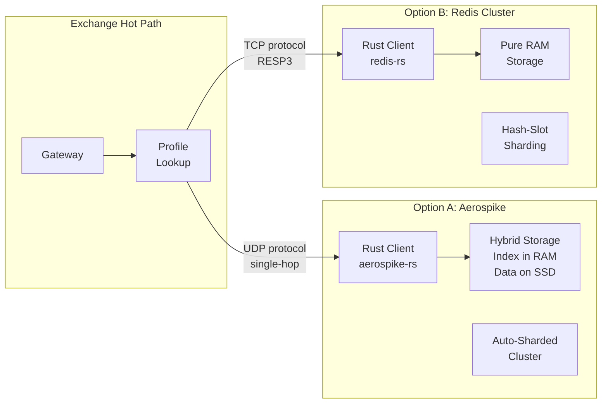
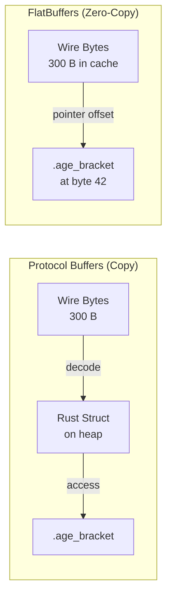
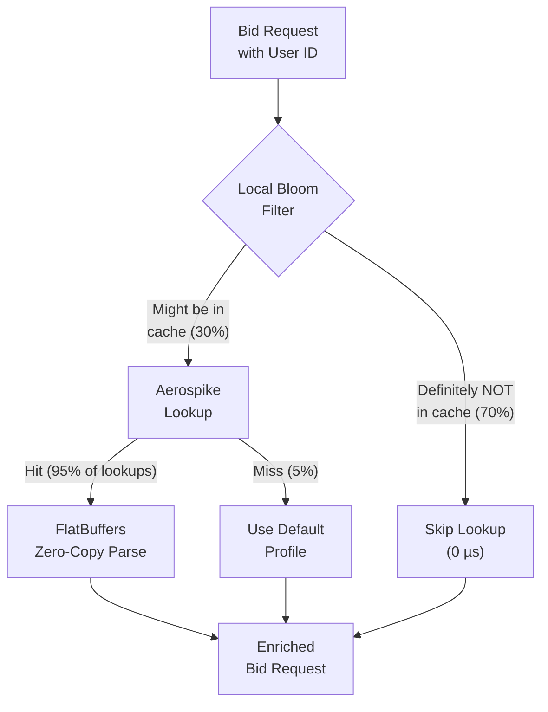
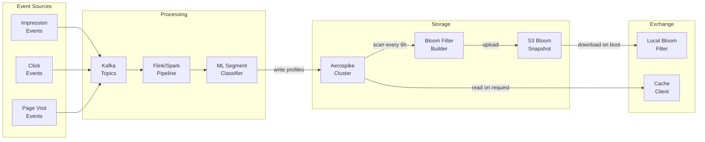

# Chapter 3: In-Memory Caching and User Profiling 🟡

> **The Problem:** Before you scatter bid requests to DSPs, you must enrich each request with the user's demographic profile—age bracket, interest segments, geographic region, device history—so DSPs can make informed bidding decisions. This lookup must complete in **< 1 ms** because it sits on the critical path between ingress and scatter-gather. A cache miss means a degraded bid request (fewer data signals → lower bids → less revenue). How do you store 2 billion user profiles, serve them in sub-millisecond latency, and avoid deserialization overhead entirely?

---

## 3.1 Why User Enrichment Matters

DSPs bid higher when they know *who* they're bidding on. The correlation between enrichment quality and bid price is dramatic:

| Enrichment Level | Average CPM Bid | Revenue Impact |
|---|---|---|
| No user data (anonymous) | $0.30 | Baseline |
| Cookie ID only | $0.80 | +167% |
| Demographics (age, gender) | $1.50 | +400% |
| Interest segments (10+ signals) | $2.80 | +833% |
| Full profile (demographics + interests + recency) | $4.50 | +1,400% |

At 10 M QPS, the difference between "no data" and "full profile" is:

$$\text{Revenue delta} = 10{,}000{,}000 \times \frac{(\$4.50 - \$0.30)}{1000} \times 0.15 = \$6{,}300 \text{/sec}$$

That's **$22.7 million per hour** in incremental revenue that depends on your cache being fast and populated. A 1% cache miss rate costs ~$227K/hour.

## 3.2 The User Profile Data Model

A typical user profile in an ad exchange contains:

```rust,ignore
/// A user's advertising profile.
/// Approximately 200–500 bytes when serialized with FlatBuffers.
struct UserProfile {
    /// Hashed user ID (cookie, device ID, or probabilistic ID).
    user_id: [u8; 16],
    
    /// Demographic segment codes (IAB taxonomy).
    age_bracket: u8,         // 0-6: unknown, 18-24, 25-34, 35-44, 45-54, 55-64, 65+
    gender: u8,              // 0=unknown, 1=male, 2=female
    
    /// Interest segments (IAB Content Taxonomy 3.0).
    /// Typically 10-50 segment IDs per user.
    interest_segments: Vec<u32>,
    
    /// Geographic data.
    country: u16,            // ISO 3166-1 numeric
    region: u16,             // State/province code
    metro_code: u16,         // DMA/Nielsen code
    
    /// Device fingerprint.
    device_type: u8,         // mobile, desktop, tablet, CTV
    os: u8,                  // iOS, Android, Windows, macOS, etc.
    browser: u8,
    
    /// Recency signals.
    last_seen_ts: u64,       // Unix timestamp
    impressions_24h: u16,    // Frequency cap data
    clicks_24h: u16,
    
    /// Advertiser-specific flags.
    opted_out_advertisers: Vec<u32>,  // Advertiser IDs this user has opted out of
}
```

## 3.3 Cache Architecture: Aerospike vs. Redis Cluster

Two systems dominate AdTech caching. Here's how they compare for our use case:



| Dimension | Aerospike | Redis Cluster |
|---|---|---|
| **Read latency (p99)** | < 1 ms | < 1 ms |
| **Read latency (p999)** | < 2 ms | 2–5 ms (fragmentation-sensitive) |
| **Protocol** | Custom binary (UDP single-packet for reads) | RESP3 over TCP |
| **Storage model** | Hybrid: index in RAM, data on NVMe SSD | Pure RAM |
| **Cost per billion profiles** | ~$5K/month (SSD-backed) | ~$50K/month (RAM-only) |
| **Cost ratio** | 1× | 10× |
| **Max dataset size** | Petabytes (SSD) | Limited by RAM (typically < 1 TB) |
| **Strong consistency** | Available (CP mode) | Eventual (AP with WAIT) |
| **Hot key handling** | Built-in query dedup | Client-side rate limiting required |
| **Client ecosystem (Rust)** | Smaller, less mature | Very mature (`redis-rs`, `fred`) |
| **Best for** | Cost-sensitive, large datasets | Small datasets, ecosystem compatibility |

### Why Aerospike Wins for AdTech

For 2 billion user profiles at ~300 bytes each:

$$\text{Total data} = 2 \times 10^9 \times 300 \text{ B} = 600 \text{ GB}$$

- **Redis:** 600 GB of RAM = ~$50K/month in cloud costs (before replication).
- **Aerospike:** 600 GB on NVMe SSD + ~60 GB RAM for indexes = ~$5K/month.

The 10× cost difference is why almost every major ad exchange (Google, The Trade Desk, PubMatic) uses Aerospike or a comparable hybrid-storage system.

## 3.4 Eliminating Deserialization with FlatBuffers

Traditional serialization (JSON, Protocol Buffers) requires **decoding** the wire format into a Rust struct, which allocates memory and copies data. At 10 M QPS, this deserialization cost is significant:

| Format | Decode Time (300 B) | Allocations | Bytes Copied |
|---|---|---|---|
| JSON (`serde_json`) | 2–5 µs | 10–20 (strings, vec) | ~600 B (input + output) |
| Protocol Buffers (`prost`) | 0.5–1.5 µs | 3–5 (vecs) | ~300 B |
| **FlatBuffers** | **< 0.05 µs** | **0** | **0 B** |

FlatBuffers achieves zero-copy reads by storing data in a format that can be accessed **directly from the serialized buffer** without parsing. The "deserialization" is just pointer arithmetic:



### FlatBuffers Schema for User Profile

```flatbuffers
// user_profile.fbs
namespace adx.profile;

table UserProfile {
    user_id: [ubyte:16];
    age_bracket: ubyte;
    gender: ubyte;
    interest_segments: [uint32];
    country: ushort;
    region: ushort;
    metro_code: ushort;
    device_type: ubyte;
    os: ubyte;
    browser: ubyte;
    last_seen_ts: ulong;
    impressions_24h: ushort;
    clicks_24h: ushort;
    opted_out_advertisers: [uint32];
}

root_type UserProfile;
```

### Rust Usage: Zero-Copy Access

```rust,ignore
// ✅ FlatBuffers: Access fields directly from the cache buffer.
// No heap allocation. No deserialization. Just pointer offsets.

// Generated by `flatc --rust user_profile.fbs`
use crate::user_profile_generated::adx::profile::UserProfile;

fn enrich_bid_request(
    cache_bytes: &[u8],  // Raw bytes from Aerospike/Redis
) -> Option<EnrichedFields> {
    // Verify the buffer (< 50 ns for 300 bytes).
    let profile = flatbuffers::root::<UserProfile>(cache_bytes).ok()?;

    // Access fields — these are pointer offsets, not copies.
    let age = profile.age_bracket();     // Reads byte at offset 42
    let gender = profile.gender();       // Reads byte at offset 43
    let segments = profile.interest_segments()?; // Returns a slice view
    let country = profile.country();     // Reads u16 at offset 44

    Some(EnrichedFields {
        age,
        gender,
        segment_count: segments.len() as u16,
        country,
    })
}

struct EnrichedFields {
    age: u8,
    gender: u8,
    segment_count: u16,
    country: u16,
}
```

### Comparison: Naive JSON vs. Production FlatBuffers

```rust,ignore
// ❌ Naive: JSON deserialization on the hot path.
// Allocates strings, vectors, and a HashMap for every request.

use serde::Deserialize;

#[derive(Deserialize)]
struct UserProfileJson {
    user_id: String,           // Heap allocation
    age_bracket: u8,
    gender: String,            // Heap allocation
    interest_segments: Vec<u32>, // Heap allocation
    country: String,           // Heap allocation
    // ... more fields ...
}

fn enrich_from_json(cache_bytes: &[u8]) -> Option<UserProfileJson> {
    // 2-5 µs per call. At 10M QPS = 20-50 CPU-seconds per second (!).
    serde_json::from_slice(cache_bytes).ok()
}
```

```rust,ignore
// ✅ Production: FlatBuffers zero-copy access.
// No heap allocation. Total cost: < 50 ns (verify) + < 5 ns (per field access).

fn enrich_from_flatbuffers(cache_bytes: &[u8]) -> Option<u8> {
    let profile = flatbuffers::root::<UserProfile>(cache_bytes).ok()?;
    Some(profile.age_bracket()) // Pointer arithmetic, not a copy
}
```

| Metric | JSON (`serde_json`) | FlatBuffers |
|---|---|---|
| Decode time | 2–5 µs | < 0.05 µs (verify only) |
| Heap allocations | 10–20 per decode | 0 |
| CPU at 10M QPS | 20–50 cores | < 0.5 cores |
| Cache-friendliness | Poor (scattered heap allocs) | Excellent (sequential buffer) |

## 3.5 Cache Access Pattern: Read-Through with Local Bloom Filter

Not every request has a matching user profile. If 30% of users are unknown, that's 3 M QPS hitting Aerospike for a cache miss. We can avoid these round-trips with a local Bloom filter:



```rust,ignore
use bloomfilter::Bloom;
use std::sync::Arc;

/// A two-tier cache: local Bloom filter → Aerospike.
struct UserProfileCache {
    /// Bloom filter containing all known user IDs.
    /// False positive rate: 1%. Size: ~2.4 GB for 2B users.
    /// Rebuilt every 6 hours from Aerospike scan.
    bloom: Arc<Bloom<[u8; 16]>>,

    /// Aerospike client with connection pooling.
    aerospike: AerospikeClient,
}

struct AerospikeClient;

impl AerospikeClient {
    async fn get(&self, _key: &[u8; 16]) -> Option<Vec<u8>> {
        // Single-packet UDP read to Aerospike.
        // Returns raw FlatBuffer bytes — no deserialization here.
        None // placeholder
    }
}

impl UserProfileCache {
    async fn lookup(&self, user_id: &[u8; 16]) -> Option<Vec<u8>> {
        // Tier 1: Bloom filter check (< 100 ns, in-process).
        if !self.bloom.check(user_id) {
            // Definitely not in the cache. Skip the network call.
            return None;
        }

        // Tier 2: Aerospike read (< 1 ms network call).
        self.aerospike.get(user_id).await
    }
}
```

### Bloom Filter Sizing

For 2 billion user IDs with a 1% false positive rate:

$$m = -\frac{n \cdot \ln p}{(\ln 2)^2} = -\frac{2 \times 10^9 \times \ln 0.01}{0.4805} \approx 19.2 \times 10^9 \text{ bits} = 2.4 \text{ GB}$$

$$k = -\frac{\ln p}{\ln 2} = \frac{4.605}{0.693} \approx 7 \text{ hash functions}$$

| Parameter | Value |
|---|---|
| Users (n) | 2 billion |
| False positive rate (p) | 1% |
| Bit array size (m) | 2.4 GB |
| Hash functions (k) | 7 |
| Check cost | < 100 ns (L3 cache-resident) |
| Network calls saved | ~70% (users definitely not in cache) |

## 3.6 Cache Warming and Consistency

User profiles are **eventually consistent**. They're built from real-time event streams (impressions, clicks, page visits) and batch jobs (demographic modeling, segment classification). The cache must be warm on startup and stay reasonably fresh:

### Write Path (Offline Pipeline)



| Operation | Frequency | Latency |
|---|---|---|
| Profile update (from event) | Real-time via Kafka consumer | 100–500 ms |
| Segment reclassification (ML) | Every 1–6 hours | N/A (batch) |
| Bloom filter rebuild | Every 6 hours | ~30 min for 2B keys |
| Bloom filter download (on boot) | On exchange process start | ~10 s (2.4 GB from S3) |
| Cache warmup (optional prefetch) | On boot for hot users | ~5 min for top 10M users |

## 3.7 Hot-Key Mitigation

Some user IDs are "hot"—celebrity accounts, bot-suspected IDs, or IDs that appear in viral content. These can create a thundering herd on a single Aerospike node:

```rust,ignore
use mini_moka::sync::Cache;
use std::time::Duration;

/// L1 (process-local) → L2 (Aerospike) cache hierarchy.
struct TwoTierCache {
    /// L1: In-process LRU cache for hot keys.
    /// 100K entries × 500 B = ~50 MB per exchange process.
    l1: Cache<[u8; 16], Vec<u8>>,
    
    /// L2: Aerospike cluster.
    l2: AerospikeClient,
}

impl TwoTierCache {
    fn new() -> Self {
        Self {
            l1: Cache::builder()
                .max_capacity(100_000)
                .time_to_live(Duration::from_secs(60))
                .build(),
            l2: AerospikeClient,
        }
    }

    async fn get(&self, user_id: &[u8; 16]) -> Option<Vec<u8>> {
        // L1 check: in-process, < 200 ns.
        if let Some(val) = self.l1.get(user_id) {
            return Some(val);
        }

        // L2 check: network call to Aerospike, < 1 ms.
        if let Some(val) = self.l2.get(user_id).await {
            // Promote to L1.
            self.l1.insert(*user_id, val.clone());
            return Some(val);
        }

        None
    }
}
```

| Cache Tier | Capacity | Latency | Purpose |
|---|---|---|---|
| **L1** (in-process LRU) | 100K entries (~50 MB) | < 200 ns | Hot-key deflection |
| **L2** (Aerospike) | 2B entries (~600 GB) | < 1 ms | Full profile store |
| **Bloom filter** | 2B entries (2.4 GB) | < 100 ns | Avoid L2 misses |

## 3.8 Protocol Buffer Alternative

If your team is more familiar with Protocol Buffers and can tolerate the decode cost (~1 µs), `prost` with a reuse pattern is a reasonable middle ground:

```rust,ignore
// Protocol Buffers with buffer reuse (prost).
// Not zero-copy, but much faster than JSON.

use prost::Message;

/// Generated by `prost-build` from user_profile.proto.
#[derive(Message)]
struct UserProfileProto {
    #[prost(bytes, tag = "1")]
    user_id: Vec<u8>,
    #[prost(uint32, tag = "2")]
    age_bracket: u32,
    #[prost(uint32, tag = "3")]
    gender: u32,
    #[prost(uint32, repeated, tag = "4")]
    interest_segments: Vec<u32>,
    #[prost(uint32, tag = "5")]
    country: u32,
}

/// Reuse a pre-allocated struct to reduce allocations.
/// This amortizes the Vec allocations across requests.
fn decode_with_reuse(
    buf: &[u8],
    reuse: &mut UserProfileProto,
) -> Result<(), prost::DecodeError> {
    reuse.clear();
    UserProfileProto::merge(reuse, buf)
}
```

## 3.9 Exercises

<details>
<summary><strong>Exercise 1:</strong> Implement a FlatBuffers schema for the user profile and write a Rust function that reads the <code>interest_segments</code> field without any heap allocation. Benchmark it against <code>serde_json</code> deserialization.</summary>

Steps:
1. Install `flatc` and generate Rust bindings.
2. Create a test profile with 20 interest segments.
3. Use `criterion` to benchmark FlatBuffers `root::<UserProfile>()` + field access vs. `serde_json::from_slice`.
4. Expected: FlatBuffers should be 50–100× faster.

</details>

<details>
<summary><strong>Exercise 2:</strong> Build a Bloom filter for 1 million user IDs with a 1% false positive rate. Measure the actual false positive rate by testing 1 million random IDs that were NOT inserted.</summary>

```rust,ignore
// Hint: Use the `bloomfilter` crate.
// Expected FP rate should be close to 1%.
// Measure memory usage with std::mem::size_of_val.
```

</details>

<details>
<summary><strong>Exercise 3:</strong> Implement the two-tier cache (L1 in-process LRU + mock L2) and measure the L1 hit rate under a Zipfian access pattern (where hot keys are accessed exponentially more often). What cache size gives you 90% L1 hit rate?</summary>

Use the `zipf` crate to generate access patterns. Start with 1M unique keys and vary L1 capacity from 1K to 100K entries.

</details>

---

> **Key Takeaways**
>
> 1. **User enrichment is a revenue multiplier.** A fully enriched bid request commands 10–15× higher bids than an anonymous one. Cache performance directly impacts revenue.
> 2. **Aerospike's hybrid storage** (RAM index + SSD data) makes it 10× cheaper than Redis for billion-user datasets, with comparable sub-ms read latency.
> 3. **FlatBuffers eliminates deserialization** entirely—fields are accessed via pointer arithmetic on the raw buffer, saving 2–5 µs and 10–20 heap allocations per request compared to JSON.
> 4. **A local Bloom filter saves ~70% of cache lookups** by identifying users that are definitely not in the store, avoiding unnecessary network round-trips.
> 5. **Two-tier caching** (in-process LRU + external cluster) deflects hot-key traffic and keeps p999 latency low even under skewed access patterns.
> 6. **Cache warming and consistency** are offline pipeline concerns—the hot path only reads. Profiles are eventually consistent, rebuilt every 1–6 hours via Kafka → Flink → Aerospike.
