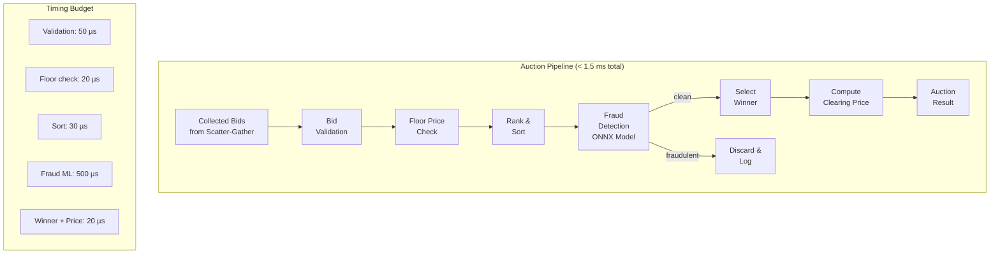
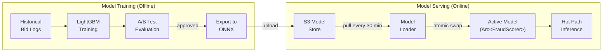

# Chapter 4: The Auction Engine & Fraud Detection 🔴

> **The Problem:** You've collected bids from 30+ DSPs in under 8 ms. Now you must select a winner, determine the clearing price, and verify that the winning bid isn't from a bot—all within **1.5 ms**. Get the auction wrong and you lose advertiser trust. Miss a fraudulent bid and you charge a real advertiser for a fake impression, triggering chargebacks and regulatory scrutiny. How do you implement a correct, high-performance auction engine with inline ML fraud detection on the hot path?

---

## 4.1 Auction Mechanics: First-Price vs. Second-Price

The ad industry has undergone a fundamental shift in auction mechanics:

| Era | Auction Type | Price Paid | DSP Strategy |
|---|---|---|---|
| Pre-2019 | **Second-Price** | Highest bid pays second-highest + $0.01 | Bid your true value |
| Post-2019 | **First-Price** | Highest bid pays their own price | Bid shade (bid below true value) |
| Hybrid (common) | **Modified First-Price** | First-price with a soft floor | Bid shade + floor awareness |

### Second-Price Auction

In a second-price (Vickrey) auction, the winner pays **one cent above the second-highest bid**:

```
Bids received:
  DSP A: $3.00
  DSP B: $2.50  ← Second-highest
  DSP C: $1.80
  DSP D: $1.20

Winner: DSP A
Price paid: $2.51 (second-highest + $0.01)
Exchange revenue: $2.51 × 15% take rate = $0.38
```

**Advantage:** DSPs are incentivized to bid their **true value** because overbidding doesn't increase the price they pay.

### First-Price Auction

In a first-price auction, the winner pays **exactly what they bid**:

```
Bids received:
  DSP A: $2.10 (bid-shaded from true value of $3.00)
  DSP B: $1.90 (bid-shaded from true value of $2.50)
  DSP C: $1.80
  DSP D: $1.20

Winner: DSP A
Price paid: $2.10 (their exact bid)
Exchange revenue: $2.10 × 15% take rate = $0.32
```

**Complication:** DSPs now actively **bid shade**—they bid below their true value to avoid overpaying. The exchange must account for this when setting floor prices.

## 4.2 The Auction Engine Architecture



## 4.3 Implementation: Naive vs. Production Auction

### Naive: Float Arithmetic, No Validation

```rust,ignore
// ❌ Naive: Uses f64 for money (imprecise), no floor enforcement,
// no fraud check, no deal/PMP support.

fn run_auction_naive(bids: &[(u32, f64)]) -> Option<(u32, f64)> {
    if bids.is_empty() {
        return None;
    }
    
    // Sort by price descending.
    let mut sorted = bids.to_vec();
    sorted.sort_by(|a, b| b.1.partial_cmp(&a.1).unwrap()); // ⚠️ NaN panic!
    
    let winner = sorted[0];
    let price = if sorted.len() > 1 {
        sorted[1].1 + 0.01  // Second-price
    } else {
        sorted[0].1
    };
    
    Some((winner.0, price))
}
```

**Problems:**

1. **Floating-point money** — `0.1 + 0.2 ≠ 0.3` in IEEE 754. Leads to billing discrepancies.
2. **`partial_cmp` panic** — If a bid is `NaN`, the sort panics or produces undefined ordering.
3. **No floor price** — Accepts bids below the minimum viable CPM.
4. **No deal support** — Ignores Private Marketplace (PMP) deals with guaranteed spend.
5. **No fraud detection** — Bot traffic wins auctions and generates fraudulent charges.

### Production: Integer Arithmetic, Full Pipeline

```rust,ignore
// ✅ Production: Integer microdollar arithmetic, full validation pipeline,
// deal support, fraud detection, and detailed audit logging.

use std::cmp::Reverse;

/// All monetary values in microdollars (1 USD = 1,000,000 microdollars).
/// This eliminates all floating-point imprecision.
type Microdollars = u64;

const ONE_CENT: Microdollars = 10_000; // $0.01 in microdollars

/// A validated bid ready for auction.
#[derive(Debug, Clone)]
struct ValidatedBid {
    dsp_id: u32,
    bid_id: [u8; 16],
    price_micros: Microdollars,
    creative_url: String,
    deal_id: Option<u32>,       // PMP deal ID, if any
    advertiser_id: u32,
    fraud_score: Option<f32>,   // Filled in by fraud detection
    latency_ms: f32,            // How long the DSP took to respond
}

/// Auction configuration, set per ad slot.
#[derive(Debug, Clone)]
struct AuctionConfig {
    auction_type: AuctionType,
    floor_price_micros: Microdollars,
    /// PMP deal overrides: deal_id → guaranteed floor.
    deals: Vec<DealConfig>,
}

#[derive(Debug, Clone)]
enum AuctionType {
    FirstPrice,
    SecondPrice,
}

#[derive(Debug, Clone)]
struct DealConfig {
    deal_id: u32,
    floor_micros: Microdollars,
    priority: u8,       // Higher priority deals evaluated first
    dsp_id: u32,        // Which DSP has the deal
}

/// The result of an auction.
#[derive(Debug)]
struct AuctionResult {
    winner: ValidatedBid,
    clearing_price_micros: Microdollars,
    runner_up_price_micros: Option<Microdollars>,
    bids_considered: u32,
    bids_rejected_floor: u32,
    bids_rejected_fraud: u32,
}

/// Phase 1: Validate all bids.
fn validate_bids(raw_bids: Vec<RawBid>) -> Vec<ValidatedBid> {
    raw_bids
        .into_iter()
        .filter_map(|bid| {
            // Rule 1: Price must be positive and reasonable (< $1000 CPM).
            if bid.price_micros == 0 || bid.price_micros > 1_000_000_000 {
                return None;
            }
            // Rule 2: Creative URL must be present and well-formed.
            if bid.creative_url.is_empty() {
                return None;
            }
            // Rule 3: Advertiser must not be blocked by the publisher.
            // (Checked against publisher's block list)
            
            Some(ValidatedBid {
                dsp_id: bid.dsp_id,
                bid_id: bid.bid_id,
                price_micros: bid.price_micros,
                creative_url: bid.creative_url,
                deal_id: bid.deal_id,
                advertiser_id: bid.advertiser_id,
                fraud_score: None,
                latency_ms: bid.latency_ms,
            })
        })
        .collect()
}

struct RawBid {
    dsp_id: u32,
    bid_id: [u8; 16],
    price_micros: Microdollars,
    creative_url: String,
    deal_id: Option<u32>,
    advertiser_id: u32,
    latency_ms: f32,
}

/// Phase 2: Apply floor prices (including deal-specific floors).
fn apply_floor(
    bids: &mut Vec<ValidatedBid>,
    config: &AuctionConfig,
) -> u32 {
    let original_count = bids.len() as u32;
    
    bids.retain(|bid| {
        // Deal bids use their deal's floor; open-market bids use the global floor.
        let floor = bid.deal_id
            .and_then(|deal_id| {
                config.deals.iter().find(|d| d.deal_id == deal_id)
            })
            .map(|d| d.floor_micros)
            .unwrap_or(config.floor_price_micros);
        
        bid.price_micros >= floor
    });
    
    original_count - bids.len() as u32
}

/// Phase 3: Run the auction and determine the winner.
fn run_auction(
    mut bids: Vec<ValidatedBid>,
    config: &AuctionConfig,
) -> Option<AuctionResult> {
    if bids.is_empty() {
        return None;
    }

    // Sort bids: deal bids first (by priority), then by price descending.
    bids.sort_by(|a, b| {
        let a_deal_priority = a.deal_id
            .and_then(|id| config.deals.iter().find(|d| d.deal_id == id))
            .map(|d| d.priority)
            .unwrap_or(0);
        let b_deal_priority = b.deal_id
            .and_then(|id| config.deals.iter().find(|d| d.deal_id == id))
            .map(|d| d.priority)
            .unwrap_or(0);
        
        // Higher priority first, then higher price first.
        b_deal_priority.cmp(&a_deal_priority)
            .then(b.price_micros.cmp(&a.price_micros))
    });

    let winner = bids[0].clone();
    let runner_up_price = bids.get(1).map(|b| b.price_micros);

    let clearing_price = match config.auction_type {
        AuctionType::SecondPrice => {
            // Pay second-highest bid + $0.01, or the floor if only one bid.
            runner_up_price
                .map(|p| p + ONE_CENT)
                .unwrap_or(config.floor_price_micros)
                .min(winner.price_micros) // Never exceed the winner's bid
        }
        AuctionType::FirstPrice => {
            // Pay exactly the bid price.
            winner.price_micros
        }
    };

    Some(AuctionResult {
        winner,
        clearing_price_micros: clearing_price,
        runner_up_price_micros: runner_up_price,
        bids_considered: bids.len() as u32,
        bids_rejected_floor: 0,
        bids_rejected_fraud: 0,
    })
}
```

### Comparison Table

| Feature | Naive | Production |
|---|---|---|
| Monetary precision | ❌ f64 (imprecise) | ✅ u64 microdollars |
| NaN handling | Panic | Impossible (integer arithmetic) |
| Floor prices | None | Per-slot + per-deal floors |
| PMP deals | None | Priority-based deal evaluation |
| Fraud detection | None | Inline ONNX scoring |
| Audit trail | None | Full bid log with rejection reasons |

## 4.4 Inline Fraud Detection with ONNX Runtime

Digital ad fraud costs the industry **$84 billion annually** (2024). The exchange must detect fraudulent bids *before* declaring a winner, not after the fact. We run a lightweight ML model in the hot path:

```mermaid
flowchart LR
    subgraph "Fraud Detection Pipeline (< 500 µs)"
        FEATURES[Feature<br/>Extraction] --> TENSOR[Build<br/>Input Tensor]
        TENSOR --> ONNX[ONNX Runtime<br/>Inference]
        ONNX --> THRESHOLD{Score ><br/>0.85?}
        THRESHOLD -->|Yes: Fraud| BLOCK[Block Bid<br/>Log Evidence]
        THRESHOLD -->|No: Clean| PASS[Pass to<br/>Auction]
    end

    subgraph "Model Features (12 inputs)"
        F1[IP entropy<br/>last 1 min]
        F2[Device ID<br/>age (days)]
        F3[Click-through<br/>rate anomaly]
        F4[Session depth]
        F5[User agent<br/>consistency]
        F6[Geographic<br/>mismatch score]
        F7[Bid frequency<br/>per user]
        F8[Time-of-day<br/>pattern]
        F9[Mouse/touch<br/>entropy]
        F10[Viewability<br/>prediction]
        F11[Page context<br/>quality score]
        F12[Historical<br/>fraud score]
    end
    
    F1 & F2 & F3 & F4 & F5 & F6 --> FEATURES
    F7 & F8 & F9 & F10 & F11 & F12 --> FEATURES
```

### The Fraud Model

We use a **gradient-boosted decision tree (GBDT)** exported to ONNX format. GBDTs are ideal for this use case because:

1. **Fast inference** — A 500-tree ensemble evaluates in < 200 µs.
2. **Interpretable** — Feature importances are meaningful for fraud investigations.
3. **Low memory** — A trained model is typically 5–20 MB (fits in L3 cache).
4. **No GPU required** — CPU inference is sufficient at < 500 µs.

| Model Type | Inference Time | Accuracy (AUC) | Memory | GPU Required |
|---|---|---|---|---|
| Logistic Regression | 5 µs | 0.82 | < 1 MB | No |
| **GBDT (LightGBM → ONNX)** | **50–200 µs** | **0.95** | **5–20 MB** | **No** |
| Neural Network (small MLP) | 100–500 µs | 0.93 | 10–50 MB | Optional |
| Transformer (BERT-tiny) | 2–10 ms | 0.97 | 50–200 MB | Yes |

The GBDT at 0.95 AUC gives us: **95% of fraudulent bids detected, with a 5% false-positive rate.** At 10 M QPS with ~5% fraud rate, that's:
- 500K fraudulent requests/sec × 95% caught = **475K blocked/sec**
- 9.5M legitimate requests/sec × 5% false positive = 475K falsely blocked → **recaptured via appeal process**

### Rust ONNX Runtime Integration

```rust,ignore
// ✅ Production fraud scorer using ort (ONNX Runtime for Rust).

use ort::{Environment, Session, SessionBuilder, Value};
use ndarray::Array2;
use std::sync::Arc;

/// The fraud detection model, loaded once at startup.
struct FraudScorer {
    session: Session,
}

/// Features extracted from the bid request and user profile.
struct FraudFeatures {
    /// 12 f32 features, laid out for direct tensor construction.
    values: [f32; 12],
}

impl FraudFeatures {
    fn from_context(
        bid: &ValidatedBid,
        user_profile: &[u8],  // FlatBuffer bytes from cache
        request_metadata: &RequestMetadata,
    ) -> Self {
        // Feature engineering (< 50 µs).
        Self {
            values: [
                request_metadata.ip_entropy_1min,
                request_metadata.device_id_age_days as f32,
                request_metadata.ctr_anomaly_score,
                request_metadata.session_depth as f32,
                request_metadata.ua_consistency_score,
                request_metadata.geo_mismatch_score,
                request_metadata.bid_frequency_per_user as f32,
                request_metadata.hour_of_day as f32 / 24.0,
                request_metadata.interaction_entropy,
                request_metadata.viewability_prediction,
                request_metadata.page_quality_score,
                request_metadata.historical_fraud_score,
            ],
        }
    }
}

struct RequestMetadata {
    ip_entropy_1min: f32,
    device_id_age_days: u32,
    ctr_anomaly_score: f32,
    session_depth: u32,
    ua_consistency_score: f32,
    geo_mismatch_score: f32,
    bid_frequency_per_user: u32,
    hour_of_day: u32,
    interaction_entropy: f32,
    viewability_prediction: f32,
    page_quality_score: f32,
    historical_fraud_score: f32,
}

impl FraudScorer {
    /// Load the ONNX model at startup (one-time cost).
    fn new(model_path: &str) -> Result<Self, ort::Error> {
        let environment = Arc::new(
            Environment::builder()
                .with_name("fraud_scorer")
                .build()?
        );
        
        let session = SessionBuilder::new(&environment)?
            .with_optimization_level(ort::GraphOptimizationLevel::Level3)?
            .with_intra_threads(1)?  // Single-threaded inference (already parallel per-request)
            .with_model_from_file(model_path)?;
        
        Ok(Self { session })
    }

    /// Score a single bid for fraud probability.
    /// Returns a score in [0.0, 1.0] where > 0.85 = likely fraud.
    fn score(&self, features: &FraudFeatures) -> Result<f32, ort::Error> {
        // Build input tensor: 1 row × 12 features.
        let input = Array2::from_shape_vec(
            (1, 12),
            features.values.to_vec(),
        ).unwrap();
        
        let input_tensor = Value::from_array(input)?;
        let outputs = self.session.run(vec![input_tensor])?;
        
        // Output: single f32 probability.
        let fraud_probability: f32 = outputs[0]
            .extract_tensor::<f32>()?
            .view()
            .iter()
            .next()
            .copied()
            .unwrap_or(0.0);
        
        Ok(fraud_probability)
    }
}

/// Score all bids in a batch and filter out fraudulent ones.
fn detect_fraud(
    bids: &mut Vec<ValidatedBid>,
    scorer: &FraudScorer,
    request_metadata: &RequestMetadata,
    user_profile: &[u8],
) -> u32 {
    let mut rejected = 0u32;
    
    for bid in bids.iter_mut() {
        let features = FraudFeatures::from_context(
            bid, user_profile, request_metadata,
        );
        
        match scorer.score(&features) {
            Ok(score) => {
                bid.fraud_score = Some(score);
            }
            Err(_) => {
                // Model inference failed — conservative: allow the bid.
                bid.fraud_score = Some(0.0);
            }
        }
    }
    
    // Remove bids with fraud score above threshold.
    let original_len = bids.len();
    bids.retain(|bid| {
        bid.fraud_score.map_or(true, |score| score < 0.85)
    });
    rejected = (original_len - bids.len()) as u32;
    
    rejected
}
```

### Batch Scoring Optimization

For 30+ bids per request, batching the ONNX inference is significantly faster than scoring one at a time:

```rust,ignore
/// Batch score all bids in a single ONNX inference call.
/// This is 5-10× faster than individual scoring because
/// the ONNX runtime can vectorize across the batch dimension.
fn batch_score(
    scorer: &FraudScorer,
    all_features: &[FraudFeatures],
) -> Result<Vec<f32>, ort::Error> {
    let batch_size = all_features.len();
    
    // Build a single (N × 12) input tensor.
    let flat: Vec<f32> = all_features
        .iter()
        .flat_map(|f| f.values.iter().copied())
        .collect();
    
    let input = Array2::from_shape_vec(
        (batch_size, 12),
        flat,
    ).unwrap();
    
    let input_tensor = Value::from_array(input)?;
    let outputs = scorer.session.run(vec![input_tensor])?;
    
    let scores: Vec<f32> = outputs[0]
        .extract_tensor::<f32>()?
        .view()
        .iter()
        .copied()
        .collect();
    
    Ok(scores)
}
```

| Scoring Strategy | 1 Bid | 30 Bids | 80 Bids |
|---|---|---|---|
| Individual scoring | 50 µs | 1,500 µs | 4,000 µs |
| **Batch scoring** | 50 µs | **200 µs** | **400 µs** |
| Speedup | 1× | **7.5×** | **10×** |

## 4.5 The Complete Auction Pipeline

Combining all phases into the production hot path:

```rust,ignore
/// The complete auction pipeline. Target: < 1.5 ms total.
fn execute_auction(
    raw_bids: Vec<RawBid>,
    config: &AuctionConfig,
    fraud_scorer: &FraudScorer,
    request_metadata: &RequestMetadata,
    user_profile: &[u8],
) -> Option<AuctionResult> {
    // Phase 1: Validate bids (< 50 µs).
    let mut bids = validate_bids(raw_bids);
    if bids.is_empty() {
        return None;
    }
    
    // Phase 2: Apply floor prices (< 20 µs).
    let rejected_floor = apply_floor(&mut bids, config);
    if bids.is_empty() {
        return None;
    }
    
    // Phase 3: Fraud detection (< 500 µs with batch scoring).
    let rejected_fraud = detect_fraud(
        &mut bids,
        fraud_scorer,
        request_metadata,
        user_profile,
    );
    if bids.is_empty() {
        return None;
    }
    
    // Phase 4: Run the auction (< 30 µs).
    let mut result = run_auction(bids, config)?;
    result.bids_rejected_floor = rejected_floor;
    result.bids_rejected_fraud = rejected_fraud;
    
    Some(result)
}
```

## 4.6 Model Deployment and Hot-Reloading

Fraud patterns evolve continuously. The model must be updated without restarting the exchange:



```rust,ignore
use std::sync::Arc;
use arc_swap::ArcSwap;

/// Hot-reloadable model holder.
/// Uses ArcSwap for lock-free reads on the hot path.
struct HotReloadableScorer {
    current: ArcSwap<FraudScorer>,
}

impl HotReloadableScorer {
    fn new(initial_model: FraudScorer) -> Self {
        Self {
            current: ArcSwap::from_pointee(initial_model),
        }
    }

    /// Called by the model loader every 30 minutes.
    fn swap_model(&self, new_model: FraudScorer) {
        self.current.store(Arc::new(new_model));
        // Old model is dropped when its last Arc reference dies.
        // In-flight requests using the old model continue safely.
    }

    /// Called on every auction (hot path). Lock-free.
    fn score(&self, features: &FraudFeatures) -> Result<f32, ort::Error> {
        let scorer = self.current.load();
        scorer.score(features)
    }
}
```

## 4.7 Auction Integrity and Logging

Every auction must produce an **auditable record** for billing reconciliation, fraud investigations, and regulatory compliance:

```rust,ignore
/// An immutable auction log entry, written to the event bus.
#[derive(Debug)]
struct AuctionLog {
    /// Unique auction ID.
    auction_id: [u8; 16],
    /// Timestamp (nanosecond precision).
    timestamp_ns: u64,
    /// All bids received (including rejected ones).
    all_bids: Vec<BidLogEntry>,
    /// Auction configuration used.
    auction_type: AuctionType,
    floor_price_micros: Microdollars,
    /// Result.
    winner_dsp_id: Option<u32>,
    clearing_price_micros: Option<Microdollars>,
    /// Rejection counts.
    rejected_validation: u32,
    rejected_floor: u32,
    rejected_fraud: u32,
    /// Processing time.
    auction_duration_us: u32,
}

#[derive(Debug)]
struct BidLogEntry {
    dsp_id: u32,
    bid_price_micros: Microdollars,
    fraud_score: Option<f32>,
    rejection_reason: Option<RejectionReason>,
    response_latency_us: u32,
}

#[derive(Debug)]
enum RejectionReason {
    BelowFloor,
    FraudDetected { score: f32 },
    InvalidCreative,
    BlockedAdvertiser,
    ValidationFailed,
}
```

## 4.8 Exercises

<details>
<summary><strong>Exercise 1:</strong> Implement a second-price auction that correctly handles edge cases: single bid, tied bids, deal bids vs. open-market bids. Write property-based tests using <code>proptest</code> to verify that the clearing price never exceeds the winner's bid.</summary>

```rust,ignore
// Property: clearing_price <= winner.price_micros (always)
// Property: clearing_price >= floor_price_micros (always, if winner exists)
// Property: in second-price, clearing_price == second_bid + ONE_CENT
//           (unless only one bid, then clearing_price == floor)
```

</details>

<details>
<summary><strong>Exercise 2:</strong> Train a simple fraud detection model (logistic regression or decision tree) on synthetic data, export it to ONNX, and load it with the <code>ort</code> crate. Measure single-inference and batch-inference latency.</summary>

Steps:
1. Generate 10K samples with 12 features (use Python + scikit-learn).
2. Train a `GradientBoostingClassifier` and export with `skl2onnx`.
3. Load in Rust with `ort` and benchmark with `criterion`.
4. Compare individual vs. batch scoring for 30 inputs.

</details>

<details>
<summary><strong>Exercise 3:</strong> Implement hot-reloading of the ONNX model using <code>arc_swap</code>. Write a test that swaps the model while concurrent "auction" threads are scoring, verifying that no request fails or panics during the swap.</summary>

Use `std::thread::scope` to spawn 8 threads that continuously score random features while the main thread swaps models every 100 ms. Assert zero errors after 10 seconds.

</details>

---

> **Key Takeaways**
>
> 1. **Use integer arithmetic (microdollars) for all monetary calculations.** Floating-point imprecision in auction logic causes billing discrepancies that erode advertiser trust.
> 2. **Second-price auctions are simpler but give way to first-price** in modern AdTech. Both must be supported, and the clearing price logic differs fundamentally.
> 3. **Inline fraud detection is non-negotiable.** A GBDT model exported to ONNX gives 0.95 AUC in < 500 µs—fast enough for the hot path without a GPU.
> 4. **Batch ONNX inference is 5–10× faster** than individual scoring for 30+ bids per request. Always batch when possible.
> 5. **`ArcSwap` enables lock-free model hot-reloading.** The fraud model can be updated every 30 minutes without restarting the exchange or blocking in-flight requests.
> 6. **Every auction must be fully logged** with all bids, scores, and rejection reasons for billing reconciliation and fraud investigation.
