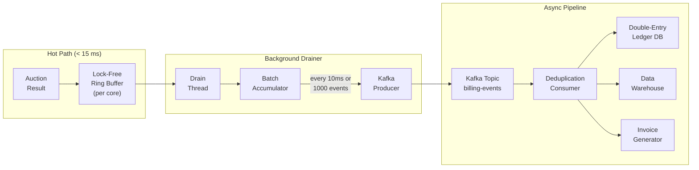
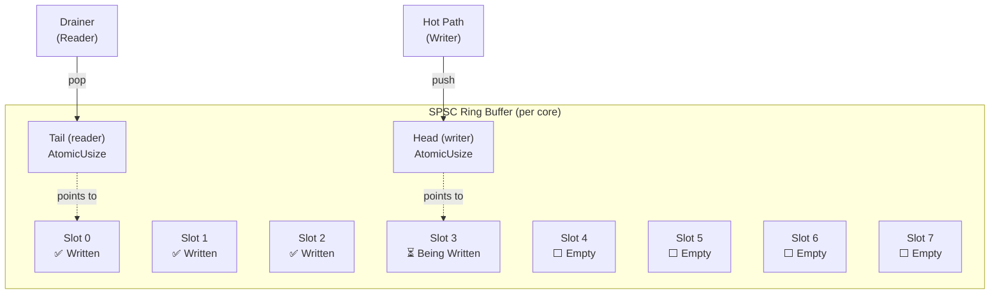
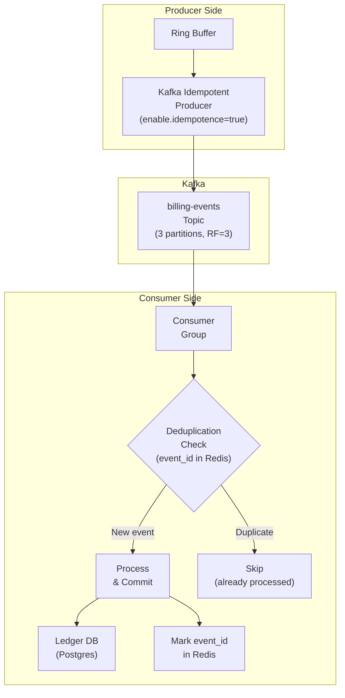
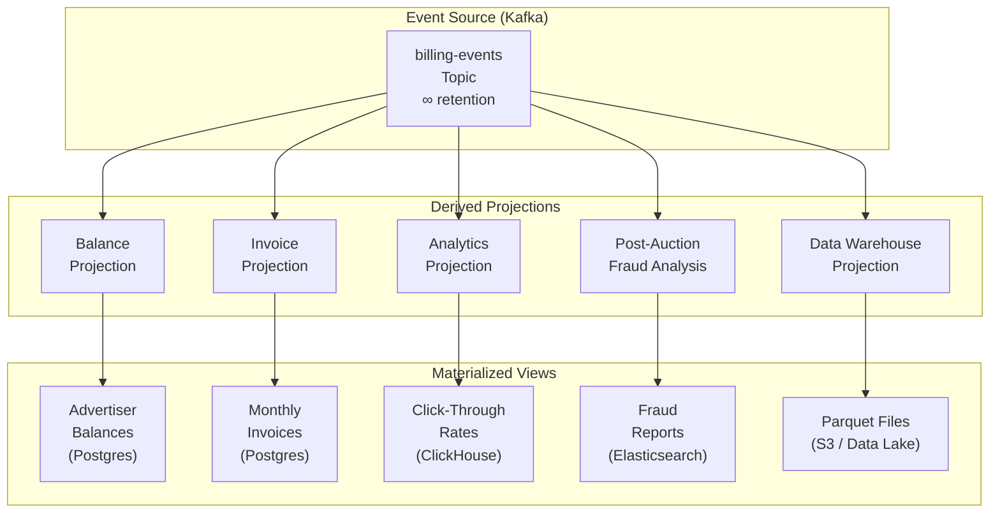
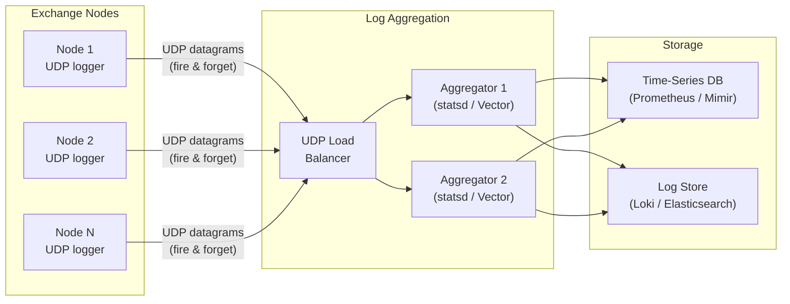

# Chapter 5: Asynchronous Billing and Event Sourcing 🔴

> **The Problem:** The auction has determined a winner. DSP #7 owes $2.51 for this impression. But you **cannot block the HTTP response** to update a billing ledger, call a payment processor, or even write to a database—you have < 200 µs of egress budget remaining. Meanwhile, you must guarantee **exactly-once billing**: charging the advertiser twice is a contractual violation, and failing to charge is lost revenue. How do you fire-and-forget a billing event from the hot path into an asynchronous pipeline with zero data loss?

---

## 5.1 Why Billing Must Be Asynchronous

The hot path has already consumed ~14.8 ms of the 15 ms budget. The egress phase has ~200 µs to serialize the response and send it. There is zero room for:

| Operation | Typical Latency | Verdict |
|---|---|---|
| PostgreSQL INSERT | 1–5 ms | ❌ Blocks the response |
| Redis INCR (billing counter) | 0.5–1 ms | ❌ Still too slow |
| HTTP call to payment API | 50–500 ms | ❌ Absurd |
| Kafka produce (network) | 0.5–2 ms | ❌ Network I/O on hot path |
| **In-process ring buffer write** | **< 1 µs** | ✅ **Lock-free, no syscall** |

The solution: write the billing event to a **lock-free, in-process ring buffer** that a background thread drains into Kafka. The hot path never touches the network for billing.



## 5.2 The Billing Event Schema

Every auction result produces an immutable billing event:

```rust,ignore
/// An immutable billing event. Once written, it never changes.
/// This is the source of truth for all downstream billing.
#[derive(Debug, Clone)]
struct BillingEvent {
    /// Globally unique event ID (UUIDv7 for time-ordered uniqueness).
    event_id: [u8; 16],
    
    /// Auction that produced this event.
    auction_id: [u8; 16],
    
    /// Wall-clock timestamp (nanosecond precision).
    timestamp_ns: u64,
    
    /// Event type.
    event_type: BillingEventType,
    
    /// The winning DSP/advertiser being charged.
    dsp_id: u32,
    advertiser_id: u32,
    
    /// Amount in microdollars.
    clearing_price_micros: u64,
    exchange_fee_micros: u64,       // Our take (e.g., 15%)
    publisher_payout_micros: u64,   // Publisher's share
    
    /// Context for reconciliation.
    publisher_id: u32,
    ad_slot_id: u32,
    creative_id: u64,
    deal_id: Option<u32>,
    
    /// User context (hashed for privacy).
    user_id_hash: [u8; 16],
    country: u16,
    device_type: u8,
    
    /// Exchange node that ran this auction (for debugging).
    node_id: u16,
}

#[derive(Debug, Clone, Copy)]
enum BillingEventType {
    /// The impression was served (primary billing event).
    Impression,
    /// The user clicked the ad (secondary, for CPC campaigns).
    Click,
    /// The user completed a conversion (tertiary, for CPA campaigns).
    Conversion,
}
```

## 5.3 Lock-Free Ring Buffer (SPSC)

The critical data structure is a **Single-Producer, Single-Consumer (SPSC) ring buffer**. It's lock-free because:

- **One writer** (the hot-path auction thread on a specific core).
- **One reader** (the background drainer thread for that core).
- No mutex, no `CAS` loop, no contention—just atomic loads and stores.



### Implementation: Naive vs. Production Ring Buffer

#### Naive: Mutex-Protected VecDeque

```rust,ignore
// ❌ Naive: Mutex-protected queue.
// Every push and pop acquires a lock — unacceptable on the hot path.

use std::collections::VecDeque;
use std::sync::Mutex;

struct NaiveBillingQueue {
    inner: Mutex<VecDeque<BillingEvent>>,
}

impl NaiveBillingQueue {
    fn push(&self, event: BillingEvent) {
        // 🔒 Lock acquisition: 50-500 ns (contended).
        // Under load, this becomes the bottleneck.
        let mut queue = self.inner.lock().unwrap();
        queue.push_back(event);
    }

    fn pop(&self) -> Option<BillingEvent> {
        let mut queue = self.inner.lock().unwrap();
        queue.pop_front()
    }
}
```

**Problems:**

1. **Mutex contention** — The hot-path writer and the background reader fight over the lock.
2. **Priority inversion** — If the reader holds the lock during a Kafka flush, the writer stalls.
3. **Unbounded growth** — No capacity limit; a slow reader causes OOM.
4. **Cache-line ping-pong** — The mutex's state bounces between cores.

#### Production: Lock-Free SPSC Ring Buffer

```rust,ignore
// ✅ Production: Lock-free SPSC ring buffer.
// The hot path writes in < 50 ns with zero contention.

use std::cell::UnsafeCell;
use std::sync::atomic::{AtomicUsize, Ordering};
use std::mem::MaybeUninit;

/// A fixed-capacity, lock-free, single-producer single-consumer ring buffer.
/// 
/// SAFETY: Only one thread may call `push`, and only one (different) thread
/// may call `pop`. Violating this is undefined behavior.
struct SpscRingBuffer<T> {
    /// The buffer storage. Capacity must be a power of two.
    buffer: Box<[UnsafeCell<MaybeUninit<T>>]>,
    /// Mask for fast modulo (capacity - 1).
    mask: usize,
    /// Write position (only modified by the producer).
    head: AtomicUsize,
    /// Read position (only modified by the consumer).
    tail: AtomicUsize,
}

// SAFETY: The SPSC contract ensures head/tail are only accessed
// by their respective threads. The buffer slots are accessed
// by the producer (write) and consumer (read) without overlap.
unsafe impl<T: Send> Send for SpscRingBuffer<T> {}
unsafe impl<T: Send> Sync for SpscRingBuffer<T> {}

impl<T> SpscRingBuffer<T> {
    /// Create a new ring buffer with the given capacity (rounded up to power of 2).
    fn new(capacity: usize) -> Self {
        let capacity = capacity.next_power_of_two();
        let buffer: Vec<_> = (0..capacity)
            .map(|_| UnsafeCell::new(MaybeUninit::uninit()))
            .collect();
        
        Self {
            buffer: buffer.into_boxed_slice(),
            mask: capacity - 1,
            head: AtomicUsize::new(0),
            tail: AtomicUsize::new(0),
        }
    }

    /// Push an item. Returns Err if the buffer is full.
    ///
    /// SAFETY: Must only be called from a single producer thread.
    fn push(&self, value: T) -> Result<(), T> {
        let head = self.head.load(Ordering::Relaxed);
        let tail = self.tail.load(Ordering::Acquire);

        // Check if buffer is full.
        if head.wrapping_sub(tail) >= self.buffer.len() {
            return Err(value); // Buffer full — caller must handle backpressure.
        }

        let slot = head & self.mask;
        // SAFETY: We verified the slot is empty (not yet consumed by reader).
        unsafe {
            (*self.buffer[slot].get()).write(value);
        }

        // Make the write visible to the consumer.
        self.head.store(head.wrapping_add(1), Ordering::Release);
        Ok(())
    }

    /// Pop an item. Returns None if the buffer is empty.
    ///
    /// SAFETY: Must only be called from a single consumer thread.
    fn pop(&self) -> Option<T> {
        let tail = self.tail.load(Ordering::Relaxed);
        let head = self.head.load(Ordering::Acquire);

        if tail == head {
            return None; // Buffer empty.
        }

        let slot = tail & self.mask;
        // SAFETY: We verified the slot has been written by the producer.
        let value = unsafe {
            (*self.buffer[slot].get()).assume_init_read()
        };

        // Make the read visible to the producer (frees the slot).
        self.tail.store(tail.wrapping_add(1), Ordering::Release);
        Some(value)
    }

    /// Current number of items in the buffer.
    fn len(&self) -> usize {
        let head = self.head.load(Ordering::Relaxed);
        let tail = self.tail.load(Ordering::Relaxed);
        head.wrapping_sub(tail)
    }

    /// Maximum capacity.
    fn capacity(&self) -> usize {
        self.buffer.len()
    }
}

impl<T> Drop for SpscRingBuffer<T> {
    fn drop(&mut self) {
        // Drop any remaining items in the buffer.
        while self.pop().is_some() {}
    }
}
```

### Performance Comparison

| Metric | `Mutex<VecDeque>` | SPSC Ring Buffer | Delta |
|---|---|---|---|
| Push latency (uncontended) | 80 ns | 15 ns | **5.3×** |
| Push latency (contended) | 200–2,000 ns | 15 ns | **13–133×** |
| Pop latency | 60 ns | 12 ns | **5×** |
| Cache lines touched (push) | 3+ (mutex, deque, alloc) | 1 (head + slot) | **3×** fewer |
| Allocations | Per-push (VecDeque resize) | Zero (fixed capacity) | ∞× better |
| Can block the writer? | Yes (lock contention) | **No** (never) | — |

## 5.4 The Drainer: Ring Buffer → Kafka

The background drainer thread reads events from the ring buffer and batches them for efficient Kafka production:

```rust,ignore
use std::time::{Duration, Instant};

/// Configuration for the drain loop.
const BATCH_SIZE: usize = 1_000;
const FLUSH_INTERVAL: Duration = Duration::from_millis(10);

/// The drainer runs on a dedicated thread (one per core).
fn drain_loop(
    ring: &SpscRingBuffer<BillingEvent>,
    kafka_producer: &KafkaProducer,
) {
    let mut batch: Vec<BillingEvent> = Vec::with_capacity(BATCH_SIZE);
    let mut last_flush = Instant::now();

    loop {
        // Drain as many events as available (non-blocking).
        while let Some(event) = ring.pop() {
            batch.push(event);
            if batch.len() >= BATCH_SIZE {
                break;
            }
        }

        // Flush if batch is full OR interval has elapsed.
        let should_flush = batch.len() >= BATCH_SIZE 
            || (last_flush.elapsed() >= FLUSH_INTERVAL && !batch.is_empty());

        if should_flush {
            // Serialize the batch to Kafka.
            if let Err(e) = kafka_producer.send_batch(&batch) {
                // CRITICAL: Don't lose events. Write to local WAL.
                write_to_local_wal(&batch, &e);
            }
            batch.clear();
            last_flush = Instant::now();
        } else if batch.is_empty() {
            // No events — yield CPU to avoid busy-spinning.
            std::thread::sleep(Duration::from_millis(1));
        }
    }
}

struct KafkaProducer;

impl KafkaProducer {
    fn send_batch(&self, _batch: &[BillingEvent]) -> Result<(), KafkaError> {
        // Use rdkafka with idempotent producer (exactly-once semantics).
        // Partition key: advertiser_id (ensures ordering per advertiser).
        Ok(())
    }
}

struct KafkaError;

/// Fallback: write events to a local Write-Ahead Log if Kafka is down.
/// A recovery process replays this on Kafka recovery.
fn write_to_local_wal(_batch: &[BillingEvent], _err: &KafkaError) {
    // Append-only file on local SSD.
    // Format: length-prefixed FlatBuffer records.
    // Recovery process scans and replays on Kafka recovery.
}
```

## 5.5 Exactly-Once Billing with Idempotency

The biggest risk in asynchronous billing is **double-charging**. If the Kafka producer retries a failed send, or a consumer crashes and re-reads a message, the advertiser could be charged twice. We prevent this with a multi-layer idempotency strategy:



### Idempotency Layers

| Layer | Mechanism | Protects Against |
|---|---|---|
| **Kafka Producer** | `enable.idempotence=true` | Network retry duplicates |
| **Kafka Exactly-Once** | Transactional produce (EOS) | Producer crash retries |
| **Consumer Deduplication** | `event_id` lookup in Redis (TTL 7 days) | Consumer rebalance replays |
| **Ledger Constraint** | UNIQUE constraint on `event_id` in Postgres | Any remaining duplicates |

```rust,ignore
/// Consumer-side deduplication with Redis.
async fn process_billing_event(
    event: &BillingEvent,
    redis: &redis::Client,
    ledger_db: &sqlx::PgPool,
) -> Result<(), BillingError> {
    let event_id_hex = hex::encode(event.event_id);
    
    // 1. Check Redis for duplicate (cost: < 0.5 ms).
    let mut conn = redis.get_async_connection().await?;
    let already_processed: bool = redis::cmd("SET")
        .arg(&event_id_hex)
        .arg("1")
        .arg("NX")           // Only set if not exists
        .arg("EX")
        .arg(7 * 86400)      // TTL: 7 days
        .query_async(&mut conn)
        .await
        .map(|result: Option<String>| result.is_none())?;

    if already_processed {
        // Duplicate event — skip.
        return Ok(());
    }

    // 2. Insert into the ledger (double-entry bookkeeping).
    insert_ledger_entries(event, ledger_db).await?;

    Ok(())
}

enum BillingError {
    Redis(redis::RedisError),
    Database(sqlx::Error),
}

impl From<redis::RedisError> for BillingError {
    fn from(e: redis::RedisError) -> Self { BillingError::Redis(e) }
}
impl From<sqlx::Error> for BillingError {
    fn from(e: sqlx::Error) -> Self { BillingError::Database(e) }
}

/// Double-entry bookkeeping: every charge creates two entries.
async fn insert_ledger_entries(
    event: &BillingEvent,
    pool: &sqlx::PgPool,
) -> Result<(), sqlx::Error> {
    let mut tx = pool.begin().await?;

    // Debit: Advertiser's account (they owe money).
    sqlx::query!(
        r#"INSERT INTO ledger_entries
           (event_id, account_id, account_type, direction, amount_micros, timestamp_ns)
           VALUES ($1, $2, 'advertiser', 'debit', $3, $4)
           ON CONFLICT (event_id, account_type) DO NOTHING"#,
        &event.event_id[..],
        event.advertiser_id as i64,
        event.clearing_price_micros as i64,
        event.timestamp_ns as i64,
    )
    .execute(&mut *tx)
    .await?;

    // Credit: Publisher's account (they earn money).
    sqlx::query!(
        r#"INSERT INTO ledger_entries
           (event_id, account_id, account_type, direction, amount_micros, timestamp_ns)
           VALUES ($1, $2, 'publisher', 'credit', $3, $4)
           ON CONFLICT (event_id, account_type) DO NOTHING"#,
        &event.event_id[..],
        event.publisher_id as i64,
        event.publisher_payout_micros as i64,
        event.timestamp_ns as i64,
    )
    .execute(&mut *tx)
    .await?;

    // Credit: Exchange's revenue account.
    sqlx::query!(
        r#"INSERT INTO ledger_entries
           (event_id, account_id, account_type, direction, amount_micros, timestamp_ns)
           VALUES ($1, $2, 'exchange', 'credit', $3, $4)
           ON CONFLICT (event_id, account_type) DO NOTHING"#,
        &event.event_id[..],
        0i64, // Exchange's own account
        event.exchange_fee_micros as i64,
        event.timestamp_ns as i64,
    )
    .execute(&mut *tx)
    .await?;

    tx.commit().await?;
    Ok(())
}
```

## 5.6 Backpressure: When the Ring Buffer Fills Up

If Kafka is down or the consumer falls behind, the ring buffer will fill. The hot path must handle this without crashing:

```rust,ignore
/// Backpressure strategy for the hot path.
fn emit_billing_event(
    ring: &SpscRingBuffer<BillingEvent>,
    event: BillingEvent,
    metrics: &BillingMetrics,
) {
    match ring.push(event) {
        Ok(()) => {
            metrics.events_emitted.fetch_add(1, Ordering::Relaxed);
        }
        Err(event) => {
            // Ring buffer is full — Kafka is likely down.
            // Strategy: Write to overflow file (local SSD).
            metrics.events_overflowed.fetch_add(1, Ordering::Relaxed);
            write_overflow_event(&event);
        }
    }
    
    // Monitor fill level for alerting.
    let fill_ratio = ring.len() as f64 / ring.capacity() as f64;
    if fill_ratio > 0.8 {
        metrics.backpressure_warnings.fetch_add(1, Ordering::Relaxed);
    }
}

fn write_overflow_event(_event: &BillingEvent) {
    // Append to a local overflow file for later replay.
    // This is the last-resort durability guarantee.
}

struct BillingMetrics {
    events_emitted: std::sync::atomic::AtomicU64,
    events_overflowed: std::sync::atomic::AtomicU64,
    backpressure_warnings: std::sync::atomic::AtomicU64,
}
```

### Backpressure Escalation Levels

| Fill Level | Action | Impact on Hot Path |
|---|---|---|
| 0–50% | Normal operation | None |
| 50–80% | Log warning, increase drain frequency | None |
| 80–95% | Alert on-call, start local overflow | None (overflow write < 5 µs) |
| 95–100% | Alert P1, events go to overflow only | +5 µs per event (SSD write) |
| Overflow file > 1 GB | Alert P0, consider shedding load | Circuit-break low-value auctions |

## 5.7 Event Sourcing: Rebuilding State from Events

The `billing-events` Kafka topic is an **event log**—the single source of truth. All derived state (account balances, invoices, analytics) is computed from this log:



### Benefits of Event Sourcing for Billing

| Benefit | Why It Matters |
|---|---|
| **Auditability** | Every charge can be traced to a specific auction event |
| **Replayability** | If a projection corrupts, rebuild it from the event log |
| **Retroactive correction** | Mark a fraudulent event as void; recompute balances |
| **Multi-consumer** | Analytics, billing, and fraud all read from the same log |
| **Temporal queries** | "What was the advertiser's balance at noon yesterday?" |

## 5.8 UDP Log Aggregation for Observability

In addition to billing events, the exchange produces **high-volume observability logs** (bid latencies, cache hit rates, DSP response codes). These use a separate, lossy UDP pipeline to avoid any impact on the billing hot path:



```rust,ignore
use std::net::UdpSocket;

/// Fire-and-forget UDP logger. Zero impact on the hot path.
/// Packet loss is acceptable — these are observability metrics, not billing.
struct UdpLogger {
    socket: UdpSocket,
    target: std::net::SocketAddr,
}

impl UdpLogger {
    fn new(target: &str) -> Self {
        let socket = UdpSocket::bind("0.0.0.0:0").unwrap();
        socket.set_nonblocking(true).unwrap();
        Self {
            socket,
            target: target.parse().unwrap(),
        }
    }

    /// Log a metric. Non-blocking, lossy, < 200 ns.
    fn log_metric(&self, name: &str, value: f64, tags: &[(&str, &str)]) {
        // StatsD format: "metric.name:value|g|#tag1:val1,tag2:val2"
        let mut buf = [0u8; 512];
        let len = format_statsd(&mut buf, name, value, tags);
        // Fire and forget — ignore send errors.
        let _ = self.socket.send_to(&buf[..len], self.target);
    }
}

fn format_statsd(
    buf: &mut [u8; 512],
    name: &str,
    value: f64,
    tags: &[(&str, &str)],
) -> usize {
    use std::io::Write;
    let mut cursor = std::io::Cursor::new(&mut buf[..]);
    let _ = write!(cursor, "{}:{:.6}|g", name, value);
    if !tags.is_empty() {
        let _ = write!(cursor, "|#");
        for (i, (k, v)) in tags.iter().enumerate() {
            if i > 0 { let _ = write!(cursor, ","); }
            let _ = write!(cursor, "{}:{}", k, v);
        }
    }
    cursor.position() as usize
}
```

## 5.9 End-to-End Pipeline: From Win to Invoice

Here's the complete billing flow for a single impression:

| Step | System | Latency | Guarantee |
|---|---|---|---|
| 1. Auction result | Hot path | 0 µs (inline) | — |
| 2. Write to ring buffer | SPSC buffer | < 50 ns | At-most-once (buffer full → overflow) |
| 3. Drain to Kafka | Background thread | 1–10 ms (batched) | At-least-once (retries) |
| 4. Consumer dedup | Kafka consumer + Redis | 1–5 ms | Exactly-once (NX + UNIQUE) |
| 5. Ledger write | Postgres | 5–20 ms | ACID transaction |
| 6. Balance update | Materialized view | 50–200 ms | Eventually consistent |
| 7. Invoice generation | Batch job (daily) | N/A | Computed from ledger |

**End-to-end latency** (event to ledger): **< 50 ms** (p99).
**Hot-path impact**: **< 50 ns** (ring buffer write only).

## 5.10 Exercises

<details>
<summary><strong>Exercise 1:</strong> Implement the SPSC ring buffer and test it with one producer thread pushing 10M events and one consumer thread popping them. Measure throughput (events/sec) and verify zero data loss.</summary>

```rust,ignore
// Hint: Use std::thread::scope and assert that total pushed == total popped.
// Expected throughput: > 100M events/sec on modern hardware.
// Key: the buffer capacity should be a power of 2 for fast modulo.
```

</details>

<details>
<summary><strong>Exercise 2:</strong> Build the drainer that batches events from the ring buffer and writes them to a file (simulating Kafka). Measure the batch-flush latency and verify that events are not lost when the drainer is slower than the producer.</summary>

Steps:
1. Produce 1M events at 10M/sec.
2. Consume with a drainer that sleeps 1ms per batch (simulating Kafka latency).
3. Verify the ring buffer fills up and the overflow strategy activates.
4. Verify all events are eventually consumed (from ring + overflow).

</details>

<details>
<summary><strong>Exercise 3:</strong> Implement consumer-side deduplication using a <code>HashSet</code> (simulating Redis). Generate 100K events where 5% are duplicates. Verify the deduplication correctly rejects all duplicates and processes all unique events exactly once.</summary>

Property: `unique_events_processed == total_events - duplicate_events`.

</details>

<details>
<summary><strong>Exercise 4:</strong> Implement the double-entry ledger insert using SQLite (for local testing). Verify that the sum of all debits equals the sum of all credits for every event.</summary>

Accounting invariant: $\sum{\text{debits}} = \sum{\text{credits}}$ for every `event_id`.

</details>

---

> **Key Takeaways**
>
> 1. **Never block the hot path for billing.** Use a lock-free SPSC ring buffer to fire billing events in < 50 ns. The background drainer handles Kafka production asynchronously.
> 2. **SPSC ring buffers are 5–100× faster than mutex-protected queues** because they use only `Acquire`/`Release` atomics— no locks, no CAS loops, no contention.
> 3. **Exactly-once billing requires four layers of defense:** Kafka idempotent producer, transactional EOS, consumer-side Redis deduplication, and a UNIQUE constraint in the ledger database.
> 4. **Backpressure must be explicit.** When the ring buffer fills (Kafka is down), overflow events go to local SSD. The hot path must never block or crash.
> 5. **Event sourcing makes billing auditable and replayable.** All derived state (balances, invoices, analytics) is computed from the immutable event log. Corrupted projections can be rebuilt.
> 6. **Observability logs use a separate UDP pipeline** — fire-and-forget, lossy, and zero impact on the billing path. Never mix billing durability with observability metrics.
