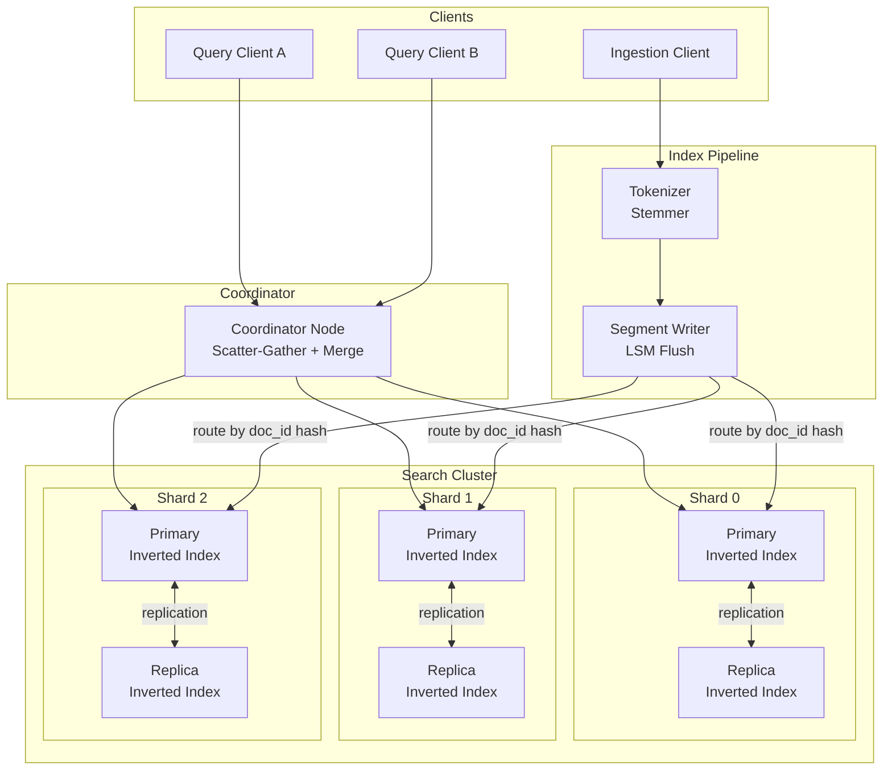

# System Design: Building a Distributed Search Engine in Rust

## Speaker Intro

This handbook is written from the perspective of a **Principal Search Architect** who has designed, deployed, and operated full-text search clusters processing billions of queries per day across petabyte-scale document corpora. The content draws from first-hand experience building search infrastructure at the intersection of information retrieval theory, systems programming, and distributed computing—where a 10 ms tail-latency regression translates directly into lost revenue.

## Who This Is For

- **Backend engineers** who have used Elasticsearch or Solr as a black box and want to understand the data structures and algorithms that power them.
- **Systems programmers** who want a concrete, end-to-end project (a distributed search engine) instead of isolated toy examples—one that exercises memory-mapped I/O, SIMD intrinsics, and async networking.
- **Architects evaluating Rust** for latency-critical data infrastructure and who need proof that the language can match or exceed C++ search engines (Lucene/Tantivy-class) in performance.
- **Anyone who has typed a query into a search bar** and wondered how results appear in under 50 ms across a corpus of 100 billion documents—and wants to know how to build that from scratch.

## Prerequisites

| Concept | Where to Learn |
|---|---|
| Intermediate Rust (ownership, traits, generics) | [Type System & Traits](../type-system-traits-book/src/SUMMARY.md) |
| `async`/`await` and the Tokio runtime | [Async Rust](../async-book/src/SUMMARY.md) |
| Basic data structures (hash maps, B-Trees, tries) | [Algorithms & Concurrency](../algorithms-concurrency-book/src/SUMMARY.md) |
| Familiarity with HTTP/gRPC service patterns | [API Design](../api-design-book/src/SUMMARY.md) |
| What a search engine does (indexing, querying, ranking) | Apache Lucene / Tantivy documentation |

## How to Use This Book

| Emoji | Meaning |
|---|---|
| 🟢 | **Architecture** — foundational data structures and design decisions |
| 🟡 | **Information Retrieval** — ranking algorithms, scoring models, and query processing |
| 🔴 | **Distributed Consensus** — sharding, replication, real-time indexing, and failure handling |

Each chapter tackles **one fundamental challenge** in search-engine design. Read them in order—later chapters assume the inverted index and scoring pipeline from earlier chapters exist.

## The Problem We Are Solving

> Design a **distributed, full-text search engine** capable of indexing **10 billion documents**, answering keyword and fuzzy queries in **< 50 ms at p99**, and supporting **near-real-time** document ingestion with sub-second visibility.

The system we will build has these non-negotiable requirements:

| Requirement | Target |
|---|---|
| Corpus size | 10 billion documents, ~8 TB raw text |
| Query latency (p99) | < 50 ms |
| Throughput (queries) | ≥ 10,000 QPS per cluster |
| Index freshness | < 1 second from ingest to searchable |
| Typo tolerance | Levenshtein distance ≤ 2, < 5 ms overhead |
| Availability | 99.99% — no single point of failure |

## Pacing Guide

| Chapter | Topic | Time | Checkpoint |
|---|---|---|---|
| Ch 0 | Introduction & Problem Statement | 30 min | Understand the design canvas |
| Ch 1 | The Inverted Index & Tokenization | 6–8 hours | Working inverted-index writer and reader with BM25-ready term stats |
| Ch 2 | Relevance and Scoring (BM25) | 5–7 hours | Ranked query results with SIMD-accelerated posting-list intersection |
| Ch 3 | Typo Tolerance (FSTs & Levenshtein) | 6–8 hours | FST-compressed dictionary with fuzzy matching under 5 ms |
| Ch 4 | Distributed Sharding & Replication | 6–8 hours | Scatter-gather query across a 3-shard cluster with replica failover |
| Ch 5 | Real-Time Indexing vs. Search Performance | 5–7 hours | LSM-based segment architecture with sub-second search visibility |

**Total: ~29–39 hours** of focused study.

## Table of Contents

### Part I: Core Index
- **Chapter 1 — The Inverted Index & Tokenization 🟢** — Why `LIKE '%foo%'` is a disaster at scale. Architecting the inverted index: text analysis pipelines (tokenization, stemming, stop-word removal), posting lists, and term dictionaries. Building a segment-based index writer in Rust.

### Part II: Ranking & Fuzzy Matching
- **Chapter 2 — Relevance and Scoring (BM25) 🟡** — How to rank results. Implementing TF-IDF and Okapi BM25 from first principles. Using bitsets and SIMD instructions to rapidly intersect posting lists for multi-term queries. Building a query executor that returns the top-$K$ results.
- **Chapter 3 — Typo Tolerance — FSTs and Levenshtein 🔴** — Implementing "Did you mean?" in sub-milliseconds. Building Finite State Transducers (FSTs) to compress the entire term dictionary into memory. Walking the FST with bounded Levenshtein automata for fuzzy matching.

### Part III: Distribution & Real-Time
- **Chapter 4 — Distributed Sharding and Replication 🔴** — Scaling beyond a single machine. Partitioning the index across shards via document-ID hashing. Architecting the scatter-gather query phase, merging top-$K$ results at the coordinator, and handling shard failures with replica promotion.
- **Chapter 5 — Real-Time Indexing vs. Search Performance 🔴** — The fundamental conflict between writers and readers. Implementing a Log-Structured Merge (LSM) approach: writing to in-memory segments, periodically flushing to immutable on-disk segments, and making new documents searchable within one second.

## Architecture Overview

## Companion Guides

This handbook builds on concepts from several other books in the Rust Training curriculum:

- [**Async Rust**](../async-book/src/SUMMARY.md) — The concurrency runtime underpinning the coordinator and shard servers.
- [**Hardware Sympathy**](../hardware-sympathy-book/src/SUMMARY.md) — Cache-line optimization and SIMD intrinsics used in posting-list intersection.
- [**Memory Management**](../memory-management-book/src/SUMMARY.md) — Memory-mapped files and arena allocation for the inverted index.
- [**Distributed Systems**](../distributed-systems-book/src/SUMMARY.md) — Consensus protocols and failure detection for the replication layer.
- [**System Design: Message Broker**](../system-design-book/src/SUMMARY.md) — A complementary system-design deep-dive covering io_uring, Raft, and backpressure.
