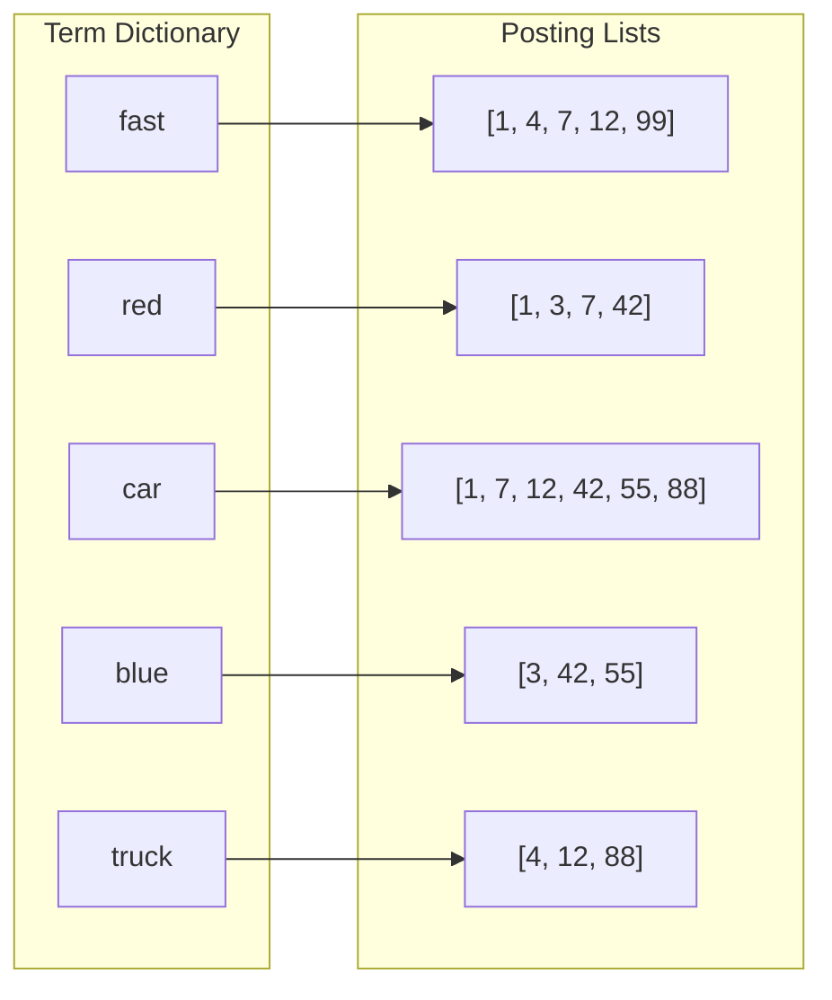
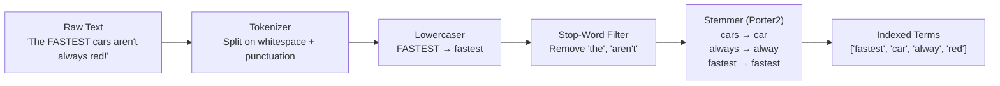
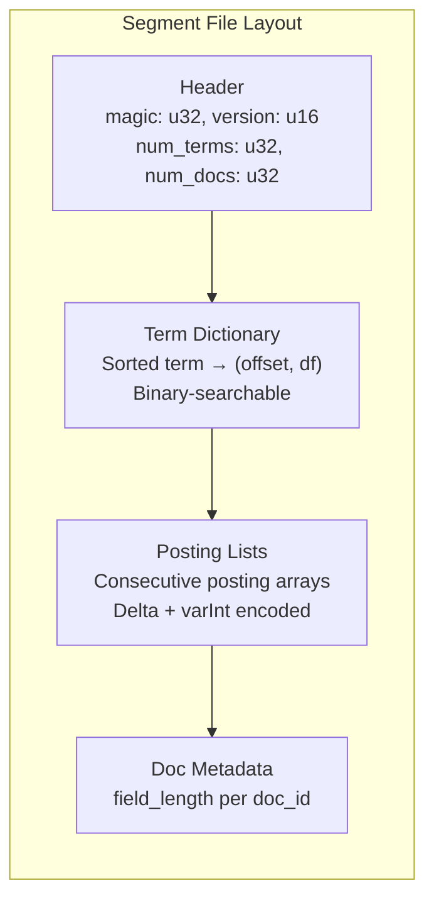

# 1. The Inverted Index & Tokenization 🟢

> **The Problem:** A naive full-text search uses `SELECT * FROM documents WHERE body LIKE '%search term%'`. This forces the database to perform a **sequential scan** of every row, comparing the pattern byte-by-byte against every document. For a corpus of 10 billion documents at ~800 bytes average, that is an 8 TB scan per query. At 10 GB/s NVMe read throughput, each query takes **13 minutes**. We need a data structure that answers "which documents contain this word?" in microseconds, not minutes.

---

## Why `LIKE '%foo%'` Is a Disaster

Let's quantify the cost. A SQL `LIKE '%foo%'` with a leading wildcard **cannot use a B-Tree index** because B-Trees order by prefix. The database must:

1. Read every row's text column (full table scan).
2. Run a substring search (e.g., Knuth-Morris-Pratt or `memmem`) on each.
3. Return matches.

| Approach | Corpus: 1 M docs | Corpus: 1 B docs | Corpus: 10 B docs |
|---|---|---|---|
| `LIKE '%foo%'` (sequential scan) | ~800 ms | ~13 min | ~130 min |
| Regex `.*foo.*` | ~1.2 s | ~20 min | ~200 min |
| **Inverted Index lookup** | **< 1 ms** | **< 5 ms** | **< 50 ms** |

The inverted index doesn't get slower by 1000× when the corpus grows by 1000×. It grows roughly as $O(\log N)$ for dictionary lookup plus $O(K)$ for reading the posting list, where $K$ is the number of matching documents—not the total corpus size.

---

## What Is an Inverted Index?

An inverted index is a map from **terms** (words) to **posting lists** (sorted arrays of document IDs that contain each term).



To answer the query **"fast red car"**, we:

1. Look up `fast` → `[1, 4, 7, 12, 99]`
2. Look up `red` → `[1, 3, 7, 42]`
3. Look up `car` → `[1, 7, 12, 42, 55, 88]`
4. **Intersect** the three sorted lists → `[1, 7]`

Documents 1 and 7 contain all three terms. This intersection takes $O(K_1 + K_2 + K_3)$ time using a merge-join, regardless of how many billions of documents exist in the total corpus.

---

## The Text Analysis Pipeline

Raw document text cannot be indexed directly. The string `"The FASTEST cars aren't always red!"` must become the terms `["fastest", "car", "alway", "red"]` through a multi-stage pipeline:



### Stage 1: Tokenization

Split the input into discrete tokens. The simplest approach splits on non-alphanumeric characters:

```rust,ignore
/// Split text into lowercase tokens on non-alphanumeric boundaries.
fn tokenize(text: &str) -> Vec<String> {
    text.split(|c: char| !c.is_alphanumeric())
        .filter(|s| !s.is_empty())
        .map(|s| s.to_lowercase())
        .collect()
}

#[test]
fn test_tokenize() {
    let tokens = tokenize("The FASTEST cars aren't always red!");
    assert_eq!(
        tokens,
        vec!["the", "fastest", "cars", "aren", "t", "always", "red"]
    );
}
```

### Stage 2: Stop-Word Removal

Stop words like "the", "is", "at", "and" appear in nearly every document. Including them in the index wastes space and provides zero discriminative value. A query for "the" would return every document in the corpus.

```rust,ignore
use std::collections::HashSet;
use std::sync::LazyLock;

static STOP_WORDS: LazyLock<HashSet<&'static str>> = LazyLock::new(|| {
    [
        "a", "an", "and", "are", "as", "at", "be", "but", "by", "for",
        "if", "in", "into", "is", "it", "no", "not", "of", "on", "or",
        "such", "that", "the", "their", "then", "there", "these", "they",
        "this", "to", "was", "will", "with",
    ]
    .into_iter()
    .collect()
});

fn remove_stop_words(tokens: Vec<String>) -> Vec<String> {
    tokens
        .into_iter()
        .filter(|t| !STOP_WORDS.contains(t.as_str()))
        .collect()
}
```

### Stage 3: Stemming

Stemming reduces inflected words to a common root so that "running", "runs", and "ran" all map to the same term. The **Porter2** (Snowball) stemmer is the industry standard:

```rust,ignore
use rust_stemmers::{Algorithm, Stemmer};

fn stem_tokens(tokens: Vec<String>) -> Vec<String> {
    let stemmer = Stemmer::create(Algorithm::English);
    tokens
        .into_iter()
        .map(|t| stemmer.stem(&t).into_owned())
        .collect()
}
```

### The Complete Analyzer

```rust,ignore
/// Full text-analysis pipeline: tokenize → lowercase → stop-word removal → stemming.
fn analyze(text: &str) -> Vec<String> {
    let tokens = tokenize(text);
    let filtered = remove_stop_words(tokens);
    stem_tokens(filtered)
}

#[test]
fn test_analyze() {
    let terms = analyze("The FASTEST cars aren't always red!");
    // "the" removed (stop word), "aren" removed (stop word "are"? no — let's see)
    // Actually: "aren" is not a stop word, "t" is not either.
    // After stemming: "fastest"→"fastest", "cars"→"car", "aren"→"aren", "t"→"t",
    //                 "always"→"alway", "red"→"red"
    assert!(terms.contains(&"car".to_string()));
    assert!(terms.contains(&"red".to_string()));
    assert!(!terms.contains(&"the".to_string()));
}
```

---

## Building the Inverted Index

### Data Structures

The index has two core structures:

1. **Term Dictionary** — Maps each unique term to metadata (document frequency, pointer to the posting list).
2. **Posting List** — A sorted `Vec<u32>` of document IDs for a given term, plus per-document metadata needed for scoring (term frequency, field length).

```rust,ignore
use std::collections::HashMap;

/// Metadata stored per document occurrence within a posting list.
#[derive(Debug, Clone)]
struct Posting {
    doc_id: u32,
    term_frequency: u32,  // How many times this term appears in this doc
    field_length: u32,     // Total number of terms in this doc (for BM25)
}

/// A posting list: sorted by doc_id for efficient intersection.
#[derive(Debug, Clone, Default)]
struct PostingList {
    postings: Vec<Posting>,
}

/// Per-term metadata in the dictionary.
#[derive(Debug, Clone)]
struct TermEntry {
    document_frequency: u32,  // Number of docs containing this term
    posting_list: PostingList,
}

/// The complete inverted index.
struct InvertedIndex {
    /// Term → entry mapping.
    dictionary: HashMap<String, TermEntry>,
    /// Total number of documents indexed.
    total_docs: u32,
    /// Sum of all document lengths (for average doc length in BM25).
    total_field_lengths: u64,
}
```

### The Naive Approach: Regex Scan

```rust,ignore
use regex::Regex;

/// 💥 DISASTER: Scan every document with a regex for every query.
fn search_naive(documents: &[String], query: &str) -> Vec<usize> {
    // 💥 Compiles a new regex per query — not even cached.
    let pattern = Regex::new(&format!("(?i){}", regex::escape(query))).unwrap();

    documents
        .iter()
        .enumerate()
        .filter(|(_, doc)| pattern.is_match(doc))
        .map(|(id, _)| id)
        .collect()
}
// At 10B docs × 800 bytes avg = full scan of 8 TB per query.
// Even at 10 GB/s, this is ~13 minutes.
```

### The Inverted Index Approach: Build Once, Query Forever

```rust,ignore
impl InvertedIndex {
    fn new() -> Self {
        Self {
            dictionary: HashMap::new(),
            total_docs: 0,
            total_field_lengths: 0,
        }
    }

    /// Index a single document.
    fn add_document(&mut self, doc_id: u32, text: &str) {
        let terms = analyze(text);
        let field_length = terms.len() as u32;

        // Count term frequencies within this document.
        let mut term_freqs: HashMap<&str, u32> = HashMap::new();
        for term in &terms {
            *term_freqs.entry(term.as_str()).or_insert(0) += 1;
        }

        // Update the index for each unique term.
        for (term, tf) in term_freqs {
            let entry = self.dictionary
                .entry(term.to_string())
                .or_insert_with(|| TermEntry {
                    document_frequency: 0,
                    posting_list: PostingList::default(),
                });

            entry.document_frequency += 1;
            entry.posting_list.postings.push(Posting {
                doc_id,
                term_frequency: tf,
                field_length,
            });
        }

        self.total_docs += 1;
        self.total_field_lengths += field_length as u64;
    }

    /// Retrieve the posting list for a term.
    fn get_postings(&self, term: &str) -> Option<&PostingList> {
        self.dictionary.get(term).map(|e| &e.posting_list)
    }

    /// Average document length across the corpus.
    fn avg_doc_length(&self) -> f64 {
        if self.total_docs == 0 {
            return 0.0;
        }
        self.total_field_lengths as f64 / self.total_docs as f64
    }
}
```

---

## Posting List Intersection

A multi-term query like "fast red car" requires intersecting multiple posting lists. Since posting lists are sorted by `doc_id`, we can use a **merge-intersection** algorithm that runs in $O(K_1 + K_2 + \ldots + K_n)$ time.

### Sorted Merge Intersection (Two Lists)

```rust,ignore
/// Intersect two posting lists using a two-pointer merge.
/// Both lists must be sorted by doc_id.
fn intersect_two(a: &[Posting], b: &[Posting]) -> Vec<(Posting, Posting)> {
    let mut result = Vec::new();
    let (mut i, mut j) = (0, 0);

    while i < a.len() && j < b.len() {
        match a[i].doc_id.cmp(&b[j].doc_id) {
            std::cmp::Ordering::Equal => {
                result.push((a[i].clone(), b[j].clone()));
                i += 1;
                j += 1;
            }
            std::cmp::Ordering::Less => i += 1,
            std::cmp::Ordering::Greater => j += 1,
        }
    }

    result
}
```

### Multi-Way Intersection Strategy

For queries with $n$ terms, intersect the shortest posting list first to minimize work:

```rust,ignore
impl InvertedIndex {
    /// Execute a multi-term AND query.
    /// Returns doc_ids that contain ALL query terms.
    fn search_and(&self, query: &str) -> Vec<u32> {
        let terms = analyze(query);
        if terms.is_empty() {
            return vec![];
        }

        // Gather posting lists and sort by length (shortest first).
        let mut postings: Vec<&PostingList> = terms
            .iter()
            .filter_map(|t| self.get_postings(t))
            .collect();

        if postings.len() != terms.len() {
            // At least one term has no posting list — no documents match.
            return vec![];
        }

        postings.sort_by_key(|p| p.postings.len());

        // Start with the shortest list and progressively intersect.
        let mut result_ids: Vec<u32> = postings[0]
            .postings
            .iter()
            .map(|p| p.doc_id)
            .collect();

        for posting_list in &postings[1..] {
            let other_ids: Vec<u32> = posting_list
                .postings
                .iter()
                .map(|p| p.doc_id)
                .collect();

            result_ids = merge_intersect_ids(&result_ids, &other_ids);

            if result_ids.is_empty() {
                break; // Early termination: no documents can match.
            }
        }

        result_ids
    }
}

/// Intersect two sorted doc_id arrays.
fn merge_intersect_ids(a: &[u32], b: &[u32]) -> Vec<u32> {
    let mut result = Vec::new();
    let (mut i, mut j) = (0, 0);
    while i < a.len() && j < b.len() {
        match a[i].cmp(&b[j]) {
            std::cmp::Ordering::Equal => {
                result.push(a[i]);
                i += 1;
                j += 1;
            }
            std::cmp::Ordering::Less => i += 1,
            std::cmp::Ordering::Greater => j += 1,
        }
    }
    result
}
```

---

## On-Disk Layout: The Segment

An in-memory `HashMap` works for prototyping but cannot hold a 10-billion-document index (~2 TB term data). The production design writes the index to disk as an immutable **segment**:



### Delta Encoding and Variable-Length Integers

Posting lists contain sorted document IDs like `[1, 7, 12, 42, 55, 88]`. Storing raw `u32` values wastes space. Instead, we store **deltas**: `[1, 6, 5, 30, 13, 33]`. Deltas are smaller and compress well with variable-length integer encoding.

```rust,ignore
/// Encode a sorted slice of doc_ids as delta-encoded varints.
fn encode_posting_list(doc_ids: &[u32]) -> Vec<u8> {
    let mut buf = Vec::with_capacity(doc_ids.len() * 2);
    let mut prev = 0u32;

    for &id in doc_ids {
        let delta = id - prev;
        encode_varint(delta, &mut buf);
        prev = id;
    }

    buf
}

/// Decode a delta-encoded varint stream back to doc_ids.
fn decode_posting_list(data: &[u8]) -> Vec<u32> {
    let mut doc_ids = Vec::new();
    let mut pos = 0;
    let mut prev = 0u32;

    while pos < data.len() {
        let (delta, bytes_read) = decode_varint(&data[pos..]);
        prev += delta;
        doc_ids.push(prev);
        pos += bytes_read;
    }

    doc_ids
}

/// Encode a u32 as a variable-length integer (1–5 bytes).
/// Each byte uses 7 bits for data and 1 continuation bit.
fn encode_varint(mut value: u32, buf: &mut Vec<u8>) {
    while value >= 0x80 {
        buf.push((value as u8 & 0x7F) | 0x80);
        value >>= 7;
    }
    buf.push(value as u8);
}

/// Decode a varint, returning (value, bytes_consumed).
fn decode_varint(data: &[u8]) -> (u32, usize) {
    let mut result: u32 = 0;
    let mut shift = 0;
    for (i, &byte) in data.iter().enumerate() {
        result |= ((byte & 0x7F) as u32) << shift;
        if byte & 0x80 == 0 {
            return (result, i + 1);
        }
        shift += 7;
    }
    (result, data.len())
}
```

### Space Savings

| Encoding | 1M postings | Avg. bytes/ID |
|---|---|---|
| Raw `u32` | 4 MB | 4.00 |
| Delta + VarInt | ~1.2 MB | ~1.20 |
| Delta + VarInt + Bitpacking (128-block) | ~0.6 MB | ~0.60 |

For 10 billion documents with an average of 200 unique terms per doc, the total posting data is ~2 trillion entries. At 0.6 bytes per entry, that is **~1.2 TB**—feasible to distribute across a cluster.

---

## Segment Writer

The segment writer takes an in-memory inverted index and serializes it to disk:

```rust,ignore
use std::io::{BufWriter, Write, Seek, SeekFrom};
use std::fs::File;
use std::path::Path;

const SEGMENT_MAGIC: u32 = 0x53524348; // "SRCH"
const SEGMENT_VERSION: u16 = 1;

struct SegmentWriter {
    path: std::path::PathBuf,
}

impl SegmentWriter {
    fn write_segment(&self, index: &InvertedIndex) -> std::io::Result<()> {
        let file = File::create(&self.path)?;
        let mut w = BufWriter::new(file);

        // -- Header --
        w.write_all(&SEGMENT_MAGIC.to_le_bytes())?;
        w.write_all(&SEGMENT_VERSION.to_le_bytes())?;
        w.write_all(&(index.dictionary.len() as u32).to_le_bytes())?;
        w.write_all(&index.total_docs.to_le_bytes())?;

        // Sort terms for binary-searchable dictionary.
        let mut sorted_terms: Vec<(&String, &TermEntry)> =
            index.dictionary.iter().collect();
        sorted_terms.sort_by(|a, b| a.0.cmp(b.0));

        // -- Pass 1: Write posting lists, record offsets --
        let postings_start = w.stream_position()?;
        let mut term_offsets: Vec<(String, u64, u32)> = Vec::new(); // (term, offset, df)

        // Skip space for dictionary (we'll backfill).
        // For now, write postings first.
        let dict_placeholder_size =
            sorted_terms.len() * (4 + 64 + 8 + 4); // rough estimate
        let dict_section_offset = w.stream_position()?;
        // We'll write dictionary after postings; restructure for two-pass.

        let mut posting_data: Vec<(String, Vec<u8>, u32)> = Vec::new();

        for (term, entry) in &sorted_terms {
            let doc_ids: Vec<u32> = entry
                .posting_list
                .postings
                .iter()
                .map(|p| p.doc_id)
                .collect();
            let encoded = encode_posting_list(&doc_ids);
            posting_data.push((
                term.to_string(),
                encoded,
                entry.document_frequency,
            ));
        }

        // Write all posting blobs and record their byte offsets.
        let mut posting_offsets: Vec<(String, u64, u32, u32)> = Vec::new();
        for (term, data, df) in &posting_data {
            let offset = w.stream_position()?;
            w.write_all(data)?;
            posting_offsets.push((
                term.clone(),
                offset,
                *df,
                data.len() as u32,
            ));
        }

        // -- Pass 2: Write sorted dictionary --
        let dict_offset = w.stream_position()?;
        for (term, offset, df, len) in &posting_offsets {
            let term_bytes = term.as_bytes();
            w.write_all(&(term_bytes.len() as u16).to_le_bytes())?;
            w.write_all(term_bytes)?;
            w.write_all(&offset.to_le_bytes())?;  // u64: byte offset to posting data
            w.write_all(&df.to_le_bytes())?;       // u32: document frequency
            w.write_all(&len.to_le_bytes())?;      // u32: posting blob length
        }

        // -- Footer: pointer to dictionary --
        w.write_all(&dict_offset.to_le_bytes())?;

        w.flush()?;
        Ok(())
    }
}
```

---

## Segment Reader with Memory-Mapped I/O

For query-time reads, we memory-map the segment file so the OS page cache handles caching automatically:

```rust,ignore
use memmap2::Mmap;
use std::fs::File;

struct SegmentReader {
    mmap: Mmap,
    num_terms: u32,
    num_docs: u32,
    dict_offset: u64,
}

impl SegmentReader {
    fn open(path: &Path) -> std::io::Result<Self> {
        let file = File::open(path)?;
        // SAFETY: The segment file is immutable after creation.
        let mmap = unsafe { Mmap::map(&file)? };

        // Read header.
        let magic = u32::from_le_bytes(mmap[0..4].try_into().unwrap());
        assert_eq!(magic, SEGMENT_MAGIC, "Invalid segment file");

        let num_terms = u32::from_le_bytes(mmap[6..10].try_into().unwrap());
        let num_docs = u32::from_le_bytes(mmap[10..14].try_into().unwrap());

        // Read footer: dictionary offset is the last 8 bytes.
        let footer_start = mmap.len() - 8;
        let dict_offset = u64::from_le_bytes(
            mmap[footer_start..footer_start + 8].try_into().unwrap(),
        );

        Ok(Self {
            mmap,
            num_terms,
            num_docs,
            dict_offset,
        })
    }

    /// Binary search the sorted dictionary for a term.
    /// Returns (posting_offset, posting_length, document_frequency).
    fn lookup_term(&self, target: &str) -> Option<(u64, u32, u32)> {
        // Walk the dictionary entries sequentially for now.
        // A production engine would use an FST (Chapter 3) or
        // a compact prefix-sorted block format with binary search.
        let mut pos = self.dict_offset as usize;
        let end = self.mmap.len() - 8; // before footer

        while pos < end {
            let term_len = u16::from_le_bytes(
                self.mmap[pos..pos + 2].try_into().unwrap(),
            ) as usize;
            pos += 2;

            let term = std::str::from_utf8(&self.mmap[pos..pos + term_len])
                .unwrap_or("");
            pos += term_len;

            let offset = u64::from_le_bytes(
                self.mmap[pos..pos + 8].try_into().unwrap(),
            );
            pos += 8;

            let df = u32::from_le_bytes(
                self.mmap[pos..pos + 4].try_into().unwrap(),
            );
            pos += 4;

            let len = u32::from_le_bytes(
                self.mmap[pos..pos + 4].try_into().unwrap(),
            );
            pos += 4;

            if term == target {
                return Some((offset, len, df));
            }
            if term > target {
                return None; // Past the target in sorted order.
            }
        }

        None
    }

    /// Read and decode a posting list from the segment.
    fn read_posting_list(&self, offset: u64, length: u32) -> Vec<u32> {
        let start = offset as usize;
        let end = start + length as usize;
        decode_posting_list(&self.mmap[start..end])
    }
}
```

---

## Performance Characteristics

| Operation | Complexity | Latency (10B docs, NVMe) |
|---|---|---|
| Term lookup (dictionary) | $O(\log T)$ where $T$ = unique terms | ~2 µs (FST) / ~10 µs (binary search) |
| Read posting list | $O(K)$ where $K$ = matching docs | ~50 µs for 10,000 postings |
| Intersect 2 posting lists | $O(K_1 + K_2)$ | ~20 µs for 10K × 10K |
| Intersect 3 posting lists | $O(K_1 + K_2 + K_3)$ | ~30 µs (shortest-first) |
| Full query (3 terms) | Lookup + intersect + score | **< 1 ms** |

### Index Size Estimates (10B Documents)

| Component | Size |
|---|---|
| Term dictionary (~50M unique terms) | ~400 MB (FST-compressed, Ch 3) |
| Posting lists (delta + varint) | ~1.2 TB |
| Document metadata (field lengths) | ~40 GB |
| **Total** | **~1.24 TB** |

Distributed across 16 shards (Chapter 4), each shard holds ~80 GB of index data—easily fits on a single NVMe SSD.

---

## Worked Example

Let's trace through indexing and querying a tiny corpus:

```rust,ignore
fn main() {
    let mut index = InvertedIndex::new();

    // Index 5 documents.
    index.add_document(0, "The quick brown fox jumps over the lazy dog");
    index.add_document(1, "A fast red car zoomed past the slow truck");
    index.add_document(2, "The dog chased the red car down the street");
    index.add_document(3, "Quick brown dogs are faster than lazy cats");
    index.add_document(4, "The red truck was not as fast as the car");

    // Query: "fast red car"
    let results = index.search_and("fast red car");
    // After analysis: "fast" → "fast", "red" → "red", "car" → "car"
    //
    // Posting lists:
    //   "fast" → [1, 4]         (docs mentioning "fast")
    //   "red"  → [1, 2, 4]     (docs mentioning "red")
    //   "car"  → [1, 2, 4]     (docs mentioning "car")
    //
    // Intersect shortest-first: [1, 4] ∩ [1, 2, 4] = [1, 4]
    //                           [1, 4] ∩ [1, 2, 4] = [1, 4]
    //
    // Result: documents 1 and 4.
    println!("Matching documents: {:?}", results);
    // Output: Matching documents: [1, 4]
}
```

---

> **Key Takeaways**
>
> 1. **An inverted index converts O(N) full-corpus scans into O(K) posting-list reads.** This is the single most important data structure in search—it makes sub-millisecond queries possible over billions of documents.
> 2. **Text analysis determines recall.** Without lowercasing, stemming, and stop-word removal, the query "Cars" won't match a document containing "car". The analyzer is not an afterthought—it is part of the index contract.
> 3. **Sorted posting lists enable merge-intersection.** By keeping document IDs sorted, multi-term AND queries reduce to a linear merge. Intersecting shortest-first minimizes comparisons.
> 4. **Delta + varint encoding compresses posting lists by 6–7×.** Storing deltas between consecutive doc IDs produces small integers that compress efficiently, reducing the 10B-document index from ~8 TB (raw) to ~1.2 TB.
> 5. **Immutable segment files enable memory-mapped reads.** Once written, a segment never changes, so `mmap` lets the OS page cache manage hot data automatically with zero-copy reads.
