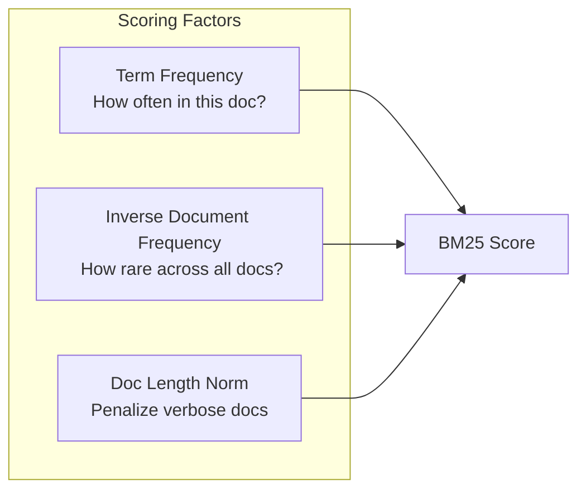
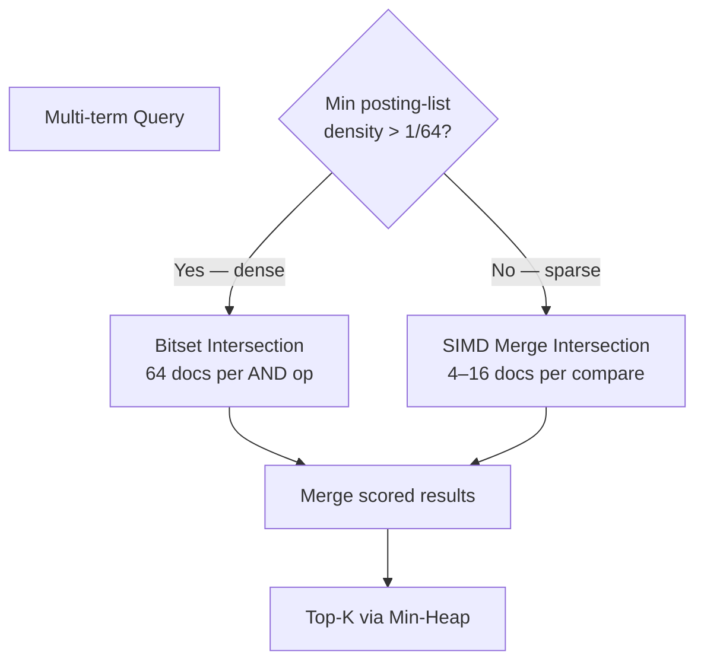
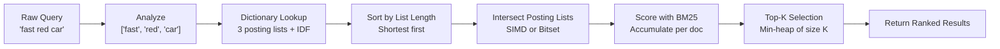

# 2. Relevance and Scoring (BM25) 🟡

> **The Problem:** Chapter 1 tells us *which* documents match a query, but not *how well* they match. A search for "distributed systems" should rank a 20-page paper titled "Distributed Systems for Practitioners" above a blog post that mentions "distributed" once in a 10,000-word article about cooking. Without a scoring function, every matching document is equally "relevant"—which is the same as no relevance at all.

---

## From Boolean Matching to Ranking

The inverted index from Chapter 1 answers a boolean question: *does this document contain these terms?* But users expect **ranked** results. The core insight of information retrieval is that relevance depends on three factors:

1. **Term Frequency (TF):** A document that mentions "distributed" 15 times is more likely to be *about* distributed systems than one that mentions it once.
2. **Inverse Document Frequency (IDF):** A term that appears in only 100 out of 10 billion documents is far more discriminative than one that appears in 5 billion. The word "the" appears everywhere and carries zero signal.
3. **Document Length Normalization:** A 50-word document mentioning "distributed" 3 times is more focused than a 50,000-word document mentioning it 3 times.



---

## TF-IDF: The Foundation

The classic **TF-IDF** score for a term $t$ in document $d$ is:

$$\text{TF-IDF}(t, d) = \text{tf}(t, d) \times \log\!\left(\frac{N}{\text{df}(t)}\right)$$

Where:
- $\text{tf}(t, d)$ = raw count of term $t$ in document $d$
- $N$ = total number of documents in the corpus
- $\text{df}(t)$ = number of documents containing term $t$

For a multi-term query $Q = \{q_1, q_2, \ldots, q_n\}$, the score is the sum:

$$\text{score}(d, Q) = \sum_{t \in Q} \text{TF-IDF}(t, d)$$

### The Problem with Raw TF-IDF

Raw TF-IDF has two flaws:

| Flaw | Example |
|---|---|
| **TF is unbounded** | A document mentioning "rust" 1000× gets 100× the score of one mentioning it 10×. But is it really 100× more relevant? |
| **No length normalization** | A 100,000-word document naturally has more term occurrences than a 100-word document, even if both are equally focused. |

---

## Okapi BM25: The Industry Standard

**BM25** (Best Matching 25) fixes both problems with a **saturating TF function** and **document-length normalization**:

$$\text{BM25}(d, Q) = \sum_{t \in Q} \text{IDF}(t) \cdot \frac{\text{tf}(t,d) \cdot (k_1 + 1)}{\text{tf}(t,d) + k_1 \cdot \left(1 - b + b \cdot \frac{|d|}{\text{avgdl}}\right)}$$

Where:
- $k_1 = 1.2$ (controls TF saturation — higher means TF matters more)
- $b = 0.75$ (controls length normalization — 0 = none, 1 = full)
- $|d|$ = length of document $d$ (number of terms)
- $\text{avgdl}$ = average document length across the corpus
- $\text{IDF}(t) = \ln\!\left(\frac{N - \text{df}(t) + 0.5}{\text{df}(t) + 0.5} + 1\right)$

### Why BM25 Works

| Property | TF-IDF | BM25 |
|---|---|---|
| TF scaling | Linear (unbounded) | Saturating (asymptotic to $k_1 + 1$) |
| Length normalization | None | Parameterized via $b$ |
| IDF formula | $\log(N / \text{df})$ | $\ln\!\left(\frac{N - \text{df} + 0.5}{\text{df} + 0.5} + 1\right)$ — smoother for rare terms |
| Industry adoption | Textbook baseline | Elasticsearch, Lucene, Tantivy, Meilisearch |

The saturation curve is the key insight: going from TF=1 to TF=2 doubles relevance, but going from TF=100 to TF=200 barely moves the score. This matches human intuition—mentioning a topic twice is meaningfully more relevant than once, but the 150th mention adds nothing.

---

## Implementing BM25 in Rust

### Scoring a Single Term–Document Pair

```rust,ignore
/// BM25 parameters — the standard defaults used by Elasticsearch and Lucene.
const K1: f64 = 1.2;
const B: f64 = 0.75;

/// Compute the IDF component for a term.
fn idf(total_docs: u32, doc_freq: u32) -> f64 {
    let n = total_docs as f64;
    let df = doc_freq as f64;
    ((n - df + 0.5) / (df + 0.5) + 1.0).ln()
}

/// Compute the BM25 score contribution of a single term in a single document.
fn bm25_term_score(
    tf: u32,
    doc_length: u32,
    avg_doc_length: f64,
    total_docs: u32,
    doc_freq: u32,
) -> f64 {
    let tf = tf as f64;
    let dl = doc_length as f64;

    let idf_val = idf(total_docs, doc_freq);
    let tf_norm = (tf * (K1 + 1.0)) / (tf + K1 * (1.0 - B + B * dl / avg_doc_length));

    idf_val * tf_norm
}
```

### Scoring a Full Query

```rust,ignore
use std::collections::BinaryHeap;
use std::cmp::Ordering;

/// A scored document result.
#[derive(Debug, Clone)]
struct ScoredDoc {
    doc_id: u32,
    score: f64,
}

impl PartialEq for ScoredDoc {
    fn eq(&self, other: &Self) -> bool {
        self.doc_id == other.doc_id
    }
}

impl Eq for ScoredDoc {}

/// Min-heap ordering: we want the *lowest* score at the top
/// so we can efficiently evict the worst result when the heap is full.
impl PartialOrd for ScoredDoc {
    fn partial_cmp(&self, other: &Self) -> Option<Ordering> {
        Some(self.cmp(other))
    }
}

impl Ord for ScoredDoc {
    fn cmp(&self, other: &Self) -> Ordering {
        // Reverse ordering for min-heap.
        self.score
            .partial_cmp(&other.score)
            .unwrap_or(Ordering::Equal)
    }
}

impl InvertedIndex {
    /// Execute a ranked BM25 query, returning the top K results.
    fn search_top_k(&self, query: &str, k: usize) -> Vec<ScoredDoc> {
        let terms = analyze(query);
        if terms.is_empty() {
            return vec![];
        }

        let avg_dl = self.avg_doc_length();

        // Collect term info: posting list + IDF.
        let term_info: Vec<(&PostingList, f64)> = terms
            .iter()
            .filter_map(|t| {
                let entry = self.dictionary.get(t)?;
                let idf_val = idf(self.total_docs, entry.document_frequency);
                Some((&entry.posting_list, idf_val))
            })
            .collect();

        if term_info.is_empty() {
            return vec![];
        }

        // Accumulate BM25 scores per document using a hash map.
        let mut scores: HashMap<u32, f64> = HashMap::new();

        for (posting_list, idf_val) in &term_info {
            for posting in &posting_list.postings {
                let tf = posting.term_frequency as f64;
                let dl = posting.field_length as f64;
                let tf_norm = (tf * (K1 + 1.0))
                    / (tf + K1 * (1.0 - B + B * dl / avg_dl));
                let term_score = idf_val * tf_norm;

                *scores.entry(posting.doc_id).or_insert(0.0) += term_score;
            }
        }

        // Extract top K using a min-heap of size K.
        let mut heap: BinaryHeap<ScoredDoc> = BinaryHeap::new();

        for (doc_id, score) in scores {
            let doc = ScoredDoc { doc_id, score };
            if heap.len() < k {
                heap.push(doc);
            } else if let Some(min) = heap.peek() {
                if score > min.score {
                    heap.pop();
                    heap.push(doc);
                }
            }
        }

        // Return sorted by score descending.
        let mut results: Vec<ScoredDoc> = heap.into_vec();
        results.sort_by(|a, b| {
            b.score
                .partial_cmp(&a.score)
                .unwrap_or(Ordering::Equal)
        });
        results
    }
}
```

---

## SIMD-Accelerated Posting List Intersection

For high-throughput search engines processing 10,000+ QPS, posting-list intersection becomes the CPU bottleneck. Each query may intersect lists containing millions of doc IDs. Modern CPUs have **SIMD** (Single Instruction, Multiple Data) instructions that can compare 4–16 integers in a single clock cycle.

### The Scalar Baseline

```rust,ignore
/// Scalar two-pointer intersection — processes one doc_id at a time.
fn intersect_scalar(a: &[u32], b: &[u32]) -> Vec<u32> {
    let mut result = Vec::new();
    let (mut i, mut j) = (0, 0);

    while i < a.len() && j < b.len() {
        if a[i] == b[j] {
            result.push(a[i]);
            i += 1;
            j += 1;
        } else if a[i] < b[j] {
            i += 1;
        } else {
            j += 1;
        }
    }
    result
}
```

This processes one comparison per cycle. On modern hardware, we can do **4× better** with SSE4.2 or **16× better** with AVX-512.

### SIMD Intersection with `std::simd` (Nightly)

```rust,ignore
#![feature(portable_simd)]
use std::simd::{u32x4, SimdPartialEq, ToBitMask};

/// SIMD-accelerated intersection of two sorted u32 slices.
/// Processes 4 elements from `a` against 4 elements from `b` simultaneously.
///
/// Requires: both slices are sorted in ascending order.
fn intersect_simd(a: &[u32], b: &[u32]) -> Vec<u32> {
    let mut result = Vec::with_capacity(a.len().min(b.len()));
    let (mut i, mut j) = (0usize, 0usize);

    // SIMD fast path: process 4 elements at a time.
    while i + 4 <= a.len() && j + 4 <= b.len() {
        let va = u32x4::from_slice(&a[i..i + 4]);
        let vb = u32x4::from_slice(&b[j..j + 4]);

        // Check all 4×4 = 16 pairs for equality.
        // We broadcast each element of `va` and compare against `vb`.
        for lane in 0..4 {
            let broadcast = u32x4::splat(a[i + lane]);
            let mask = broadcast.simd_eq(vb).to_bitmask();
            if mask != 0 {
                result.push(a[i + lane]);
            }
        }

        // Advance the pointer for the list with the smaller max element.
        if a[i + 3] < b[j + 3] {
            i += 4;
        } else if a[i + 3] > b[j + 3] {
            j += 4;
        } else {
            i += 4;
            j += 4;
        }
    }

    // Scalar fallback for the tail.
    while i < a.len() && j < b.len() {
        match a[i].cmp(&b[j]) {
            Ordering::Equal => {
                result.push(a[i]);
                i += 1;
                j += 1;
            }
            Ordering::Less => i += 1,
            Ordering::Greater => j += 1,
        }
    }

    result
}
```

### Bitset Intersection for Dense Posting Lists

When a term appears in a large fraction of documents (high document frequency), a sorted `Vec<u32>` wastes space and the merge-join wastes comparisons. A **bitset** (one bit per doc_id) is both more compact and faster to intersect:

```rust,ignore
/// A compressed bitset representing a set of document IDs.
/// Each u64 stores 64 doc_ids. Total size = total_docs / 8 bytes.
#[derive(Clone)]
struct DocBitset {
    bits: Vec<u64>,
    len: u32, // number of set bits
}

impl DocBitset {
    fn new(total_docs: u32) -> Self {
        let num_words = ((total_docs as usize) + 63) / 64;
        Self {
            bits: vec![0u64; num_words],
            len: 0,
        }
    }

    fn set(&mut self, doc_id: u32) {
        let word = doc_id as usize / 64;
        let bit = doc_id as usize % 64;
        if self.bits[word] & (1 << bit) == 0 {
            self.len += 1;
        }
        self.bits[word] |= 1 << bit;
    }

    fn contains(&self, doc_id: u32) -> bool {
        let word = doc_id as usize / 64;
        let bit = doc_id as usize % 64;
        self.bits[word] & (1 << bit) != 0
    }

    /// Intersect two bitsets with a single pass — 64 doc_ids per AND operation.
    fn intersect(&self, other: &DocBitset) -> DocBitset {
        let len = self.bits.len().min(other.bits.len());
        let mut result_bits = Vec::with_capacity(len);
        let mut count = 0u32;

        for i in 0..len {
            let word = self.bits[i] & other.bits[i];
            count += word.count_ones();
            result_bits.push(word);
        }

        DocBitset {
            bits: result_bits,
            len: count,
        }
    }

    /// Iterate over set doc_ids.
    fn iter(&self) -> impl Iterator<Item = u32> + '_ {
        self.bits.iter().enumerate().flat_map(|(word_idx, &word)| {
            (0..64).filter_map(move |bit| {
                if word & (1u64 << bit) != 0 {
                    Some(word_idx as u32 * 64 + bit as u32)
                } else {
                    None
                }
            })
        })
    }
}
```

### When to Use Which Strategy



| Strategy | Best when | Throughput |
|---|---|---|
| Scalar merge | Posting lists < 1,000 | ~200M comparisons/sec |
| SIMD merge (SSE4.2) | Posting lists 1K–1M, sparse | ~800M comparisons/sec |
| Bitset AND | Posting lists > 1M, dense | ~4B doc_ids/sec (64 per op) |

---

## The Complete Query Pipeline

Putting it all together—from raw query string to ranked results:



### End-to-End Latency Breakdown (Single Shard, NVMe)

| Phase | Time |
|---|---|
| Query analysis (tokenize + stem) | ~5 µs |
| Dictionary lookup (3 terms via FST) | ~6 µs |
| Read posting lists from mmap | ~50 µs |
| Intersect (SIMD, 3 lists × 10K avg) | ~15 µs |
| BM25 scoring (1,000 candidate docs) | ~10 µs |
| Top-10 extraction (min-heap) | ~2 µs |
| **Total** | **~88 µs** |

At 88 µs per query on a single shard, a single core can handle **~11,000 QPS**. Distributing across 16 shards with a scatter-gather coordinator (Chapter 4) allows the engine to scale horizontally.

---

## Worked Example: BM25 Scoring

Consider a corpus of 5 documents with `avg_dl = 9.0`:

| Doc | Text | Length |
|---|---|---|
| 0 | "the quick brown fox jumps over the lazy dog" | 7 terms (after stop-word removal) |
| 1 | "a fast red car zoomed past the slow truck" | 7 terms |
| 2 | "the dog chased the red car down the street" | 5 terms |
| 3 | "quick brown dogs are faster than lazy cats" | 6 terms |
| 4 | "the red truck was not as fast as the car" | 5 terms |

Query: **"fast red car"**

**Step 1 — IDF Calculation:**

| Term | $\text{df}$ | $\text{IDF} = \ln\!\left(\frac{5 - \text{df} + 0.5}{\text{df} + 0.5} + 1\right)$ |
|---|---|---|
| fast | 2 | $\ln\!\left(\frac{3.5}{2.5} + 1\right) = \ln(2.4) \approx 0.875$ |
| red | 3 | $\ln\!\left(\frac{2.5}{3.5} + 1\right) = \ln(1.714) \approx 0.539$ |
| car | 3 | $\ln\!\left(\frac{2.5}{3.5} + 1\right) = \ln(1.714) \approx 0.539$ |

**Step 2 — BM25 Scores for Doc 1** ($\text{tf}_{\text{fast}}=1$, $\text{tf}_{\text{red}}=1$, $\text{tf}_{\text{car}}=1$, $|d|=7$):

$$\text{score}_{\text{fast}} = 0.875 \times \frac{1 \times 2.2}{1 + 1.2 \times (0.25 + 0.75 \times \frac{7}{6})} = 0.875 \times \frac{2.2}{1 + 1.2 \times 1.125} = 0.875 \times \frac{2.2}{2.35} \approx 0.819$$

$$\text{score}_{\text{red}} = 0.539 \times \frac{2.2}{2.35} \approx 0.504$$

$$\text{score}_{\text{car}} = 0.539 \times \frac{2.2}{2.35} \approx 0.504$$

$$\text{BM25}(\text{doc1}, Q) = 0.819 + 0.504 + 0.504 = 1.827$$

**Step 3 — BM25 Scores for Doc 4** ($\text{tf}_{\text{fast}}=1$, $\text{tf}_{\text{red}}=1$, $\text{tf}_{\text{car}}=1$, $|d|=5$):

The shorter document length gives a higher normalized TF:

$$\text{score}_{\text{fast}} = 0.875 \times \frac{2.2}{1 + 1.2 \times (0.25 + 0.75 \times \frac{5}{6})} = 0.875 \times \frac{2.2}{2.15} \approx 0.895$$

$$\text{BM25}(\text{doc4}, Q) \approx 0.895 + 0.551 + 0.551 = 1.997$$

**Result:** Doc 4 scores higher than Doc 1 because it is shorter (more focused), despite having the same term frequencies. This is BM25's length normalization at work.

---

> **Key Takeaways**
>
> 1. **BM25 is the industry-standard ranking function.** Elasticsearch, Lucene, Tantivy, and Meilisearch all default to BM25 because its saturating TF and length normalization consistently outperform raw TF-IDF.
> 2. **IDF is the strongest signal.** Rare terms contribute exponentially more to the score than common ones. This is why searching for "Rust borrow checker" ranks results about borrow checking higher than generic articles that happen to mention Rust once.
> 3. **Posting-list intersection is the CPU bottleneck.** For multi-term queries, choosing between scalar merge, SIMD merge, and bitset intersection based on posting-list density can yield a 4–20× throughput improvement.
> 4. **Top-K extraction via min-heap avoids full sorting.** Maintaining a heap of size $K$ costs $O(N \log K)$ instead of $O(N \log N)$ for a full sort. For $K=10$ and $N=100{,}000$ candidates, this is a ~4× speedup.
> 5. **Single-shard BM25 query latency is under 100 µs.** At this speed, the network round-trip for distributed scatter-gather (Chapter 4) dominates total query latency—which is exactly what we want.
