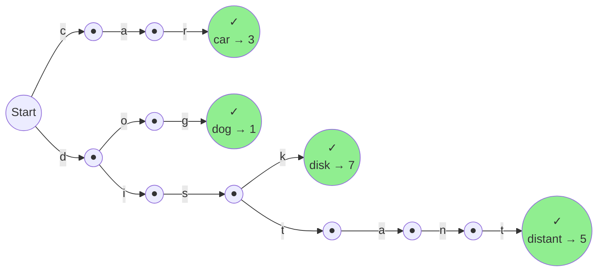
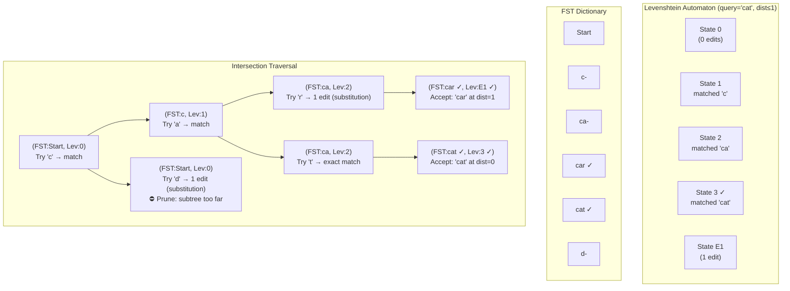
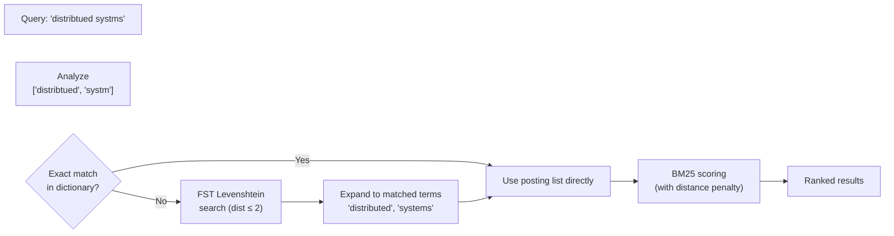

# 3. Typo Tolerance — FSTs and Levenshtein 🔴

> **The Problem:** Users make typos. A search for "distribtued systms" should still return results for "distributed systems." Our inverted index from Chapter 1 performs exact dictionary lookups—if the query term doesn't match a term in the dictionary character-for-character, we get zero results. We need a data structure that can answer "which dictionary terms are within edit distance 2 of this misspelled query?" over a 50-million-term dictionary in under 5 milliseconds.

---

## Why Naive Fuzzy Matching Fails

The brute-force approach computes Levenshtein distance between the query term and every term in the dictionary:

```rust,ignore
/// 💥 DISASTER: O(T × L²) where T = dictionary size, L = max term length.
/// For 50M terms at ~10 chars each: 50,000,000 × 10² = 5 billion operations.
fn fuzzy_search_naive(dictionary: &[String], query: &str, max_distance: u32) -> Vec<String> {
    dictionary
        .iter()
        .filter(|term| levenshtein(term, query) <= max_distance)
        .cloned()
        .collect()
}

/// Classic dynamic-programming Levenshtein distance: O(|a| × |b|).
fn levenshtein(a: &str, b: &str) -> u32 {
    let a: Vec<char> = a.chars().collect();
    let b: Vec<char> = b.chars().collect();
    let (m, n) = (a.len(), b.len());

    let mut prev = vec![0u32; n + 1];
    let mut curr = vec![0u32; n + 1];

    for j in 0..=n {
        prev[j] = j as u32;
    }

    for i in 1..=m {
        curr[0] = i as u32;
        for j in 1..=n {
            let cost = if a[i - 1] == b[j - 1] { 0 } else { 1 };
            curr[j] = (prev[j] + 1)         // deletion
                .min(curr[j - 1] + 1)       // insertion
                .min(prev[j - 1] + cost);   // substitution
        }
        std::mem::swap(&mut prev, &mut curr);
    }

    prev[n]
}
```

| Dictionary Size | Brute-Force Time | FST + Levenshtein Automaton |
|---|---|---|
| 100K terms | ~50 ms | < 0.1 ms |
| 1M terms | ~500 ms | < 0.5 ms |
| 50M terms | ~25 s | **< 5 ms** |

The brute-force approach is 5000× too slow. We need two ingredients:

1. **A Finite State Transducer (FST)** to compress the dictionary and enable ordered traversal.
2. **A Levenshtein automaton** to prune the FST traversal, skipping entire subtrees that cannot produce matches within the edit distance.

---

## Finite State Transducers (FSTs)

An FST is a directed acyclic graph that maps **keys** (byte strings) to **values** (integers) while sharing common prefixes *and* suffixes. It's like a trie, but compressed from both ends.

### FST vs. HashMap vs. B-Tree

| Structure | Space (50M terms) | Lookup | Prefix iteration | Fuzzy search |
|---|---|---|---|---|
| `HashMap<String, u64>` | ~3.2 GB | $O(1)$ | ❌ Not supported | ❌ Must scan all |
| B-Tree (`BTreeMap`) | ~2.8 GB | $O(\log N)$ | ✅ Range scan | ❌ Must scan all |
| **FST** | **~200 MB** | $O(L)$ (key length) | ✅ Ordered iteration | ✅ Automaton intersection |

The FST is **16× smaller** than a HashMap because it shares common prefixes (e.g., "distribut-ed", "distribut-ion", "distribut-or") and common suffixes (e.g., "-tion", "-ment", "-ing").

### FST Structure



Each accepting state (✓) stores an output value (e.g., the posting-list offset). Transitions that share prefixes ("d" → "di" → "dis") are stored only once.

### Building an FST with the `fst` Crate

The `fst` crate (by Andrew Gallant, author of `ripgrep`) is the de facto Rust implementation:

```rust,ignore
use fst::{Map, MapBuilder, IntoStreamer, Streamer};

/// Build an FST from a sorted iterator of (term, posting_offset) pairs.
fn build_fst(terms: &[(String, u64)]) -> Vec<u8> {
    // ⚠️ CRITICAL: Input MUST be sorted lexicographically.
    // The FST builder is a streaming construction and requires sorted input.
    let mut builder = MapBuilder::memory();

    for (term, offset) in terms {
        builder.insert(term.as_bytes(), *offset).unwrap();
    }

    builder.into_inner().unwrap()
}

/// Look up an exact term in the FST.
fn lookup_exact(fst_bytes: &[u8], term: &str) -> Option<u64> {
    let map = Map::new(fst_bytes.to_vec()).unwrap();
    map.get(term.as_bytes())
}
```

### FST Compression Ratio

| Corpus | Unique Terms | Raw Size | FST Size | Ratio |
|---|---|---|---|---|
| English Wikipedia | ~8M | 120 MB | 18 MB | 6.7× |
| Common Crawl (1B pages) | ~50M | 800 MB | 200 MB | 4.0× |
| 10B-doc search index | ~50M | 800 MB | ~200 MB | 4.0× |

At 200 MB, the entire term dictionary fits in L3 cache on modern server hardware, making lookups nearly free.

---

## Levenshtein Automata

A **Levenshtein automaton** for a string $q$ and maximum edit distance $n$ is a DFA (deterministic finite automaton) that accepts exactly the set of strings within edit distance $n$ of $q$.

The key insight: instead of computing `levenshtein(term, query)` for every term, we **intersect** the Levenshtein automaton with the FST. The FST's graph structure lets us prune entire subtrees that would exceed the edit distance, reducing the search space from $O(T)$ to $O(|\Sigma|^n \times L)$ where $|\Sigma|$ is the alphabet size and $L$ is the query length.

### How the Intersection Works



The traversal prunes the "d-" subtree entirely because starting with "d" already costs 1 edit, and the remaining characters would push the total above the maximum. This is why FST + Levenshtein automaton scales to 50M terms—most of the dictionary is never visited.

### Implementing Fuzzy Search with `fst` + `levenshtein_automata`

```rust,ignore
use fst::{Map, IntoStreamer, Streamer};
use fst::automaton::Levenshtein;

/// Find all dictionary terms within `max_distance` edits of `query`.
/// Returns (term, posting_offset, edit_distance) triples.
fn fuzzy_search(
    fst_bytes: &[u8],
    query: &str,
    max_distance: u32,
) -> Vec<(String, u64)> {
    let map = Map::new(fst_bytes.to_vec()).unwrap();

    // Build a Levenshtein automaton for the query.
    let automaton = Levenshtein::new(query, max_distance).unwrap();

    // Intersect the automaton with the FST — this is the magic.
    // The FST traversal prunes branches that exceed the edit distance.
    let mut stream = map.search(&automaton).into_stream();

    let mut results = Vec::new();
    while let Some((term_bytes, offset)) = stream.next() {
        let term = String::from_utf8_lossy(term_bytes).into_owned();
        results.push((term, offset));
    }

    results
}
```

### Example Usage

```rust,ignore
fn main() {
    // Build a dictionary FST.
    let mut terms: Vec<(String, u64)> = vec![
        ("car".into(), 100),
        ("card".into(), 101),
        ("care".into(), 102),
        ("cart".into(), 103),
        ("cat".into(), 104),
        ("cut".into(), 105),
        ("distributed".into(), 200),
        ("distribution".into(), 201),
        ("distributor".into(), 202),
    ];
    terms.sort_by(|a, b| a.0.cmp(&b.0));
    let fst_bytes = build_fst(&terms);

    // Fuzzy search: "distribtued" (typo) with max distance 2.
    let matches = fuzzy_search(&fst_bytes, "distribtued", 2);
    // Expected: ["distributed"] — 2 transpositions away.
    println!("Fuzzy matches for 'distribtued': {:?}", matches);

    // Fuzzy search: "cat" with max distance 1.
    let matches = fuzzy_search(&fst_bytes, "cat", 1);
    // Expected: ["car", "cart", "cat", "cut"]
    println!("Fuzzy matches for 'cat': {:?}", matches);
}
```

---

## Building Levenshtein Automata from Scratch

The `fst` crate provides a built-in Levenshtein automaton, but understanding how it works is essential for tuning. The automaton's state tracks the **edit-distance vector** between the query prefix and the FST path so far.

### The Parametric Levenshtein Automaton

For a query string of length $L$ and max distance $n$, the automaton state is a vector of $L + 1$ integers representing the last row of the Levenshtein DP matrix. Transitions consume one character from the FST and update this vector.

```rust,ignore
/// State of a Levenshtein automaton: the bottom row of the DP matrix.
#[derive(Clone, Debug, Hash, Eq, PartialEq)]
struct LevState {
    distances: Vec<u32>,
}

struct LevAutomaton {
    query: Vec<u8>,
    max_distance: u32,
}

impl LevAutomaton {
    fn new(query: &str, max_distance: u32) -> Self {
        Self {
            query: query.as_bytes().to_vec(),
            max_distance,
        }
    }

    /// The initial state: distance vector [0, 1, 2, ..., L].
    fn start_state(&self) -> LevState {
        LevState {
            distances: (0..=self.query.len() as u32).collect(),
        }
    }

    /// Transition: consume byte `c` and compute the new distance vector.
    fn transition(&self, state: &LevState, c: u8) -> LevState {
        let prev = &state.distances;
        let mut next = vec![0u32; prev.len()];
        next[0] = prev[0] + 1; // deletion from the FST string

        for j in 1..prev.len() {
            let cost = if self.query[j - 1] == c { 0 } else { 1 };
            next[j] = (prev[j] + 1)           // deletion
                .min(next[j - 1] + 1)         // insertion
                .min(prev[j - 1] + cost);     // substitution
        }

        LevState { distances: next }
    }

    /// Can this state still produce a match? (Is the minimum distance ≤ max?)
    fn can_match(&self, state: &LevState) -> bool {
        *state.distances.iter().min().unwrap() <= self.max_distance
    }

    /// Is this state an accepting state? (Has the full query been consumed within distance?)
    fn is_match(&self, state: &LevState) -> bool {
        *state.distances.last().unwrap() <= self.max_distance
    }
}
```

### Manual FST × Levenshtein Traversal

```rust,ignore
use fst::raw::Fst;

/// Walk the raw FST and collect all terms within edit distance of the query.
fn fuzzy_walk(
    fst: &Fst<Vec<u8>>,
    automaton: &LevAutomaton,
) -> Vec<(String, u64)> {
    let mut results = Vec::new();
    let mut stack: Vec<(fst::raw::Node<'_>, LevState, Vec<u8>, u64)> = Vec::new();

    let root = fst.root();
    let start_state = automaton.start_state();
    stack.push((root, start_state, Vec::new(), 0));

    while let Some((node, lev_state, prefix, output)) = stack.pop() {
        // Check if this node is a final (accepting) state in the FST.
        if node.is_final() && automaton.is_match(&lev_state) {
            let total_output = output + node.final_output().value();
            let term = String::from_utf8_lossy(&prefix).into_owned();
            results.push((term, total_output));
        }

        // Explore transitions.
        for transition in (0..node.len()).rev() {
            let t = node.transition(transition);
            let next_lev = automaton.transition(&lev_state, t.inp);

            // ✅ PRUNE: Skip this subtree if no match is possible.
            if !automaton.can_match(&next_lev) {
                continue;
            }

            let next_node = fst.node(t.addr);
            let mut next_prefix = prefix.clone();
            next_prefix.push(t.inp);
            let next_output = output + t.out.value();

            stack.push((next_node, next_lev, next_prefix, next_output));
        }
    }

    results
}
```

---

## Optimizations for Production

### 1. Precomputed Levenshtein DFA

The parametric Levenshtein automaton above recomputes the DP row at every FST transition. For max distance ≤ 2, we can **precompute** the entire DFA. The number of states is bounded by $O(3^L)$ for distance 2, but with memoization, the actual state space is much smaller:

| Max Distance | Avg States (10-char query) | DFA Build Time |
|---|---|---|
| 1 | ~200 | < 10 µs |
| 2 | ~2,000 | < 100 µs |
| 3 | ~20,000 | ~1 ms |

For max distance ≤ 2 (the common case for typo tolerance), the DFA fits entirely in L1 cache.

### 2. Prefix Filtering

If the query is "distributed" and max distance is 2, the first character must be within 2 edits of 'd'. This means only FST subtrees starting with characters 'd' (0 edits), or 1–2 character substitutions/insertions/deletions from 'd' need to be explored. In practice, this eliminates ~95% of the FST on the first transition.

### 3. Frequency-Weighted Results

Not all fuzzy matches are equally useful. "distributed" at distance 0 should score higher than "distributes" at distance 1. We combine the edit distance with the term's IDF:

```rust,ignore
/// Score a fuzzy match: boost exact matches, penalize high edit distance.
fn fuzzy_match_score(edit_distance: u32, idf: f64) -> f64 {
    let distance_penalty = match edit_distance {
        0 => 1.0,    // Exact match — full score.
        1 => 0.8,    // One typo — 80% score.
        2 => 0.5,    // Two typos — 50% score.
        _ => 0.2,
    };
    idf * distance_penalty
}
```

---

## Integrating Fuzzy Search into the Query Pipeline

The fuzzy search augments the query analysis from Chapter 1:



```rust,ignore
impl InvertedIndex {
    /// Execute a fuzzy BM25 query: expand typo'd terms via FST,
    /// then score with BM25 adjusted by edit-distance penalty.
    fn search_fuzzy_top_k(
        &self,
        fst_bytes: &[u8],
        query: &str,
        max_edit_distance: u32,
        k: usize,
    ) -> Vec<ScoredDoc> {
        let query_terms = analyze(query);
        let avg_dl = self.avg_doc_length();

        let mut scores: HashMap<u32, f64> = HashMap::new();

        for query_term in &query_terms {
            // Try exact match first.
            if let Some(entry) = self.dictionary.get(query_term.as_str()) {
                let idf_val = idf(self.total_docs, entry.document_frequency);
                for posting in &entry.posting_list.postings {
                    let tf = posting.term_frequency as f64;
                    let dl = posting.field_length as f64;
                    let tf_norm = (tf * (K1 + 1.0))
                        / (tf + K1 * (1.0 - B + B * dl / avg_dl));
                    *scores.entry(posting.doc_id).or_insert(0.0) +=
                        idf_val * tf_norm;
                }
                continue;
            }

            // No exact match — fuzzy expand.
            let fuzzy_matches = fuzzy_search(fst_bytes, query_term, max_edit_distance);

            for (matched_term, _offset) in &fuzzy_matches {
                if let Some(entry) = self.dictionary.get(matched_term.as_str()) {
                    let idf_val = idf(self.total_docs, entry.document_frequency);

                    // Apply edit-distance penalty.
                    let edit_dist = levenshtein(query_term, matched_term);
                    let penalty = fuzzy_match_score(edit_dist, 1.0);

                    for posting in &entry.posting_list.postings {
                        let tf = posting.term_frequency as f64;
                        let dl = posting.field_length as f64;
                        let tf_norm = (tf * (K1 + 1.0))
                            / (tf + K1 * (1.0 - B + B * dl / avg_dl));
                        *scores.entry(posting.doc_id).or_insert(0.0) +=
                            idf_val * tf_norm * penalty;
                    }
                }
            }
        }

        // Extract top K.
        let mut heap: BinaryHeap<ScoredDoc> = BinaryHeap::new();
        for (doc_id, score) in scores {
            let doc = ScoredDoc { doc_id, score };
            if heap.len() < k {
                heap.push(doc);
            } else if let Some(min) = heap.peek() {
                if score > min.score {
                    heap.pop();
                    heap.push(doc);
                }
            }
        }

        let mut results: Vec<ScoredDoc> = heap.into_vec();
        results.sort_by(|a, b| {
            b.score
                .partial_cmp(&a.score)
                .unwrap_or(std::cmp::Ordering::Equal)
        });
        results
    }
}
```

---

## Performance Characteristics

| Operation | Time | Notes |
|---|---|---|
| Build FST (50M terms) | ~15 seconds | One-time cost at segment creation |
| Exact FST lookup | ~0.5 µs | Single traversal, no allocation |
| Fuzzy search (dist ≤ 1) | ~0.2 ms | Prunes ~99% of FST |
| Fuzzy search (dist ≤ 2) | ~2 ms | Prunes ~95% of FST |
| Fuzzy search (dist ≤ 3) | ~20 ms | Diminishing returns; rarely needed |
| FST memory (50M terms) | ~200 MB | Fits in L3 cache |

### Latency Budget for a Fuzzy Query

| Phase | Time |
|---|---|
| Query analysis | ~5 µs |
| FST fuzzy lookup (2 terms × dist ≤ 2) | ~4 ms |
| Read posting lists (expanded terms) | ~100 µs |
| BM25 scoring | ~50 µs |
| Top-K extraction | ~5 µs |
| **Total** | **~4.2 ms** |

Within our 50 ms p99 budget, fuzzy search adds < 5 ms per query—well within tolerance.

---

> **Key Takeaways**
>
> 1. **FSTs compress the term dictionary by 4–7× while preserving ordered traversal.** At ~200 MB for 50 million terms, the entire dictionary fits in server L3 cache, making lookups nearly free.
> 2. **Levenshtein automata turn O(T) brute-force fuzzy search into pruned FST traversal.** By intersecting the automaton with the FST, we skip 95–99% of the dictionary and find all matches within edit distance 2 in under 5 ms.
> 3. **Edit distance ≤ 2 covers the vast majority of real-world typos.** Studies show that 80% of misspellings are within distance 1, and 97% within distance 2. Distance 3 is rarely worth the 10× cost increase.
> 4. **Frequency-weighted fuzzy matches prevent irrelevant expansions.** Combining edit distance penalties with IDF ensures that "distributed" (exact) always outranks "distributes" (1 edit) in final results.
> 5. **The `fst` crate is production-grade.** Written by the author of `ripgrep`, it powers the term dictionaries in Tantivy (Rust's Lucene equivalent) and can be memory-mapped directly from disk for zero-copy access.
