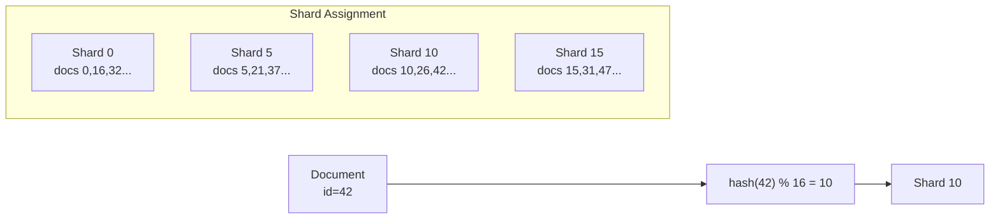
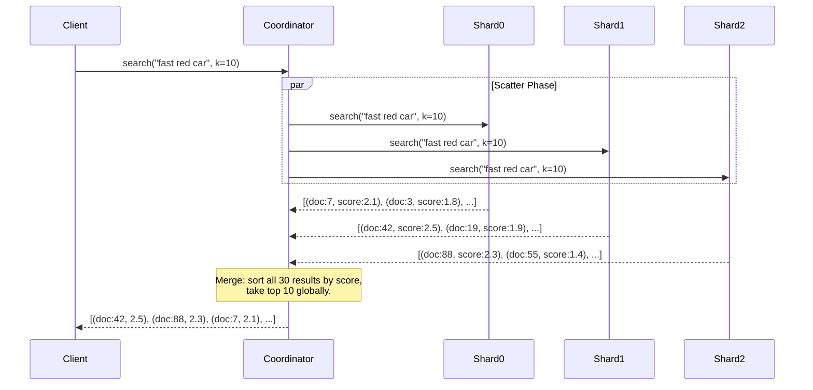
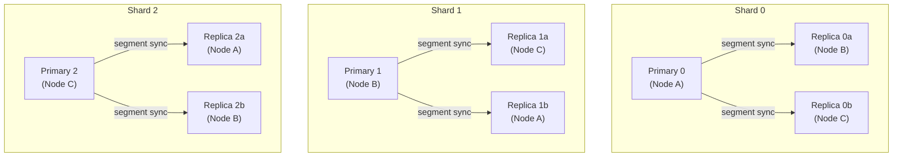
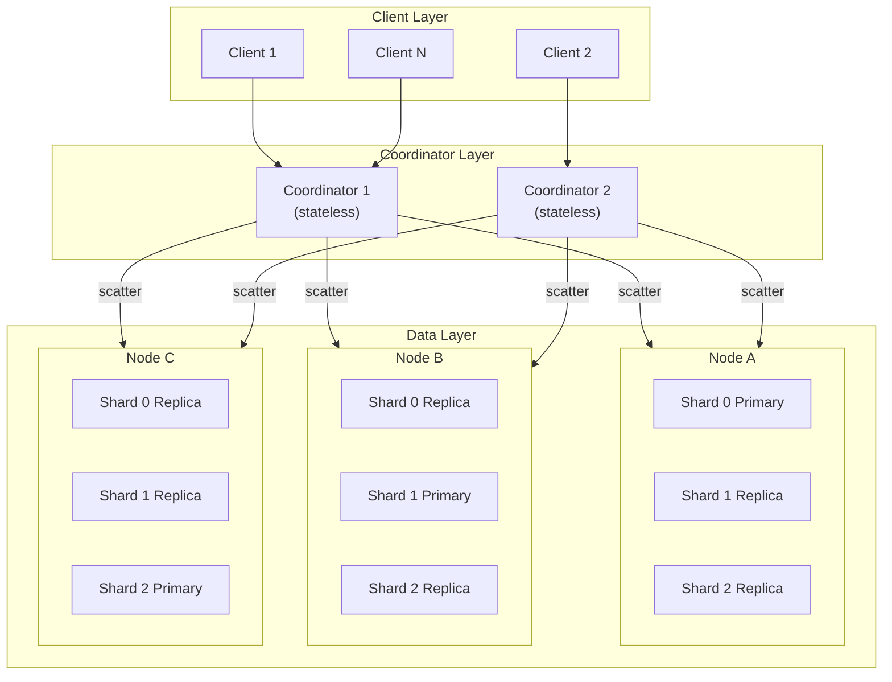

# 4. Distributed Sharding and Replication 🔴

> **The Problem:** Our single-machine search engine from Chapters 1–3 holds ~80 GB of index data per shard. A 10-billion-document corpus requires ~1.24 TB of total index data—more than any single machine's RAM can hold, and more queries than a single CPU can handle. We need to partition the index across multiple machines (**sharding**), fan out each query to all shards (**scatter**), and merge partial results into a single ranked list (**gather**). And when a machine dies, we need another copy of the data ready to serve (**replication**).

---

## Why Sharding Is Necessary

| Single Machine | 16-Shard Cluster |
|---|---|
| 1.24 TB index → needs 1.5 TB RAM or hot SSDs | ~80 GB per shard → fits in RAM on 128 GB nodes |
| ~11 K QPS on one core (Ch 2) | ~176 K QPS aggregate (11K × 16) |
| Single point of failure | Replicas survive node loss |
| Vertical scaling: $$$$ (bigger machines) | Horizontal scaling: $$ (commodity hardware) |

---

## Sharding Strategies

There are two fundamental approaches to partitioning a search index:

### 1. Document-Based Sharding (Preferred)

Each document lives on exactly one shard. Every shard is a complete, self-contained search engine with its own inverted index, FST, and BM25 statistics.



**Advantages:**
- Each shard independently computes local BM25 scores.
- Indexing is embarrassingly parallel—each document goes to one shard.
- Shard failure loses only 1/$N$th of the corpus (recoverable from replicas).

**Disadvantage:**
- Every query must hit **all** shards (scatter-gather).

### 2. Term-Based Sharding (Specialized)

Each term's entire posting list lives on one shard. A query only hits shards that own the query terms.

| Dimension | Document-Based | Term-Based |
|---|---|---|
| Query fan-out | All $N$ shards | Only shards with query terms |
| Index balance | Even (hash by doc_id) | Skewed (popular terms → hot shards) |
| Scoring accuracy | Local BM25 per shard | Needs global stats coordination |
| Industry usage | Elasticsearch, Solr, Tantivy | Google (partially), specialized engines |

**We choose document-based sharding** because it simplifies BM25 scoring (each shard has self-contained statistics) and avoids the hot-shard problem.

---

## The Scatter-Gather Architecture

A **coordinator node** receives every query, fans it out to all shards, collects partial results, and merges them into the final top-$K$ ranked list.



### Why Each Shard Returns $K$ Results (Not $K/N$)

A common mistake is having each shard return $K/N$ results. This fails because the global top-$K$ could all reside on one shard. Each shard must return its local top-$K$, and the coordinator merges $N \times K$ results down to the global top-$K$.

For $K = 10$ and $N = 16$ shards, the coordinator merges $160$ scored documents—trivial ($< 10$ µs).

---

## Implementing the Coordinator

### Shard Router

```rust,ignore
use std::collections::HashMap;
use std::hash::{Hash, Hasher};

const NUM_SHARDS: u32 = 16;

/// Determine which shard owns a document.
fn shard_for_doc(doc_id: u64) -> u32 {
    // Use a high-quality hash to distribute evenly.
    let mut hasher = std::collections::hash_map::DefaultHasher::new();
    doc_id.hash(&mut hasher);
    (hasher.finish() % NUM_SHARDS as u64) as u32
}
```

### Scatter-Gather Query Execution

```rust,ignore
use tokio::time::{timeout, Duration};

/// A partial result from a single shard.
#[derive(Debug, Clone)]
struct ShardResult {
    shard_id: u32,
    hits: Vec<ScoredDoc>,
    total_matches: u64, // Total docs matching on this shard (for pagination).
}

/// The coordinator's scatter-gather query execution.
async fn scatter_gather_search(
    shard_clients: &[ShardClient],
    query: &str,
    k: usize,
    timeout_ms: u64,
) -> Result<Vec<ScoredDoc>, SearchError> {
    let deadline = Duration::from_millis(timeout_ms);

    // Scatter: send query to all shards in parallel.
    let futures: Vec<_> = shard_clients
        .iter()
        .map(|client| {
            let q = query.to_string();
            async move {
                timeout(deadline, client.search(&q, k)).await
            }
        })
        .collect();

    let results = futures::future::join_all(futures).await;

    // Gather: collect successful shard responses.
    let mut all_hits: Vec<ScoredDoc> = Vec::with_capacity(k * shard_clients.len());
    let mut failed_shards = 0u32;

    for (shard_id, result) in results.into_iter().enumerate() {
        match result {
            Ok(Ok(shard_result)) => {
                all_hits.extend(shard_result.hits);
            }
            Ok(Err(e)) => {
                // Shard returned an error — log and continue with degraded results.
                eprintln!("Shard {} error: {}", shard_id, e);
                failed_shards += 1;
            }
            Err(_) => {
                // Shard timed out — return partial results.
                eprintln!("Shard {} timed out after {}ms", shard_id, timeout_ms);
                failed_shards += 1;
            }
        }
    }

    // If too many shards failed, the results are unreliable.
    if failed_shards > shard_clients.len() as u32 / 2 {
        return Err(SearchError::TooManyShardsUnavailable(failed_shards));
    }

    // Merge: global top-K by score.
    all_hits.sort_by(|a, b| {
        b.score
            .partial_cmp(&a.score)
            .unwrap_or(std::cmp::Ordering::Equal)
    });
    all_hits.truncate(k);

    Ok(all_hits)
}

#[derive(Debug)]
enum SearchError {
    TooManyShardsUnavailable(u32),
    Internal(String),
}

impl std::fmt::Display for SearchError {
    fn fmt(&self, f: &mut std::fmt::Formatter<'_>) -> std::fmt::Result {
        match self {
            Self::TooManyShardsUnavailable(n) => {
                write!(f, "{} shards unavailable — results unreliable", n)
            }
            Self::Internal(msg) => write!(f, "Internal error: {}", msg),
        }
    }
}

/// Stub for the shard gRPC/HTTP client.
struct ShardClient {
    shard_id: u32,
    endpoint: String,
}

impl ShardClient {
    async fn search(&self, query: &str, k: usize) -> Result<ShardResult, SearchError> {
        // In production, this sends a gRPC/HTTP request to the shard server.
        // The shard server runs the BM25 query from Chapter 2 and returns
        // its local top-K results.
        todo!("gRPC call to shard {}", self.shard_id)
    }
}
```

---

## The BM25 Global-vs-Local Score Problem

Document-based sharding creates a subtle scoring issue: each shard computes BM25 using **local** corpus statistics ($N_{\text{local}}$, $\text{df}_{\text{local}}$, $\text{avgdl}_{\text{local}}$). If term distribution is skewed (e.g., shard 0 has many tech docs while shard 7 has sports docs), the IDF values will differ across shards, making scores incomparable.

### Solution: Global Statistics Collection

At index time, compute global statistics and distribute them to all shards:

```rust,ignore
/// Global corpus statistics, computed during indexing and
/// distributed to all shards at query time or periodically synced.
#[derive(Debug, Clone, serde::Serialize, serde::Deserialize)]
struct GlobalStats {
    total_docs: u64,
    avg_doc_length: f64,
    /// term → global document frequency
    term_doc_freqs: HashMap<String, u64>,
}

impl GlobalStats {
    /// Merge statistics from all shards.
    fn merge(shard_stats: &[ShardStats]) -> Self {
        let total_docs: u64 = shard_stats.iter().map(|s| s.num_docs as u64).sum();
        let total_length: u64 = shard_stats.iter().map(|s| s.total_field_lengths).sum();
        let avg_doc_length = if total_docs > 0 {
            total_length as f64 / total_docs as f64
        } else {
            0.0
        };

        let mut term_doc_freqs: HashMap<String, u64> = HashMap::new();
        for stats in shard_stats {
            for (term, df) in &stats.term_doc_freqs {
                *term_doc_freqs.entry(term.clone()).or_insert(0) += *df as u64;
            }
        }

        Self {
            total_docs,
            avg_doc_length,
            term_doc_freqs,
        }
    }
}

#[derive(Debug, Clone)]
struct ShardStats {
    num_docs: u32,
    total_field_lengths: u64,
    term_doc_freqs: HashMap<String, u32>,
}
```

### When to Use Local vs. Global Stats

| Approach | Scoring Accuracy | Complexity | Industry Usage |
|---|---|---|---|
| Local stats only | Good if shards are homogeneous | Simple | Elasticsearch default |
| Global stats (pre-synced) | Exact | Requires periodic stat sync | Solr, custom engines |
| Two-phase query (DFS_QUERY_THEN_FETCH) | Exact | Extra round-trip | Elasticsearch optional |

In practice, document-based sharding with random assignment produces sufficiently homogeneous shards that local statistics are within ~5% of global. The error is negligible for most use cases.

---

## Replication for Fault Tolerance

Each shard has one **primary** and one or more **replicas**. The primary handles writes; replicas serve reads and act as failover targets.



### Shard Allocation: Interleaved Placement

Notice that primaries are spread across nodes, and each node hosts replicas for *other* shards' primaries. This ensures that **no single node failure loses data**:

| Node Failure | Lost Primaries | Surviving Replicas | Action |
|---|---|---|---|
| Node A dies | Shard 0 primary | Replica 0a (B), Replica 0b (C) | Promote Replica 0a to primary |
| Node B dies | Shard 1 primary | Replica 1a (C), Replica 1b (A) | Promote Replica 1a to primary |
| Node C dies | Shard 2 primary | Replica 2a (A), Replica 2b (B) | Promote Replica 2a to primary |

### Read Load Balancing

The coordinator can route queries to either the primary or any replica, distributing read load:

```rust,ignore
use std::sync::atomic::{AtomicUsize, Ordering};

/// A shard group: one primary + N replicas.
struct ShardGroup {
    primary: ShardClient,
    replicas: Vec<ShardClient>,
    /// Round-robin counter for load balancing.
    next_reader: AtomicUsize,
}

impl ShardGroup {
    /// Pick the next reader (primary or replica) using round-robin.
    fn next_reader(&self) -> &ShardClient {
        let all: Vec<&ShardClient> = std::iter::once(&self.primary)
            .chain(self.replicas.iter())
            .collect();

        let idx = self.next_reader.fetch_add(1, Ordering::Relaxed) % all.len();
        all[idx]
    }
}
```

---

## Handling Shard Failures

### Failure Detection: Heartbeats

Each node sends periodic heartbeats to the coordinator. If a heartbeat is missed for 3 consecutive intervals, the node is declared dead:

```rust,ignore
use tokio::time::{interval, Duration, Instant};
use std::collections::HashMap;
use tokio::sync::RwLock;
use std::sync::Arc;

const HEARTBEAT_INTERVAL: Duration = Duration::from_secs(1);
const FAILURE_THRESHOLD: Duration = Duration::from_secs(3);

struct ClusterState {
    /// Node ID → last heartbeat time.
    last_heartbeat: Arc<RwLock<HashMap<u32, Instant>>>,
}

impl ClusterState {
    async fn record_heartbeat(&self, node_id: u32) {
        let mut map = self.last_heartbeat.write().await;
        map.insert(node_id, Instant::now());
    }

    async fn detect_failures(&self) -> Vec<u32> {
        let map = self.last_heartbeat.read().await;
        let now = Instant::now();

        map.iter()
            .filter(|(_, &last)| now.duration_since(last) > FAILURE_THRESHOLD)
            .map(|(&node_id, _)| node_id)
            .collect()
    }
}
```

### Replica Promotion

When a primary fails, the coordinator promotes the most up-to-date replica:

```rust,ignore
impl ShardGroup {
    /// Promote the replica with the highest segment generation to primary.
    async fn promote_replica(&mut self) -> Result<(), SearchError> {
        if self.replicas.is_empty() {
            return Err(SearchError::Internal(
                "No replicas available for promotion".into(),
            ));
        }

        // In production, query each replica for its latest segment generation
        // and promote the one closest to the former primary.
        let promoted = self.replicas.remove(0);
        self.primary = promoted;

        Ok(())
    }
}
```

---

## Cluster Topology Overview



**Key design decisions:**
- **Coordinators are stateless** — any coordinator can handle any query. Load balance with a simple L4/L7 proxy.
- **Data nodes host multiple shard primaries and replicas** — interleaved to maximize fault tolerance.
- **Replication factor = 3** — tolerates one node failure with no data loss and continued query serving.

---

## Performance Characteristics

### Query Latency Breakdown (16-Shard Cluster)

| Phase | Time |
|---|---|
| Coordinator receives query | ~0.1 ms |
| Scatter: send to 16 shards (parallel gRPC) | ~0.5 ms |
| Shard-local BM25 query (Ch 2) | ~0.1 ms |
| Network return (16 responses) | ~0.5 ms |
| Gather: merge 160 results | ~0.01 ms |
| **Total** | **~1.2 ms** (p50), **~5 ms** (p99) |

### Throughput Scaling

| Shards | Replicas | Query Throughput | Fault Tolerance |
|---|---|---|---|
| 1 | 0 | ~11 K QPS | None |
| 16 | 1 | ~352 K QPS (16 × 2 copies × 11K) | 1 node failure |
| 16 | 2 | ~528 K QPS (16 × 3 copies × 11K) | 2 node failures |
| 64 | 2 | ~2.1 M QPS | 2 node failures per shard |

---

> **Key Takeaways**
>
> 1. **Document-based sharding is the default choice for search engines.** It produces self-contained shards with independent BM25 statistics, and the slight scoring inconsistency from local-only stats is negligible for evenly distributed corpora.
> 2. **Scatter-gather adds ~1 ms to query latency.** Network round-trip dominates shard-local compute. The merge phase (sorting $N \times K$ results) is trivially fast.
> 3. **Each shard must return full top-$K$ results, not $K/N$.** The global top-$K$ could all reside on one shard.
> 4. **Interleaved shard placement ensures no single-node failure loses any shard's data.** With replication factor 3, the cluster tolerates 2 simultaneous node failures.
> 5. **Stateless coordinators scale horizontally.** They hold no data—just routing logic. Put them behind a load balancer and add more as QPS grows.
