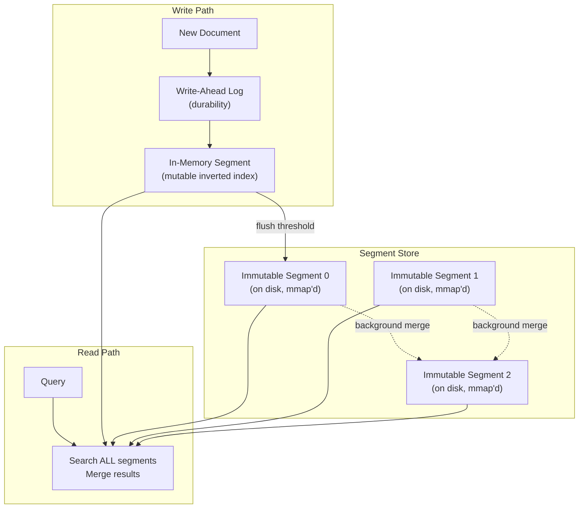
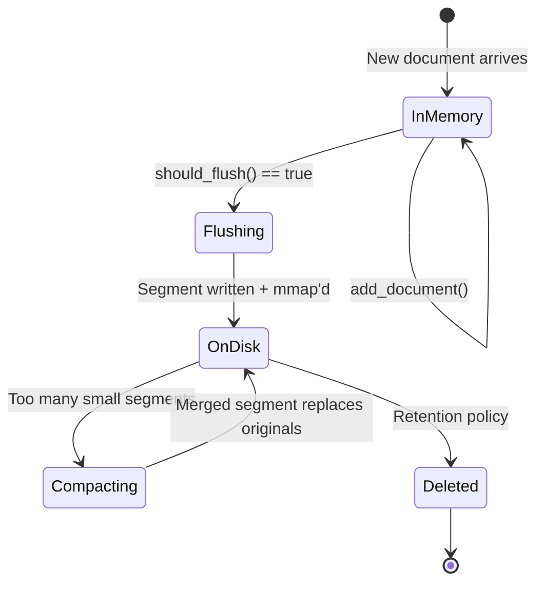
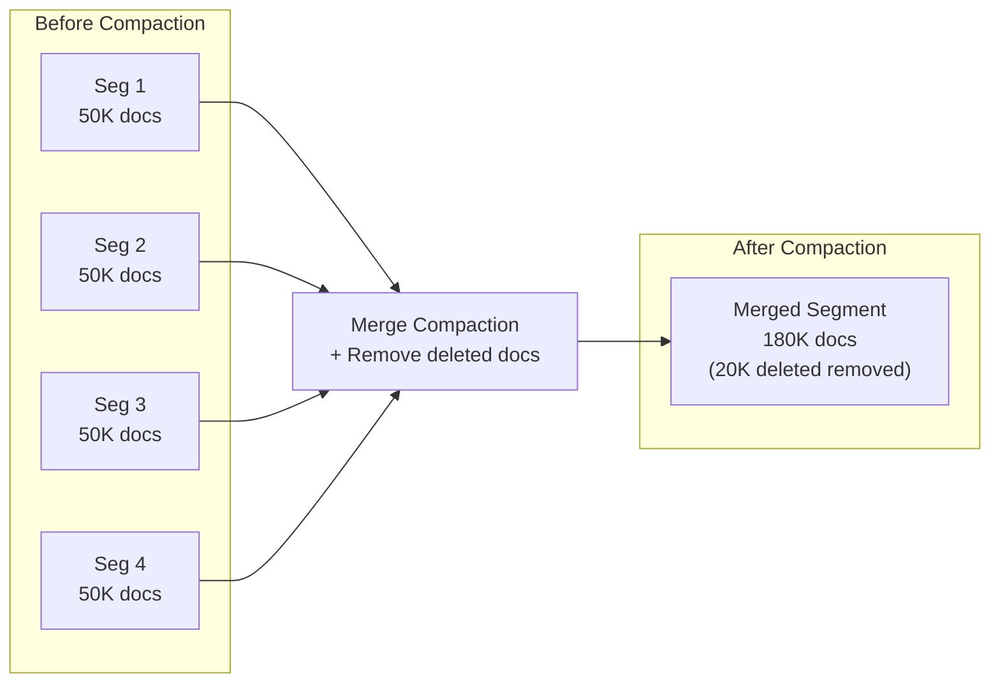
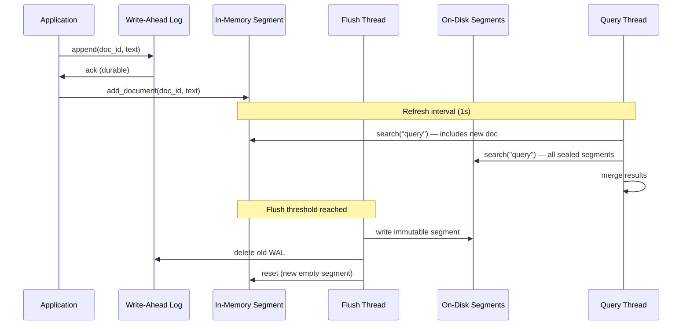

# 5. Real-Time Indexing vs. Search Performance 🔴

> **The Problem:** Our search engine from Chapters 1–4 builds immutable segments offline—index a batch of documents, write the segment, and serve queries. But modern applications demand **near-real-time (NRT) search**: a document ingested at time $t$ must be searchable by time $t + 1\text{s}$. The fundamental conflict is that **writes mutate the index** while **reads require a consistent snapshot**. Naive locking serializes everything and kills throughput. We need an architecture that decouples writers from readers.

---

## The Write-Read Conflict

Search engines face a unique variant of the readers-writers problem:

| Concern | Writers (Indexing) | Readers (Search) |
|---|---|---|
| Goal | Add new documents ASAP | Query a consistent snapshot |
| Data structures | Must modify posting lists, term dict, doc metadata | Must traverse posting lists, intersect, score |
| Consistency | Eventual (documents appear "soon") | Snapshot (no partial documents, no torn reads) |
| Throughput | Sustained 100K docs/sec | 10K+ queries/sec |

If writers and readers share the same mutable data structure, we need locks. At 10K QPS and 100K writes/sec, lock contention alone can add 10 ms of tail latency—exceeding our 50 ms p99 budget.

---

## The LSM-Tree Approach for Search

We borrow the **Log-Structured Merge Tree (LSM)** architecture from databases (LevelDB, RocksDB, Cassandra) and adapt it for inverted indexes:



### The Core Invariants

1. **Writes go to a mutable in-memory segment.** This is a standard `InvertedIndex` from Chapter 1, held entirely in RAM.
2. **When the in-memory segment reaches a size threshold, it is "frozen" into an immutable segment and flushed to disk.** A new empty in-memory segment is created.
3. **Queries search ALL segments** (the current in-memory segment + all on-disk segments) and merge results.
4. **A Write-Ahead Log (WAL) provides durability.** If the process crashes before flush, replay the WAL to recover the in-memory segment.
5. **Background compaction merges small on-disk segments into larger ones** to bound the number of segments that queries must search.

---

## The In-Memory Segment

The in-memory segment is a mutable inverted index that supports concurrent reads and writes:

```rust,ignore
use std::sync::RwLock;
use std::sync::atomic::{AtomicU32, AtomicU64, Ordering};

/// A mutable in-memory segment that supports concurrent indexing and searching.
struct MemSegment {
    /// The mutable inverted index. Writers hold a write lock; readers hold a read lock.
    index: RwLock<InvertedIndex>,
    /// Monotonically increasing generation counter.
    generation: u64,
    /// Number of documents in this segment.
    doc_count: AtomicU32,
    /// Approximate byte size (for flush threshold).
    estimated_bytes: AtomicU64,
}

const FLUSH_THRESHOLD_BYTES: u64 = 256 * 1024 * 1024; // 256 MB
const FLUSH_THRESHOLD_DOCS: u32 = 500_000;

impl MemSegment {
    fn new(generation: u64) -> Self {
        Self {
            index: RwLock::new(InvertedIndex::new()),
            generation,
            doc_count: AtomicU32::new(0),
            estimated_bytes: AtomicU64::new(0),
        }
    }

    /// Index a document into the in-memory segment.
    fn add_document(&self, doc_id: u32, text: &str) {
        let text_len = text.len() as u64;

        // Acquire write lock — blocks concurrent readers briefly.
        let mut index = self.index.write().unwrap();
        index.add_document(doc_id, text);

        self.doc_count.fetch_add(1, Ordering::Relaxed);
        self.estimated_bytes.fetch_add(text_len, Ordering::Relaxed);
    }

    /// Check if this segment should be flushed to disk.
    fn should_flush(&self) -> bool {
        self.doc_count.load(Ordering::Relaxed) >= FLUSH_THRESHOLD_DOCS
            || self.estimated_bytes.load(Ordering::Relaxed) >= FLUSH_THRESHOLD_BYTES
    }

    /// Search the in-memory segment (concurrent with writes).
    fn search(&self, query: &str, k: usize) -> Vec<ScoredDoc> {
        let index = self.index.read().unwrap();
        index.search_top_k(query, k)
    }
}
```

### RwLock Trade-offs

| Approach | Write Throughput | Read Latency | Complexity |
|---|---|---|---|
| `RwLock` (above) | ~100K docs/sec | < 1 ms (no contention) | Low |
| Lock-free concurrent index | ~500K docs/sec | < 0.5 ms | Very high |
| Double-buffering (swap) | ~200K docs/sec | Zero contention | Medium |

The `RwLock` approach is simplest and sufficient for most workloads. The write lock is held for < 10 µs per document (just appending to posting lists), so reader contention is minimal.

---

## The Write-Ahead Log (WAL)

The WAL provides crash recovery. Every document is appended to the WAL *before* being added to the in-memory segment. On crash, the WAL is replayed to rebuild the segment.

```rust,ignore
use std::fs::{File, OpenOptions};
use std::io::{BufWriter, Write};

struct WriteAheadLog {
    writer: BufWriter<File>,
    path: std::path::PathBuf,
    position: u64,
}

/// A WAL entry: length-prefixed, CRC-checked record.
struct WalEntry<'a> {
    doc_id: u32,
    text: &'a str,
}

impl WriteAheadLog {
    fn open(path: &std::path::Path) -> std::io::Result<Self> {
        let file = OpenOptions::new()
            .create(true)
            .append(true)
            .open(path)?;
        let position = file.metadata()?.len();
        Ok(Self {
            writer: BufWriter::new(file),
            path: path.to_path_buf(),
            position,
        })
    }

    /// Append a document to the WAL. Returns the byte offset.
    fn append(&mut self, entry: &WalEntry) -> std::io::Result<u64> {
        let offset = self.position;

        let text_bytes = entry.text.as_bytes();

        // Record format: [doc_id:u32][text_len:u32][text:bytes][crc32:u32]
        let crc = crc32fast::hash(text_bytes);

        self.writer.write_all(&entry.doc_id.to_le_bytes())?;
        self.writer.write_all(&(text_bytes.len() as u32).to_le_bytes())?;
        self.writer.write_all(text_bytes)?;
        self.writer.write_all(&crc.to_le_bytes())?;

        self.position += 4 + 4 + text_bytes.len() as u64 + 4;
        Ok(offset)
    }

    /// Flush the WAL to disk (for durability guarantees).
    fn sync(&mut self) -> std::io::Result<()> {
        self.writer.flush()?;
        self.writer.get_ref().sync_data()
    }

    /// Delete the WAL after the segment has been flushed to disk.
    fn delete(self) -> std::io::Result<()> {
        drop(self.writer);
        std::fs::remove_file(&self.path)
    }
}
```

### WAL Replay on Recovery

```rust,ignore
use std::io::{BufReader, Read};

/// Replay a WAL file to rebuild the in-memory segment after a crash.
fn replay_wal(path: &std::path::Path) -> std::io::Result<InvertedIndex> {
    let file = File::open(path)?;
    let mut reader = BufReader::new(file);
    let mut index = InvertedIndex::new();

    loop {
        // Read doc_id.
        let mut buf4 = [0u8; 4];
        if reader.read_exact(&mut buf4).is_err() {
            break; // End of WAL.
        }
        let doc_id = u32::from_le_bytes(buf4);

        // Read text length.
        reader.read_exact(&mut buf4)?;
        let text_len = u32::from_le_bytes(buf4) as usize;

        // Read text.
        let mut text_buf = vec![0u8; text_len];
        reader.read_exact(&mut text_buf)?;

        // Read and verify CRC.
        reader.read_exact(&mut buf4)?;
        let stored_crc = u32::from_le_bytes(buf4);
        let computed_crc = crc32fast::hash(&text_buf);

        if stored_crc != computed_crc {
            // Corrupted entry — stop replaying (truncated write during crash).
            eprintln!("WAL corruption at doc_id={}, stopping replay", doc_id);
            break;
        }

        let text = String::from_utf8_lossy(&text_buf);
        index.add_document(doc_id, &text);
    }

    Ok(index)
}
```

---

## The Segment Manager

The segment manager orchestrates the lifecycle: in-memory indexing, flushing, searching across all segments, and background compaction.



```rust,ignore
use std::sync::Arc;
use tokio::sync::Mutex;

/// The segment manager: owns all segments and coordinates flushes.
struct SegmentManager {
    /// The current mutable segment (receives all writes).
    active: Arc<MemSegment>,
    /// Immutable on-disk segments (searchable, mmap'd).
    sealed: Arc<RwLock<Vec<Arc<SegmentReader>>>>,
    /// Write-ahead log for the active segment.
    wal: Mutex<WriteAheadLog>,
    /// Next generation counter.
    next_generation: AtomicU64,
    /// Data directory.
    data_dir: std::path::PathBuf,
}

impl SegmentManager {
    /// Index a document: WAL → in-memory segment → maybe flush.
    async fn index_document(&self, doc_id: u32, text: &str) -> std::io::Result<()> {
        // Step 1: Append to WAL for durability.
        {
            let mut wal = self.wal.lock().await;
            wal.append(&WalEntry { doc_id, text })?;
            // Batch sync: flush WAL every N docs or on a timer.
            // For simplicity, sync every document here.
            wal.sync()?;
        }

        // Step 2: Add to in-memory segment.
        self.active.add_document(doc_id, text);

        // Step 3: Check if flush is needed.
        if self.active.should_flush() {
            self.flush().await?;
        }

        Ok(())
    }

    /// Freeze the active segment, flush to disk, and create a new active segment.
    async fn flush(&self) -> std::io::Result<()> {
        let gen = self.next_generation.fetch_add(1, Ordering::SeqCst);

        // Freeze: swap in a new empty segment.
        // The old segment remains searchable (readers still hold Arc references).
        let frozen_index = {
            let index = self.active.index.read().unwrap();
            index.clone() // Clone the index for disk writing.
        };

        // Write the segment to disk.
        let segment_path = self.data_dir.join(format!("segment_{:010}.idx", gen));
        let writer = SegmentWriter {
            path: segment_path.clone(),
        };
        writer.write_segment(&frozen_index)?;

        // Open the on-disk segment for mmap'd reading.
        let reader = Arc::new(SegmentReader::open(&segment_path)?);

        // Add to the sealed list.
        {
            let mut sealed = self.sealed.write().unwrap();
            sealed.push(reader);
        }

        // Delete the WAL (the data is now safely on disk).
        {
            let old_wal = {
                let mut wal = self.wal.lock().await;
                let old_path = wal.path.clone();
                let new_wal_path = self.data_dir.join(format!("wal_{:010}.log", gen + 1));
                let new_wal = WriteAheadLog::open(&new_wal_path)?;
                std::mem::replace(&mut *wal, new_wal)
            };
            old_wal.delete()?;
        }

        Ok(())
    }

    /// Search across ALL segments and merge results.
    fn search(&self, query: &str, k: usize) -> Vec<ScoredDoc> {
        // Search the in-memory segment.
        let mut all_results = self.active.search(query, k);

        // Search all on-disk segments.
        {
            let sealed = self.sealed.read().unwrap();
            for segment in sealed.iter() {
                let terms = analyze(query);
                // For each term, look up posting list in this segment
                // and score with BM25. (Simplified here.)
                let segment_results = search_segment(segment, &terms, k);
                all_results.extend(segment_results);
            }
        }

        // Global merge: sort by score, take top K.
        all_results.sort_by(|a, b| {
            b.score
                .partial_cmp(&a.score)
                .unwrap_or(std::cmp::Ordering::Equal)
        });
        all_results.truncate(k);
        all_results
    }
}

/// Search a single on-disk segment (simplified).
fn search_segment(
    _segment: &SegmentReader,
    _terms: &[String],
    _k: usize,
) -> Vec<ScoredDoc> {
    // In production: look up each term in the segment's dictionary,
    // read posting lists, intersect, score with BM25, return top K.
    vec![]
}
```

---

## Document Deletion: Tombstones

Immutable segments cannot remove postings. Instead, we use a **delete bitmap** (also called a tombstone bitmap):

```rust,ignore
use std::sync::RwLock;

/// A bitset tracking deleted doc_ids. Shared across all segments.
struct DeleteBitmap {
    inner: RwLock<DocBitset>,
}

impl DeleteBitmap {
    fn new(max_docs: u32) -> Self {
        Self {
            inner: RwLock::new(DocBitset::new(max_docs)),
        }
    }

    /// Mark a document as deleted.
    fn delete(&self, doc_id: u32) {
        let mut bitmask = self.inner.write().unwrap();
        bitmask.set(doc_id);
    }

    /// Check if a document is deleted (used during scoring to skip results).
    fn is_deleted(&self, doc_id: u32) -> bool {
        let bitmask = self.inner.read().unwrap();
        bitmask.contains(doc_id)
    }
}
```

During query execution, any doc_id found in the delete bitmap is skipped before scoring. During compaction, deleted documents are physically removed from the merged segment.

---

## Background Compaction

As more segments accumulate, query performance degrades (each query must search N segments). **Compaction** merges multiple small segments into one larger segment:



### Tiered Compaction Strategy

Segments are grouped into tiers by size. Compaction merges segments within the same tier:

```rust,ignore
const MAX_SEGMENTS_PER_TIER: usize = 10;
const TIER_SIZE_RATIO: f64 = 10.0; // Each tier is 10× larger

struct CompactionPolicy {
    min_segment_size: u64, // Minimum size to consider for compaction.
}

impl CompactionPolicy {
    /// Select segments for the next compaction.
    fn select_compaction_candidates(
        &self,
        segments: &[(u64, u64)], // (generation, byte_size)
    ) -> Option<Vec<u64>> {
        // Group segments by size tier.
        let mut tiers: Vec<Vec<(u64, u64)>> = Vec::new();
        let mut tier_threshold = self.min_segment_size as f64;

        loop {
            let tier: Vec<(u64, u64)> = segments
                .iter()
                .filter(|&&(_, size)| {
                    size >= tier_threshold as u64
                        && (size as f64) < tier_threshold * TIER_SIZE_RATIO
                })
                .copied()
                .collect();

            if tier.is_empty() {
                break;
            }

            tiers.push(tier);
            tier_threshold *= TIER_SIZE_RATIO;
        }

        // Find the first tier with too many segments.
        for tier in &tiers {
            if tier.len() >= MAX_SEGMENTS_PER_TIER {
                return Some(tier.iter().map(|&(gen, _)| gen).collect());
            }
        }

        None
    }
}
```

### Compaction Merge

```rust,ignore
/// Merge multiple on-disk segments into one, excluding deleted docs.
fn compact_segments(
    segments: &[Arc<SegmentReader>],
    delete_bitmap: &DeleteBitmap,
    output_path: &std::path::Path,
) -> std::io::Result<()> {
    let mut merged_index = InvertedIndex::new();

    for segment in segments {
        // Iterate all documents in this segment.
        // In production, this streams the segment's posting lists
        // and merges them directly (avoiding full decompression).
        // Simplified here for clarity.
        for doc_id in 0..segment.num_docs {
            if delete_bitmap.is_deleted(doc_id) {
                continue; // Skip deleted documents.
            }
            // Re-index the document from stored fields.
            // (A real engine would merge posting lists directly.)
        }
    }

    let writer = SegmentWriter {
        path: output_path.to_path_buf(),
    };
    writer.write_segment(&merged_index)?;

    Ok(())
}
```

---

## Near-Real-Time (NRT) Search Visibility

The key to sub-second search visibility is the **refresh interval**: every second (configurable), we "publish" the current in-memory segment to searchers:

```rust,ignore
/// A SearcherManager provides consistent point-in-time views of the index.
struct SearcherManager {
    /// The current searchable view: one MemSegment + N disk segments.
    current: Arc<RwLock<SearcherView>>,
}

struct SearcherView {
    mem_segment: Arc<MemSegment>,
    disk_segments: Vec<Arc<SegmentReader>>,
    generation: u64,
}

impl SearcherManager {
    /// Refresh: create a new view that includes all documents indexed so far.
    /// This does NOT flush to disk — it just makes the in-memory segment's
    /// current state visible to new queries.
    fn refresh(&self, mem_segment: Arc<MemSegment>, disk_segments: Vec<Arc<SegmentReader>>, gen: u64) {
        let view = SearcherView {
            mem_segment,
            disk_segments,
            generation: gen,
        };
        let mut current = self.current.write().unwrap();
        *current = view;
    }

    /// Acquire a point-in-time searcher view.
    /// The returned view is immutable — ongoing indexing doesn't affect it.
    fn acquire(&self) -> Arc<SearcherView> {
        let current = self.current.read().unwrap();
        // Clone the Arc, not the data — cheap.
        Arc::new(SearcherView {
            mem_segment: Arc::clone(&current.mem_segment),
            disk_segments: current.disk_segments.clone(),
            generation: current.generation,
        })
    }
}
```

### The Refresh Loop

```rust,ignore
/// Background task: refresh the searcher view every `interval`.
async fn refresh_loop(
    manager: Arc<SearcherManager>,
    segment_mgr: Arc<SegmentManager>,
    interval: Duration,
) {
    let mut ticker = tokio::time::interval(interval);
    loop {
        ticker.tick().await;

        let mem = Arc::clone(&segment_mgr.active);
        let disk = {
            let sealed = segment_mgr.sealed.read().unwrap();
            sealed.clone()
        };
        let gen = segment_mgr.next_generation.load(Ordering::Relaxed);

        manager.refresh(mem, disk, gen);
    }
}
```

With a 1-second refresh interval:
- A document indexed at $t = 0.0\text{s}$ becomes searchable at worst by $t = 1.0\text{s}$.
- Queries always see a consistent snapshot — no torn reads or partial documents.

---

## End-to-End Indexing Pipeline



---

## Performance Characteristics

### Write Path Latency

| Phase | Time |
|---|---|
| WAL append (buffered) | ~1 µs |
| WAL sync (`fdatasync`) | ~50 µs |
| In-memory index update | ~5 µs |
| **Total per document** | **~56 µs** |

At 56 µs per document: **~17,800 docs/sec** per thread with sync-per-doc. With batched WAL sync (every 10 ms), throughput reaches **~200,000 docs/sec**.

### Read Path (Including NRT Segments)

| Configuration | Segments Searched | Query Latency (p99) |
|---|---|---|
| 1 mem + 0 disk | 1 | ~0.1 ms |
| 1 mem + 5 disk | 6 | ~0.6 ms |
| 1 mem + 20 disk | 21 | ~2.5 ms |
| 1 mem + 5 disk (after compaction) | 6 | ~0.6 ms |

Compaction keeps the segment count bounded, preventing query latency from growing linearly with ingestion history.

### Compaction Throughput

| Operation | Throughput |
|---|---|
| Merge 4 × 50K-doc segments | ~2 seconds |
| Merge 10 × 500K-doc segments | ~30 seconds |
| Delete removal during merge | Zero extra cost (skip bitmap check) |

---

> **Key Takeaways**
>
> 1. **LSM architecture decouples writes from reads.** Writers append to an in-memory segment; readers query a snapshot. No lock contention on the hot path.
> 2. **The Write-Ahead Log guarantees durability without sacrificing write throughput.** Every document is WAL'd before being indexed in memory. On crash, replay the WAL to recover. After flush, delete the WAL.
> 3. **Near-real-time visibility comes from periodic refresh, not immediate mutation.** A 1-second refresh interval makes new documents searchable within 1 second while keeping query performance predictable.
> 4. **Immutable on-disk segments are the backbone of the system.** They can be memory-mapped, searched concurrently by multiple threads, replicated to replicas, and compacted in the background—all without coordination with the writer.
> 5. **Compaction bounds the segment count and reclaims space from deleted documents.** Without compaction, query latency grows linearly with the number of segments. Tiered compaction keeps it logarithmic.
