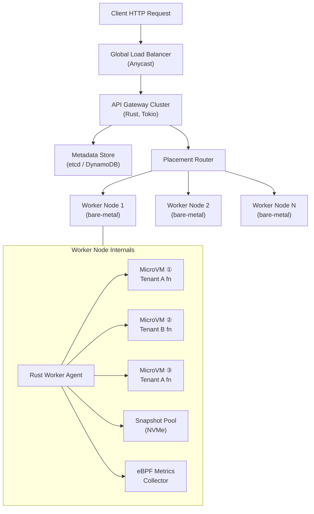

# System Design: Building a Serverless Compute Platform

## Speaker Intro

This handbook is written from the perspective of a **Principal Cloud Architect** who has designed, operated, and debugged multi-tenant serverless execution engines handling hundreds of thousands of concurrent function invocations in production. The content draws from first-hand experience building compute platforms at the intersection of systems programming, Linux kernel virtualization, and low-latency infrastructure — the kind of systems that power AWS Lambda, Cloudflare Workers, and Fly.io.

## Who This Is For

- **Platform engineers** building internal compute platforms and evaluating the trade-offs between containers, MicroVMs, and WebAssembly sandboxes.
- **Systems programmers** who want a concrete, end-to-end project (a serverless engine) instead of isolated toy examples.
- **Architects evaluating Rust** for latency-critical infrastructure and who need proof that the language can replace C/C++ in the hypervisor data plane.
- **Anyone who has *used* AWS Lambda or Google Cloud Functions** and been mystified by cold starts, execution timeouts, or per-millisecond billing — and wants to understand the machinery beneath the abstraction.
- **Security engineers** who need to understand the threat model of running untrusted code from thousands of tenants on shared physical hardware.

## Prerequisites

| Concept | Where to Learn |
|---|---|
| Intermediate Rust (ownership, traits, `async`) | [Async Rust](../async-book/src/SUMMARY.md) |
| Basic Linux syscalls (`fork`, `exec`, `ioctl`, `mmap`) | [Hardware Sympathy](../hardware-sympathy-book/src/SUMMARY.md) |
| Networking fundamentals (TCP, HTTP, load balancing) | [Tokio Internals](../tokio-internals-book/src/SUMMARY.md) |
| What containers are (Docker basics, namespaces, cgroups) | Docker documentation |
| What KVM is (conceptual understanding) | Linux KVM documentation |

## How to Use This Book

| Emoji | Meaning |
|---|---|
| 🟢 | **Architecture** — foundational design decisions, threat models, and component topology |
| 🟡 | **Implementation** — production-grade Rust code integrating with kernel APIs and Firecracker |
| 🔴 | **Kernel/Virtualization** — deep internals: VMM lifecycle, eBPF instrumentation, memory snapshotting |

Each chapter solves **one specific bottleneck or failure mode** of a serverless compute platform. Read them in order — later chapters assume the isolation layer and control plane from earlier chapters exist.

## The Problem We Are Solving

> Architect a **highly secure, multi-tenant serverless execution engine** in Rust capable of running **untrusted user functions** from thousands of tenants on shared physical hardware — with **zero cold-start latency**, **per-millisecond billing accuracy**, and **hardware-level isolation** between every invocation.

This is the same class of problem solved by AWS Lambda (Firecracker), Cloudflare Workers (V8 Isolates), and Fly.io (Firecracker). We will build the Firecracker-based variant from the ground up.

### Non-Negotiable Requirements

| Requirement | Target |
|---|---|
| Isolation | Hardware-level (KVM) — one compromised function must never read another tenant's memory |
| Cold start (from snapshot) | < 5 ms to first instruction execution |
| Cold start (fresh boot) | < 150 ms full MicroVM boot |
| Concurrency | ≥ 4,000 MicroVMs per physical host (m5.metal, 96 vCPUs) |
| Billing granularity | 1 ms precision, derived from kernel-level CPU accounting |
| Network isolation | Per-VM TAP device with strict `iptables` egress policy |
| Noisy neighbor protection | Hard `cgroup` limits on CPU, memory, disk I/O, and network bandwidth |

### High-Level Architecture

## Pacing Guide

| Chapter | Topic | Time | Checkpoint |
|---|---|---|---|
| Ch 0 | Introduction & Problem Statement | 30 min | Understand the design canvas |
| Ch 1 | The Isolation Boundary (Containers vs MicroVMs) | 4–6 hours | Can explain why Docker is insufficient for multi-tenant untrusted code |
| Ch 2 | The Rust Control Plane | 6–8 hours | API Gateway routing requests to workers via placement algorithm |
| Ch 3 | The Worker Node & VMM | 8–10 hours | MicroVM lifecycle management with cgroup + TAP isolation |
| Ch 4 | Eliminating Cold Starts (Memory Snapshotting) | 6–8 hours | Snapshot/restore cycle under 5 ms with pre-warmed pools |
| Ch 5 | Metrics, Billing, and Log Aggregation | 5–7 hours | eBPF-based CPU accounting with 1 ms billing precision |

**Total: ~30–40 hours** of focused study.

## Table of Contents

### Part I: Isolation & Security
1. **The Isolation Boundary — Containers vs MicroVMs 🟢** — Why standard Linux namespaces (Docker) fail the multi-tenant security bar. Introduction to KVM, virtio, and AWS Firecracker. Threat modeling for untrusted code execution.

### Part II: Control Plane
2. **The Rust Control Plane 🟡** — The API Gateway, metadata store, and placement router. How an HTTP request becomes a function invocation on a specific worker node. Consistent hashing, health checking, and graceful draining.

### Part III: Execution Engine
3. **The Worker Node & VMM 🔴** — The Rust agent managing MicroVM lifecycles on bare metal. Firecracker socket API, TAP networking, cgroup enforcement, and the warm pool strategy.
4. **Eliminating Cold Starts — Memory Snapshotting 🔴** — Pausing a running MicroVM, saving its RAM + CPU register state to NVMe, and restoring in under 5 ms. Copy-on-write page sharing across identical snapshots.

### Part IV: Observability & Operations
5. **Metrics, Billing, and Log Aggregation 🔴** — eBPF programs measuring CPU cycles and memory high-water marks. Per-invocation billing records. Secure log piping from guest `stdout` to the observability cluster.

## Companion Guides

| Guide | Relevance |
|---|---|
| [System Design: Message Broker](../system-design-book/src/SUMMARY.md) | Durable event streaming for invocation logs |
| [Async Rust](../async-book/src/SUMMARY.md) | Tokio runtime driving the control plane |
| [Hardware Sympathy](../hardware-sympathy-book/src/SUMMARY.md) | CPU caches, NUMA, memory-mapped I/O |
| [Unsafe & FFI](../unsafe-ffi-book/src/SUMMARY.md) | Calling into KVM and Firecracker C APIs |
| [Cloud-Native Rust](../cloud-native-book/src/SUMMARY.md) | Kubernetes operators and infrastructure-as-code |
