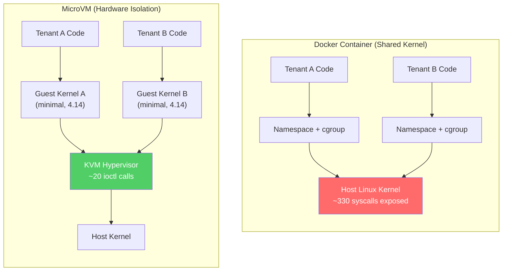
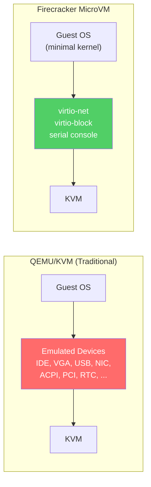
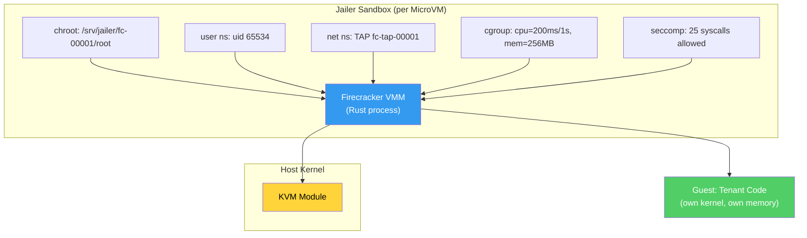
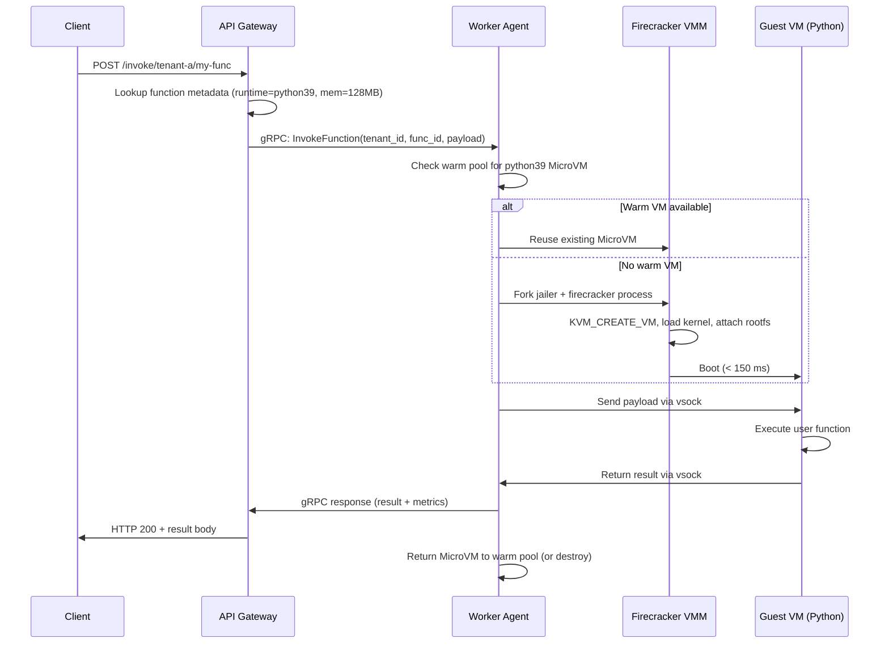

# 1. The Isolation Boundary — Containers vs MicroVMs 🟢

> **The Problem:** You are tasked with running untrusted code from thousands of tenants on the same physical server. A standard Docker container shares the host kernel — a single kernel exploit (e.g., CVE-2019-5736, the `runc` container escape) gives an attacker root access to *every other tenant's data* on that machine. The isolation boundary of Linux namespaces was never designed for hostile multi-tenancy. We need a stronger primitive.

---

## The Multi-Tenancy Threat Model

Before choosing an isolation technology, we must define what we are defending against:

| Threat | Description | Docker Mitigation | MicroVM Mitigation |
|---|---|---|---|
| **Kernel exploit** | Attacker triggers a bug in the shared host kernel | ❌ Shared kernel — game over | ✅ Guest has its own minimal kernel; host kernel attack surface reduced to KVM + virtio |
| **Container escape** | Attacker breaks out of namespace/cgroup jail | ❌ ~300+ syscalls available by default | ✅ Guest syscalls never reach host kernel directly |
| **Side-channel (Spectre/Meltdown)** | Attacker reads another tenant's memory via CPU cache timing | ❌ Shared address space makes this trivial | 🟡 Separate address spaces; further mitigated with core pinning |
| **Resource exhaustion** | Attacker consumes all CPU/memory/I/O | 🟡 cgroups help but are bypassable in edge cases | ✅ Hard virtio rate limits + cgroup on the VMM process |
| **Network sniffing** | Attacker captures traffic from other tenants | 🟡 Network namespaces help; bridge misconfig leaks | ✅ Dedicated TAP device per VM; no shared bridge |

### The Syscall Surface Problem

A standard Docker container exposes **~330 Linux syscalls** to the contained process. Even with seccomp-bpf filters, the practical minimum is around **~60 syscalls** — and every single one is an entry point into the *host kernel*.



**The key insight:** With a MicroVM, the untrusted code's syscalls are handled by a *guest kernel* that runs in a virtual machine. The only interface to the host is the KVM `ioctl` boundary — roughly **20 operations** versus **330 syscalls**. This is a **16× reduction** in attack surface.

---

## Linux Isolation Primitives — A Deep Dive

To understand why MicroVMs exist, we must first understand what Docker actually uses and where those primitives break down.

### Namespaces

Linux namespaces provide six isolation dimensions:

| Namespace | Isolates | Created Since |
|---|---|---|
| `mnt` | Filesystem mount points | Linux 2.4.19 (2002) |
| `pid` | Process IDs | Linux 3.8 (2013) |
| `net` | Network stack (interfaces, routes, iptables) | Linux 2.6.29 (2009) |
| `uts` | Hostname | Linux 2.6.19 (2006) |
| `ipc` | System V IPC, POSIX message queues | Linux 2.6.19 (2006) |
| `user` | UID/GID mappings | Linux 3.8 (2013) |

### Naive Approach: Relying on Namespaces Alone

```rust,ignore
use nix::sched::{clone, CloneFlags};
use nix::unistd::Pid;
use std::process::Command;

fn spawn_tenant_container(user_code_path: &str) -> nix::Result<Pid> {
    // 💥 SECURITY HAZARD: Running user code in a simple namespace jail.
    // The user code shares the HOST KERNEL. A kernel exploit = full compromise.

    let flags = CloneFlags::CLONE_NEWNS     // New mount namespace
              | CloneFlags::CLONE_NEWPID    // New PID namespace
              | CloneFlags::CLONE_NEWNET    // New network namespace
              | CloneFlags::CLONE_NEWUSER;  // New user namespace

    // 💥 MISSING: seccomp filters, AppArmor/SELinux, capability dropping.
    // Even with all of those, the process still makes syscalls into the HOST kernel.
    // CVE-2019-5736 (runc escape) proved this model is fundamentally broken
    // for hostile multi-tenancy.

    let mut stack = vec![0u8; 1024 * 1024]; // 1 MB stack
    let callback = Box::new(|| {
        Command::new(user_code_path)
            .spawn()
            .expect("failed to exec user code");
        0
    });

    unsafe { clone(callback, &mut stack, flags, None) }
}
```

**Why this fails:**

1. **Shared kernel:** All ~330 syscalls route directly to the host kernel. One `prctl` or `keyctl` vulnerability and the attacker escapes.
2. **No hardware boundary:** CPU speculative execution attacks (Spectre V1/V2) can leak data across namespace boundaries because they share the same physical address space.
3. **Incomplete isolation:** `/proc`, `/sys`, and device nodes require careful masking — misconfiguration is the norm, not the exception.

---

## Enter KVM — The Hardware Isolation Layer

**KVM (Kernel Virtual Machine)** turns Linux into a Type-1 hypervisor. Each virtual machine gets:

- Its own **virtual CPU** (executed on real hardware via Intel VT-x / AMD-V).
- Its own **virtual address space** (backed by Extended Page Tables — EPT).
- Its own **virtual I/O devices** (via virtio paravirtualized drivers).
- Its own **kernel** (a minimal Linux image, not the host kernel).

The host kernel never processes the guest's syscalls. The only host-side interaction is through the KVM `ioctl` interface:

```rust,ignore
use std::fs::OpenOptions;
use std::os::unix::io::AsRawFd;

/// Open the KVM device and create a new virtual machine.
fn create_vm() -> std::io::Result<i32> {
    // /dev/kvm is the KVM interface. Only privileged processes can open it.
    let kvm_fd = OpenOptions::new()
        .read(true)
        .write(true)
        .open("/dev/kvm")?;

    // KVM_CREATE_VM ioctl — creates a new VM with its own address space.
    // This is the isolation boundary: the VM cannot see host memory.
    let vm_fd = unsafe {
        libc::ioctl(kvm_fd.as_raw_fd(), 0xAE01 /* KVM_CREATE_VM */, 0)
    };

    if vm_fd < 0 {
        return Err(std::io::Error::last_os_error());
    }

    Ok(vm_fd)
}
```

### KVM Isolation Guarantees

| Property | Guarantee |
|---|---|
| Memory isolation | EPT (Extended Page Tables) ensure VM A cannot map VM B's physical pages |
| CPU isolation | Each vCPU runs in VMX non-root mode; privileged instructions trap to KVM |
| I/O isolation | virtio devices provide a minimal, well-audited I/O interface |
| Interrupt isolation | Virtual APIC; no access to host interrupt controller |

---

## AWS Firecracker — The MicroVM Revolution

Traditional virtual machines (QEMU/KVM) are full-featured but heavyweight:

| Property | QEMU/KVM | Firecracker |
|---|---|---|
| Boot time | 3–10 seconds | **< 150 ms** |
| Memory overhead | 100–200 MB per VM | **< 5 MB** per MicroVM |
| Device model | Full x86 (IDE, VGA, USB, etc.) | **Minimal** (virtio-net, virtio-block, serial console) |
| Codebase | ~1.5M lines (C) | **~50K lines (Rust)** |
| Attack surface | Huge — every emulated device is a target | Tiny — only virtio + serial |
| Density | ~50 VMs per host | **~4,000 MicroVMs per host** |

Firecracker achieves this by stripping the Virtual Machine Monitor (VMM) down to the bare minimum:



### Firecracker Architecture

Firecracker is a VMM (Virtual Machine Monitor) written in Rust. It runs as a **single process per MicroVM**:

```
Host Machine (bare metal, Linux 4.14+)
├── firecracker (process, PID 1001)  ← MicroVM for Tenant A
│   ├── /dev/kvm (ioctl interface)
│   ├── TAP device: fc-tap-1001
│   ├── Block device: /mnt/snapshots/rootfs-python39.ext4
│   └── Memory: 128 MB (virtio-balloon adjustable)
│
├── firecracker (process, PID 1002)  ← MicroVM for Tenant B
│   ├── /dev/kvm (ioctl interface)
│   ├── TAP device: fc-tap-1002
│   ├── Block device: /mnt/snapshots/rootfs-nodejs18.ext4
│   └── Memory: 256 MB
│
└── worker-agent (Rust process)       ← Our control agent
    ├── Manages MicroVM lifecycle via Unix socket API
    ├── Maintains warm pool of pre-booted MicroVMs
    └── Reports metrics to control plane
```

### The Firecracker Socket API

Firecracker exposes a **RESTful API over a Unix domain socket**. The worker agent configures and controls the MicroVM by sending JSON:

```rust,ignore
use hyper::{Body, Client, Method, Request};
use hyperlocal::{UnixClientExt, Uri};
use serde_json::json;

/// Configure a Firecracker MicroVM's machine settings.
///
/// This is the production approach: Firecracker's socket API provides
/// a minimal, well-defined interface for VM lifecycle management.
async fn configure_microvm(socket_path: &str) -> Result<(), Box<dyn std::error::Error>> {
    let client = Client::unix();

    // ✅ FIX: Hardware-level isolation via Firecracker MicroVMs.
    // Each tenant gets their own kernel, virtual CPU, and memory space.
    // The attack surface is reduced to ~20 KVM ioctls instead of ~330 syscalls.

    // Step 1: Configure the machine (vCPUs, memory).
    let machine_config = json!({
        "vcpu_count": 2,
        "mem_size_mib": 128,
        "smt": false  // Disable hyper-threading to mitigate Spectre
    });

    let req = Request::builder()
        .method(Method::PUT)
        .uri(Uri::new(socket_path, "/machine-config"))
        .header("Content-Type", "application/json")
        .body(Body::from(machine_config.to_string()))?;
    client.request(req).await?;

    // Step 2: Set the guest kernel image.
    let boot_source = json!({
        "kernel_image_path": "/opt/firecracker/vmlinux-5.10-minimal",
        "boot_args": "console=ttyS0 reboot=k panic=1 pci=off"
    });

    let req = Request::builder()
        .method(Method::PUT)
        .uri(Uri::new(socket_path, "/boot-source"))
        .header("Content-Type", "application/json")
        .body(Body::from(boot_source.to_string()))?;
    client.request(req).await?;

    // Step 3: Attach the root filesystem.
    let rootfs = json!({
        "drive_id": "rootfs",
        "path_on_host": "/mnt/rootfs/python39-minimal.ext4",
        "is_root_device": true,
        "is_read_only": true  // ✅ Read-only rootfs — prevents persistence attacks
    });

    let req = Request::builder()
        .method(Method::PUT)
        .uri(Uri::new(socket_path, "/drives/rootfs"))
        .header("Content-Type", "application/json")
        .body(Body::from(rootfs.to_string()))?;
    client.request(req).await?;

    Ok(())
}
```

---

## MicroVM Boot Sequence — Under 150 ms

The Firecracker boot sequence is aggressively optimized:

| Phase | Time | What Happens |
|---|---|---|
| VMM process start | ~2 ms | `fork+exec` the Firecracker binary |
| KVM_CREATE_VM | ~1 ms | Kernel creates the VM's EPT and virtual APIC |
| Memory setup | ~5 ms | Map 128 MB of host anonymous memory into guest physical space |
| Kernel load | ~10 ms | Load the minimal `vmlinux` into guest memory |
| vCPU start | ~1 ms | Issue `KVM_RUN` on the vCPU thread |
| Guest kernel boot | ~100–130 ms | Linux init → mount rootfs → start init process |
| **Total** | **~125 ms** | First user-space instruction executes |

```mermaid
gantt
    title Firecracker MicroVM Boot Timeline
    dateFormat X
    axisFormat %L ms

    section Host-side
    Fork + exec VMM           :a1, 0, 2
    KVM_CREATE_VM             :a2, 2, 3
    Map guest memory          :a3, 3, 8
    Load vmlinux              :a4, 8, 18
    KVM_RUN vCPU              :a5, 18, 19

    section Guest-side
    Kernel decompression      :b1, 19, 40
    Kernel init               :b2, 40, 90
    Mount rootfs              :b3, 90, 110
    Start init process        :b4, 110, 125
    User function ready       :milestone, 125, 125
```



---

## The Rootfs Strategy

Each language runtime (Python, Node.js, Go, etc.) gets a **pre-built, minimal ext4 filesystem image**:

| Rootfs Image | Size | Contents |
|---|---|---|
| `python39-minimal.ext4` | 45 MB | BusyBox + Python 3.9 + pip-installed deps |
| `nodejs18-minimal.ext4` | 38 MB | BusyBox + Node.js 18 LTS + npm packages |
| `go121-minimal.ext4` | 12 MB | Statically linked Go binary runtime |
| `rust-wasm-minimal.ext4` | 8 MB | Wasmtime runtime for pre-compiled Wasm |

**Critical design decisions:**

1. **Read-only rootfs.** Mounted as `ro` to prevent the untrusted function from persisting malware or exfiltrating data through the filesystem.
2. **Overlay for `/tmp`.** A small tmpfs (16 MB) is mounted at `/tmp` for scratch space. It evaporates when the MicroVM is destroyed.
3. **No init system.** No systemd, no OpenRC. The init process is a minimal Rust binary that reads the function payload from virtio-vsock and executes it.

### Custom Init Binary

```rust,ignore
// This runs INSIDE the MicroVM as PID 1.
// It is the entire "operating system" from the guest's perspective.

use std::io::{Read, Write};
use std::process::Command;

fn main() {
    // Mount essential filesystems.
    mount_proc_sys();

    // Read function payload from vsock (host → guest communication).
    let payload = read_function_from_vsock();

    // Write the user's code to a temporary file.
    let code_path = "/tmp/user_function.py";
    std::fs::write(code_path, &payload.code)
        .expect("failed to write user code");

    // Execute with resource limits enforced by the guest kernel.
    let output = Command::new("python3")
        .arg(code_path)
        .env("AWS_LAMBDA_RUNTIME_API", "127.0.0.1:9001")
        .output()
        .expect("failed to execute user function");

    // Send result back over vsock.
    send_result_over_vsock(&output);

    // Halt the VM. The host will reclaim all resources.
    unsafe { libc::reboot(libc::LINUX_REBOOT_CMD_POWER_OFF) };
}

fn mount_proc_sys() {
    use nix::mount::{mount, MsFlags};
    mount(Some("proc"), "/proc", Some("proc"), MsFlags::empty(), None::<&str>).ok();
    mount(Some("sysfs"), "/sys", Some("sysfs"), MsFlags::empty(), None::<&str>).ok();
    mount(Some("tmpfs"), "/tmp", Some("tmpfs"), MsFlags::empty(), Some("size=16m")).ok();
}

# // Placeholder stubs for compilation context
# struct Payload { code: Vec<u8> }
# fn read_function_from_vsock() -> Payload { todo!() }
# fn send_result_over_vsock(_output: &std::process::Output) { todo!() }
```

---

## Security Hardening Checklist

Even with MicroVM isolation, defense-in-depth is non-negotiable:

| Layer | Control | Purpose |
|---|---|---|
| **KVM** | Disable SMT (`smt: false`) | Mitigate Spectre/MDS side-channels across hyper-threads |
| **Firecracker** | `--seccomp-filter strict` | Restrict the VMM process itself to ~25 syscalls |
| **Host** | Jailer process | Run each Firecracker instance in its own chroot + cgroup + user namespace |
| **Network** | Per-VM TAP device | No shared bridge; `iptables` restrict egress to allowed CIDRs |
| **Rootfs** | Read-only mount | Prevents persistence, limits attacker's ability to stage tools |
| **Guest** | No network by default | Functions must explicitly opt-in to network access |
| **Guest** | ASLR + W^X | Guest kernel enforces standard memory protections |

### The Jailer — Firecracker's Second Isolation Ring

Firecracker ships with a **jailer** binary that wraps the VMM process in additional Linux security primitives:

```
jailer --id fc-00001 \
       --exec-file /usr/bin/firecracker \
       --uid 65534 \                     # nobody user
       --gid 65534 \                     # nobody group
       --chroot-base-dir /srv/jailer \   # Isolated filesystem view
       --netns /var/run/netns/fc-00001   # Dedicated network namespace
```

The jailer provides:
1. **chroot** — The VMM can only see its own rootfs and socket files.
2. **User namespace** — The VMM runs as an unprivileged user, even though KVM requires `/dev/kvm` access (granted via device cgroup).
3. **Network namespace** — Each VMM gets a dedicated network namespace with a single TAP device.
4. **cgroup** — CPU, memory, and I/O limits on the VMM process itself (not just the guest).



---

## Comparison Matrix — Isolation Technologies

| Feature | Docker + seccomp | gVisor (runsc) | Kata Containers | Firecracker | V8 Isolates |
|---|---|---|---|---|---|
| Isolation level | Namespace | User-space kernel | QEMU/KVM VM | Minimal KVM VM | Process + V8 sandbox |
| Kernel shared? | ✅ Yes (host) | 🟡 Intercepted (Sentry) | ❌ No (guest) | ❌ No (guest) | ✅ Yes (host) |
| Boot time | ~500 ms | ~300 ms | 1–3 s | **< 150 ms** | **< 5 ms** |
| Memory overhead | ~10 MB | ~30 MB | ~100 MB | **< 5 MB** | **< 3 MB** |
| Syscall attack surface | ~60 (filtered) | ~220 (Sentry) | ~20 (KVM) | **~20 (KVM)** | N/A (V8 API) |
| Language support | Any | Any | Any | Any | **JavaScript/Wasm only** |
| Density (per host) | ~200 | ~150 | ~50 | **~4,000** | **~10,000** |
| Can run arbitrary binaries? | ✅ | ✅ | ✅ | ✅ | ❌ |
| Production users | Everyone | Google (Cloud Run) | OpenStack | **AWS Lambda** | **Cloudflare Workers** |

### When to Choose What

- **Docker + seccomp:** Internal CI/CD where you trust the code. Never for hostile multi-tenancy.
- **gVisor:** Good middle ground when KVM is unavailable (nested virtualization not supported).
- **Kata Containers:** When you need full QEMU compatibility and don't care about boot time.
- **Firecracker:** When you need **maximum density + minimum boot time + hardware isolation**. This is the choice for a production serverless platform running arbitrary languages.
- **V8 Isolates:** When you only need JavaScript/Wasm and want sub-millisecond cold starts.

---

## Building the Rootfs — Practical Walkthrough

A production rootfs builder uses a multi-stage process:

```rust,ignore
use std::process::Command;

/// Build a minimal ext4 rootfs for a Python 3.9 runtime.
///
/// The output is a self-contained filesystem image that Firecracker
/// can mount as the guest's root device.
fn build_python_rootfs(output_path: &str) -> std::io::Result<()> {
    let build_dir = "/tmp/rootfs-build";

    // ✅ PRODUCTION APPROACH: Multi-stage build with minimal base.
    // 1. Start from a minimal Alpine chroot (not a full distro).
    // 2. Install only the language runtime.
    // 3. Strip debug symbols and unnecessary files.
    // 4. Package as a fixed-size ext4 image.

    // Create sparse file for the filesystem (64 MB).
    Command::new("dd")
        .args(["if=/dev/zero", &format!("of={output_path}"), "bs=1M", "count=0", "seek=64"])
        .status()?;

    // Format as ext4.
    Command::new("mkfs.ext4")
        .args(["-F", output_path])
        .status()?;

    // Mount and populate.
    Command::new("mount")
        .args(["-o", "loop", output_path, build_dir])
        .status()?;

    // Install minimal Alpine base + Python.
    Command::new("apk")
        .args(["--root", build_dir, "--initdb", "add",
               "busybox", "python3", "py3-pip"])
        .status()?;

    // Copy our custom init binary.
    std::fs::copy("/opt/init-binaries/fc-init", format!("{build_dir}/sbin/init"))?;

    // Strip unnecessary files to minimize image size.
    for pattern in &["usr/share/man", "usr/share/doc", "var/cache"] {
        let path = format!("{build_dir}/{pattern}");
        if std::path::Path::new(&path).exists() {
            std::fs::remove_dir_all(&path)?;
        }
    }

    Command::new("umount").arg(build_dir).status()?;

    Ok(())
}
```

---

## Network Isolation Deep Dive

Every MicroVM gets a dedicated **TAP device** — a virtual network interface that acts as a point-to-point link between the guest and the host:

```
┌──────────────────────────────────────────────┐
│  Guest VM (Tenant A)                         │
│  eth0: 172.16.0.2/30 ──────► virtio-net     │
└──────────────────────┬───────────────────────┘
                       │ (virtio-net ← → TAP)
┌──────────────────────▼───────────────────────┐
│  Host                                        │
│  fc-tap-00001: 172.16.0.1/30                 │
│  iptables:                                   │
│    -A FORWARD -i fc-tap-00001 -d 10.0.0.0/8 │
│      -j DROP    # No lateral movement        │
│    -A FORWARD -i fc-tap-00001 -d 169.254.x.x│
│      -j DROP    # No metadata service access │
│    -A FORWARD -i fc-tap-00001                │
│      -j ACCEPT  # Allow internet egress      │
│    -t nat -A POSTROUTING -o eth0             │
│      -j MASQUERADE                           │
└──────────────────────────────────────────────┘
```

### TAP Device Setup

```rust,ignore
use std::process::Command;

/// Create and configure a TAP device for a MicroVM.
///
/// Each MicroVM gets a /30 subnet (2 usable IPs):
/// - .1 = host side (gateway)
/// - .2 = guest side (assigned inside the VM)
fn setup_tap_device(vm_id: u32) -> std::io::Result<String> {
    let tap_name = format!("fc-tap-{:05}", vm_id);
    let host_ip = format!("172.16.{}.{}/30",
        (vm_id / 64) % 256,
        (vm_id % 64) * 4 + 1
    );

    // Create the TAP device.
    Command::new("ip")
        .args(["tuntap", "add", &tap_name, "mode", "tap"])
        .status()?;

    // Assign host-side IP.
    Command::new("ip")
        .args(["addr", "add", &host_ip, "dev", &tap_name])
        .status()?;

    // Bring it up.
    Command::new("ip")
        .args(["link", "set", &tap_name, "up"])
        .status()?;

    // ✅ SECURITY: Block lateral movement to other VMs and host services.
    // Only allow egress to the internet via the host's default route.
    for rule in &[
        // Block access to the host's metadata service (169.254.169.254)
        format!("-A FORWARD -i {tap_name} -d 169.254.0.0/16 -j DROP"),
        // Block access to other VM subnets (lateral movement)
        format!("-A FORWARD -i {tap_name} -d 172.16.0.0/12 -j DROP"),
        // Block access to host-local services
        format!("-A FORWARD -i {tap_name} -d 127.0.0.0/8 -j DROP"),
        // Allow remaining traffic (internet egress)
        format!("-A FORWARD -i {tap_name} -j ACCEPT"),
    ] {
        Command::new("iptables")
            .args(rule.split_whitespace())
            .status()?;
    }

    Ok(tap_name)
}
```

---

## Worked Example: End-to-End Invocation

Let's trace a function invocation from HTTP request to result:



---

> **Key Takeaways**
>
> 1. **Linux namespaces (Docker) are not sufficient** for hostile multi-tenancy. The shared kernel is a single point of compromise with ~330 syscall entry points.
> 2. **KVM provides hardware-level isolation** with only ~20 `ioctl` entry points. The guest's syscalls never reach the host kernel.
> 3. **Firecracker reduces KVM overhead** by eliminating unnecessary device emulation. A MicroVM boots in < 150 ms with < 5 MB overhead, enabling ~4,000 VMs per host.
> 4. **Defense-in-depth is mandatory:** Firecracker's Jailer adds chroot + user namespace + cgroup + seccomp on top of KVM isolation.
> 5. **Network isolation uses per-VM TAP devices** with strict `iptables` rules. No shared bridges, no lateral movement, no metadata service access.
> 6. **Read-only rootfs images** are pre-built per language runtime and mounted immutably. A tmpfs overlay provides ephemeral scratch space.
