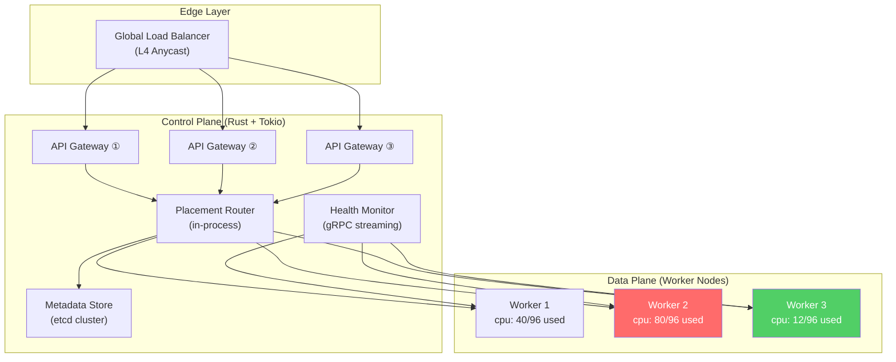
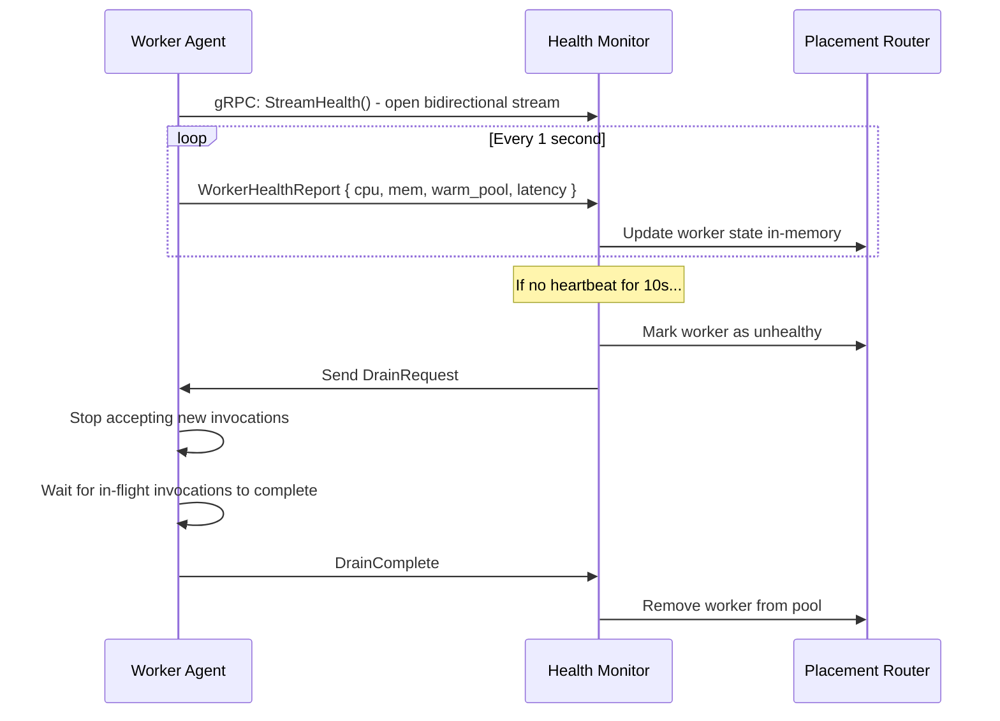
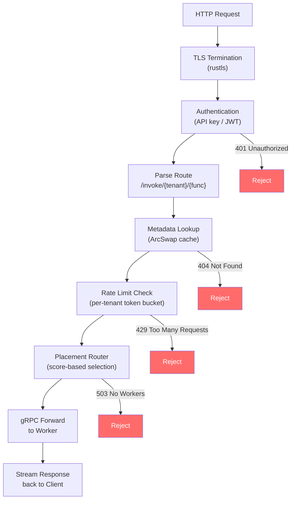
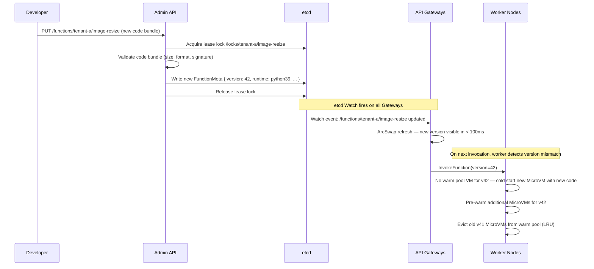

# 2. The Rust Control Plane 🟡

> **The Problem:** You have thousands of worker nodes, each capable of running thousands of MicroVMs. An HTTP request arrives: "execute `tenant-a/image-resize` with this 4 MB payload." Which worker should run it? How do you avoid sending all traffic to one overloaded node while another sits idle? How do you drain a node for maintenance without dropping in-flight invocations? The control plane is the brain that turns raw compute capacity into a reliable serverless platform.

---

## Control Plane Architecture

The control plane has three responsibilities:

1. **API Gateway:** Accept HTTP invocations, authenticate the caller, and look up function metadata.
2. **Placement Router:** Select the optimal worker node for each invocation based on real-time capacity.
3. **Metadata Store:** Persist function definitions, tenant quotas, and worker registrations.



---

## The API Gateway

The gateway is a Tokio-based HTTP server that:
1. Terminates TLS.
2. Authenticates the request (API key or IAM token).
3. Looks up the function definition in the metadata store.
4. Forwards the invocation to the placement router.
5. Streams the response back to the client.

### Request Flow

```
POST /invoke/tenant-a/image-resize HTTP/1.1
Authorization: Bearer <token>
Content-Type: application/octet-stream
Content-Length: 4194304

<4 MB image payload>
```

### Naive Approach: Synchronous Metadata Lookup per Request

```rust,ignore
use std::collections::HashMap;
use std::sync::Mutex;

struct NaiveGateway {
    // 💥 PERFORMANCE HAZARD: Global mutex for every request.
    // At 100K req/sec, this serializes all metadata lookups.
    functions: Mutex<HashMap<String, FunctionMeta>>,
}

impl NaiveGateway {
    fn handle_invoke(&self, tenant: &str, func_name: &str) -> Result<Response, Error> {
        // 💥 LATENCY HAZARD: Blocking lock in the async hot path.
        let functions = self.functions.lock().unwrap();
        let meta = functions.get(&format!("{tenant}/{func_name}"))
            .ok_or(Error::NotFound)?;

        // 💥 SINGLE POINT OF FAILURE: No fallback if metadata store is down.
        // 💥 NO CACHING: Every request hits the store, adding 2-5ms of latency.
        let worker = self.pick_random_worker()?;  // Random ≠ optimal
        self.forward_to_worker(worker, meta)
    }
}

# struct FunctionMeta;
# struct Response;
# struct Error;
# impl Error { fn NotFound() -> Self { todo!() } }
```

**Problems:**
- Global `Mutex` serializes all lookups — 100K req/sec becomes sequential.
- No caching — every request queries the metadata store (etcd round-trip: 2–5 ms).
- Random worker selection ignores CPU load, memory pressure, and warm pool state.
- No circuit breaker — a slow metadata store blocks the entire gateway.

### Production Approach: Lock-Free Cache with Background Refresh

```rust,ignore
use arc_swap::ArcSwap;
use dashmap::DashMap;
use std::sync::Arc;
use std::time::Duration;
use tokio::time;

/// Function metadata cached in the gateway.
#[derive(Clone, Debug)]
struct FunctionMeta {
    tenant_id: String,
    function_name: String,
    runtime: Runtime,
    memory_mib: u32,
    timeout_ms: u64,
    concurrency_limit: u32,
}

#[derive(Clone, Debug)]
enum Runtime {
    Python39,
    Nodejs18,
    Go121,
    RustWasm,
}

/// The production API Gateway.
///
/// Uses a lock-free snapshot of function metadata that is refreshed
/// every 5 seconds from the metadata store. Hot-path lookups are
/// a single atomic pointer dereference — no locks, no I/O.
struct Gateway {
    /// Lock-free, atomically swappable function map.
    /// Readers never block; the writer swaps the entire map atomically.
    functions: ArcSwap<std::collections::HashMap<String, FunctionMeta>>,

    /// Per-tenant rate limiter (concurrent map, lock-free per-key).
    rate_limiters: DashMap<String, RateLimiter>,

    /// Placement router (see below).
    router: Arc<PlacementRouter>,
}

impl Gateway {
    /// Handle an invocation request.
    ///
    /// This is the hot path — called for every single invocation.
    /// Zero allocations, zero locks, zero I/O for the metadata lookup.
    async fn handle_invoke(
        &self,
        tenant: &str,
        func_name: &str,
        payload: bytes::Bytes,
    ) -> Result<InvocationResult, GatewayError> {
        // ✅ FIX: Lock-free read via ArcSwap. Cost: one atomic load.
        let functions = self.functions.load();
        let key = format!("{tenant}/{func_name}");
        let meta = functions.get(&key)
            .ok_or(GatewayError::FunctionNotFound(key))?;

        // ✅ FIX: Per-tenant rate limiting.
        let limiter = self.rate_limiters
            .entry(tenant.to_string())
            .or_insert_with(|| RateLimiter::new(meta.concurrency_limit));
        if !limiter.try_acquire() {
            return Err(GatewayError::RateLimited(tenant.to_string()));
        }

        // ✅ FIX: Intelligent placement based on real-time worker capacity.
        let worker = self.router.select_worker(meta).await?;

        // Forward the invocation to the selected worker.
        let result = worker
            .invoke(meta.clone(), payload)
            .await
            .map_err(|e| GatewayError::WorkerError(e.to_string()))?;

        Ok(result)
    }

    /// Background task: refresh function metadata every 5 seconds.
    ///
    /// This runs on a dedicated Tokio task. Failures are logged but
    /// do not affect the serving path — stale data is better than no data.
    async fn metadata_refresh_loop(&self, etcd_client: etcd_client::Client) {
        let mut interval = time::interval(Duration::from_secs(5));
        loop {
            interval.tick().await;
            match self.fetch_all_functions(&etcd_client).await {
                Ok(new_map) => {
                    // ✅ Atomic swap — readers see old or new, never partial.
                    self.functions.store(Arc::new(new_map));
                }
                Err(e) => {
                    eprintln!("metadata refresh failed: {e}");
                    // Continue serving with stale data. Log the error
                    // and alert if staleness exceeds 30 seconds.
                }
            }
        }
    }

    async fn fetch_all_functions(
        &self,
        _client: &etcd_client::Client,
    ) -> Result<std::collections::HashMap<String, FunctionMeta>, Box<dyn std::error::Error>> {
        // In production: etcd range query with prefix "/functions/"
        // Deserialize each value into FunctionMeta.
        todo!("etcd range scan")
    }
}

# struct RateLimiter;
# impl RateLimiter {
#     fn new(_limit: u32) -> Self { todo!() }
#     fn try_acquire(&self) -> bool { todo!() }
# }
# struct PlacementRouter;
# struct InvocationResult;
# #[derive(Debug)]
# enum GatewayError { FunctionNotFound(String), RateLimited(String), WorkerError(String), NoWorkersAvailable }
```

### Cache Architecture — Why ArcSwap?

| Approach | Read Cost | Write Cost | Contention at 100K rps |
|---|---|---|---|
| `Mutex<HashMap>` | Lock + lookup | Lock + insert | **Catastrophic** — all reads serialize |
| `RwLock<HashMap>` | Read lock + lookup | Write lock + rebuild | **Bad** — write starves readers |
| `DashMap` | Shard lock + lookup | Shard lock + insert | **Moderate** — 64 shards by default |
| `ArcSwap<HashMap>` | **Atomic pointer load** | Clone + swap | **Zero** — readers never block |

`ArcSwap` is the right choice because:
- The metadata changes **rarely** (every 5 seconds) but is read **on every request**.
- We can afford to clone the entire map on refresh — at 10K functions, this is ~1 MB copied once every 5 seconds.
- Readers get a consistent snapshot with zero contention.

---

## The Placement Router

The placement router answers: **"Given this function's requirements (runtime, memory, CPU), which worker node should execute it?"**

### Placement Objectives

| Objective | Weight | Why |
|---|---|---|
| **Warm pool hit** | Highest | A worker with a pre-booted MicroVM of the right runtime avoids cold start entirely |
| **CPU headroom** | High | Avoid scheduling on a worker at 90%+ CPU — latency degrades non-linearly |
| **Memory availability** | High | A 512 MB function cannot be placed on a worker with 100 MB free |
| **Locality** | Medium | Place functions that call each other on the same worker or rack |
| **Spread** | Low | Distribute a tenant's functions across failure domains |

### Worker State

Each worker reports its current capacity via a gRPC health stream:

```rust,ignore
use std::collections::HashMap;
use std::time::Instant;

/// Real-time capacity snapshot from a worker node.
#[derive(Clone, Debug)]
struct WorkerState {
    worker_id: String,
    endpoint: String,

    // Resource capacity
    total_vcpus: u32,
    used_vcpus: u32,
    total_memory_mib: u64,
    used_memory_mib: u64,

    // Warm pool state: runtime → number of pre-booted MicroVMs available
    warm_pool: HashMap<String, u32>,

    // Health
    last_heartbeat: Instant,
    is_draining: bool,

    // Performance
    p99_invoke_latency_ms: f64,
    active_invocations: u32,
}

impl WorkerState {
    /// Score this worker for a given function.
    /// Higher score = better placement candidate.
    fn score(&self, meta: &FunctionMeta) -> f64 {
        if self.is_draining {
            return 0.0; // Never place on a draining node
        }

        let available_vcpus = self.total_vcpus - self.used_vcpus;
        let available_memory = self.total_memory_mib - self.used_memory_mib;

        // Hard constraints — cannot place if resources are insufficient.
        if available_memory < meta.memory_mib as u64 {
            return 0.0;
        }
        if available_vcpus < 2 {
            return 0.0; // Minimum 2 vCPUs per MicroVM
        }

        let mut score = 0.0;

        // Warm pool bonus: +100 if a pre-booted VM of the right runtime exists.
        let runtime_key = format!("{:?}", meta.runtime);
        if let Some(&warm_count) = self.warm_pool.get(&runtime_key) {
            if warm_count > 0 {
                score += 100.0;
            }
        }

        // CPU headroom: score proportional to available capacity.
        // Non-linear: penalize heavily above 80% utilization.
        let cpu_utilization = self.used_vcpus as f64 / self.total_vcpus as f64;
        score += (1.0 - cpu_utilization.powf(3.0)) * 50.0;

        // Memory headroom.
        let mem_utilization = self.used_memory_mib as f64 / self.total_memory_mib as f64;
        score += (1.0 - mem_utilization) * 30.0;

        // Latency penalty: if p99 > 100ms, this worker is struggling.
        if self.p99_invoke_latency_ms > 100.0 {
            score -= 20.0;
        }

        score
    }
}
```

### The Placement Algorithm

```rust,ignore
use std::sync::Arc;
use tokio::sync::RwLock;

struct PlacementRouter {
    /// All known worker states, refreshed by the health monitor.
    workers: Arc<RwLock<Vec<WorkerState>>>,
}

impl PlacementRouter {
    /// Select the best worker for a function invocation.
    ///
    /// Strategy: Score all workers and pick the highest-scoring one.
    /// Tie-break by adding small random jitter to prevent thundering herd.
    async fn select_worker(
        &self,
        meta: &FunctionMeta,
    ) -> Result<WorkerHandle, GatewayError> {
        let workers = self.workers.read().await;

        // ✅ FIX: Score-based placement instead of random selection.
        let mut best_score = 0.0_f64;
        let mut best_worker: Option<&WorkerState> = None;

        for worker in workers.iter() {
            // Skip workers with stale heartbeats (> 10 seconds).
            if worker.last_heartbeat.elapsed().as_secs() > 10 {
                continue;
            }

            let score = worker.score(meta);
            if score > best_score {
                best_score = score;
                best_worker = Some(worker);
            }
        }

        let worker = best_worker
            .ok_or(GatewayError::NoWorkersAvailable)?;

        Ok(WorkerHandle {
            endpoint: worker.endpoint.clone(),
            worker_id: worker.worker_id.clone(),
        })
    }
}

# struct WorkerHandle { endpoint: String, worker_id: String }
```

---

## Health Monitoring — gRPC Streaming

Workers continuously stream their capacity to the control plane:



### Health Report Protocol

```rust,ignore
use tonic::{Request, Response, Status, Streaming};
use tokio_stream::StreamExt;

/// gRPC service definition (conceptual — would be generated from .proto)
struct HealthMonitorService {
    router: Arc<PlacementRouter>,
}

impl HealthMonitorService {
    /// Called by each worker to stream health reports.
    async fn stream_health(
        &self,
        request: Request<Streaming<WorkerHealthReport>>,
    ) -> Result<Response<()>, Status> {
        let mut stream = request.into_inner();

        while let Some(report) = stream.next().await {
            let report = report.map_err(|e| Status::internal(e.to_string()))?;

            // Update the router's view of this worker.
            let mut workers = self.router.workers.write().await;
            if let Some(worker) = workers.iter_mut()
                .find(|w| w.worker_id == report.worker_id)
            {
                worker.used_vcpus = report.used_vcpus;
                worker.used_memory_mib = report.used_memory_mib;
                worker.warm_pool = report.warm_pool.clone();
                worker.p99_invoke_latency_ms = report.p99_invoke_latency_ms;
                worker.active_invocations = report.active_invocations;
                worker.last_heartbeat = Instant::now();
            }
        }

        Ok(Response::new(()))
    }
}

# struct WorkerHealthReport {
#     worker_id: String,
#     used_vcpus: u32,
#     used_memory_mib: u64,
#     warm_pool: HashMap<String, u32>,
#     p99_invoke_latency_ms: f64,
#     active_invocations: u32,
# }
```

---

## Graceful Draining

When a worker needs to be taken down for maintenance (OS patching, hardware replacement):

```rust,ignore
/// Gracefully drain a worker node.
///
/// This is called by the operator via a management API.
/// The worker stops accepting new invocations but finishes in-flight work.
async fn drain_worker(
    router: &PlacementRouter,
    worker_id: &str,
    timeout: Duration,
) -> Result<(), DrainError> {
    // Step 1: Mark worker as draining in the placement router.
    // The router will immediately stop sending new invocations to this worker.
    {
        let mut workers = router.workers.write().await;
        if let Some(worker) = workers.iter_mut()
            .find(|w| w.worker_id == worker_id)
        {
            worker.is_draining = true;
        } else {
            return Err(DrainError::WorkerNotFound(worker_id.to_string()));
        }
    }

    // Step 2: Wait for in-flight invocations to complete.
    let deadline = Instant::now() + timeout;
    loop {
        if Instant::now() > deadline {
            return Err(DrainError::Timeout);
        }

        let workers = router.workers.read().await;
        let worker = workers.iter()
            .find(|w| w.worker_id == worker_id);

        match worker {
            Some(w) if w.active_invocations == 0 => break,
            Some(w) => {
                eprintln!(
                    "drain {}: waiting for {} invocations",
                    worker_id, w.active_invocations
                );
            }
            None => break, // Worker already removed
        }
        drop(workers); // Release read lock before sleeping
        tokio::time::sleep(Duration::from_secs(1)).await;
    }

    // Step 3: Remove worker from the pool.
    {
        let mut workers = router.workers.write().await;
        workers.retain(|w| w.worker_id != worker_id);
    }

    Ok(())
}

# use std::time::{Duration, Instant};
# #[derive(Debug)]
# enum DrainError { WorkerNotFound(String), Timeout }
```

---

## Metadata Store — etcd Design

The metadata store holds:

| Key Pattern | Value | Access Pattern |
|---|---|---|
| `/functions/{tenant}/{name}` | `FunctionMeta` (JSON) | Bulk read every 5s by gateways |
| `/workers/{id}` | `WorkerRegistration` (JSON) | Written on join, deleted on leave |
| `/quotas/{tenant}` | `TenantQuota` (JSON) | Read on invoke, written by billing |
| `/locks/{tenant}/{name}` | Lease-based lock | Used during function deployment |

### Why etcd?

| Store | Consistency | Watch Support | Latency | Operational Complexity |
|---|---|---|---|---|
| Redis | Eventual (default) | Pub/sub (lossy) | < 1 ms | Low |
| etcd | **Linearizable** | **Watch (reliable)** | 2–5 ms | Medium |
| DynamoDB | Eventual/Strong | Streams (delayed) | 5–10 ms | Low (managed) |
| ZooKeeper | Linearizable | Watch (reliable) | 2–5 ms | High |

etcd is the choice because:
1. **Linearizable reads** ensure all gateways see the same function definitions.
2. **Watch API** allows instant invalidation when a function is deployed — no polling delay.
3. **Lease-based locks** enable safe concurrent deployments.
4. **Small dataset** — even with 100K functions, the total metadata is < 100 MB. This is etcd's sweet spot.

---

## API Gateway — Full Request Pipeline



### Rate Limiting — Token Bucket per Tenant

```rust,ignore
use std::sync::atomic::{AtomicU64, Ordering};
use std::time::Instant;

/// A lock-free token bucket rate limiter.
///
/// Each tenant gets their own bucket with a configurable
/// rate (tokens/sec) and burst (max tokens).
struct RateLimiter {
    max_tokens: u64,
    refill_rate: f64, // tokens per second
    tokens: AtomicU64, // stored as tokens * 1000 (fixed-point)
    last_refill: std::sync::Mutex<Instant>,
}

impl RateLimiter {
    fn new(max_concurrent: u32) -> Self {
        let max_tokens = max_concurrent as u64;
        Self {
            max_tokens,
            refill_rate: max_tokens as f64, // Refill fully in 1 second
            tokens: AtomicU64::new(max_tokens * 1000),
            last_refill: std::sync::Mutex::new(Instant::now()),
        }
    }

    fn try_acquire(&self) -> bool {
        // Refill tokens based on elapsed time.
        {
            let mut last = self.last_refill.lock().unwrap();
            let elapsed = last.elapsed().as_secs_f64();
            if elapsed > 0.001 {
                let new_tokens = (elapsed * self.refill_rate * 1000.0) as u64;
                let current = self.tokens.load(Ordering::Relaxed);
                let capped = (current + new_tokens).min(self.max_tokens * 1000);
                self.tokens.store(capped, Ordering::Relaxed);
                *last = Instant::now();
            }
        }

        // Try to consume one token.
        loop {
            let current = self.tokens.load(Ordering::Relaxed);
            if current < 1000 {
                return false; // No tokens available
            }
            match self.tokens.compare_exchange_weak(
                current,
                current - 1000,
                Ordering::Relaxed,
                Ordering::Relaxed,
            ) {
                Ok(_) => return true,
                Err(_) => continue, // CAS failed, retry
            }
        }
    }
}
```

---

## Scaling the Control Plane

| Component | Scaling Strategy | Bottleneck |
|---|---|---|
| API Gateway | Horizontal — add more stateless instances behind the L4 LB | CPU (TLS termination) |
| Placement Router | In-process (each gateway has its own) — no separate service | Memory (worker state) |
| Metadata Store | 3-node etcd cluster — scale reads via learner nodes | Disk (Raft WAL) |
| Health Monitor | One leader per region — workers connect via gRPC | Connections (~10K workers) |

### Why the Router Is In-Process

A common anti-pattern is extracting the placement router into a separate microservice. This adds:
- **Network hop latency:** +1–2 ms per invocation.
- **Failure domain:** If the router service is down, all invocations fail.
- **Complexity:** Service discovery, health checking, and circuit breaking for yet another service.

The router's state (worker capacity snapshots) fits in **< 10 MB** even with 10,000 workers. There is no reason to move this out of the API Gateway process.

---

## Request Timeout and Circuit Breaking

```rust,ignore
use tokio::time::timeout;

/// Forward an invocation to a worker with timeout and retry.
async fn invoke_with_resilience(
    router: &PlacementRouter,
    meta: &FunctionMeta,
    payload: bytes::Bytes,
    max_retries: u32,
) -> Result<InvocationResult, GatewayError> {
    let invoke_timeout = Duration::from_millis(meta.timeout_ms + 5000); // function timeout + 5s buffer

    for attempt in 0..=max_retries {
        let worker = router.select_worker(meta).await?;

        match timeout(invoke_timeout, worker.invoke(meta.clone(), payload.clone())).await {
            Ok(Ok(result)) => return Ok(result),
            Ok(Err(e)) => {
                // Worker returned an error (e.g., OOM killed the MicroVM).
                eprintln!(
                    "invoke attempt {}/{} on {} failed: {}",
                    attempt + 1, max_retries + 1, worker.worker_id, e
                );
                // Try a different worker on next attempt.
            }
            Err(_) => {
                // Timeout — the worker might be overloaded.
                eprintln!(
                    "invoke attempt {}/{} on {} timed out",
                    attempt + 1, max_retries + 1, worker.worker_id
                );
                // The router will naturally deprioritize this worker
                // because its p99 latency has increased.
            }
        }
    }

    Err(GatewayError::WorkerError("all retries exhausted".to_string()))
}

# use std::time::Duration;
# struct WorkerHandle { endpoint: String, worker_id: String }
# impl WorkerHandle {
#     async fn invoke(&self, _meta: FunctionMeta, _payload: bytes::Bytes) -> Result<InvocationResult, Box<dyn std::error::Error>> { todo!() }
# }
```

---

## Deployment Pipeline — Updating a Function

When a tenant deploys a new version of their function:



---

> **Key Takeaways**
>
> 1. **The API Gateway is the hot path.** Every microsecond of overhead is multiplied by every invocation. Use `ArcSwap` for lock-free metadata reads and avoid any I/O in the request path.
> 2. **Score-based placement** outperforms random or round-robin by prioritizing warm pool hits (avoiding cold starts) and CPU headroom (avoiding latency spikes).
> 3. **gRPC health streaming** provides sub-second visibility into worker capacity. Polling-based health checks are too slow for reactive placement.
> 4. **The placement router belongs in-process**. Extracting it into a separate service adds latency and a failure domain for no material benefit.
> 5. **Graceful draining** is a first-class operation. Mark a worker as draining, wait for in-flight work, then remove it. Never kill workers abruptly.
> 6. **etcd's Watch API** enables near-instant function deployment propagation to all gateways, avoiding the 5-second polling window for new deployments.
