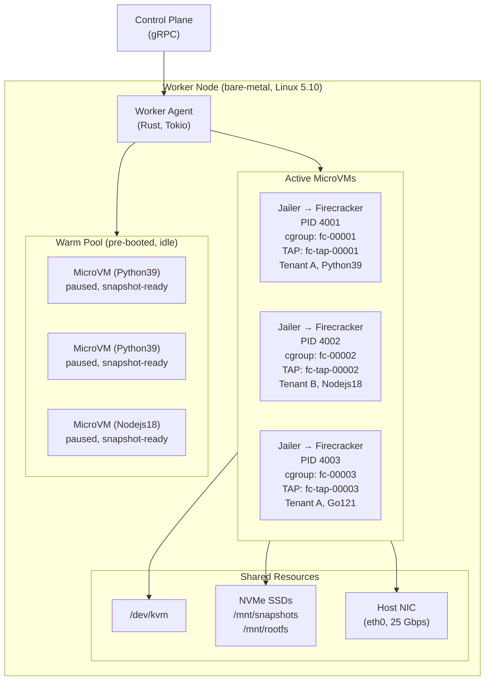
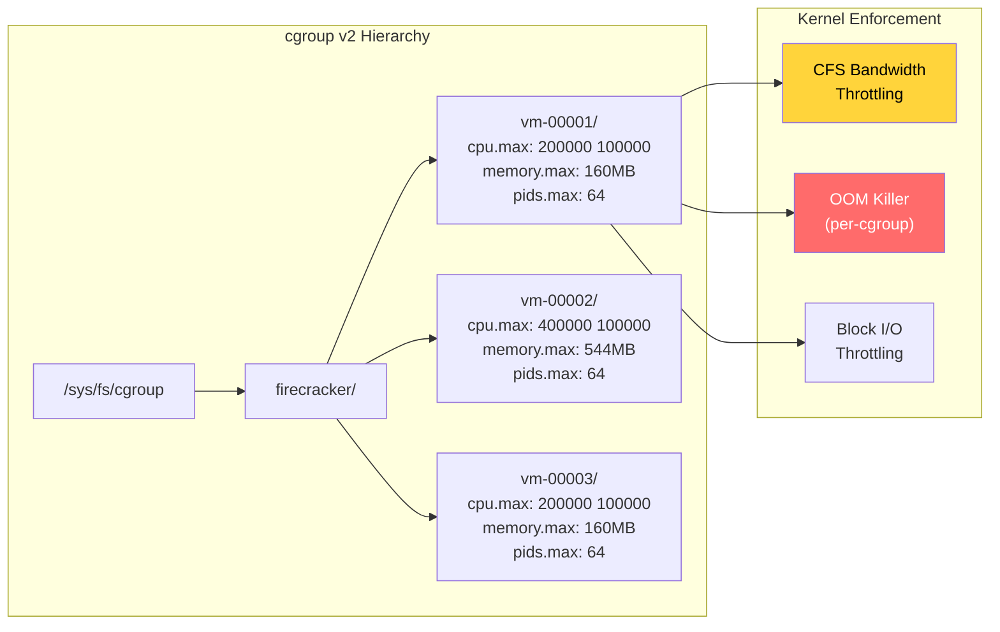
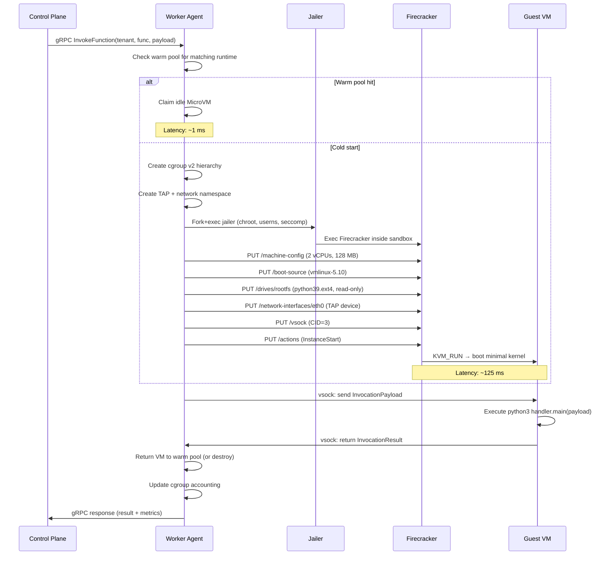

# 3. The Worker Node & VMM 🔴

> **The Problem:** The control plane has selected a worker node for an invocation. Now what? The worker agent — a long-lived Rust process on each bare-metal server — must spawn a Firecracker MicroVM in under 150 ms, enforce strict resource limits so one tenant cannot steal CPU or I/O from another, configure an isolated network path, and clean up every trace when the invocation completes. A single mismanaged `cgroup` or leaked file descriptor can cascade into a host-wide outage affecting thousands of tenants.

---

## Worker Node Architecture

A worker node is a bare-metal Linux server (e.g., AWS `m5.metal` — 96 vCPUs, 384 GB RAM, 2× NVMe SSD) running a minimal host OS. The only user-space software is our **worker agent** and the **Firecracker** binary.



---

## The Worker Agent

The agent is the brain of the worker. It is a single Rust binary with these responsibilities:

| Responsibility | Mechanism |
|---|---|
| Accept invocations from the control plane | gRPC server (tonic) |
| Spawn/destroy MicroVMs | Fork + exec the Firecracker jailer |
| Configure MicroVMs | Firecracker REST API over Unix socket |
| Enforce resource limits | Linux cgroups v2 |
| Isolate networking | TAP devices + iptables per VM |
| Maintain the warm pool | Pre-boot MicroVMs during idle periods |
| Report health to control plane | gRPC streaming (every 1s) |
| Collect metrics | eBPF + /proc + cgroup accounting |

### Agent Lifecycle

```rust,ignore
use std::collections::HashMap;
use std::sync::Arc;
use tokio::sync::RwLock;

/// The state of a single MicroVM managed by this worker.
#[derive(Debug, Clone)]
struct MicroVmState {
    vm_id: String,
    tenant_id: String,
    function_name: String,
    runtime: String,
    pid: u32,                    // Firecracker process PID
    socket_path: String,         // Unix socket for Firecracker API
    tap_device: String,          // TAP device name
    cgroup_path: String,         // cgroup v2 directory
    status: VmStatus,
    created_at: std::time::Instant,
    memory_mib: u32,
    vcpus: u32,
}

#[derive(Debug, Clone, PartialEq)]
enum VmStatus {
    Booting,
    Ready,         // Warm pool — idle, waiting for invocation
    Running,       // Executing a function
    Paused,        // Snapshot taken, can be resumed
    ShuttingDown,
}

/// The worker agent's core state.
struct WorkerAgent {
    worker_id: String,
    total_vcpus: u32,
    total_memory_mib: u64,

    /// All MicroVMs managed by this agent (active + warm pool).
    vms: Arc<RwLock<HashMap<String, MicroVmState>>>,

    /// Warm pool: runtime → list of ready VM IDs.
    warm_pool: Arc<RwLock<HashMap<String, Vec<String>>>>,

    /// Resource accounting.
    used_vcpus: Arc<std::sync::atomic::AtomicU32>,
    used_memory_mib: Arc<std::sync::atomic::AtomicU64>,
}
```

---

## MicroVM Lifecycle — From Request to Cleanup

### Step 1: Receive Invocation

```rust,ignore
use tonic::{Request, Response, Status};

impl WorkerAgent {
    /// Handle an invocation from the control plane.
    async fn invoke(
        &self,
        request: InvokeRequest,
    ) -> Result<InvokeResponse, Status> {
        // Step 1: Try to claim a warm pool VM for this runtime.
        let vm_id = self.try_claim_warm_vm(&request.runtime).await;

        let vm = match vm_id {
            Some(id) => {
                // ✅ Warm pool hit — no boot latency.
                self.activate_warm_vm(&id, &request).await
                    .map_err(|e| Status::internal(e.to_string()))?
            }
            None => {
                // Cold start — spawn a new MicroVM.
                self.spawn_microvm(&request).await
                    .map_err(|e| Status::internal(e.to_string()))?
            }
        };

        // Step 2: Send the function payload to the guest via vsock.
        let result = self.execute_function(&vm, &request.payload).await
            .map_err(|e| Status::internal(e.to_string()))?;

        // Step 3: Return the VM to the warm pool or destroy it.
        self.recycle_or_destroy(vm).await;

        Ok(InvokeResponse {
            result: result.output,
            duration_ms: result.duration_ms,
            was_cold_start: vm_id.is_none(),
        })
    }

    async fn try_claim_warm_vm(&self, runtime: &str) -> Option<String> {
        let mut pool = self.warm_pool.write().await;
        pool.get_mut(runtime)?.pop()
    }
}

# struct InvokeRequest { runtime: String, payload: Vec<u8>, tenant_id: String, function_name: String, memory_mib: u32 }
# struct InvokeResponse { result: Vec<u8>, duration_ms: u64, was_cold_start: bool }
# struct ExecutionResult { output: Vec<u8>, duration_ms: u64 }
```

### Step 2: Spawn the Jailer + Firecracker

```rust,ignore
use std::process::Command;
use uuid::Uuid;

impl WorkerAgent {
    /// Spawn a new MicroVM via the Firecracker jailer.
    ///
    /// The jailer wraps Firecracker in:
    /// - chroot (isolated filesystem)
    /// - user namespace (unprivileged UID)
    /// - network namespace (dedicated TAP device)
    /// - cgroup (CPU + memory limits)
    /// - seccomp (restricted syscalls)
    async fn spawn_microvm(
        &self,
        request: &InvokeRequest,
    ) -> Result<MicroVmState, Box<dyn std::error::Error>> {
        let vm_id = Uuid::new_v4().to_string();
        let socket_path = format!("/srv/jailer/{vm_id}/root/run/firecracker.socket");
        let cgroup_path = format!("/sys/fs/cgroup/firecracker/{vm_id}");

        // Create cgroup BEFORE spawning the process.
        self.create_cgroup(&vm_id, request.memory_mib, 2).await?;

        // Create network namespace and TAP device.
        let tap_device = self.setup_networking(&vm_id).await?;

        // ✅ FIX: Use the jailer to spawn Firecracker with full isolation.
        // The jailer handles chroot, user namespace, and seccomp setup.
        let child = Command::new("/usr/bin/jailer")
            .args([
                "--id", &vm_id,
                "--exec-file", "/usr/bin/firecracker",
                "--uid", "65534",          // nobody
                "--gid", "65534",          // nobody
                "--chroot-base-dir", "/srv/jailer",
                "--netns", &format!("/var/run/netns/{vm_id}"),
                "--cgroup", &format!("cpu,cpuacct=/firecracker/{vm_id}"),
                "--cgroup", &format!("memory=/firecracker/{vm_id}"),
                "--cgroup", &format!("pids=/firecracker/{vm_id}"),
            ])
            .arg("--")
            .args([
                "--api-sock", "/run/firecracker.socket",
                "--level", "Warning",
                "--seccomp-filter", "/etc/firecracker/seccomp-filter.json",
            ])
            .spawn()?;

        let pid = child.id();

        // Wait for the API socket to appear (Firecracker creates it on startup).
        self.wait_for_socket(&socket_path, std::time::Duration::from_secs(5)).await?;

        // Configure the VM via the Firecracker API.
        self.configure_vm(&socket_path, request).await?;

        // Boot the VM.
        self.start_vm(&socket_path).await?;

        let state = MicroVmState {
            vm_id: vm_id.clone(),
            tenant_id: request.tenant_id.clone(),
            function_name: request.function_name.clone(),
            runtime: request.runtime.clone(),
            pid,
            socket_path,
            tap_device,
            cgroup_path,
            status: VmStatus::Running,
            created_at: std::time::Instant::now(),
            memory_mib: request.memory_mib,
            vcpus: 2,
        };

        // Track the VM.
        self.vms.write().await.insert(vm_id, state.clone());
        self.used_vcpus.fetch_add(2, std::sync::atomic::Ordering::Relaxed);
        self.used_memory_mib.fetch_add(
            request.memory_mib as u64,
            std::sync::atomic::Ordering::Relaxed,
        );

        Ok(state)
    }
}
```

### Step 3: Configure via Firecracker Socket API

```rust,ignore
use hyper::{Body, Client, Method, Request as HyperRequest};
use hyperlocal::{UnixClientExt, Uri};
use serde_json::json;

impl WorkerAgent {
    /// Configure a newly spawned Firecracker MicroVM.
    async fn configure_vm(
        &self,
        socket_path: &str,
        request: &InvokeRequest,
    ) -> Result<(), Box<dyn std::error::Error>> {
        let client = Client::unix();

        // 1. Machine configuration.
        let machine_cfg = json!({
            "vcpu_count": 2,
            "mem_size_mib": request.memory_mib,
            "smt": false,
            "track_dirty_pages": true  // Required for snapshotting (Ch. 4)
        });
        self.api_put(&client, socket_path, "/machine-config", &machine_cfg).await?;

        // 2. Boot source (minimal kernel).
        let boot_source = json!({
            "kernel_image_path": "/opt/vmlinux/vmlinux-5.10-minimal",
            "boot_args": "console=ttyS0 reboot=k panic=1 pci=off init=/sbin/fc-init"
        });
        self.api_put(&client, socket_path, "/boot-source", &boot_source).await?;

        // 3. Root filesystem (read-only).
        let rootfs_image = match request.runtime.as_str() {
            "python39" => "/mnt/rootfs/python39-minimal.ext4",
            "nodejs18" => "/mnt/rootfs/nodejs18-minimal.ext4",
            "go121"    => "/mnt/rootfs/go121-minimal.ext4",
            _          => "/mnt/rootfs/base-minimal.ext4",
        };
        let rootfs = json!({
            "drive_id": "rootfs",
            "path_on_host": rootfs_image,
            "is_root_device": true,
            "is_read_only": true
        });
        self.api_put(&client, socket_path, "/drives/rootfs", &rootfs).await?;

        // 4. Network interface (TAP device).
        let net_iface = json!({
            "iface_id": "eth0",
            "guest_mac": self.generate_mac(&request.tenant_id),
            "host_dev_name": format!("fc-tap-{}", &request.tenant_id[..8])
        });
        self.api_put(&client, socket_path, "/network-interfaces/eth0", &net_iface).await?;

        // 5. vsock for host ↔ guest communication.
        let vsock = json!({
            "guest_cid": 3,
            "uds_path": "/run/vsock.sock"
        });
        self.api_put(&client, socket_path, "/vsock", &vsock).await?;

        Ok(())
    }

    /// Start the VM instance (issues InstanceStart action).
    async fn start_vm(
        &self,
        socket_path: &str
    ) -> Result<(), Box<dyn std::error::Error>> {
        let client = Client::unix();
        let action = json!({ "action_type": "InstanceStart" });
        self.api_put(&client, socket_path, "/actions", &action).await?;
        Ok(())
    }

    async fn api_put(
        &self,
        client: &Client<hyperlocal::UnixConnector>,
        socket_path: &str,
        path: &str,
        body: &serde_json::Value,
    ) -> Result<(), Box<dyn std::error::Error>> {
        let req = HyperRequest::builder()
            .method(Method::PUT)
            .uri(Uri::new(socket_path, path))
            .header("Content-Type", "application/json")
            .body(Body::from(body.to_string()))?;
        let resp = client.request(req).await?;
        if !resp.status().is_success() {
            return Err(format!("Firecracker API {} returned {}", path, resp.status()).into());
        }
        Ok(())
    }

    fn generate_mac(&self, tenant_id: &str) -> String {
        // Deterministic MAC from tenant ID for debugging.
        // The first octet has the locally-administered bit set (02:xx:xx:xx:xx:xx).
        let bytes = tenant_id.as_bytes();
        format!(
            "02:{:02x}:{:02x}:{:02x}:{:02x}:{:02x}",
            bytes.first().copied().unwrap_or(0),
            bytes.get(1).copied().unwrap_or(0),
            bytes.get(2).copied().unwrap_or(0),
            bytes.get(3).copied().unwrap_or(0),
            bytes.get(4).copied().unwrap_or(0),
        )
    }
}
```

---

## cgroup v2 — Preventing Noisy Neighbors

The most dangerous failure mode in multi-tenant compute is the **noisy neighbor**: one tenant's function consuming all CPU, memory, or I/O, degrading every other tenant on the same host. Linux cgroups v2 provide hard enforcement.

### Naive Approach: No Resource Limits

```rust,ignore
fn spawn_firecracker_naive(vm_id: &str) -> std::io::Result<()> {
    // 💥 NOISY NEIGHBOR HAZARD: No cgroup limits.
    // A single tenant running `while(true) {}` will consume an entire CPU core.
    // A tenant allocating 300 GB of memory will trigger the host OOM killer,
    // which may kill OTHER tenants' MicroVMs.
    // A tenant doing 10 GB/s of disk I/O will starve the NVMe for everyone.

    Command::new("/usr/bin/firecracker")
        .args(["--api-sock", &format!("/tmp/{vm_id}.sock")])
        .spawn()?;

    Ok(())
}
```

### Production Approach: Strict cgroup v2 Enforcement

```rust,ignore
use std::fs;
use std::path::Path;

/// Resource limits for a single MicroVM.
struct VmResourceLimits {
    /// Maximum CPU time: period and quota in microseconds.
    /// e.g., quota=200000, period=1000000 → 200ms per 1s → 20% of one core.
    cpu_quota_us: u64,
    cpu_period_us: u64,

    /// Maximum memory in bytes. Hard limit — OOM kill if exceeded.
    memory_max_bytes: u64,

    /// Maximum number of PIDs inside the cgroup (limits fork bombs).
    pids_max: u32,

    /// I/O bandwidth limits (bytes/sec for read + write).
    io_read_bps: u64,
    io_write_bps: u64,
}

impl WorkerAgent {
    /// Create a cgroup v2 hierarchy for a MicroVM with strict resource limits.
    ///
    /// This is called BEFORE spawning the Firecracker process.
    /// The jailer will place the Firecracker process into this cgroup.
    async fn create_cgroup(
        &self,
        vm_id: &str,
        memory_mib: u32,
        vcpus: u32,
    ) -> Result<(), Box<dyn std::error::Error>> {
        let cgroup_base = "/sys/fs/cgroup/firecracker";
        let cgroup_dir = format!("{cgroup_base}/{vm_id}");

        // Create the cgroup directory.
        fs::create_dir_all(&cgroup_dir)?;

        let limits = VmResourceLimits {
            // Allow `vcpus` worth of CPU time.
            // 2 vCPUs → 200ms quota per 100ms period → 200% of one core.
            cpu_quota_us: (vcpus as u64) * 100_000,
            cpu_period_us: 100_000,

            // Hard memory limit.
            // Add 32 MB overhead for the VMM process itself.
            memory_max_bytes: ((memory_mib as u64) + 32) * 1024 * 1024,

            // Limit PIDs to prevent fork bombs inside the VMM.
            pids_max: 64,

            // I/O: 100 MB/s read, 50 MB/s write per VM.
            io_read_bps: 100 * 1024 * 1024,
            io_write_bps: 50 * 1024 * 1024,
        };

        // ✅ FIX: Write strict limits to cgroup v2 control files.

        // CPU: quota/period controls.
        fs::write(
            format!("{cgroup_dir}/cpu.max"),
            format!("{} {}", limits.cpu_quota_us, limits.cpu_period_us),
        )?;

        // Memory: hard limit (no soft limit — we want deterministic behavior).
        fs::write(
            format!("{cgroup_dir}/memory.max"),
            limits.memory_max_bytes.to_string(),
        )?;

        // Disable swap for deterministic latency.
        fs::write(
            format!("{cgroup_dir}/memory.swap.max"),
            "0",
        )?;

        // PID limit.
        fs::write(
            format!("{cgroup_dir}/pids.max"),
            limits.pids_max.to_string(),
        )?;

        // I/O bandwidth limits.
        // Format: "<major>:<minor> rbps=<bytes> wbps=<bytes>"
        // We need the NVMe device's major:minor numbers.
        let nvme_dev = self.get_nvme_device_id()?;
        fs::write(
            format!("{cgroup_dir}/io.max"),
            format!(
                "{} rbps={} wbps={}",
                nvme_dev, limits.io_read_bps, limits.io_write_bps
            ),
        )?;

        Ok(())
    }

    fn get_nvme_device_id(&self) -> Result<String, Box<dyn std::error::Error>> {
        // Read /sys/block/nvme0n1/dev to get "259:0" format.
        let dev = fs::read_to_string("/sys/block/nvme0n1/dev")?;
        Ok(dev.trim().to_string())
    }
}
```

### cgroup Enforcement Matrix

| Resource | cgroup v2 File | Value (128 MB, 2 vCPU VM) | What Happens on Violation |
|---|---|---|---|
| CPU | `cpu.max` | `200000 100000` | Process is throttled (not killed) |
| Memory | `memory.max` | `167772160` (160 MB) | OOM killer terminates the process |
| Swap | `memory.swap.max` | `0` | No swap allowed → deterministic latency |
| PIDs | `pids.max` | `64` | `fork()` returns `-EAGAIN` |
| Disk read | `io.max` | `259:0 rbps=104857600` | I/O is throttled to 100 MB/s |
| Disk write | `io.max` | `259:0 wbps=52428800` | I/O is throttled to 50 MB/s |



---

## Network Isolation — TAP Devices in Detail

Each MicroVM gets a point-to-point Layer 2 link to the host via a **TAP device**. There is no shared bridge — VMs cannot see each other at the Ethernet level.

### Naive Approach: Shared Bridge

```rust,ignore
fn setup_network_naive() -> std::io::Result<()> {
    // 💥 SECURITY HAZARD: All VMs on a shared bridge.
    // ARP spoofing allows VM A to intercept VM B's traffic.
    // A promiscuous socket captures ALL frames on the bridge.

    Command::new("ip")
        .args(["link", "add", "vm-bridge", "type", "bridge"])
        .status()?;

    // Every VM's TAP is connected to the same bridge...
    for vm_id in 0..100 {
        let tap = format!("fc-tap-{vm_id:05}");
        Command::new("ip")
            .args(["link", "set", &tap, "master", "vm-bridge"])
            .status()?;
    }

    Ok(())
}
```

### Production Approach: Per-VM Isolated TAP

```rust,ignore
use std::process::Command;

impl WorkerAgent {
    /// Set up an isolated network for a MicroVM.
    ///
    /// Creates:
    /// 1. A dedicated network namespace for this VM.
    /// 2. A TAP device inside that namespace.
    /// 3. iptables rules that prevent lateral movement.
    async fn setup_networking(
        &self,
        vm_id: &str,
    ) -> Result<String, Box<dyn std::error::Error>> {
        let tap_name = format!("fc-tap-{}", &vm_id[..8]);
        let netns_name = vm_id.to_string();

        // ✅ FIX: Dedicated network namespace per VM — no shared bridge.

        // Create network namespace.
        Command::new("ip")
            .args(["netns", "add", &netns_name])
            .status()?;

        // Create TAP device in the default namespace.
        Command::new("ip")
            .args(["tuntap", "add", &tap_name, "mode", "tap"])
            .status()?;

        // Move TAP into the VM's network namespace.
        Command::new("ip")
            .args(["link", "set", &tap_name, "netns", &netns_name])
            .status()?;

        // Configure IP inside the namespace.
        // Each VM gets a /30: host=.1, guest=.2.
        let subnet_id = self.allocate_subnet().await;
        let host_ip = format!("10.0.{}.{}/30",
            (subnet_id / 64) % 256,
            (subnet_id % 64) * 4 + 1
        );

        Command::new("ip")
            .args(["netns", "exec", &netns_name, "ip", "addr", "add", &host_ip, "dev", &tap_name])
            .status()?;

        Command::new("ip")
            .args(["netns", "exec", &netns_name, "ip", "link", "set", &tap_name, "up"])
            .status()?;

        // ✅ SECURITY: Apply iptables rules INSIDE the namespace.
        for rule in &[
            // Block access to cloud metadata service (SSRF prevention).
            format!("-A FORWARD -i {tap_name} -d 169.254.0.0/16 -j DROP"),
            // Block lateral movement to other VM subnets.
            format!("-A FORWARD -i {tap_name} -d 10.0.0.0/8 -j DROP"),
            // Block access to host-local services.
            format!("-A FORWARD -i {tap_name} -d 127.0.0.0/8 -j DROP"),
            // Allow remaining traffic (internet egress).
            format!("-A FORWARD -i {tap_name} -j ACCEPT"),
        ] {
            Command::new("ip")
                .args(["netns", "exec", &netns_name, "iptables"])
                .args(rule.split_whitespace())
                .status()?;
        }

        Ok(tap_name)
    }

    async fn allocate_subnet(&self) -> u32 {
        // Atomic counter — each VM gets the next /30 subnet.
        static COUNTER: std::sync::atomic::AtomicU32 = std::sync::atomic::AtomicU32::new(1);
        COUNTER.fetch_add(1, std::sync::atomic::Ordering::Relaxed)
    }
}
```

---

## The Warm Pool Strategy

Cold-starting a MicroVM takes ~125 ms. For a serverless platform, this is unacceptable for latency-sensitive functions. The warm pool pre-boots MicroVMs so they're ready when an invocation arrives.

### Pool Sizing Strategy

| Runtime | Pre-boot Count | Rationale |
|---|---|---|
| Python39 | 20 | Most popular runtime; high invocation frequency |
| Nodejs18 | 15 | Second most popular |
| Go121 | 5 | Go binary starts fast anyway (~10 ms) |
| RustWasm | 5 | Wasm cold start is already < 5 ms |

### Warm Pool Manager

```rust,ignore
use tokio::time::{interval, Duration};

impl WorkerAgent {
    /// Background task: maintain the warm pool at target levels.
    ///
    /// Runs continuously, checking every 5 seconds whether we need
    /// to pre-boot more MicroVMs or evict excess ones.
    async fn warm_pool_manager(&self) {
        let targets: Vec<(&str, u32)> = vec![
            ("python39", 20),
            ("nodejs18", 15),
            ("go121", 5),
            ("rustwasm", 5),
        ];

        let mut ticker = interval(Duration::from_secs(5));
        loop {
            ticker.tick().await;

            for (runtime, target) in &targets {
                let current = {
                    let pool = self.warm_pool.read().await;
                    pool.get(*runtime).map(|v| v.len() as u32).unwrap_or(0)
                };

                if current < *target {
                    // Need more warm VMs of this runtime.
                    let deficit = *target - current;
                    for _ in 0..deficit {
                        // Check if we have enough host resources.
                        let used_cpu = self.used_vcpus.load(std::sync::atomic::Ordering::Relaxed);
                        let used_mem = self.used_memory_mib.load(std::sync::atomic::Ordering::Relaxed);

                        if used_cpu + 2 > self.total_vcpus
                            || used_mem + 128 > self.total_memory_mib
                        {
                            break; // Host is full — stop pre-booting
                        }

                        match self.spawn_warm_vm(runtime).await {
                            Ok(vm_id) => {
                                let mut pool = self.warm_pool.write().await;
                                pool.entry(runtime.to_string())
                                    .or_default()
                                    .push(vm_id);
                            }
                            Err(e) => {
                                eprintln!("failed to pre-boot {runtime} VM: {e}");
                                break;
                            }
                        }
                    }
                } else if current > target * 2 {
                    // Too many warm VMs — evict excess to free resources.
                    let excess = current - *target;
                    let mut pool = self.warm_pool.write().await;
                    if let Some(vms) = pool.get_mut(*runtime) {
                        for _ in 0..excess {
                            if let Some(vm_id) = vms.pop() {
                                let _ = self.destroy_vm(&vm_id).await;
                            }
                        }
                    }
                }
            }
        }
    }

    async fn spawn_warm_vm(&self, runtime: &str) -> Result<String, Box<dyn std::error::Error>> {
        let request = InvokeRequest {
            runtime: runtime.to_string(),
            tenant_id: "__warm_pool__".to_string(),
            function_name: "__idle__".to_string(),
            memory_mib: 128,
            payload: vec![],
        };
        let vm = self.spawn_microvm(&request).await?;
        // Mark as Ready (waiting for invocation) instead of Running.
        let mut vms = self.vms.write().await;
        if let Some(state) = vms.get_mut(&vm.vm_id) {
            state.status = VmStatus::Ready;
        }
        Ok(vm.vm_id)
    }
}
```

---

## Host ↔ Guest Communication via vsock

**vsock** (Virtual Sockets) is a zero-copy, kernel-level communication channel between the host and guest. It avoids the overhead and security implications of using the virtual network for control traffic.

```
┌─────────────────────────────────────────┐
│ Host (Worker Agent)                     │
│                                         │
│  vsock CID=2 ──────────────────►        │
│         AF_VSOCK socket                 │
│         /run/vsock.sock                 │
└────────────────┬────────────────────────┘
                 │  virtio-vsock (zero-copy)
┌────────────────▼────────────────────────┐
│ Guest (MicroVM)                         │
│                                         │
│  vsock CID=3 ──────────────────►        │
│        AF_VSOCK socket                  │
│        Reads payload, writes result     │
└─────────────────────────────────────────┘
```

### vsock Protocol

```rust,ignore
use serde::{Deserialize, Serialize};

/// Message sent from host to guest over vsock.
#[derive(Serialize, Deserialize)]
struct InvocationPayload {
    /// The function code or reference to execute.
    handler: String,
    /// Serialized input data.
    input: Vec<u8>,
    /// Execution timeout in milliseconds.
    timeout_ms: u64,
    /// Environment variables to inject.
    env_vars: Vec<(String, String)>,
}

/// Message sent from guest to host over vsock.
#[derive(Serialize, Deserialize)]
struct InvocationResult {
    /// Exit code of the function (0 = success).
    exit_code: i32,
    /// Serialized output data.
    output: Vec<u8>,
    /// Captured stdout.
    stdout: Vec<u8>,
    /// Captured stderr.
    stderr: Vec<u8>,
    /// Wall-clock execution time in milliseconds.
    duration_ms: u64,
}

impl WorkerAgent {
    /// Send a function payload to the guest and receive the result.
    async fn execute_function(
        &self,
        vm: &MicroVmState,
        payload: &[u8],
    ) -> Result<InvocationResult, Box<dyn std::error::Error>> {
        // Connect to the guest's vsock.
        // CID 3 is the guest, port 5000 is our convention.
        let stream = tokio_vsock::VsockStream::connect(3, 5000).await?;
        let (mut reader, mut writer) = tokio::io::split(stream);

        // Send the payload (length-prefixed).
        let invocation = InvocationPayload {
            handler: "handler.main".to_string(),
            input: payload.to_vec(),
            timeout_ms: 30_000,
            env_vars: vec![],
        };
        let encoded = serde_json::to_vec(&invocation)?;
        let len = (encoded.len() as u32).to_le_bytes();

        use tokio::io::AsyncWriteExt;
        writer.write_all(&len).await?;
        writer.write_all(&encoded).await?;

        // Read the result (length-prefixed).
        use tokio::io::AsyncReadExt;
        let mut len_buf = [0u8; 4];
        reader.read_exact(&mut len_buf).await?;
        let result_len = u32::from_le_bytes(len_buf) as usize;

        // Safety: Cap result size to prevent memory exhaustion from malicious guests.
        if result_len > 64 * 1024 * 1024 {
            return Err("result too large (> 64 MB)".into());
        }

        let mut result_buf = vec![0u8; result_len];
        reader.read_exact(&mut result_buf).await?;

        let result: InvocationResult = serde_json::from_slice(&result_buf)?;
        Ok(result)
    }
}
```

---

## Cleanup — Destroying a MicroVM

Every resource allocated for a MicroVM must be reclaimed. Leaks accumulate and eventually bring down the host.

```rust,ignore
impl WorkerAgent {
    /// Completely destroy a MicroVM and reclaim all resources.
    ///
    /// This is called when:
    /// - An invocation completes and the VM is not reusable.
    /// - A VM has been idle in the warm pool too long.
    /// - A VM has exceeded its maximum lifetime (e.g., 15 minutes).
    async fn destroy_vm(&self, vm_id: &str) -> Result<(), Box<dyn std::error::Error>> {
        let state = {
            let mut vms = self.vms.write().await;
            vms.remove(vm_id)
        };

        let state = match state {
            Some(s) => s,
            None => return Ok(()), // Already removed
        };

        // 1. Kill the Firecracker process.
        let _ = nix::sys::signal::kill(
            nix::unistd::Pid::from_raw(state.pid as i32),
            nix::sys::signal::Signal::SIGKILL,
        );

        // Wait for the process to exit (avoid zombies).
        let _ = tokio::task::spawn_blocking(move || {
            let _ = nix::sys::wait::waitpid(
                nix::unistd::Pid::from_raw(state.pid as i32),
                None,
            );
        }).await;

        // 2. Clean up the network namespace and TAP device.
        let _ = Command::new("ip")
            .args(["netns", "del", vm_id])
            .status();

        // 3. Remove the cgroup directory.
        // First, ensure no processes remain (they were killed above).
        let cgroup_dir = format!("/sys/fs/cgroup/firecracker/{vm_id}");
        if Path::new(&cgroup_dir).exists() {
            let _ = fs::remove_dir(&cgroup_dir);
        }

        // 4. Clean up the jailer chroot directory.
        let chroot_dir = format!("/srv/jailer/{vm_id}");
        if Path::new(&chroot_dir).exists() {
            let _ = fs::remove_dir_all(&chroot_dir);
        }

        // 5. Update resource accounting.
        self.used_vcpus.fetch_sub(state.vcpus, std::sync::atomic::Ordering::Relaxed);
        self.used_memory_mib.fetch_sub(
            state.memory_mib as u64,
            std::sync::atomic::Ordering::Relaxed,
        );

        Ok(())
    }
}

# use std::fs;
# use std::path::Path;
```

### Cleanup Verification

A background "reaper" task audits for leaked resources:

```rust,ignore
impl WorkerAgent {
    /// Background task: find and clean up leaked resources.
    ///
    /// This handles the case where destroy_vm() partially fails
    /// (e.g., network namespace deletion failed due to transient error).
    async fn resource_reaper(&self) {
        let mut ticker = interval(Duration::from_secs(60));
        loop {
            ticker.tick().await;

            // Check for orphaned cgroup directories.
            let cgroup_base = "/sys/fs/cgroup/firecracker";
            if let Ok(entries) = fs::read_dir(cgroup_base) {
                for entry in entries.flatten() {
                    let vm_id = entry.file_name().to_string_lossy().to_string();
                    let known = self.vms.read().await.contains_key(&vm_id);
                    if !known {
                        eprintln!("reaper: cleaning orphaned cgroup {vm_id}");
                        let _ = fs::remove_dir(entry.path());
                    }
                }
            }

            // Check for orphaned network namespaces.
            if let Ok(output) = Command::new("ip").args(["netns", "list"]).output() {
                let stdout = String::from_utf8_lossy(&output.stdout);
                for line in stdout.lines() {
                    let ns_name = line.split_whitespace().next().unwrap_or("");
                    let known = self.vms.read().await.contains_key(ns_name);
                    if !known && !ns_name.is_empty() {
                        eprintln!("reaper: cleaning orphaned netns {ns_name}");
                        let _ = Command::new("ip")
                            .args(["netns", "del", ns_name])
                            .status();
                    }
                }
            }

            // Check for orphaned jailer chroot directories.
            if let Ok(entries) = fs::read_dir("/srv/jailer") {
                for entry in entries.flatten() {
                    let vm_id = entry.file_name().to_string_lossy().to_string();
                    let known = self.vms.read().await.contains_key(&vm_id);
                    if !known {
                        eprintln!("reaper: cleaning orphaned chroot {vm_id}");
                        let _ = fs::remove_dir_all(entry.path());
                    }
                }
            }
        }
    }
}
```

---

## End-to-End Invocation Timeline



---

> **Key Takeaways**
>
> 1. **The worker agent is a single Rust process** managing the full lifecycle of all MicroVMs on a host: spawn, configure, execute, reclaim. It is the most security-critical component in the system.
> 2. **The jailer provides defense-in-depth** by wrapping each Firecracker process in chroot + user namespace + network namespace + cgroup + seccomp. Firecracker itself provides KVM isolation; the jailer protects against VMM bugs.
> 3. **cgroup v2 enforces hard resource limits** on CPU (bandwidth throttling), memory (OOM kill), PIDs (fork bomb prevention), and I/O (bandwidth caps). Without these, one noisy tenant can degrade the entire host.
> 4. **Per-VM TAP devices** with dedicated network namespaces eliminate the shared-bridge attack vector. Strict iptables rules block SSRF, lateral movement, and host service access.
> 5. **The warm pool amortizes cold-start latency** by pre-booting MicroVMs for popular runtimes. The pool manager dynamically scales based on available host resources and observed demand.
> 6. **vsock provides zero-copy host-guest communication** for control traffic, avoiding the virtual network and its associated security surface.
> 7. **A background reaper task** audits for leaked resources (orphaned cgroups, network namespaces, chroot directories) and cleans them up. Resource leaks are the most insidious failure mode in long-running agents.
