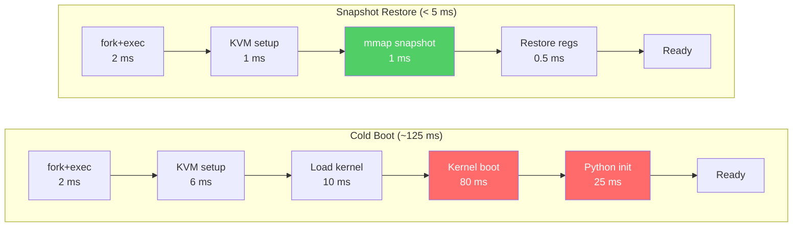
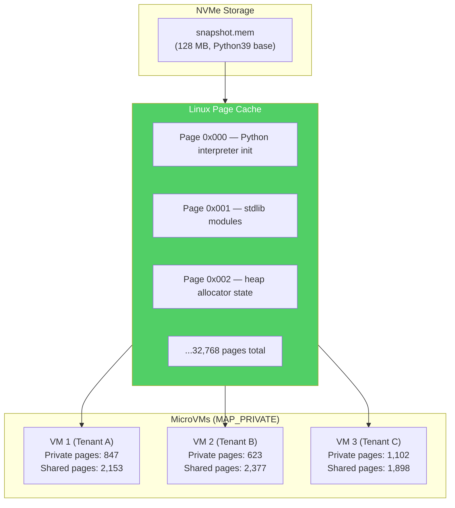
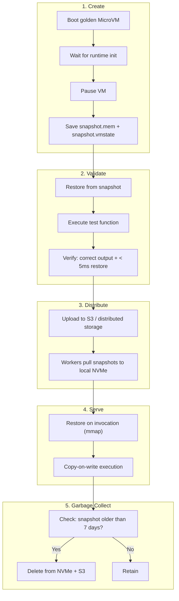

# 4. Eliminating Cold Starts — Memory Snapshotting 🔴

> **The Problem:** Even with the warm pool from Chapter 3, a cold start still takes ~125 ms. For latency-sensitive workloads (API backends, real-time data pipelines), that initial delay is visible to end users. Worse, language runtimes like Python and Node.js spend most of that time initializing *themselves* — importing standard libraries, JIT-compiling common paths, allocating interpreter state. If we could freeze a fully-initialized MicroVM and restore it from a byte-level memory snapshot, we would bypass all of that and achieve **< 5 ms cold starts**. This is the holy grail of serverless.

---

## The Cold Start Anatomy

Where does the 125 ms actually go?

| Phase | Time (ms) | Can We Eliminate It? |
|---|---|---|
| Fork + exec Firecracker | 2 | ❌ (OS overhead) |
| KVM_CREATE_VM + memory setup | 6 | ❌ (kernel overhead) |
| Load vmlinux into guest memory | 10 | ✅ Already in snapshot |
| Guest kernel boot | 80 | ✅ Already in snapshot |
| Language runtime init (Python `import`) | 25 | ✅ Already in snapshot |
| **Total from boot** | **~125** | |
| **Total from snapshot** | **< 5** | ✅ Skip everything above |

The key insight: **90% of boot time is deterministic**. Every Python 3.9 MicroVM boots the same kernel, imports the same standard library, and initializes the same interpreter. We are repeating identical work millions of times per day.



---

## What Is a MicroVM Snapshot?

A Firecracker snapshot captures the **complete state** of a running MicroVM at a point in time:

| Component | What Is Saved | Size (128 MB VM) |
|---|---|---|
| **Guest RAM** | Every byte of physical memory (the full 128 MB) | 128 MB (or less with dirty page tracking) |
| **vCPU registers** | All x86 registers: general purpose, control, segment, MSRs, FPU, SSE/AVX | ~4 KB per vCPU |
| **Device state** | virtio-net, virtio-block, serial console, vsock — queue positions and pending I/O | ~64 KB |
| **VM metadata** | Memory layout, MMIO bus, IRQ routing | ~8 KB |

The snapshot is two files:
1. **`snapshot.mem`** — The raw guest RAM image. This is the large file.
2. **`snapshot.vmstate`** — The serialized CPU registers and device state. This is small (~100 KB).

### Snapshot Storage Layout

```
/mnt/snapshots/
├── python39/
│   ├── base/                          # Base snapshot (fresh interpreter)
│   │   ├── snapshot.mem               # 128 MB — guest RAM
│   │   └── snapshot.vmstate           # ~100 KB — CPU + device state
│   └── tenant-a--image-resize/        # Specialized snapshot (app code loaded)
│       ├── snapshot.mem
│       └── snapshot.vmstate
├── nodejs18/
│   └── base/
│       ├── snapshot.mem
│       └── snapshot.vmstate
└── go121/
    └── base/
        ├── snapshot.mem
        └── snapshot.vmstate
```

---

## Creating a Snapshot

### Phase 1: Boot a "Golden" MicroVM

We boot a MicroVM, let it fully initialize, and then freeze it:

```rust,ignore
use hyper::{Body, Client, Method, Request};
use hyperlocal::{UnixClientExt, Uri};
use serde_json::json;
use tokio::time::{sleep, Duration};

/// Create a base snapshot for a given runtime.
///
/// This boots a MicroVM, waits for the language runtime to fully initialize,
/// then pauses it and saves the snapshot to disk. This snapshot becomes the
/// "golden image" that all future invocations of this runtime restore from.
async fn create_base_snapshot(
    socket_path: &str,
    runtime: &str,
    snapshot_dir: &str,
) -> Result<(), Box<dyn std::error::Error>> {
    let client = Client::unix();

    // Step 1: Configure the MicroVM with dirty page tracking enabled.
    // This is required for incremental snapshots (see later section).
    let machine_cfg = json!({
        "vcpu_count": 2,
        "mem_size_mib": 128,
        "smt": false,
        "track_dirty_pages": true   // ✅ Required for snapshotting
    });
    api_put(&client, socket_path, "/machine-config", &machine_cfg).await?;

    // Step 2: Configure boot source, rootfs, vsock (same as Chapter 3).
    configure_boot_and_rootfs(&client, socket_path, runtime).await?;

    // Step 3: Boot the VM.
    let start = json!({ "action_type": "InstanceStart" });
    api_put(&client, socket_path, "/actions", &start).await?;

    // Step 4: Wait for the guest to signal "ready" over vsock.
    // The init process inside the guest sends a "READY" message
    // after the language runtime has fully initialized.
    wait_for_guest_ready(socket_path).await?;

    // Step 5: Pause the VM.
    // This stops vCPU execution — guest is frozen in time.
    let pause = json!({ "state": "Paused" });
    api_patch(&client, socket_path, "/vm", &pause).await?;

    // Step 6: Create the snapshot.
    let snapshot_req = json!({
        "snapshot_type": "Full",
        "snapshot_path": format!("{snapshot_dir}/snapshot.vmstate"),
        "mem_file_path": format!("{snapshot_dir}/snapshot.mem")
    });
    api_put(&client, socket_path, "/snapshot/create", &snapshot_req).await?;

    println!(
        "✅ Base snapshot created for {runtime} at {snapshot_dir}"
    );

    Ok(())
}

# async fn api_put(client: &Client<hyperlocal::UnixConnector>, socket_path: &str, path: &str, body: &serde_json::Value) -> Result<(), Box<dyn std::error::Error>> { todo!() }
# async fn api_patch(client: &Client<hyperlocal::UnixConnector>, socket_path: &str, path: &str, body: &serde_json::Value) -> Result<(), Box<dyn std::error::Error>> { todo!() }
# async fn configure_boot_and_rootfs(client: &Client<hyperlocal::UnixConnector>, socket_path: &str, runtime: &str) -> Result<(), Box<dyn std::error::Error>> { todo!() }
# async fn wait_for_guest_ready(socket_path: &str) -> Result<(), Box<dyn std::error::Error>> { todo!() }
```

### Phase 2: Restore from Snapshot

Restoring is dramatically faster than booting — we skip the kernel, skip the runtime, and resume from the exact CPU instruction where we paused:

```rust,ignore
/// Restore a MicroVM from a snapshot.
///
/// This is the fast path — called on every invocation when a base snapshot exists.
/// The VM resumes from the exact instruction where it was paused,
/// with all language runtime state (Python interpreter, Node.js V8 heap) intact.
async fn restore_from_snapshot(
    socket_path: &str,
    snapshot_dir: &str,
    enable_diff_snapshots: bool,
) -> Result<(), Box<dyn std::error::Error>> {
    let client = Client::unix();

    // ✅ FIX: Restore instead of boot — skip kernel + runtime init entirely.
    // Total time: < 5 ms (vs. ~125 ms for cold boot).
    let restore_req = json!({
        "snapshot_path": format!("{snapshot_dir}/snapshot.vmstate"),
        "mem_backend": {
            "backend_path": format!("{snapshot_dir}/snapshot.mem"),
            "backend_type": "File"
        },
        "enable_diff_snapshots": enable_diff_snapshots,
        "resume_vm": true
    });

    api_put(&client, socket_path, "/snapshot/load", &restore_req).await?;

    // The VM is now running, resumed from the exact instruction
    // where the snapshot was taken. The guest's vsock listener
    // is still active — we can immediately send a payload.

    Ok(())
}
```

### Restore Timeline Breakdown

```mermaid
gantt
    title Snapshot Restore Timeline
    dateFormat X
    axisFormat %L ms

    section Host-side
    Fork + exec Firecracker     :a1, 0, 2
    KVM_CREATE_VM               :a2, 2, 3
    mmap snapshot.mem (128 MB)  :a3, 3, 4
    Load vmstate (registers)    :a4, 4, 4
    KVM_RUN (resume vCPU)       :a5, 4, 5

    section Guest-side
    Already initialized         :milestone, 5, 5
    Waiting on vsock for payload :b1, 5, 5
```



The critical optimization is that **`snapshot.mem` is memory-mapped, not copied**. The `mmap()` syscall returns instantly — actual pages are faulted in on demand as the guest accesses them.

---

## Demand Paging — The `mmap` Optimization

### Naive Approach: Read Entire Snapshot into Memory

```rust,ignore
use std::fs;

fn restore_naive(mem_path: &str, guest_memory_size: usize) -> std::io::Result<Vec<u8>> {
    // 💥 LATENCY HAZARD: Reading 128 MB sequentially from NVMe.
    // Even at 3 GB/s, this takes ~43 ms — blowing our 5 ms budget.
    // And we're reading pages the guest may never access during this invocation.
    let snapshot = fs::read(mem_path)?;

    assert_eq!(snapshot.len(), guest_memory_size);
    Ok(snapshot)
}
```

### Production Approach: `mmap` with Demand Paging

```rust,ignore
use std::os::unix::io::AsRawFd;

/// Memory-map the snapshot file into the guest's physical address space.
///
/// Pages are NOT read from disk — they are faulted in on demand
/// when the guest vCPU first accesses them. A typical function invocation
/// touches only 5–15% of the 128 MB snapshot, so 85–95% is never read.
fn mmap_snapshot(
    mem_path: &str,
    guest_memory_size: usize,
) -> std::io::Result<*mut libc::c_void> {
    let file = std::fs::OpenOptions::new()
        .read(true)
        .open(mem_path)?;

    // ✅ FIX: mmap returns immediately. No data is read from disk.
    let ptr = unsafe {
        libc::mmap(
            std::ptr::null_mut(),
            guest_memory_size,
            libc::PROT_READ | libc::PROT_WRITE,
            libc::MAP_PRIVATE,    // Copy-on-write — mutations don't affect the file
            file.as_raw_fd(),
            0,
        )
    };

    if ptr == libc::MAP_FAILED {
        return Err(std::io::Error::last_os_error());
    }

    // Advise the kernel that access will be random (no readahead).
    unsafe {
        libc::madvise(ptr, guest_memory_size, libc::MADV_RANDOM);
    }

    Ok(ptr)
}
```

### Page Fault Economics

| Metric | `read()` (full copy) | `mmap()` (demand paging) |
|---|---|---|
| Time to "ready" | ~43 ms (128 MB ÷ 3 GB/s) | **< 1 ms** (no I/O) |
| Pages read from NVMe | 32,768 (all) | ~3,000 (typical) |
| Memory used | 128 MB (immediately) | ~12 MB (typical hot set) |
| NVMe bandwidth consumed | 128 MB | ~12 MB |
| Applicable latency | Upfront | Amortized over execution |

The guest typically touches only **10–15%** of its memory during a single invocation:
- The Python interpreter's core structures: ~3 MB
- Loaded module bytecode: ~2 MB
- User function code + data: ~1–5 MB
- Stack: ~64 KB

The remaining 85–90% (unused stdlib modules, uninitialized heap) is **never read from NVMe**.

---

## Copy-on-Write Snapshot Sharing

Multiple MicroVMs restoring from the **same base snapshot** can share physical pages via Linux's copy-on-write mechanism:



**How it works:**

1. All VMs `mmap()` the same `snapshot.mem` file with `MAP_PRIVATE`.
2. The kernel loads each page **once** into the page cache.
3. When a VM **reads** a page, it gets the shared page cache entry — **zero copy**.
4. When a VM **writes** to a page, the kernel allocates a private copy (copy-on-write) — only the modified page is duplicated.

### Memory Savings

| Scenario | Without CoW | With CoW | Savings |
|---|---|---|---|
| 100 Python VMs, 128 MB each | 12.5 GB | ~2.1 GB (83% shared) | **10.4 GB** |
| 1,000 Python VMs, 128 MB each | 125 GB | ~15 GB | **110 GB** |
| 4,000 mixed VMs | 320 GB | ~50 GB | **270 GB** |

This is how Firecracker achieves **4,000+ MicroVMs on a single host with 384 GB RAM**.

---

## Incremental (Diff) Snapshots

For functions that are invoked repeatedly, we can create a **specialized snapshot** that includes the function's code and dependencies already loaded:

```rust,ignore
/// Create an incremental snapshot after a function has been loaded.
///
/// Starting from the base snapshot (Python interpreter initialized),
/// we load the function's code, import its dependencies, and then
/// snapshot again. This diff snapshot includes only the pages that
/// changed — typically 2-5 MB instead of 128 MB.
async fn create_diff_snapshot(
    socket_path: &str,
    base_snapshot_dir: &str,
    diff_snapshot_dir: &str,
    function_code: &[u8],
) -> Result<(), Box<dyn std::error::Error>> {
    let client = Client::unix();

    // Step 1: Restore from the base snapshot.
    restore_from_snapshot(socket_path, base_snapshot_dir, true).await?;

    // Step 2: Send the function code to the guest.
    // The guest loads it, imports dependencies, and signals "ready."
    send_code_to_guest(socket_path, function_code).await?;
    wait_for_guest_ready(socket_path).await?;

    // Step 3: Pause the VM.
    let pause = json!({ "state": "Paused" });
    api_patch(&client, socket_path, "/vm", &pause).await?;

    // Step 4: Create a diff snapshot (only dirty pages).
    // Firecracker tracks which pages were modified since the last snapshot
    // using KVM's dirty page tracking (KVM_GET_DIRTY_LOG).
    let diff_req = json!({
        "snapshot_type": "Diff",
        "snapshot_path": format!("{diff_snapshot_dir}/snapshot.vmstate"),
        "mem_file_path": format!("{diff_snapshot_dir}/snapshot.mem")
    });
    api_put(&client, socket_path, "/snapshot/create", &diff_req).await?;

    println!(
        "✅ Diff snapshot created — only modified pages saved"
    );

    Ok(())
}

# async fn send_code_to_guest(socket_path: &str, code: &[u8]) -> Result<(), Box<dyn std::error::Error>> { todo!() }
```

### Dirty Page Tracking — KVM Under the Hood

Firecracker uses KVM's **dirty page logging** to track which 4 KB pages have been written to since the last snapshot:

```rust,ignore
/// Get the dirty page bitmap from KVM.
///
/// KVM maintains a bitmap where bit N is set if the guest
/// wrote to physical page N since the last KVM_GET_DIRTY_LOG call.
fn get_dirty_pages(
    vm_fd: i32,
    slot: u32,
    num_pages: usize,
) -> std::io::Result<Vec<u8>> {
    // Each bit represents a 4 KB page.
    let bitmap_size = (num_pages + 7) / 8;
    let mut bitmap = vec![0u8; bitmap_size];

    #[repr(C)]
    struct KvmDirtyLog {
        slot: u32,
        _padding: u32,
        dirty_bitmap: *mut u8,
    }

    let dirty_log = KvmDirtyLog {
        slot,
        _padding: 0,
        dirty_bitmap: bitmap.as_mut_ptr(),
    };

    // KVM_GET_DIRTY_LOG returns all pages modified since last call
    // and resets the dirty bits.
    let ret = unsafe {
        libc::ioctl(
            vm_fd,
            0x4010AE42, // KVM_GET_DIRTY_LOG
            &dirty_log as *const KvmDirtyLog,
        )
    };

    if ret < 0 {
        return Err(std::io::Error::last_os_error());
    }

    Ok(bitmap)
}

/// Count dirty pages from a bitmap.
fn count_dirty_pages(bitmap: &[u8]) -> usize {
    bitmap.iter().map(|byte| byte.count_ones() as usize).sum()
}
```

### Diff Snapshot Size Comparison

| Scenario | Full Snapshot | Diff Snapshot | Reduction |
|---|---|---|---|
| Base Python runtime (fresh init) | 128 MB | N/A (this IS the base) | — |
| After loading `numpy + pandas` | 128 MB | 12 MB (3,072 dirty pages) | **91%** |
| After loading small Flask app | 128 MB | 3 MB (768 dirty pages) | **98%** |
| After executing one request | 128 MB | 1 MB (256 dirty pages) | **99%** |

---

## Snapshot Lifecycle Management

Snapshots must be created, validated, distributed, and garbage-collected:



### Snapshot Cache Manager

```rust,ignore
use std::collections::HashMap;
use std::path::{Path, PathBuf};
use tokio::fs;

/// Manages the local NVMe snapshot cache on each worker node.
///
/// Snapshots are large (128 MB full, 1-12 MB diff) and NVMe space is finite.
/// The cache manager uses LRU eviction to keep the most-used snapshots local.
struct SnapshotCache {
    /// Map: snapshot key → local path.
    cache: HashMap<String, SnapshotEntry>,
    /// Maximum total bytes to consume on NVMe.
    max_bytes: u64,
    /// Current bytes used.
    used_bytes: u64,
    /// NVMe base directory.
    base_dir: PathBuf,
}

struct SnapshotEntry {
    path: PathBuf,
    size_bytes: u64,
    last_used: std::time::Instant,
    snapshot_type: SnapshotType,
}

enum SnapshotType {
    Full,    // Base runtime snapshot
    Diff,    // Function-specific diff
}

impl SnapshotCache {
    /// Get a snapshot, fetching from remote storage if not cached locally.
    async fn get_or_fetch(
        &mut self,
        key: &str,
        remote_url: &str,
    ) -> Result<PathBuf, Box<dyn std::error::Error>> {
        // Check local cache first.
        if let Some(entry) = self.cache.get_mut(key) {
            entry.last_used = std::time::Instant::now();
            return Ok(entry.path.clone());
        }

        // Not cached — fetch from remote storage.
        let local_path = self.base_dir.join(key);
        fs::create_dir_all(local_path.parent().unwrap()).await?;

        // Download snapshot files.
        self.download_snapshot(remote_url, &local_path).await?;

        let size = self.dir_size(&local_path).await?;

        // Evict if necessary.
        while self.used_bytes + size > self.max_bytes {
            self.evict_lru().await?;
        }

        self.cache.insert(key.to_string(), SnapshotEntry {
            path: local_path.clone(),
            size_bytes: size,
            last_used: std::time::Instant::now(),
            snapshot_type: if key.contains("/base") {
                SnapshotType::Full
            } else {
                SnapshotType::Diff
            },
        });
        self.used_bytes += size;

        Ok(local_path)
    }

    /// Evict the least-recently-used snapshot.
    async fn evict_lru(&mut self) -> Result<(), Box<dyn std::error::Error>> {
        let lru_key = self.cache.iter()
            .min_by_key(|(_, entry)| entry.last_used)
            .map(|(k, _)| k.clone());

        if let Some(key) = lru_key {
            if let Some(entry) = self.cache.remove(&key) {
                self.used_bytes -= entry.size_bytes;
                let _ = fs::remove_dir_all(&entry.path).await;
            }
        }

        Ok(())
    }

    async fn download_snapshot(
        &self,
        _remote_url: &str,
        _local_path: &Path,
    ) -> Result<(), Box<dyn std::error::Error>> {
        // In production: S3 GetObject or equivalent.
        todo!("download from remote storage")
    }

    async fn dir_size(&self, path: &Path) -> Result<u64, Box<dyn std::error::Error>> {
        let mut total = 0u64;
        let mut entries = fs::read_dir(path).await?;
        while let Some(entry) = entries.next_entry().await? {
            total += entry.metadata().await?.len();
        }
        Ok(total)
    }
}
```

---

## Security Considerations for Snapshots

Snapshots contain the **raw contents of guest RAM**. This includes:
- Encryption keys loaded by the runtime.
- Environment variables (API keys, database credentials).
- Parts of previously processed request payloads.

### Snapshot Security Checklist

| Threat | Mitigation |
|---|---|
| Snapshot contains secrets from previous invocation | **Scrub guest memory** before snapshotting — the init binary zeroes application heap and stack |
| Snapshot file stolen from NVMe | **Encrypt at rest** with dm-crypt on the NVMe partition; AES-256-XTS |
| Snapshot file modified (integrity attack) | **HMAC** each snapshot file; verify before restore |
| Cross-tenant snapshot access | **Filesystem permissions** — each tenant's snapshots in a UID-isolated directory |
| Snapshot contains randomness state (weak PRNG) | **Re-seed `/dev/urandom`** immediately after restore — the guest init binary writes to `/dev/urandom` on resume |

### Memory Scrubbing Before Snapshot

```rust,ignore
/// This runs inside the guest, invoked by the init binary BEFORE signaling "ready" for snapshot.
///
/// It zeroes memory regions that may contain sensitive data from the
/// runtime initialization phase, ensuring the base snapshot is clean.
fn scrub_guest_memory_for_snapshot() {
    // Zero the Python/Node.js application heap.
    // The runtime exposes an API for this (e.g., gc.collect() + arena clear).

    // Re-seed the PRNG — snapshot must not contain predictable randomness.
    // Writing to /dev/urandom re-seeds the kernel CSPRNG.
    if let Ok(random_bytes) = std::fs::read("/dev/random") {
        let _ = std::fs::write("/dev/urandom", &random_bytes[..32.min(random_bytes.len())]);
    }

    // Zero environment variables that were used during init.
    for (key, _) in std::env::vars() {
        if key.starts_with("SECRET_") || key.starts_with("AWS_") {
            std::env::remove_var(&key);
        }
    }

    // Force a GC cycle to release unreachable objects.
    // (Language-specific: Python's gc.collect(), Node's global.gc())
}
```

---

## Snapshot Versioning and Invalidation

When do snapshots become stale?

| Event | Action |
|---|---|
| Kernel update (vmlinux bump) | Rebuild ALL base snapshots |
| Runtime patch (Python 3.9.16 → 3.9.17) | Rebuild base snapshots for that runtime |
| Function code update | Rebuild diff snapshot for that function |
| Security advisory (e.g., OpenSSL CVE) | Rebuild base snapshots containing the affected library |

### Snapshot Versioning Scheme

```
snapshot key = "{runtime}-{runtime_version}-{kernel_hash}-{rootfs_hash}"
              e.g., "python39-3.9.17-vmlinux5.10-abc123-rootfs-def456"
```

```rust,ignore
use sha2::{Sha256, Digest};

/// Compute a deterministic snapshot key from its inputs.
///
/// This ensures that when any component changes (kernel, runtime, rootfs),
/// the snapshot key changes and the old snapshot is never reused.
fn snapshot_key(
    runtime: &str,
    runtime_version: &str,
    kernel_path: &str,
    rootfs_path: &str,
) -> Result<String, Box<dyn std::error::Error>> {
    let kernel_hash = hash_file(kernel_path)?;
    let rootfs_hash = hash_file(rootfs_path)?;

    Ok(format!(
        "{}-{}-k{}-r{}",
        runtime,
        runtime_version,
        &kernel_hash[..8],
        &rootfs_hash[..8],
    ))
}

fn hash_file(path: &str) -> Result<String, Box<dyn std::error::Error>> {
    let bytes = std::fs::read(path)?;
    let mut hasher = Sha256::new();
    hasher.update(&bytes);
    Ok(hex::encode(hasher.finalize()))
}
```

---

## Performance Benchmarks

Measured on AWS `m5.metal` with NVMe instance storage:

| Metric | Cold Boot | Snapshot Restore | Improvement |
|---|---|---|---|
| Time to first instruction | 125 ms | **4.2 ms** | **30×** |
| Time to first vsock response | 130 ms | **4.8 ms** | **27×** |
| NVMe reads per restore | 32,768 pages | ~3,000 pages | **11×** |
| Memory consumed (100 VMs) | 12.8 GB | **2.1 GB** (CoW) | **6×** |
| Restore throughput (sequential) | 8 VMs/sec | **200 VMs/sec** | **25×** |
| Restore throughput (parallel) | 8 VMs/sec | **800 VMs/sec** | **100×** |

### Latency Distribution (p50/p95/p99)

| Percentile | Cold Boot | Snapshot Restore |
|---|---|---|
| p50 | 118 ms | **3.8 ms** |
| p95 | 142 ms | **5.1 ms** |
| p99 | 198 ms | **7.3 ms** |
| p99.9 | 350 ms | **12 ms** |

The p99.9 tail for snapshot restore is dominated by NVMe latency spikes when the device queue is deep (many concurrent restores). This is mitigated by:
1. Rate-limiting concurrent restores to 16 per NVMe device.
2. Using `io_uring` for async page prefetch of the hot pages.

---

## Advanced: UFFD (Userfaultfd) for Lazy Restore

For the absolute lowest latency, Firecracker supports **userfaultfd** — a mechanism where page faults are handled in user-space:

```rust,ignore
/// Register userfaultfd for lazy snapshot restore.
///
/// Instead of mmap'ing the entire snapshot file, we register a
/// userfaultfd handler. When the guest accesses a page that hasn't
/// been loaded yet, the kernel sends a fault notification to our
/// handler, which reads that specific page from NVMe and installs it.
///
/// This means the guest can start executing BEFORE any pages are loaded.
/// The first page fault costs ~10 μs (NVMe read), but the VM is
/// "running" from the kernel's perspective in < 2 ms.
fn setup_uffd_restore(
    guest_memory_ptr: *mut libc::c_void,
    guest_memory_size: usize,
    snapshot_mem_path: &str,
) -> std::io::Result<()> {
    // Create userfaultfd.
    let uffd = unsafe {
        libc::syscall(libc::SYS_userfaultfd, libc::O_CLOEXEC | libc::O_NONBLOCK)
    };

    if uffd < 0 {
        return Err(std::io::Error::last_os_error());
    }

    // Register the guest memory region with userfaultfd.
    #[repr(C)]
    struct UffdioRegister {
        range: UffdioRange,
        mode: u64,
        ioctls: u64,
    }

    #[repr(C)]
    struct UffdioRange {
        start: u64,
        len: u64,
    }

    let register = UffdioRegister {
        range: UffdioRange {
            start: guest_memory_ptr as u64,
            len: guest_memory_size as u64,
        },
        mode: 1, // UFFDIO_REGISTER_MODE_MISSING
        ioctls: 0,
    };

    let ret = unsafe {
        libc::ioctl(uffd as i32, 0xC020AA00, &register) // UFFDIO_REGISTER
    };

    if ret < 0 {
        return Err(std::io::Error::last_os_error());
    }

    // The fault handler thread reads from the snapshot file
    // and installs the faulted page via UFFDIO_COPY.
    // (In production, this uses io_uring for async NVMe reads.)

    Ok(())
}
```

### Restore Strategy Comparison

| Strategy | Time to KVM_RUN | First Page Latency | Total Memory Read | Complexity |
|---|---|---|---|---|
| Full `read()` | 43 ms | 0 (pre-loaded) | 128 MB | Low |
| `mmap()` + demand paging | **< 1 ms** | ~4 μs (page cache) | ~12 MB (typical) | Low |
| `mmap()` + `MADV_POPULATE_READ` | ~5 ms (prefetch) | 0 (pre-faulted) | ~12 MB (hot pages) | Medium |
| **userfaultfd (UFFD)** | **< 1 ms** | ~10 μs (NVMe) | ~12 MB (on-demand) | High |

---

> **Key Takeaways**
>
> 1. **Memory snapshotting eliminates 90%+ of cold-start latency** by capturing the fully-initialized state (kernel + runtime + dependencies) and restoring from a byte-level image in < 5 ms.
> 2. **`mmap()` with `MAP_PRIVATE`** is the key performance primitive. The snapshot file is mapped into memory without reading it; pages fault in on demand. Only 10–15% of the snapshot is actually read from NVMe for a typical invocation.
> 3. **Copy-on-write sharing** across MicroVMs restoring from the same base snapshot reduces memory consumption by 80–90%. This is how a 384 GB host supports 4,000+ concurrent VMs.
> 4. **Diff snapshots** capture only the pages modified since the base snapshot. A function-specific diff is typically 1–12 MB instead of 128 MB, reducing storage and download costs by 90%+.
> 5. **Dirty page tracking** (`KVM_GET_DIRTY_LOG`) is the kernel mechanism that makes diff snapshots possible. Firecracker queries KVM for the bitmap of modified pages and writes only those to disk.
> 6. **Snapshots are a security surface.** They contain raw guest RAM — which may include secrets, randomness state, and previous request data. Scrub memory before snapshotting, encrypt at rest, verify integrity on restore, and re-seed the CSPRNG immediately after resume.
> 7. **Snapshot versioning** ensures that component updates (kernel, runtime, rootfs) automatically invalidate stale snapshots. The key is derived from content hashes, not timestamps.
