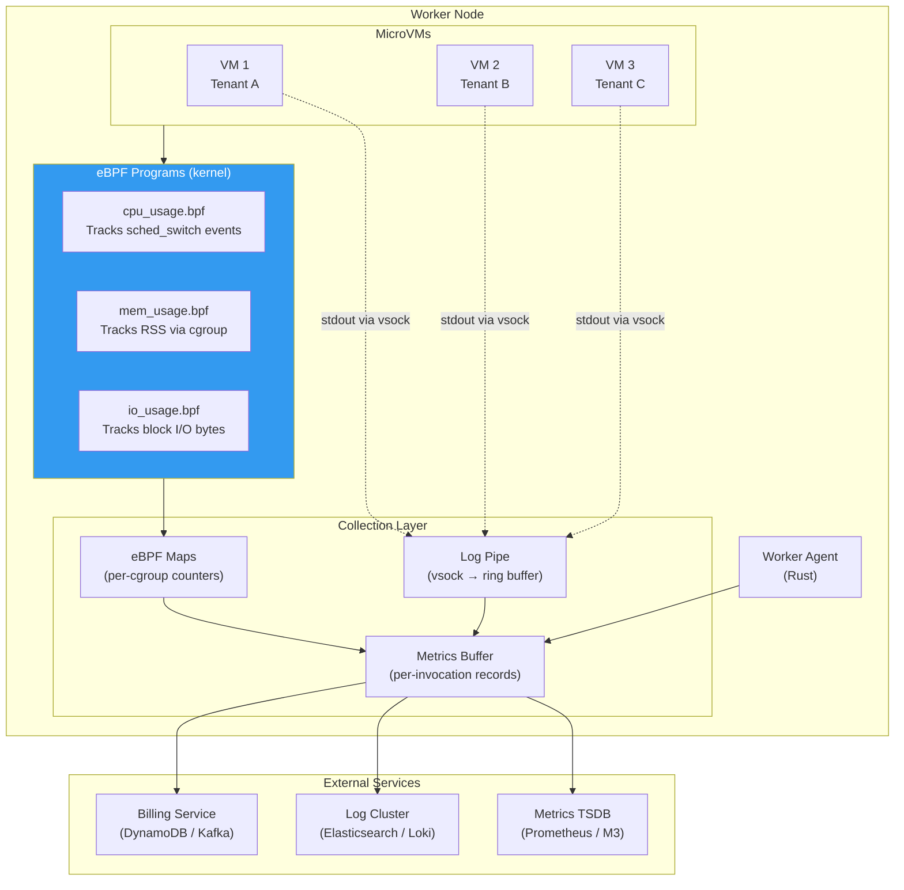
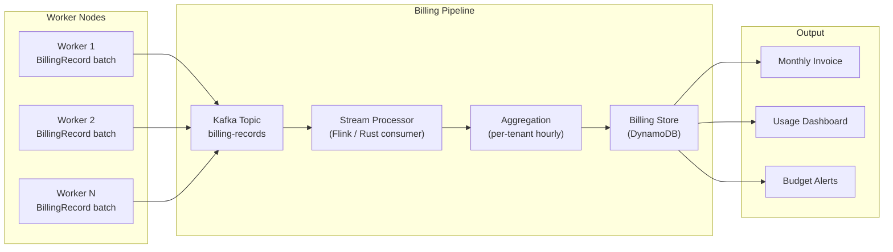
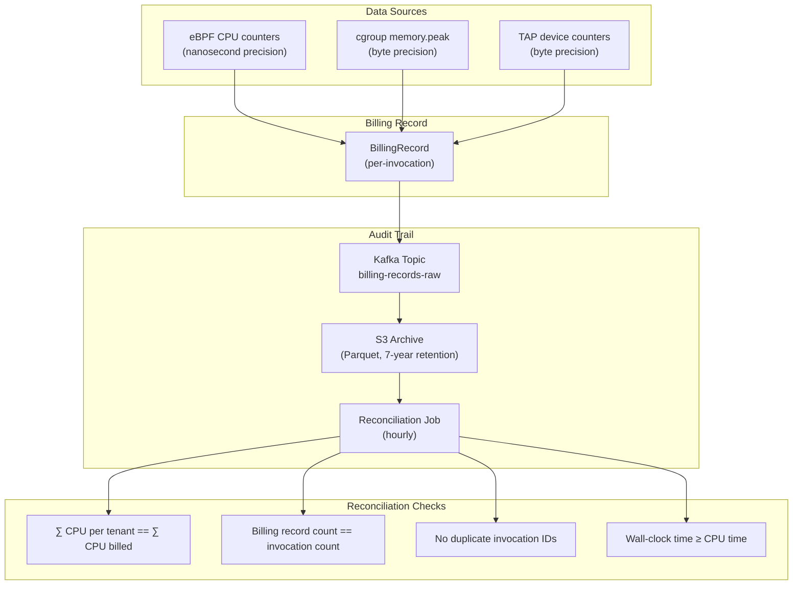
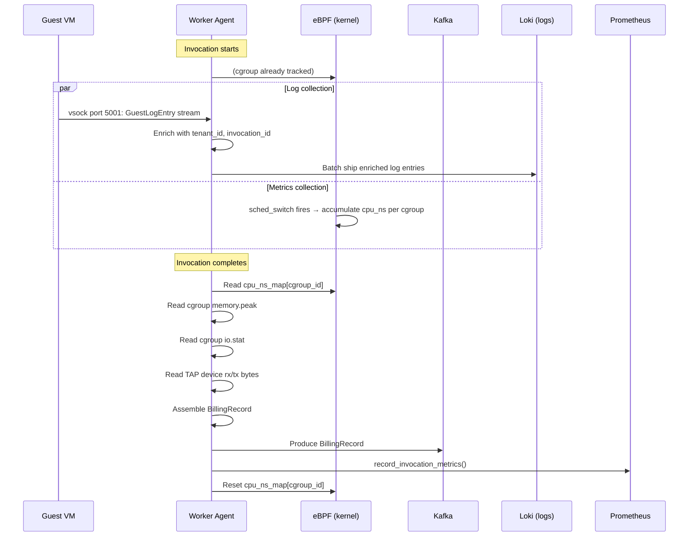

# 5. Metrics, Billing, and Log Aggregation 🔴

> **The Problem:** Your serverless platform is running thousands of MicroVMs per host, each executing untrusted code for a different tenant. You need to answer three questions with microsecond precision: *How much CPU did this invocation use?* (for billing). *How much memory did it touch?* (for capacity planning). *What did it print to stdout?* (for debugging). Traditional monitoring agents polling `/proc` every 10 seconds are laughably insufficient. You need kernel-level instrumentation that is tamper-proof, low-overhead, and precise to the millisecond — because every millisecond of imprecision is either money lost or money overcharged.

---

## The Observability Stack



---

## eBPF — Kernel-Level Instrumentation

**eBPF (extended Berkeley Packet Filter)** allows us to attach tiny, verified programs to kernel events. These programs run in the kernel with near-zero overhead and are guaranteed to terminate (the eBPF verifier proves this before loading). This is how we get tamper-proof, millisecond-precision resource accounting.

### Why Not `/proc` Polling?

| Approach | Precision | Overhead | Tamper-Proof | Granularity |
|---|---|---|---|---|
| `/proc/[pid]/stat` polling (10s) | ±10 seconds | Low | ❌ Guest can manipulate PID | Per-process |
| `/proc/[pid]/stat` polling (100ms) | ±100 ms | **High** (10K reads/sec × 4K VMs) | ❌ | Per-process |
| cgroup `cpuacct.usage` | ~1 ms | Low | ✅ (kernel-enforced) | Per-cgroup |
| **eBPF `sched_switch` tracepoint** | **< 1 μs** | **Negligible** | ✅ (kernel-enforced) | **Per-cgroup, per-event** |

### Naive Approach: Polling `/proc`

```rust,ignore
use std::fs;
use std::time::Instant;

/// Poll /proc for CPU usage — the wrong way.
fn measure_cpu_naive(pid: u32) -> std::io::Result<f64> {
    // 💥 PRECISION HAZARD: Reading /proc/[pid]/stat gives us cumulative
    // CPU ticks since process start. To get per-invocation usage, we
    // must sample before and after — but we don't know the exact start/end
    // of the user's function within the guest.

    // 💥 OVERHEAD HAZARD: With 4,000 MicroVMs, polling every 100ms means
    // 40,000 /proc reads per second — each requiring a VFS lookup.

    // 💥 SECURITY HAZARD: A compromised VMM process could manipulate
    // its own /proc entries (PID reuse attack).

    let stat = fs::read_to_string(format!("/proc/{pid}/stat"))?;
    let fields: Vec<&str> = stat.split_whitespace().collect();

    let utime: u64 = fields[13].parse().unwrap_or(0);  // User mode ticks
    let stime: u64 = fields[14].parse().unwrap_or(0);  // Kernel mode ticks
    let total_ticks = utime + stime;

    // Convert to seconds (assuming 100 Hz tick rate).
    Ok(total_ticks as f64 / 100.0)
}
```

### Production Approach: eBPF on `sched_switch`

The `sched_switch` tracepoint fires every time the kernel context-switches between tasks. By attaching an eBPF program, we get **exact CPU time per cgroup** with sub-microsecond precision.

```c
// cpu_usage.bpf.c — eBPF program loaded into the kernel
//
// Attaches to the sched_switch tracepoint.
// Tracks cumulative CPU nanoseconds per cgroup ID.

#include <vmlinux.h>
#include <bpf/bpf_helpers.h>
#include <bpf/bpf_core_read.h>

// Per-cgroup CPU accumulator.
// Key: cgroup ID (u64), Value: cumulative CPU nanoseconds (u64).
struct {
    __uint(type, BPF_MAP_TYPE_HASH);
    __uint(max_entries, 8192);    // Up to 8K concurrent MicroVMs
    __type(key, u64);             // cgroup ID
    __type(value, u64);           // nanoseconds
} cpu_ns_map SEC(".maps");

// Per-task start timestamp (to compute delta on switch-out).
// Key: PID (u32), Value: timestamp in nanoseconds (u64).
struct {
    __uint(type, BPF_MAP_TYPE_HASH);
    __uint(max_entries, 16384);
    __type(key, u32);
    __type(value, u64);
} task_start SEC(".maps");

// ✅ FIX: Kernel-level CPU accounting with sub-microsecond precision.
// The eBPF verifier guarantees this program terminates and is safe.
// No user-space polling, no /proc reads, no race conditions.

SEC("tp/sched/sched_switch")
int handle_sched_switch(struct trace_event_raw_sched_switch *ctx)
{
    u64 now = bpf_ktime_get_ns();

    // === Handle the task being switched OUT ===
    u32 prev_pid = ctx->prev_pid;
    u64 *start_ns = bpf_map_lookup_elem(&task_start, &prev_pid);
    if (start_ns) {
        u64 delta = now - *start_ns;

        // Get the cgroup ID of the outgoing task.
        struct task_struct *task = (void *)bpf_get_current_task();
        u64 cgroup_id = bpf_task_cgroup_id(task);

        // Accumulate CPU time for this cgroup.
        u64 *total = bpf_map_lookup_elem(&cpu_ns_map, &cgroup_id);
        if (total) {
            __sync_fetch_and_add(total, delta);
        } else {
            bpf_map_update_elem(&cpu_ns_map, &cgroup_id, &delta, BPF_NOEXIST);
        }

        bpf_map_delete_elem(&task_start, &prev_pid);
    }

    // === Handle the task being switched IN ===
    u32 next_pid = ctx->next_pid;
    bpf_map_update_elem(&task_start, &next_pid, &now, BPF_ANY);

    return 0;
}

char LICENSE[] SEC("license") = "GPL";
```

### Loading the eBPF Program from Rust

```rust,ignore
use libbpf_rs::{MapFlags, ObjectBuilder};
use std::collections::HashMap;

/// Load the CPU accounting eBPF program into the kernel.
///
/// This is done once at worker agent startup. The program remains
/// attached for the lifetime of the agent.
fn load_cpu_ebpf() -> Result<CpuTracker, Box<dyn std::error::Error>> {
    // ✅ FIX: eBPF provides tamper-proof, kernel-level CPU accounting.
    // The guest cannot influence these measurements — they are recorded
    // by the kernel's scheduler, not by any user-space process.

    let obj = ObjectBuilder::default()
        .open_file("cpu_usage.bpf.o")?
        .load()?;

    // Attach to the sched_switch tracepoint.
    let _link = obj.prog("handle_sched_switch")
        .ok_or("program not found")?
        .attach()?;

    let cpu_ns_map = obj.map("cpu_ns_map")
        .ok_or("map not found")?
        .reuse_fd()?;

    Ok(CpuTracker {
        _obj: obj,
        cpu_ns_map,
    })
}

struct CpuTracker {
    _obj: libbpf_rs::Object,
    cpu_ns_map: i32, // fd to the eBPF map
}

impl CpuTracker {
    /// Read the accumulated CPU nanoseconds for a specific cgroup.
    ///
    /// Called when an invocation completes to get the exact CPU time used.
    fn read_cpu_ns(&self, cgroup_id: u64) -> Result<u64, Box<dyn std::error::Error>> {
        let key = cgroup_id.to_ne_bytes();
        let value = libbpf_rs::Map::lookup(
            self.cpu_ns_map,
            &key,
            MapFlags::ANY,
        )?;

        match value {
            Some(bytes) => {
                let ns = u64::from_ne_bytes(bytes.try_into().map_err(|_| "invalid bytes")?);
                Ok(ns)
            }
            None => Ok(0), // No CPU usage recorded (shouldn't happen)
        }
    }

    /// Reset the counter for a cgroup (called after reading for billing).
    fn reset_cpu_ns(&self, cgroup_id: u64) -> Result<(), Box<dyn std::error::Error>> {
        let key = cgroup_id.to_ne_bytes();
        libbpf_rs::Map::delete(self.cpu_ns_map, &key)?;
        Ok(())
    }
}
```

---

## Memory Accounting

### cgroup v2 Memory Metrics

Memory accounting uses the cgroup v2 memory controller, which provides kernel-enforced metrics:

```rust,ignore
use std::fs;

/// Read memory metrics for a MicroVM from its cgroup.
///
/// These values are maintained by the kernel's memory controller
/// and cannot be tampered with by the guest or the Firecracker process.
struct MemoryMetrics {
    /// Current RSS (Resident Set Size) in bytes.
    current_bytes: u64,
    /// Peak RSS during this cgroup's lifetime.
    peak_bytes: u64,
    /// Number of OOM kills in this cgroup.
    oom_kills: u64,
}

fn read_memory_metrics(cgroup_path: &str) -> std::io::Result<MemoryMetrics> {
    // memory.current: current RSS in bytes.
    let current = fs::read_to_string(format!("{cgroup_path}/memory.current"))?
        .trim()
        .parse::<u64>()
        .unwrap_or(0);

    // memory.peak: maximum RSS observed (requires kernel 5.15+).
    let peak = fs::read_to_string(format!("{cgroup_path}/memory.peak"))
        .ok()
        .and_then(|s| s.trim().parse::<u64>().ok())
        .unwrap_or(current);

    // memory.events: contains oom_kill count.
    let events = fs::read_to_string(format!("{cgroup_path}/memory.events"))?;
    let oom_kills = events.lines()
        .find(|line| line.starts_with("oom_kill"))
        .and_then(|line| line.split_whitespace().nth(1))
        .and_then(|s| s.parse::<u64>().ok())
        .unwrap_or(0);

    Ok(MemoryMetrics {
        current_bytes: current,
        peak_bytes: peak,
        oom_kills,
    })
}
```

---

## Per-Invocation Billing Record

Every invocation generates a billing record with sub-millisecond precision:

```rust,ignore
use chrono::{DateTime, Utc};
use serde::Serialize;

/// A complete billing record for one function invocation.
///
/// This is the source of truth for billing. It is written to a Kafka
/// topic and consumed by the billing pipeline for aggregation.
#[derive(Serialize, Debug, Clone)]
struct BillingRecord {
    // Identity
    invocation_id: String,
    tenant_id: String,
    function_name: String,
    function_version: u32,
    worker_id: String,
    region: String,

    // Timing (wall clock)
    started_at: DateTime<Utc>,
    completed_at: DateTime<Utc>,
    wall_clock_ms: u64,

    // Resource usage (kernel-measured)
    cpu_ns: u64,            // From eBPF sched_switch tracking
    cpu_ms: f64,            // cpu_ns / 1_000_000 (for human readability)
    memory_peak_mib: u32,   // From cgroup memory.peak
    memory_allocated_mib: u32, // Configured memory for this VM

    // I/O
    disk_read_bytes: u64,   // From cgroup io.stat
    disk_write_bytes: u64,
    network_rx_bytes: u64,  // From TAP device counters
    network_tx_bytes: u64,

    // Execution metadata
    was_cold_start: bool,
    exit_code: i32,
    runtime: String,
    
    // Billing amount (computed by billing pipeline, not worker)
    // Included here as zero — filled downstream.
    cost_usd: f64,
}

/// Pricing model (simplified).
/// Real pricing depends on region, tier, and volume discounts.
struct PricingModel {
    /// Cost per GB-second of memory allocated.
    price_per_gb_second: f64,
    /// Cost per million invocations.
    price_per_invocation: f64,
    /// Minimum billing duration in milliseconds.
    min_billing_ms: u64,
}

impl PricingModel {
    fn calculate_cost(&self, record: &BillingRecord) -> f64 {
        // Bill for allocated memory × wall-clock duration.
        // Round up to minimum billing duration (typically 1 ms).
        let billed_ms = record.wall_clock_ms.max(self.min_billing_ms);
        let billed_seconds = billed_ms as f64 / 1000.0;
        let memory_gb = record.memory_allocated_mib as f64 / 1024.0;

        let compute_cost = memory_gb * billed_seconds * self.price_per_gb_second;
        let invocation_cost = self.price_per_invocation / 1_000_000.0;

        compute_cost + invocation_cost
    }
}
```

### Billing Pipeline



---

## Collecting the Billing Record

```rust,ignore
use chrono::Utc;

impl WorkerAgent {
    /// Collect a complete billing record after an invocation completes.
    ///
    /// All resource metrics come from kernel-level sources (eBPF, cgroup, TAP counters)
    /// that cannot be tampered with by the guest.
    async fn collect_billing_record(
        &self,
        vm: &MicroVmState,
        started_at: DateTime<Utc>,
        was_cold_start: bool,
        exit_code: i32,
    ) -> Result<BillingRecord, Box<dyn std::error::Error>> {
        let completed_at = Utc::now();
        let wall_clock_ms = (completed_at - started_at).num_milliseconds() as u64;

        // 1. CPU usage from eBPF (exact nanoseconds).
        let cgroup_id = self.get_cgroup_id(&vm.cgroup_path)?;
        let cpu_ns = self.cpu_tracker.read_cpu_ns(cgroup_id)?;
        self.cpu_tracker.reset_cpu_ns(cgroup_id)?;

        // 2. Memory usage from cgroup.
        let mem = read_memory_metrics(&vm.cgroup_path)?;

        // 3. I/O usage from cgroup.
        let io = self.read_io_metrics(&vm.cgroup_path)?;

        // 4. Network usage from TAP device counters.
        let net = self.read_network_metrics(&vm.tap_device)?;

        Ok(BillingRecord {
            invocation_id: uuid::Uuid::new_v4().to_string(),
            tenant_id: vm.tenant_id.clone(),
            function_name: vm.function_name.clone(),
            function_version: 1,
            worker_id: self.worker_id.clone(),
            region: "us-east-1".to_string(),
            started_at,
            completed_at,
            wall_clock_ms,
            cpu_ns,
            cpu_ms: cpu_ns as f64 / 1_000_000.0,
            memory_peak_mib: (mem.peak_bytes / (1024 * 1024)) as u32,
            memory_allocated_mib: vm.memory_mib,
            disk_read_bytes: io.read_bytes,
            disk_write_bytes: io.write_bytes,
            network_rx_bytes: net.rx_bytes,
            network_tx_bytes: net.tx_bytes,
            was_cold_start,
            exit_code,
            runtime: vm.runtime.clone(),
            cost_usd: 0.0, // Computed downstream
        })
    }

    fn get_cgroup_id(&self, cgroup_path: &str) -> Result<u64, Box<dyn std::error::Error>> {
        // The cgroup ID is the inode number of the cgroup directory.
        let metadata = std::fs::metadata(cgroup_path)?;
        use std::os::unix::fs::MetadataExt;
        Ok(metadata.ino())
    }

    fn read_io_metrics(&self, cgroup_path: &str) -> Result<IoMetrics, Box<dyn std::error::Error>> {
        // cgroup v2: io.stat file
        // Format: "259:0 rbytes=12345 wbytes=67890 rios=100 wios=50 ..."
        let content = std::fs::read_to_string(format!("{cgroup_path}/io.stat"))?;
        let mut read_bytes = 0u64;
        let mut write_bytes = 0u64;

        for line in content.lines() {
            for field in line.split_whitespace() {
                if let Some(val) = field.strip_prefix("rbytes=") {
                    read_bytes += val.parse::<u64>().unwrap_or(0);
                } else if let Some(val) = field.strip_prefix("wbytes=") {
                    write_bytes += val.parse::<u64>().unwrap_or(0);
                }
            }
        }

        Ok(IoMetrics { read_bytes, write_bytes })
    }

    fn read_network_metrics(&self, tap_device: &str) -> Result<NetMetrics, Box<dyn std::error::Error>> {
        // Read from /sys/class/net/<tap>/statistics/
        let base = format!("/sys/class/net/{tap_device}/statistics");
        let rx = std::fs::read_to_string(format!("{base}/rx_bytes"))?
            .trim().parse::<u64>().unwrap_or(0);
        let tx = std::fs::read_to_string(format!("{base}/tx_bytes"))?
            .trim().parse::<u64>().unwrap_or(0);

        Ok(NetMetrics { rx_bytes: rx, tx_bytes: tx })
    }
}

# struct CpuTracker;
# impl CpuTracker { fn read_cpu_ns(&self, _: u64) -> Result<u64, Box<dyn std::error::Error>> { todo!() } fn reset_cpu_ns(&self, _: u64) -> Result<(), Box<dyn std::error::Error>> { todo!() } }
# struct IoMetrics { read_bytes: u64, write_bytes: u64 }
# struct NetMetrics { rx_bytes: u64, tx_bytes: u64 }
# struct MicroVmState { tenant_id: String, function_name: String, cgroup_path: String, tap_device: String, memory_mib: u32, runtime: String, vm_id: String }
# struct WorkerAgent { worker_id: String, cpu_tracker: CpuTracker }
```

---

## Log Aggregation — Secure Guest Log Piping

User functions write to `stdout` and `stderr`. These logs must be captured, attributed to the correct tenant, and shipped to the observability cluster — **without trusting the guest**.

### Naive Approach: Serial Console Scraping

```rust,ignore
use std::fs::File;
use std::io::Read;

fn capture_logs_naive(serial_path: &str) -> std::io::Result<String> {
    // 💥 SECURITY HAZARD: The serial console carries kernel boot messages,
    // init output, AND user logs — all interleaved.
    // A malicious guest can inject fake log lines that look like they
    // came from another tenant (log injection attack).

    // 💥 RELIABILITY HAZARD: The serial console is a raw byte stream
    // with no framing. There's no way to distinguish log boundaries.
    // Half-written lines, binary garbage, and control characters all
    // end up in the log pipeline.

    let mut file = File::open(serial_path)?;
    let mut output = String::new();
    file.read_to_string(&mut output)?;
    Ok(output)
}
```

### Production Approach: vsock-Based Structured Log Transport

```rust,ignore
use serde::{Deserialize, Serialize};
use tokio::io::AsyncReadExt;
use std::collections::VecDeque;

/// A structured log entry from the guest.
///
/// The guest's init binary captures stdout/stderr and wraps each line
/// in this structure before sending over vsock. The host validates
/// the structure and adds identity metadata.
#[derive(Serialize, Deserialize, Debug)]
struct GuestLogEntry {
    /// Monotonic sequence number (per invocation).
    seq: u64,
    /// Timestamp from the guest's perspective (nanoseconds since boot).
    guest_timestamp_ns: u64,
    /// Stream: "stdout" or "stderr".
    stream: String,
    /// The log line (UTF-8, max 64 KB).
    message: String,
}

/// A log entry enriched with host-side identity and timing.
#[derive(Serialize, Debug)]
struct EnrichedLogEntry {
    // Guest fields
    seq: u64,
    stream: String,
    message: String,

    // Host-injected fields (cannot be forged by guest)
    invocation_id: String,
    tenant_id: String,
    function_name: String,
    worker_id: String,
    host_timestamp: chrono::DateTime<chrono::Utc>,
}

/// Log collector running on the host, one per MicroVM.
///
/// Reads structured log entries from the guest over vsock,
/// enriches them with identity metadata, and buffers for batch shipping.
struct LogCollector {
    invocation_id: String,
    tenant_id: String,
    function_name: String,
    worker_id: String,
    buffer: VecDeque<EnrichedLogEntry>,
    max_buffer_size: usize,
}

impl LogCollector {
    fn new(
        invocation_id: &str,
        tenant_id: &str,
        function_name: &str,
        worker_id: &str,
    ) -> Self {
        Self {
            invocation_id: invocation_id.to_string(),
            tenant_id: tenant_id.to_string(),
            function_name: function_name.to_string(),
            worker_id: worker_id.to_string(),
            buffer: VecDeque::new(),
            max_buffer_size: 10_000, // Max 10K log entries per invocation
        }
    }

    /// Read log entries from the guest vsock stream.
    ///
    /// The guest sends length-prefixed JSON entries on vsock port 5001
    /// (separate from the invocation payload on port 5000).
    async fn collect_from_vsock(
        &mut self,
        mut stream: tokio_vsock::VsockStream,
    ) -> Result<(), Box<dyn std::error::Error>> {
        loop {
            // Read length prefix (4 bytes, little-endian).
            let mut len_buf = [0u8; 4];
            match stream.read_exact(&mut len_buf).await {
                Ok(_) => {}
                Err(e) if e.kind() == std::io::ErrorKind::UnexpectedEof => break,
                Err(e) => return Err(e.into()),
            }

            let msg_len = u32::from_le_bytes(len_buf) as usize;

            // ✅ SECURITY: Cap message size to prevent memory exhaustion.
            if msg_len > 65_536 {
                // Skip oversized messages.
                let mut discard = vec![0u8; msg_len.min(1_048_576)];
                let _ = stream.read_exact(&mut discard).await;
                continue;
            }

            let mut msg_buf = vec![0u8; msg_len];
            stream.read_exact(&mut msg_buf).await?;

            // Parse the guest log entry.
            let entry: GuestLogEntry = match serde_json::from_slice(&msg_buf) {
                Ok(e) => e,
                Err(_) => continue, // Skip malformed entries
            };

            // ✅ SECURITY: Sanitize the message — strip ANSI escape codes
            // and control characters that could be used for log injection.
            let sanitized_message = sanitize_log_message(&entry.message);

            // Enrich with host-side identity.
            let enriched = EnrichedLogEntry {
                seq: entry.seq,
                stream: entry.stream,
                message: sanitized_message,
                invocation_id: self.invocation_id.clone(),
                tenant_id: self.tenant_id.clone(),
                function_name: self.function_name.clone(),
                worker_id: self.worker_id.clone(),
                host_timestamp: chrono::Utc::now(),
            };

            // Buffer with size limit.
            if self.buffer.len() < self.max_buffer_size {
                self.buffer.push_back(enriched);
            }
            // Silently drop if buffer is full — better than OOM on the host.
        }

        Ok(())
    }

    /// Flush buffered log entries to the external log cluster.
    async fn flush_to_cluster(
        &mut self,
        _log_client: &LogClusterClient,
    ) -> Result<(), Box<dyn std::error::Error>> {
        if self.buffer.is_empty() {
            return Ok(());
        }

        let entries: Vec<_> = self.buffer.drain(..).collect();
        // Batch send to Elasticsearch/Loki/CloudWatch.
        // In production: serialize as NDJSON, compress with zstd, POST to ingest endpoint.
        println!("shipping {} log entries for {}", entries.len(), self.invocation_id);
        Ok(())
    }
}

# struct LogClusterClient;

/// Sanitize a guest-produced log message.
///
/// Removes ANSI escape codes, null bytes, and other control characters
/// that could be used for log injection or terminal manipulation.
fn sanitize_log_message(msg: &str) -> String {
    msg.chars()
        .filter(|c| !c.is_control() || *c == '\n' || *c == '\t')
        .take(65_536) // Truncate to 64 KB
        .collect()
}
```

---

## Real-Time Metrics Export

The worker agent exports Prometheus metrics for every host-level and VM-level metric:

```rust,ignore
use prometheus::{
    register_counter_vec, register_gauge_vec, register_histogram_vec,
    CounterVec, GaugeVec, HistogramVec,
};
use once_cell::sync::Lazy;

// Host-level metrics
static INVOCATIONS_TOTAL: Lazy<CounterVec> = Lazy::new(|| {
    register_counter_vec!(
        "serverless_invocations_total",
        "Total function invocations",
        &["tenant_id", "function_name", "runtime", "cold_start"]
    ).unwrap()
});

static INVOCATION_DURATION: Lazy<HistogramVec> = Lazy::new(|| {
    register_histogram_vec!(
        "serverless_invocation_duration_seconds",
        "Function invocation duration",
        &["tenant_id", "runtime"],
        vec![0.001, 0.005, 0.01, 0.025, 0.05, 0.1, 0.25, 0.5, 1.0, 5.0, 30.0]
    ).unwrap()
});

static ACTIVE_VMS: Lazy<GaugeVec> = Lazy::new(|| {
    register_gauge_vec!(
        "serverless_active_vms",
        "Currently active MicroVMs",
        &["runtime", "status"]
    ).unwrap()
});

static CPU_USAGE_SECONDS: Lazy<CounterVec> = Lazy::new(|| {
    register_counter_vec!(
        "serverless_cpu_usage_seconds_total",
        "Cumulative CPU seconds consumed by function invocations",
        &["tenant_id", "function_name"]
    ).unwrap()
});

static MEMORY_PEAK_BYTES: Lazy<HistogramVec> = Lazy::new(|| {
    register_histogram_vec!(
        "serverless_memory_peak_bytes",
        "Peak memory usage per invocation",
        &["tenant_id", "runtime"],
        vec![
            1_048_576.0,     // 1 MB
            16_777_216.0,    // 16 MB
            67_108_864.0,    // 64 MB
            134_217_728.0,   // 128 MB
            268_435_456.0,   // 256 MB
            536_870_912.0,   // 512 MB
        ]
    ).unwrap()
});

/// Record metrics for a completed invocation.
fn record_invocation_metrics(record: &BillingRecord) {
    let cold_start = if record.was_cold_start { "true" } else { "false" };

    INVOCATIONS_TOTAL
        .with_label_values(&[
            &record.tenant_id,
            &record.function_name,
            &record.runtime,
            cold_start,
        ])
        .inc();

    INVOCATION_DURATION
        .with_label_values(&[&record.tenant_id, &record.runtime])
        .observe(record.wall_clock_ms as f64 / 1000.0);

    CPU_USAGE_SECONDS
        .with_label_values(&[&record.tenant_id, &record.function_name])
        .inc_by(record.cpu_ms / 1000.0);

    MEMORY_PEAK_BYTES
        .with_label_values(&[&record.tenant_id, &record.runtime])
        .observe(record.memory_peak_mib as f64 * 1024.0 * 1024.0);
}
```

---

## Billing Accuracy — Reconciliation

Billing disputes are inevitable. The reconciliation system provides an audit trail:



### Reconciliation Invariants

| Invariant | Check | Alert If Violated |
|---|---|---|
| CPU never exceeds wall clock × vCPUs | `cpu_ns ≤ wall_clock_ns × vcpu_count` | Indicates eBPF counter corruption |
| Every invocation has a billing record | `count(invocations) == count(billing_records)` | Indicates dropped records (revenue leak) |
| No duplicate billing records | `count(distinct invocation_id) == count(invocation_id)` | Indicates double-billing (customer trust risk) |
| Memory peak ≤ allocated memory | `memory_peak_mib ≤ memory_allocated_mib + 32` | The +32 MB accounts for VMM overhead |

---

## Putting It All Together — The Observability Flow



---

## Operational Dashboards

Key dashboards for operating the platform:

| Dashboard | Key Metrics | Alert Thresholds |
|---|---|---|
| **Fleet Health** | Active VMs per worker, warm pool depth, CPU utilization | Worker CPU > 85%, warm pool < 5 VMs |
| **Invocation SLO** | p50/p95/p99 latency, cold start rate, error rate | p99 > 500ms, cold start rate > 5%, error rate > 1% |
| **Billing Integrity** | Records produced/sec, reconciliation drift, duplicate rate | Drift > 0.01%, duplicate rate > 0 |
| **Security** | eBPF program load events, cgroup escape attempts, iptables drops | Any cgroup escape attempt triggers PagerDuty |
| **Capacity** | Total available vCPUs cluster-wide, memory utilization, NVMe free space | Available vCPUs < 20%, NVMe < 10% free |

---

> **Key Takeaways**
>
> 1. **eBPF provides tamper-proof, sub-microsecond CPU accounting** by attaching to the kernel's `sched_switch` tracepoint. No user-space polling, no `/proc` scraping, and the guest cannot influence the measurements.
> 2. **cgroup v2 memory accounting** (`memory.current`, `memory.peak`) is kernel-enforced and provides byte-precision memory tracking for billing and capacity planning.
> 3. **Billing records are per-invocation**, assembled from kernel-level data sources (eBPF maps, cgroup files, TAP device counters). The billing pipeline provides 1 ms precision — enough to bill at millisecond granularity.
> 4. **Guest logs are transported over vsock** (not the serial console) using a structured, length-prefixed protocol. The host enriches each entry with identity metadata and sanitizes the message body to prevent log injection.
> 5. **Reconciliation is mandatory.** Hourly reconciliation jobs verify that CPU ≤ wall-clock × vCPUs, every invocation has a billing record, and there are no duplicates. Billing integrity is a trust issue, not just a revenue issue.
> 6. **Prometheus metrics** on every worker provide real-time dashboards for fleet health, invocation SLOs, billing integrity, and capacity planning. Alert on cold start rate > 5%, error rate > 1%, and any cgroup escape attempt.
