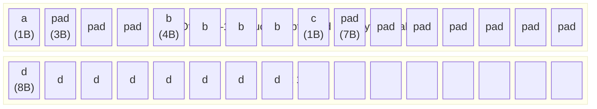
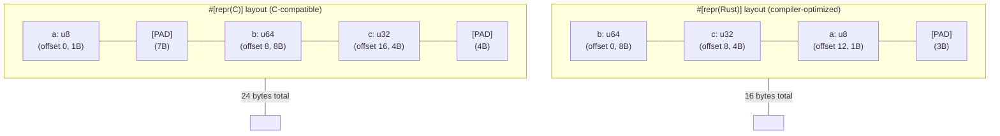

# Chapter 1: Memory Layout, Alignment, and Padding 🟢

> **What you'll learn:**
> - Why the CPU demands data be placed at specific memory addresses ("alignment")
> - How Rust's compiler arranges struct fields, potentially inserting "padding" bytes
> - The critical difference between `#[repr(Rust)]` (default) and `#[repr(C)]` layout
> - How to reorder fields to eliminate padding and shrink struct sizes by up to 50%

---

## 1.1 The Physical Hardware Constraint: Why Alignment Exists

Before we write a single line of Rust, we need to understand *why* alignment exists at all. It is not a language rule invented by compiler authors — it is a **direct consequence of how CPUs are wired to memory**.

Modern CPUs do not read a single byte at a time from RAM. They read memory in units called **words**, which on a 64-bit machine are typically 8 bytes at a time (and they read from the cache in units of 64-byte **cache lines**, which we'll cover in Chapter 2). The memory bus is designed for word-aligned accesses.

Consider a 4-byte `i32` value. If that value is stored starting at address `0x0001` (one byte offset from a word boundary):

```
Address:  0x0000  0x0001  0x0002  0x0003  0x0004  0x0005  0x0006  0x0007
          [ ??? ] [  i3  ] [  i3  ] [  i3  ] [  i3  ] [ ??? ] [ ??? ] [ ??? ]
                    ^--- Our i32 starts here (MISALIGNED)
```

The CPU must:
1. Read the 8-byte word at `0x0000` to get bytes `0x0001`–`0x0003`
2. Read the 8-byte word at `0x0008` to get byte `0x0004`
3. Splice the two results together in a hardware register

This is called an **unaligned access**. On x86, it works but incurs a performance penalty. On ARM and many RISC architectures, it causes a **hardware fault** that kills your process.

**The rule:** A value of type `T` with alignment `N` must be stored at a memory address that is a multiple of `N`.

| Type | Size (bytes) | Required Alignment (bytes) |
|------|-------------|---------------------------|
| `u8` / `i8` / `bool` | 1 | 1 |
| `u16` / `i16` | 2 | 2 |
| `u32` / `i32` / `f32` | 4 | 4 |
| `u64` / `i64` / `f64` | 8 | 8 |
| `usize` / `isize` / `*const T` | 8 (64-bit) | 8 (64-bit) |

You can query these values at compile time in Rust:

```rust
use std::mem;

fn print_type_layout<T>() {
    println!("size = {} bytes, align = {} bytes",
        mem::size_of::<T>(),
        mem::align_of::<T>()
    );
}

fn main() {
    print_type_layout::<u8>();   // size = 1 bytes, align = 1 bytes
    print_type_layout::<u32>();  // size = 4 bytes, align = 4 bytes
    print_type_layout::<u64>();  // size = 8 bytes, align = 8 bytes
    print_type_layout::<&u8>();  // size = 8 bytes, align = 8 bytes (pointer)
}
```

---

## 1.2 Padding: The Bytes the Compiler Inserts for You

Now consider a struct. The compiler must satisfy alignment requirements for **every field** within the struct. When fields have different alignment requirements, the compiler inserts **padding bytes** — silent, invisible, wasted bytes — to ensure correctness.

### The Unoptimized Struct

```rust
struct Unoptimized {
    a: u8,   // 1 byte
    b: u32,  // 4 bytes, must be at a 4-byte aligned offset
    c: u8,   // 1 byte
    d: u64,  // 8 bytes, must be at an 8-byte aligned offset
}
```

What does the compiler actually generate?



Let's trace it byte by byte:

```
Offset 0:  a      (1 byte,  u8)
Offset 1:  [PAD]  (3 bytes, padding to align `b` to 4-byte boundary)
Offset 4:  b      (4 bytes, u32) ✓ aligned at offset 4 (4 % 4 == 0)
Offset 8:  c      (1 byte,  u8)
Offset 9:  [PAD]  (7 bytes, padding to align `d` to 8-byte boundary)
Offset 16: d      (8 bytes, u64) ✓ aligned at offset 16 (16 % 8 == 0)

Total size: 24 bytes
Useful data: 1 + 4 + 1 + 8 = 14 bytes
Wasted:      10 bytes (42%!)
```

Let's verify this in Rust:

```rust
use std::mem;

struct Unoptimized {
    a: u8,
    b: u32,
    c: u8,
    d: u64,
}

fn main() {
    println!("size = {}", mem::size_of::<Unoptimized>()); // Prints: size = 24
}
```

### The Optimized Struct (Field Reordering)

The fix is simple: **order fields from largest to smallest alignment**. This minimizes the padding the compiler must insert.

```rust
struct Optimized {
    d: u64,  // 8 bytes, align 8  → offset 0
    b: u32,  // 4 bytes, align 4  → offset 8  (8 % 4 == 0 ✓)
    a: u8,   // 1 byte,  align 1  → offset 12 (12 % 1 == 0 ✓)
    c: u8,   // 1 byte,  align 1  → offset 13 (13 % 1 == 0 ✓)
    // 2 bytes of tail padding to make struct size a multiple of align(8)=8
}
```

```
Offset 0:  d      (8 bytes, u64)
Offset 8:  b      (4 bytes, u32)
Offset 12: a      (1 byte,  u8)
Offset 13: c      (1 byte,  u8)
Offset 14: [PAD]  (2 bytes, tail padding)

Total size: 16 bytes  (was 24 bytes — 33% smaller!)
Useful data: 14 bytes
Wasted:       2 bytes  (8%)
```

```rust
use std::mem;

struct Optimized {
    d: u64,
    b: u32,
    a: u8,
    c: u8,
}

fn main() {
    println!("size = {}", mem::size_of::<Optimized>()); // Prints: size = 16
}
```

> **Why does the struct size need to be a multiple of its alignment?**  
> Because Rust needs to be able to create arrays of this type. In an array `[Optimized; N]`, each element must be correctly aligned. If the struct has alignment 8 (determined by its most-aligned field), then `size_of::<Optimized>()` must be a multiple of 8. Hence the 2 bytes of tail padding.

---

## 1.3 `#[repr(Rust)]` vs `#[repr(C)]`: The Two Worlds

Rust structs, by default, use `#[repr(Rust)]` layout — the compiler is free to **reorder fields** in any way it sees fit to minimize padding. This is powerful for performance, but it breaks one crucial use case: **interoperating with C**.

### `#[repr(Rust)]` (Default)

```rust
// No attribute = #[repr(Rust)]
struct MyStruct {
    a: u8,
    b: u64,
    c: u32,
}
// Compiler MAY reorder to: b(u64), c(u32), a(u8) + 3 pad
// size = 16 bytes  (not 24)
```

The Rust compiler makes **no guarantees** about field ordering. You cannot assume field `a` is at offset 0. Two different compilations of the same code might produce different layouts. This is intentional: it gives the compiler maximum freedom to optimize.

### `#[repr(C)]` — Stable, Predictable Layout

```rust
#[repr(C)]
struct MyStructC {
    a: u8,
    b: u64,
    c: u32,
}
// Fields stay in declared order. C rules apply.
// a at offset 0, [7 bytes pad], b at offset 8, c at offset 16, [4 bytes pad]
// size = 24 bytes
```

With `#[repr(C)]`, the compiler follows C's struct layout rules:
- Fields appear **in declaration order**.
- Each field is aligned to its natural alignment.
- The struct's size is padded to a multiple of its highest-aligned field.



### When to Use Each

| Layout | Use When |
|--------|----------|
| `#[repr(Rust)]` (default) | Pure Rust code, no FFI. Compiler optimizes for you. |
| `#[repr(C)]` | Passing structs to/from C libraries via FFI. Sharing memory with other languages. Writing `#[no_std]` hardware drivers that must match hardware register maps. |
| `#[repr(packed)]` | **Dangerous.** Removes ALL padding. Used only for network/disk protocols. Causes unaligned accesses (UB on some platforms). |
| `#[repr(align(N))]` | **Increases** alignment beyond natural. Used for SIMD types, cache-line padding to prevent false sharing (see Ch02). |

---

## 1.4 Using `#[repr(packed)]` — And Why It's Dangerous

There is a third option: `#[repr(packed)]`, which eliminates all padding. This is useful for protocol buffers, network packet headers, or disk formats where every byte matters.

```rust
#[repr(packed)]
struct PacketHeader {
    version: u8,   // offset 0
    flags: u8,     // offset 1
    length: u16,   // offset 2  ← WARNING: unaligned!
    seq_num: u32,  // offset 4  ← WARNING: unaligned!
}

// size = 8 bytes (vs 8 bytes naturally here, but try adding a u64 field...)
```

The danger: taking a reference to a misaligned field is **undefined behavior**:

```rust
#[repr(packed)]
struct Danger {
    a: u8,
    b: u32,
}

fn main() {
    let d = Danger { a: 1, b: 42 };
    
    // ❌ FAILS: reference to packed field is unaligned (UB!)
    // let r = &d.b;  // This is a compiler error in safe Rust
    
    // ✅ FIX: copy the value out first
    let b_val = d.b;  // Copies the bytes safely; no reference taken
    println!("{}", b_val);
}
```

Rust's borrow checker actually catches this in recent versions — creating a reference to a packed field is a compile error.

---

## 1.5 Practical: Auditing Your Structs

Here is how to audit a struct's memory layout in Rust today, without any external tools:

```rust
use std::mem;

macro_rules! field_offset {
    ($type:ty, $field:tt) => {{
        let base = mem::MaybeUninit::<$type>::uninit();
        let base_ptr = base.as_ptr() as usize;
        // SAFETY: We're only computing an offset, not dereferencing
        let field_ptr = unsafe {
            std::ptr::addr_of!((*base.as_ptr()).$field) as usize
        };
        field_ptr - base_ptr
    }};
}

#[repr(C)]
struct Example {
    a: u8,
    b: u32,
    c: u8,
    d: u64,
}

fn main() {
    println!("struct Example (#[repr(C)]):");
    println!("  total size : {} bytes", mem::size_of::<Example>());
    println!("  alignment  : {} bytes", mem::align_of::<Example>());
    println!("  field a @ offset {}", field_offset!(Example, a));
    println!("  field b @ offset {}", field_offset!(Example, b));
    println!("  field c @ offset {}", field_offset!(Example, c));
    println!("  field d @ offset {}", field_offset!(Example, d));
}
```

Output:
```
struct Example (#[repr(C)]):
  total size : 24 bytes
  alignment  : 8 bytes
  field a @ offset 0
  field b @ offset 4
  field c @ offset 8
  field d @ offset 16
```

For a more powerful audit, the `memoffset` crate provides the `offset_of!` macro, and the `cargo-show-asm` or third-party `type-layout` crate can print full layout diagrams.

---

## 1.6 Real-World Impact: Enum Layout

Rust's enums (sum types) have the same alignment rules, with an added twist: the **discriminant** — the tag field that tells Rust which variant is active.

```rust
enum Message {
    Quit,                   // no data
    Move { x: i32, y: i32 }, // 8 bytes of data
    Write(String),          // 24 bytes of data (String = ptr + len + cap)
    ChangeColor(u8, u8, u8), // 3 bytes of data
}
```

The enum's size must accommodate its **largest variant** plus the **discriminant**:

```rust
use std::mem;

fn main() {
    // String = 24 bytes (ptr + len + cap, each 8 bytes)
    println!("String size: {}", mem::size_of::<String>()); // 24
    
    println!("Message size: {}", mem::size_of::<Message>()); // 32
    // = 8 (discriminant, padded to max align) + 24 (String variant)
}
```

### Null Pointer Optimization (NPO)

Rust performs a remarkable optimization for `Option<T>` when `T` is a non-nullable reference or pointer type:

```rust
use std::mem;

fn main() {
    // A reference can NEVER be null, so Option<&T> and &T are the same size!
    println!("{}", mem::size_of::<&u32>());         // 8
    println!("{}", mem::size_of::<Option<&u32>>());  // 8 (!)
    
    // The None variant is represented as a null pointer — no extra byte needed.
    println!("{}", mem::size_of::<Box<u32>>());         // 8
    println!("{}", mem::size_of::<Option<Box<u32>>>()); // 8 (!)
}
```

This "zero-cost Option" is one of Rust's great design wins.

---

<details>
<summary><strong>🏋️ Exercise: Minimize a Network Packet Header</strong> (click to expand)</summary>

You are working on a high-performance packet processing system. The following struct models a protocol header, and your profiler has flagged excessive memory allocation. Your task:

1. Print the current size of `ProtocolHeader` using `mem::size_of`.
2. Identify all padding by tracing offsets manually.
3. Reorder the fields in the default `#[repr(Rust)]` variant to minimize size.
4. Add a `#[repr(C)]` version for FFI and compare sizes.
5. Explain why your reordered `#[repr(Rust)]` version cannot be safely passed to a C library.

```rust
// Starting point — DO NOT change field types, only reorder
struct ProtocolHeader {
    flags: u8,
    source_port: u16,
    destination_port: u16,
    checksum: u32,
    sequence_number: u64,
    ack_number: u64,
    window_size: u16,
    urgent_pointer: u8,
}

fn main() {
    use std::mem;
    println!("Current size: {}", mem::size_of::<ProtocolHeader>());
    // TODO: What is the ideal minimum size?
}
```

<details>
<summary>🔑 Solution</summary>

```rust
use std::mem;

// ❌ ORIGINAL — inefficient layout
// Total fields: 1+2+2+4+8+8+2+1 = 28 bytes of data
// With padding: inspect each field in declaration order
struct OriginalHeader {
    flags: u8,            // offset 0, size 1
    // [1B pad] to align source_port to 2
    source_port: u16,     // offset 2, size 2
    destination_port: u16,// offset 4, size 2
    // [2B pad] to align checksum to 4
    checksum: u32,        // offset 8, size 4
    sequence_number: u64, // offset 16 (was 12, needs 8-alignment → 8B pad!), size 8
    ack_number: u64,      // offset 24, size 8
    window_size: u16,     // offset 32, size 2
    urgent_pointer: u8,   // offset 34, size 1
    // [5B tail pad] to align struct to 8-byte boundary
}
// Total: ~40 bytes! (28 bytes of data + 12 bytes wasted)

// ✅ OPTIMIZED #[repr(Rust)] — reorder largest-to-smallest alignment
// Compiler may also reorder, but let's be explicit for #[repr(C)] later
struct OptimizedHeader {
    // 8-byte aligned fields first
    sequence_number: u64, // offset 0,  size 8   (8 % 8 == 0 ✓)
    ack_number: u64,      // offset 8,  size 8   (8 % 8 == 0 ✓)
    // 4-byte aligned fields
    checksum: u32,        // offset 16, size 4   (16 % 4 == 0 ✓)
    // 2-byte aligned fields
    source_port: u16,     // offset 20, size 2   (20 % 2 == 0 ✓)
    destination_port: u16,// offset 22, size 2   (22 % 2 == 0 ✓)
    window_size: u16,     // offset 24, size 2   (24 % 2 == 0 ✓)
    // 1-byte aligned fields
    flags: u8,            // offset 26, size 1   no alignment needed
    urgent_pointer: u8,   // offset 27, size 1
    // Tail padding: 27+1=28 bytes. align = 8. 28 rounded up to 32.
    // [4B tail pad]
}
// Total: 32 bytes (28 bytes data + 4 bytes tail padding)

// ✅ #[repr(C)] version — fields in protocol-correct order for FFI
#[repr(C)]
struct FfiHeader {
    sequence_number: u64,
    ack_number: u64,
    checksum: u32,
    source_port: u16,
    destination_port: u16,
    window_size: u16,
    flags: u8,
    urgent_pointer: u8,
    // [4B tail pad] (same as above, since fields are in same order)
}
// Total: 32 bytes — same size, but NOW safe to pass to C!

fn main() {
    println!("OriginalHeader:  {} bytes", mem::size_of::<OriginalHeader>());
    // Output: 40 bytes

    println!("OptimizedHeader: {} bytes", mem::size_of::<OptimizedHeader>());
    // Output: 32 bytes (the compiler may achieve this without reordering,
    // but being explicit ensures it for #[repr(C)])

    println!("FfiHeader:       {} bytes", mem::size_of::<FfiHeader>());
    // Output: 32 bytes

    // Why can't OptimizedHeader be safely passed to C?
    // Because #[repr(Rust)] gives the compiler FREEDOM to reorder fields.
    // The actual field order at runtime is undefined. A C function expecting
    // `sequence_number` at offset 0 might get `flags` instead.
    // ONLY #[repr(C)] guarantees declaration-order field layout.
}
```

</details>
</details>

---

> **Key Takeaways**
> - Alignment is a hardware requirement: type `T` with alignment `N` must live at an address divisible by `N`.
> - Padding bytes are silently inserted by the compiler to satisfy alignment. They are pure waste.
> - `#[repr(Rust)]` (default) allows the compiler to reorder struct fields for optimal packing.
> - `#[repr(C)]` preserves declaration order — required for FFI interop, but may produce larger structs.
> - To minimize struct size: order fields from largest to smallest alignment requirement.
> - `Option<&T>` and `Option<Box<T>>` are the same size as `&T` and `Box<T>` via the Null Pointer Optimization.

> **See also:**
> - **[Ch02: CPU Caches and Data Locality]** — how struct layout affects cache line utilization
> - **[Ch03: `#[repr(transparent)]` and FFI]** — guaranteeing zero-cost newtype wrappers for C ABI
> - **[Memory Management Guide, Ch02: Stack, Heap, and Pointers]** — foundational pointer mechanics
