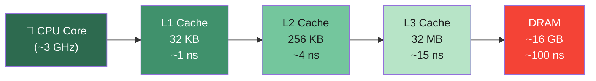
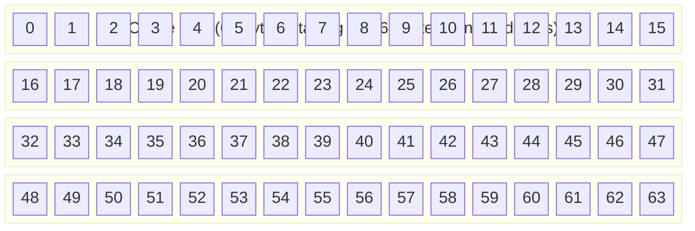
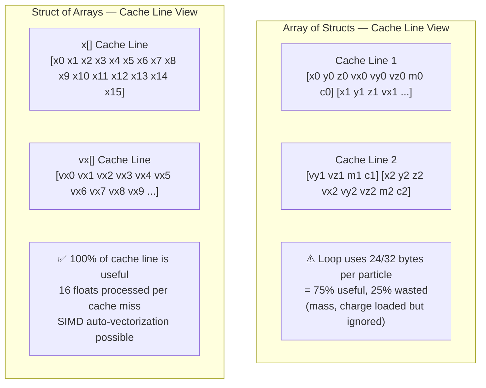

# Chapter 2: CPU Caches and Data Locality 🟡

> **What you'll learn:**
> - The three-level CPU cache hierarchy (L1/L2/L3) and why latency differences are measured in orders of magnitude
> - The **cache line**: what it is, how it works, and why it determines your struct layout strategy
> - **False sharing**: the subtle multi-threaded bug where two threads thrash each other's caches without touching the same data
> - **Array of Structs (AoS) vs. Struct of Arrays (SoA)**: the single most impactful data layout decision for hot loops

---

## 2.1 The Memory Hierarchy: A Latency Chasm

The number one performance lie we tell ourselves is that "memory is fast." It isn't. The gap between CPU computation speed and RAM access speed is enormous, and the only thing bridging that gap is the **cache hierarchy**.

Here is the latency reality on a modern 2024 Zen 4 / Intel Alder Lake workstation:

| Storage Level | Latency | Bandwidth | Typical Size |
|---------------|---------|-----------|--------------|
| CPU Registers | ~0.25 ns | — | ~1 KB |
| L1 Cache (per core) | ~1 ns (4 cycles) | ~1 TB/s | 32–64 KB |
| L2 Cache (per core) | ~4 ns (13 cycles) | ~400 GB/s | 256 KB–1 MB |
| L3 Cache (shared) | ~15 ns (42 cycles) | ~200 GB/s | 8–64 MB |
| DRAM | ~100 ns (300 cycles) | ~50 GB/s | GBs |
| NVMe SSD | ~100,000 ns | ~5 GB/s | TBs |

**The key insight:** L1 cache is **100x faster** than DRAM. If your hot loop causes cache misses, you are leaving 100x performance sitting on the table.



---

## 2.2 The Cache Line: The Atom of Cache Locality

The CPU cache does not operate on individual bytes. It operates on **cache lines** — contiguous blocks of memory, almost universally **64 bytes** on modern x86-64, ARM64, and Apple Silicon.

When you access a single byte of memory, the CPU does not fetch just that byte. It fetches the entire 64-byte cache line containing that byte and stores it in L1.

**This is the most important fact in this entire book.**

### What a 64-byte Cache Line Looks Like



When the CPU fetches byte 0, it automatically loads all 64 bytes for free. **Accessing bytes 1–63 afterward requires zero additional memory fetches.**

Consider iterating over an array of `f64` values (each 8 bytes):

```rust
fn sum_f64(data: &[f64]) -> f64 {
    data.iter().sum()
}
```

Accessing `data[0]` loads bytes 0–63 into L1 cache. `data[0]` through `data[7]` (8 elements × 8 bytes = 64 bytes) are now all in cache. The loop processes 8 elements before needing another cache fetch. This is **sequential access with perfect locality**.

---

## 2.3 Array of Structs (AoS) vs. Struct of Arrays (SoA)

This is the single most impactful data layout decision for performance-critical loops.

### The Problem with AoS in Hot Loops

Imagine a physics simulation with particles. The naive layout groups all data about each particle together:

```rust
// Array of Structs (AoS) — the "natural" object-oriented layout
struct Particle {
    x: f32,       // 4 bytes  (position)
    y: f32,       // 4 bytes  (position)
    z: f32,       // 4 bytes  (position)
    vx: f32,      // 4 bytes  (velocity)
    vy: f32,      // 4 bytes  (velocity)
    vz: f32,      // 4 bytes  (velocity)
    mass: f32,    // 4 bytes
    charge: f32,  // 4 bytes
}
// sizeof(Particle) = 32 bytes
// A cache line holds exactly 2 particles

let particles: Vec<Particle> = vec![/* 1 million particles */];
```

Now the hot update loop only touches positions and velocities:

```rust
fn update_positions_aos(particles: &mut [Particle], dt: f32) {
    for p in particles.iter_mut() {
        // We only USE x, y, z, vx, vy, vz — but we LOAD the entire struct!
        p.x += p.vx * dt;
        p.y += p.vy * dt;
        p.z += p.vz * dt;
    }
}
```

**Memory access pattern:** Each cache line loads 2 particles (64 bytes), giving us all 8 fields for those 2 particles. But we only use 6 of those 8 fields (`x`, `y`, `z`, `vx`, `vy`, `vz`). The `mass` and `charge` fields are loaded into the cache line but never used in this loop. **25% of every cache line fetch is wasted.**

Worse: if you had a separate gravity pass that only reads `mass`, and a separate electrostatics pass that only reads `charge`, those passes still load ALL unused fields.

### The Solution: Struct of Arrays (SoA)

```rust
// Struct of Arrays (SoA) — the data-oriented layout
struct Particles {
    x:      Vec<f32>,  // All X positions contiguous
    y:      Vec<f32>,  // All Y positions contiguous
    z:      Vec<f32>,  // All Z positions contiguous
    vx:     Vec<f32>,  // All X velocities contiguous
    vy:     Vec<f32>,  // All Y velocities contiguous
    vz:     Vec<f32>,  // All Z velocities contiguous
    mass:   Vec<f32>,  // All masses contiguous
    charge: Vec<f32>,  // All charges contiguous
}

fn update_positions_soa(p: &mut Particles, dt: f32) {
    // Now we iterate over ONLY x, y, z, vx, vy, vz
    // memory is perfectly contiguous — no wasted loads
    for i in 0..p.x.len() {
        p.x[i] += p.vx[i] * dt;
        p.y[i] += p.vy[i] * dt;
        p.z[i] += p.vz[i] * dt;
    }
    // mass[] and charge[] are not touched: not in cache, no waste
}
```

**SoA memory access pattern for `x[]`:**
- Cache line 1: `x[0]`, `x[1]`, ..., `x[15]` (16 × f32 = 64 bytes). 
- **100% of the cache line is useful data.** The SIMD vectorizer can also auto-vectorize this into a single AVX2 or SSE instruction operating on 8 floats at once.



### Benchmarking the Difference

```rust
// In a real benchmark (using criterion), results like this are typical:
// update_positions_aos  time: [8.42 ms 8.47 ms 8.53 ms]
// update_positions_soa  time: [1.83 ms 1.85 ms 1.87 ms]
// SoA is ~4.6x faster on 1M particles — purely from cache efficiency
```

### When to Use AoS vs. SoA

| Pattern | Best Layout | Reason |
|---------|------------|--------|
| Iterate over ALL fields per element | AoS | Struct fits in 1–2 cache lines, all data used |
| Iterate over **one or few fields** of many elements | SoA | Only relevant arrays loaded into cache |
| SIMD / vectorized math | SoA | Contiguous f32/f64 arrays enable auto-vectorization |
| Random access by object (e.g., lookup by ID) | AoS | All object data colocated, single cache miss |
| Dynamic dispatch / polymorphism | AoS of `Box<dyn Trait>` | Objects must be self-contained |

---

## 2.4 False Sharing in Multi-Threaded Code

False sharing is one of the most insidious performance bugs in concurrent systems. It occurs when two threads on different CPU cores write to **different variables** that happen to reside on the **same cache line**.

### How the MESI Cache Coherency Protocol Works

Modern multi-core CPUs maintain **cache coherency**: every core's view of memory is consistent. The CPU achieves this with a protocol (commonly MESI: Modified, Exclusive, Shared, Invalid). When one core writes to a cache line:

1. It must **invalidate** all other cores' copies of that cache line.
2. Other cores that then read that line must **re-fetch** it from L3 or DRAM.

This invalidation occurs at the cache line level — regardless of which bytes within the line were modified.

### The False Sharing Trap

```rust
use std::thread;

// ❌ FALSE SHARING — two counters on the same cache line
struct Counters {
    hits: u64,    // offset 0
    misses: u64,  // offset 8 — SAME 64-byte cache line as `hits`!
}

fn main() {
    let mut counters = Counters { hits: 0, misses: 0 };
    
    // Imagine thread 1 writes to `hits` and thread 2 writes to `misses` constantly.
    // Every write by thread 1 invalidates thread 2's copy of the cache line,
    // forcing thread 2 to re-fetch from L3/DRAM before its next write.
    // This completely serializes what should be independent operations!
}
```

### The Fix: Cache Line Padding

```rust
use std::sync::atomic::{AtomicU64, Ordering};

const CACHE_LINE_SIZE: usize = 64;

// ✅ Each counter lives on its own cache line
#[repr(C)]
struct PaddedCounter {
    value: AtomicU64,
    // Pad to fill the rest of the 64-byte cache line.
    // AtomicU64 is 8 bytes. 64 - 8 = 56 bytes of padding needed.
    _padding: [u8; CACHE_LINE_SIZE - std::mem::size_of::<AtomicU64>()],
}

struct IsolatedCounters {
    hits:   PaddedCounter,  // occupies its own 64-byte cache line
    misses: PaddedCounter,  // occupies a DIFFERENT 64-byte cache line
}

// Now thread 1 writing to `hits` and thread 2 writing to `misses`
// operate on entirely separate cache lines. No invalidation ping-pong!
```

Rust's standard library uses this pattern internally. The `crossbeam` crate exports `CachePadded<T>` for convenience:

```rust
// crossbeam::utils::CachePadded<T>
use crossbeam::utils::CachePadded;

struct BetterCounters {
    hits:   CachePadded<AtomicU64>,
    misses: CachePadded<AtomicU64>,
}
```

You can also use `#[repr(align(64))]` directly:

```rust
#[repr(align(64))]  // Force 64-byte alignment → struct starts on a cache line boundary
struct AlignedCounter {
    value: std::sync::atomic::AtomicU64,
}

// sizeof(AlignedCounter) must be padded to 64 bytes too (multiple of alignment)
// So this struct IS 64 bytes total — one per cache line.
```

---

## 2.5 Measuring Cache Performance

Don't guess — measure. On Linux, use `perf`:

```bash
# Count cache misses during a benchmark run
perf stat -e cache-misses,cache-references,L1-dcache-load-misses ./my_benchmark

# Example output:
# 45,231,042   cache-misses         #   12.34% of all cache refs
#  4,112,888   L1-dcache-load-misses
```

On macOS, use Instruments or `cargo bench` with `criterion`:

```bash
cargo bench --bench my_bench
```

In Rust, you can use the `criterion` crate with `perf` integration for cycle-accurate measurements.

---

<details>
<summary><strong>🏋️ Exercise: Diagnose and Fix a Cache-Hostile Data Structure</strong> (click to expand)</summary>

The following code simulates a hot game loop that updates entity positions. It is cache-hostile. Your tasks:

1. Identify exactly **why** the `GameEntity` AoS layout hurts cache performance in `update_all`.
2. Refactor to an SoA layout (`EntityWorld`).
3. Add a `hits`/`misses` counter pair and explain why accessing them from two threads simultaneously would cause false sharing. Show the fix using `#[repr(align(64))]`.

```rust
struct GameEntity {
    id: u64,             // 8B  — used for lookup, rarely in hot loop
    name: [u8; 32],      // 32B — used for rendering/UI, rarely in hot loop
    x: f32,              // 4B  — used every frame ✓
    y: f32,              // 4B  — used every frame ✓
    vel_x: f32,          // 4B  — used every frame ✓
    vel_y: f32,          // 4B  — used every frame ✓
    health: f32,         // 4B  — used in damage events, rarely in hot loop
    sprite_id: u32,      // 4B  — used in render pass, rarely in hot loop
}
// sizeof(GameEntity) = 64 bytes — exactly 1 cache line!
// But our hot loop only uses x, y, vel_x, vel_y = 16 bytes = 25% of the cache line!

fn update_all(entities: &mut Vec<GameEntity>, dt: f32) {
    for e in entities.iter_mut() {
        e.x += e.vel_x * dt;
        e.y += e.vel_y * dt;
    }
}
```

<details>
<summary>🔑 Solution</summary>

```rust
use std::sync::atomic::{AtomicU64, Ordering};

// ❌ ORIGINAL PROBLEM:
// GameEntity is 64 bytes = 1 cache line
// But update_all only uses 16 bytes (x, y, vel_x, vel_y)
// → 48 bytes (id, name[32], health, sprite_id) are loaded but NEVER used
// → For 10,000 entities, we load 640 KB of useless data into L1/L2

// ✅ SOLUTION: Struct of Arrays
// Split the hot fields (updated every frame) from the cold fields (used rarely)

struct EntityWorld {
    // HOT: updated every frame (packed together for maximum cache use)
    x:        Vec<f32>,   // positions
    y:        Vec<f32>,
    vel_x:    Vec<f32>,   // velocities
    vel_y:    Vec<f32>,

    // COLD: used less frequently (can live elsewhere, out of hot cache)
    id:        Vec<u64>,
    health:    Vec<f32>,
    sprite_id: Vec<u32>,
    // name is very large (32 bytes each!) — put it in a separate Vec<String>
    // or a side table indexed by entity ID
    name:      Vec<[u8; 32]>,
}

impl EntityWorld {
    fn new(capacity: usize) -> Self {
        EntityWorld {
            x:        Vec::with_capacity(capacity),
            y:        Vec::with_capacity(capacity),
            vel_x:    Vec::with_capacity(capacity),
            vel_y:    Vec::with_capacity(capacity),
            id:        Vec::with_capacity(capacity),
            health:    Vec::with_capacity(capacity),
            sprite_id: Vec::with_capacity(capacity),
            name:      Vec::with_capacity(capacity),
        }
    }

    fn push(&mut self, id: u64, name: [u8; 32], x: f32, y: f32,
            vel_x: f32, vel_y: f32, health: f32, sprite_id: u32) {
        self.x.push(x);
        self.y.push(y);
        self.vel_x.push(vel_x);
        self.vel_y.push(vel_y);
        self.id.push(id);
        self.health.push(health);
        self.sprite_id.push(sprite_id);
        self.name.push(name);
    }
}

fn update_all_soa(world: &mut EntityWorld, dt: f32) {
    // Only x, y, vel_x, vel_y are touched.
    // Each Vec is a contiguous array of f32 — 16 floats per cache line.
    // The CPU loads ONE cache line of x[], processes 16 entities' x-positions,
    // then moves to the next cache line. No wasted bytes.
    let n = world.x.len();
    for i in 0..n {
        world.x[i] += world.vel_x[i] * dt;
        world.y[i] += world.vel_y[i] * dt;
    }
    // id[], health[], sprite_id[], name[] are NOT accessed → NOT in cache → zero waste
}

// ✅ FALSE SHARING FIX:
// Counters used by two threads — must be on separate cache lines

#[repr(align(64))]  // This struct will start on a 64-byte boundary
struct CacheAlignedCounter {
    value: AtomicU64,
    // repr(align(64)) ensures the size is padded to 64 bytes.
    // sizeof(AtomicU64) = 8, so compiler inserts 56 bytes of padding.
}

// Compile-time assertion that our struct is exactly one cache line
const _: () = assert!(std::mem::size_of::<CacheAlignedCounter>() == 64);

struct ThreadSafeCounters {
    // Each field is cache-line-aligned and cache-line-sized.
    // Thread 1 writing `hits` and Thread 2 writing `misses` are
    // now modifying DIFFERENT cache lines. Zero coherency traffic.
    hits:   CacheAlignedCounter,
    misses: CacheAlignedCounter,
}

impl ThreadSafeCounters {
    fn new() -> Self {
        ThreadSafeCounters {
            hits:   CacheAlignedCounter { value: AtomicU64::new(0) },
            misses: CacheAlignedCounter { value: AtomicU64::new(0) },
        }
    }

    fn record_hit(&self)  { self.hits.value.fetch_add(1, Ordering::Relaxed); }
    fn record_miss(&self) { self.misses.value.fetch_add(1, Ordering::Relaxed); }
}

fn main() {
    let mut world = EntityWorld::new(1000);
    world.push(1, [b'A'; 32], 0.0, 0.0, 1.0, 1.0, 100.0, 42);
    update_all_soa(&mut world, 0.016);
    println!("x[0] = {}", world.x[0]); // 0.016

    let counters = ThreadSafeCounters::new();
    counters.record_hit();
    println!("hits = {}", counters.hits.value.load(Ordering::Relaxed));
}
```

</details>
</details>

---

> **Key Takeaways**
> - L1 cache is ~100x faster than DRAM. Cache misses are the most common cause of "my algorithm is correct but slow" bugs.
> - The CPU fetches memory in 64-byte **cache lines**. Accessing one byte means 64 bytes are loaded. Design your data layouts to maximize the useful bytes per cache line fetch.
> - **AoS** (Array of Structs) is natural for object-centric code, but wastes cache bandwidth when only a few fields are needed in a hot loop.
> - **SoA** (Struct of Arrays) maximizes cache utilization for field-intensive iterations and enables SIMD auto-vectorization.
> - **False sharing** occurs when two threads write to different data on the same cache line. Fix it with `#[repr(align(64))]` or `CachePadded<T>`.

> **See also:**
> - **[Ch01: Memory Layout, Alignment, and Padding]** — struct sizing and field ordering fundamentals
> - **[Concurrency Guide, Ch05: Atomic Operations and Memory Ordering]** — how cache coherency interacts with atomics and memory ordering
> - **[Async Guide, Ch08: Tokio Deep Dive]** — how Tokio's task queues use cache-aligned data structures for thread-per-core locality
