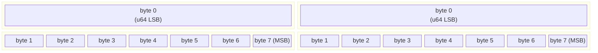

# Chapter 3: `#[repr(transparent)]` and FFI 🟡

> **What you'll learn:**
> - What `#[repr(transparent)]` guarantees at the ABI level
> - How to build zero-cost newtype wrappers that share memory layout with their inner type
> - How Rust communicates struct layouts to C through the type system
> - How to safely pass Rust types across the FFI boundary without copies or conversions

---

## 3.1 The Newtype Pattern and Its Hidden Cost (Without `repr(transparent)`)

The **newtype pattern** — wrapping a type in a single-field struct to add type safety — is idiomatic Rust. It lets you distinguish a "user ID" from an "order ID" even though both are `u64` under the hood.

```rust
// Two distinct types that prevent mixing up IDs at compile time
struct UserId(u64);
struct OrderId(u64);

fn process_order(user: UserId, order: OrderId) { /* ... */ }

// process_order(OrderId(1), UserId(2));  // ❌ Compile error! Type safety works.
```

But what is the memory layout of `UserId`? With `#[repr(Rust)]` (the default), the compiler guarantees only that `UserId` contains a `u64` — not that `UserId` has *exactly the same layout* as `u64`. In practice it almost always does, but the compiler makes no promise.

This matters enormously for **FFI** (Foreign Function Interfaces): when you call a C function that expects a raw `uint64_t`, you cannot safely pass `UserId` unless the layout is **guaranteed identical**.

---

## 3.2 `#[repr(transparent)]`: The Zero-Cost Guarantee

`#[repr(transparent)]` tells the compiler: **"This struct has exactly one non-zero-sized field, and its memory layout is identical to that field."**

```rust
// ❌ No guarantee — default repr(Rust)
struct UserIdUnsafe(u64);

// ✅ Explicit ABI guarantee — repr(transparent)
#[repr(transparent)]
struct UserId(u64);
```

With `#[repr(transparent)]`:
- `size_of::<UserId>()` == `size_of::<u64>()` (8 bytes)
- `align_of::<UserId>()` == `align_of::<u64>()` (8 bytes)
- `UserId` and `u64` have **identical function call ABI** — you can transmute between them safely
- A C function expecting `uint64_t` can receive a `UserId` with no overhead

```rust
use std::mem;

#[repr(transparent)]
struct UserId(u64);

fn main() {
    assert_eq!(mem::size_of::<UserId>(), mem::size_of::<u64>());     // Both 8
    assert_eq!(mem::align_of::<UserId>(), mem::align_of::<u64>());   // Both 8
    
    // Safe transmutation — identical layout guaranteed
    let id = UserId(42);
    let raw: u64 = unsafe { mem::transmute(id) };
    println!("{}", raw); // 42
}
```



**Byte-for-byte identical layout.** Passing a `UserId` to a C `uint64_t` parameter is as cheap as passing a raw `u64`. No conversion, no copy, no abstraction overhead.

---

## 3.3 The Rules of `#[repr(transparent)]`

A struct is valid for `#[repr(transparent)]` if and only if:

1. It has **exactly one field with non-zero size**.
2. All other fields (if any) must be **zero-sized types** (ZSTs like `PhantomData<T>`).

```rust
use std::marker::PhantomData;

// ✅ Valid: one non-zero field + ZST marker
#[repr(transparent)]
struct Branded<T, Brand> {
    value: T,
    _brand: PhantomData<Brand>,  // ZST — no memory, no ABI impact
}

// ❌ FAILS: two non-zero-sized fields
// #[repr(transparent)]
// struct TwoFields {
//     a: u64,
//     b: u32,  // Error: transparent struct can only have one non-zero-sized field
// }
```

The `PhantomData<Brand>` adds compile-time type branding with **zero runtime cost**, because ZSTs occupy no memory.

---

## 3.4 Practical FFI: Calling a C Library Safely

Let's build a real FFI wrapper. Suppose we have a C library for cryptographic hashing:

```c
// crypto_lib.h (C header)
typedef uint64_t DigestHandle;

DigestHandle crypto_new_digest(void);
void crypto_update(DigestHandle handle, const uint8_t* data, size_t len);
uint64_t crypto_finalize(DigestHandle handle);
void crypto_free(DigestHandle handle);
```

In C, `DigestHandle` is just a `uint64_t` — probably an index into an internal table. If we wrap it naively, we could accidentally swap handles or call free on the wrong one:

```c
// In C — easy to mess up (no type safety)
DigestHandle h1 = crypto_new_digest();
DigestHandle h2 = crypto_new_digest();
crypto_free(h2);  // Oops — freed h2 but meant h1. Use-after-free waiting to happen.
```

In Rust, we create a zero-cost newtype with RAII cleanup:

```rust
use std::marker::PhantomData;

// Link against the C library
extern "C" {
    fn crypto_new_digest() -> u64;
    fn crypto_update(handle: u64, data: *const u8, len: usize);
    fn crypto_finalize(handle: u64) -> u64;
    fn crypto_free(handle: u64);
}

/// A type-safe handle for a crypto digest context.
/// 
/// `#[repr(transparent)]` ensures this is ABI-identical to `u64`,
/// so passing it to C functions requires zero conversion.
#[repr(transparent)]
pub struct DigestHandle(u64);

impl DigestHandle {
    /// Creates a new digest context via the C library.
    pub fn new() -> Self {
        DigestHandle(unsafe { crypto_new_digest() })
    }

    /// Feeds data into the digest.
    pub fn update(&mut self, data: &[u8]) {
        unsafe {
            // Safe: `data.as_ptr()` is valid for `data.len()` bytes
            // `self.0` is a valid handle (invariant maintained by our API)
            crypto_update(self.0, data.as_ptr(), data.len());
        }
    }

    /// Finalizes and returns the digest value.
    pub fn finalize(self) -> u64 {
        let result = unsafe { crypto_finalize(self.0) };
        // `self` is consumed here → Drop will call crypto_free
        result
    }
}

// RAII: automatically clean up when the handle goes out of scope
impl Drop for DigestHandle {
    fn drop(&mut self) {
        unsafe { crypto_free(self.0); }
    }
}

// Usage — impossible to mix up two handles because they're different Rust values
pub fn hash_data(data: &[u8]) -> u64 {
    let mut h = DigestHandle::new();
    h.update(data);
    h.finalize()  // `h` is moved into finalize → Drop is NOT called from here
    // ... actually we need to not double-free. Let's use ManuallyDrop:
}
```

> **ABI Compatibility in Action:** When `crypto_update(self.0, ...)` is compiled, the `DigestHandle` wrapper is completely erased — exactly as if you wrote `crypto_update(raw_u64, ...)`. The `#[repr(transparent)]` guarantee means the calling convention is identical.

---

## 3.5 `#[repr(transparent)]` in the Standard Library

This pattern is used throughout Rust's standard library:

```rust
// std::num::NonZeroU64 — same layout as u64, but cannot be zero
// The compiler uses this to enable the null pointer optimization:
// Option<NonZeroU64> is the same size as u64 (None = 0, Some(x) = x)

use std::num::NonZeroU64;
use std::mem;

fn main() {
    assert_eq!(mem::size_of::<NonZeroU64>(), 8);
    assert_eq!(mem::size_of::<Option<NonZeroU64>>(), 8);  // NPO kicks in!
    
    let n = NonZeroU64::new(42).unwrap();
    let opt: Option<NonZeroU64> = Some(n);
    
    // Internally, None is represented as 0, Some(n) as the raw value
    // Zero allocation overhead for Option wrapping!
}
```

Other `#[repr(transparent)]` types in `std`:
- `std::cell::UnsafeCell<T>` — the foundation of interior mutability
- `std::mem::ManuallyDrop<T>` — suppresses `Drop` without changing layout
- `std::mem::MaybeUninit<T>` — uninitialized memory placeholder
- `std::num::Wrapping<T>` — wrapping arithmetic newtype

---

## 3.6 Transmuting References Safely

`#[repr(transparent)]` enables a crucial pattern: converting `&T` references to `&NewType` references without any pointer arithmetic:

```rust
#[repr(transparent)]
struct Meters(f64);

impl Meters {
    // Convert a reference to f64 into a reference to Meters — zero cost!
    // SAFE because repr(transparent) guarantees identical layout
    pub fn from_ref(raw: &f64) -> &Self {
        unsafe { &*(raw as *const f64 as *const Meters) }
    }
    
    pub fn from_mut(raw: &mut f64) -> &mut Self {
        unsafe { &mut *(raw as *mut f64 as *mut Meters) }
    }
}

fn process_distance(meters: &Meters) {
    println!("{} m", meters.0);
}

fn main() {
    let distance_raw: f64 = 42.5;
    // Convert without any allocation or copy:
    process_distance(Meters::from_ref(&distance_raw));
}
```

This pattern is used in the `bytemuck` crate, which provides safe, `repr(transparent)`-aware casting utilities for zero-copy deserialization.

---

<details>
<summary><strong>🏋️ Exercise: Build a Type-Safe File Descriptor Wrapper</strong> (click to expand)</summary>

On Unix, file descriptors are raw `i32` integers. A common C bug is using a closed file descriptor, or passing the wrong FD to the wrong function. Build a zero-cost Rust wrapper that:

1. Uses `#[repr(transparent)]` to ensure zero FFI overhead.
2. Wraps `i32` in a `FileDescriptor` newtype.
3. Implements `Drop` to close the FD automatically (`libc::close`).
4. Exposes a `read` method that returns `Result<usize, i32>`.
5. Add a compile-time assertion verifying the size of `FileDescriptor` equals `size_of::<i32>()`.

```rust
// Starter — fill in the implementation
use std::mem;

extern "C" {
    fn close(fd: i32) -> i32;
    fn read(fd: i32, buf: *mut u8, count: usize) -> isize;
}

#[repr(transparent)]
pub struct FileDescriptor(/* TODO */);

// TODO: impl Drop
// TODO: impl read method
// TODO: compile-time size assertion
```

<details>
<summary>🔑 Solution</summary>

```rust
use std::mem;
use std::io;

// We link against libc for the actual syscall wrappers
extern "C" {
    fn close(fd: i32) -> i32;
    fn read(fd: i32, buf: *mut u8, count: usize) -> isize;
    fn open(path: *const i8, flags: i32) -> i32;
}

/// A type-safe, RAII file descriptor wrapper.
/// 
/// # ABI Layout Guarantee
/// `#[repr(transparent)]` ensures that `FileDescriptor` has the same memory
/// layout and calling convention as a raw `i32`. When this type is passed to
/// `extern "C"` functions, no conversion occurs — it compiles identically
/// to passing a raw integer.
#[repr(transparent)]
pub struct FileDescriptor(i32);

// Compile-time assertion: FileDescriptor must be the same size as i32
// This fails at compile time if repr(transparent) is removed or the
// struct gains additional non-ZST fields.
const _SIZE_CHECK: () = assert!(
    mem::size_of::<FileDescriptor>() == mem::size_of::<i32>(),
    "FileDescriptor must be ABI-identical to i32"
);

impl FileDescriptor {
    /// Takes ownership of a raw file descriptor.
    /// 
    /// # Safety
    /// The caller must ensure `fd` is a valid, open file descriptor.
    /// `FileDescriptor` will close it when dropped — the caller must NOT
    /// close it elsewhere.
    pub unsafe fn from_raw(fd: i32) -> Self {
        assert!(fd >= 0, "Invalid file descriptor: {}", fd);
        FileDescriptor(fd)
    }

    /// Returns the raw file descriptor value.
    /// Does NOT transfer ownership — the FD remains managed by this wrapper.
    pub fn as_raw(&self) -> i32 {
        self.0
    }

    /// Read up to `buf.len()` bytes from the file descriptor.
    /// 
    /// Returns the number of bytes read, or an OS error code.
    pub fn read(&self, buf: &mut [u8]) -> Result<usize, i32> {
        // SAFETY: buf is a valid mutable slice; self.0 is a valid FD
        let result = unsafe {
            read(self.0, buf.as_mut_ptr(), buf.len())
        };
        if result < 0 {
            // Negative return = error. In production, use errno.
            Err(result as i32)
        } else {
            Ok(result as usize)
        }
    }
}

/// RAII cleanup: automatically close the FD when `FileDescriptor` is dropped.
impl Drop for FileDescriptor {
    fn drop(&mut self) {
        let ret = unsafe { close(self.0) };
        // In production code, you'd log or handle close errors,
        // but panicking in Drop is inadvisable.
        if ret != 0 {
            eprintln!("Warning: close({}) failed", self.0);
        }
    }
}

fn main() {
    // Demonstrate the size guarantee at runtime too
    assert_eq!(mem::size_of::<FileDescriptor>(), 4);
    println!("FileDescriptor size: {} bytes (same as i32)", 
             mem::size_of::<FileDescriptor>());
    
    // In a real program with valid FDs:
    // let fd = unsafe { FileDescriptor::from_raw(open(b"/etc/hosts\0".as_ptr() as *const i8, 0)) };
    // let mut buf = [0u8; 128];
    // match fd.read(&mut buf) {
    //     Ok(n) => println!("Read {} bytes", n),
    //     Err(e) => eprintln!("Read error: {}", e),
    // }
    // fd is dropped here → close() called automatically
}
```

</details>
</details>

---

> **Key Takeaways**
> - `#[repr(transparent)]` guarantees that a single-field newtype has **exactly the same memory layout and ABI** as its inner type.
> - This makes newtype wrappers truly zero-cost: no conversion overhead when passing to C functions.
> - The struct must have exactly one non-zero-sized field; `PhantomData<T>` fields are permitted as ZSTs.
> - `#[repr(transparent)]` enables safe `transmute` between `NewType` and `InnerType`, and between `&NewType` and `&InnerType`.
> - The standard library uses this for `NonZeroU64`, `UnsafeCell<T>`, `ManuallyDrop<T>`, and more.

> **See also:**
> - **[Ch08: Drop Check and `PhantomData`]** — how `PhantomData<T>` interacts with drop checking in custom smart pointers
> - **[Ch07: Raw Pointers and `unsafe`]** — the `unsafe` tools needed for manual FFI pointer casting
> - **[Memory Management Guide, Ch09: Box and Sized Traits]** — how `Box<dyn Trait>` and FFI boundaries interact
