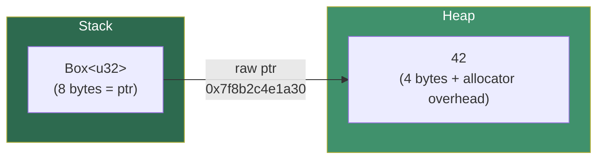

# Chapter 4: `Box<T>` and the Allocator 🟢

> **What you'll learn:**
> - What `Box<T>` actually is at the machine level (spoiler: one pointer)
> - How heap allocation works: the allocator's control flow and `jemalloc` vs. `mimalloc`
> - When to use `Box<T>`: the three legitimate cases (recursive types, trait objects, pinning)
> - The exact memory overhead of `Box<T>` vs. stack allocation — and when the compiler eliminates it entirely

---

## 4.1 What `Box<T>` Is, Precisely

In Rust, `Box<T>` is the simplest owned smart pointer. It represents **exclusive ownership of a value stored on the heap**. When the `Box` is dropped, the heap memory is freed.

At the machine level, `Box<T>` is exactly **one pointer**:

```rust
use std::mem;

fn main() {
    // On a 64-bit machine, a pointer is always 8 bytes
    assert_eq!(mem::size_of::<Box<u8>>(),   8);  // 8 bytes (pointer)
    assert_eq!(mem::size_of::<Box<u64>>(),  8);  // 8 bytes (pointer)
    assert_eq!(mem::size_of::<Box<[u8; 1000]>>(), 8);  // still 8 bytes!
    
    // The heap allocation holds the actual data.
    // The Box on the stack is just the pointer to it.
}
```

There is no reference count, no length, no capacity — just a pointer. This makes `Box<T>` the "unique ownership" equivalent of C++'s `std::unique_ptr<T>`.



### What Happens in Memory: Step by Step

```rust
let x: Box<u32> = Box::new(42);
```

1. **Compile time:** Rust determines `size_of::<u32>()` = 4 bytes, `align_of::<u32>()` = 4 bytes.
2. **Runtime:** The allocator (`malloc` or a Rust allocator) is called: `alloc(layout: Layout { size: 4, align: 4 })`.
3. The allocator returns a pointer, e.g., `0x7f8b2c4e1a30`.
4. The value `42_u32` is written to that address.
5. A `Box<u32>` struct (just the pointer) is stored on the stack.

When `x` goes out of scope:
1. Rust calls `drop(x)` automatically.
2. `Box`'s `Drop` implementation calls: `dealloc(ptr, layout)`.
3. The heap memory is reclaimed.

**C++ Equivalent:**
```cpp
// C++
auto x = std::make_unique<uint32_t>(42);
// Equivalent: new uint32_t(42) stored in a unique_ptr<uint32_t>
// Drop: delete ptr; when unique_ptr goes out of scope
```

---

## 4.2 The Allocator: What Happens Behind `Box::new`

When you call `Box::new(value)`, Rust ultimately calls the **global allocator**. By default on most platforms, this is `jemalloc` (via `std`) or the system `malloc`. The allocator must:

1. **Find or create a free block** of memory at least `size` bytes with at least `align` alignment.
2. **Record metadata** about the allocation so it can be freed later.
3. Return a pointer.

This metadata (the allocator's bookkeeping) is stored **adjacent to your data** in memory — this is why `malloc(4)` actually uses more than 4 bytes of heap memory. A typical `glibc malloc` block looks like:

```
  ┌─────────────────────────────────────────────┐
  │ prev_size (8 bytes) — size of prev chunk     │
  │ size      (8 bytes) — size of this chunk     │
  │           + flags in low bits                │
  ├─────────────────────────────────────────────┤ ← pointer returned to user
  │ YOUR DATA (4 bytes for u32)                  │
  │ [padding to 16-byte minimum] (12 bytes)      │
  └─────────────────────────────────────────────┘
  Total: ~32 bytes consumed for a 4-byte value!
```

> On glibc malloc, the minimum allocation is **16 bytes** (8 bytes metadata + 8 bytes usable), and all chunks are 16-byte aligned. So `Box::new(42_u32)` (4 bytes) uses 16 bytes of heap. This is well-understood overhead — not a `Box` overhead, but an allocator policy.

Modern allocators like `jemalloc` and `mimalloc` use **size-class bins** to reduce fragmentation:

| Allocator | Strategy | Strength |
|-----------|----------|----------|
| `glibc malloc` | Boundary-tag coalescing | General purpose, widely compatible |
| `jemalloc` | Thread-local size-class arenas | Low fragmentation, high throughput |
| `mimalloc` | Segment-based, free-list sharding | Excellent in multi-threaded mallocs |
| `tcmalloc` (Google) | Thread-cached free lists | Best for many small, short-lived allocs |

You can swap Rust's global allocator:

```rust
// In main.rs or lib.rs — use mimalloc for higher performance
use mimalloc::MiMalloc;

#[global_allocator]
static GLOBAL: MiMalloc = MiMalloc;
```

```toml
# Cargo.toml
[dependencies]
mimalloc = "0.1"
```

---

## 4.3 The Three Legitimate Uses of `Box<T>`

### Use 1: Recursive Types

A type cannot contain itself directly — the compiler needs to know its size at compile time, and a self-containing type would be infinitely large:

```rust
// ❌ FAILS: recursive type has infinite size
// enum Tree {
//     Leaf(i32),
//     Node(i32, Tree, Tree),  // Error: Tree has infinite size
// }

// ✅ FIX: use Box to break the recursive size dependency
// Box<Tree> = 8 bytes (a pointer), regardless of Tree's internal size
enum Tree {
    Leaf(i32),
    Node(i32, Box<Tree>, Box<Tree>),
}

impl Tree {
    fn sum(&self) -> i32 {
        match self {
            Tree::Leaf(v) => *v,
            Tree::Node(v, left, right) => v + left.sum() + right.sum(),
        }
    }
}

fn main() {
    let tree = Tree::Node(
        1,
        Box::new(Tree::Node(2, Box::new(Tree::Leaf(4)), Box::new(Tree::Leaf(5)))),
        Box::new(Tree::Leaf(3)),
    );
    println!("Sum = {}", tree.sum()); // 15
}
```

### Use 2: Trait Objects (`dyn Trait`)

`Box<dyn Trait>` is the standard way to achieve **runtime polymorphism** (dynamic dispatch) in Rust. It is a **fat pointer**: 16 bytes = pointer to data + pointer to vtable.

```rust
trait Animal {
    fn speak(&self) -> &str;
}

struct Dog;
struct Cat;

impl Animal for Dog { fn speak(&self) -> &str { "Woof" } }
impl Animal for Cat { fn speak(&self) -> &str { "Meow" } }

fn make_animals() -> Vec<Box<dyn Animal>> {
    vec![Box::new(Dog), Box::new(Cat), Box::new(Dog)]
}

fn main() {
    let animals = make_animals();
    for animal in &animals {
        // Dynamic dispatch: the correct `speak` is chosen at runtime via vtable
        println!("{}", animal.speak());
    }
}
```

Memory layout of `Box<dyn Animal>`:
```
Stack:
  Box<dyn Animal> = [data_ptr (8 bytes) | vtable_ptr (8 bytes)] = 16 bytes

Heap (data_ptr points here):
  Dog { } or Cat { } (may be 0 bytes for unit structs, or ZST)

Static memory (vtable_ptr points here — one vtable per concrete type):
  vtable for Dog:
    [drop_fn_ptr | size | align | speak_fn_ptr]
  vtable for Cat:
    [drop_fn_ptr | size | align | speak_fn_ptr]
```

### Use 3: Moving Large Stack Data to the Heap

This is the least common use, but important for correctness on systems with limited stack sizes or when moving a large struct is expensive:

```rust
// A massive stack struct — moving it copies 1 MB of data
struct BigData {
    buffer: [u8; 1_024 * 1_024],  // 1 MB
}

// ❌ Every move/return copies 1 MB
fn get_big_data_slow() -> BigData {
    BigData { buffer: [0u8; 1_024 * 1_024] }
    // NRVO (Named Return Value Optimization) may elide this, but not guaranteed
}

// ✅ Return a Box: stack holds only an 8-byte pointer, heap holds the 1 MB
fn get_big_data_fast() -> Box<BigData> {
    Box::new(BigData { buffer: [0u8; 1_024 * 1_024] })
    // Pointer is moved (8 bytes). Data stays put on the heap.
}
```

> **Note:** In modern Rust, LLVM's NRVO optimization often eliminates the copy for non-boxed returns too. But for extremely large structs (especially in `no_std` environments with limited stack), `Box` is the explicit, guaranteed solution.

---

## 4.4 Memory Overhead Comparison: Stack vs. `Box<T>`

| Allocation | Stack Cost | Heap Cost | Total |
|-----------|-----------|-----------|-------|
| `let x: u32 = 42;` | 4 bytes | 0 bytes | **4 bytes** |
| `let x: Box<u32> = Box::new(42);` | 8 bytes (ptr) | 4 bytes + ~12 bytes (allocator overhead) | **~24 bytes** |
| `let x: Box<[u8; 64]> = Box::new([0u8; 64]);` | 8 bytes (ptr) | 64 bytes + ~16 bytes overhead | **~88 bytes** |
| `let x: Box<dyn Trait> = Box::new(MyStruct);` | 16 bytes (fat ptr) | sizeof(MyStruct) + overhead | **16 + sizeof + overhead** |

**The Allocator Elision Optimization:** In some cases, the Rust compiler (with LLVM) can prove that a `Box` doesn't escape its scope and optimize away the heap allocation entirely, transforming it into stack storage. This is **not guaranteed** but can happen in simple cases.

---

## 4.5 `Box<T>` and `Pin<Box<T>>` for Async

`Box` gains critical importance in async Rust: `Pin<Box<dyn Future<Output = T>>>` is the standard heap-allocated, type-erased future type. This is covered in depth in the Async companion guide, but the mechanical insight is:

- `Pin<Box<T>>` guarantees the heap allocation will not be moved (the pointer address won't change) for the lifetime of the Pin.
- This is necessary for self-referential async state machines (which hold pointers into themselves).

```rust
use std::future::Future;
use std::pin::Pin;

// A boxed, type-erased future (common in async trait patterns pre-1.75)
type BoxFuture<'a, T> = Pin<Box<dyn Future<Output = T> + Send + 'a>>;

fn make_future() -> BoxFuture<'static, u32> {
    Box::pin(async { 42u32 })
}
```

---

<details>
<summary><strong>🏋️ Exercise: Build a `Box`-Backed Linked List</strong> (click to expand)</summary>

Implement a singly linked list where each node is heap-allocated via `Box`. The list should:

1. Support `push_front(value)` to add elements at the head.
2. Support `pop_front()` returning `Option<T>`.
3. Support an iterator.
4. Be memory-safe: no leaks when dropped.
5. Print the size of one `Node<i32>` to verify your understanding.

```rust
// Starter
struct LinkedList<T> {
    head: Option<Box<Node<T>>>,
}

struct Node<T> {
    value: T,
    next: Option<Box<Node<T>>>,
}

// TODO: impl LinkedList push_front, pop_front
// TODO: impl Drop (is it needed? why or why not?)
// TODO: impl Iterator
```

<details>
<summary>🔑 Solution</summary>

```rust
use std::mem;

struct Node<T> {
    value: T,
    next: Option<Box<Node<T>>>,
}

struct LinkedList<T> {
    head: Option<Box<Node<T>>>,
    len: usize,
}

impl<T> LinkedList<T> {
    pub fn new() -> Self {
        LinkedList { head: None, len: 0 }
    }

    /// O(1) — prepend a new node at the front
    pub fn push_front(&mut self, value: T) {
        // Take the current head (moves out of self.head, leaving None)
        let old_head = self.head.take();
        // Create a new node that points to the old head
        let new_node = Box::new(Node {
            value,
            next: old_head,  // transfer ownership of the old chain
        });
        self.head = Some(new_node);
        self.len += 1;
    }

    /// O(1) — remove and return the front element
    pub fn pop_front(&mut self) -> Option<T> {
        // Take the head node out of self.head
        let head_node = self.head.take()?;  // Returns None if head is None
        // Update head to point to the second node
        self.head = head_node.next;
        self.len -= 1;
        // head_node is unboxed automatically; we return just the value
        // head_node (Box<Node<T>>) is dropped here, freeing that heap allocation
        Some(head_node.value)
    }

    pub fn len(&self) -> usize { self.len }
    pub fn is_empty(&self) -> bool { self.len == 0 }
}

// Do we need a manual Drop? NO!
// Rust will drop self.head (a Box<Node>), which drops its Node,
// which drops the node's `next` (another Option<Box<Node>>), and so on.
// This is a recursive drop — for very long lists, it can STACK OVERFLOW.
// A production implementation would use a manual iterative drop:
impl<T> Drop for LinkedList<T> {
    fn drop(&mut self) {
        // Iteratively drop nodes to avoid stack overflow on long lists
        let mut current = self.head.take();
        while let Some(node) = current {
            // Take `next` out of the node before the Box is dropped
            // This prevents recursive dropping that could overflow the stack
            current = node.next;
            // `node` (Box<Node<T>>) is dropped here, but without recursing
            // because `next` has been moved out of it already
        }
    }
}

// Iterator support
pub struct ListIter<'a, T> {
    current: Option<&'a Node<T>>,
}

impl<'a, T> Iterator for ListIter<'a, T> {
    type Item = &'a T;

    fn next(&mut self) -> Option<Self::Item> {
        // If we have a current node, return its value and advance
        let node = self.current?;
        self.current = node.next.as_deref();
        Some(&node.value)
    }
}

impl<T> LinkedList<T> {
    pub fn iter(&self) -> ListIter<T> {
        ListIter {
            current: self.head.as_deref(),
        }
    }
}

fn main() {
    // Inspect memory layout
    println!("Node<i32> size: {} bytes", mem::size_of::<Node<i32>>());
    // = 4 (i32) + 8 (Option<Box<Node>> — uses NPO, just a pointer) = 16 bytes? 
    // Actually: Option<Box<T>> is the same size as Box<T> (NPO), so:
    // Node<i32> = value: i32 (4B) + [4B pad] + next: 8B = 16 bytes
    println!("Option<Box<Node<i32>>> size: {} bytes",
             mem::size_of::<Option<Box<Node<i32>>>>());  // 8 bytes (NPO!)

    let mut list: LinkedList<i32> = LinkedList::new();
    list.push_front(3);
    list.push_front(2);
    list.push_front(1);

    print!("List: ");
    for v in list.iter() {
        print!("{} ", v);
    }
    println!();
    // Output: List: 1 2 3

    while let Some(v) = list.pop_front() {
        print!("popped: {} | ", v);
    }
    println!();
    // Output: popped: 1 | popped: 2 | popped: 3 |
}
```

</details>
</details>

---

> **Key Takeaways**
> - `Box<T>` is exactly one 8-byte pointer on the stack. The value lives on the heap.
> - The allocator (jemalloc, mimalloc, system malloc) adds its own bookkeeping overhead, typically 8–16 bytes per allocation.
> - The three main use cases: recursive types (break infinite size), trait objects (runtime polymorphism), and moving large data heap-side.
> - `Box<dyn Trait>` is a 16-byte fat pointer: data pointer + vtable pointer.
> - In async Rust, `Pin<Box<dyn Future>>` is the standard type-erased future for heap allocation.
> - Prefer the stack. Use `Box` only when the compiler or your design requires it.

> **See also:**
> - **[Ch05: The Hidden Costs of `Rc` and `Arc`]** — when you need shared (not exclusive) ownership
> - **[Ch09: Zero-Cost Abstractions in Practice]** — how LLVM can sometimes eliminate `Box` allocations entirely (box elision)
> - **[Async Guide, Ch03: How Poll Works]** — how `Pin<Box<dyn Future>>` powers the async executor polling loop
