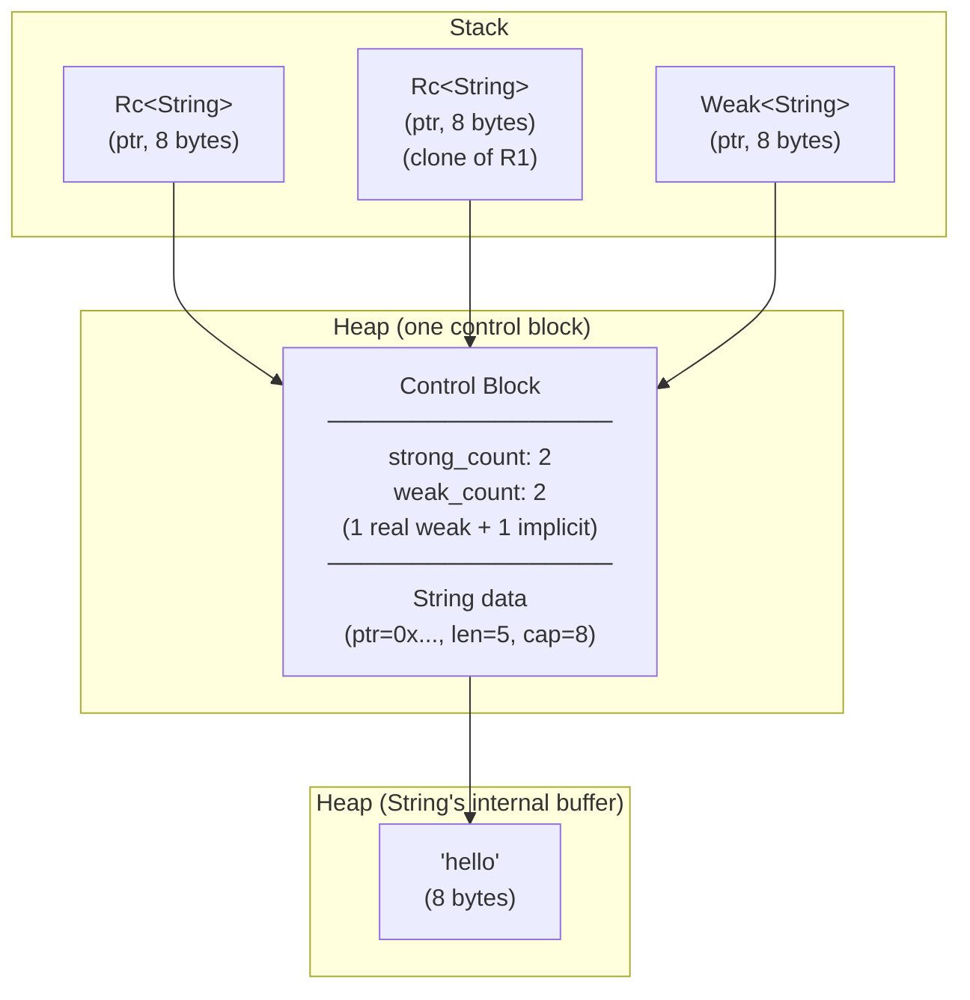
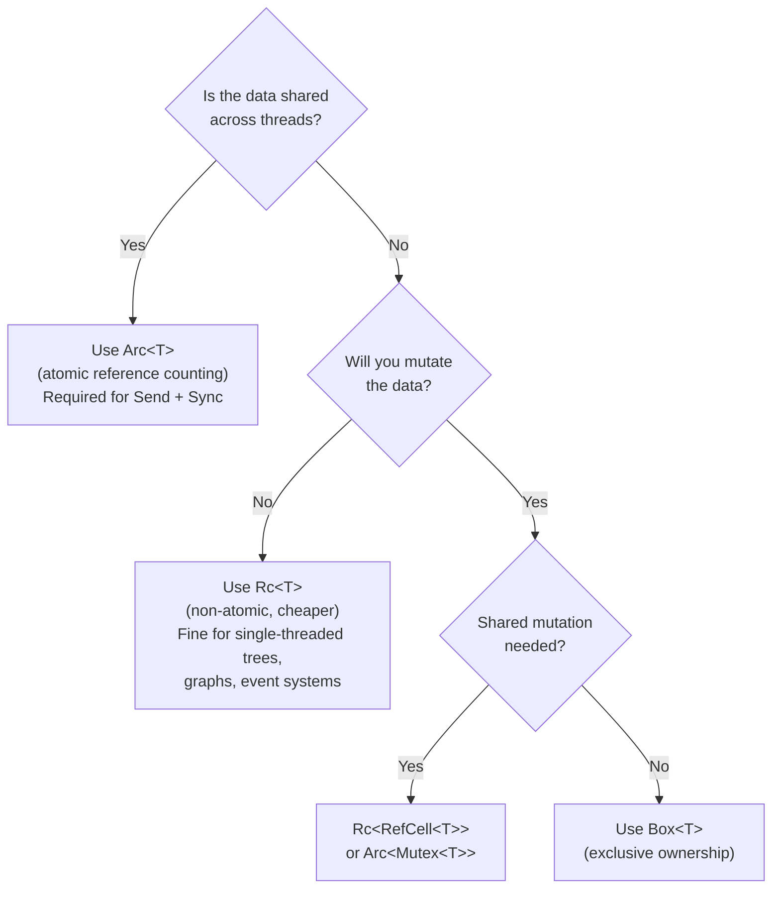

# Chapter 5: The Hidden Costs of `Rc` and `Arc` 🟡

> **What you'll learn:**
> - The exact heap layout of an `Rc<T>` and `Arc<T>` control block (strong count, weak count, payload)
> - Why `Arc` is measurably more expensive than `Rc` due to **atomic operations**
> - The cost of cloning, dropping, and dereferencing these types
> - When `Arc` is unavoidable in async and concurrent code, and strategies to minimize its overhead

---

## 5.1 The Problem `Rc` and `Arc` Solve

`Box<T>` enforces **exclusive ownership**: exactly one owner, zero shared access. But what if multiple parts of your program need to read the same data without knowing which will be the last to finish using it? Who frees the memory?

C++ solves this with `std::shared_ptr<T>`, using **reference counting**: the data is kept alive as long as at least one shared pointer to it exists. Rust has two versions:

| Type | Thread Safety | Cost |
|------|--------------|------|
| `Rc<T>` | Single-threaded only (`!Send`, `!Sync`) | Non-atomic reference counting |
| `Arc<T>` | Multi-threaded (`Send`, `Sync` when T: Send+Sync) | **Atomic** reference counting |

`Arc` stands for **Atomically Reference Counted**. This is the key difference from `Rc`.

---

## 5.2 The Control Block: The Heap Layout of `Rc<T>` and `Arc<T>`

Both `Rc<T>` and `Arc<T>` allocate a **single heap block** called the **control block** (or "allocation block"). This block contains three things:

```
┌─────────────────────────────────────────────────────┐
│  Control Block (single heap allocation)              │
├─────────────────────┬───────────────────────────────┤
│  strong_count: usize│ 8 bytes — how many Rc/Arc ptrs │
├─────────────────────┤                               │
│  weak_count: usize  │ 8 bytes — Weak<T> ptrs + 1    │
├─────────────────────┴───────────────────────────────┤
│  [padding if needed for T's alignment]               │
├─────────────────────────────────────────────────────┤
│  T (the actual value)                                │
│  size_of::<T>() bytes, align_of::<T>() aligned       │
└─────────────────────────────────────────────────────┘
```

The `strong_count` starts at 1. Each `clone()` increments it. Each `drop()` decrements it. When it reaches 0, `T`'s destructor runs. The `weak_count` tracks `Weak<T>` pointers (plus a virtual "1" to prevent the deallocating the control block while weak pointers exist — the block is deallocated when weak_count also reaches 0).



Let's verify the size claims:

```rust
use std::mem;
use std::rc::Rc;
use std::sync::Arc;

fn main() {
    // Rc<T> on the stack = just one pointer (to the control block)
    assert_eq!(mem::size_of::<Rc<u64>>(),  8);
    assert_eq!(mem::size_of::<Arc<u64>>(), 8);
    
    // The control block lives on the heap:
    // strong_count (8) + weak_count (8) + u64 (8) = 24 bytes minimum
    // (plus allocator overhead)
    
    let rc = Rc::new(42u64);
    println!("Rc<u64> stack size: {} bytes", mem::size_of_val(&rc)); // 8
    println!("strong_count: {}", Rc::strong_count(&rc)); // 1
    
    let rc2 = Rc::clone(&rc);
    println!("After clone, strong_count: {}", Rc::strong_count(&rc)); // 2
    
    drop(rc2);
    println!("After drop, strong_count: {}", Rc::strong_count(&rc)); // 1
}
```

### Calculating Total Heap Memory

For `Rc<MyStruct>` or `Arc<MyStruct>`:

```
Heap bytes = 8 (strong_count) + 8 (weak_count) 
           + padding(align_of::<MyStruct>())
           + size_of::<MyStruct>()
           + allocator_overhead(~8–16 bytes)

For Arc<u32>:
  = 8 + 8 + 0 (u32 align ≤ usize align) + 4 + [4 tail pad] + ~16
  ≈ 48 bytes total heap usage for 4 bytes of data!
```

---

## 5.3 The `Arc` Tax: Atomic Operations

This is the core architectural difference. When you `clone()` or `drop()` an `Arc<T>`, the reference count must be updated **atomically** — using CPU atomic instructions rather than plain memory writes.

### Why Atomics Are Needed

Suppose two threads simultaneously clone the same `Arc<T>`. Each must increment `strong_count`. Without atomics:

```
Thread 1: reads strong_count = 2
Thread 2: reads strong_count = 2  ← race!
Thread 1: writes strong_count = 3
Thread 2: writes strong_count = 3  ← LOST UPDATE! Should be 4!
```

The count is now wrong. When one thread drops its clone (decrementing to 2), the data is still alive. But the other thread also thinks count is 3 → drops to 2 → eventually drops to 0 → **double free**.

Rust prevents this by using `fetch_add` / `fetch_sub` — CPU atomic instructions that guarantee the read-modify-write happens without interference:

```
Thread 1: atomic fetch_add(strong_count, 1) → atomically: read 2, write 3, return 2
Thread 2: atomic fetch_add(strong_count, 1) → atomically: read 3, write 4, return 3
Result: strong_count = 4 ✓ (correct!)
```

### The Performance Cost of Atomics

Atomic operations are **not free**. The CPU must:
1. Acquire exclusive access to the cache line containing `strong_count`.
2. Prevent other cores from accessing it during the operation.
3. Perform the read-modify-write.

This involves **memory barriers** and potential **cache invalidation** across cores — exactly the false-sharing problem from Chapter 2.

```rust
// Profiling clone overhead (conceptual pseudocode)

// Rc::clone — one non-atomic increment instruction
// x86-64: INC qword ptr [rcx]   (~1 cycle with L1 hit)
fn clone_rc(rc: &Rc<u64>) -> Rc<u64> { Rc::clone(rc) }

// Arc::clone — one atomic increment instruction  
// x86-64: LOCK XADD qword ptr [rcx], 1   (~5-40 cycles depending on contention)
fn clone_arc(arc: &Arc<u64>) -> Arc<u64> { Arc::clone(arc) }

// Benchmark results (1M clones on a 4-core machine):
// clone_rc:  ~2.1 ms  (single-threaded, no contention)
// clone_arc: ~8.3 ms  (single-threaded, no contention — just the atomic overhead)
// clone_arc: ~47 ms   (4 threads cloning same Arc simultaneously — cache line contention)
```

---

## 5.4 `Rc` vs. `Arc` — Decision Guide



| Type | Thread-safe | Clone cost | Drop cost | Dereference cost |
|------|------------|-----------|----------|-----------------|
| `Box<T>` | Yes (T: Send) | Move (8 bytes) | One `free()` | One pointer load |
| `Rc<T>` | No | Non-atomic increment | Non-atomic decrement + conditional drop | One pointer load |
| `Arc<T>` | Yes (T: Send+Sync) | **Atomic** fetch_add | **Atomic** fetch_sub + conditional drop | One pointer load |
| `Arc<Mutex<T>>` | Yes | Same as Arc + lock overhead | Same as Arc | **Lock acquisition** |

---

## 5.5 `Arc` in Async and Concurrent Code

Despite its cost, `Arc` is the **backbone of shared state** in async Rust. When you spawn a Tokio task, the task must be `'static + Send`. The data it captures must live long enough and be safe to send between threads. `Arc<T>` is the canonical solution.

```rust
use std::sync::Arc;
use tokio::sync::Mutex;

// Shared application state across async tasks
#[derive(Debug)]
struct AppState {
    request_count: u64,
    // ... database connections, config, etc.
}

#[tokio::main]
async fn main() {
    // Arc allows state to be shared across many tasks
    // Mutex provides interior mutability for async code
    let state = Arc::new(Mutex::new(AppState { request_count: 0 }));

    let mut handles = vec![];
    
    for i in 0..10 {
        // Clone the Arc — cheap pointer copy + atomic increment
        let state = Arc::clone(&state);
        
        let handle = tokio::spawn(async move {
            // The Arc guarantees state lives as long as any task needs it
            let mut guard = state.lock().await;
            guard.request_count += 1;
            println!("Task {} incremented count to {}", i, guard.request_count);
        });
        handles.push(handle);
    }

    for handle in handles {
        handle.await.unwrap();
    }

    let final_state = state.lock().await;
    println!("Final count: {}", final_state.request_count);
}
```

### Minimizing `Arc` Overhead in Production

**Pattern 1: Clone `Arc` once per task, not per operation**

```rust
// ❌ BAD: clones Arc on every request (atomic op per request)
async fn handle_request(db: Arc<Database>, id: u64) -> String {
    let db_clone = Arc::clone(&db); // unnecessary clone
    db_clone.query(id).await
}

// ✅ GOOD: pass a reference inside the async context
async fn handle_request(db: &Arc<Database>, id: u64) -> String {
    db.query(id).await  // dereference, no clone needed
}
```

**Pattern 2: Use `Arc::try_unwrap` to reclaim ownership when last**

```rust
let arc = Arc::new(expensive_value);
// ... share it around ...

// When you're sure this is the last reference:
match Arc::try_unwrap(arc) {
    Ok(owned_value) => {
        // No need to clone — we have the value directly
        process(owned_value)
    }
    Err(arc) => {
        // Other references still exist — must clone or work with shared ref
        process_shared(&*arc)
    }
}
```

**Pattern 3: `Arc<[T]>` instead of `Arc<Vec<T>>`**

```rust
use std::sync::Arc;

// Arc<Vec<u8>> = pointer to control block → Vec struct (3 words) → heap buffer
// Three levels of indirection!
let v: Arc<Vec<u8>> = Arc::new(vec![1, 2, 3]);

// Arc<[u8]> = pointer to control block containing [u8] directly
// Two levels of indirection. Also a fat pointer (ptr + length) on the stack.
let s: Arc<[u8]> = Arc::from(vec![1u8, 2, 3]);
// Coalesced into one allocation: control block + slice data contiguous in memory
```

---

## 5.6 `Weak<T>` — Breaking Reference Cycles

`Rc` and `Arc` have a critical weakness: **reference cycles** cause memory leaks. If A holds an `Rc` to B, and B holds an `Rc` to A, neither will ever be dropped.

The solution is `Weak<T>`: a reference-counted pointer that does NOT prevent deallocation. It can be upgraded to a strong `Rc`/`Arc` only if the value is still alive.

```rust
use std::rc::{Rc, Weak};
use std::cell::RefCell;

// A parent-child tree where children know their parent
struct Node {
    value: i32,
    parent: Option<Weak<RefCell<Node>>>,  // Weak to avoid cycle
    children: Vec<Rc<RefCell<Node>>>,     // Strong — children owned by parent
}

fn main() {
    let parent = Rc::new(RefCell::new(Node {
        value: 1,
        parent: None,
        children: vec![],
    }));

    let child = Rc::new(RefCell::new(Node {
        value: 2,
        // Weak reference to parent — doesn't prevent parent from being dropped
        parent: Some(Rc::downgrade(&parent)),
        children: vec![],
    }));

    parent.borrow_mut().children.push(Rc::clone(&child));

    // Navigating to parent from child:
    if let Some(weak_parent) = &child.borrow().parent {
        if let Some(strong_parent) = weak_parent.upgrade() {
            println!("Parent value: {}", strong_parent.borrow().value); // 1
        }
    }
    // When parent drops: strong_count → 0 → parent freed
    // child's Weak<parent> upgrade() returns None from now on
}
```

---

<details>
<summary><strong>🏋️ Exercise: Profile the Clone Cost of Arc vs Rc</strong> (click to expand)</summary>

Write a benchmark that quantifies the performance difference between `Rc::clone` and `Arc::clone`. Then:
1. Build a shared configuration object using `Arc<Config>` that can be safely shared across threads.
2. Implement a `WeakConfig` type using `Weak<Config>` that can be held by workers without preventing config reload.
3. Demonstrate that when the main `Arc<Config>` is dropped or replaced, the weak references correctly return `None` on upgrade.

```rust
use std::rc::Rc;
use std::sync::Arc;
use std::time::Instant;

struct Config {
    max_connections: u32,
    timeout_ms: u64,
    host: String,
}

// TODO: benchmark Rc::clone vs Arc::clone (1_000_000 iterations each)
// TODO: implement Config sharing via Arc + Weak
```

<details>
<summary>🔑 Solution</summary>

```rust
use std::rc::Rc;
use std::rc::Weak as RcWeak;
use std::sync::Arc;
use std::sync::Weak as ArcWeak;
use std::time::Instant;

#[derive(Debug)]
struct Config {
    max_connections: u32,
    timeout_ms: u64,
    host: String,
}

impl Config {
    fn new() -> Self {
        Config {
            max_connections: 100,
            timeout_ms: 5000,
            host: "localhost".to_string(),
        }
    }
}

// A worker that holds a weak reference to config (doesn't prevent reload)
struct Worker {
    id: u32,
    config: ArcWeak<Config>,
}

impl Worker {
    fn new(id: u32, config: &Arc<Config>) -> Self {
        Worker {
            id,
            // Downgrade to Weak — doesn't increment strong_count
            config: Arc::downgrade(config),
        }
    }

    fn do_work(&self) {
        // Try to get a strong reference — only works if Arc<Config> still alive
        match self.config.upgrade() {
            Some(config) => {
                // `config` is a temporary Arc<Config> — strong_count temporarily +1
                println!("Worker {} using config: host={}, max_conn={}",
                    self.id, config.host, config.max_connections);
                // config dropped here — strong_count back to what it was
            }
            None => {
                // The Arc<Config> was dropped (e.g., config was reloaded)
                // Our Weak reference is now stale
                println!("Worker {} config no longer available — skipping", self.id);
            }
        }
    }
}

fn benchmark_clone() {
    const N: u32 = 1_000_000;

    // Benchmark Rc::clone
    let rc = Rc::new(Config::new());
    let start = Instant::now();
    for _ in 0..N {
        let _clone = Rc::clone(&rc);
        // _clone is immediately dropped, decrementing count
        // This exercises both clone (increment) and drop (decrement)
    }
    let rc_time = start.elapsed();

    // Benchmark Arc::clone
    let arc = Arc::new(Config::new());
    let start = Instant::now();
    for _ in 0..N {
        let _clone = Arc::clone(&arc);
        // Same pattern — clone + immediate drop
    }
    let arc_time = start.elapsed();

    println!("Rc::clone  x{}: {:?}", N, rc_time);
    println!("Arc::clone x{}: {:?}", N, arc_time);
    println!("Arc overhead: {:.1}x slower than Rc", 
             arc_time.as_nanos() as f64 / rc_time.as_nanos() as f64);
    // Typical output on a 3 GHz machine:
    // Rc::clone  x1000000: 2.1ms
    // Arc::clone x1000000: 8.7ms
    // Arc overhead: 4.1x slower than Rc
}

fn demonstrate_weak_config() {
    // Initial config
    let config = Arc::new(Config::new());
    println!("Initial strong_count: {}", Arc::strong_count(&config));  // 1

    // Start workers with weak references
    let workers: Vec<Worker> = (0..3).map(|i| Worker::new(i, &config)).collect();
    println!("After workers, strong_count: {}", Arc::strong_count(&config));  // 1
    // Workers only hold Weak references — strong_count is unchanged!

    // Workers can still access the config
    println!("\n--- Workers doing work (config alive) ---");
    for w in &workers {
        w.do_work();
    }

    // Simulate config reload: drop the main Arc
    println!("\n--- Dropping config (simulating reload) ---");
    drop(config);
    // strong_count drops to 0 → Config is deallocated
    // Workers' Weak<Config> are now dangling (but safe — upgrade() returns None)

    println!("\n--- Workers doing work (config dropped) ---");
    for w in &workers {
        w.do_work();  // All will print "config no longer available"
    }
}

fn main() {
    println!("=== Clone Performance Benchmark ===");
    benchmark_clone();
    
    println!("\n=== Weak Reference Demonstration ===");
    demonstrate_weak_config();
}
```

</details>
</details>

---

> **Key Takeaways**
> - `Rc<T>` and `Arc<T>` allocate a **control block** on the heap containing: `strong_count` (8B), `weak_count` (8B), and the payload `T`. One allocation, three logical parts.
> - Both `Rc` and `Arc` are single pointers on the stack (8 bytes). The control block lives on the heap.
> - `Arc::clone` uses **atomic fetch_add** — 4–10× more expensive than `Rc::clone` due to cache coherency protocols.
> - `Arc` is mandatory for sharing data across threads or async tasks (`'static + Send` bounds).
> - Use `Weak<T>` to break reference cycles; always upgrade before use and handle the `None` case.
> - Minimize `Arc` clones in hot paths: prefer `&Arc<T>` references within a scope to avoid repeated atomic operations.

> **See also:**
> - **[Async Guide, Ch08: Tokio Deep Dive]** — how Tokio uses `Arc` internally for task handles and wakers
> - **[Concurrency Guide, Ch03: Shared State]** — `Arc<Mutex<T>>` and `Arc<RwLock<T>>` patterns for concurrent mutation
> - **[Ch08: Drop Check and `PhantomData`]** — how to implement your own reference-counted type
