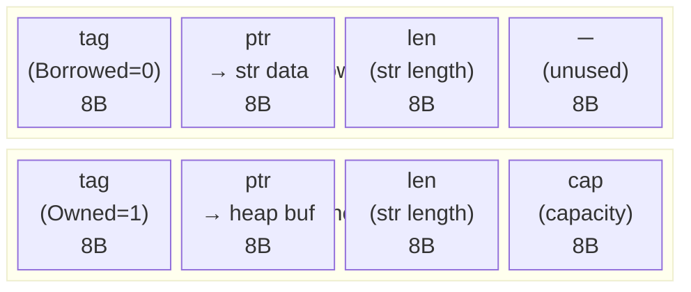

# Chapter 6: `Cow` (Clone-on-Write) 🟡

> **What you'll learn:**
> - What `Cow<'a, B>` is: a smart enum that avoids cloning until mutation is required
> - The exact memory representation of `Cow::Borrowed` vs. `Cow::Owned`
> - The canonical use case: string sanitization where 99% of inputs don't need modification
> - How `Cow` eliminates unnecessary heap allocations in API design

---

## 6.1 The Problem: The Allocation You Didn't Need

Consider a common pattern: a function that sanitizes a string — converting non-ASCII characters to their HTML-escaped equivalents. Most real-world strings contain no special characters. Yet a naive implementation allocates a new `String` for every input:

```rust
// ❌ Allocates even when no changes are needed
fn sanitize_html_naive(input: &str) -> String {
    let mut output = String::with_capacity(input.len());
    for ch in input.chars() {
        match ch {
            '<'  => output.push_str("&lt;"),
            '>'  => output.push_str("&gt;"),
            '&'  => output.push_str("&amp;"),
            '"'  => output.push_str("&quot;"),
            '\'' => output.push_str("&#39;"),
            c    => output.push(c),
        }
    }
    output  // Always allocates! Even for "hello world" (no special chars).
}
```

In production, if 99% of strings contain no HTML special characters, we're paying for a heap allocation + memcopy on every call. For a web server processing thousands of requests per second, this adds up.

What we *want* is: return the original `&str` without any allocation if no changes are needed, but return an owned `String` if mutation was required. This is exactly what `Cow` provides.

---

## 6.2 What `Cow<'a, B>` Is

`Cow` lives in `std::borrow` and is defined as an enum:

```rust
// Simplified (actual definition uses the Borrow trait)
pub enum Cow<'a, B: ?Sized + 'a>
where
    B: ToOwned,
{
    /// A borrowed reference to the data — NO allocation
    Borrowed(&'a B),
    
    /// An owned copy of the data — allocated when mutation was needed
    Owned(<B as ToOwned>::Owned),
}
```

The type parameter `B` is the "borrowed form" type. For strings:
- `B = str` → `Cow<'a, str>` → either `&'a str` (borrowed) or `String` (owned)
- `B = [u8]` → `Cow<'a, [u8]>` → either `&'a [u8]` (borrowed) or `Vec<u8>` (owned)
- `B = Path` → `Cow<'a, Path>` → either `&'a Path` or `PathBuf`

---

## 6.3 Memory Layout of `Cow<'a, str>`

Let's look at the actual byte-level representation:

```rust
use std::mem;
use std::borrow::Cow;

fn main() {
    // On a 64-bit system:
    // &str = (ptr: 8 bytes, len: 8 bytes) = 16 bytes
    // String = (ptr: 8, len: 8, cap: 8) = 24 bytes
    
    println!("&str size:  {} bytes", mem::size_of::<&str>());    // 16
    println!("String size: {} bytes", mem::size_of::<String>()); // 24
    println!("Cow<str> size: {} bytes", mem::size_of::<Cow<str>>()); // ?
}
```

`Cow<'_, str>` is an enum with two variants. The enum's size = max(variant sizes) + discriminant (tag), aligned appropriately:

```
Cow::Borrowed(&str):   [tag: 8B] [ptr: 8B] [len: 8B]        = 24 bytes
Cow::Owned(String):    [tag: 8B] [ptr: 8B] [len: 8B] [cap: 8B] = 32 bytes

But the enum must accommodate the largest variant:
Cow<'_, str> size = 32 bytes (Owned variant wins)
```

Actually, the Rust enum layout is smarter. The `Owned` variant has a cap field that's never zero (a String always has capacity ≥ 1 when non-empty). The compiler can use a trick: a zero capacity signals "this is Borrowed" (since `&str` doesn't have a capacity field). But in practice, the safe representation uses a discriminant.



In both cases: `size_of::<Cow<str>>() = 32 bytes`. No small discriminant optimization here — the full String representation is needed for the Owned variant.

---

## 6.4 Using `Cow` in Practice

### The Sanitizer, Rewritten

```rust
use std::borrow::Cow;

// ✅ Returns a borrowed &str when no changes needed (zero allocation)
//    Returns an owned String when changes were made (one allocation, proportional to output)
fn sanitize_html(input: &str) -> Cow<str> {
    // Scan for any special characters first
    let needs_change = input.chars().any(|c| matches!(c, '<' | '>' | '&' | '"' | '\''));
    
    if !needs_change {
        // The common case: return the input unchanged, zero allocation
        return Cow::Borrowed(input);
    }
    
    // Only reach here if we actually need to allocate
    let mut output = String::with_capacity(input.len() + 16);
    for ch in input.chars() {
        match ch {
            '<'  => output.push_str("&lt;"),
            '>'  => output.push_str("&gt;"),
            '&'  => output.push_str("&amp;"),
            '"'  => output.push_str("&quot;"),
            '\'' => output.push_str("&#39;"),
            c    => output.push(c),
        }
    }
    Cow::Owned(output)
}

fn main() {
    let clean = sanitize_html("Hello, world!");      // Cow::Borrowed — no alloc
    let dirty = sanitize_html("Hello <b>world</b>"); // Cow::Owned — one alloc
    
    // Both work identically as &str via Deref:
    println!("{}", clean.len());  // 13
    println!("{}", dirty.len());  // 23

    // Check which variant we got:
    match clean {
        Cow::Borrowed(_) => println!("clean: borrowed (no allocation)"),
        Cow::Owned(_)    => println!("clean: owned (allocated)"),
    }
    match dirty {
        Cow::Borrowed(_) => println!("dirty: borrowed (no allocation)"),
        Cow::Owned(_)    => println!("dirty: owned (allocated)"),
    }
}
```

Output:
```
13
23
clean: borrowed (no allocation)
dirty: owned (allocated)
```

### The `to_mut()` Method: Lazy Cloning

`Cow` provides `to_mut() -> &mut <B as ToOwned>::Owned` which clones **on first mutation** and returns `&mut Owned`:

```rust
use std::borrow::Cow;

fn ensure_capitalized(mut s: Cow<str>) -> Cow<str> {
    // Check if already capitalized — if so, return borrowed without allocating
    if s.starts_with(|c: char| c.is_uppercase()) {
        return s;
    }
    
    // to_mut() clones to String only here, only if needed
    // If s was already Owned, no clone happens — we just get &mut String directly
    let owned = s.to_mut();
    let first = owned.remove(0);
    owned.insert(0, first.to_uppercase().next().unwrap());
    s  // Now Cow::Owned
}

fn main() {
    let already_good = Cow::Borrowed("Hello");
    let result = ensure_capitalized(already_good);
    println!("{:?}", result);  // Borrowed("Hello") — no allocation!
    
    let needs_fix = Cow::Borrowed("hello");
    let result = ensure_capitalized(needs_fix);
    println!("{:?}", result);  // Owned("Hello") — one allocation
}
```

---

## 6.5 `Cow` in Standard Library and Popular Crates

`Cow` appears throughout the Rust ecosystem for this exact optimization:

| API | Type | Reason |
|-----|------|--------|
| `std::path::Path::to_string_lossy()` | `Cow<'_, str>` | Returns borrowed &str if valid UTF-8, owned String if lossy conversion needed |
| `std::string::String::from_utf8_lossy()` | `Cow<'_, str>` | Same pattern for byte slices |
| `serde` deserialization | `Cow<'a, str>` | Borrow from deserializer buffer if possible, allocate only if escaping needed |
| `regex` crate `.replace()` | `Cow<'_, str>` | Returns original if no match, new String if replaced |

```rust
use std::path::Path;

fn main() {
    let path = Path::new("/home/user/file.txt");
    
    // Returns Cow::Borrowed if path is valid UTF-8 (common case)
    let display = path.to_string_lossy();
    
    match display {
        std::borrow::Cow::Borrowed(s) => println!("Borrowed: {}", s),
        std::borrow::Cow::Owned(s)    => println!("Allocated: {}", s),
    }
    // Output: Borrowed: /home/user/file.txt  ← zero allocation!
}
```

---

## 6.6 `Cow` for Configuration and Error Messages

A powerful pattern: use `Cow<'static, str>` in error types to carry either static string literals (no allocation) or dynamically constructed messages (allocated):

```rust
use std::borrow::Cow;
use std::fmt;

#[derive(Debug)]
pub struct ParseError {
    // Static messages: no allocation ("expected integer")
    // Dynamic messages: one allocation ("expected integer, got 'foo' at line 42")
    message: Cow<'static, str>,
}

impl ParseError {
    // Zero-cost: takes a &'static str, wraps it borrowed
    pub fn static_msg(msg: &'static str) -> Self {
        ParseError { message: Cow::Borrowed(msg) }
    }
    
    // Allocates only when a formatted message is needed
    pub fn dynamic_msg(msg: String) -> Self {
        ParseError { message: Cow::Owned(msg) }
    }
    
    pub fn at_line(line: u32, expected: &'static str, got: &str) -> Self {
        ParseError {
            message: Cow::Owned(
                format!("line {}: expected {}, got '{}'", line, expected, got)
            ),
        }
    }
}

impl fmt::Display for ParseError {
    fn fmt(&self, f: &mut fmt::Formatter<'_>) -> fmt::Result {
        f.write_str(&self.message)
    }
}

fn main() {
    let e1 = ParseError::static_msg("unexpected end of input");
    let e2 = ParseError::at_line(42, "integer", "banana");
    
    println!("{}", e1);  // no allocation for e1
    println!("{}", e2);  // allocated "line 42: expected integer, got 'banana'"
}
```

---

<details>
<summary><strong>🏋️ Exercise: Build an Allocation-Efficient URL Normalizer</strong> (click to expand)</summary>

URLs in a web crawler often arrive in formats that may or may not need normalization (lowercasing the scheme, removing trailing slashes, etc.). Build a `normalize_url` function that:

1. Returns `Cow::Borrowed` when the URL is already normalized.
2. Returns `Cow::Owned` only when actual changes are made.
3. Handles: lowercase scheme (`HTTP://` → `http://`), removes trailing slash from path, removes default ports (`:80` for http, `:443` for https).
4. Write a test that verifies the borrowed/owned variants are returned correctly.

```rust
use std::borrow::Cow;

fn normalize_url(url: &str) -> Cow<str> {
    // TODO: implement
    todo!()
}

#[cfg(test)]
mod tests {
    use super::*;
    use std::borrow::Cow;
    
    #[test]
    fn already_normalized_returns_borrowed() {
        // TODO
    }
    
    #[test]
    fn uppercase_scheme_returns_owned() {
        // TODO
    }
}
```

<details>
<summary>🔑 Solution</summary>

```rust
use std::borrow::Cow;

/// Normalizes a URL, returning a borrowed reference when no changes are needed.
/// 
/// Normalization rules applied:
/// 1. Lowercase the scheme (e.g., HTTP:// → http://)
/// 2. Remove trailing slashes from the path
/// 3. Remove default ports (:80 for http, :443 for https)
pub fn normalize_url(url: &str) -> Cow<str> {
    // --- Step 1: Check if scheme is already lowercase ---
    // Find the scheme separator ://
    let scheme_end = match url.find("://") {
        Some(pos) => pos,
        None => return Cow::Borrowed(url), // Not a URL we can normalize
    };
    
    let scheme = &url[..scheme_end];
    let rest = &url[scheme_end..]; // includes "://"
    
    let needs_lowercase_scheme = scheme.chars().any(|c| c.is_uppercase());
    
    // --- Step 2: Check for trailing slash ---
    // A trailing slash on the path that isn't just "http://host/"
    let has_trailing_slash = url.ends_with('/') && url.len() > scheme_end + 3;
    
    // --- Step 3: Check for default ports ---
    let has_default_port = 
        (scheme.eq_ignore_ascii_case("http")  && rest.contains(":80/"))  ||
        (scheme.eq_ignore_ascii_case("http")  && rest.ends_with(":80"))   ||
        (scheme.eq_ignore_ascii_case("https") && rest.contains(":443/")) ||
        (scheme.eq_ignore_ascii_case("https") && rest.ends_with(":443"));
    
    // Fast path: nothing to change → return borrowed, zero allocation
    if !needs_lowercase_scheme && !has_trailing_slash && !has_default_port {
        return Cow::Borrowed(url);
    }
    
    // Slow path: build a new, normalized URL
    let mut normalized = String::with_capacity(url.len());
    
    // Step 1: Write lowercase scheme
    normalized.push_str(&scheme.to_lowercase());
    normalized.push_str("://");
    
    // Get everything after "://"
    let after_scheme = &url[scheme_end + 3..];
    
    // Step 3: Remove default ports
    let after_scheme = if needs_lowercase_scheme {
        Cow::Borrowed(after_scheme) // Keep full analysis but scheme lowercased above
    } else {
        Cow::Borrowed(after_scheme)
    };
    
    // Do port removal on the rest
    let lower_scheme = scheme.to_lowercase();
    let mut rest_str = after_scheme.to_string();
    
    if lower_scheme == "http" {
        rest_str = rest_str.replace(":80/", "/");
        if rest_str.ends_with(":80") {
            rest_str.truncate(rest_str.len() - 3);
        }
    } else if lower_scheme == "https" {
        rest_str = rest_str.replace(":443/", "/");
        if rest_str.ends_with(":443") {
            rest_str.truncate(rest_str.len() - 4);
        }
    }
    
    // Step 2: Remove trailing slash (but not if path is just "/")
    if rest_str.ends_with('/') && rest_str.len() > 1 {
        rest_str.pop();
    }
    
    normalized.push_str(&rest_str);
    
    Cow::Owned(normalized)
}

#[cfg(test)]
mod tests {
    use super::*;
    use std::borrow::Cow;

    #[test]
    fn already_normalized_returns_borrowed() {
        let url = "https://example.com/path";
        let result = normalize_url(url);
        // Same pointer (borrowed from original)
        assert!(matches!(result, Cow::Borrowed(_)));
        assert_eq!(result, "https://example.com/path");
    }

    #[test]
    fn uppercase_scheme_returns_owned() {
        let result = normalize_url("HTTPS://example.com/path");
        assert!(matches!(result, Cow::Owned(_)));
        assert_eq!(result, "https://example.com/path");
    }

    #[test]
    fn trailing_slash_removed() {
        let result = normalize_url("https://example.com/path/");
        assert!(matches!(result, Cow::Owned(_)));
        assert_eq!(result, "https://example.com/path");
    }

    #[test]
    fn default_http_port_removed() {
        let result = normalize_url("http://example.com:80/path");
        assert!(matches!(result, Cow::Owned(_)));
        assert_eq!(result, "http://example.com/path");
    }

    #[test]
    fn default_https_port_removed() {
        let result = normalize_url("https://example.com:443/path");
        assert!(matches!(result, Cow::Owned(_)));
        assert_eq!(result, "https://example.com/path");
    }

    #[test]
    fn non_default_port_preserved() {
        let url = "https://example.com:8443/path";
        let result = normalize_url(url);
        assert!(matches!(result, Cow::Borrowed(_))); // Nothing to change
        assert_eq!(result, url);
    }
}

fn main() {
    let urls = [
        "https://example.com/path",         // Already good → Borrowed
        "HTTP://Example.com/path/",         // Uppercase + trailing slash → Owned
        "http://example.com:80/api",        // Default port → Owned
    ];
    
    for url in &urls {
        let normalized = normalize_url(url);
        let kind = match &normalized {
            Cow::Borrowed(_) => "Borrowed (no alloc)",
            Cow::Owned(_)    => "Owned    (allocated)",
        };
        println!("[{}] {} => {}", kind, url, normalized);
    }
}
```

</details>
</details>

---

> **Key Takeaways**
> - `Cow<'a, B>` is a "lazy clone" enum: it holds either a borrowed reference (`&B`) or an owned value (`B::Owned`).
> - Use `Cow` when a function *might* need to modify data but often won't — returning the original without allocating in the common case.
> - `Cow::Borrowed` costs zero additional heap memory; `Cow::Owned` allocates exactly once when mutation is needed.
> - The canonical use cases: string sanitization/normalization, regex replacement, UTF-8 lossless conversion, error messages.
> - `Cow<'static, str>` in error types gives you the best of both worlds: free static string literals AND dynamic messages with zero code duplication.
> - The `to_mut()` method triggers cloning lazily — if the `Cow` is already `Owned`, no clone occurs.

> **See also:**
> - **[Ch04: `Box<T>` and the Allocator]** — understanding when any heap allocation occurs
> - **[Ch05: The Hidden Costs of `Rc` and `Arc`]** — other strategies for sharing data without cloning
> - **[Type System Guide, Ch10: Traits]** — the `Borrow` and `ToOwned` traits that power `Cow`
