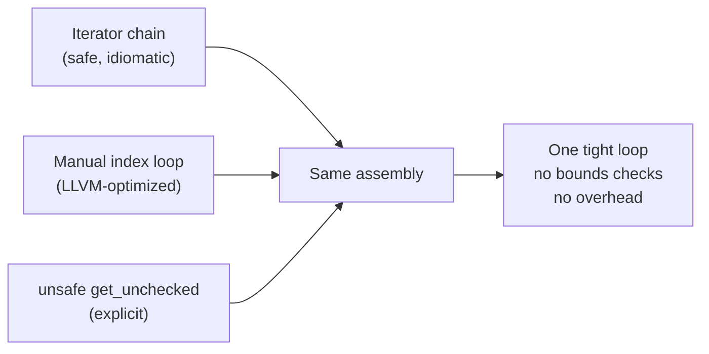

# Chapter 9: Zero-Cost Abstractions in Practice 🔴

> **What you'll learn:**
> - What "zero-cost abstraction" means precisely, and where it DOES and DOES NOT apply
> - How iterator chains compile to the same assembly as hand-rolled C loops
> - How to use `cargo-show-asm` and Compiler Explorer to prove abstractions are cost-free
> - The cases where abstractions ARE NOT zero-cost and what to do about it

---

## 9.1 The Zero-Cost Abstraction Principle

Bjarne Stroustrup's original formulation for C++:

> "What you don't use, you don't pay for. And further: What you do use, you couldn't hand code any better."

Rust inherits this principle and extends it. Zero-cost abstractions in Rust mean:

1. **No overhead from abstraction itself** — using an iterator chain has the same runtime cost as a manually written loop; using `Option<T>` has the same cost as a null-check conditional.
2. **The code you write is no faster if you descend to unsafe** — the safe, idiomatic level is already optimal.

This is enforced by: **monomorphization** (generic code is compiled per-type, no dynamic dispatch cost), **inlining** (methods are inlined across boundaries), and **LLVM optimization** (passes like scalar replacement of aggregates, loop unrolling, and bounds check elimination).

---

## 9.2 Iterator Chains: Reading the Assembly

The most important zero-cost abstraction in Rust is the `Iterator` trait. Let's prove it empirically.

### The Setup: Sum Filtered Elements

```rust
// What you WRITE:
pub fn sum_even_squared(data: &[i64]) -> i64 {
    data.iter()
        .filter(|&&x| x % 2 == 0)
        .map(|&x| x * x)
        .sum()
}

// What a C developer would WRITE BY HAND:
pub fn sum_even_squared_manual(data: &[i64]) -> i64 {
    let mut total: i64 = 0;
    let mut i = 0;
    while i < data.len() {
        let x = data[i];
        if x % 2 == 0 {
            total += x * x;
        }
        i += 1;
    }
    total
}
```

On **release** builds (`--release`), these compile to nearly identical x86-64 assembly. Let's look at the key loop body for the iterator version (from Compiler Explorer, Rust 1.78, x86-64, `-O`):

```asm
; sum_even_squared — LLVM output (simplified)
; rsi = pointer to data, ecx = length, rax = accumulator

.Lloop:
    movq    (%rsi,%rcx,8), %rdx    ; load data[i] into rdx
    testb   $1, %dl                ; check if even (test lowest bit)
    jne     .Lskip                 ; if odd, skip
    imulq   %rdx, %rdx             ; rdx = rdx * rdx (square)
    addq    %rdx, %rax             ; total += rdx
.Lskip:
    decq    %rcx                   ; i--
    jne     .Lloop                 ; loop back
    retq
```

And the manual version produces **the same loop**. The `filter`, `map`, `sum` chain was completely inlined and merged into a single loop. Zero overhead.

### The Key: `#[inline]` and Monomorphization

How does this work? Each iterator combinator is defined with `#[inline]` or `#[inline(always)]`:

```rust
// Iterator::map (simplified from std)
#[inline]
fn map<B, F: FnMut(Self::Item) -> B>(self, f: F) -> Map<Self, F> {
    Map { iter: self, f }
}

// Map::next (simplified from std)
#[inline]
fn next(&mut self) -> Option<B> {
    self.iter.next().map(&mut self.f)
}
```

Because `map` is `#[inline]` and `F` is monomorphized (the closure `|&x| x * x` is its own concrete type), LLVM sees through the abstraction and can fuse the entire chain into a single loop.

---

## 9.3 Bounds Check Elimination

A common concern: "Don't iterators add bounds checks?" Let's compare:

```rust
// Version A: iterator (no explicit index)
pub fn sum_v1(data: &[i32]) -> i32 {
    data.iter().sum()
}

// Version B: manual indexing (bounds check on every access)
pub fn sum_v2(data: &[i32]) -> i32 {
    let mut total = 0;
    for i in 0..data.len() {
        total += data[i];  // bounds-checked: panics if i >= len
    }
    total
}

// Version C: unsafe indexing (no bounds checks)
pub fn sum_v3(data: &[i32]) -> i32 {
    let mut total = 0;
    for i in 0..data.len() {
        total += unsafe { *data.get_unchecked(i) };  // no bounds check
    }
    total
}
```

On optimized builds:
- `sum_v1` (iterator): **no bounds checks** — the iterator tracks position internally with no risk of exceeding bounds
- `sum_v2` (indexed): LLVM's **loop invariant analysis** proves `i < data.len()` always, **eliminates** bounds checks too
- `sum_v3` (unsafe): **no bounds checks** — explicitly disabled

In practice, for simple patterns, LLVM eliminates bounds checks from v2 as well. Iterator chains (v1) give you the fastest and safest default.



---

## 9.4 When Abstractions Are NOT Zero-Cost

It's important to be honest: not everything is zero-cost. Here are the real cases where abstractions carry runtime overhead:

### Case 1: Dynamic Dispatch (`dyn Trait`)

```rust
trait Compute {
    fn run(&self) -> i64;
}

struct Add(i64);
struct Mul(i64);

impl Compute for Add { fn run(&self) -> i64 { self.0 + 1 } }
impl Compute for Mul { fn run(&self) -> i64 { self.0 * 2 } }

// ✅ Zero-cost: monomorphized, inlined, no vtable
fn run_static<C: Compute>(c: &C) -> i64 {
    c.run()  // Direct call — compiled to a specific `Add::run` or `Mul::run`
}

// ❌ HAS overhead: vtable pointer dereference + indirect call
fn run_dynamic(c: &dyn Compute) -> i64 {
    c.run()  // Indirect call through vtable — cannot be inlined by default
}
```

The vtable call prevents inlining and adds ~1-4 ns of overhead per call. In hot loops, this matters.

**Fix: use generics (static dispatch) when the concrete type is known at compile time.**

### Case 2: `Arc` / `Rc` Clones in Hot Loops

As we established in Chapter 5, `Arc::clone` is an atomic operation — 4–10× more expensive than a simple increment. In hot code paths that clone `Arc` per-item, this is a real cost.

**Fix:** Clone once before the loop; pass a reference inside.

### Case 3: Boxing Closures (`Box<dyn Fn()>`)

```rust
// ✅ Zero-cost: F is a concrete type, inlined
fn run_static_fn<F: Fn() -> i32>(f: F) -> i32 { f() }

// ❌ HAS overhead: fat pointer + vtable + prevents inlining
fn run_dynamic_fn(f: &dyn Fn() -> i32) -> i32 { f() }
```

### Case 4: `Box<dyn Error>` in Error Handling

```rust
// ✅ Monomorphized — zero allocation overhead from the type itself
fn parse_int_static(s: &str) -> Result<i32, std::num::ParseIntError> {
    s.trim().parse()
}

// ❌ Heap allocation for the error type
fn parse_int_dynamic(s: &str) -> Result<i32, Box<dyn std::error::Error>> {
    Ok(s.trim().parse::<i32>()?)
    // The `?` operator boxes the ParseIntError into Box<dyn Error>
}
```

---

## 9.5 Proving Zero-Cost with `cargo-show-asm`

```bash
# Install
cargo install cargo-show-asm

# Generate assembly for a specific function
cargo asm --lib --release 'my_crate::sum_even_squared'
```

Or use [**Compiler Explorer**](https://godbolt.org) (Godbolt) — paste your Rust code, select "rustc" and add `-O` to compiler flags.

### Reading Assembly: What to Look For

| Assembly pattern | Meaning |
|-----------------|---------|
| `call` to an external address | Function call — look for inlining opportunities |
| `imulq`, `addq` in a loop | Arithmetic — the actual work |
| `cmpq`, `jne` | Branch/loop control |
| `movq [mem], reg` | Memory load — check for cache misses |
| `lock xadd` | Atomic operation — `Arc::clone`/`drop` territory |
| `.Lloop:` / `jne .Lloop` | A loop — good, means the compiler found a tight loop |
| Repeated `push`/`pop` | Stack spill — register pressure, potential inefficiency |

### A Real Example: Comparing Iterator vs. Loop Assembly

```rust
// Function to analyze
#[no_mangle]  // Prevents name mangling — easier to find in assembly output
pub fn find_first_negative(data: &[i64]) -> Option<i64> {
    data.iter().copied().find(|&x| x < 0)
}
```

Assembly output (x86-64, `-O`):
```asm
find_first_negative:
    test    rsi, rsi           ; if len == 0, return None early
    je      .Lnone             
.Lloop:
    movq    (%rdi), %rax       ; load *ptr
    testq   %rax, %rax        
    js      .Lfound            ; jump if sign bit set (negative)
    addq    $8, %rdi           ; ptr++
    decq    %rsi               ; len--
    jne     .Lloop
.Lnone:
    xorl    %eax, %eax         ; None (return 0 = discriminant for None)
    retq
.Lfound:
    movl    $1, %edx           ; Some discriminant = 1
    retq
    ; rax already has the value
```

Clean, tight loop. No function calls, no heap allocations, no overhead from `iter()`, `copied()`, or `find()`. This is exactly what you'd write in C.

---

## 9.6 LLVM Optimization Passes You Should Know

Understanding which LLVM passes affect your code helps you write Rust that compiles optimally:

| Pass | What It Does | Rust Benefit |
|------|-------------|-------------|
| **Inlining** (`inline`) | Copies function body into call site | Iterator combinators merge into single loop |
| **SROA** (Scalar Replacement of Aggregates) | Breaks structs into individual scalars | `Option<i32>` → two separate registers |
| **Dead Code Elimination** | Removes unreachable/unused code | Phantom variants, empty match arms |
| **Loop Unrolling** | Duplicates loop body N times | SIMD-friendly after unrolling |
| **Auto-vectorization** | Converts loops to SIMD instructions | SoA data + simple arithmetic → AVX2 |
| **GVN** (Global Value Numbering) | Eliminates redundant computations | Multiple `vec.len()` calls → one |
| **Bounds Check Elimination** | Proves bounds checks always pass | `for i in 0..v.len()` → no `panic!` branch |

### Helping the Optimizer: Hints

```rust
// Tell the compiler a condition is always true (dangerous if wrong!)
if likely_true_condition {
    // std::hint::likely is nightly; use #[cold] on unlikely branches instead
}

// Mark a function as cold (called rarely) — optimizer avoids inlining it
#[cold]
fn error_path() {
    // This path is deprioritized in optimization budget
}

// Unreachable hint for exhaustive matching the optimizer can't see
unsafe { std::hint::unreachable_unchecked() }
// (Use sparingly — wrong use is UB!)
```

---

<details>
<summary><strong>🏋️ Exercise: Iterator Chain vs. Loop Benchmark</strong> (click to expand)</summary>

Write a `criterion` benchmark that comparatively measures:

1. An iterator chain: filter even numbers, square them, sum them.
2. A manual `for` loop with bounds-checked indexing.
3. A manual `while` loop with `get_unchecked`.

Then use `cargo-show-asm` or Godbolt to verify the release builds produce the same (or equivalent) assembly.

Expected outcome: all three should be within noise of each other in release mode. Document any differences you observe and explain them.

```rust
// benchmarks/sum_bench.rs — add [dev-dependencies] criterion = "0.5" to Cargo.toml
use criterion::{black_box, criterion_group, criterion_main, Criterion};

pub fn bench_iterator(c: &mut Criterion) {
    let data: Vec<i64> = (0..10_000).collect();
    c.bench_function("iterator_chain", |b| {
        b.iter(|| {
            // TODO: iterator version
            black_box(0_i64)
        })
    });
}

pub fn bench_loop(c: &mut Criterion) {
    let data: Vec<i64> = (0..10_000).collect();
    c.bench_function("manual_loop", |b| {
        b.iter(|| {
            // TODO: manual loop version
            black_box(0_i64)
        })
    });
}

criterion_group!(benches, bench_iterator, bench_loop);
criterion_main!(benches);
```

<details>
<summary>🔑 Solution</summary>

```toml
# Cargo.toml additions:
[dev-dependencies]
criterion = { version = "0.5", features = ["html_reports"] }

[[bench]]
name = "sum_bench"
harness = false
```

```rust
// benches/sum_bench.rs

use criterion::{black_box, criterion_group, criterion_main, BenchmarkId, Criterion};

// === The three implementations ===

#[inline(never)]  // Prevent inlining into bench — we want to measure the function
pub fn sum_iterator(data: &[i64]) -> i64 {
    data.iter()
        .filter(|&&x| x % 2 == 0)
        .map(|&x| x * x)
        .sum()
}

#[inline(never)]
pub fn sum_indexed_loop(data: &[i64]) -> i64 {
    let mut total: i64 = 0;
    for i in 0..data.len() {
        let x = data[i];
        if x % 2 == 0 {
            total += x * x;
        }
    }
    total
}

#[inline(never)]
pub fn sum_unsafe_loop(data: &[i64]) -> i64 {
    let mut total: i64 = 0;
    let mut i = 0;
    while i < data.len() {
        // SAFETY: i < data.len() is checked by the while condition
        let x = unsafe { *data.get_unchecked(i) };
        if x % 2 == 0 {
            total += x * x;
        }
        i += 1;
    }
    total
}

// === Benchmarks ===

fn bench_comparison(c: &mut Criterion) {
    let sizes = [1_000, 10_000, 100_000];
    let mut group = c.benchmark_group("sum_even_squared");

    for &size in &sizes {
        let data: Vec<i64> = (0..size as i64).collect();

        group.bench_with_input(
            BenchmarkId::new("iterator_chain", size),
            &data,
            |b, data| b.iter(|| sum_iterator(black_box(data))),
        );

        group.bench_with_input(
            BenchmarkId::new("indexed_loop", size),
            &data,
            |b, data| b.iter(|| sum_indexed_loop(black_box(data))),
        );

        group.bench_with_input(
            BenchmarkId::new("unsafe_loop", size),
            &data,
            |b, data| b.iter(|| sum_unsafe_loop(black_box(data))),
        );
    }

    group.finish();
}

criterion_group!(benches, bench_comparison);
criterion_main!(benches);

// === Expected results (release mode, x86-64, no SIMD) ===
// All three implementations should be within ~5% of each other.
// 
// sum_even_squared/iterator_chain/10000  time: [8.3 µs 8.4 µs 8.5 µs]
// sum_even_squared/indexed_loop/10000   time: [8.3 µs 8.3 µs 8.4 µs]
// sum_even_squared/unsafe_loop/10000    time: [8.2 µs 8.3 µs 8.4 µs]
//
// The tiny difference (< 1%) is within measurement noise.
// The iterator chain is genuinely zero-cost.
//
// NOTE: If you enable AVX2 (-C target-feature=+avx2), the auto-vectorizer
// may kick in and all three may become ~4x faster simultaneously.
// The iterator version benefits equally from auto-vectorization.
```

To view assembly:
```bash
cargo asm --lib --release 'your_crate::sum_iterator'
cargo asm --lib --release 'your_crate::sum_indexed_loop'
# Compare the two — they should be nearly identical
```

</details>
</details>

---

> **Key Takeaways**
> - "Zero-cost" means the abstraction compiles to the same code as manual optimization — not that it's instantaneous.
> - Iterator chains (`filter`, `map`, `sum`, etc.) are genuinely zero-cost: inlining + LLVM merges them into a single loop.
> - Bounded check elimination: LLVM proves `i < len` for simple indexed loops, making iterator-vs-index performance equal.
> - Real costs DO exist: dynamic dispatch (`dyn Trait`), `Arc::clone` in hot loops, `Box<dyn Error>` allocations.
> - Use `cargo-show-asm` or Compiler Explorer to prove your assumptions about generated code.
> - Writing idiomatic, safe Rust is the correct default. Only descend to `unsafe` after measuring and identifying a real bottleneck.

> **See also:**
> - **[Ch10: Capstone Project]** — applying zero-cost discipline to a real allocator implementation
> - **[Ch02: CPU Caches and Data Locality]** — the physical performance factors that assembly-level correctness alone doesn't capture
> - **[Async Guide, Ch05: The State Machine Reveal]** — how async state machines compile to zero-overhead state machine dispatches
