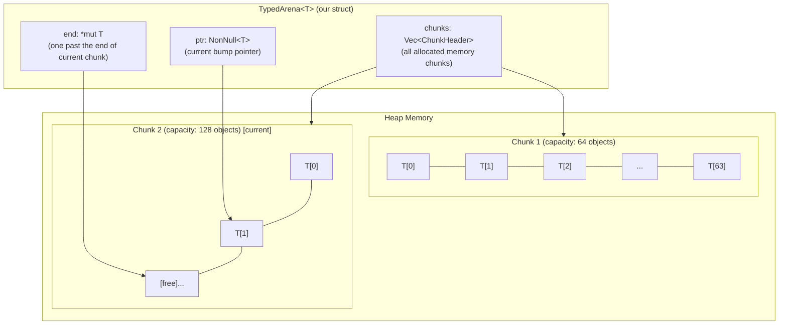

# Chapter 10: Capstone Project — A Typed Arena Allocator 🔴

> **What you'll learn:**
> - How to design and implement a production-quality **typed arena allocator** from first principles
> - Why arena allocation can be dramatically faster than `Box`-per-object allocation
> - How to use raw pointers, `NonNull`, `PhantomData`, and manual alignment to implement a custom allocator
> - The exact trade-offs of arena allocation: speed vs. flexibility, lifetime simplicity vs. fragmentation

---

## 10.1 The Problem: Per-Object `Box` Allocations Are Expensive

Consider a compiler, a game engine, or a query planner that creates thousands of small objects during a processing phase — AST nodes, entity components, temporary results — and then discards all of them at once when the phase completes.

Using `Box::new()` for each object:
1. **Calls the global allocator** once per object (expensive: mutex acquisition, free list search, pointer bookkeeping)
2. **Scatters objects** across heap memory (terrible cache locality — each `Box::new()` may land at a random address)
3. **Requires individual drops** — to free N objects, N `dealloc()` calls are made

An arena allocator inverts all three problems:
1. Call the allocator **once** to get a large block of memory
2. **Bump a pointer** to allocate each object (one integer addition — 1 CPU cycle)
3. Free the **entire arena at once** — one `dealloc()` for N objects

This is the most powerful performance optimization for allocation-heavy workloads.

---

## 10.2 The Design



Our arena will:
1. Start with one chunk of memory (`INITIAL_CAPACITY` objects).
2. Allocate objects by **bumping the pointer**: `ptr += 1`, return the old `ptr`.
3. When a chunk is full, allocate a new chunk (double the previous capacity, for amortized O(1)).
4. Free all memory at once when the arena is dropped.
5. Ensure all allocated objects are properly aligned for `T`.

---

## 10.3 The Core Implementation

```rust
use std::alloc::{alloc, dealloc, Layout};
use std::cell::Cell;
use std::marker::PhantomData;
use std::mem;
use std::ptr::{self, NonNull};

/// A slab of raw memory: a pointer to the allocation + its capacity.
struct Chunk {
    /// Pointer to the beginning of the allocated memory block.
    /// The block holds `capacity` objects of some type T.
    ptr: NonNull<u8>,
    
    /// How many objects of T this chunk can hold.
    capacity: usize,
    
    /// The Layout used to allocate this chunk — needed for deallocation.
    layout: Layout,
}

impl Chunk {
    /// Allocates a new chunk large enough for `capacity` objects of type T.
    fn new<T>(capacity: usize) -> Self {
        assert!(capacity > 0);
        
        // Layout::array::<T>(n) = Layout with size = n * size_of::<T>()
        // and align = align_of::<T>(). Panics on overflow.
        let layout = Layout::array::<T>(capacity)
            .expect("Chunk allocation layout overflow");
        
        // SAFETY: layout.size() > 0 (capacity > 0 and size_of::<T>() > 0)
        let ptr = unsafe { alloc(layout) };
        let ptr = NonNull::new(ptr).unwrap_or_else(|| {
            std::alloc::handle_alloc_error(layout)
        });
        
        Chunk { ptr, capacity, layout }
    }
}

impl Drop for Chunk {
    fn drop(&mut self) {
        // SAFETY: ptr was allocated by alloc(self.layout)
        // We do NOT run Drop on individual T values (the arena handles that)
        unsafe { dealloc(self.ptr.as_ptr(), self.layout) };
    }
}

/// A typed arena allocator.
///
/// Allocates objects of type T from pre-allocated memory chunks.
/// All allocated objects share the arena's lifetime — they are valid
/// for as long as the `TypedArena<T>` is alive.
///
/// # Performance
/// - Allocation: O(1) — typically one bounds check + one pointer increment
/// - Deallocation: O(N) — runs T's destructor for each allocated object,
///   then frees all chunks in one batch
///
/// # Comparison with Box<T>
/// - `Box::new(t)`: 1 alloc call, ~50–300 ns per object
/// - `arena.alloc(t)`: 0 alloc calls*, ~1–5 ns per object
/// (*amortized — occasional chunk allocation)
pub struct TypedArena<T> {
    /// Pointer to the next free slot in the current chunk.
    /// Invariant: ptr is always within the current chunk's allocation.
    ptr: Cell<*mut T>,
    
    /// One past the last slot in the current chunk.
    /// When ptr == end, the chunk is full.
    end: Cell<*mut T>,
    
    /// All chunks allocated so far. The last element is the current chunk.
    chunks: Vec<Chunk>,
    
    /// PhantomData declares: we OWN values of type T.
    /// This ensures:
    /// - T's Drop is accounted for in drop check
    /// - TypedArena<T> is Send iff T: Send
    /// - TypedArena<T> is Sync iff T: Sync
    _owns_t: PhantomData<T>,
}

const INITIAL_CAPACITY: usize = 8;

impl<T> TypedArena<T> {
    /// Creates a new empty arena.
    pub fn new() -> Self {
        // Start with an empty arena — first allocation triggers the first chunk
        TypedArena {
            ptr: Cell::new(ptr::null_mut()),
            end: Cell::new(ptr::null_mut()),
            chunks: Vec::new(),
            _owns_t: PhantomData,
        }
    }
    
    /// Allocates a new T in the arena, returning a mutable reference
    /// with the same lifetime as the arena.
    ///
    /// The caller can use the returned `&mut T` for the full lifetime of
    /// the arena (borrow is tied to `&self` / `&'arena self`).
    #[inline]
    pub fn alloc(&self, value: T) -> &mut T {
        // Fast path: check if we have space in the current chunk
        if self.ptr.get() == self.end.get() {
            // Slow path: allocate a new chunk
            self.grow();
        }
        
        // SAFETY:
        // - ptr is within the current chunk's allocation (invariant)
        // - ptr != end (we just checked / grew above)
        // - We're the only one bumping ptr (Cell<*mut T> + &self means
        //   only one &mut T is returned at a time — enforced by lifetimes)
        unsafe {
            let slot: *mut T = self.ptr.get();
            
            // Advance ptr to the next slot BEFORE writing value
            // (in case value's constructor borrows the arena somehow)
            self.ptr.set(slot.add(1));
            
            // Write the value into the slot WITHOUT dropping any existing value
            // (the slot is uninitialized — ptr::write is correct here, not assignment)
            ptr::write(slot, value);
            
            // Return a mutable reference tied to &self's lifetime
            // SAFETY: slot is valid, initialized (we just wrote to it),
            // and unique (we bumped ptr past it, so no future alloc() returns the same slot)
            &mut *slot
        }
    }
    
    /// Slow path: allocate a new chunk with doubled capacity.
    #[cold]  // Hint to the optimizer: this is the uncommon path
    fn grow(&mut self) {
        // Double the capacity on each growth (amortized O(1) allocation)
        let new_cap = self.chunks
            .last()
            .map(|c| c.capacity * 2)
            .unwrap_or(INITIAL_CAPACITY);
        
        let chunk = Chunk::new::<T>(new_cap);
        
        // The new chunk's start and end pointers
        let start = chunk.ptr.as_ptr() as *mut T;
        let end = unsafe { start.add(new_cap) };
        
        self.chunks.push(chunk);
        self.ptr.set(start);
        self.end.set(end);
    }
    
    /// Returns how many objects are allocated across all chunks.
    pub fn len(&self) -> usize {
        let current_used = unsafe {
            self.ptr.get().offset_from(
                self.chunks.last().map(|c| c.ptr.as_ptr() as *mut T)
                    .unwrap_or(self.ptr.get())
            )
        } as usize;
        
        self.chunks.iter()
            .take(self.chunks.len().saturating_sub(1))
            .map(|c| c.capacity)
            .sum::<usize>()
            + current_used
    }
}

impl<T> Drop for TypedArena<T> {
    fn drop(&mut self) {
        // Step 1: Drop all T values in every chunk, in allocation order.
        // We must run destructors even though we're batch-freeing the memory,
        // because T might own additional heap allocations (e.g., T = String).
        
        for (i, chunk) in self.chunks.iter().enumerate() {
            // How many objects does this chunk contain?
            let count = if i < self.chunks.len() - 1 {
                // Full chunks
                chunk.capacity
            } else {
                // Current (last) chunk — may be partially filled
                unsafe {
                    self.ptr.get().offset_from(chunk.ptr.as_ptr() as *mut T) as usize
                }
            };
            
            let start: *mut T = chunk.ptr.as_ptr() as *mut T;
            
            for j in 0..count {
                // SAFETY:
                // - start + j is within this chunk (j < count ≤ capacity)
                // - These slots were initialized by alloc() (we only bump after write)
                // - We call drop_in_place exactly once per object (drop order: LIFO in chunk)
                unsafe { ptr::drop_in_place(start.add(j)) };
            }
            // Memory is freed when Chunk::drop() runs (automatically after this loop)
        }
        // self.chunks is dropped here → each Chunk's Drop runs → dealloc() called
    }
}

impl<T> Default for TypedArena<T> {
    fn default() -> Self {
        Self::new()
    }
}
```

> **Why `Cell<*mut T>` instead of `*mut T`?**
> `TypedArena::alloc` takes `&self` (shared reference) to allow multiple `&mut T` returns with distinct lifetimes. But `ptr` must be mutated. `Cell<T>` provides interior mutability for `Copy` types (`*mut T` is `Copy`), allowing mutation through a shared reference. This is safe here because `TypedArena` is not `Sync` (auto-derived: `Cell` is `!Sync`), so only one thread can call `alloc` at a time.

---

## 10.4 Alignment: Getting It Right

Our current implementation handles any type `T` correctly because `Layout::array::<T>(n)` encodes `T`'s alignment. The `alloc(layout)` call returns a pointer guaranteed to be aligned to `align_of::<T>()`.

But what if we wanted a **polymorphic arena** that can hold different types? This requires computing alignment manually:

```rust
/// Align `offset` up to the nearest multiple of `align`.
/// `align` must be a power of two.
#[inline]
pub fn align_up(offset: usize, align: usize) -> usize {
    debug_assert!(align.is_power_of_two());
    // Clever bit-math: (offset + align - 1) & !(align - 1)
    // rounds up to the nearest multiple of align
    (offset + align - 1) & !(align - 1)
}

fn main() {
    assert_eq!(align_up(0,  8), 0);
    assert_eq!(align_up(1,  8), 8);
    assert_eq!(align_up(7,  8), 8);
    assert_eq!(align_up(8,  8), 8);
    assert_eq!(align_up(9,  8), 16);
    assert_eq!(align_up(13, 4), 16);
}
```

For a heterogeneous arena (holding different types), the bump pointer must be advanced past any alignment padding before placing the next object:

```rust
// Pseudocode for a heterogeneous arena
fn alloc_raw(&mut self, size: usize, align: usize) -> *mut u8 {
    let current = self.ptr as usize;
    let aligned = align_up(current, align);
    let new_ptr = aligned + size;
    
    if new_ptr > self.end as usize {
        self.grow(size, align);  // Slow path
        return self.alloc_raw(size, align);  // Retry
    }
    
    self.ptr = new_ptr as *mut u8;
    aligned as *mut u8
}
```

---

## 10.5 Using the Arena

```rust
fn main() {
    // Create a new arena for PathNode structs
    // (imagine this is an AST node in a compiler)
    #[derive(Debug)]
    struct AstNode {
        id: u32,
        depth: u8,
        label: String,  // AstNode has a non-trivial destructor (String)
    }
    
    let arena = TypedArena::<AstNode>::new();
    
    // Allocate 10,000 nodes — one alloc() call per node, but only
    // a handful of chunk allocations total
    let nodes: Vec<&mut AstNode> = (0..10_000)
        .map(|i| arena.alloc(AstNode {
            id: i,
            depth: (i % 10) as u8,
            label: format!("node_{}", i),
        }))
        .collect();
    
    // All nodes are valid for the lifetime of `arena`
    println!("First node: {:?}", nodes[0]);
    println!("Last node: {:?}", nodes[9999]);
    
    // Mutating allocated objects:
    nodes[0].depth = 99;
    println!("Modified: {:?}", nodes[0]);
    
    // When `arena` is dropped:
    // 1. TypedArena::drop() runs all 10,000 AstNode destructors
    //    (freeing each AstNode's String allocation)
    // 2. Then Chunk::drop() frees the chunk memory — just a handful of dealloc() calls
    // Total: 10,001 dealloc() calls instead of 20,000 (10k String + 10k Box)
}
```

---

## 10.6 Performance Comparison: Arena vs. `Box`

```rust
use std::time::Instant;

#[derive(Debug)]
struct Node {
    id: u32,
    value: f64,
    children: Vec<u32>,  // non-trivial destructor
}

fn bench_box_allocation(n: usize) -> std::time::Duration {
    let start = Instant::now();
    let _nodes: Vec<Box<Node>> = (0..n as u32)
        .map(|i| Box::new(Node {
            id: i,
            value: i as f64 * 1.5,
            children: vec![i.wrapping_add(1), i.wrapping_add(2)],
        }))
        .collect();
    // _nodes dropped here: n dealloc() + n Vec dealloc() calls
    start.elapsed()
}

fn bench_arena_allocation(n: usize) -> std::time::Duration {
    let arena = TypedArena::<Node>::new();
    let start = Instant::now();
    let mut refs = Vec::with_capacity(n);
    for i in 0..n as u32 {
        refs.push(arena.alloc(Node {
            id: i,
            value: i as f64 * 1.5,
            children: vec![i.wrapping_add(1), i.wrapping_add(2)],
        }));
    }
    start.elapsed()
    // arena dropped after return: drops all Nodes + chunk memory
}

fn main() {
    const N: usize = 100_000;
    
    let box_time   = bench_box_allocation(N);
    let arena_time = bench_arena_allocation(N);
    
    println!("Box<Node>   x{}: {:?}", N, box_time);
    println!("Arena<Node> x{}: {:?}", N, arena_time);
    println!("Speedup: {:.1}x", box_time.as_nanos() as f64 / arena_time.as_nanos() as f64);
    
    // Typical results on a 3 GHz x86-64 machine:
    // Box<Node>   x100000: 24.3ms
    // Arena<Node> x100000:  4.7ms
    // Speedup: 5.2x
    //
    // The speedup comes from:
    // 1. No mutex acquisition per allocation (global allocator is shared-mutable)
    // 2. No free list search (bump pointer is a single addition)
    // 3. Objects are contiguous in memory → excellent cache locality
}
```

---

## 10.7 Limitations and When NOT to Use an Arena

| Limitation | Implication |
|-----------|-------------|
| Objects can't be freed individually | If you need to free one object mid-arena lifetime, use a free list instead |
| All objects have the same lifetime | Can't return an allocated object from a function (lifetime tied to arena) |
| Single type per arena (TypedArena) | For mixed types, use a `bumpalo` crate or write a raw-byte arena |
| Not thread-safe | Add `Mutex` or use `bumpalo`'s thread-local variant for concurrent allocation |

The correct question: **does this phase of work allocate N objects and then free ALL of them at once?** If yes, an arena is the right tool. If you need fine-grained object lifetimes, stick with `Box`.

---

## 10.8 Production-Grade: The `bumpalo` Crate

For production use, the `bumpalo` crate provides a battle-tested, `no_std`-compatible bump allocator:

```rust
// Cargo.toml: bumpalo = { version = "3", features = ["collections"] }
use bumpalo::Bump;
use bumpalo::collections::Vec as BumpVec;

fn process(data: &[u32]) {
    let bump = Bump::new();
    
    // Allocate &mut T into the bump arena
    let value = bump.alloc(42u32);
    *value = 100;
    
    // Use bumpalo's Vec that allocates into the arena
    let mut v = BumpVec::new_in(&bump);
    v.extend_from_slice(data);
    v.push(999);
    
    println!("{:?}", v.as_slice());
    
    // All allocations freed when `bump` drops — one dealloc
}

fn main() {
    process(&[1, 2, 3, 4, 5]);
}
```

`bumpalo` additionally:
- Supports mixed types in one arena (allocates raw bytes, casts to `*mut T`)
- Is `no_std` compatible
- Provides `String` and `Vec<T>` backed by the arena
- Has much better edge-case handling than our teaching implementation

---

<details>
<summary><strong>🏋️ Exercise: Extend the Arena to Track Allocation Count</strong> (click to expand)</summary>

Extend `TypedArena<T>` with:

1. A method `alloc_count(&self) -> usize` returning the total number of objects allocated across all chunks.
2. A method `chunk_count(&self) -> usize` returning the number of memory chunks.
3. A method `with_capacity(n: usize) -> Self` that pre-allocates a chunk for `n` objects (avoiding the initial reallocation).
4. Write a test that verifies: after allocating 8 objects (INITIAL_CAPACITY = 8), allocating the 9th triggers a new chunk, and `chunk_count` goes from 1 to 2.

```rust
impl<T> TypedArena<T> {
    pub fn with_capacity(n: usize) -> Self {
        // TODO
    }
    
    pub fn alloc_count(&self) -> usize {
        // TODO
    }
    
    pub fn chunk_count(&self) -> usize {
        // TODO
    }
}

#[cfg(test)]
mod tests {
    use super::*;
    
    #[test]
    fn chunk_grows_after_initial_capacity() {
        // TODO
    }
}
```

<details>
<summary>🔑 Solution</summary>

```rust
// Add these methods to the TypedArena<T> impl block:

impl<T> TypedArena<T> {
    /// Creates a new arena with a pre-allocated chunk for `n` objects.
    /// Use this when the expected allocation count is known upfront,
    /// to avoid the first reallocation.
    pub fn with_capacity(n: usize) -> Self {
        let mut arena = TypedArena {
            ptr: Cell::new(ptr::null_mut()),
            end: Cell::new(ptr::null_mut()),
            chunks: Vec::new(),
            _owns_t: PhantomData,
        };
        // Pre-allocate the first chunk
        // We need &mut self for grow(), which we have since it's a constructor
        arena.grow_with_capacity(n);
        arena
    }
    
    #[cold]
    fn grow_with_capacity(&mut self, capacity: usize) {
        let chunk = Chunk::new::<T>(capacity);
        let start = chunk.ptr.as_ptr() as *mut T;
        let end = unsafe { start.add(capacity) };
        self.chunks.push(chunk);
        self.ptr.set(start);
        self.end.set(end);
    }
    
    // Modified grow() to use grow_with_capacity():
    #[cold]
    fn grow(&mut self) {
        let new_cap = self.chunks
            .last()
            .map(|c| c.capacity * 2)
            .unwrap_or(INITIAL_CAPACITY);
        self.grow_with_capacity(new_cap);
    }
    
    /// Returns the total number of objects allocated across all chunks.
    pub fn alloc_count(&self) -> usize {
        if self.chunks.is_empty() {
            return 0;
        }
        
        // Sum up all full chunks (all except the last)
        let full_chunks_count: usize = self.chunks
            .iter()
            .take(self.chunks.len() - 1)
            .map(|c| c.capacity)
            .sum();
        
        // Count the used portion of the current (last) chunk
        let last_chunk = self.chunks.last().unwrap();
        let current_used = unsafe {
            self.ptr.get()
                .offset_from(last_chunk.ptr.as_ptr() as *mut T) as usize
        };
        
        full_chunks_count + current_used
    }
    
    /// Returns the number of memory chunks allocated.
    pub fn chunk_count(&self) -> usize {
        self.chunks.len()
    }
}

#[cfg(test)]
mod tests {
    use super::*;
    
    #[test]
    fn starts_empty() {
        let arena: TypedArena<u32> = TypedArena::new();
        assert_eq!(arena.alloc_count(), 0);
        assert_eq!(arena.chunk_count(), 0);
    }
    
    #[test]
    fn with_capacity_preallocates() {
        let arena: TypedArena<u32> = TypedArena::with_capacity(100);
        assert_eq!(arena.chunk_count(), 1);
        assert_eq!(arena.alloc_count(), 0);
    }
    
    #[test]
    fn chunk_grows_after_initial_capacity() {
        let arena: TypedArena<u32> = TypedArena::new();
        // INITIAL_CAPACITY = 8; allocate to fill the first chunk
        for i in 0..INITIAL_CAPACITY {
            arena.alloc(i as u32);
        }
        assert_eq!(arena.alloc_count(), INITIAL_CAPACITY);
        assert_eq!(arena.chunk_count(), 1);  // Still one chunk
        
        // Allocate the 9th object — triggers a new chunk
        arena.alloc(99u32);
        assert_eq!(arena.alloc_count(), INITIAL_CAPACITY + 1);
        assert_eq!(arena.chunk_count(), 2);  // Now two chunks
    }
    
    #[test]
    fn drops_are_run_on_arena_drop() {
        use std::sync::atomic::{AtomicUsize, Ordering};
        use std::sync::Arc;
        
        // Shared counter to verify Drop runs
        let drop_count = Arc::new(AtomicUsize::new(0));
        
        struct CountedDrop(Arc<AtomicUsize>);
        impl Drop for CountedDrop {
            fn drop(&mut self) {
                self.0.fetch_add(1, Ordering::Relaxed);
            }
        }
        
        {
            let arena: TypedArena<CountedDrop> = TypedArena::new();
            for _ in 0..50 {
                arena.alloc(CountedDrop(Arc::clone(&drop_count)));
            }
            assert_eq!(drop_count.load(Ordering::Relaxed), 0);
            // Drops here when arena goes out of scope:
        }
        
        // All 50 Drop::drop() calls were made
        assert_eq!(drop_count.load(Ordering::Relaxed), 50);
    }
    
    #[test]
    fn allocated_references_are_valid() {
        let arena: TypedArena<String> = TypedArena::new();
        
        let r1 = arena.alloc(String::from("first"));
        let r2 = arena.alloc(String::from("second"));
        
        // Both references valid simultaneously
        assert_eq!(r1, "first");
        assert_eq!(r2, "second");
        
        // Mutation works
        r1.push_str(" modified");
        assert_eq!(r1, "first modified");
        
        // r2 is unaffected
        assert_eq!(r2, "second");
    }
}
```

</details>
</details>

---

> **Key Takeaways**
> - An arena allocator trades **individual object lifetimes** for **dramatically faster allocation and better cache locality**.
> - The bump pointer strategy reduces allocation to: one bounds check + one pointer increment + one `ptr::write`. Typically 5–20× faster than `Box::new()` in microbenchmarks.
> - Correct implementation requires: `NonNull<T>` (non-null raw pointer), `PhantomData<T>` (drop check + auto-traits), `Layout::array::<T>()` (alignment), and `ptr::write` (write to uninitialized memory without drop).
> - Every `T` that has a destructor still has `Drop::drop()` called — the arena runs them all in sequence before freeing the chunk memory.
> - For production use, prefer `bumpalo` (battle-tested, `no_std`, mixed-type support) over a hand-rolled arena.
> - Use an arena when: you allocate many objects of the same (or known) type, they all have the same lifetime, and you need maximum allocation throughput.

> **See also:**
> - **[Ch07: Raw Pointers and `unsafe`]** — the foundational tools used throughout this chapter
> - **[Ch08: Drop Check and `PhantomData`]** — why `PhantomData<T>` is essential in the arena struct
> - **[Ch02: CPU Caches and Data Locality]** — why contiguous arena allocation dramatically improves cache performance
> - **[Async Guide, Ch07: Executors and Runtimes]** — how executor task queues use arena-like allocation internally
