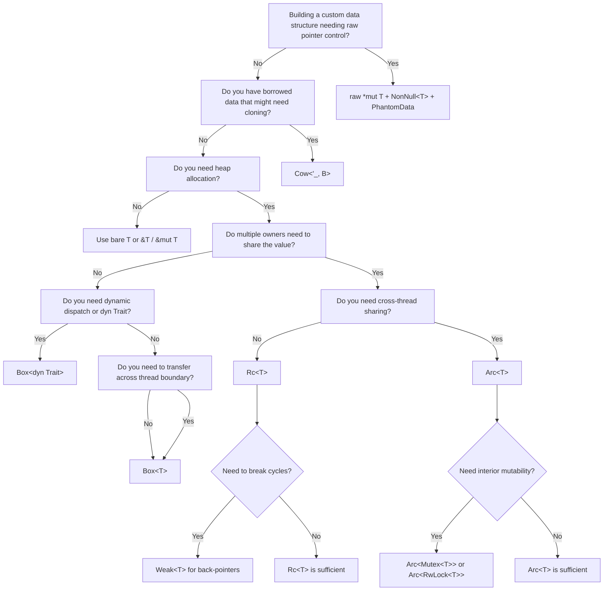

# Appendix: Summary and Reference Card

This reference card condenses the entire book into a set of look-up tables. Pin it to your wall; consult it before reaching for a smart pointer.

---

## A.1 Smart Pointer Overhead at a Glance

| Smart Pointer | Stack Size | Additional Heap | Clone Cost | Thread Safe? | Use When |
|--------------|-----------|-----------------|------------|-------------|----------|
| `T` (owned, on stack) | `size_of::<T>()` | 0 | `memcpy` of T | N/A | T is small; no sharing |
| `&T` / `&mut T` | 8 bytes (pointer) | 0 | 8 bytes | — (depends on T) | Borrowing; zero cost |
| `Box<T>` | 8 bytes | `size_of::<T>()` + allocator overhead | Not `Copy`; deep clone via `.clone()` | `T: Send` → `Box: Send` | Heap allocation; dyn Trait; recursive types |
| `Rc<T>` | 8 bytes | `size_of::<T>()` + 16 bytes (2× `usize` ref counts) | `+1` to `strong_count` (non-atomic) | **No** (`!Send`, `!Sync`) | DAG data within one thread; shared read-only |
| `Arc<T>` | 8 bytes | `size_of::<T>()` + 16 bytes (2× atomic `usize`) | Atomic `fetch_add` (~4–10 ns) | `T: Send + Sync` | Cross-thread shared ownership |
| `Weak<T>` | 8 bytes | shares control block with Rc/Arc | +1 to `weak_count` | Same as `Rc`/`Arc` | Breaking reference cycles |
| `Cow<'a, B>` | 16–32 bytes (enum) | 0 if Borrowed; size of owned B if Owned | 0 if Borrowed; deep clone if mutated | `B: Send` etc. | Potentially-borrowed data; lazy clone |
| `*const T` / `*mut T` | 8 bytes | 0 | `memcpy` of pointer | Manual | FFI; unsafe internals |
| `NonNull<T>` | 8 bytes | 0 | `memcpy` of pointer | Manual | Safer wrapper around `*mut T`; non-null guaranteed |
| `Pin<Box<T>>` | 8 bytes | `size_of::<T>()` + allocator overhead | Not `Clone` usually | `T: Send` → `Pin<Box<T>>: Send` | Self-referential types; async futures |
| `&[T]` / `&mut [T]` | 16 bytes (ptr + len) | 0 | `memcpy` of fat pointer | — | Slices; zero-copy subslices |
| `Box<dyn Trait>` | 16 bytes (ptr + vtable ptr) | `size_of::<ConcreteType>()` + vtable | Not `Copy`; .clone() if `dyn Trait: Clone` | `ConcreteType: Send` → Send | Dynamic dispatch; heterogeneous collections |

---

## A.2 `#[repr(...)]` Attributes Reference

| Attribute | Effect | When to Use |
|-----------|--------|-------------|
| `#[repr(Rust)]` | **Default.** Compiler may reorder fields and add padding for optimal performance. Order is unspecified. | Pure Rust code; let the compiler optimize. |
| `#[repr(C)]` | Fields laid out in declaration order. Padding matches C ABI rules. | FFI; communicating with C/C++; predictable layout for debugging. |
| `#[repr(transparent)]` | Single-field struct has exactly the same layout as its field. Zero overhead. | Newtype wrappers; type-safe aliases; FFI types. |
| `#[repr(packed)]` | Removes all padding between fields. May cause unaligned accesses → UB on some architectures. | Network packets; file formats; when sizeof matters more than performance. |
| `#[repr(packed(N))]` | Padding aligned to N bytes maximum. | Partial size reduction with some alignment remaining. |
| `#[repr(align(N))]` | Ensures struct is aligned to at least N bytes (N must be a power of 2). | SIMD types; cache-line alignment (`#[repr(align(64))]`). |
| `#[repr(u8)]` / `#[repr(u32)]` etc. | For enums: specifies the discriminant's integer type. | Interop; explicit enum layout; ABI stability. |
| `#[repr(C, u8)]` | For enums with data (C-like layout): discriminant is u8 with C-compatible variant layout. | Rust/C unions with tagged unions. |

### Key Rules

```
#[repr(transparent)] rules:
  ✓ Exactly ONE field with non-zero size
  ✓ Any number of zero-sized fields (PhantomData, etc.)
  ✓ Struct layout == that one field's layout
  ✓ Safe to cast &Wrapper to &Inner and back
  ✗ Cannot be applied to enums or unions
```

---

## A.3 Memory Layout Quick Reference

### Size and Alignment of Common Types

| Type | `size_of` | `align_of` |
|------|-----------|-----------|
| `bool` | 1 | 1 |
| `u8` / `i8` | 1 | 1 |
| `u16` / `i16` | 2 | 2 |
| `u32` / `i32` / `f32` | 4 | 4 |
| `u64` / `i64` / `f64` | 8 | 8 |
| `u128` / `i128` | 16 | 16 |
| `usize` / `isize` | 8 (64-bit) | 8 |
| `*const T` / `*mut T` / `&T` | 8 | 8 |
| `&[T]` (fat pointer) | 16 | 8 |
| `&dyn Trait` (fat pointer) | 16 | 8 |
| `Option<&T>` | 8 | 8 (NPO) |
| `Option<Box<T>>` | 8 | 8 (NPO) |
| `Option<NonZeroU64>` | 8 | 8 (NPO) |
| `Option<u8>` | 2 | 1 (no NPO) |
| `()` (unit) | 0 | 1 |
| `[T; N]` | `N * size_of::<T>()` | `align_of::<T>()` |

### Alignment Rule

A struct's alignment = alignment of its most-aligned field.  
A struct's size = multiple of its alignment (padded out).

```
struct Example {
    a: u8,   // align 1
    b: u32,  // align 4  ← this determines struct alignment = 4
    c: u8,   // align 1
}
// Layout (repr(Rust) may reorder, repr(C) does not):
// repr(C): [a(1), pad(3), b(4), c(1), pad(3)] = 12 bytes
// repr(Rust): may reorder to [b(4), a(1), c(1), pad(2)] = 8 bytes
```

---

## A.4 `std::ptr` Operations Quick Reference

| Function | Signature (simplified) | Use Case |
|---------|------------------------|----------|
| `ptr::read(src)` | `unsafe fn read<T>(src: *const T) -> T` | Copy value out of raw pointer (T need not be Copy) |
| `ptr::write(dst, val)` | `unsafe fn write<T>(dst: *mut T, val: T)` | Write to uninitialized/raw memory without dropping |
| `ptr::copy(src, dst, n)` | `unsafe fn copy<T>(src, dst, count)` | `memmove`: overlapping-safe copy of `n` T values |
| `ptr::copy_nonoverlapping` | `unsafe fn(src, dst, count)` | `memcpy`: faster copy, no overlap allowed |
| `ptr::drop_in_place(p)` | `unsafe fn drop_in_place<T>(ptr: *mut T)` | Run T's destructor in place (without freeing memory) |
| `ptr::null::<T>()` | `fn null<T>() -> *const T` | Create a null `*const T` |
| `ptr::null_mut::<T>()` | `fn null_mut<T>() -> *mut T` | Create a null `*mut T` |
| `p.is_null()` | `fn is_null(self) -> bool` | Check for null |
| `p.add(n)` | `unsafe fn add(self, n: usize) -> *mut T` | Pointer arithmetic: `p + n` (in units of T) |
| `p.sub(n)` | `unsafe fn sub(self, n: usize) -> *mut T` | Pointer arithmetic: `p - n` |
| `p.offset(n)` | `unsafe fn offset(self, n: isize) -> *mut T` | Signed pointer arithmetic |
| `p.offset_from(q)` | `unsafe fn offset_from(self, q) -> isize` | Distance in elements between two pointers |
| `p.read_volatile()` | `unsafe fn read_volatile(self) -> T` | Read with volatile semantics (for MMIO) |
| `p.write_volatile(v)` | `unsafe fn write_volatile(self, v: T)` | Write with volatile semantics |
| `p.align_offset(a)` | `fn align_offset(self, a: usize) -> usize` | Bytes to add to align pointer to `a` |
| `ptr::addr_of!(place)` | macro | Create raw pointer to place without creating reference |
| `ptr::addr_of_mut!(place)` | macro | Create mutable raw pointer (safe even for packed structs) |

---

## A.5 Choosing the Right Smart Pointer (Decision Flowchart)



---

## A.6 `PhantomData` Patterns Reference

| `PhantomData<…>` | What it communicates to the compiler |
|-----------------|--------------------------------------|
| `PhantomData<T>` | "We own a T" — T's Drop runs when Self drops; `Send`/`Sync` inherited from T |
| `PhantomData<*mut T>` | "Invariant in T" — disables variance; useful for `Cell`-like types |
| `PhantomData<*const T>` | "Covariant in T" — T can be a subtype substitute |
| `PhantomData<fn(T)>` | "Contravariant in T" — rare; used in function-type wrappers |
| `PhantomData<&'a T>` | "We borrow a T for lifetime 'a" — tells drop check we have a reference |
| `PhantomData<&'a mut T>` | "We exclusively borrow T for 'a" — makes type invariant in 'a |

---

## A.7 Unsafe Code Checklist

Before writing any `unsafe` block, verify all of the following:

```
Pointer validity:
  [ ] Pointer is non-null
  [ ] Pointer is aligned to align_of::<T>()
  [ ] Memory at pointer is initialized (for reads)
  [ ] Memory region covers at least size_of::<T>() bytes

Aliasing:
  [ ] No &mut T alias exists while writing through *mut T
  [ ] You are not creating two simultaneous &mut T to the same memory
  [ ] Any shared references (&T) are read-only during their lifetime

Lifetimes:
  [ ] Pointer remains valid for the entire duration you use it
  [ ] The allocation is not freed while any pointer into it exists
  [ ] No use-after-free possible

FFI:
  [ ] C types match Rust types including alignment and size
  [ ] String data is null-terminated where expected by C
  [ ] C callbacks don't unwind (use catch_unwind at FFI boundary)

Drop:
  [ ] drop_in_place called exactly once per object
  [ ] Not calling drop_in_place on uninitialized memory
  [ ] Not using mem::forget to skip drops that should run
```

---

## A.8 Cache Locality Reference

| Cache Level | Size | Latency | Notes |
|------------|------|---------|-------|
| L1 | 32–64 KB | ~1 ns / 4 cycles | Per-core; instruction + data |
| L2 | 256 KB – 1 MB | ~4–10 ns / 12 cycles | Per-core |
| L3 | 4 MB – 64 MB | ~30–40 ns / 40 cycles | Shared across cores |
| DRAM | GBs | ~60–100 ns / 200 cycles | Main memory |

**Cache line** = **64 bytes** on all modern x86-64 and ARM64 processors.

**Rules of thumb:**
- Structs accessed together → put in the same struct (hot/cold splitting if needed)
- 64 objects of `u8` fit in one cache line; 8 objects of `u64` fit in one cache line
- False sharing: two threads writing to the same cache line → use `#[repr(align(64))]` to pad
- AoS (Array of Structs) → good for per-object operations; SoA (Struct of Arrays) → good for SIMD/bulk operations

---

## A.9 Quick Compiler Commands

```bash
# Show the assembly output for a function named `my_fn`
RUSTFLAGS="-C opt-level=3" cargo asm my_crate::my_fn

# Or use cargo-show-asm:
cargo install cargo-show-asm
cargo asm --release my_crate::my_fn

# Print struct layout (requires nightly):
RUSTFLAGS="-Z print-type-sizes" cargo +nightly build --release 2>&1 | grep "TypedArena"

# Benchmark with criterion:
cargo bench -- my_bench_name

# Check if a type is Send + Sync:
fn _check_send_sync<T: Send + Sync>() {}
fn _assertions() { _check_send_sync::<TypedArena<u32>>(); }
```

---

## A.10 Further Reading

| Topic | Resource |
|-------|---------|
| Async Rust | *Async Rust Guide* — companion book in this training series |
| Concurrency | *Rust Concurrency Guide* — companion book |
| Memory Management | *Rust Memory Management Guide* — companion book |
| Type System | *Rust Type System Guide* — companion book |
| Unsafe Rust | [The Rustonomicon](https://doc.rust-lang.org/nomicon/) — official guide to unsafe Rust |
| Allocators | [`bumpalo`](https://docs.rs/bumpalo) — production bump allocator crate |
| Cache tools | [`crossbeam`](https://docs.rs/crossbeam) — `CachePadded<T>` and other concurrent primitives |
| Assembly analysis | [`cargo-show-asm`](https://github.com/pacak/cargo-show-asm) — view generated assembly |
