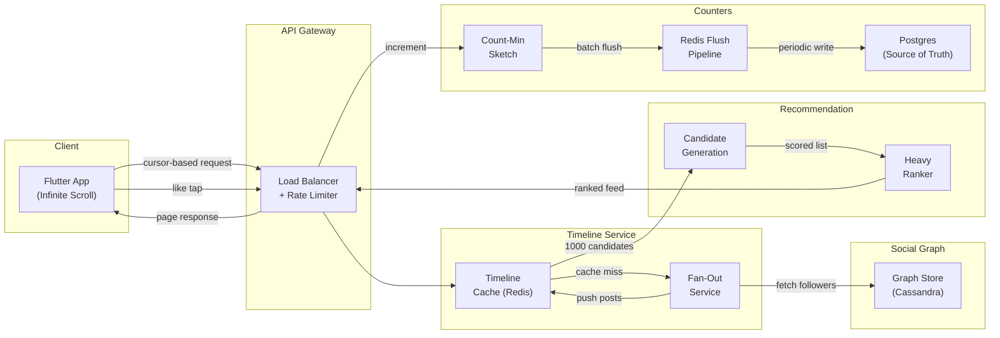

# System Design: The Infinite Social Newsfeed

## Speaker Intro

I'm a Principal Systems Architect who has spent the last decade building news-feed infrastructure at scale — from a naive "pull everything at request time" prototype serving 10K users up to a hybrid fan-out architecture sustaining 500M+ daily active users with sub-200ms P99 timeline loads. This book distills the lessons from that journey into a single, coherent design document.

---

## Who This Is For

- **Backend engineers** who want to understand how Twitter/X, Instagram, and TikTok assemble a personalized timeline in real time.
- **Mobile engineers** building infinite-scroll experiences in Flutter (or React Native, SwiftUI) who need to understand the server contract.
- **ML engineers** curious about how the recommendation pipeline (Two-Tower retrieval → Heavy Ranker) fits into the broader system.
- **Staff+ engineers** preparing for system design interviews where "Design a Social Media Feed" is one of the top-5 most common prompts.
- **Anyone** who has ever wondered: *"How does a Like counter update instantly for 50 million concurrent viewers?"*

---

## Prerequisites

| Concept | Where to Learn |
|---|---|
| Distributed systems basics (replication, partitioning) | [Distributed Systems book](../distributed-systems-book/src/SUMMARY.md) |
| Redis data structures (sorted sets, HyperLogLog) | Redis University — RU101 |
| Basic ML intuition (embeddings, dot product similarity) | fast.ai Practical Deep Learning, Lesson 1–4 |
| Flutter widget tree & state management | [The Omni-Platform Flutter Architect](../flutter-omni-book/src/SUMMARY.md) |
| SQL fundamentals (JOINs, indexes) | [The SQL Rosetta Stone](../sql-rosetta-book/src/SUMMARY.md) |

---

## How to Use This Book

| Emoji | Meaning |
|-------|---------|
| 🟢 | **Architecture** — system-level design, trade-offs, SLA reasoning |
| 🟡 | **Data Modeling** — schema design, storage engine choices, pagination |
| 🔴 | **Machine Learning / Graph** — recommendation models, probabilistic counters |

Each chapter follows the same rhythm:

1. **The Problem** — a motivating scenario with concrete numbers.
2. **Comparative tables** — side-by-side analysis of design alternatives.
3. **Architecture diagrams** — at least one Mermaid diagram per chapter.
4. **Code blocks** — Rust for backend services, Dart for the Flutter client, pseudocode for ML pipelines.
5. **Key Takeaways** — the three to five facts you must remember.

---

## Pacing Guide

| Chapter | Topic | Time | Checkpoint |
|---------|-------|------|------------|
| 0 | Introduction | 30 min | Understand the end-to-end data flow |
| 1 | Push vs. Pull (Fan-Out) 🟢 | 2–3 hours | Can whiteboard the hybrid fan-out architecture |
| 2 | The Social Graph 🟡 | 2–3 hours | Can model follower edges in Cassandra |
| 3 | The Recommendation Pipeline 🔴 | 3–4 hours | Can explain Two-Tower retrieval + Heavy Ranker |
| 4 | Flutter Infinite Scroll 🟡 | 2–3 hours | Can implement cursor-based pagination in Dart |
| 5 | View-State Syncing 🔴 | 3–4 hours | Can design a Count-Min Sketch flushing pipeline |

**Total: 12–17 hours** for the full book with exercises.

---

## Table of Contents

### Part I: Timeline Architecture
- **Chapter 1 — The Push vs. Pull Dilemma (Fan-Out) 🟢**
  How every social platform assembles its home timeline. Fan-out on Write pushes each new post into every follower's pre-computed cache. Fan-out on Read computes the timeline lazily at request time. Neither works alone — you need a hybrid architecture that special-cases celebrities.

### Part II: Data Modeling
- **Chapter 2 — The Social Graph 🟡**
  Storing billions of follow relationships. Why relational JOINs collapse under write amplification. Designing an adjacency-list model in Cassandra/DynamoDB that answers "who does user X follow?" in $O(1)$ partition lookups.

### Part III: Intelligence
- **Chapter 3 — The Recommendation Pipeline 🔴**
  Building the algorithm. Two-Tower retrieval narrows 100M candidate posts to 1,000 in milliseconds. The Heavy Ranker scores each candidate on predicted engagement probability. The full pipeline runs in < 400ms P99.

### Part IV: Client Engineering
- **Chapter 4 — The Flutter Infinite Scroll Architecture 🟡**
  Cursor-based pagination (not OFFSET). Aggressive off-screen disposal of video players. Local SQLite caching for offline-first UX. The contract between client and server.

### Part V: Real-Time Counters
- **Chapter 5 — View-State Syncing and Ephemeral Counters 🔴**
  Updating a Like count seen by 50M concurrent viewers without melting the database. Count-Min Sketches, Redis batch flushing, and the eventual-consistency trade-off humans never notice.

---

## End-to-End Data Flow

---

## Companion Guides

| Book | Relevance |
|---|---|
| [Distributed Systems](../distributed-systems-book/src/SUMMARY.md) | Consensus, replication, failure modes |
| [The Omni-Platform Flutter Architect](../flutter-omni-book/src/SUMMARY.md) | Widget lifecycle, Isolates, Riverpod |
| [Database Internals](../database-internals-book/src/SUMMARY.md) | B-Trees, LSM, MVCC — storage under the hood |
| [System Design: Message Broker](../system-design-book/src/SUMMARY.md) | Append-only logs, zero-copy, Raft |
| [Algorithms & Concurrency](../algorithms-concurrency-book/src/SUMMARY.md) | Probabilistic data structures, lock-free queues |
