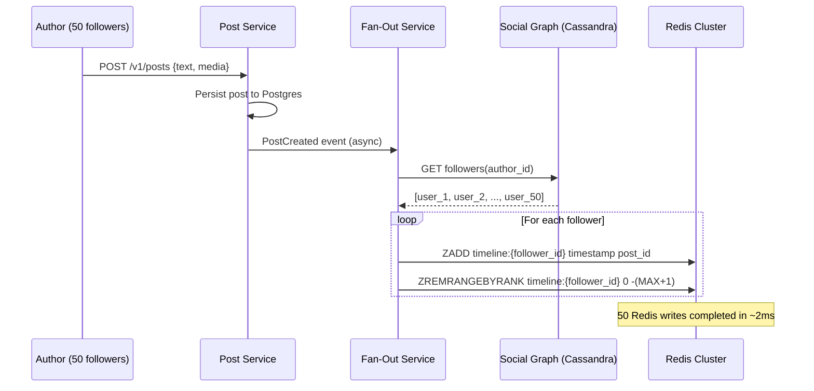
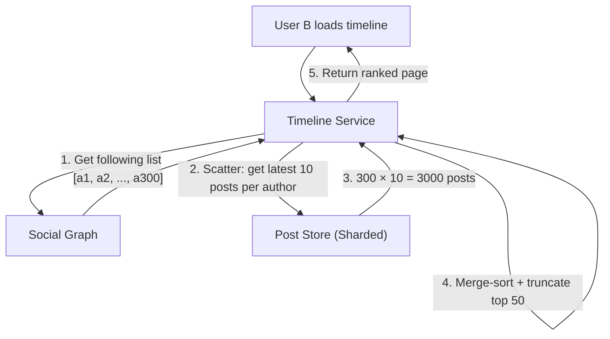
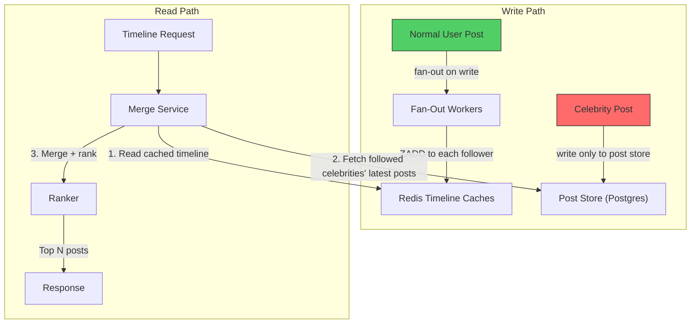
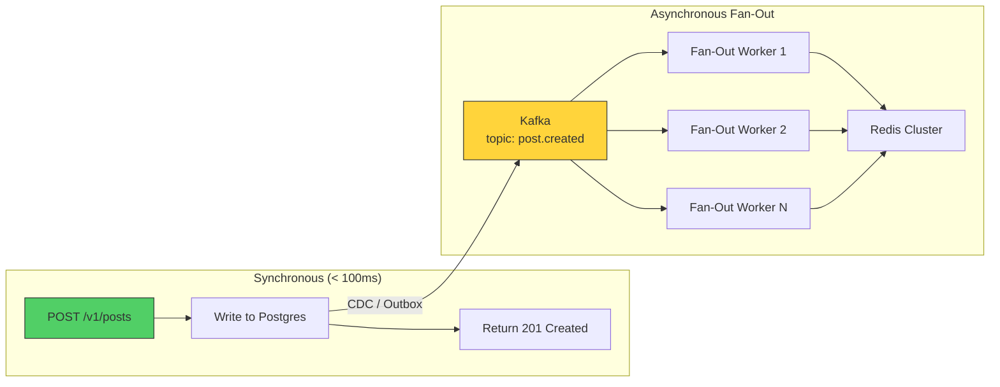
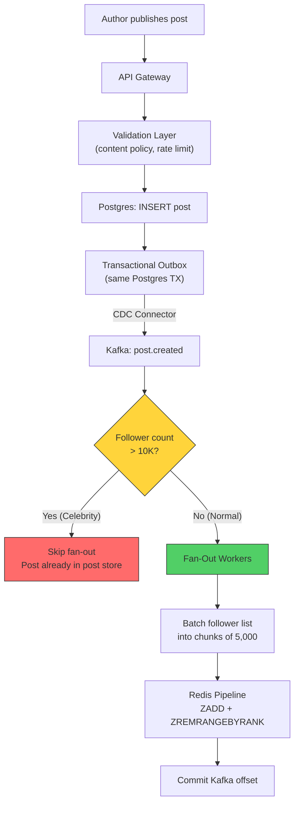

# 1. The Push vs. Pull Dilemma (Fan-Out) 🟢

> **The Problem:** A user opens their home timeline and expects to see the latest posts from everyone they follow — sorted, deduplicated, and loaded in under 200ms. With 500M daily active users, each following an average of 300 accounts, how do you assemble that timeline without either (a) making the read path impossibly expensive, or (b) making the write path impossibly expensive for celebrities with 80M followers?

---

## Two Fundamental Architectures

Every social platform's timeline boils down to a single question: *When do you compute the feed?*

| | Fan-Out on Write (Push) | Fan-Out on Read (Pull) |
|---|---|---|
| **When** | At post creation time | At timeline load time |
| **What happens** | New post is copied into every follower's inbox | Client queries all followed accounts, merges results |
| **Write cost** | $O(F)$ where $F$ = follower count | $O(1)$ — just write the post |
| **Read cost** | $O(1)$ — read from pre-computed cache | $O(N)$ where $N$ = accounts followed |
| **Storage** | High — one copy per follower | Low — single copy |
| **Latency** | Read: < 10ms (cache hit) | Read: 200–2000ms (scatter-gather) |
| **Celebrity problem** | Catastrophic — 80M writes per post | Acceptable — but slow reads |
| **Stale data** | Cannot easily un-push a deleted post | Always fresh — reads from source |

Neither architecture works alone at scale. Every production system uses a **hybrid**.

---

## Fan-Out on Write: The Push Model

When User A publishes a post, the Fan-Out Service:

1. Looks up A's follower list from the Social Graph store.
2. For each follower, inserts the post ID (with a timestamp score) into that follower's **timeline cache** — a Redis Sorted Set keyed by `timeline:{user_id}`.
3. Trims the sorted set to the most recent ~800 entries (nobody scrolls further than that).



### Rust: Fan-Out Worker

```rust
use redis::AsyncCommands;
use std::time::{SystemTime, UNIX_EPOCH};

const MAX_TIMELINE_SIZE: isize = 800;

/// Fan out a single post to all followers' timeline caches.
async fn fan_out_post(
    redis: &mut redis::aio::MultiplexedConnection,
    followers: &[u64],
    post_id: u64,
) -> anyhow::Result<()> {
    let score = SystemTime::now()
        .duration_since(UNIX_EPOCH)?
        .as_millis() as f64;

    // Pipeline all writes into a single round-trip
    let mut pipe = redis::pipe();
    for &follower_id in followers {
        let key = format!("timeline:{follower_id}");
        pipe.zadd(&key, post_id, score).ignore();
        pipe.zremrangebyrank(&key, 0, -(MAX_TIMELINE_SIZE + 1)).ignore();
    }
    pipe.query_async(redis).await?;
    Ok(())
}
```

### Cost Analysis

| Metric | Value |
|---|---|
| Average fan-out per post | 300 followers |
| Posts per second (global) | 50,000 |
| Redis writes per second | 15,000,000 |
| Redis write size | ~64 bytes (ZADD) |
| Throughput | ~960 MB/s sustained |

This is achievable with a 30-node Redis Cluster, each handling ~500K ops/s.

---

## Fan-Out on Read: The Pull Model

When User B loads their timeline:

1. The Timeline Service fetches B's following list: `[author_1, author_2, ..., author_300]`.
2. For each author, it fetches the latest K posts (K = 10).
3. It merges all results, sorts by timestamp (or relevance score), and returns the top N.



### The Problem: Latency

Even with parallel scatter, you must wait for the **slowest** shard:

| Step | Latency |
|---|---|
| Fetch following list | 5ms |
| Scatter 300 requests (P99 of 300 parallel calls) | 80–200ms |
| Merge-sort 3,000 items | 1ms |
| **Total** | **86–206ms** |

For users following 1,000+ accounts, this blows past any reasonable SLA. And you can't cache the result without invalidating it on every new post from any followed account.

---

## The Celebrity Problem

The asymmetry that breaks both models:

| User type | Followers | Fan-out on Write cost | Fan-out on Read cost |
|---|---|---|---|
| Normal user (99.9%) | 50–1,000 | Cheap | Cheap |
| Power user (0.09%) | 10K–100K | Expensive but feasible | Cheap |
| Celebrity (0.01%) | 1M–100M | **Catastrophic** | Cheap |

When a celebrity with 80M followers posts a photo:
- **Fan-out on Write:** 80,000,000 Redis ZADD operations. At 500K ops/s per node, that's 160 Redis nodes fully saturated for 1 second — and they post multiple times per day.
- **Fan-out on Read:** Zero extra write cost. But every user who follows that celebrity now has a slower read — the system must always fetch from the celebrity's post store.

---

## The Hybrid Architecture (Industry Standard)

The solution used by Twitter, Instagram, and every large-scale feed system:

1. **Normal users** (< 10K followers): Fan-out on Write. Their posts are pushed into followers' caches.
2. **Celebrities** (≥ 10K followers): Fan-out on Read. Their posts are **not** pushed. Instead, at read time, the timeline service merges the cached timeline with a live fetch of followed celebrities' recent posts.



### The Celebrity Threshold

The threshold is not a fixed number — it's a **cost function**:

$$\text{use\_push}(u) = \begin{cases} \text{true} & \text{if } F(u) \times \text{post\_rate}(u) < C_{\text{budget}} \\ \text{false} & \text{otherwise} \end{cases}$$

Where:
- $F(u)$ = follower count of user $u$
- $\text{post\_rate}(u)$ = average posts per hour
- $C_{\text{budget}}$ = maximum Redis ZADD operations per second we're willing to allocate per author

In practice, most systems use a simple threshold: **if followers > 10,000, mark as celebrity**.

### Rust: Hybrid Timeline Assembly

```rust
use redis::AsyncCommands;

/// Assemble a user's timeline by merging cached entries with
/// live celebrity post lookups.
async fn get_timeline(
    redis: &mut redis::aio::MultiplexedConnection,
    post_store: &PostStore,
    graph_store: &GraphStore,
    user_id: u64,
    cursor: Option<u64>,
    page_size: usize,
) -> anyhow::Result<Vec<Post>> {
    // 1. Read pre-computed timeline from Redis (fan-out on write entries)
    let cached_key = format!("timeline:{user_id}");
    let max_score = cursor.unwrap_or(u64::MAX);
    let cached_ids: Vec<u64> = redis
        .zrevrangebyscore_limit(&cached_key, max_score, 0, 0, page_size * 2)
        .await?;

    // 2. Fetch followed celebrities' latest posts (fan-out on read)
    let followed_celebrities = graph_store
        .get_followed_celebrities(user_id)
        .await?;

    let celebrity_posts = post_store
        .get_latest_posts(&followed_celebrities, page_size * 2)
        .await?;

    // 3. Merge both sources
    let mut all_posts = post_store.hydrate(&cached_ids).await?;
    all_posts.extend(celebrity_posts);

    // 4. Sort by score (timestamp or ML rank) and truncate
    all_posts.sort_unstable_by(|a, b| b.score.partial_cmp(&a.score).unwrap());
    all_posts.truncate(page_size);

    Ok(all_posts)
}
```

---

## Write-Path Deep Dive: Async Fan-Out Pipeline

The fan-out cannot be synchronous with the post creation. A user posting expects < 200ms response time, but fanning out to 5,000 followers takes ~10ms. For 300,000 followers, it takes ~600ms. We decouple them:



### Partitioning Strategy

The Kafka topic `post.created` is partitioned by `author_id`. Each fan-out worker:

1. Consumes a batch of post-created events.
2. For each event, fetches the author's follower list (paginated).
3. Pipelines ZADD commands to the Redis Cluster.
4. Commits the Kafka offset only after all writes succeed.

This gives us **exactly-once semantics** (idempotent ZADD + at-least-once delivery).

---

## Failure Modes and Mitigations

| Failure | Impact | Mitigation |
|---|---|---|
| Redis node goes down | Users see stale timelines | Redis Cluster auto-failover (< 5s). Sentinel promotes replica. |
| Fan-out worker crashes mid-batch | Some followers don't get the post | Kafka redelivers uncommitted offsets. ZADD is idempotent. |
| Celebrity threshold miscalculated | Either wasted Redis writes or slow reads | Dynamic threshold based on rolling 24h fan-out cost. |
| Kafka lag spikes | Timeline delivery delay | Auto-scale fan-out workers on consumer-lag metric. |
| Post deleted after fan-out | Ghost entries in timeline cache | Async delete fan-out (same pipeline, reversed). TTL on sorted set entries. |

---

## Capacity Planning

Let's size the Redis Cluster for a 500M DAU platform:

| Parameter | Value |
|---|---|
| DAU | 500,000,000 |
| Avg. posts per user per day | 0.5 |
| Total posts/day | 250,000,000 |
| Avg. non-celebrity followers per post | 300 |
| Fan-out writes/day | 75,000,000,000 |
| Fan-out writes/sec (avg) | ~868,000 |
| Fan-out writes/sec (peak, 3× avg) | ~2,600,000 |
| Timeline cache size per user | 800 entries × 16 bytes = 12.8 KB |
| Total timeline cache (all users) | 500M × 12.8 KB = **6.4 TB** |

A 60-node Redis Cluster (128 GB RAM each, 7.68 TB total) handles this with headroom.

### Redis Memory Layout

```
timeline:{user_id} → Sorted Set
  member: post_id (8-byte integer, encoded as string)
  score:  timestamp_ms (double)

Per-entry overhead: ~64 bytes (ziplist) or ~120 bytes (skiplist)
Sorted set switches from ziplist to skiplist at 128 entries.
800 entries → skiplist encoding → ~96 KB per user (worst case)
```

Revised: 500M × 96 KB = **48 TB**. This requires either:
- More Redis nodes (400 × 128 GB), or
- Tiered storage (hot users in Redis, cold users in RocksDB/Cassandra), or
- Reduced timeline depth (400 entries instead of 800).

Most platforms use tiered storage: the top 20% of active users are in Redis; the rest are assembled on-read.

---

## The Complete Write Path



---

> **Key Takeaways**
>
> 1. **Fan-out on Write** gives O(1) reads but O(F) writes. It's perfect for normal users but collapses for celebrities.
> 2. **Fan-out on Read** gives O(1) writes but O(N) reads. It's always fresh but too slow for users following 300+ accounts.
> 3. **The hybrid architecture** — push for normal users, pull for celebrities — is the industry standard. The celebrity threshold is a cost function, not a fixed number.
> 4. **Fan-out must be asynchronous.** Decouple it from the post-creation API via Kafka (or any durable event bus). ZADD idempotency gives you exactly-once semantics for free.
> 5. **Capacity planning** reveals that Redis alone cannot hold timelines for 500M users. Production systems use tiered storage: hot users in Redis, cold users assembled on-read.
