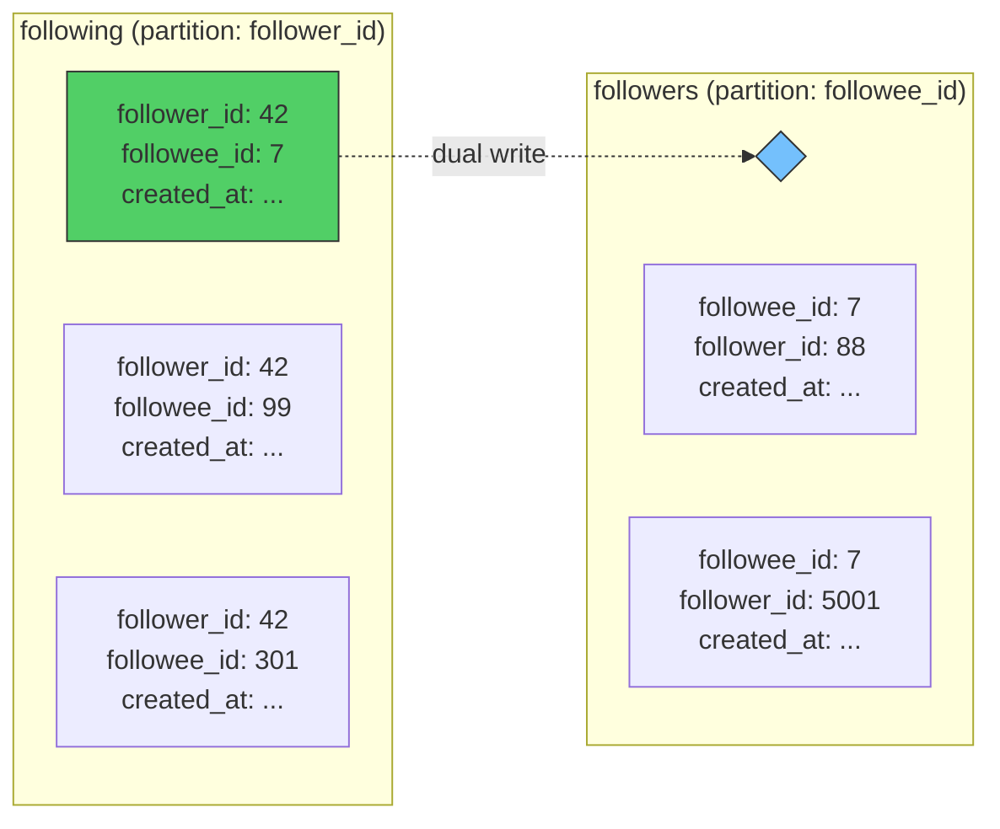
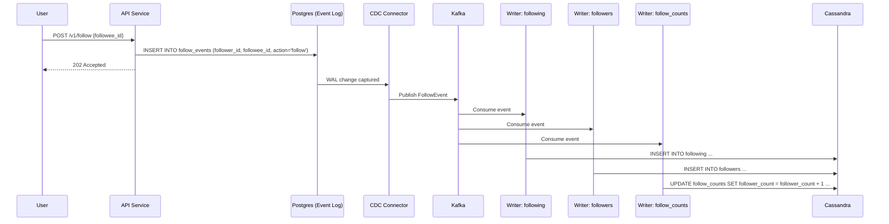
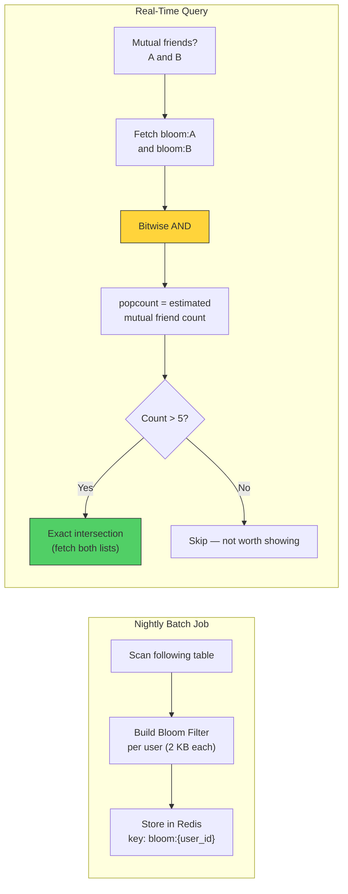
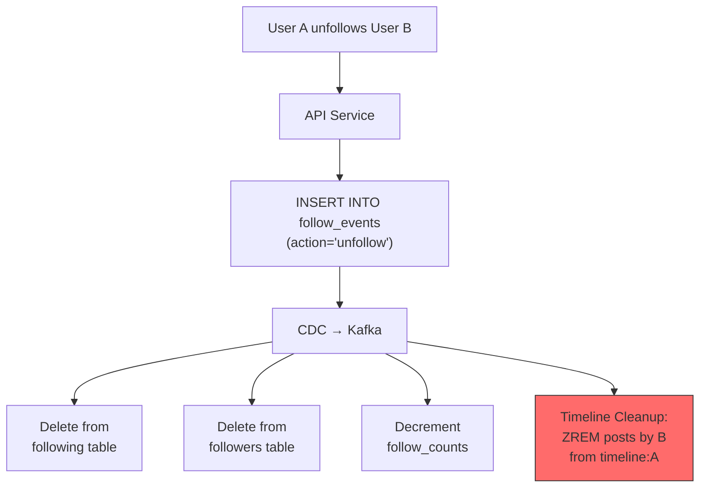

# 2. The Social Graph 🟡

> **The Problem:** A social platform with 2 billion registered users and an average of 300 follow relationships per user stores 600 billion directed edges. Every timeline load, every fan-out operation, and every recommendation query starts with the same question: *"Who does user X follow?"* If that query takes more than 5ms, the entire system collapses. Relational JOINs on a 600-billion-row table are not an option.

---

## Why Relational Databases Fail Here

The naïve schema looks clean:

```sql
CREATE TABLE follows (
    follower_id BIGINT NOT NULL,
    followee_id BIGINT NOT NULL,
    created_at  TIMESTAMPTZ NOT NULL DEFAULT now(),
    PRIMARY KEY (follower_id, followee_id)
);

CREATE INDEX idx_follows_followee ON follows (followee_id, follower_id);
```

### The Problem at Scale

| Query | SQL | Cost |
|---|---|---|
| Who does X follow? | `SELECT followee_id FROM follows WHERE follower_id = ?` | Index scan — fast |
| Who follows X? | `SELECT follower_id FROM follows WHERE followee_id = ?` | Secondary index scan — fast |
| Mutual follows? | `SELECT ... INNER JOIN follows f2 ON ...` | **JOIN on 600B rows** — catastrophic |
| Count followers | `SELECT COUNT(*) FROM follows WHERE followee_id = ?` | Full partition scan — slow |
| Fan-out: get all 80M followers | Paginated scan | Minutes for a celebrity |

The real killers:

1. **Write amplification:** Every `INSERT` updates two B-Tree indexes. At 50K new follows/sec, that's 100K random I/O ops/sec.
2. **Hot partitions:** Celebrity accounts concentrate millions of rows in a narrow key range, causing lock contention.
3. **JOINs at scale:** Finding mutual friends between two users requires joining the table against itself — the query planner gives up.

---

## The Adjacency List Model in NoSQL

Instead of a single table with two indexes, we use **two denormalized tables** — one optimized for each access pattern:



### Cassandra Schema

```sql
-- "Who does user X follow?" — used by fan-out, timeline assembly, profile page
CREATE TABLE following (
    follower_id BIGINT,
    created_at  TIMESTAMP,
    followee_id BIGINT,
    PRIMARY KEY (follower_id, created_at, followee_id)
) WITH CLUSTERING ORDER BY (created_at DESC, followee_id ASC)
  AND compaction = {'class': 'LeveledCompactionStrategy'};

-- "Who follows user X?" — used by follower count, notifications
CREATE TABLE followers (
    followee_id BIGINT,
    created_at  TIMESTAMP,
    follower_id BIGINT,
    PRIMARY KEY (followee_id, created_at, follower_id)
) WITH CLUSTERING ORDER BY (created_at DESC, follower_id ASC)
  AND compaction = {'class': 'LeveledCompactionStrategy'};

-- Precomputed counters (Cassandra counter table)
CREATE TABLE follow_counts (
    user_id        BIGINT PRIMARY KEY,
    following_count COUNTER,
    follower_count  COUNTER
);
```

### Why This Works

| Operation | Query | Time Complexity |
|---|---|---|
| Who does X follow? | `SELECT * FROM following WHERE follower_id = ?` | $O(1)$ partition read |
| Who follows X? | `SELECT * FROM followers WHERE followee_id = ?` | $O(1)$ partition read |
| Does X follow Y? | `SELECT * FROM following WHERE follower_id = ? AND followee_id = ?` | $O(1)$ point query |
| Follower count | `SELECT * FROM follow_counts WHERE user_id = ?` | $O(1)$ counter read |
| Paginate followers | `SELECT * FROM followers WHERE followee_id = ? AND created_at < ? LIMIT 100` | $O(1)$ range scan |

Every query is a **single-partition read** — no JOINs, no scatter-gather.

---

## The Dual-Write Problem

We must write to **both** `following` and `followers` tables atomically. Cassandra doesn't support cross-partition transactions. Options:

| Approach | Consistency | Complexity | Used By |
|---|---|---|---|
| Logged Batch | Atomic (same-partition only) | Low | ❌ Cross-partition |
| Application-level dual write | At-least-once | Medium | Twitter (early) |
| Event-sourced with CDC | Exactly-once (with idempotency) | High | Instagram, TikTok |

### Production Pattern: Event-Sourced Follow



The source of truth is the **event log in Postgres**. The Cassandra tables are materialized views rebuilt from that log. If any writer fails, Kafka redelivers. Cassandra writes are idempotent (INSERT is an upsert).

### Rust: Follow Service

```rust
use sqlx::PgPool;
use rdkafka::producer::{FutureProducer, FutureRecord};
use serde::Serialize;

#[derive(Serialize)]
struct FollowEvent {
    follower_id: u64,
    followee_id: u64,
    action: &'static str,
    timestamp_ms: u64,
}

/// Record a follow relationship. The actual Cassandra writes happen
/// asynchronously via CDC → Kafka → consumer workers.
async fn follow_user(
    db: &PgPool,
    kafka: &FutureProducer,
    follower_id: u64,
    followee_id: u64,
) -> anyhow::Result<()> {
    // Idempotent: ON CONFLICT DO NOTHING
    sqlx::query!(
        r#"
        INSERT INTO follow_events (follower_id, followee_id, action, created_at)
        VALUES ($1, $2, 'follow', now())
        ON CONFLICT (follower_id, followee_id) DO NOTHING
        "#,
        follower_id as i64,
        followee_id as i64,
    )
    .execute(db)
    .await?;

    // Publish event for async materialization
    let event = FollowEvent {
        follower_id,
        followee_id,
        action: "follow",
        timestamp_ms: std::time::SystemTime::now()
            .duration_since(std::time::UNIX_EPOCH)?
            .as_millis() as u64,
    };
    let payload = serde_json::to_vec(&event)?;
    let key = follower_id.to_string();
    kafka
        .send(
            FutureRecord::to("follow-events")
                .key(&key)
                .payload(&payload),
            std::time::Duration::from_secs(5),
        )
        .await
        .map_err(|(e, _)| e)?;

    Ok(())
}
```

---

## DynamoDB Alternative: Single-Table Design

For teams on AWS, DynamoDB's single-table pattern is common:

| PK | SK | GSI1-PK | GSI1-SK | Data |
|---|---|---|---|---|
| `USER#42` | `FOLLOWING#7` | `USER#7` | `FOLLOWER#42` | `{created_at: ...}` |
| `USER#42` | `FOLLOWING#99` | `USER#99` | `FOLLOWER#42` | `{created_at: ...}` |
| `USER#42` | `PROFILE` | — | — | `{name: "Alice", ...}` |

- **"Who does 42 follow?"** → Query PK = `USER#42`, SK begins_with `FOLLOWING#`
- **"Who follows 7?"** → Query GSI1-PK = `USER#7`, SK begins_with `FOLLOWER#`

### Cost Comparison

| Dimension | Cassandra (Self-Managed) | DynamoDB (Managed) |
|---|---|---|
| Ops/sec (write) | ~100K/node, linear scaling | On-demand: unlimited (with $$) |
| Storage cost (600B edges) | ~$40K/mo (100-node cluster) | ~$150K/mo (on-demand, ~90 TB) |
| Operational overhead | High (compaction tuning, repairs) | Zero |
| Consistency model | Tunable (ONE, QUORUM, ALL) | Eventually consistent (default), strong (optional) |
| Hot partition handling | Manual splitting | Adaptive capacity (auto-split) |

---

## Mutual Friends: The Graph Query Problem

The most expensive social-graph query: *"Show me friends that User A and User B have in common."*

### Naïve Approach: Set Intersection

```
following(A) ∩ following(B)
```

If A follows 500 people and B follows 800, this is a 1,300-element set intersection — trivial in memory. But fetching both lists from Cassandra requires two partition reads, and the intersection must happen in the application layer.

### Optimized Approach: Bloom Filter Pre-Check

For the "People You May Know" feature, we don't need exact mutual counts. We need approximate filtering across thousands of candidates:



### Bloom Filter Sizing

| Parameter | Value |
|---|---|
| Items per filter | 300 (avg following count) |
| Target FPR | 1% |
| Bits required | $-\frac{n \ln p}{(\ln 2)^2} = \frac{300 \times 4.6}{0.48} \approx 2,875$ bits = 360 bytes |
| Hash functions | $k = \frac{m}{n} \ln 2 \approx 6.6 \rightarrow 7$ |
| Redis storage (2B users) | 2B × 360 bytes = **720 GB** |

This fits in a 10-node Redis Cluster dedicated to Bloom filters.

---

## Graph Traversal: BFS for "Degrees of Separation"

For recommendation ("friends of friends within 2 hops"):

```rust
use std::collections::{HashSet, VecDeque};

/// BFS traversal of the social graph up to `max_depth` hops.
/// Returns all discovered user IDs (excluding the source).
async fn bfs_graph(
    graph: &GraphStore,
    source: u64,
    max_depth: u32,
) -> anyhow::Result<HashSet<u64>> {
    let mut visited = HashSet::new();
    let mut queue = VecDeque::new();

    visited.insert(source);
    queue.push_back((source, 0u32));

    while let Some((user_id, depth)) = queue.pop_front() {
        if depth >= max_depth {
            continue;
        }
        let following = graph.get_following(user_id).await?;
        for &followee in &following {
            if visited.insert(followee) {
                queue.push_back((followee, depth + 1));
            }
        }
    }

    visited.remove(&source);
    Ok(visited)
}
```

### BFS Cost at 2 Hops

| Hop | Nodes expanded | Cassandra reads |
|---|---|---|
| 0 (source) | 1 | 1 |
| 1 (direct follows) | 300 | 300 |
| 2 (friends of friends) | 300 × 300 = 90,000 | 90,000 |
| **Total** | 90,301 | **90,301** |

90K Cassandra reads at 1ms each = 90 seconds. **Not viable in real time.**

The solution: precompute 2-hop neighborhoods in a nightly batch job (Spark/Flink), store the results in a compact format, and use them as input to the recommendation pipeline (Chapter 3).

---

## Handling Unfollows and Blocks

Unfollowing is the reverse of following, but with a critical subtlety: **we must also clean up the timeline cache**.



### Timeline Cleanup Optimization

We don't scan all 800 timeline entries to find posts by the unfollowed author. Instead:

1. Fetch the unfollowed author's recent post IDs (last 800).
2. Pipeline `ZREM timeline:{A} post_id` for each.

This is $O(K)$ where K = number of recent posts by the unfollowed author (typically < 50).

### Blocking

Blocking is more aggressive — it must also:
- Remove the blocked user from both `following` and `followers` tables (bidirectional).
- Prevent future fan-out to the blocker's timeline.
- Filter the blocked user from all recommendation results.

We store blocks in a separate table:

```sql
CREATE TABLE blocks (
    blocker_id BIGINT,
    blocked_id BIGINT,
    created_at TIMESTAMP,
    PRIMARY KEY (blocker_id, blocked_id)
);
```

Checked at fan-out time (is the target follower in the author's block list?) and at read time (filter out posts from blocked users).

---

## Schema Evolution: Adding "Close Friends"

Instagram's "Close Friends" feature adds a **label** to edges:

```sql
-- Cassandra: add a clustering column for the relationship type
CREATE TABLE following_v2 (
    follower_id   BIGINT,
    relationship  TEXT,  -- 'default', 'close_friend', 'muted'
    created_at    TIMESTAMP,
    followee_id   BIGINT,
    PRIMARY KEY (follower_id, relationship, created_at, followee_id)
) WITH CLUSTERING ORDER BY (relationship ASC, created_at DESC, followee_id ASC);
```

- **"Who are X's close friends?"** → `WHERE follower_id = ? AND relationship = 'close_friend'`
- **"All of X's follows (any type)"** → `WHERE follower_id = ?` (scans all relationship clusters)

The partition key stays the same, so all queries remain single-partition.

---

> **Key Takeaways**
>
> 1. **Denormalize into two tables** — one partitioned by follower, one by followee. Every query becomes a single-partition $O(1)$ read.
> 2. **Use event sourcing** for dual writes. The Postgres event log is the source of truth; Cassandra/DynamoDB tables are materialized views.
> 3. **Bloom filters** make approximate set operations (mutual friends) feasible at billion-user scale, reducing 90K Cassandra reads to a single bitwise AND.
> 4. **2-hop BFS is too expensive for real time.** Precompute friend-of-friend neighborhoods in batch and feed them into the recommendation pipeline.
> 5. **Unfollows must cascade** into the timeline cache. Fan-out on Write means cleanup on Unfollow.
