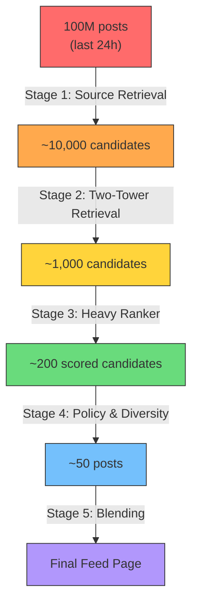
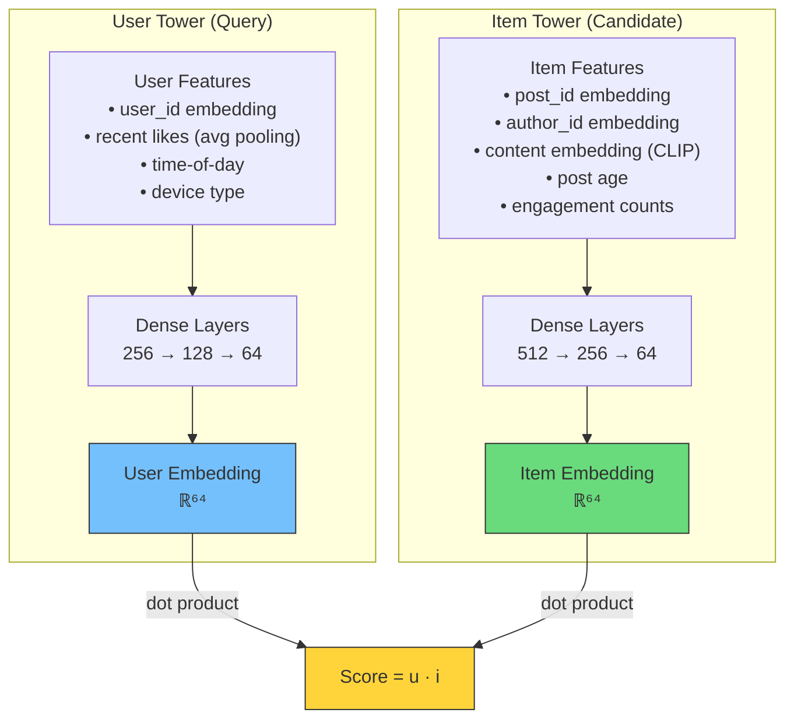
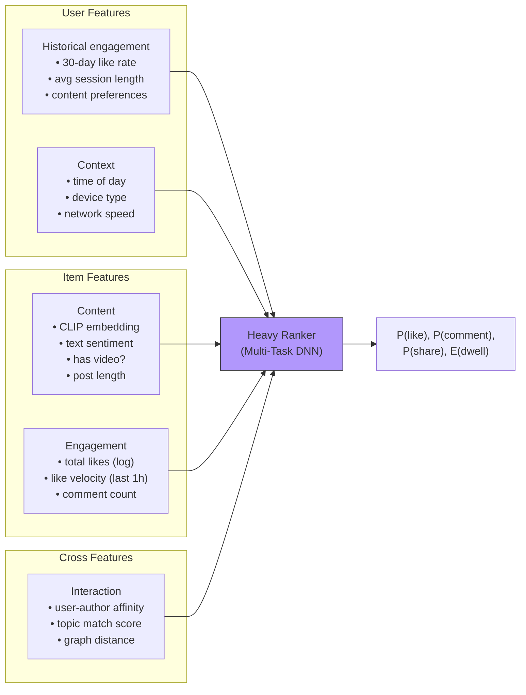
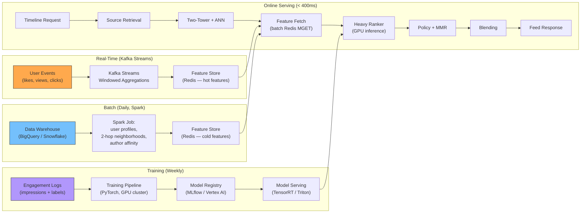

# 3. The Recommendation Pipeline 🔴

> **The Problem:** A user follows 300 accounts, but across the entire platform there are 100 million posts created in the last 24 hours. The user should not see a reverse-chronological list of posts from followed accounts — they should see the posts most likely to generate engagement (likes, comments, shares, time-spent). Building this ranking system requires narrowing 100M candidates to ~50 displayed posts in under 400ms P99, using a multi-stage funnel that combines graph signals, content embeddings, and real-time engagement features.

---

## The Ranking Funnel

No ML model can score 100 million candidates in real time. The industry-standard approach is a **multi-stage funnel** that progressively narrows the candidate set:



| Stage | Input Size | Output Size | Latency Budget | Model Complexity |
|---|---|---|---|---|
| Source Retrieval | 100M | 10,000 | 50ms | Heuristics + graph |
| Two-Tower Retrieval | 10,000 | 1,000 | 100ms | Dual-encoder (dot product) |
| Heavy Ranker | 1,000 | 200 | 150ms | Multi-task deep network |
| Policy & Diversity | 200 | 50 | 50ms | Rule engine + MMR |
| Blending | 50 | 50 | 10ms | Interleaving (ads, stories) |
| **Total** | | | **360ms** | |

---

## Stage 1: Source Retrieval (Heuristics + Graph)

This stage gathers candidates from multiple **sources** — each source is a different signal:

| Source | Description | Typical Yield |
|---|---|---|
| **Following** | Recent posts from accounts the user follows | 3,000 |
| **Friends of Friends** | Posts from 2-hop graph neighbors (precomputed nightly) | 2,000 |
| **Topic Interest** | Posts tagged with topics the user has engaged with | 2,000 |
| **Trending** | Posts with high recent engagement velocity | 1,000 |
| **Explore / Cold Start** | Editorially curated + random exploration | 1,000 |
| **Re-engagement** | Posts the user scrolled past but might like (re-ranked) | 1,000 |

```rust
/// Gather candidates from all retrieval sources in parallel.
async fn source_retrieval(
    user_id: u64,
    graph: &GraphStore,
    timeline_cache: &RedisTimeline,
    topic_index: &TopicIndex,
    trending: &TrendingService,
) -> Vec<CandidatePost> {
    let (following, fof, topics, trends, explore) = tokio::join!(
        timeline_cache.get_cached_posts(user_id, 3000),
        graph.get_fof_posts(user_id, 2000),
        topic_index.get_interest_posts(user_id, 2000),
        trending.get_trending(1000),
        get_explore_candidates(1000),
    );

    let mut candidates = Vec::with_capacity(10_000);
    candidates.extend(following.unwrap_or_default());
    candidates.extend(fof.unwrap_or_default());
    candidates.extend(topics.unwrap_or_default());
    candidates.extend(trends.unwrap_or_default());
    candidates.extend(explore.unwrap_or_default());

    // Deduplicate by post_id
    candidates.sort_unstable_by_key(|c| c.post_id);
    candidates.dedup_by_key(|c| c.post_id);
    candidates
}
```

---

## Stage 2: Two-Tower Retrieval Model

The Two-Tower architecture (also called Dual Encoder) learns **separate embeddings** for users and items, then scores candidates with a **dot product** — enabling sub-millisecond scoring of thousands of candidates.

### Architecture



### Why Two Towers?

| Property | Two-Tower (Dual Encoder) | Cross-Encoder (Heavy Ranker) |
|---|---|---|
| Scoring | $\text{score} = \mathbf{u} \cdot \mathbf{i}$ (dot product) | $\text{score} = f(\mathbf{u}, \mathbf{i})$ (deep interaction) |
| Latency per candidate | ~0.001ms | ~0.5ms |
| Can score 10K candidates? | Yes (10ms total) | No (5,000ms) |
| Accuracy | Good (captures coarse preferences) | Excellent (captures nuanced interactions) |
| Offline serving | Item embeddings precomputed → ANN index | Must score online |

The key insight: item embeddings are **precomputed offline** and stored in an Approximate Nearest Neighbor (ANN) index. At query time, we compute the user embedding once and retrieve the top-K nearest items.

### ANN Index: HNSW (Hierarchical Navigable Small World)

```
User embedding (ℝ⁶⁴) → HNSW index (100M item embeddings) → Top 1,000 items

HNSW parameters:
  - M = 32 (max connections per layer)
  - ef_construction = 200
  - ef_search = 100
  - Recall@1000 ≈ 97%
  - Latency: ~5ms for 100M vectors
```

### Training the Two-Tower Model

**Training data:** Implicit feedback logs:

| user_id | post_id | label | weight |
|---|---|---|---|
| 42 | 99001 | 1 (liked) | 1.0 |
| 42 | 99002 | 0 (impressed, no action) | 1.0 |
| 42 | 99003 | 1 (shared) | 3.0 |
| 42 | 99004 | 1 (commented) | 2.0 |

**Loss function:** Sampled softmax with in-batch negatives:

$$\mathcal{L} = -\log \frac{\exp(\mathbf{u}_i \cdot \mathbf{v}_j / \tau)}{\sum_{k=1}^{B} \exp(\mathbf{u}_i \cdot \mathbf{v}_k / \tau)}$$

Where $\tau$ is a temperature parameter (typically 0.07), $\mathbf{u}_i$ is the user embedding, $\mathbf{v}_j$ is the positive item embedding, and $B$ is the batch size (in-batch negatives).

### Pseudocode: Two-Tower Training Loop

```python
# PyTorch-style pseudocode for the Two-Tower model

class TwoTowerModel(nn.Module):
    def __init__(self, user_feat_dim, item_feat_dim, embed_dim=64):
        super().__init__()
        self.user_tower = nn.Sequential(
            nn.Linear(user_feat_dim, 256),
            nn.ReLU(),
            nn.Linear(256, 128),
            nn.ReLU(),
            nn.Linear(128, embed_dim),
            nn.functional.normalize,  # L2 normalize
        )
        self.item_tower = nn.Sequential(
            nn.Linear(item_feat_dim, 512),
            nn.ReLU(),
            nn.Linear(512, 256),
            nn.ReLU(),
            nn.Linear(256, embed_dim),
            nn.functional.normalize,
        )
        self.temperature = nn.Parameter(torch.tensor(0.07))

    def forward(self, user_features, item_features):
        u = self.user_tower(user_features)       # (B, 64)
        v = self.item_tower(item_features)        # (B, 64)
        # In-batch negatives: every u scored against every v
        logits = torch.mm(u, v.t()) / self.temperature  # (B, B)
        labels = torch.arange(u.size(0))          # diagonal = positives
        loss = F.cross_entropy(logits, labels)
        return loss
```

---

## Stage 3: Heavy Ranker

The Heavy Ranker is a **multi-task deep neural network** that scores each of the ~1,000 candidates on multiple engagement objectives simultaneously.

### Multi-Task Heads

| Task Head | Prediction | Weight in Final Score |
|---|---|---|
| P(like) | Probability of liking | 1.0 |
| P(comment) | Probability of commenting | 2.0 |
| P(share) | Probability of sharing | 3.0 |
| P(save) | Probability of saving/bookmarking | 1.5 |
| E(dwell_time) | Expected time spent viewing (seconds) | 0.5 |
| P(hide) | Probability of hiding / "not interested" | -5.0 (negative weight) |

$$\text{final\_score}(u, i) = \sum_{t} w_t \cdot \hat{y}_t(u, i)$$

### Feature Categories



### The Feature Store

Real-time features (like velocity, current engagement counts) are served from a **Feature Store** — a low-latency key-value cache that is updated by streaming pipelines:

| Feature Type | Update Frequency | Storage | Latency |
|---|---|---|---|
| User profile features | Daily batch | S3 → Redis | 1ms |
| User engagement history | Hourly mini-batch | Flink → Redis | 1ms |
| Item engagement counters | Real-time (streaming) | Kafka → Redis | 5ms |
| Item content embeddings | At post creation | CLIP model → Redis | 1ms |
| User-author affinity | Daily batch | Spark → Redis | 1ms |

```rust
/// Fetch features for a batch of candidates from the Feature Store.
async fn fetch_features(
    feature_store: &FeatureStore,
    user_id: u64,
    candidates: &[CandidatePost],
) -> Vec<FeatureVector> {
    // Batch-fetch user features (single lookup)
    let user_features = feature_store
        .get_user_features(user_id)
        .await
        .unwrap_or_default();

    // Batch-fetch item features (pipelined Redis MGET)
    let post_ids: Vec<u64> = candidates.iter().map(|c| c.post_id).collect();
    let item_features = feature_store
        .get_item_features_batch(&post_ids)
        .await
        .unwrap_or_default();

    // Batch-fetch cross features (user-author affinity)
    let author_ids: Vec<u64> = candidates.iter().map(|c| c.author_id).collect();
    let cross_features = feature_store
        .get_cross_features_batch(user_id, &author_ids)
        .await
        .unwrap_or_default();

    // Assemble feature vectors
    candidates
        .iter()
        .enumerate()
        .map(|(i, _)| FeatureVector {
            user: user_features.clone(),
            item: item_features[i].clone(),
            cross: cross_features[i].clone(),
        })
        .collect()
}
```

### Model Serving: Batched Inference

The Heavy Ranker runs as a gRPC service backed by TensorRT or ONNX Runtime. We batch the 1,000 candidates into a single inference call:

```
Input tensor:  (1000, feature_dim)  — one row per candidate
Output tensor: (1000, 6)            — 6 task-head predictions per candidate

GPU inference latency: ~30ms for 1000 candidates on A100
Feature fetch latency: ~50ms (batch Redis MGET)
Total Stage 3 latency: ~80ms
```

---

## Stage 4: Policy & Diversity Layer

Raw ranking scores produce **filter bubbles** — the same content type dominates. The Policy layer enforces business rules and diversity:

| Rule | Implementation |
|---|---|
| No more than 3 consecutive posts from same author | Greedy reordering |
| No more than 5 video posts in top 20 | Quota enforcement |
| Suppress posts from muted accounts | Block list filter |
| Boost posts from "Close Friends" | Score multiplier (1.5×) |
| Content policy violations (NSFW, misinformation) | Hard filter (score = -∞) |
| **Diversity: Maximal Marginal Relevance (MMR)** | Iterative selection |

### MMR Algorithm

MMR balances **relevance** (high raw score) with **diversity** (dissimilarity to already-selected posts):

$$\text{MMR} = \arg\max_{i \in R \setminus S} \left[ \lambda \cdot \text{score}(i) - (1 - \lambda) \cdot \max_{j \in S} \text{sim}(i, j) \right]$$

Where:
- $R$ = remaining candidates
- $S$ = already-selected posts
- $\lambda$ = relevance-diversity trade-off (typically 0.7)
- $\text{sim}(i, j)$ = cosine similarity between content embeddings

```rust
/// Select top-K posts using Maximal Marginal Relevance.
fn mmr_select(
    candidates: &mut [(PostId, f64, Vec<f32>)],  // (id, score, embedding)
    k: usize,
    lambda: f64,
) -> Vec<PostId> {
    let mut selected: Vec<(PostId, Vec<f32>)> = Vec::with_capacity(k);
    let mut result = Vec::with_capacity(k);

    for _ in 0..k {
        let mut best_idx = 0;
        let mut best_mmr = f64::NEG_INFINITY;

        for (i, (_, score, emb)) in candidates.iter().enumerate() {
            let max_sim = selected
                .iter()
                .map(|(_, sel_emb)| cosine_similarity(emb, sel_emb) as f64)
                .fold(0.0f64, f64::max);

            let mmr = lambda * score - (1.0 - lambda) * max_sim;
            if mmr > best_mmr {
                best_mmr = mmr;
                best_idx = i;
            }
        }

        let (post_id, _, emb) = candidates.swap_remove(best_idx);
        selected.push((post_id, emb));
        result.push(post_id);
    }
    result
}

fn cosine_similarity(a: &[f32], b: &[f32]) -> f32 {
    let dot: f32 = a.iter().zip(b).map(|(x, y)| x * y).sum();
    let norm_a: f32 = a.iter().map(|x| x * x).sum::<f32>().sqrt();
    let norm_b: f32 = b.iter().map(|x| x * x).sum::<f32>().sqrt();
    if norm_a == 0.0 || norm_b == 0.0 { return 0.0; }
    dot / (norm_a * norm_b)
}
```

---

## Stage 5: Blending (Ads, Stories, Suggestions)

The final stage interleaves **organic posts** with monetization and growth signals:

| Slot | Content Type |
|---|---|
| 1 | Organic post #1 |
| 2 | Organic post #2 |
| 3 | Organic post #3 |
| 4 | **Sponsored post (Ad)** |
| 5 | Organic post #4 |
| 6 | **"Suggested for you" (Explore)** |
| 7–9 | Organic posts #5–#7 |
| 10 | **Sponsored post (Ad)** |

Ad placement is determined by a separate **auction system** that maximizes expected revenue per impression: $\text{eCPM} = \text{bid} \times P(\text{click}) \times 1000$.

---

## The ML Feature Pipeline (End-to-End)



---

## Cold Start: New Users and New Posts

| Scenario | Problem | Solution |
|---|---|---|
| **New user** (no history) | No user embedding, no engagement history | Use demographic features (age, location, language) + popular/trending posts + onboarding topic selection |
| **New post** (no engagement) | No engagement counters, no trained embedding | Use author's historical performance as prior + content embedding (CLIP) for semantic matching |
| **New author** (no followers) | No fan-out, no affinity signals | Boost in Explore/Trending if content quality score (from content classifier) is high |

### Exploration vs. Exploitation

To prevent filter bubbles and give new content a chance, reserve 5–10% of feed slots for **exploration** — posts selected randomly from outside the user's typical interest profile. Track whether exploration posts receive engagement, and adjust the exploration rate accordingly (Thompson Sampling or ε-greedy).

---

## Evaluation: Offline and Online Metrics

| Metric Type | Metric | What It Measures |
|---|---|---|
| Offline | AUC-ROC (per task head) | Model discrimination quality |
| Offline | NDCG@50 | Ranking quality of top-50 |
| Offline | Recall@1000 (Two-Tower) | Retrieval coverage |
| Online | DAU, WAU | User retention |
| Online | Time spent per session | Engagement depth |
| Online | Like/comment/share rate | Interaction quality |
| Online | Unfollow / "not interested" rate | Negative signal (lower is better) |

**A/B testing:** Every model change is tested via a randomized experiment (5% treatment group) for 7+ days. The primary guardrail metric is **DAU** — any model that reduces DAU is rejected regardless of engagement gains.

---

> **Key Takeaways**
>
> 1. **The funnel architecture** is non-negotiable: 100M → 10K → 1K → 200 → 50. Each stage is 10× cheaper than the next, allowing the expensive model to run only on high-quality candidates.
> 2. **Two-Tower models** enable sub-millisecond scoring by precomputing item embeddings and using ANN indexes (HNSW). They are the retrieval workhorse of every major feed system.
> 3. **The Heavy Ranker** is a multi-task deep network predicting P(like), P(comment), P(share), and E(dwell_time). The final score is a weighted sum of task-head outputs.
> 4. **The Feature Store** is the backbone of the ML system. It serves both real-time streaming features (engagement velocity) and batch features (user profiles, graph embeddings) with < 5ms latency.
> 5. **Diversity enforcement (MMR)** is as important as relevance. Without it, the feed degenerates into a filter bubble. Reserve 5–10% of slots for exploration.
