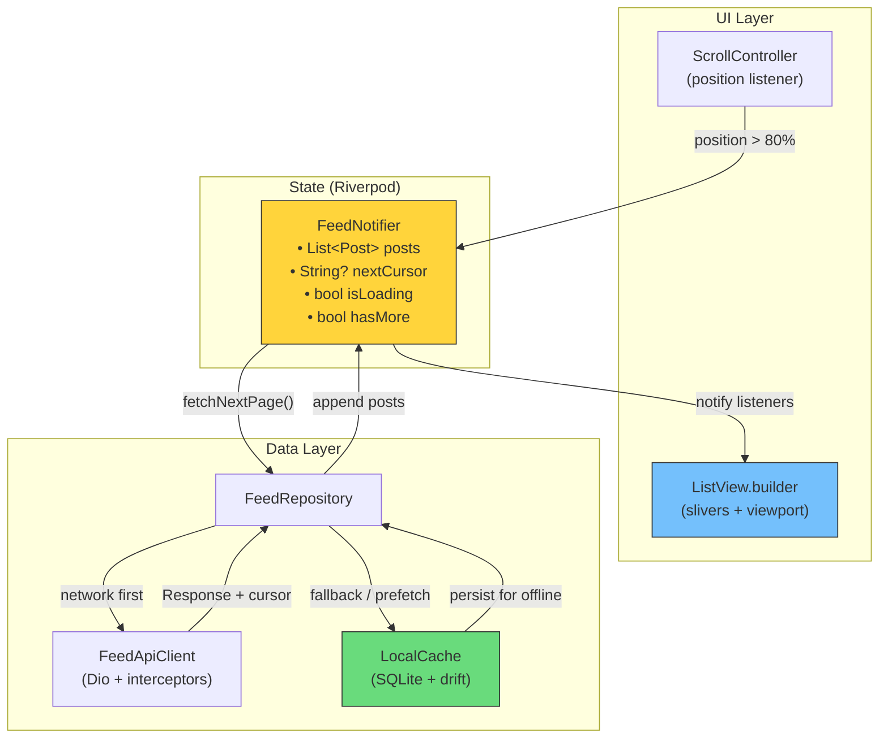
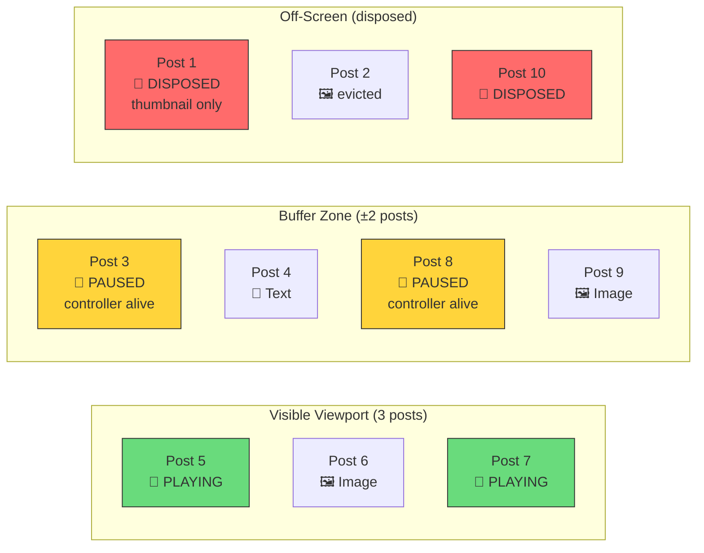
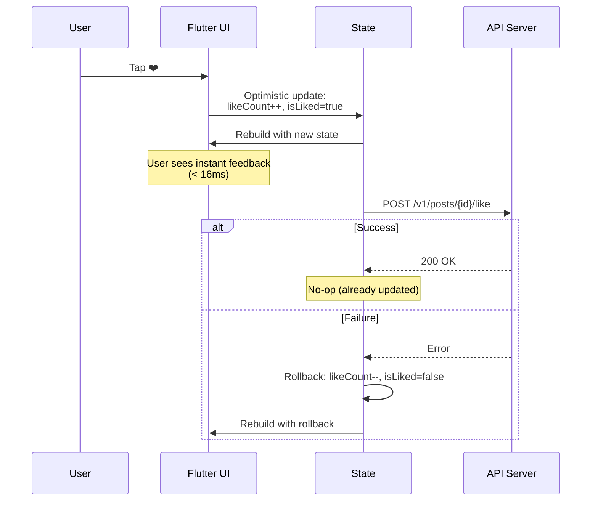
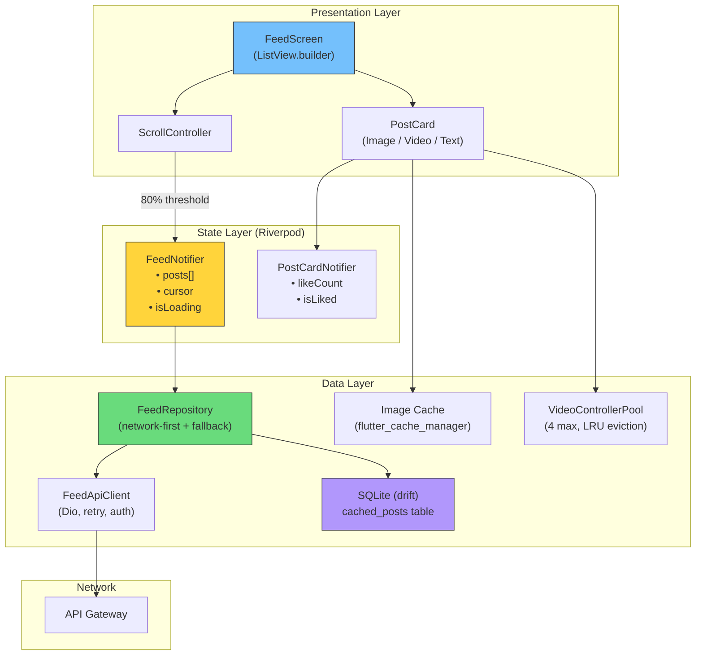

# 4. The Flutter Infinite Scroll Architecture 🟡

> **The Problem:** The user opens the app and sees a feed. They flick their thumb upward and posts stream endlessly — images load instantly, videos autoplay silently, and the scroll never stutters. Behind this seemingly simple UX lies a complex client architecture: cursor-based pagination, aggressive memory management (disposing off-screen video players that consume 50 MB each), local SQLite caching for offline-first behavior, and a state management strategy that keeps the UI buttery smooth at 60 fps.

---

## Why Not OFFSET-Based Pagination?

The server API is the contract between client and backend. The most common beginner mistake: using SQL `OFFSET` for pagination.

| | OFFSET-Based | Cursor-Based |
|---|---|---|
| API call | `GET /feed?page=3&size=20` | `GET /feed?cursor=eyJ0cyI6...&size=20` |
| Server query | `SELECT ... OFFSET 40 LIMIT 20` | `SELECT ... WHERE (ts, id) < (?, ?) LIMIT 20` |
| Performance | $O(N)$ — DB scans and discards OFFSET rows | $O(\log N)$ — index seek |
| Consistency | **Broken** — new posts shift items between pages | **Stable** — cursor is a fixed point in time |
| Duplicate posts? | Yes — when new posts push items to next page | No — cursor anchors to exact position |
| Deleted posts? | Yes — skipped items cause gaps | No — cursor skips over deleted items naturally |

### The Cursor Contract

The cursor is an opaque, base64-encoded token containing a `(timestamp, post_id)` tuple. The server returns it in every response:

```json
{
  "posts": [ ... ],
  "next_cursor": "eyJ0cyI6MTcxMTkzMjgwMCwiaWQiOjk5MDAxfQ==",
  "has_more": true
}
```

Decoded: `{"ts": 1711932800, "id": 99001}`

The server query using the cursor:

```sql
SELECT p.id, p.author_id, p.content, p.created_at, p.score
FROM ranked_feed p
WHERE p.user_id = $1
  AND (p.created_at, p.id) < ($2, $3)   -- cursor comparison
ORDER BY p.created_at DESC, p.id DESC
LIMIT $4;                                -- page_size
```

The `(created_at, id)` composite comparison ensures:
- Deterministic ordering even when timestamps collide.
- Index-only scan on `(user_id, created_at DESC, id DESC)`.

---

## Flutter Architecture: The Infinite List



### The ScrollController Trigger

The key to infinite scroll: detect when the user is **near the bottom** and fetch the next page before they reach it.

```dart
class FeedScreen extends ConsumerStatefulWidget {
  const FeedScreen({super.key});

  @override
  ConsumerState<FeedScreen> createState() => _FeedScreenState();
}

class _FeedScreenState extends ConsumerState<FeedScreen> {
  final _scrollController = ScrollController();

  @override
  void initState() {
    super.initState();
    _scrollController.addListener(_onScroll);
    // Load initial page
    ref.read(feedNotifierProvider.notifier).fetchNextPage();
  }

  void _onScroll() {
    final maxScroll = _scrollController.position.maxScrollExtent;
    final currentScroll = _scrollController.position.pixels;
    // Trigger fetch when 80% scrolled
    if (currentScroll >= maxScroll * 0.8) {
      ref.read(feedNotifierProvider.notifier).fetchNextPage();
    }
  }

  @override
  void dispose() {
    _scrollController.dispose();
    super.dispose();
  }

  @override
  Widget build(BuildContext context) {
    final feedState = ref.watch(feedNotifierProvider);

    return RefreshIndicator(
      onRefresh: () =>
          ref.read(feedNotifierProvider.notifier).refresh(),
      child: ListView.builder(
        controller: _scrollController,
        itemCount: feedState.posts.length + (feedState.hasMore ? 1 : 0),
        itemBuilder: (context, index) {
          if (index >= feedState.posts.length) {
            return const Center(child: CircularProgressIndicator());
          }
          return PostCard(post: feedState.posts[index]);
        },
      ),
    );
  }
}
```

### The FeedNotifier (Riverpod)

```dart
import 'package:riverpod_annotation/riverpod_annotation.dart';

part 'feed_notifier.g.dart';

class FeedState {
  final List<Post> posts;
  final String? nextCursor;
  final bool isLoading;
  final bool hasMore;

  const FeedState({
    this.posts = const [],
    this.nextCursor,
    this.isLoading = false,
    this.hasMore = true,
  });

  FeedState copyWith({
    List<Post>? posts,
    String? nextCursor,
    bool? isLoading,
    bool? hasMore,
  }) =>
      FeedState(
        posts: posts ?? this.posts,
        nextCursor: nextCursor ?? this.nextCursor,
        isLoading: isLoading ?? this.isLoading,
        hasMore: hasMore ?? this.hasMore,
      );
}

@riverpod
class FeedNotifier extends _$FeedNotifier {
  @override
  FeedState build() => const FeedState();

  Future<void> fetchNextPage() async {
    if (state.isLoading || !state.hasMore) return;
    state = state.copyWith(isLoading: true);

    try {
      final repo = ref.read(feedRepositoryProvider);
      final response = await repo.getFeed(
        cursor: state.nextCursor,
        pageSize: 20,
      );

      state = state.copyWith(
        posts: [...state.posts, ...response.posts],
        nextCursor: response.nextCursor,
        isLoading: false,
        hasMore: response.hasMore,
      );
    } catch (e) {
      state = state.copyWith(isLoading: false);
      // Error handling: show snackbar, retry logic, etc.
    }
  }

  Future<void> refresh() async {
    state = const FeedState(); // Reset state
    await fetchNextPage();
  }
}
```

---

## Memory Management: The Real Challenge

A social feed with mixed media is a **memory minefield**:

| Content Type | Memory per Item | Danger |
|---|---|---|
| Text-only post | ~2 KB | None |
| Single image (decoded) | 2–8 MB | Moderate |
| Image carousel (5 images) | 10–40 MB | High |
| Video player (initialized) | 30–80 MB | **Critical** |
| Video player (buffered, playing) | 50–150 MB | **Catastrophic** |

A user scrolling through 100 posts with 20 videos would consume **1–3 GB of RAM** without mitigation. iOS will kill the app at ~1.5 GB; Android gets aggressive at ~800 MB.

### Strategy 1: Dispose Off-Screen Video Players



```dart
class VideoPostCard extends StatefulWidget {
  final Post post;
  const VideoPostCard({super.key, required this.post});

  @override
  State<VideoPostCard> createState() => _VideoPostCardState();
}

class _VideoPostCardState extends State<VideoPostCard>
    with AutomaticKeepAliveClientMixin {
  VideoPlayerController? _controller;
  bool _isVisible = false;

  @override
  bool get wantKeepAlive => false; // Allow disposal when off-screen

  @override
  void dispose() {
    _controller?.dispose();
    super.dispose();
  }

  void _onVisibilityChanged(VisibilityInfo info) {
    final visible = info.visibleFraction > 0.5;
    if (visible && !_isVisible) {
      _initializePlayer();
    } else if (!visible && _isVisible) {
      _disposePlayer();
    }
    _isVisible = visible;
  }

  Future<void> _initializePlayer() async {
    _controller = VideoPlayerController.networkUrl(
      Uri.parse(widget.post.videoUrl!),
    );
    await _controller!.initialize();
    _controller!.setLooping(true);
    _controller!.setVolume(0); // Autoplay muted
    _controller!.play();
    if (mounted) setState(() {});
  }

  void _disposePlayer() {
    _controller?.dispose();
    _controller = null;
    if (mounted) setState(() {});
  }

  @override
  Widget build(BuildContext context) {
    super.build(context);
    return VisibilityDetector(
      key: Key('video-${widget.post.id}'),
      onVisibilityChanged: _onVisibilityChanged,
      child: AspectRatio(
        aspectRatio: 16 / 9,
        child: _controller?.value.isInitialized == true
            ? VideoPlayer(_controller!)
            : CachedNetworkImage(
                imageUrl: widget.post.thumbnailUrl!,
                fit: BoxFit.cover,
              ),
      ),
    );
  }
}
```

### Strategy 2: Image Cache with Size Limit

Use `cached_network_image` with a bounded cache:

```dart
// In your app initialization
import 'package:flutter_cache_manager/flutter_cache_manager.dart';

class FeedCacheManager extends CacheManager {
  static const key = 'feedImageCache';

  FeedCacheManager()
      : super(
          Config(
            key,
            maxNrOfCacheObjects: 200,        // Max 200 images
            stalePeriod: const Duration(days: 7),
          ),
        );
}
```

### Strategy 3: Pool Video Controllers

Instead of creating/destroying controllers, maintain a pool of 3–5 reusable controllers:

```dart
class VideoControllerPool {
  static const int maxControllers = 4;
  final _pool = <String, VideoPlayerController>{};
  final _lruOrder = <String>[];

  Future<VideoPlayerController> acquire(String url) async {
    if (_pool.containsKey(url)) {
      // Move to end of LRU
      _lruOrder.remove(url);
      _lruOrder.add(url);
      return _pool[url]!;
    }

    // Evict oldest if at capacity
    if (_pool.length >= maxControllers) {
      final oldest = _lruOrder.removeAt(0);
      await _pool.remove(oldest)?.dispose();
    }

    final controller = VideoPlayerController.networkUrl(Uri.parse(url));
    await controller.initialize();
    _pool[url] = controller;
    _lruOrder.add(url);
    return controller;
  }

  Future<void> disposeAll() async {
    for (final c in _pool.values) {
      await c.dispose();
    }
    _pool.clear();
    _lruOrder.clear();
  }
}
```

---

## Local SQLite Cache: Offline-First UX

When the user opens the app with no network, they should still see their last-loaded feed. We cache feed pages in SQLite (via `drift`):

### Schema

```dart
// Using drift (formerly moor) for type-safe SQLite
class CachedPosts extends Table {
  IntColumn get id => integer()();
  IntColumn get authorId => integer()();
  TextColumn get authorName => text()();
  TextColumn get authorAvatarUrl => text().nullable()();
  TextColumn get content => text()();
  TextColumn get imageUrls => text().nullable()();  // JSON array
  TextColumn get videoUrl => text().nullable()();
  TextColumn get thumbnailUrl => text().nullable()();
  IntColumn get likeCount => integer()();
  IntColumn get commentCount => integer()();
  DateTimeColumn get createdAt => dateTime()();
  IntColumn get feedPosition => integer()();  // Order in the feed
  DateTimeColumn get cachedAt => dateTime()();

  @override
  Set<Column> get primaryKey => {id};
}
```

### Cache Strategy: Network-First with Fallback

```dart
class FeedRepository {
  final FeedApiClient _api;
  final AppDatabase _db;

  FeedRepository(this._api, this._db);

  Future<FeedResponse> getFeed({
    String? cursor,
    int pageSize = 20,
  }) async {
    try {
      // 1. Try network first
      final response = await _api.getFeed(
        cursor: cursor,
        pageSize: pageSize,
      );

      // 2. Cache the response locally
      await _cacheResponse(response, isFirstPage: cursor == null);

      return response;
    } catch (e) {
      // 3. Fallback to local cache on network failure
      if (cursor == null) {
        // First page — return cached feed
        final cachedPosts = await _db.getCachedFeed(limit: pageSize);
        if (cachedPosts.isNotEmpty) {
          return FeedResponse(
            posts: cachedPosts,
            nextCursor: null,
            hasMore: false,  // Can't paginate offline
          );
        }
      }
      rethrow; // No cache available
    }
  }

  Future<void> _cacheResponse(
    FeedResponse response, {
    required bool isFirstPage,
  }) async {
    if (isFirstPage) {
      // Clear old cache on refresh
      await _db.clearCachedFeed();
    }
    await _db.insertCachedPosts(response.posts);
  }
}
```

---

## Optimistic UI Updates

When a user taps "Like", don't wait for the server response:



```dart
class PostCardNotifier extends StateNotifier<Post> {
  final FeedApiClient _api;

  PostCardNotifier(Post post, this._api) : super(post);

  Future<void> toggleLike() async {
    final wasLiked = state.isLiked;
    final oldCount = state.likeCount;

    // Optimistic update
    state = state.copyWith(
      isLiked: !wasLiked,
      likeCount: wasLiked ? oldCount - 1 : oldCount + 1,
    );

    try {
      if (wasLiked) {
        await _api.unlikePost(state.id);
      } else {
        await _api.likePost(state.id);
      }
    } catch (e) {
      // Rollback on failure
      state = state.copyWith(
        isLiked: wasLiked,
        likeCount: oldCount,
      );
    }
  }
}
```

---

## Performance Budget

| Metric | Target | How to Measure |
|---|---|---|
| First Contentful Paint | < 1.5s | Flutter DevTools timeline |
| Scroll frame budget | < 16.6ms (60 fps) | `SchedulerBinding.addTimingsCallback` |
| Memory (RSS) | < 400 MB | `dart:developer` + Xcode Instruments |
| Image decode time | < 50ms per image | `PaintingBinding.instantiateImageCodec` timing |
| Video player init | < 300ms | Custom Stopwatch around `initialize()` |
| Cache DB query | < 5ms | drift query logging |

### Jank Detection

```dart
void setupJankDetection() {
  SchedulerBinding.instance.addTimingsCallback((timings) {
    for (final timing in timings) {
      final buildDuration = timing.buildDuration.inMilliseconds;
      final rasterDuration = timing.rasterDuration.inMilliseconds;
      final totalFrame = timing.totalSpan.inMilliseconds;

      if (totalFrame > 16) {
        debugPrint(
          '⚠️ JANK: frame=${totalFrame}ms '
          'build=${buildDuration}ms '
          'raster=${rasterDuration}ms',
        );
      }
    }
  });
}
```

---

## The Full Client Architecture



---

> **Key Takeaways**
>
> 1. **Cursor-based pagination** is mandatory. OFFSET-based pagination causes duplicate and missing posts as the feed shifts. The cursor is an opaque `(timestamp, id)` tuple.
> 2. **Dispose off-screen video players aggressively.** Each initialized video controller consumes 30–80 MB. Use `VisibilityDetector` to init/dispose based on viewport position. Pool up to 4 controllers with LRU eviction.
> 3. **Cache the feed in SQLite** for offline-first UX. Network-first fetch with local fallback. Clear cache on refresh to prevent stale data.
> 4. **Optimistic UI updates** for likes/saves — update the state immediately, then fire the API call. Rollback only on failure. The user should never wait for a network round-trip.
> 5. **Monitor jank relentlessly.** Any frame over 16ms is a dropped frame. Use `SchedulerBinding.addTimingsCallback` to detect and log jank in production.
