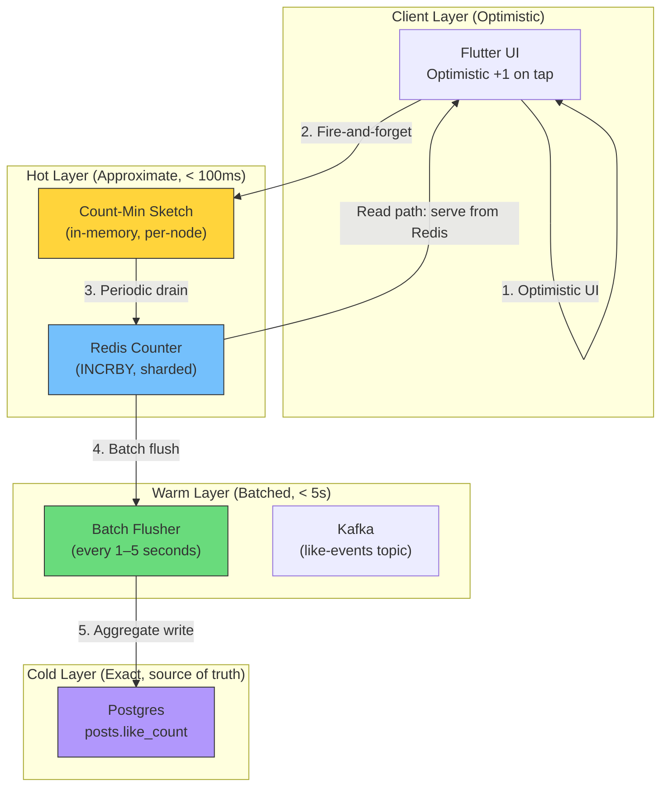
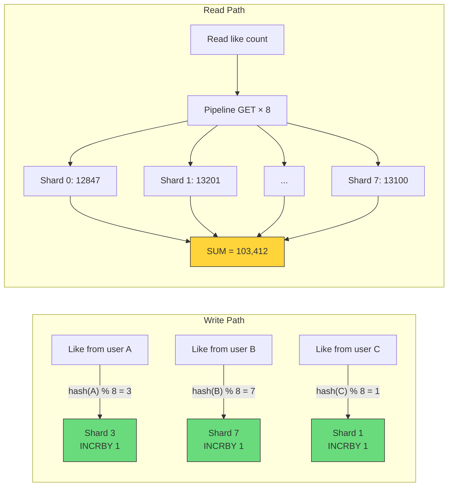
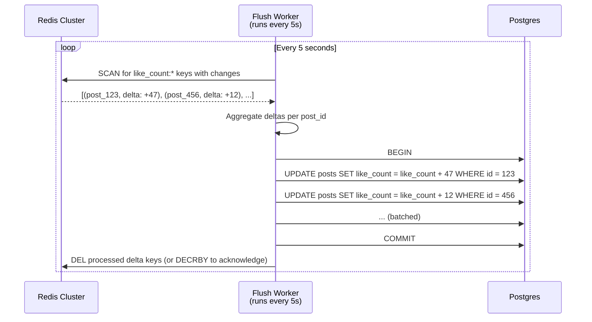
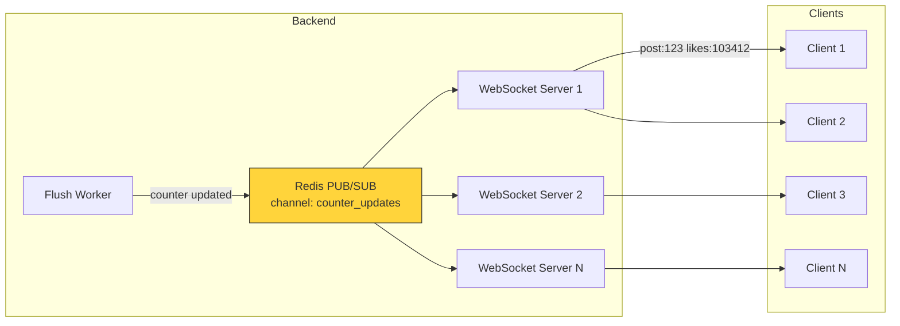
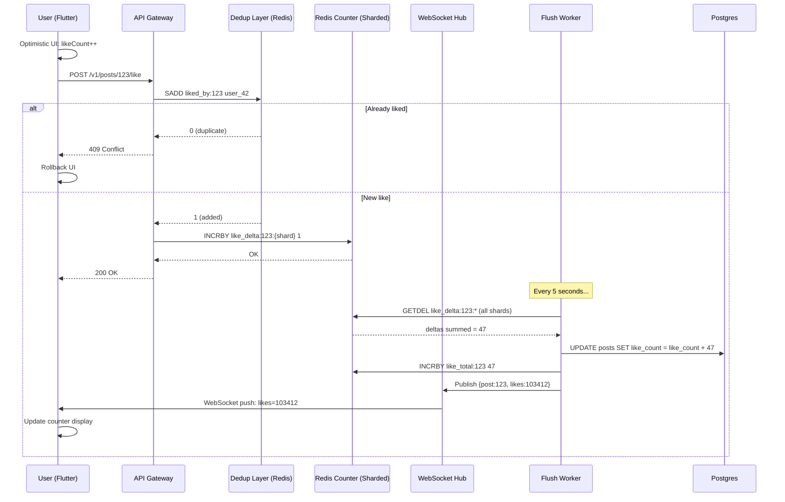

# 5. View-State Syncing and Ephemeral Counters 🔴

> **The Problem:** A celebrity posts a photo. Within 30 seconds, 2 million users are viewing it simultaneously. Each one sees a "Like" counter. When any of them taps the heart, every other viewer should see the count increment within a few seconds. Writing every single like directly to the database would generate 50,000 writes/sec on a single row — a guaranteed hot-key meltdown. How do you maintain the *illusion* of real-time accuracy without destroying your storage layer?

---

## The Anatomy of a Counter Problem

Let's quantify the challenge:

| Metric | Value |
|---|---|
| Peak concurrent viewers on a single post | 2,000,000 |
| Like rate on a viral post | 50,000 likes/second |
| Database write throughput (single row) | ~5,000 writes/sec (Postgres) |
| Required write amplification reduction | **10×** minimum |

The naïve approach — `UPDATE posts SET like_count = like_count + 1 WHERE id = ?` — creates:
1. **Row-level lock contention** on the `posts` row.
2. **WAL amplification** (every increment is a full-row write to the WAL).
3. **Replication lag** as the primary struggles to process the write queue.

---

## The Three-Layer Counter Architecture

The industry-standard solution separates concerns into three layers, each operating at a different consistency level:



| Layer | Latency | Consistency | Accuracy | Write Cost |
|---|---|---|---|---|
| Client (optimistic) | 0ms | Local only | ±1 (own action) | Zero |
| Count-Min Sketch | 1ms | Approximate | ±0.1% error | Zero (in-memory) |
| Redis Counter | 5ms | Eventually consistent | Exact (INCRBY is atomic) | 1 Redis op |
| Postgres | 1–5s delay | Strong (source of truth) | Exact | 1 SQL UPDATE (batched) |

---

## Count-Min Sketch: The Probabilistic Accumulator

A Count-Min Sketch (CMS) is a probabilistic data structure that answers "how many times has event X occurred?" with bounded overcount error and **zero undercount error**.

### How It Works

The CMS is a 2D array of counters with $d$ rows (hash functions) and $w$ columns:

```
         Column 0    Column 1    Column 2    ...    Column w-1
Row 0:  [   3    ] [   0    ] [   7    ] ...  [   1    ]
Row 1:  [   0    ] [   5    ] [   3    ] ...  [   0    ]
Row 2:  [   7    ] [   0    ] [   0    ] ...  [   2    ]
...
Row d-1:[   1    ] [   4    ] [   0    ] ...  [   6    ]
```

**Increment(post_id):** For each row $i$, compute $h_i(\text{post\_id}) \mod w$ and increment that cell.

**Query(post_id):** For each row $i$, read the cell at $h_i(\text{post\_id}) \mod w$. Return the **minimum** across all rows.

### Error Bounds

$$P\left[\hat{f}(x) - f(x) \geq \frac{\epsilon \cdot N}{1}\right] \leq \delta$$

With:
- $w = \lceil e / \epsilon \rceil$ columns (controls error rate)
- $d = \lceil \ln(1/\delta) \rceil$ rows (controls failure probability)
- $\epsilon = 0.001$ (0.1% error), $\delta = 0.01$ (99% confidence)
- $w = 2,718$, $d = 5$
- **Total memory:** $2,718 \times 5 \times 4$ bytes = **54 KB** per sketch

One 54 KB sketch tracks approximate like counts for **all posts** on a single server node.

### Rust Implementation

```rust
use std::hash::{Hash, Hasher};
use std::collections::hash_map::DefaultHasher;

/// A Count-Min Sketch for approximate frequency counting.
pub struct CountMinSketch {
    counters: Vec<Vec<u32>>,
    width: usize,
    depth: usize,
    seeds: Vec<u64>,
}

impl CountMinSketch {
    /// Create a new CMS with the given error rate (epsilon) and
    /// failure probability (delta).
    pub fn new(epsilon: f64, delta: f64) -> Self {
        let width = (std::f64::consts::E / epsilon).ceil() as usize;
        let depth = (1.0 / delta).ln().ceil() as usize;
        let seeds: Vec<u64> = (0..depth as u64).collect();
        let counters = vec![vec![0u32; width]; depth];
        Self { counters, width, depth, seeds }
    }

    /// Increment the count for a given key.
    pub fn increment(&mut self, key: u64) {
        for i in 0..self.depth {
            let col = self.hash(key, self.seeds[i]);
            self.counters[i][col] = self.counters[i][col].saturating_add(1);
        }
    }

    /// Query the approximate count for a given key.
    /// Returns a value >= true count (never undercounts).
    pub fn query(&self, key: u64) -> u32 {
        (0..self.depth)
            .map(|i| {
                let col = self.hash(key, self.seeds[i]);
                self.counters[i][col]
            })
            .min()
            .unwrap_or(0)
    }

    /// Drain all counts and return (key estimates are reset to 0).
    /// The caller should aggregate these into Redis.
    pub fn drain(&mut self) -> Vec<Vec<u32>> {
        let old = std::mem::replace(
            &mut self.counters,
            vec![vec![0u32; self.width]; self.depth],
        );
        old
    }

    fn hash(&self, key: u64, seed: u64) -> usize {
        let mut hasher = DefaultHasher::new();
        key.hash(&mut hasher);
        seed.hash(&mut hasher);
        (hasher.finish() as usize) % self.width
    }
}
```

### The CMS Limitation for Counters

CMS tracks **increments** well, but it cannot track **individual post counts** directly — it estimates frequency of events in a stream. For our use case, we use CMS as a **rate limiter and deduplication layer**, not as the counter itself. The actual counting happens in Redis.

The CMS serves two purposes:
1. **Deduplication:** Has this user already liked this post? Check CMS before hitting Redis. (Hash key = `user_id || post_id`.)
2. **Rate limiting:** Is this post receiving an anomalous spike? If CMS estimates > 10K likes/sec, apply throttling.

---

## Redis: The Real-Time Counter Layer

Redis `INCRBY` is atomic and single-threaded — perfect for counters. But a single Redis key receiving 50K writes/sec becomes a hot key.

### Sharded Counters

Split each counter into $N$ shards:

```
like_count:{post_id}:0  → 12,847
like_count:{post_id}:1  → 13,201
like_count:{post_id}:2  → 12,952
...
like_count:{post_id}:7  → 13,100

Total like count = SUM(all shards) = 103,412
```

**Write path:** `INCRBY like_count:{post_id}:{hash(user_id) % 8} 1`

**Read path:** Pipeline `GET like_count:{post_id}:0` through `GET like_count:{post_id}:7`, sum the results.



| N (shard count) | Max writes/sec per shard (50K total) | Read overhead |
|---|---|---|
| 1 | 50,000 (hot key!) | 1 GET |
| 4 | 12,500 | 4 GETs (pipelined) |
| 8 | 6,250 ✅ | 8 GETs (pipelined) |
| 16 | 3,125 | 16 GETs (pipelined, ~0.5ms) |

8 shards is the sweet spot: each shard handles ~6K writes/sec (well within Redis's per-key throughput), and the read pipeline completes in < 1ms.

### Rust: Sharded Redis Counter

```rust
use redis::AsyncCommands;

const NUM_SHARDS: u64 = 8;

/// Increment the like count for a post using sharded Redis counters.
async fn increment_like(
    redis: &mut redis::aio::MultiplexedConnection,
    post_id: u64,
    user_id: u64,
) -> anyhow::Result<()> {
    let shard = user_id % NUM_SHARDS;
    let key = format!("like_count:{post_id}:{shard}");
    redis.incr(&key, 1i64).await?;
    Ok(())
}

/// Read the total like count by summing all shards.
async fn get_like_count(
    redis: &mut redis::aio::MultiplexedConnection,
    post_id: u64,
) -> anyhow::Result<i64> {
    let mut pipe = redis::pipe();
    for shard in 0..NUM_SHARDS {
        let key = format!("like_count:{post_id}:{shard}");
        pipe.get(&key);
    }
    let results: Vec<Option<i64>> = pipe.query_async(redis).await?;
    Ok(results.into_iter().map(|v| v.unwrap_or(0)).sum())
}
```

---

## The Batch Flush Pipeline: Redis → Postgres

Redis is ephemeral. We need to periodically flush accumulated counts to Postgres (the source of truth):



### The Delta Pattern

Instead of storing absolute counts in Redis, we store **deltas since last flush**:

```
like_delta:{post_id}:{shard}  → uncommitted increment count
like_total:{post_id}          → last known total (from Postgres)
```

**On like:** `INCRBY like_delta:{post_id}:{shard} 1`

**On read:** `GET like_total:{post_id}` + `SUM(like_delta:{post_id}:*)` = displayed count

**On flush:**
1. Read all `like_delta:{post_id}:*` shards, sum them.
2. `UPDATE posts SET like_count = like_count + {sum} WHERE id = {post_id}`
3. `INCRBY like_total:{post_id} {sum}` (update the read cache).
4. Reset delta shards: `SET like_delta:{post_id}:{shard} 0` for each shard.

### Rust: Batch Flusher

```rust
use redis::AsyncCommands;
use sqlx::PgPool;

const FLUSH_INTERVAL: std::time::Duration = std::time::Duration::from_secs(5);
const BATCH_SIZE: usize = 500;

/// Continuously flush like deltas from Redis to Postgres.
async fn run_flush_loop(
    redis: &mut redis::aio::MultiplexedConnection,
    db: &PgPool,
) -> anyhow::Result<()> {
    let mut interval = tokio::time::interval(FLUSH_INTERVAL);
    loop {
        interval.tick().await;
        if let Err(e) = flush_batch(redis, db).await {
            tracing::error!("Flush failed: {e}");
        }
    }
}

async fn flush_batch(
    redis: &mut redis::aio::MultiplexedConnection,
    db: &PgPool,
) -> anyhow::Result<()> {
    // 1. Scan for all delta keys
    let keys: Vec<String> = redis::cmd("KEYS")
        .arg("like_delta:*")
        .query_async(redis)
        .await?;

    if keys.is_empty() {
        return Ok(());
    }

    // 2. Atomically read-and-reset deltas using GETDEL (Redis 6.2+)
    //    to prevent double-counting
    let mut deltas: std::collections::HashMap<u64, i64> =
        std::collections::HashMap::new();

    for key in &keys {
        let delta: Option<i64> = redis::cmd("GETDEL")
            .arg(key)
            .query_async(redis)
            .await?;

        if let Some(d) = delta {
            if d == 0 { continue; }
            // Parse post_id from "like_delta:{post_id}:{shard}"
            if let Some(post_id) = parse_post_id(key) {
                *deltas.entry(post_id).or_default() += d;
            }
        }
    }

    // 3. Batch UPDATE Postgres
    let mut tx = db.begin().await?;
    for (post_id, delta) in &deltas {
        sqlx::query!(
            "UPDATE posts SET like_count = like_count + $1 WHERE id = $2",
            delta,
            *post_id as i64,
        )
        .execute(&mut *tx)
        .await?;
    }
    tx.commit().await?;

    // 4. Update the read-cache totals in Redis
    let mut pipe = redis::pipe();
    for (post_id, delta) in &deltas {
        pipe.incr(format!("like_total:{post_id}"), *delta).ignore();
    }
    pipe.query_async(redis).await?;

    tracing::info!("Flushed {} post counter deltas", deltas.len());
    Ok(())
}

fn parse_post_id(key: &str) -> Option<u64> {
    // "like_delta:12345:3" → 12345
    key.split(':').nth(1)?.parse().ok()
}
```

---

## Deduplication: Preventing Double-Likes

A user must not be able to like the same post twice. We need a deduplication layer that is faster than querying Postgres.

### Approach: Redis Set + Bloom Filter

| Method | Memory (per post) | Lookup Time | False Positives? |
|---|---|---|---|
| Redis SET `liked:{post_id}` | $O(N)$ — 8 bytes × N likers | 1ms | No |
| Bloom Filter | Fixed (e.g., 1.2 KB for 100 items, 1% FPR) | 0.01ms | Yes (1%) |
| Postgres lookup | — | 5–20ms | No |

For viral posts (millions of likes), a Redis SET is too large. We use a **two-tier approach**:

1. **Hot posts (> 10K likes):** Bloom Filter per post, stored in Redis as a binary blob.
2. **Normal posts:** Redis SET (small enough to fit).

```rust
/// Check if a user has already liked a post.
/// Returns true if the like should be rejected (duplicate).
async fn is_duplicate_like(
    redis: &mut redis::aio::MultiplexedConnection,
    post_id: u64,
    user_id: u64,
) -> anyhow::Result<bool> {
    let set_key = format!("liked_by:{post_id}");

    // Use SISMEMBER for the common case (small sets)
    let is_member: bool = redis.sismember(&set_key, user_id).await?;
    if is_member {
        return Ok(true); // Duplicate
    }

    // Add to set (SADD returns 0 if already exists — atomic check-and-add)
    let added: i32 = redis.sadd(&set_key, user_id).await?;
    Ok(added == 0) // If 0, it was already there
}
```

---

## Real-Time Push: WebSocket Counter Updates

For viral posts viewed by millions simultaneously, polling is wasteful. We push counter updates via WebSocket:



### Throttled Updates

We don't push every single increment. Instead, we publish **coalesced updates** every 2 seconds:

```rust
use tokio::sync::broadcast;
use std::collections::HashMap;

struct CounterUpdateAggregator {
    pending: HashMap<u64, i64>,  // post_id → latest count
    tx: broadcast::Sender<CounterUpdate>,
}

#[derive(Clone, Debug)]
struct CounterUpdate {
    post_id: u64,
    like_count: i64,
}

impl CounterUpdateAggregator {
    fn new() -> Self {
        let (tx, _) = broadcast::channel(1024);
        Self { pending: HashMap::new(), tx }
    }

    /// Record a new count (called by the flush worker).
    fn record(&mut self, post_id: u64, count: i64) {
        self.pending.insert(post_id, count);
    }

    /// Publish all pending updates (called every 2 seconds).
    fn flush(&mut self) {
        for (post_id, like_count) in self.pending.drain() {
            let _ = self.tx.send(CounterUpdate { post_id, like_count });
        }
    }
}
```

### Flutter: Receiving Counter Updates

```dart
class CounterSyncService {
  final WebSocketChannel _channel;
  final Map<int, ValueNotifier<int>> _counters = {};

  CounterSyncService(this._channel) {
    _channel.stream.listen(_onMessage);
  }

  ValueNotifier<int> getCounter(int postId, int initialCount) {
    return _counters.putIfAbsent(
      postId,
      () => ValueNotifier(initialCount),
    );
  }

  void _onMessage(dynamic data) {
    final update = jsonDecode(data as String);
    final postId = update['post_id'] as int;
    final count = update['like_count'] as int;

    _counters[postId]?.value = count;
  }

  /// Subscribe to updates for visible posts only.
  void subscribe(List<int> visiblePostIds) {
    _channel.sink.add(jsonEncode({
      'action': 'subscribe',
      'post_ids': visiblePostIds,
    }));
  }

  /// Unsubscribe when posts scroll off-screen.
  void unsubscribe(List<int> offScreenPostIds) {
    _channel.sink.add(jsonEncode({
      'action': 'unsubscribe',
      'post_ids': offScreenPostIds,
    }));
  }
}
```

---

## End-to-End Like Flow



---

## Consistency Model: What the User Sees

| Scenario | What happens | Consistency |
|---|---|---|
| User likes, checks own count | Optimistic +1, confirmed by server | **Read-your-writes** |
| User B sees User A's like | 1–5 second delay (next flush cycle) | **Eventual (< 5s)** |
| Page refresh after 1 min | Postgres value (exact) via Redis total cache | **Strong** |
| Two users like simultaneously | Both succeed, both see incremented counts | **Last-writer-wins (commutative)** |

The critical insight: **humans cannot perceive a 2-second counter delay.** If the count shows 103,410 instead of 103,412 for two seconds, no user notices or cares. This is the trade-off that makes the entire architecture possible.

---

## Scaling Limits and Beyond

| Bottleneck | Threshold | Solution |
|---|---|---|
| Single Redis key hotspot | > 100K writes/sec | Increase shard count to 16–32 |
| Flush worker lag | > 10K posts with deltas | Parallelize flush workers by post-ID range |
| WebSocket fan-out | > 1M concurrent connections per server | Horizontally scale WS servers, use Redis PUB/SUB |
| Postgres update throughput | > 50K row updates/sec | Batch into fewer, larger transactions (500 rows per TX) |
| Bloom filter memory (viral posts) | > 10M likes on single post | Switch to scalable Bloom filter (growing chains) |

---

> **Key Takeaways**
>
> 1. **Never write counters directly to the database on every interaction.** Use a three-layer architecture: optimistic UI → Redis (sharded counters) → periodic batch flush to Postgres.
> 2. **Shard hot Redis keys.** Split each counter into 8 shards keyed by `hash(user_id) % 8`. This distributes 50K writes/sec across 8 keys at ~6K writes/sec each.
> 3. **Count-Min Sketches** are useful for rate-limiting and anomaly detection on the write path, not as the primary counter store. They provide bounded overcount with zero undercount.
> 4. **The batch flusher** runs every 1–5 seconds, aggregates deltas across all shards using `GETDEL`, and writes a single `UPDATE` per post to Postgres. This reduces 50K writes/sec to ~1 write/5sec per post.
> 5. **Eventual consistency is imperceptible** for counters. A 2-second delay between the true count and the displayed count is invisible to humans. This trade-off is the foundation of the entire design.
