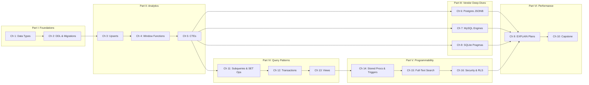

# The SQL Rosetta Stone: Mastering Postgres, MySQL, and SQLite

## Speaker Intro

I'm a Staff Database Administrator and Principal Data Architect with over fifteen years managing petabyte-scale PostgreSQL and MySQL clusters serving hundreds of thousands of queries per second, as well as deploying and tuning millions of embedded SQLite instances across mobile and edge devices. I've spent my career translating between SQL dialects at the boundary where "it works on my local SQLite" meets "it's now on fire in production Postgres." This book is the distilled knowledge from that journey — a comparative handbook that treats SQL not as a single language, but as a family of related dialects with deeply different philosophies.

## Who This Is For

- **Full-stack engineers** who rely on ORMs and want to understand the SQL generated beneath ActiveRecord, Prisma, SQLAlchemy, and Diesel
- **Backend developers** writing raw queries against Postgres or MySQL in production and tired of StackOverflow-driven debugging
- **Data engineers and analysts** who build ETL pipelines, reporting dashboards, and analytical queries across mixed database environments
- **Mobile/embedded developers** using SQLite as an application database who want to squeeze every ounce of performance from `PRAGMA` configurations and FTS5

## Prerequisites

| Concept | Where to Learn |
|---|---|
| Basic SQL (`SELECT`, `WHERE`, `JOIN`, `GROUP BY`) | Any introductory SQL tutorial |
| Relational model concepts (tables, rows, primary keys) | Database Systems textbooks or Khan Academy |
| Command-line comfort (running `psql`, `mysql`, `sqlite3`) | Your database's official Getting Started guide |
| Reading query results and understanding NULL semantics | Chapter 1 of this book covers the fundamentals |

## How to Use This Book

| Emoji | Meaning | Audience |
|---|---|---|
| 🟢 | **Standard SQL** — ANSI-compliant concepts that apply everywhere | Everyone; start here |
| 🟡 | **Advanced Analytics** — Window functions, CTEs, upserts | Intermediate+ developers |
| 🔴 | **Vendor-Specific Internals** — Execution plans, storage engines, pragmas | Senior engineers, DBAs |

Every chapter follows a strict structure: a learning objectives blockquote, comparative tables showing the same concept in all three dialects, performance-annotated code examples, a hands-on exercise with hidden solutions, and a key takeaways summary.

## Pacing Guide

| Chapters | Topic | Time | Checkpoint |
|---|---|---|---|
| 0–2 | Core Dialects, Types, DDL | 3–4 hours | You can create schemas in all three databases |
| 3–5 | Upserts, Window Functions, CTEs | 5–7 hours | You can write analytical queries without self-joins |
| 6–8 | Vendor-specific deep dives | 4–6 hours | You understand JSONB, InnoDB locking, and WAL mode |
| 11–13 | Subqueries, Transactions, Views | 5–7 hours | You can write safe, correct multi-statement workflows |
| 14–16 | Stored Procs, FTS, Security | 5–7 hours | You can build server-side logic and lock down access |
| 9–10 | EXPLAIN plans and Capstone | 4–6 hours | You can diagnose and optimize real production queries |
| Appendices | Reference Card + Migration Cookbook | Ongoing | Your permanent cheat sheets |

## Table of Contents

### Part I: The Core Dialects and Types
1. **Data Types and Strictness 🟢** — The fundamental divide between Postgres's strict typing, MySQL's implicit conversions, and SQLite's type affinity. Booleans, UUIDs, Enums, and how each engine stores and compares them.
2. **DDL and Migrations 🟢** — Creating tables, altering schemas, and defining constraints across the three dialects. Why SQLite's `ALTER TABLE` limitations force a "rename-recreate" pattern.

### Part II: Advanced Querying and Analytics
3. **The Rosetta Stone of Upserts 🟡** — Handling insert-or-update conflicts with Postgres `ON CONFLICT DO UPDATE`, MySQL `ON DUPLICATE KEY UPDATE`, and SQLite `INSERT ... ON CONFLICT`.
4. **Window Functions 🟡** — `ROW_NUMBER()`, `RANK()`, `DENSE_RANK()`, `LEAD()`, `LAG()`, and frame specifications. Rolling averages, running totals, and partitioned ranking without self-joins.
5. **Common Table Expressions (CTEs) 🟡** — Organizing complex queries with `WITH`. Recursive CTEs for hierarchical data: org charts, threaded comments, and bill-of-materials explosions.

### Part III: Vendor-Specific Superpowers
6. **Postgres: Arrays, JSONB, and PostGIS 🔴** — Using Postgres as a document database. JSONB operators, GIN indexes, array unnesting, and a primer on spatial queries.
7. **MySQL: Storage Engines and Locking 🔴** — InnoDB vs. MyISAM, gap locks, next-key locks, and reading MySQL's `EXPLAIN` output. Optimizing for concurrent writes.
8. **SQLite: Pragmas and In-Memory Magic 🔴** — WAL mode, in-memory databases, FTS5 full-text search, and tuning pragmas for concurrent access.

### Part IV: Query Patterns & Data Integrity
11. **Subqueries and SET Operations 🟡** — Scalar, row, and table subqueries. Correlated subqueries and `EXISTS` vs `IN`. UNION, INTERSECT, EXCEPT — and where each database diverges.
12. **Transactions and Isolation Levels 🟡** — ACID across all three engines. Savepoints, deadlock detection, and isolation level trade-offs from READ UNCOMMITTED through SERIALIZABLE.
13. **Views and Materialized Views 🟡** — Updatable views, `WITH CHECK OPTION`, Postgres materialized views, MySQL view algorithms, and SQLite view limitations.

### Part V: Programmability & Security
14. **Stored Procedures, Functions, and Triggers 🔴** — PL/pgSQL, MySQL stored routines, and SQLite's lack thereof. Triggers: BEFORE, AFTER, INSTEAD OF. When to use server-side logic vs application code.
15. **Full-Text Search Across Dialects 🔴** — Postgres `tsvector`/`tsquery`/GIN, MySQL `FULLTEXT` indexes, and SQLite FTS5. Ranking, relevance, and multilingual search.
16. **Security: Roles, Permissions, and Row-Level Security 🔴** — GRANT/REVOKE, role hierarchies, schema isolation, Postgres RLS policies, MySQL privilege system, and SQLite's trust model.

### Part VI: Performance & Capstone
9. **Reading the EXPLAIN Plan 🔴** — How to interpret `EXPLAIN ANALYZE` (Postgres), `EXPLAIN` (MySQL), and `EXPLAIN QUERY PLAN` (SQLite). Recognizing sequential scans, index-only scans, sorts, and hash joins.
10. **Capstone Project: The Multi-Tenant Analytics Dashboard 🔴** — A billion-row analytical query written in all three dialects. CTEs, window functions, date math, and index strategy combined.

### Appendices
A. **SQL Reference Card** — Cheat sheet for date/time functions, string manipulation, type casting, and regular expressions across Postgres, MySQL, and SQLite.
B. **Cross-Dialect Migration Cookbook** — Step-by-step recipes for migrating schemas and data between Postgres, MySQL, and SQLite, with type mappings and common pitfalls.



## Conventions Used in Code Examples

Throughout this book, you will see annotated SQL:

```sql
-- 💥 PERFORMANCE HAZARD: Full table scan due to function on indexed column
SELECT * FROM users WHERE LOWER(email) = 'alice@example.com';

-- ✅ FIX: Use a functional index or store pre-lowered values
SELECT * FROM users WHERE email_lower = 'alice@example.com';
```

When showing the same query in different dialects, we use labeled code blocks:

**Postgres:**
```sql
SELECT NOW();
```

**MySQL:**
```sql
SELECT NOW();
```

**SQLite:**
```sql
SELECT datetime('now');
```

## Companion Guides

This book pairs well with the following references in the Rust Training collection:

- [Rust Microservices: Axum, Tonic, Tower, and SQLx](../microservices-book/src/SUMMARY.md) — Using SQLx for compile-time checked SQL in Rust
- [Hardcore Distributed Systems](../distributed-systems-book/src/SUMMARY.md) — Consensus, replication, and transaction isolation at scale
- [The Rust Architect's Toolbox](../toolbox-book/src/SUMMARY.md) — Bytes, Nom, and data pipeline building blocks
