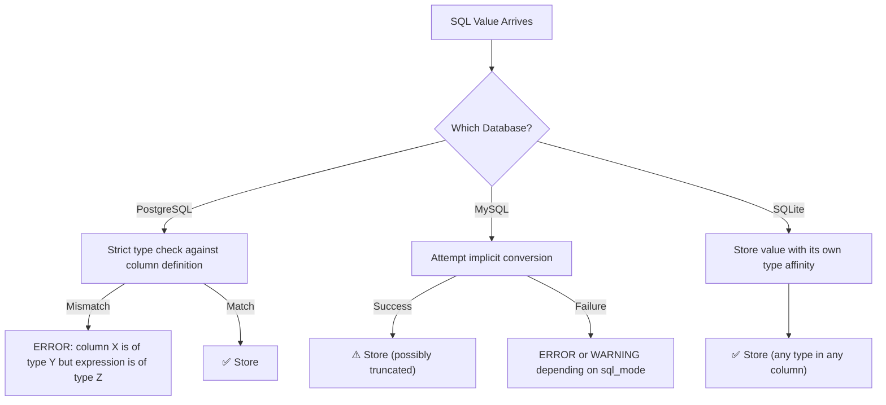

# Data Types and Strictness 🟢

> **What you'll learn:**
> - How Postgres, MySQL, and SQLite fundamentally differ in their type systems — strict vs. lenient vs. dynamic
> - The practical consequences of implicit type coercion and how it causes silent data corruption
> - How to correctly handle Booleans, UUIDs, Enums, and NULLs across all three databases
> - Type casting syntax and the portability traps you must avoid

---

## The Philosophical Divide

The single most important thing to understand before writing cross-database SQL is that **these three databases disagree about what a "type" even is**.

| Property | PostgreSQL | MySQL (InnoDB) | SQLite |
|---|---|---|---|
| **Type System** | Strict, strongly typed | Lenient with implicit conversions | Dynamic (type affinity) |
| **What happens on type mismatch** | ERROR raised immediately | Silent truncation or coercion (in non-strict mode) | Stores the value as-is; type is per-value |
| **NULL handling** | ANSI-compliant | ANSI-compliant (mostly) | ANSI-compliant |
| **Storage** | Fixed catalog of types + extensible | Fixed catalog of types | 5 storage classes: NULL, INTEGER, REAL, TEXT, BLOB |
| **Custom types** | `CREATE TYPE`, `CREATE DOMAIN` | `ENUM` only | Not supported |



## Numeric Types

| Concept | PostgreSQL | MySQL | SQLite |
|---|---|---|---|
| Small integer | `SMALLINT` (2 bytes) | `SMALLINT` (2 bytes) | `INTEGER` (dynamic, 1–8 bytes) |
| Standard integer | `INTEGER` (4 bytes) | `INT` (4 bytes) | `INTEGER` |
| Big integer | `BIGINT` (8 bytes) | `BIGINT` (8 bytes) | `INTEGER` |
| Auto-increment PK | `BIGSERIAL` or `GENERATED ALWAYS AS IDENTITY` | `INT AUTO_INCREMENT` | `INTEGER PRIMARY KEY` (implicit rowid) |
| Exact decimal | `NUMERIC(p,s)` / `DECIMAL(p,s)` | `DECIMAL(p,s)` | Stored as `TEXT` or `REAL` (no native decimal) |
| Floating point | `REAL` (4B), `DOUBLE PRECISION` (8B) | `FLOAT` (4B), `DOUBLE` (8B) | `REAL` (8-byte IEEE 754) |
| Money | `MONEY` (locale-aware) | `DECIMAL(19,4)` (convention) | Use `INTEGER` (store cents) |

### The Auto-Increment Trap

**PostgreSQL (modern):**
```sql
CREATE TABLE orders (
    id BIGINT GENERATED ALWAYS AS IDENTITY PRIMARY KEY,
    total NUMERIC(12,2) NOT NULL
);
```

**MySQL:**
```sql
CREATE TABLE orders (
    id BIGINT AUTO_INCREMENT PRIMARY KEY,
    total DECIMAL(12,2) NOT NULL
) ENGINE=InnoDB;
```

**SQLite:**
```sql
-- INTEGER PRIMARY KEY becomes the rowid alias automatically
CREATE TABLE orders (
    id INTEGER PRIMARY KEY,
    total REAL NOT NULL  -- ⚠️ No native DECIMAL; use INTEGER cents in production
);
```

> ⚠️ **SQLite gotcha:** `INTEGER PRIMARY KEY` is the *only* way to get auto-increment behavior. If you write `INT PRIMARY KEY` (without the full word `INTEGER`), SQLite treats it as a regular column with type affinity `INTEGER` but it will **not** alias to `rowid` and will **not** auto-increment.

## String Types

| Concept | PostgreSQL | MySQL | SQLite |
|---|---|---|---|
| Fixed-length | `CHAR(n)` | `CHAR(n)` (max 255) | `TEXT` (affinity only) |
| Variable-length | `VARCHAR(n)` or `TEXT` | `VARCHAR(n)` (max 65,535) | `TEXT` |
| Unlimited text | `TEXT` (up to 1 GB) | `TEXT` (64 KB), `MEDIUMTEXT` (16 MB), `LONGTEXT` (4 GB) | `TEXT` (up to `SQLITE_MAX_LENGTH`, default ~1 GB) |
| Binary data | `BYTEA` | `BLOB`, `MEDIUMBLOB`, `LONGBLOB` | `BLOB` |
| Collation default | `en_US.UTF-8` (OS locale) | `utf8mb4_0900_ai_ci` (MySQL 8) | `BINARY` (byte comparison) |

### String Concatenation — The Classic Portability Trap

```sql
-- 💥 PERFORMANCE HAZARD: This is NOT portable across databases
-- PostgreSQL uses ||, MySQL does NOT (|| means OR in MySQL by default)

-- PostgreSQL & SQLite:
SELECT first_name || ' ' || last_name AS full_name FROM users;

-- MySQL:
SELECT CONCAT(first_name, ' ', last_name) AS full_name FROM users;
```

```sql
-- ✅ FIX: Use CONCAT() everywhere if targeting MySQL
-- PostgreSQL and SQLite also support CONCAT() (Postgres since 9.1, SQLite 3.44+)
SELECT CONCAT(first_name, ' ', last_name) AS full_name FROM users;
```

> ⚠️ **MySQL trap:** By default, MySQL's `sql_mode` does NOT include `PIPES_AS_CONCAT`. The `||` operator is treated as logical OR, so `'hello' || 'world'` returns `0` in MySQL, not `'helloworld'`.

## Boolean Types

| Concept | PostgreSQL | MySQL | SQLite |
|---|---|---|---|
| Native boolean | `BOOLEAN` (1 byte, true/false) | `BOOLEAN` → alias for `TINYINT(1)` | No native boolean; use `INTEGER` (0/1) |
| TRUE literal | `TRUE`, `'t'`, `'true'`, `1` | `TRUE`, `1` | `1` |
| FALSE literal | `FALSE`, `'f'`, `'false'`, `0` | `FALSE`, `0` | `0` |
| Storage | 1 byte | 1 byte (`TINYINT`) | 1–8 bytes (`INTEGER`) |

```sql
-- PostgreSQL: TRUE is a first-class type
SELECT * FROM users WHERE is_active = TRUE;
SELECT * FROM users WHERE is_active;  -- Also valid

-- MySQL: BOOLEAN is really TINYINT(1)
SELECT * FROM users WHERE is_active = TRUE;  -- TRUE is 1
SELECT * FROM users WHERE is_active = 1;     -- Same thing
-- ⚠️ MySQL allows: INSERT INTO users (is_active) VALUES (42); -- Stores 42!

-- SQLite: Convention only
SELECT * FROM users WHERE is_active = 1;
-- ⚠️ SQLite allows: INSERT INTO users (is_active) VALUES ('banana'); -- Stores 'banana'!
```

## UUID Types

| Concept | PostgreSQL | MySQL | SQLite |
|---|---|---|---|
| Native UUID type | `UUID` (16 bytes, indexed efficiently) | None (use `CHAR(36)` or `BINARY(16)`) | None (use `TEXT` or `BLOB`) |
| Generation | `gen_random_uuid()` (built-in since v13) | `UUID()` (returns string) | Must use application layer |
| Indexing | B-tree on native `UUID` type | B-tree on `CHAR(36)` or `BINARY(16)` | B-tree on `TEXT` |

**PostgreSQL:**
```sql
CREATE TABLE sessions (
    id UUID DEFAULT gen_random_uuid() PRIMARY KEY,
    user_id INTEGER NOT NULL
);
```

**MySQL:**
```sql
-- Option A: Human-readable but 36 bytes on disk
CREATE TABLE sessions (
    id CHAR(36) DEFAULT (UUID()) PRIMARY KEY,
    user_id INT NOT NULL
) ENGINE=InnoDB;

-- Option B: Compact but requires BIN_TO_UUID() for display
CREATE TABLE sessions (
    id BINARY(16) DEFAULT (UUID_TO_BIN(UUID(), TRUE)) PRIMARY KEY,
    user_id INT NOT NULL
) ENGINE=InnoDB;
```

**SQLite:**
```sql
-- No built-in UUID generation; generate in application code
CREATE TABLE sessions (
    id TEXT PRIMARY KEY,  -- Store as '550e8400-e29b-41d4-a716-446655440000'
    user_id INTEGER NOT NULL
);
```

## Enum Types

| Concept | PostgreSQL | MySQL | SQLite |
|---|---|---|---|
| Native Enum | `CREATE TYPE status AS ENUM ('active', 'inactive')` | `ENUM('active','inactive')` (column-level) | None; use `TEXT` + `CHECK` |
| Adding a value | `ALTER TYPE status ADD VALUE 'pending'` | `ALTER TABLE t MODIFY col ENUM(...)` (full rewrite) | N/A |
| Storage | 4 bytes (internal OID) | 1–2 bytes (index into value list) | Dynamic (`TEXT`) |

**PostgreSQL:**
```sql
CREATE TYPE order_status AS ENUM ('pending', 'shipped', 'delivered', 'cancelled');

CREATE TABLE orders (
    id BIGINT GENERATED ALWAYS AS IDENTITY PRIMARY KEY,
    status order_status NOT NULL DEFAULT 'pending'
);

-- Adding a new value is DDL, but fast (no table rewrite):
ALTER TYPE order_status ADD VALUE 'refunded' AFTER 'cancelled';
```

**MySQL:**
```sql
CREATE TABLE orders (
    id BIGINT AUTO_INCREMENT PRIMARY KEY,
    status ENUM('pending', 'shipped', 'delivered', 'cancelled') NOT NULL DEFAULT 'pending'
) ENGINE=InnoDB;

-- ⚠️ Adding a new value requires ALTER TABLE (full table copy in some cases):
ALTER TABLE orders MODIFY COLUMN status
    ENUM('pending', 'shipped', 'delivered', 'cancelled', 'refunded')
    NOT NULL DEFAULT 'pending';
```

**SQLite:**
```sql
CREATE TABLE orders (
    id INTEGER PRIMARY KEY,
    status TEXT NOT NULL DEFAULT 'pending'
        CHECK (status IN ('pending', 'shipped', 'delivered', 'cancelled'))
);

-- ⚠️ Adding a new value requires the rename-recreate dance (covered in Ch 2)
```

## Date and Time Types

| Concept | PostgreSQL | MySQL | SQLite |
|---|---|---|---|
| Date only | `DATE` | `DATE` | `TEXT` (`'YYYY-MM-DD'`) or `INTEGER` (Unix epoch) |
| Time only | `TIME` | `TIME` | `TEXT` (`'HH:MM:SS'`) |
| Timestamp (no tz) | `TIMESTAMP` | `DATETIME` | `TEXT` (`'YYYY-MM-DD HH:MM:SS'`) |
| Timestamp (with tz) | `TIMESTAMPTZ` (stores UTC) | `TIMESTAMP` (converts to UTC) | `TEXT` with `'Z'` suffix |
| Interval | `INTERVAL` | None (use `DATE_ADD`) | None |
| Current timestamp | `NOW()` / `CURRENT_TIMESTAMP` | `NOW()` / `CURRENT_TIMESTAMP` | `datetime('now')` |

### Date Math — The Most Divergent Area

```sql
-- "Add 7 days to the current timestamp"

-- PostgreSQL: Type-safe interval arithmetic
SELECT NOW() + INTERVAL '7 days';

-- MySQL: DATE_ADD function
SELECT DATE_ADD(NOW(), INTERVAL 7 DAY);

-- SQLite: strftime/datetime modifiers
SELECT datetime('now', '+7 days');
```

```sql
-- "Days between two dates"

-- PostgreSQL:
SELECT date '2025-12-31' - date '2025-01-01';  -- Returns integer: 364

-- MySQL:
SELECT DATEDIFF('2025-12-31', '2025-01-01');    -- Returns integer: 364

-- SQLite:
SELECT julianday('2025-12-31') - julianday('2025-01-01');  -- Returns real: 364.0
```

## Type Casting

| Syntax | PostgreSQL | MySQL | SQLite |
|---|---|---|---|
| ANSI `CAST()` | ✅ `CAST(x AS INTEGER)` | ✅ `CAST(x AS SIGNED)` | ✅ `CAST(x AS INTEGER)` |
| Shorthand | `x::integer` | Not supported | Not supported |
| Implicit | Rarely (explicit preferred) | Aggressively | Always (affinity-based) |

```sql
-- 💥 PERFORMANCE HAZARD: Implicit casting bypasses index on Postgres
SELECT * FROM events WHERE created_at = '2025-06-15';
-- If created_at is TIMESTAMPTZ, this silently casts the string to TIMESTAMPTZ
-- and MAY use the index, but behavior differs if timezone is ambiguous

-- ✅ FIX: Explicit cast matches index type and intent
SELECT * FROM events
WHERE created_at >= '2025-06-15T00:00:00Z'::timestamptz
  AND created_at <  '2025-06-16T00:00:00Z'::timestamptz;
```

## NULL Semantics

All three databases follow ANSI SQL NULL semantics, but with edge cases:

| Operation | Result (All Three) | Notes |
|---|---|---|
| `NULL = NULL` | `NULL` (not TRUE) | Use `IS NULL` instead |
| `NULL <> 1` | `NULL` (not TRUE) | Use `IS DISTINCT FROM` (Postgres) |
| `NULL + 5` | `NULL` | Propagates through arithmetic |
| `COALESCE(NULL, 0)` | `0` | Portable across all three |
| `NULL` in `UNIQUE` index | Multiple NULLs allowed | Postgres, MySQL, **and** SQLite (since 3.9) |

```sql
-- Postgres-specific: IS DISTINCT FROM (NULL-safe comparison)
SELECT * FROM users WHERE email IS DISTINCT FROM 'alice@example.com';

-- MySQL equivalent: NULL-safe comparison operator
SELECT * FROM users WHERE NOT (email <=> 'alice@example.com');

-- SQLite equivalent: IS NOT
SELECT * FROM users WHERE email IS NOT 'alice@example.com';  -- Since SQLite 3.23
```

---

<details>
<summary><strong>🏋️ Exercise: The Type Compatibility Audit</strong> (click to expand)</summary>

You're migrating an application from SQLite (development) to PostgreSQL (production). The SQLite database has the following table:

```sql
CREATE TABLE products (
    id INTEGER PRIMARY KEY,
    name TEXT,
    price REAL,
    is_active INTEGER,
    metadata TEXT,            -- JSON stored as text
    created_at TEXT,          -- '2025-01-15 10:30:00'
    uuid TEXT                 -- '550e8400-e29b-41d4-a716-446655440000'
);
```

**Challenge:** Write the equivalent `CREATE TABLE` statement for **PostgreSQL** and **MySQL** that:
1. Uses the most appropriate native types for each column
2. Adds proper constraints (NOT NULL where sensible, CHECK constraints)
3. Uses native UUID generation for Postgres
4. Uses proper ENUM or BOOLEAN types where applicable

<details>
<summary>🔑 Solution</summary>

**PostgreSQL:**
```sql
CREATE TABLE products (
    id BIGINT GENERATED ALWAYS AS IDENTITY PRIMARY KEY,
    name TEXT NOT NULL,
    price NUMERIC(12,2) NOT NULL CHECK (price >= 0),
    is_active BOOLEAN NOT NULL DEFAULT TRUE,
    metadata JSONB DEFAULT '{}'::jsonb,
    created_at TIMESTAMPTZ NOT NULL DEFAULT NOW(),
    uuid UUID NOT NULL DEFAULT gen_random_uuid() UNIQUE
);
```

**MySQL:**
```sql
CREATE TABLE products (
    id BIGINT AUTO_INCREMENT PRIMARY KEY,
    name VARCHAR(255) NOT NULL,
    price DECIMAL(12,2) NOT NULL CHECK (price >= 0),
    is_active BOOLEAN NOT NULL DEFAULT TRUE,  -- Really TINYINT(1)
    metadata JSON DEFAULT (JSON_OBJECT()),
    created_at TIMESTAMP NOT NULL DEFAULT CURRENT_TIMESTAMP,
    uuid CHAR(36) NOT NULL DEFAULT (UUID()) UNIQUE
) ENGINE=InnoDB DEFAULT CHARSET=utf8mb4;
```

**SQLite (improved):**
```sql
CREATE TABLE products (
    id INTEGER PRIMARY KEY,
    name TEXT NOT NULL,
    price REAL NOT NULL CHECK (price >= 0),
    is_active INTEGER NOT NULL DEFAULT 1 CHECK (is_active IN (0, 1)),
    metadata TEXT DEFAULT '{}',
    created_at TEXT NOT NULL DEFAULT (datetime('now')),
    uuid TEXT NOT NULL UNIQUE
);
```

**Key differences to note:**
- PostgreSQL uses `JSONB` (binary, indexable) instead of `TEXT` for metadata
- PostgreSQL has native `UUID` with built-in generation
- MySQL's `BOOLEAN` is actually `TINYINT(1)` — it can store values like `42`
- SQLite requires a `CHECK` constraint to enforce boolean semantics
- PostgreSQL `NUMERIC` and MySQL `DECIMAL` are exact decimals; SQLite `REAL` is floating point

</details>
</details>

---

> **Key Takeaways**
> - PostgreSQL is the strictest: type mismatches raise errors, keeping your data clean but requiring explicit casts.
> - MySQL is lenient by default: enable `STRICT_TRANS_TABLES` and `STRICT_ALL_TABLES` in `sql_mode` to catch truncation and coercion errors.
> - SQLite has no type enforcement at all: any value can go in any column. The `CHECK` constraint is your only guardrail.
> - For portable SQL, use `CAST()` instead of Postgres `::` shorthand, `CONCAT()` instead of `||`, and `COALESCE()` for NULL handling.
> - Always test date/time queries on all target databases — this is where the dialects diverge most dramatically.
