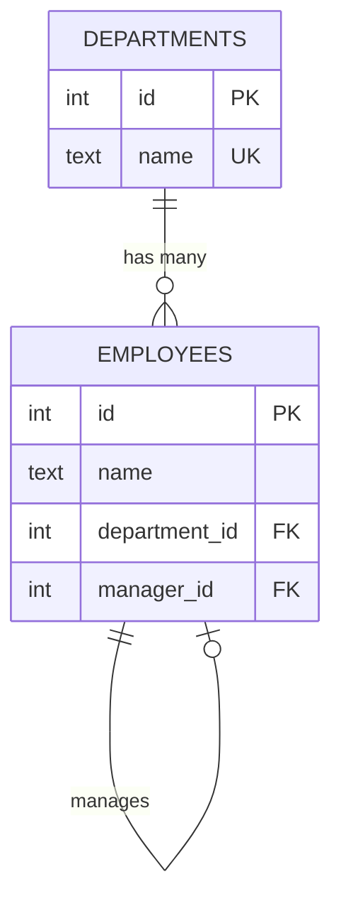

# DDL and Migrations 🟢

> **What you'll learn:**
> - How to create, alter, and drop tables with proper constraints across all three databases
> - The critical limitations of SQLite's `ALTER TABLE` and the "rename-recreate" migration pattern
> - How Primary Keys, Foreign Keys, Check Constraints, and Indexes differ in syntax and behavior
> - Migration strategies for zero-downtime schema changes in production

---

## CREATE TABLE — The Foundation

The basic `CREATE TABLE` syntax is nearly identical, but the details diverge sharply.

### Primary Key Strategies

| Strategy | PostgreSQL | MySQL | SQLite |
|---|---|---|---|
| Auto-increment integer | `GENERATED ALWAYS AS IDENTITY` | `AUTO_INCREMENT` | `INTEGER PRIMARY KEY` |
| UUID primary key | `UUID DEFAULT gen_random_uuid()` | `CHAR(36) DEFAULT (UUID())` | `TEXT` (app-generated) |
| Composite primary key | `PRIMARY KEY (a, b)` | `PRIMARY KEY (a, b)` | `PRIMARY KEY (a, b)` |
| Sequence-backed | `SERIAL` (legacy), `nextval()` | Only `AUTO_INCREMENT` | Only `rowid` alias |

```sql
-- PostgreSQL: Modern identity column
CREATE TABLE employees (
    id BIGINT GENERATED ALWAYS AS IDENTITY PRIMARY KEY,
    email TEXT NOT NULL UNIQUE,
    department_id INT NOT NULL,
    salary NUMERIC(10,2) NOT NULL CHECK (salary > 0),
    hired_at TIMESTAMPTZ NOT NULL DEFAULT NOW()
);

-- MySQL: AUTO_INCREMENT with InnoDB
CREATE TABLE employees (
    id BIGINT AUTO_INCREMENT PRIMARY KEY,
    email VARCHAR(255) NOT NULL UNIQUE,
    department_id INT NOT NULL,
    salary DECIMAL(10,2) NOT NULL CHECK (salary > 0),
    hired_at TIMESTAMP NOT NULL DEFAULT CURRENT_TIMESTAMP
) ENGINE=InnoDB DEFAULT CHARSET=utf8mb4;

-- SQLite: INTEGER PRIMARY KEY for rowid alias
CREATE TABLE employees (
    id INTEGER PRIMARY KEY,
    email TEXT NOT NULL UNIQUE,
    department_id INTEGER NOT NULL,
    salary REAL NOT NULL CHECK (salary > 0),
    hired_at TEXT NOT NULL DEFAULT (datetime('now'))
);
```

## Foreign Keys

| Behavior | PostgreSQL | MySQL (InnoDB) | SQLite |
|---|---|---|---|
| Enforced by default | ✅ Yes | ✅ Yes | ❌ **No** — must enable with PRAGMA |
| CASCADE actions | ✅ Full support | ✅ Full support | ✅ Full support (when enabled) |
| Deferred constraints | ✅ `DEFERRABLE INITIALLY DEFERRED` | ❌ Not supported | ✅ Supported |
| Self-referential FK | ✅ | ✅ | ✅ (when enabled) |

> ⚠️ **Critical SQLite gotcha:** Foreign keys are **disabled by default** in SQLite. You must execute `PRAGMA foreign_keys = ON;` at the start of every connection. This pragma is not persistent — it must be set per-connection.

```sql
-- SQLite: Foreign keys must be turned on explicitly
PRAGMA foreign_keys = ON;

CREATE TABLE departments (
    id INTEGER PRIMARY KEY,
    name TEXT NOT NULL UNIQUE
);

CREATE TABLE employees (
    id INTEGER PRIMARY KEY,
    name TEXT NOT NULL,
    department_id INTEGER NOT NULL
        REFERENCES departments(id) ON DELETE CASCADE,
    manager_id INTEGER
        REFERENCES employees(id) ON DELETE SET NULL
);
```



## Check Constraints

| Support | PostgreSQL | MySQL | SQLite |
|---|---|---|---|
| Column-level CHECK | ✅ Always enforced | ✅ Enforced (since 8.0.16) | ✅ Always enforced |
| Table-level CHECK | ✅ | ✅ (since 8.0.16) | ✅ |
| Subqueries in CHECK | ❌ | ❌ | ❌ |
| Function calls in CHECK | ✅ Immutable functions only | ❌ Limited | ✅ Built-in functions |

> ⚠️ **MySQL history:** Before MySQL 8.0.16, `CHECK` constraints were **parsed but silently ignored**. If you're on an older MySQL version, your CHECK constraints do absolutely nothing.

```sql
-- PostgreSQL: Rich CHECK constraints
CREATE TABLE products (
    id BIGINT GENERATED ALWAYS AS IDENTITY PRIMARY KEY,
    name TEXT NOT NULL,
    price NUMERIC(10,2) NOT NULL,
    discount_pct NUMERIC(5,2) NOT NULL DEFAULT 0,
    CONSTRAINT positive_price CHECK (price > 0),
    CONSTRAINT valid_discount CHECK (discount_pct >= 0 AND discount_pct <= 100),
    CONSTRAINT discount_less_than_price CHECK (price * (1 - discount_pct / 100) > 0)
);

-- MySQL: Same syntax, enforced since 8.0.16
CREATE TABLE products (
    id BIGINT AUTO_INCREMENT PRIMARY KEY,
    name VARCHAR(255) NOT NULL,
    price DECIMAL(10,2) NOT NULL,
    discount_pct DECIMAL(5,2) NOT NULL DEFAULT 0,
    CONSTRAINT positive_price CHECK (price > 0),
    CONSTRAINT valid_discount CHECK (discount_pct >= 0 AND discount_pct <= 100),
    CONSTRAINT discount_less_than_price CHECK (price * (1 - discount_pct / 100) > 0)
) ENGINE=InnoDB;

-- SQLite: Same syntax
CREATE TABLE products (
    id INTEGER PRIMARY KEY,
    name TEXT NOT NULL,
    price REAL NOT NULL,
    discount_pct REAL NOT NULL DEFAULT 0,
    CHECK (price > 0),
    CHECK (discount_pct >= 0 AND discount_pct <= 100),
    CHECK (price * (1 - discount_pct / 100) > 0)
);
```

## ALTER TABLE — The Great Divergence

This is where the three databases diverge the most dramatically.

| Operation | PostgreSQL | MySQL | SQLite |
|---|---|---|---|
| Add column | ✅ `ALTER TABLE t ADD COLUMN c TYPE` | ✅ `ALTER TABLE t ADD COLUMN c TYPE` | ✅ (since 3.2) |
| Drop column | ✅ `ALTER TABLE t DROP COLUMN c` | ✅ `ALTER TABLE t DROP COLUMN c` | ✅ (since **3.35**, 2021) |
| Rename column | ✅ `ALTER TABLE t RENAME COLUMN c TO d` | ✅ `ALTER TABLE t RENAME COLUMN c TO d` | ✅ (since 3.25) |
| Change column type | ✅ `ALTER TABLE t ALTER COLUMN c TYPE new` | ✅ `ALTER TABLE t MODIFY COLUMN c new` | ❌ **Not supported** |
| Add constraint | ✅ `ALTER TABLE t ADD CONSTRAINT ...` | ✅ `ALTER TABLE t ADD CONSTRAINT ...` | ❌ **Not supported** |
| Drop constraint | ✅ `ALTER TABLE t DROP CONSTRAINT c` | ✅ `ALTER TABLE t DROP FOREIGN KEY c` | ❌ **Not supported** |
| Add default | ✅ `ALTER TABLE t ALTER COLUMN c SET DEFAULT` | ✅ `ALTER TABLE t ALTER COLUMN c SET DEFAULT` | ❌ **Not supported** |
| Rename table | ✅ `ALTER TABLE t RENAME TO new_name` | ✅ `ALTER TABLE t RENAME TO new_name` | ✅ |

### The SQLite Rename-Recreate Pattern

When SQLite can't alter a table directly, you must use the **12-step migration pattern** from the official SQLite documentation:

```sql
-- Step 1: Begin a transaction
BEGIN TRANSACTION;

-- Step 2: Create the new table with the desired schema
CREATE TABLE employees_new (
    id INTEGER PRIMARY KEY,
    email TEXT NOT NULL UNIQUE,
    full_name TEXT NOT NULL,                    -- was 'name'
    department_id INTEGER NOT NULL
        REFERENCES departments(id),
    salary_cents INTEGER NOT NULL CHECK (salary_cents > 0),  -- was REAL
    hired_at TEXT NOT NULL DEFAULT (datetime('now')),
    is_active INTEGER NOT NULL DEFAULT 1 CHECK (is_active IN (0, 1))  -- new column
);

-- Step 3: Copy data from the old table, transforming as needed
INSERT INTO employees_new (id, email, full_name, department_id, salary_cents, hired_at, is_active)
SELECT id, email, name, department_id, CAST(salary * 100 AS INTEGER), hired_at, 1
FROM employees;

-- Step 4: Drop the old table
DROP TABLE employees;

-- Step 5: Rename the new table to the original name
ALTER TABLE employees_new RENAME TO employees;

-- Step 6: Recreate any indexes, triggers, and views
CREATE INDEX idx_employees_department ON employees(department_id);
CREATE INDEX idx_employees_email ON employees(email);

-- Step 7: Commit
COMMIT;
```

> **Why not just `ALTER TABLE`?** SQLite stores the entire `CREATE TABLE` statement as text in `sqlite_master`. Altering column types, adding constraints, or removing columns (pre-3.35) requires rewriting this definition, which means rebuilding the table.

## Indexes

| Index Type | PostgreSQL | MySQL (InnoDB) | SQLite |
|---|---|---|---|
| B-tree (default) | ✅ `CREATE INDEX` | ✅ `CREATE INDEX` | ✅ `CREATE INDEX` |
| Hash | ✅ `USING HASH` | ✅ `USING HASH` (memory tables) | ❌ |
| GIN (inverted) | ✅ `USING GIN` | ❌ (fulltext instead) | ❌ |
| GiST (generalized) | ✅ `USING GIST` | ❌ | ❌ |
| BRIN (block range) | ✅ `USING BRIN` | ❌ | ❌ |
| Partial index | ✅ `WHERE condition` | ❌ | ✅ `WHERE condition` |
| Expression index | ✅ `ON (LOWER(col))` | ✅ (since 8.0.13) | ✅ `ON (expr)` |
| Covering index | ✅ `INCLUDE (col)` | ✅ (implicit in composite) | ❌ |
| Fulltext | ✅ `USING GIN (to_tsvector())` | ✅ `FULLTEXT` | ✅ FTS5 (extension) |

### Index Creation Examples

```sql
-- PostgreSQL: Partial index — only index rows that matter
CREATE INDEX idx_active_users_email ON users (email)
    WHERE is_active = TRUE;
-- This index is smaller and faster than a full index

-- PostgreSQL: Expression index for case-insensitive search
CREATE INDEX idx_users_email_lower ON users (LOWER(email));

-- MySQL: Expression index (since 8.0.13)
CREATE INDEX idx_users_email_lower ON users ((LOWER(email)));
-- Note the double parentheses — MySQL requires them for expressions

-- SQLite: Partial index
CREATE INDEX idx_active_users_email ON users (email)
    WHERE is_active = 1;
```

```sql
-- 💥 PERFORMANCE HAZARD: Function on column prevents index use in MySQL < 8.0.13
SELECT * FROM users WHERE LOWER(email) = 'alice@example.com';

-- ✅ FIX (PostgreSQL): Create expression index
CREATE INDEX idx_users_email_lower ON users (LOWER(email));
SELECT * FROM users WHERE LOWER(email) = 'alice@example.com';  -- Uses the index

-- ✅ FIX (MySQL < 8.0.13): Generated column + index
ALTER TABLE users ADD COLUMN email_lower VARCHAR(255)
    GENERATED ALWAYS AS (LOWER(email)) STORED;
CREATE INDEX idx_users_email_lower ON users (email_lower);
```

## Temporary Tables

| Feature | PostgreSQL | MySQL | SQLite |
|---|---|---|---|
| Syntax | `CREATE TEMP TABLE t (...)` | `CREATE TEMPORARY TABLE t (...)` | `CREATE TEMP TABLE t (...)` |
| Visibility | Current session only | Current session only | Current connection only |
| Auto-cleanup | Dropped at end of session | Dropped at end of session | Dropped at end of connection |
| On-disk or in-memory | Configurable (`temp_tablespaces`) | In-memory then disk | In-memory (temp database) |

## Schema Inspection

| Task | PostgreSQL | MySQL | SQLite |
|---|---|---|---|
| List tables | `\dt` or `SELECT * FROM information_schema.tables` | `SHOW TABLES` or `information_schema.tables` | `.tables` or `SELECT name FROM sqlite_master WHERE type='table'` |
| Describe table | `\d tablename` or `information_schema.columns` | `DESCRIBE tablename` or `SHOW CREATE TABLE` | `.schema tablename` or `PRAGMA table_info(tablename)` |
| List indexes | `\di` or `pg_indexes` view | `SHOW INDEX FROM tablename` | `.indices tablename` or `PRAGMA index_list(tablename)` |

---

<details>
<summary><strong>🏋️ Exercise: The Cross-Database Migration</strong> (click to expand)</summary>

You have this PostgreSQL table in production:

```sql
CREATE TABLE audit_log (
    id BIGINT GENERATED ALWAYS AS IDENTITY PRIMARY KEY,
    user_id BIGINT NOT NULL REFERENCES users(id) ON DELETE CASCADE,
    action TEXT NOT NULL CHECK (action IN ('create', 'update', 'delete', 'login')),
    target_table TEXT NOT NULL,
    target_id BIGINT,
    payload JSONB DEFAULT '{}'::jsonb,
    created_at TIMESTAMPTZ NOT NULL DEFAULT NOW(),
    ip_address INET
);

CREATE INDEX idx_audit_user_action ON audit_log (user_id, action);
CREATE INDEX idx_audit_created ON audit_log (created_at DESC);
CREATE INDEX idx_audit_payload_gin ON audit_log USING GIN (payload);
```

**Challenge:** Write the equivalent `CREATE TABLE` and index statements for **MySQL** and **SQLite**, preserving as much functionality as possible. Document what you had to drop or approximate.

<details>
<summary>🔑 Solution</summary>

**MySQL:**
```sql
CREATE TABLE audit_log (
    id BIGINT AUTO_INCREMENT PRIMARY KEY,
    user_id BIGINT NOT NULL,
    action ENUM('create', 'update', 'delete', 'login') NOT NULL,
    target_table VARCHAR(255) NOT NULL,
    target_id BIGINT,
    payload JSON DEFAULT (JSON_OBJECT()),
    created_at TIMESTAMP NOT NULL DEFAULT CURRENT_TIMESTAMP,
    ip_address VARCHAR(45),  -- No native INET; VARCHAR fits IPv4 and IPv6
    FOREIGN KEY (user_id) REFERENCES users(id) ON DELETE CASCADE
) ENGINE=InnoDB DEFAULT CHARSET=utf8mb4;

CREATE INDEX idx_audit_user_action ON audit_log (user_id, action);
CREATE INDEX idx_audit_created ON audit_log (created_at DESC);
-- ⚠️ MySQL has no GIN index equivalent for JSON
-- Workaround: create a generated column and index it
ALTER TABLE audit_log
    ADD COLUMN payload_type VARCHAR(50) GENERATED ALWAYS AS (JSON_UNQUOTE(JSON_EXTRACT(payload, '$.type'))) STORED;
CREATE INDEX idx_audit_payload_type ON audit_log (payload_type);
```

**SQLite:**
```sql
PRAGMA foreign_keys = ON;

CREATE TABLE audit_log (
    id INTEGER PRIMARY KEY,
    user_id INTEGER NOT NULL REFERENCES users(id) ON DELETE CASCADE,
    action TEXT NOT NULL CHECK (action IN ('create', 'update', 'delete', 'login')),
    target_table TEXT NOT NULL,
    target_id INTEGER,
    payload TEXT DEFAULT '{}',   -- No native JSON type; stored as TEXT
    created_at TEXT NOT NULL DEFAULT (datetime('now')),
    ip_address TEXT               -- No native INET type
);

CREATE INDEX idx_audit_user_action ON audit_log (user_id, action);
CREATE INDEX idx_audit_created ON audit_log (created_at DESC);
-- ⚠️ No GIN index. For JSON querying, use json_extract() at query time:
-- SELECT * FROM audit_log WHERE json_extract(payload, '$.type') = 'order';
-- Consider an expression index if a specific path is queried frequently:
CREATE INDEX idx_audit_payload_type ON audit_log (json_extract(payload, '$.type'));
```

**What was lost:**
| Feature | MySQL Adaptation | SQLite Adaptation |
|---|---|---|
| `JSONB` (binary JSON) | `JSON` (text-based, no GIN) | `TEXT` + `json_extract()` |
| `INET` type | `VARCHAR(45)` | `TEXT` |
| GIN index on JSONB | Generated column + B-tree | Expression index on `json_extract()` |
| `TIMESTAMPTZ` | `TIMESTAMP` (auto UTC conversion) | `TEXT` (no timezone awareness) |
| Identity column | `AUTO_INCREMENT` | `INTEGER PRIMARY KEY` |

</details>
</details>

---

> **Key Takeaways**
> - PostgreSQL offers the richest DDL: partial indexes, expression indexes, GIN/GiST/BRIN, and deferred constraints.
> - MySQL has caught up significantly in 8.0+ (CHECK constraints, expression indexes) but still lacks partial indexes and deferred constraints.
> - SQLite's `ALTER TABLE` is the most limited — you'll need the rename-recreate pattern for any non-trivial schema change.
> - Always enable `PRAGMA foreign_keys = ON` for every SQLite connection — this is the #1 SQLite mistake.
> - When migrating between databases, build a "feature gap" table (like the one above) to document what you're losing or approximating.
