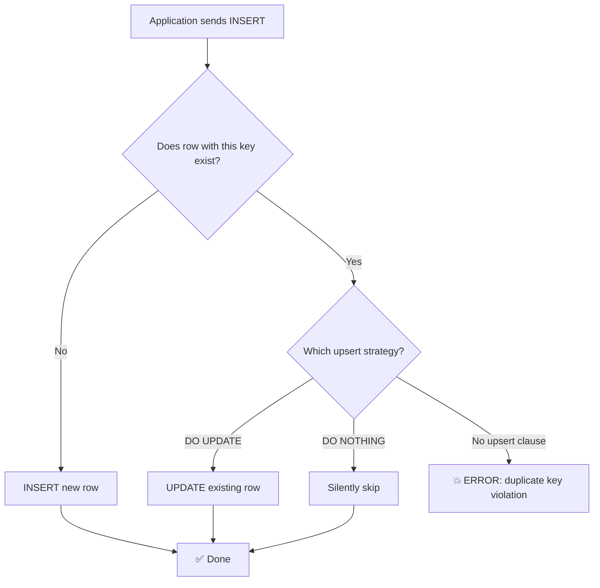

# The Rosetta Stone of Upserts 🟡

> **What you'll learn:**
> - How to perform "INSERT or UPDATE on conflict" (upsert) in all three databases
> - The subtle semantic differences between Postgres `ON CONFLICT`, MySQL `ON DUPLICATE KEY UPDATE`, and SQLite's upsert clause
> - How to handle bulk upserts efficiently and avoid common performance traps
> - The `MERGE` statement (ANSI SQL:2003) and why only some databases support it

---

## Why Upserts Matter

The "upsert" — insert a row if it doesn't exist, update it if it does — is one of the most common operations in application code. Without proper upsert syntax, you're forced into a read-then-write pattern that's both slow and vulnerable to race conditions.



## The Syntax Comparison

| Feature | PostgreSQL | MySQL | SQLite |
|---|---|---|---|
| Upsert syntax | `ON CONFLICT (col) DO UPDATE SET ...` | `ON DUPLICATE KEY UPDATE ...` | `ON CONFLICT (col) DO UPDATE SET ...` |
| Insert-or-ignore | `ON CONFLICT DO NOTHING` | `INSERT IGNORE INTO ...` | `INSERT OR IGNORE INTO ...` or `ON CONFLICT DO NOTHING` |
| Replace entirely | Not native (use `ON CONFLICT DO UPDATE`) | `REPLACE INTO ...` | `INSERT OR REPLACE INTO ...` |
| Conflict target | Explicit: must name column(s) or constraint | Implicit: uses `PRIMARY KEY` or any `UNIQUE` index | Explicit: must name column(s) or constraint |
| Access to new values | `EXCLUDED.column` | `VALUES(column)` (deprecated) / alias (8.0.19+) | `excluded.column` |
| Conditional upsert | `WHERE` clause on `DO UPDATE` | `IF()` in `SET` clause | `WHERE` clause on `DO UPDATE` |
| RETURNING clause | ✅ `RETURNING *` | ❌ Not supported | ✅ `RETURNING *` (since 3.35) |

## Basic Upsert — All Three Dialects

Consider a `user_settings` table where each user has exactly one row per setting key:

```sql
CREATE TABLE user_settings (
    user_id BIGINT NOT NULL,
    setting_key TEXT NOT NULL,
    setting_value TEXT,
    updated_at TIMESTAMP,
    PRIMARY KEY (user_id, setting_key)
);
```

### PostgreSQL

```sql
INSERT INTO user_settings (user_id, setting_key, setting_value, updated_at)
VALUES (42, 'theme', 'dark', NOW())
ON CONFLICT (user_id, setting_key)
DO UPDATE SET
    setting_value = EXCLUDED.setting_value,
    updated_at    = EXCLUDED.updated_at
RETURNING *;
```

Key details:
- `EXCLUDED` is a virtual table containing the row that was proposed for insertion
- The conflict target `(user_id, setting_key)` must match a unique index or primary key
- `RETURNING` gives you the final row state (inserted or updated)

### MySQL

```sql
-- MySQL 8.0.19+ with alias (recommended)
INSERT INTO user_settings (user_id, setting_key, setting_value, updated_at)
VALUES (42, 'theme', 'dark', NOW()) AS new_row
ON DUPLICATE KEY UPDATE
    setting_value = new_row.setting_value,
    updated_at    = new_row.updated_at;

-- MySQL < 8.0.19 (legacy, deprecated)
INSERT INTO user_settings (user_id, setting_key, setting_value, updated_at)
VALUES (42, 'theme', 'dark', NOW())
ON DUPLICATE KEY UPDATE
    setting_value = VALUES(setting_value),
    updated_at    = VALUES(updated_at);
```

Key details:
- No explicit conflict target — MySQL checks ALL unique indexes automatically
- `VALUES()` in the `SET` clause is deprecated in 8.0.20+; use the `AS alias` syntax
- No `RETURNING` clause — use `SELECT` after or `LAST_INSERT_ID()`
- `ROW_COUNT()` returns `1` for insert, `2` for update, `0` for no change

### SQLite

```sql
INSERT INTO user_settings (user_id, setting_key, setting_value, updated_at)
VALUES (42, 'theme', 'dark', datetime('now'))
ON CONFLICT (user_id, setting_key)
DO UPDATE SET
    setting_value = excluded.setting_value,
    updated_at    = excluded.updated_at
RETURNING *;
```

Key details:
- Syntax is nearly identical to PostgreSQL
- `excluded` is lowercase (convention; SQLite is case-insensitive for keywords)
- `RETURNING` supported since SQLite 3.35 (2021)

## Insert-or-Ignore — Skip Duplicates

Sometimes you just want to insert if the row doesn't exist and do nothing if it does.

**PostgreSQL:**
```sql
INSERT INTO user_settings (user_id, setting_key, setting_value, updated_at)
VALUES (42, 'theme', 'dark', NOW())
ON CONFLICT (user_id, setting_key) DO NOTHING;
```

**MySQL:**
```sql
INSERT IGNORE INTO user_settings (user_id, setting_key, setting_value, updated_at)
VALUES (42, 'theme', 'dark', NOW());
-- ⚠️ INSERT IGNORE suppresses ALL errors, not just duplicate key violations!
-- This includes type conversion warnings, NOT NULL violations, etc.
```

**SQLite:**
```sql
-- Option A: Modern syntax (recommended)
INSERT INTO user_settings (user_id, setting_key, setting_value, updated_at)
VALUES (42, 'theme', 'dark', datetime('now'))
ON CONFLICT (user_id, setting_key) DO NOTHING;

-- Option B: Legacy syntax
INSERT OR IGNORE INTO user_settings (user_id, setting_key, setting_value, updated_at)
VALUES (42, 'theme', 'dark', datetime('now'));
```

> ⚠️ **MySQL's `INSERT IGNORE` is dangerous.** It suppresses all errors, not just duplicate key violations. A data truncation that would normally be an error is silently ignored. Prefer using `ON DUPLICATE KEY UPDATE` with a no-op if you only want to handle duplicate keys:
> ```sql
> INSERT INTO user_settings (user_id, setting_key, setting_value, updated_at)
> VALUES (42, 'theme', 'dark', NOW()) AS new_row
> ON DUPLICATE KEY UPDATE setting_key = setting_key;  -- No-op update
> ```

## Replace / Full Row Replacement

| | PostgreSQL | MySQL | SQLite |
|---|---|---|---|
| `REPLACE` syntax | ❌ Not supported | ✅ `REPLACE INTO t (...) VALUES (...)` | ✅ `INSERT OR REPLACE INTO t (...) VALUES (...)` |
| Behavior | — | DELETE old row + INSERT new row | DELETE old row + INSERT new row |
| Triggers fired | — | DELETE + INSERT triggers | DELETE + INSERT triggers |
| Auto-increment | — | New ID assigned | New `rowid` assigned (unless `INTEGER PRIMARY KEY` specified) |

> ⚠️ **`REPLACE` is almost always wrong.** It deletes the entire row and re-inserts, which:
> 1. Changes the auto-increment ID (breaks foreign keys)
> 2. Fires DELETE triggers (unexpected side effects)
> 3. Resets any columns you didn't specify to their defaults
>
> **Use `ON CONFLICT DO UPDATE` instead.**

## Conditional Upserts — Update Only If Newer

A common pattern: only update the row if the incoming data is newer.

**PostgreSQL:**
```sql
INSERT INTO user_settings (user_id, setting_key, setting_value, updated_at)
VALUES (42, 'theme', 'dark', '2025-06-15T12:00:00Z')
ON CONFLICT (user_id, setting_key)
DO UPDATE SET
    setting_value = EXCLUDED.setting_value,
    updated_at    = EXCLUDED.updated_at
WHERE user_settings.updated_at < EXCLUDED.updated_at;
-- ✅ Only updates if the incoming timestamp is newer
```

**MySQL:**
```sql
INSERT INTO user_settings (user_id, setting_key, setting_value, updated_at)
VALUES (42, 'theme', 'dark', '2025-06-15 12:00:00') AS new_row
ON DUPLICATE KEY UPDATE
    setting_value = IF(updated_at < new_row.updated_at, new_row.setting_value, setting_value),
    updated_at    = IF(updated_at < new_row.updated_at, new_row.updated_at, updated_at);
```

**SQLite:**
```sql
INSERT INTO user_settings (user_id, setting_key, setting_value, updated_at)
VALUES (42, 'theme', 'dark', '2025-06-15T12:00:00')
ON CONFLICT (user_id, setting_key)
DO UPDATE SET
    setting_value = excluded.setting_value,
    updated_at    = excluded.updated_at
WHERE user_settings.updated_at < excluded.updated_at;
```

## Bulk Upserts — Performance Considerations

When upserting thousands of rows:

**PostgreSQL:**
```sql
-- ✅ Batch upsert using unnest (very fast for large batches)
INSERT INTO user_settings (user_id, setting_key, setting_value, updated_at)
SELECT * FROM unnest(
    ARRAY[42, 42, 43],              -- user_ids
    ARRAY['theme', 'lang', 'theme'], -- keys
    ARRAY['dark', 'en', 'light'],    -- values
    ARRAY[NOW(), NOW(), NOW()]       -- timestamps
)
ON CONFLICT (user_id, setting_key)
DO UPDATE SET
    setting_value = EXCLUDED.setting_value,
    updated_at = EXCLUDED.updated_at;
```

**MySQL:**
```sql
-- ✅ Multi-row VALUES with ON DUPLICATE KEY UPDATE
INSERT INTO user_settings (user_id, setting_key, setting_value, updated_at)
VALUES
    (42, 'theme', 'dark', NOW()),
    (42, 'lang', 'en', NOW()),
    (43, 'theme', 'light', NOW())
AS new_rows
ON DUPLICATE KEY UPDATE
    setting_value = new_rows.setting_value,
    updated_at = new_rows.updated_at;
```

**SQLite:**
```sql
-- ✅ Multi-row VALUES with ON CONFLICT
INSERT INTO user_settings (user_id, setting_key, setting_value, updated_at)
VALUES
    (42, 'theme', 'dark', datetime('now')),
    (42, 'lang', 'en', datetime('now')),
    (43, 'theme', 'light', datetime('now'))
ON CONFLICT (user_id, setting_key)
DO UPDATE SET
    setting_value = excluded.setting_value,
    updated_at = excluded.updated_at;
```

```sql
-- 💥 PERFORMANCE HAZARD: Upserting rows one at a time in a loop
-- Application code that runs 10,000 individual INSERT ... ON CONFLICT statements
-- Each one is a separate round-trip to the database

-- ✅ FIX: Batch into a single statement with multi-row VALUES
-- Or use COPY (Postgres) / LOAD DATA INFILE (MySQL) for massive imports,
-- then do a single INSERT ... ON CONFLICT ... SELECT from the staging table
```

## The MERGE Statement (ANSI SQL:2003)

The SQL standard defines `MERGE` for upsert logic, but support is inconsistent:

| Database | `MERGE` Support |
|---|---|
| PostgreSQL | ✅ Since v15 (2022) |
| MySQL | ❌ Not supported |
| SQLite | ❌ Not supported |

**PostgreSQL (v15+):**
```sql
MERGE INTO user_settings AS target
USING (VALUES (42, 'theme', 'dark', NOW())) AS source(user_id, setting_key, setting_value, updated_at)
ON target.user_id = source.user_id AND target.setting_key = source.setting_key
WHEN MATCHED THEN
    UPDATE SET setting_value = source.setting_value, updated_at = source.updated_at
WHEN NOT MATCHED THEN
    INSERT (user_id, setting_key, setting_value, updated_at)
    VALUES (source.user_id, source.setting_key, source.setting_value, source.updated_at);
```

> While `MERGE` is the ANSI standard, in practice `ON CONFLICT DO UPDATE` (Postgres/SQLite) and `ON DUPLICATE KEY UPDATE` (MySQL) are more widely used and better optimized.

---

<details>
<summary><strong>🏋️ Exercise: The Leaderboard Sync</strong> (click to expand)</summary>

You're building a gaming leaderboard. Scores come from a message queue and may arrive out of order. The table:

```sql
-- Schema (use appropriate types per database)
CREATE TABLE leaderboard (
    player_id BIGINT NOT NULL,
    game_id BIGINT NOT NULL,
    score INTEGER NOT NULL,
    achieved_at TIMESTAMP NOT NULL,
    PRIMARY KEY (player_id, game_id)
);
```

**Challenge:** Write an upsert query that:
1. Inserts a new score if the player hasn't played this game before
2. Updates ONLY if the new score is **higher** than the existing one
3. Returns the final row after the operation

Write the query in all three dialects.

<details>
<summary>🔑 Solution</summary>

**PostgreSQL:**
```sql
INSERT INTO leaderboard (player_id, game_id, score, achieved_at)
VALUES (1001, 5, 9500, NOW())
ON CONFLICT (player_id, game_id)
DO UPDATE SET
    score       = EXCLUDED.score,
    achieved_at = EXCLUDED.achieved_at
WHERE leaderboard.score < EXCLUDED.score
RETURNING *;
```
If the existing score is 9600, no update occurs and `RETURNING` returns zero rows.

**MySQL:**
```sql
INSERT INTO leaderboard (player_id, game_id, score, achieved_at)
VALUES (1001, 5, 9500, NOW()) AS new_row
ON DUPLICATE KEY UPDATE
    score       = IF(score < new_row.score, new_row.score, score),
    achieved_at = IF(score < new_row.score, new_row.achieved_at, achieved_at);
-- ⚠️ Note: MySQL always reports an "update" even if values didn't change
-- No RETURNING clause; follow up with:
SELECT * FROM leaderboard WHERE player_id = 1001 AND game_id = 5;
```

**SQLite:**
```sql
INSERT INTO leaderboard (player_id, game_id, score, achieved_at)
VALUES (1001, 5, 9500, datetime('now'))
ON CONFLICT (player_id, game_id)
DO UPDATE SET
    score       = excluded.score,
    achieved_at = excluded.achieved_at
WHERE leaderboard.score < excluded.score
RETURNING *;
```

**Key difference:** PostgreSQL and SQLite support a `WHERE` clause on the `DO UPDATE`, which means the update is truly conditional — if the condition fails, no update occurs and no row is returned. MySQL must use an `IF()` expression, which always performs an "update" (even if the values don't change), affecting `ROW_COUNT()`.

</details>
</details>

---

> **Key Takeaways**
> - PostgreSQL and SQLite share nearly identical upsert syntax with `ON CONFLICT ... DO UPDATE SET ... = EXCLUDED.col`.
> - MySQL uses `ON DUPLICATE KEY UPDATE` with no explicit conflict target — it checks all unique constraints.
> - Avoid `REPLACE INTO` — it deletes and re-inserts, causing cascading FK deletes and new auto-increment IDs.
> - Avoid MySQL's `INSERT IGNORE` — it suppresses all errors, not just duplicate key violations.
> - For conditional upserts (update only if newer/higher), use `WHERE` on `DO UPDATE` (Postgres/SQLite) or `IF()` expressions (MySQL).
> - Batch your upserts into multi-row `VALUES` clauses for dramatically better performance.
