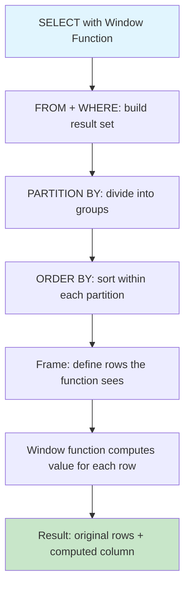

# Window Functions 🟡

> **What you'll learn:**
> - How to use `ROW_NUMBER()`, `RANK()`, `DENSE_RANK()`, `NTILE()`, `LEAD()`, and `LAG()` to perform analytics without self-joins
> - The difference between `PARTITION BY` and `ORDER BY` inside the `OVER()` clause
> - Frame specifications (`ROWS BETWEEN`, `RANGE BETWEEN`) for rolling averages and running totals
> - Portability status of window functions across Postgres, MySQL, and SQLite

---

## What Are Window Functions?

Window functions perform calculations across a set of rows that are related to the current row — without collapsing those rows into a single output like `GROUP BY` does. They let you answer questions like "What rank is this row within its group?" or "What was the previous row's value?" in a single pass.

| Feature | PostgreSQL | MySQL | SQLite |
|---|---|---|---|
| Window functions supported | ✅ Since 8.4 (2009) | ✅ Since 8.0 (2018) | ✅ Since 3.25 (2018) |
| `ROW_NUMBER()` | ✅ | ✅ | ✅ |
| `RANK()` / `DENSE_RANK()` | ✅ | ✅ | ✅ |
| `LEAD()` / `LAG()` | ✅ | ✅ | ✅ |
| `NTILE()` | ✅ | ✅ | ✅ |
| `FIRST_VALUE()` / `LAST_VALUE()` | ✅ | ✅ | ✅ |
| `NTH_VALUE()` | ✅ | ✅ | ✅ |
| Named window (`WINDOW w AS (...)`) | ✅ | ✅ | ✅ |
| `FILTER` clause on aggregates | ✅ | ❌ | ✅ (since 3.30) |
| `GROUPS` frame type | ✅ | ✅ | ✅ |

> Window functions are one of the most **portable** areas of SQL. The syntax is nearly identical across all three databases.



## The Ranking Family

### Setup — Sample Data

```sql
CREATE TABLE sales (
    id INTEGER PRIMARY KEY,
    salesperson TEXT NOT NULL,
    region TEXT NOT NULL,
    amount NUMERIC NOT NULL,
    sale_date DATE NOT NULL
);

INSERT INTO sales (id, salesperson, region, amount, sale_date) VALUES
(1,  'Alice',   'North', 15000, '2025-01-15'),
(2,  'Bob',     'North', 12000, '2025-01-20'),
(3,  'Charlie', 'South', 18000, '2025-01-10'),
(4,  'Alice',   'North', 15000, '2025-02-05'),
(5,  'Diana',   'South', 22000, '2025-02-12'),
(6,  'Bob',     'North', 9000,  '2025-02-18'),
(7,  'Charlie', 'South', 18000, '2025-03-01'),
(8,  'Diana',   'South', 25000, '2025-03-10'),
(9,  'Alice',   'North', 20000, '2025-03-15'),
(10, 'Bob',     'North', 20000, '2025-03-20');
```

### ROW_NUMBER(), RANK(), and DENSE_RANK()

```sql
-- This query is IDENTICAL in PostgreSQL, MySQL, and SQLite
SELECT
    salesperson,
    region,
    amount,
    ROW_NUMBER() OVER (PARTITION BY region ORDER BY amount DESC) AS row_num,
    RANK()       OVER (PARTITION BY region ORDER BY amount DESC) AS rank,
    DENSE_RANK() OVER (PARTITION BY region ORDER BY amount DESC) AS dense_rank
FROM sales;
```

**Result (North region excerpt):**

| salesperson | region | amount | row_num | rank | dense_rank |
|---|---|---|---|---|---|
| Alice | North | 20000 | 1 | 1 | 1 |
| Bob | North | 20000 | 2 | 1 | 1 |
| Alice | North | 15000 | 3 | 3 | 2 |
| Alice | North | 15000 | 4 | 3 | 2 |
| Bob | North | 12000 | 5 | 5 | 3 |
| Bob | North | 9000 | 6 | 6 | 4 |

**The difference:**
- `ROW_NUMBER()`: always unique, assigns 1, 2, 3, 4... even for ties
- `RANK()`: ties get the same rank, but the next rank skips (1, 1, 3, 3, 5, 6)
- `DENSE_RANK()`: ties get the same rank, next rank is consecutive (1, 1, 2, 2, 3, 4)

### Common Pattern: "Top N Per Group"

```sql
-- Get the top 2 sales per region (by amount)
-- Identical across all three databases
SELECT * FROM (
    SELECT
        salesperson,
        region,
        amount,
        sale_date,
        ROW_NUMBER() OVER (PARTITION BY region ORDER BY amount DESC) AS rn
    FROM sales
) ranked
WHERE rn <= 2;
```

```sql
-- 💥 PERFORMANCE HAZARD: Using a correlated subquery for "top N per group"
SELECT s.*
FROM sales s
WHERE (
    SELECT COUNT(*) FROM sales s2
    WHERE s2.region = s.region AND s2.amount > s.amount
) < 2;
-- This is O(n²) — a full scan of sales for every row in sales

-- ✅ FIX: Use ROW_NUMBER() window function (single pass, O(n log n))
SELECT * FROM (
    SELECT *, ROW_NUMBER() OVER (PARTITION BY region ORDER BY amount DESC) AS rn
    FROM sales
) t WHERE rn <= 2;
```

## LEAD() and LAG() — Accessing Adjacent Rows

`LEAD()` looks forward, `LAG()` looks backward within the partition.

```sql
-- Calculate month-over-month change for each salesperson
-- Identical across PostgreSQL, MySQL, and SQLite
SELECT
    salesperson,
    sale_date,
    amount,
    LAG(amount, 1)  OVER (PARTITION BY salesperson ORDER BY sale_date) AS prev_amount,
    amount - LAG(amount, 1) OVER (PARTITION BY salesperson ORDER BY sale_date) AS change,
    LEAD(amount, 1) OVER (PARTITION BY salesperson ORDER BY sale_date) AS next_amount
FROM sales
ORDER BY salesperson, sale_date;
```

**Result (Alice):**

| salesperson | sale_date | amount | prev_amount | change | next_amount |
|---|---|---|---|---|---|
| Alice | 2025-01-15 | 15000 | NULL | NULL | 15000 |
| Alice | 2025-02-05 | 15000 | 15000 | 0 | 20000 |
| Alice | 2025-03-15 | 20000 | 15000 | 5000 | NULL |

## Running Totals and Rolling Averages

### Running Total

```sql
-- Cumulative sales amount per region, ordered by date
-- Identical across all three databases
SELECT
    salesperson,
    region,
    sale_date,
    amount,
    SUM(amount) OVER (
        PARTITION BY region
        ORDER BY sale_date
        ROWS BETWEEN UNBOUNDED PRECEDING AND CURRENT ROW
    ) AS running_total
FROM sales
ORDER BY region, sale_date;
```

### Rolling Average (Moving Window)

```sql
-- 3-sale rolling average per region
-- Identical across all three databases
SELECT
    salesperson,
    region,
    sale_date,
    amount,
    ROUND(
        AVG(amount) OVER (
            PARTITION BY region
            ORDER BY sale_date
            ROWS BETWEEN 2 PRECEDING AND CURRENT ROW
        ), 2
    ) AS rolling_avg_3
FROM sales
ORDER BY region, sale_date;
```

## Frame Specifications Deep Dive

The frame defines exactly which rows the window function can "see" for each row.

| Frame Type | Meaning | Example |
|---|---|---|
| `ROWS BETWEEN ... AND ...` | Physical row offsets | `ROWS BETWEEN 2 PRECEDING AND CURRENT ROW` |
| `RANGE BETWEEN ... AND ...` | Logical value ranges | `RANGE BETWEEN INTERVAL '7' DAY PRECEDING AND CURRENT ROW` (Postgres only for intervals) |
| `GROUPS BETWEEN ... AND ...` | Peer groups | `GROUPS BETWEEN 1 PRECEDING AND 1 FOLLOWING` |

| Boundary | Meaning |
|---|---|
| `UNBOUNDED PRECEDING` | First row of partition |
| `n PRECEDING` | n rows/values before current |
| `CURRENT ROW` | The current row |
| `n FOLLOWING` | n rows/values after current |
| `UNBOUNDED FOLLOWING` | Last row of partition |

> **Default frame:** When you specify `ORDER BY` in a window, the default frame is `RANGE BETWEEN UNBOUNDED PRECEDING AND CURRENT ROW`. This is often NOT what you want for aggregates like `SUM()` when there are tied `ORDER BY` values.

```sql
-- 💥 PERFORMANCE HAZARD: Default frame with ties produces unexpected results
SELECT
    sale_date,
    amount,
    SUM(amount) OVER (ORDER BY sale_date) AS running_total
    -- Default frame: RANGE BETWEEN UNBOUNDED PRECEDING AND CURRENT ROW
    -- If two rows have the same sale_date, BOTH get the total INCLUDING both rows
FROM sales;

-- ✅ FIX: Use ROWS instead of RANGE for predictable running totals
SELECT
    sale_date,
    amount,
    SUM(amount) OVER (
        ORDER BY sale_date
        ROWS BETWEEN UNBOUNDED PRECEDING AND CURRENT ROW
    ) AS running_total
FROM sales;
```

## Named Windows — Reducing Repetition

When multiple window functions share the same `OVER()` clause, use `WINDOW`:

```sql
-- Identical across PostgreSQL, MySQL (8.0+), and SQLite (3.28+)
SELECT
    salesperson,
    region,
    amount,
    sale_date,
    ROW_NUMBER() OVER w AS row_num,
    RANK()       OVER w AS rank,
    SUM(amount)  OVER w AS running_total,
    LAG(amount)  OVER w AS prev_amount
FROM sales
WINDOW w AS (PARTITION BY region ORDER BY sale_date ROWS BETWEEN UNBOUNDED PRECEDING AND CURRENT ROW)
ORDER BY region, sale_date;
```

## Aggregate Window Functions

Any aggregate function (`SUM`, `AVG`, `COUNT`, `MIN`, `MAX`) can be used as a window function by adding `OVER()`.

```sql
-- Percentage of regional total — all three databases
SELECT
    salesperson,
    region,
    amount,
    SUM(amount) OVER (PARTITION BY region) AS region_total,
    ROUND(100.0 * amount / SUM(amount) OVER (PARTITION BY region), 1) AS pct_of_region
FROM sales;
```

### FILTER Clause (Postgres and SQLite Only)

```sql
-- PostgreSQL and SQLite: FILTER clause on window aggregates
SELECT
    salesperson,
    region,
    sale_date,
    amount,
    COUNT(*) FILTER (WHERE amount >= 15000)
        OVER (PARTITION BY region) AS high_value_sales_in_region
FROM sales;

-- MySQL equivalent: use CASE inside the aggregate
SELECT
    salesperson,
    region,
    sale_date,
    amount,
    SUM(CASE WHEN amount >= 15000 THEN 1 ELSE 0 END)
        OVER (PARTITION BY region) AS high_value_sales_in_region
FROM sales;
```

## NTILE() — Distribution into Buckets

```sql
-- Divide salespeople into quartiles by total sales
-- Identical across all three databases
SELECT
    salesperson,
    SUM(amount) AS total_sales,
    NTILE(4) OVER (ORDER BY SUM(amount) DESC) AS quartile
FROM sales
GROUP BY salesperson;
```

## FIRST_VALUE() and LAST_VALUE()

```sql
-- Get the highest and lowest sale within each region alongside every row
-- Identical across all three databases
SELECT
    salesperson,
    region,
    amount,
    FIRST_VALUE(amount) OVER (
        PARTITION BY region ORDER BY amount DESC
        ROWS BETWEEN UNBOUNDED PRECEDING AND UNBOUNDED FOLLOWING
    ) AS highest_in_region,
    LAST_VALUE(amount) OVER (
        PARTITION BY region ORDER BY amount DESC
        ROWS BETWEEN UNBOUNDED PRECEDING AND UNBOUNDED FOLLOWING
    ) AS lowest_in_region
FROM sales;
```

> ⚠️ **`LAST_VALUE()` trap:** Without an explicit frame extending to `UNBOUNDED FOLLOWING`, `LAST_VALUE()` uses the default frame which ends at `CURRENT ROW`, making it return the current row's value — not the last one. Always specify `ROWS BETWEEN UNBOUNDED PRECEDING AND UNBOUNDED FOLLOWING`.

---

<details>
<summary><strong>🏋️ Exercise: Sales Dashboard Analytics</strong> (click to expand)</summary>

Using the `sales` table from this chapter, write a single query that produces the following columns for each sale:

1. `salesperson`, `region`, `sale_date`, `amount`
2. `region_rank` — rank by amount within the region (highest first)
3. `pct_of_region` — this sale's amount as a percentage of the region's total
4. `running_total` — cumulative sum of this salesperson's sales ordered by date
5. `prev_sale_amount` — this salesperson's previous sale amount (by date)
6. `days_since_prev` — days elapsed since this salesperson's previous sale

Write this query for all three databases, noting any date-math differences.

<details>
<summary>🔑 Solution</summary>

**PostgreSQL:**
```sql
SELECT
    salesperson,
    region,
    sale_date,
    amount,
    RANK() OVER (PARTITION BY region ORDER BY amount DESC) AS region_rank,
    ROUND(100.0 * amount / SUM(amount) OVER (PARTITION BY region), 1) AS pct_of_region,
    SUM(amount) OVER (
        PARTITION BY salesperson ORDER BY sale_date
        ROWS BETWEEN UNBOUNDED PRECEDING AND CURRENT ROW
    ) AS running_total,
    LAG(amount) OVER (PARTITION BY salesperson ORDER BY sale_date) AS prev_sale_amount,
    sale_date - LAG(sale_date) OVER (PARTITION BY salesperson ORDER BY sale_date) AS days_since_prev
FROM sales
ORDER BY region, amount DESC;
```

**MySQL:**
```sql
SELECT
    salesperson,
    region,
    sale_date,
    amount,
    RANK() OVER (PARTITION BY region ORDER BY amount DESC) AS region_rank,
    ROUND(100.0 * amount / SUM(amount) OVER (PARTITION BY region), 1) AS pct_of_region,
    SUM(amount) OVER (
        PARTITION BY salesperson ORDER BY sale_date
        ROWS BETWEEN UNBOUNDED PRECEDING AND CURRENT ROW
    ) AS running_total,
    LAG(amount) OVER (PARTITION BY salesperson ORDER BY sale_date) AS prev_sale_amount,
    DATEDIFF(sale_date, LAG(sale_date) OVER (PARTITION BY salesperson ORDER BY sale_date)) AS days_since_prev
FROM sales
ORDER BY region, amount DESC;
```

**SQLite:**
```sql
SELECT
    salesperson,
    region,
    sale_date,
    amount,
    RANK() OVER (PARTITION BY region ORDER BY amount DESC) AS region_rank,
    ROUND(100.0 * amount / SUM(amount) OVER (PARTITION BY region), 1) AS pct_of_region,
    SUM(amount) OVER (
        PARTITION BY salesperson ORDER BY sale_date
        ROWS BETWEEN UNBOUNDED PRECEDING AND CURRENT ROW
    ) AS running_total,
    LAG(amount) OVER (PARTITION BY salesperson ORDER BY sale_date) AS prev_sale_amount,
    CAST(julianday(sale_date) - julianday(LAG(sale_date) OVER (PARTITION BY salesperson ORDER BY sale_date)) AS INTEGER) AS days_since_prev
FROM sales
ORDER BY region, amount DESC;
```

**Differences:**
- **Date subtraction:** Postgres allows `date - date` → integer. MySQL uses `DATEDIFF()`. SQLite uses `julianday()` subtraction.
- Everything else is identical — window functions are the most portable SQL feature.

</details>
</details>

---

> **Key Takeaways**
> - Window functions are the most portable advanced SQL feature — syntax is nearly identical across Postgres, MySQL (8.0+), and SQLite (3.25+).
> - Always specify an explicit frame (`ROWS BETWEEN ...`) when using aggregate window functions to avoid surprises with tied `ORDER BY` values.
> - Use `ROW_NUMBER()` + subquery for "top N per group" instead of correlated subqueries.
> - `LAST_VALUE()` requires `ROWS BETWEEN UNBOUNDED PRECEDING AND UNBOUNDED FOLLOWING` to work as expected.
> - Named windows (`WINDOW w AS (...)`) reduce repetition when multiple functions share the same partitioning.
> - The `FILTER` clause is Postgres/SQLite only; use `CASE WHEN` inside the aggregate for MySQL compatibility.
