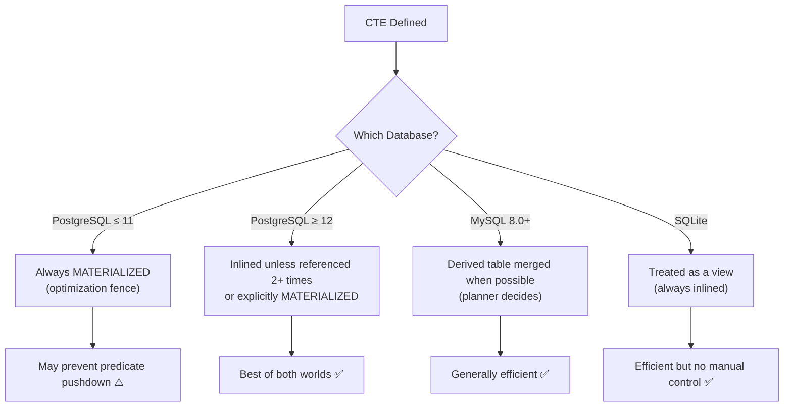
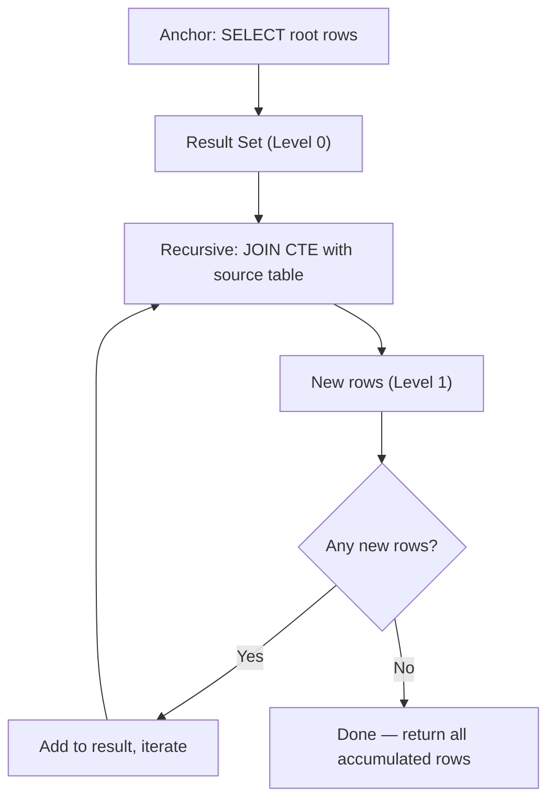

# Common Table Expressions (CTEs) 🟡

> **What you'll learn:**
> - How to use `WITH` clauses to organize complex queries into readable, named subquery blocks
> - The critical differences between CTEs as optimization fences (Postgres ≤11) vs. inline (MySQL, SQLite)
> - How to write **Recursive CTEs** to traverse hierarchical data (org charts, threaded comments, graph walks) in a single query
> - Portability of CTE features and cycle detection across the three databases

---

## Why CTEs?

A Common Table Expression (CTE) is a named temporary result set that exists only for the duration of a single query. Think of it as a `let` binding in a programming language — it gives a name to a subquery so you can reference it multiple times without duplicating code.

| Feature | PostgreSQL | MySQL | SQLite |
|---|---|---|---|
| Basic CTE (`WITH`) | ✅ Since 8.4 (2009) | ✅ Since 8.0 (2018) | ✅ Since 3.8.3 (2014) |
| Multiple CTEs | ✅ | ✅ | ✅ |
| CTE referencing earlier CTE | ✅ | ✅ | ✅ |
| Recursive CTE (`WITH RECURSIVE`) | ✅ | ✅ | ✅ |
| `MATERIALIZED` / `NOT MATERIALIZED` hints | ✅ Since 12 | ❌ | ❌ |
| CTE in DML (`INSERT`, `UPDATE`, `DELETE`) | ✅ (writable CTEs) | ✅ (read-only in CTE) | ✅ (read-only in CTE) |
| Cycle detection (`CYCLE`) | ✅ Since 14 | ❌ | ❌ |

## Basic CTEs

```sql
-- Identical across PostgreSQL, MySQL, and SQLite
WITH regional_totals AS (
    SELECT
        region,
        SUM(amount) AS total,
        COUNT(*)    AS num_sales
    FROM sales
    GROUP BY region
),
regional_avg AS (
    SELECT AVG(total) AS avg_total FROM regional_totals
)
SELECT
    rt.region,
    rt.total,
    rt.num_sales,
    ROUND(rt.total - ra.avg_total, 2) AS diff_from_avg
FROM regional_totals rt
CROSS JOIN regional_avg ra
ORDER BY rt.total DESC;
```

### CTE vs. Subquery — When to Use Which

| Criterion | CTE | Subquery |
|---|---|---|
| Referenced multiple times | ✅ CTE (avoids duplication) | ❌ Must copy-paste subquery |
| Readability | ✅ Named, top-down | ❌ Nested, inside-out |
| Optimization | Varies (see below) | Always inlined by planner |
| Recursive queries | ✅ Only way to do it | ❌ Not possible |

### The Materialization Question



**PostgreSQL 12+ materialization hints:**
```sql
-- Force materialization (compute once, store in temp)
WITH regional_totals AS MATERIALIZED (
    SELECT region, SUM(amount) AS total FROM sales GROUP BY region
)
SELECT * FROM regional_totals WHERE total > 50000;

-- Force inlining (let planner push predicates into the CTE)
WITH regional_totals AS NOT MATERIALIZED (
    SELECT region, SUM(amount) AS total FROM sales GROUP BY region
)
SELECT * FROM regional_totals WHERE total > 50000;
-- The planner may push the WHERE total > 50000 into the GROUP BY scan
```

```sql
-- 💥 PERFORMANCE HAZARD (PostgreSQL ≤ 11): CTE prevents index use
WITH user_data AS (
    SELECT * FROM users  -- Materializes the ENTIRE users table
)
SELECT * FROM user_data WHERE email = 'alice@example.com';
-- The email index on `users` is NOT used because the CTE is an optimization fence

-- ✅ FIX (PostgreSQL ≤ 11): Use a subquery instead
SELECT * FROM (SELECT * FROM users) AS user_data
WHERE email = 'alice@example.com';
-- The planner pushes the WHERE into the subquery and uses the index
```

## Recursive CTEs — Querying Hierarchical Data

This is where CTEs become truly powerful. A recursive CTE can traverse tree-structured or graph-structured data in a single query.

### How Recursion Works

A recursive CTE has two parts:
1. **Anchor member**: The starting point (base case)
2. **Recursive member**: Joined to the CTE itself, producing the next level



### Example: Employee Org Chart

```sql
CREATE TABLE employees (
    id INTEGER PRIMARY KEY,
    name TEXT NOT NULL,
    manager_id INTEGER REFERENCES employees(id),
    title TEXT NOT NULL
);

INSERT INTO employees (id, name, manager_id, title) VALUES
(1, 'Sarah',   NULL, 'CEO'),
(2, 'Marcus',  1,    'VP Engineering'),
(3, 'Priya',   1,    'VP Product'),
(4, 'James',   2,    'Engineering Manager'),
(5, 'Yuki',    2,    'Engineering Manager'),
(6, 'Ana',     4,    'Senior Engineer'),
(7, 'Chen',    4,    'Senior Engineer'),
(8, 'Omar',    5,    'Staff Engineer'),
(9, 'Lisa',    3,    'Product Manager'),
(10, 'Diego',  3,    'Product Designer');
```

**Query: Full org tree with depth and path — all three databases:**

```sql
-- PostgreSQL, MySQL, and SQLite (identical)
WITH RECURSIVE org_tree AS (
    -- Anchor: start at the CEO (no manager)
    SELECT
        id,
        name,
        title,
        manager_id,
        0 AS depth,
        CAST(name AS TEXT) AS path
    FROM employees
    WHERE manager_id IS NULL

    UNION ALL

    -- Recursive: join children to their parents
    SELECT
        e.id,
        e.name,
        e.title,
        e.manager_id,
        ot.depth + 1,
        CAST(ot.path || ' → ' || e.name AS TEXT)
    FROM employees e
    INNER JOIN org_tree ot ON e.manager_id = ot.id
)
SELECT
    depth,
    REPEAT('  ', depth) || name AS indented_name,
    title,
    path
FROM org_tree
ORDER BY path;
```

> ⚠️ **MySQL note:** MySQL does not have `REPEAT()` as a general-purpose function in the same way, but it does support `REPEAT(str, count)`. However, MySQL uses `CONCAT()` not `||` for string concatenation unless `PIPES_AS_CONCAT` is set.

**MySQL-adjusted version:**
```sql
WITH RECURSIVE org_tree AS (
    SELECT
        id,
        name,
        title,
        manager_id,
        0 AS depth,
        CAST(name AS CHAR(1000)) AS path
    FROM employees
    WHERE manager_id IS NULL

    UNION ALL

    SELECT
        e.id,
        e.name,
        e.title,
        e.manager_id,
        ot.depth + 1,
        CAST(CONCAT(ot.path, ' → ', e.name) AS CHAR(1000))
    FROM employees e
    INNER JOIN org_tree ot ON e.manager_id = ot.id
)
SELECT
    depth,
    CONCAT(REPEAT('  ', depth), name) AS indented_name,
    title,
    path
FROM org_tree
ORDER BY path;
```

**Result:**

| depth | indented_name | title | path |
|---|---|---|---|
| 0 | Sarah | CEO | Sarah |
| 1 | Marcus | VP Engineering | Sarah → Marcus |
| 2 | James | Engineering Manager | Sarah → Marcus → James |
| 3 | Ana | Senior Engineer | Sarah → Marcus → James → Ana |
| 3 | Chen | Senior Engineer | Sarah → Marcus → James → Chen |
| 2 | Yuki | Engineering Manager | Sarah → Marcus → Yuki |
| 3 | Omar | Staff Engineer | Sarah → Marcus → Yuki → Omar |
| 1 | Priya | VP Product | Sarah → Priya |
| 2 | Diego | Product Designer | Sarah → Priya → Diego |
| 2 | Lisa | Product Manager | Sarah → Priya → Lisa |

### Example: Threaded Comments

```sql
CREATE TABLE comments (
    id INTEGER PRIMARY KEY,
    parent_id INTEGER REFERENCES comments(id),
    author TEXT NOT NULL,
    body TEXT NOT NULL,
    created_at TIMESTAMP NOT NULL
);

-- Fetch a thread with all replies, indented by depth
-- Identical across all three databases
WITH RECURSIVE thread AS (
    SELECT id, parent_id, author, body, created_at, 0 AS depth
    FROM comments
    WHERE id = 1  -- Root comment

    UNION ALL

    SELECT c.id, c.parent_id, c.author, c.body, c.created_at, t.depth + 1
    FROM comments c
    INNER JOIN thread t ON c.parent_id = t.id
)
SELECT * FROM thread ORDER BY depth, created_at;
```

### Example: Bill of Materials (Explosion)

```sql
CREATE TABLE parts (
    assembly_id INTEGER NOT NULL,
    component_id INTEGER NOT NULL,
    quantity INTEGER NOT NULL,
    PRIMARY KEY (assembly_id, component_id)
);

-- Calculate total quantity of each leaf component needed for assembly 100
WITH RECURSIVE bom AS (
    SELECT component_id, quantity, 1 AS depth
    FROM parts WHERE assembly_id = 100

    UNION ALL

    SELECT p.component_id, bom.quantity * p.quantity, bom.depth + 1
    FROM parts p
    INNER JOIN bom ON p.assembly_id = bom.component_id
)
SELECT component_id, SUM(quantity) AS total_needed
FROM bom
WHERE component_id NOT IN (SELECT DISTINCT assembly_id FROM parts)  -- Leaf nodes only
GROUP BY component_id
ORDER BY total_needed DESC;
```

## Recursion Limits and Cycle Detection

| Feature | PostgreSQL | MySQL | SQLite |
|---|---|---|---|
| Default recursion limit | None (runs until empty) | `cte_max_recursion_depth = 1000` | None (runs until empty) |
| Setting the limit | N/A | `SET cte_max_recursion_depth = 10000;` | N/A |
| Cycle detection clause | ✅ `CYCLE col SET is_cycle USING path` (v14+) | ❌ Manual via path tracking | ❌ Manual via path tracking |

**PostgreSQL 14+: Built-in cycle detection:**
```sql
WITH RECURSIVE reachable AS (
    SELECT id, name, manager_id
    FROM employees WHERE id = 1

    UNION ALL

    SELECT e.id, e.name, e.manager_id
    FROM employees e
    INNER JOIN reachable r ON e.manager_id = r.id
)
CYCLE id SET is_cycle USING path
SELECT * FROM reachable WHERE NOT is_cycle;
```

**Manual cycle detection (all databases):**
```sql
WITH RECURSIVE reachable AS (
    SELECT
        id,
        name,
        manager_id,
        CAST(id AS TEXT) AS visited_ids,  -- Track visited node IDs
        0 AS is_cycle
    FROM employees WHERE id = 1

    UNION ALL

    SELECT
        e.id,
        e.name,
        e.manager_id,
        CAST(r.visited_ids || ',' || CAST(e.id AS TEXT) AS TEXT),
        CASE
            WHEN INSTR(r.visited_ids, CAST(e.id AS TEXT)) > 0 THEN 1
            ELSE 0
        END
    FROM employees e
    INNER JOIN reachable r ON e.manager_id = r.id
    WHERE r.is_cycle = 0  -- Stop following cycles
)
SELECT * FROM reachable;
```

## Writable CTEs (PostgreSQL Only)

PostgreSQL allows `INSERT`, `UPDATE`, and `DELETE` inside CTEs:

```sql
-- PostgreSQL only: Archive and delete old records in one atomic statement
WITH archived AS (
    DELETE FROM events
    WHERE created_at < NOW() - INTERVAL '90 days'
    RETURNING *
)
INSERT INTO events_archive
SELECT * FROM archived;
-- This is atomic — if the INSERT fails, the DELETE is rolled back
```

> Neither MySQL nor SQLite support DML statements inside CTEs. For the same operation, you'd need a transaction with separate statements.

---

<details>
<summary><strong>🏋️ Exercise: The Ancestor Chain</strong> (click to expand)</summary>

Using the `employees` table from this chapter:

**Challenge:** Write a recursive CTE that, given employee `id = 7` (Chen), returns the full chain from Chen up to the CEO:

Expected output:

| depth | name | title | chain |
|---|---|---|---|
| 0 | Chen | Senior Engineer | Chen |
| 1 | James | Engineering Manager | Chen → James |
| 2 | Marcus | VP Engineering | Chen → James → Marcus |
| 3 | Sarah | CEO | Chen → James → Marcus → Sarah |

Write the query in all three dialects.

<details>
<summary>🔑 Solution</summary>

**PostgreSQL:**
```sql
WITH RECURSIVE ancestors AS (
    SELECT id, name, title, manager_id, 0 AS depth, CAST(name AS TEXT) AS chain
    FROM employees
    WHERE id = 7

    UNION ALL

    SELECT e.id, e.name, e.title, e.manager_id, a.depth + 1,
           CAST(a.chain || ' → ' || e.name AS TEXT)
    FROM employees e
    INNER JOIN ancestors a ON a.manager_id = e.id
)
SELECT depth, name, title, chain FROM ancestors ORDER BY depth;
```

**MySQL:**
```sql
WITH RECURSIVE ancestors AS (
    SELECT id, name, title, manager_id, 0 AS depth,
           CAST(name AS CHAR(1000)) AS chain
    FROM employees
    WHERE id = 7

    UNION ALL

    SELECT e.id, e.name, e.title, e.manager_id, a.depth + 1,
           CAST(CONCAT(a.chain, ' → ', e.name) AS CHAR(1000))
    FROM employees e
    INNER JOIN ancestors a ON a.manager_id = e.id
)
SELECT depth, name, title, chain FROM ancestors ORDER BY depth;
```

**SQLite:**
```sql
WITH RECURSIVE ancestors AS (
    SELECT id, name, title, manager_id, 0 AS depth, CAST(name AS TEXT) AS chain
    FROM employees
    WHERE id = 7

    UNION ALL

    SELECT e.id, e.name, e.title, e.manager_id, a.depth + 1,
           CAST(a.chain || ' → ' || e.name AS TEXT)
    FROM employees e
    INNER JOIN ancestors a ON a.manager_id = e.id
)
SELECT depth, name, title, chain FROM ancestors ORDER BY depth;
```

**Key insight:** This traverses *up* the tree (child → parent) instead of the usual *down* (parent → children). The join direction is reversed: `a.manager_id = e.id` instead of `e.manager_id = a.id`.

</details>
</details>

---

> **Key Takeaways**
> - CTEs make complex queries readable by decomposing them into named blocks. Use them liberally for clarity.
> - Recursive CTEs are the only pure-SQL way to query hierarchical data (trees, graphs) — they work in all three databases.
> - PostgreSQL ≤11 treats CTEs as optimization fences; PostgreSQL ≥12 inlines them by default. MySQL and SQLite always inline.
> - MySQL limits recursion to 1000 iterations by default (`cte_max_recursion_depth`); Postgres and SQLite have no limit.
> - Always include cycle detection (via path tracking or PostgreSQL's `CYCLE` clause) when traversing graphs that may contain cycles.
> - Writable CTEs (`DELETE ... RETURNING` into `INSERT`) are a PostgreSQL-only superpower for atomic data movement.
