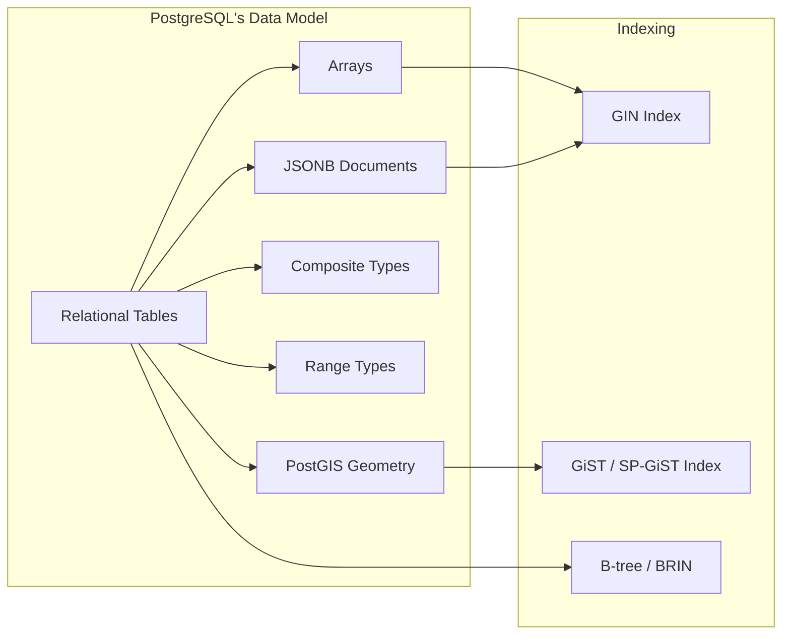

# Postgres: Arrays, JSONB, and PostGIS 🔴

> **What you'll learn:**
> - How to use PostgreSQL's native array type for multi-value columns and the `unnest()`, `array_agg()`, and `ANY()` functions
> - JSONB storage, operators (`->`, `->>`, `@>`, `#>`), indexing with GIN, and when to use JSONB vs. normalized tables
> - A primer on PostGIS for geospatial queries (nearest neighbor, point-in-polygon)
> - Practical performance patterns for JSONB-heavy workloads

---

## PostgreSQL's Multi-Paradigm Philosophy

PostgreSQL is often described as an "object-relational" database because it extends the relational model with powerful composite types. While MySQL and SQLite are strictly relational (with MySQL adding JSON support), PostgreSQL natively supports:

- **Arrays** — ordered lists within a single column
- **JSONB** — binary JSON with deep indexing and querying
- **Composite types** — user-defined row types
- **Range types** — `int4range`, `tstzrange`, etc.
- **PostGIS extension** — full geospatial engine



## Arrays

### Creating and Inserting

```sql
CREATE TABLE articles (
    id BIGINT GENERATED ALWAYS AS IDENTITY PRIMARY KEY,
    title TEXT NOT NULL,
    tags TEXT[] NOT NULL DEFAULT '{}',          -- Array of text
    view_counts INTEGER[] DEFAULT ARRAY[]::INTEGER[],
    published_at TIMESTAMPTZ
);

INSERT INTO articles (title, tags, published_at)
VALUES
    ('Intro to SQL', ARRAY['sql', 'beginner', 'tutorial'], NOW()),
    ('Advanced Postgres', '{postgres,jsonb,arrays}', NOW()),  -- Alternate literal syntax
    ('Database Design', ARRAY['sql', 'design', 'normalization'], NOW());
```

### Querying Arrays

| Operation | Syntax | Example |
|---|---|---|
| Access element (1-indexed) | `col[n]` | `tags[1]` → first tag |
| Contains value | `@>` | `tags @> ARRAY['sql']` |
| Is contained by | `<@` | `ARRAY['sql'] <@ tags` |
| Overlap (any common) | `&&` | `tags && ARRAY['postgres', 'mysql']` |
| Array length | `array_length(col, 1)` | `array_length(tags, 1)` |
| Unnest to rows | `unnest(col)` | `SELECT unnest(tags) FROM articles` |
| Aggregate back to array | `array_agg(col)` | `SELECT array_agg(DISTINCT tag) FROM ...` |
| Any value matches | `= ANY(col)` | `'sql' = ANY(tags)` |

```sql
-- Find articles tagged with 'sql'
SELECT title, tags FROM articles WHERE 'sql' = ANY(tags);

-- Find articles tagged with BOTH 'sql' AND 'design'
SELECT title, tags FROM articles WHERE tags @> ARRAY['sql', 'design'];

-- Find articles tagged with ANY of 'postgres' or 'mysql'
SELECT title, tags FROM articles WHERE tags && ARRAY['postgres', 'mysql'];

-- Explode tags into individual rows (for analytics)
SELECT a.title, t.tag
FROM articles a, unnest(a.tags) AS t(tag);

-- Aggregate: find all unique tags across all articles
SELECT array_agg(DISTINCT tag ORDER BY tag) AS all_tags
FROM articles, unnest(tags) AS tag;
```

### Indexing Arrays

```sql
-- GIN index for array containment queries (@>, &&)
CREATE INDEX idx_articles_tags ON articles USING GIN (tags);

-- Now these queries use the index:
SELECT * FROM articles WHERE tags @> ARRAY['sql'];
SELECT * FROM articles WHERE tags && ARRAY['postgres', 'tutorial'];
```

```sql
-- 💥 PERFORMANCE HAZARD: ANY() does NOT use a GIN index
SELECT * FROM articles WHERE 'sql' = ANY(tags);
-- This performs a sequential scan!

-- ✅ FIX: Rewrite using the @> operator
SELECT * FROM articles WHERE tags @> ARRAY['sql'];
-- This uses the GIN index
```

## JSONB — The Document Store Inside Postgres

### JSON vs. JSONB

| Feature | `JSON` | `JSONB` |
|---|---|---|
| Storage | Text (preserves whitespace, key order, duplicates) | Binary (deduplicated keys, no whitespace) |
| Indexing | ❌ Cannot be indexed | ✅ GIN, B-tree on expressions |
| Operators | Limited (text extraction) | Full set (`@>`, `?`, `?|`, `?&`, `#>`) |
| Equality comparison | ❌ | ✅ |
| Speed of insert | Faster (no parsing) | Slightly slower (parsing + binary encoding) |
| Speed of query | Slower (must parse on read) | Much faster |

> **Rule of thumb:** Always use `JSONB` unless you need to preserve exact JSON formatting (e.g., storing API responses verbatim for audit).

### JSONB Operators

| Operator | Description | Example | Result |
|---|---|---|---|
| `->` | Get JSON element (as JSON) | `'{"a":1}'::jsonb -> 'a'` | `1` (jsonb) |
| `->>` | Get JSON element (as text) | `'{"a":1}'::jsonb ->> 'a'` | `'1'` (text) |
| `#>` | Get nested element (as JSON) | `'{"a":{"b":2}}'::jsonb #> '{a,b}'` | `2` (jsonb) |
| `#>>` | Get nested element (as text) | `'{"a":{"b":2}}'::jsonb #>> '{a,b}'` | `'2'` (text) |
| `@>` | Contains | `'{"a":1,"b":2}'::jsonb @> '{"a":1}'` | `true` |
| `<@` | Is contained by | `'{"a":1}'::jsonb <@ '{"a":1,"b":2}'` | `true` |
| `?` | Key exists | `'{"a":1}'::jsonb ? 'a'` | `true` |
| `?|` | Any key exists | `'{"a":1}'::jsonb ?| array['a','c']` | `true` |
| `?&` | All keys exist | `'{"a":1}'::jsonb ?& array['a','b']` | `false` |
| `||` | Concatenate/merge | `'{"a":1}'::jsonb || '{"b":2}'` | `'{"a":1,"b":2}'` |
| `-` | Remove key | `'{"a":1,"b":2}'::jsonb - 'a'` | `'{"b":2}'` |
| `#-` | Remove nested path | `'{"a":{"b":1}}'::jsonb #- '{a,b}'` | `'{"a":{}}'` |

### Practical JSONB Example: User Preferences

```sql
CREATE TABLE user_profiles (
    id BIGINT GENERATED ALWAYS AS IDENTITY PRIMARY KEY,
    email TEXT NOT NULL UNIQUE,
    preferences JSONB NOT NULL DEFAULT '{}'::jsonb,
    metadata JSONB NOT NULL DEFAULT '{}'::jsonb
);

INSERT INTO user_profiles (email, preferences, metadata) VALUES
('alice@example.com',
 '{"theme": "dark", "lang": "en", "notifications": {"email": true, "push": false}}',
 '{"signup_source": "organic", "plan": "pro", "features": ["analytics", "export"]}'),
('bob@example.com',
 '{"theme": "light", "lang": "fr", "notifications": {"email": true, "push": true}}',
 '{"signup_source": "referral", "plan": "free", "features": ["analytics"]}');
```

```sql
-- Get a top-level key
SELECT email, preferences ->> 'theme' AS theme FROM user_profiles;

-- Get a nested key
SELECT email, preferences #>> '{notifications,email}' AS email_notif FROM user_profiles;

-- Find users on the "pro" plan
SELECT email FROM user_profiles WHERE metadata @> '{"plan": "pro"}';

-- Find users who have the "export" feature
SELECT email FROM user_profiles WHERE metadata -> 'features' ? 'export';
-- Alternative: containment check
SELECT email FROM user_profiles WHERE metadata @> '{"features": ["export"]}';

-- Update a nested value (immutable — creates new JSONB)
UPDATE user_profiles
SET preferences = jsonb_set(preferences, '{theme}', '"solarized"')
WHERE email = 'alice@example.com';

-- Add a new nested key
UPDATE user_profiles
SET preferences = jsonb_set(preferences, '{notifications,sms}', 'true')
WHERE email = 'alice@example.com';

-- Remove a key
UPDATE user_profiles
SET preferences = preferences - 'lang'
WHERE email = 'bob@example.com';
```

### Indexing JSONB

```sql
-- Option 1: GIN index on entire JSONB column (most flexible)
CREATE INDEX idx_profiles_preferences ON user_profiles USING GIN (preferences);
-- Supports: @>, ?, ?|, ?& operators

-- Option 2: GIN with jsonb_path_ops (faster @>, less flexible)
CREATE INDEX idx_profiles_metadata ON user_profiles USING GIN (metadata jsonb_path_ops);
-- Only supports @> operator, but 2-3x faster and smaller

-- Option 3: B-tree on a specific extracted value
CREATE INDEX idx_profiles_plan ON user_profiles ((metadata ->> 'plan'));
-- Supports: equality and range queries on that specific key
```

```sql
-- 💥 PERFORMANCE HAZARD: B-tree expression index but query uses wrong operator
CREATE INDEX idx_plan ON user_profiles ((metadata ->> 'plan'));
SELECT * FROM user_profiles WHERE metadata @> '{"plan": "pro"}';
-- The @> operator does NOT use the expression B-tree index!

-- ✅ FIX: Match the query to the index type
-- With B-tree expression index, use ->> extraction:
SELECT * FROM user_profiles WHERE metadata ->> 'plan' = 'pro';

-- Or with GIN index, use @> containment:
CREATE INDEX idx_metadata_gin ON user_profiles USING GIN (metadata);
SELECT * FROM user_profiles WHERE metadata @> '{"plan": "pro"}';
```

### JSONB Aggregation

```sql
-- Build a JSON object from key-value pairs
SELECT jsonb_object_agg(email, preferences ->> 'theme') AS theme_map
FROM user_profiles;
-- {"alice@example.com": "dark", "bob@example.com": "light"}

-- Expand JSONB keys to rows
SELECT email, key, value
FROM user_profiles, jsonb_each(preferences) AS kv(key, value);

-- Expand JSONB array to rows
SELECT email, feature
FROM user_profiles, jsonb_array_elements_text(metadata -> 'features') AS feature;
```

## When to Use JSONB vs. Normalized Tables

| Criterion | Use JSONB | Use Normalized Tables |
|---|---|---|
| Schema is dynamic/evolving | ✅ | ❌ |
| Data is queried by specific keys frequently | Depends on index | ✅ |
| Need JOINs across entities | ❌ | ✅ |
| Need referential integrity (FK) | ❌ | ✅ |
| Semi-structured external data (API responses) | ✅ | ❌ |
| Analytics/aggregations on values | ❌ (slow) | ✅ |
| User-defined fields / preferences | ✅ | ❌ (schema per user?) |

## PostGIS Primer — Geospatial Queries

PostGIS adds geometry and geography types to PostgreSQL, turning it into a full GIS database.

```sql
-- Enable the extension
CREATE EXTENSION IF NOT EXISTS postgis;

CREATE TABLE stores (
    id BIGINT GENERATED ALWAYS AS IDENTITY PRIMARY KEY,
    name TEXT NOT NULL,
    location GEOGRAPHY(POINT, 4326) NOT NULL  -- WGS84 lat/lng
);

-- Insert with longitude, latitude (note: lng first, lat second)
INSERT INTO stores (name, location) VALUES
('Downtown', ST_MakePoint(-122.4194, 37.7749)::geography),
('Airport',  ST_MakePoint(-122.3750, 37.6213)::geography),
('Marina',   ST_MakePoint(-122.4367, 37.8030)::geography);

-- Create a spatial index
CREATE INDEX idx_stores_location ON stores USING GIST (location);

-- Find stores within 5km of a point
SELECT name,
       ST_Distance(location, ST_MakePoint(-122.4100, 37.7850)::geography) AS distance_m
FROM stores
WHERE ST_DWithin(location, ST_MakePoint(-122.4100, 37.7850)::geography, 5000)
ORDER BY distance_m;

-- Find the nearest store (K-nearest-neighbor)
SELECT name,
       ST_Distance(location, ST_MakePoint(-122.4100, 37.7850)::geography) AS distance_m
FROM stores
ORDER BY location <-> ST_MakePoint(-122.4100, 37.7850)::geography
LIMIT 1;
-- The <-> operator uses the GiST index for efficient nearest-neighbor search
```

---

<details>
<summary><strong>🏋️ Exercise: The Product Catalog</strong> (click to expand)</summary>

You're building an e-commerce product catalog. Products have:
- Standard columns (id, name, price, category)
- A variable-length list of tags (array)
- Arbitrary vendor-specific attributes stored as JSONB
- A warehouse location (lat/lng)

**Challenge:**
1. Create the table with appropriate types and indexes
2. Write a query to find all products tagged with "electronics" AND priced under $100, returning the brand from the JSONB attributes
3. Write a query to find the 5 nearest products to a given lat/lng that are in stock (JSONB attribute `stock > 0`)

<details>
<summary>🔑 Solution</summary>

```sql
-- 1. Table creation
CREATE EXTENSION IF NOT EXISTS postgis;

CREATE TABLE products (
    id BIGINT GENERATED ALWAYS AS IDENTITY PRIMARY KEY,
    name TEXT NOT NULL,
    price NUMERIC(10,2) NOT NULL CHECK (price > 0),
    category TEXT NOT NULL,
    tags TEXT[] NOT NULL DEFAULT '{}',
    attributes JSONB NOT NULL DEFAULT '{}'::jsonb,
    location GEOGRAPHY(POINT, 4326)
);

-- Indexes
CREATE INDEX idx_products_tags ON products USING GIN (tags);
CREATE INDEX idx_products_attrs ON products USING GIN (attributes jsonb_path_ops);
CREATE INDEX idx_products_location ON products USING GIST (location);
CREATE INDEX idx_products_price ON products (price);

-- 2. Electronics under $100 with brand
SELECT
    name,
    price,
    attributes ->> 'brand' AS brand,
    tags
FROM products
WHERE tags @> ARRAY['electronics']
  AND price < 100.00
ORDER BY price;

-- 3. Five nearest in-stock products
SELECT
    name,
    price,
    (attributes ->> 'stock')::integer AS stock,
    ST_Distance(location, ST_MakePoint(-122.41, 37.78)::geography) AS distance_m
FROM products
WHERE (attributes ->> 'stock')::integer > 0
  AND location IS NOT NULL
ORDER BY location <-> ST_MakePoint(-122.41, 37.78)::geography
LIMIT 5;
```

**Index usage:**
- Query 2 uses the GIN index on `tags` for `@>` and the B-tree on `price` for the range filter
- Query 3 uses the GiST index on `location` for the `<->` nearest-neighbor operator
- The `(attributes ->> 'stock')::integer > 0` filter cannot use GIN — for high-frequency queries, create an expression index: `CREATE INDEX idx_products_stock ON products (((attributes ->> 'stock')::integer))`

</details>
</details>

---

> **Key Takeaways**
> - PostgreSQL arrays are powerful for multi-value columns. Use `@>` with GIN indexes for containment queries — avoid `= ANY()` which can't use GIN.
> - Always use `JSONB` over `JSON`. `JSONB` supports GIN indexing, containment operators, and equality checks.
> - Match your query operators to your index type: `@>` requires GIN; `->>` extraction requires a B-tree expression index.
> - `jsonb_path_ops` GIN indexes are ~3x faster and smaller than default GIN but only support `@>`.
> - PostGIS turns PostgreSQL into a world-class geospatial database with `GIST` indexes and the `<->` KNN operator.
> - Use JSONB for truly dynamic schemas (user preferences, external API data). Use normalized tables for anything you JOIN on or aggregate frequently.
