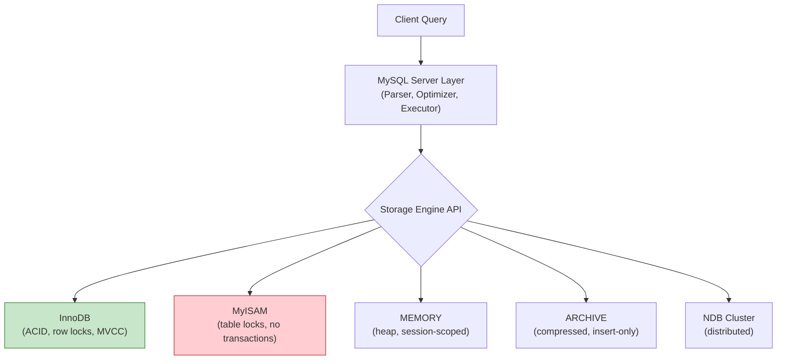
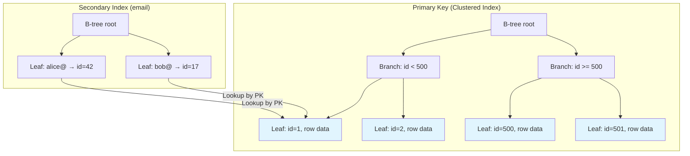

# MySQL: Storage Engines and Locking 🔴

> **What you'll learn:**
> - The architecture of MySQL's pluggable storage engine layer and why InnoDB is (almost) always the right choice
> - InnoDB's clustered index, MVCC, and row-level locking model: gap locks, next-key locks, and phantom reads
> - How to read MySQL's `EXPLAIN` output to diagnose slow queries
> - Practical patterns for handling concurrent writes and avoiding deadlocks

---

## MySQL's Pluggable Storage Architecture

Unlike PostgreSQL and SQLite (which each have a single storage engine), MySQL separates the SQL layer from the storage layer. Each table can use a different engine.



## InnoDB vs. MyISAM

| Feature | InnoDB | MyISAM |
|---|---|---|
| **Transactions** | ✅ Full ACID | ❌ None |
| **Locking granularity** | Row-level | Table-level |
| **Crash recovery** | ✅ Redo/Undo logs | ❌ Repair required |
| **Foreign keys** | ✅ | ❌ |
| **MVCC** | ✅ | ❌ |
| **Full-text search** | ✅ (since 5.6) | ✅ |
| **COUNT(*)** | Slow (must scan) | Fast (stored count) |
| **Clustered index** | ✅ Primary key IS the data | ❌ Heap with separate index |
| **Compression** | ✅ Page compression | ✅ Row compression |
| **Default since** | MySQL 5.5 (2010) | Legacy |

> **Rule: Always use InnoDB.** There is almost no reason to use MyISAM in 2025+. The only edge case is bulk-loaded, read-only data where `COUNT(*)` performance matters and you don't need transactions.

## InnoDB's Clustered Index Architecture

In InnoDB, the primary key index **IS** the table data. The leaf nodes of the primary key B-tree store the actual rows. Secondary indexes store the primary key value, requiring a second lookup to fetch the full row.



This architecture has important performance implications:

```sql
-- ✅ Primary key lookup: single B-tree traversal (very fast)
SELECT * FROM users WHERE id = 42;

-- ⚠️ Secondary index lookup: two B-tree traversals
-- 1. Traverse the email index to find id=42
-- 2. Traverse the primary key index to fetch the full row
SELECT * FROM users WHERE email = 'alice@example.com';

-- ✅ Covering index: only one traversal (no second lookup needed)
-- If the secondary index INCLUDES all requested columns:
CREATE INDEX idx_users_email_name ON users (email, name);
SELECT email, name FROM users WHERE email = 'alice@example.com';
-- The query is "covered" — all columns are in the index leaf
```

```sql
-- 💥 PERFORMANCE HAZARD: UUID primary keys cause massive random I/O
CREATE TABLE events (
    id CHAR(36) PRIMARY KEY DEFAULT (UUID()),  -- Random UUID
    data JSON
) ENGINE=InnoDB;
-- UUIDs are randomly distributed, causing page splits and fragmentation
-- in the clustered index (every insert goes to a random leaf node)

-- ✅ FIX: Use UUID_TO_BIN with swap flag for time-ordered UUIDs
CREATE TABLE events (
    id BINARY(16) PRIMARY KEY DEFAULT (UUID_TO_BIN(UUID(), TRUE)),
    data JSON
) ENGINE=InnoDB;
-- The TRUE flag reorders UUID bytes so the timestamp portion comes first,
-- making inserts sequential in the B-tree
```

## InnoDB Locking Model

InnoDB uses **MVCC** (Multi-Version Concurrency Control) for reads and **row-level locking** for writes. Understanding the locking model is essential for diagnosing deadlocks and performance issues.

### Lock Types

| Lock | Scope | When Acquired | Blocks |
|---|---|---|---|
| **Shared (S)** | Row | `SELECT ... FOR SHARE` | Exclusive locks |
| **Exclusive (X)** | Row | `UPDATE`, `DELETE`, `SELECT ... FOR UPDATE` | All other locks |
| **Intention Shared (IS)** | Table | Before S lock on row | IX locks |
| **Intention Exclusive (IX)** | Table | Before X lock on row | S, SIX locks |
| **Gap lock** | Range between index records | Range conditions in `REPEATABLE READ` | Inserts in the gap |
| **Next-key lock** | Index record + gap before it | Default in `REPEATABLE READ` | Inserts and modifications |

### Gap Locks and Phantom Reads

Gap locks prevent **phantom reads** by locking the range between index records, not just the records themselves.

```sql
-- Session 1: Read range
BEGIN;
SELECT * FROM orders WHERE amount BETWEEN 100 AND 200 FOR UPDATE;
-- InnoDB locks:
-- 1. All existing rows where amount is 100-200 (record locks)
-- 2. The "gaps" between those records (gap locks)
-- This prevents Session 2 from inserting amount=150

-- Session 2: Try to insert in the locked range
BEGIN;
INSERT INTO orders (amount) VALUES (150);
-- ⏳ BLOCKED! Waits for Session 1's gap lock to be released
```

### Deadlock Detection

```sql
-- Classic deadlock scenario:
-- Session 1                        Session 2
-- BEGIN;                           BEGIN;
-- UPDATE users SET ... WHERE id=1; UPDATE users SET ... WHERE id=2;
-- (holds X lock on id=1)           (holds X lock on id=2)
-- UPDATE users SET ... WHERE id=2; UPDATE users SET ... WHERE id=1;
-- ⏳ Waits for id=2                ⏳ Waits for id=1
-- 💥 DEADLOCK DETECTED! One session is rolled back.
```

**Diagnosing deadlocks:**
```sql
-- Show the latest deadlock
SHOW ENGINE INNODB STATUS\G
-- Look for the "LATEST DETECTED DEADLOCK" section

-- Monitor current locks
SELECT * FROM performance_schema.data_locks;

-- Monitor lock waits
SELECT * FROM performance_schema.data_lock_waits;
```

**Preventing deadlocks:**
1. **Always access tables and rows in the same order** across all transactions
2. **Keep transactions short** — don't hold locks while making API calls
3. **Use `SELECT ... FOR UPDATE`** at the beginning to acquire all needed locks upfront
4. **Add proper indexes** — without an index, InnoDB takes table-level locks for updates

## Transaction Isolation Levels

| Level | Dirty Reads | Non-repeatable Reads | Phantom Reads | MySQL Default |
|---|---|---|---|---|
| `READ UNCOMMITTED` | ✅ Possible | ✅ Possible | ✅ Possible | No |
| `READ COMMITTED` | ❌ Prevented | ✅ Possible | ✅ Possible | No |
| `REPEATABLE READ` | ❌ Prevented | ❌ Prevented | ❌ Prevented (via gap locks) | **✅ Yes** |
| `SERIALIZABLE` | ❌ Prevented | ❌ Prevented | ❌ Prevented | No |

> **MySQL's default `REPEATABLE READ` prevents phantom reads** through gap locking — unlike PostgreSQL's `REPEATABLE READ` which uses snapshot isolation and might see different results for range queries within the same transaction in edge cases.

```sql
-- Change isolation level for the current session
SET SESSION TRANSACTION ISOLATION LEVEL READ COMMITTED;

-- Check current isolation level
SELECT @@transaction_isolation;
```

## Reading MySQL's EXPLAIN

```sql
EXPLAIN SELECT u.name, COUNT(o.id) AS order_count
FROM users u
JOIN orders o ON o.user_id = u.id
WHERE u.created_at > '2025-01-01'
GROUP BY u.id;
```

| Column | Meaning | What to Look For |
|---|---|---|
| `id` | Query block number | Subqueries get higher IDs |
| `select_type` | SIMPLE, PRIMARY, SUBQUERY, DERIVED | DEPENDENT SUBQUERY is a red flag |
| `table` | Which table | Order of access matters |
| `type` | **Access method** | `const` > `eq_ref` > `ref` > `range` > `index` > `ALL` |
| `possible_keys` | Indexes the optimizer considered | |
| `key` | Index actually chosen | `NULL` means no index used |
| `key_len` | Bytes of the index used | Shorter = fewer columns used |
| `rows` | Estimated rows examined | Lower is better |
| `filtered` | Percentage of rows after filtering | 100% = no additional filtering |
| `Extra` | **Critical details** | Watch for `Using filesort`, `Using temporary` |

### Access Types (Best to Worst)

| Type | Description | Typical Speed |
|---|---|---|
| `system` / `const` | Single row (PK or unique lookup) | Instant |
| `eq_ref` | One row per join (unique index) | Very fast |
| `ref` | Multiple rows via non-unique index | Fast |
| `range` | Index range scan (BETWEEN, <, >) | Good |
| `index` | Full index scan (reads all index entries) | Slow |
| `ALL` | **Full table scan** | 🔥 Terrible |

### Extra Column Red Flags

| Value | Meaning | Action |
|---|---|---|
| `Using filesort` | Sorting without an index | Add an index covering the ORDER BY |
| `Using temporary` | Temp table created for GROUP BY/DISTINCT | Rewrite query or add covering index |
| `Using where` | Post-filtering after index read | May indicate incomplete index usage |
| `Using index` | **Covering index** — great! | No action needed |
| `Using index condition` | **Index Condition Pushdown** — good | No action needed |

```sql
-- 💥 PERFORMANCE HAZARD: Full table scan (type=ALL)
EXPLAIN SELECT * FROM orders WHERE YEAR(created_at) = 2025;
-- Using a function on the indexed column prevents index use

-- ✅ FIX: Range condition to use the index
EXPLAIN SELECT * FROM orders
WHERE created_at >= '2025-01-01' AND created_at < '2026-01-01';
-- type=range, key=idx_orders_created_at
```

### EXPLAIN FORMAT=JSON and EXPLAIN ANALYZE

```sql
-- JSON format gives more detail (costs, used columns)
EXPLAIN FORMAT=JSON SELECT ...;

-- EXPLAIN ANALYZE (MySQL 8.0.18+): Actually executes and shows real timing
EXPLAIN ANALYZE SELECT u.name, COUNT(o.id)
FROM users u JOIN orders o ON o.user_id = u.id
WHERE u.created_at > '2025-01-01'
GROUP BY u.id;
-- Shows: actual rows, loops, timing per operation
```

## MySQL-Specific Performance Patterns

### Optimizer Hints

```sql
-- Force index usage
SELECT * FROM orders FORCE INDEX (idx_created_at)
WHERE created_at > '2025-01-01';

-- Use optimizer hints (MySQL 8.0+)
SELECT /*+ INDEX(orders idx_created_at) */ *
FROM orders WHERE created_at > '2025-01-01';

-- Skip scan hint
SELECT /*+ SKIP_SCAN(orders idx_user_created) */ *
FROM orders WHERE created_at > '2025-01-01';
```

### Online DDL

```sql
-- InnoDB supports online DDL for most operations (no table lock)
ALTER TABLE orders ADD COLUMN notes TEXT, ALGORITHM=INPLACE, LOCK=NONE;

-- Check if an operation supports online DDL:
-- ALGORITHM=INPLACE: In-place modification (no full table copy)
-- LOCK=NONE: Allow concurrent DML during the ALTER
-- If unsupported, MySQL will fall back to ALGORITHM=COPY (blocking)
```

---

<details>
<summary><strong>🏋️ Exercise: The Deadlock Detective</strong> (click to expand)</summary>

Given these two tables:

```sql
CREATE TABLE accounts (
    id BIGINT AUTO_INCREMENT PRIMARY KEY,
    name VARCHAR(255) NOT NULL,
    balance DECIMAL(12,2) NOT NULL CHECK (balance >= 0)
) ENGINE=InnoDB;

CREATE TABLE transfers (
    id BIGINT AUTO_INCREMENT PRIMARY KEY,
    from_id BIGINT NOT NULL REFERENCES accounts(id),
    to_id BIGINT NOT NULL REFERENCES accounts(id),
    amount DECIMAL(12,2) NOT NULL CHECK (amount > 0),
    created_at TIMESTAMP DEFAULT CURRENT_TIMESTAMP
) ENGINE=InnoDB;
```

**Challenge:** Write a stored procedure or transaction that transfers $100 from account 1 to account 2, which:
1. Is immune to deadlocks (always acquires locks in the same order)
2. Checks for sufficient balance
3. Records the transfer in the `transfers` table
4. Uses the appropriate isolation level

<details>
<summary>🔑 Solution</summary>

```sql
-- Always lock rows in primary key order to prevent deadlocks
SET SESSION TRANSACTION ISOLATION LEVEL READ COMMITTED;

START TRANSACTION;

-- Step 1: Lock both accounts in PK order (lower ID first)
SELECT balance FROM accounts WHERE id = 1 FOR UPDATE;
SELECT balance FROM accounts WHERE id = 2 FOR UPDATE;

-- Step 2: Check sufficient balance (application logic)
-- If balance < 100, ROLLBACK and error

-- Step 3: Perform the transfer
UPDATE accounts SET balance = balance - 100.00 WHERE id = 1;
UPDATE accounts SET balance = balance + 100.00 WHERE id = 2;

-- Step 4: Record the transfer
INSERT INTO transfers (from_id, to_id, amount) VALUES (1, 2, 100.00);

COMMIT;
```

**Why this is deadlock-free:**
- We always lock the lower ID first. If another transaction tries to transfer from account 2 to account 1, it also locks ID=1 first, ID=2 second.
- Both transactions acquire locks in the same global order → no circular dependency → no deadlock.

**Why `READ COMMITTED`:**
- We use `FOR UPDATE` to get the latest balance, not a snapshot. `READ COMMITTED` ensures we see the latest committed values.
- `REPEATABLE READ` would also work but adds gap locks we don't need.

</details>
</details>

---

> **Key Takeaways**
> - Always use InnoDB. MyISAM has no transactions, no row-level locking, and no crash recovery.
> - InnoDB's clustered index means the primary key order IS the physical data order — use sequential keys (auto-increment or time-ordered UUIDs) to avoid random I/O.
> - Gap locks in `REPEATABLE READ` prevent phantom reads but can cause unexpected blocking. Switch to `READ COMMITTED` if you don't need phantom protection.
> - Prevent deadlocks by always acquiring locks in a consistent global order (e.g., by primary key value).
> - In `EXPLAIN` output, watch for `type=ALL` (full table scan) and `Extra: Using filesort` / `Using temporary`.
> - `EXPLAIN ANALYZE` (MySQL 8.0.18+) actually executes the query and shows real timing — essential for production debugging.
