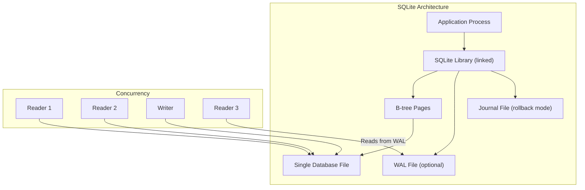

# SQLite: Pragmas and In-Memory Magic 🔴

> **What you'll learn:**
> - How to tune SQLite for production workloads using PRAGMAs: WAL mode, synchronous settings, and cache sizing
> - Operating SQLite entirely in RAM for ultra-fast testing and ephemeral data
> - Full-Text Search with the FTS5 extension for building search features without external services
> - Concurrency limitations and strategies for handling multiple writers

---

## SQLite's Unique Position

SQLite is not a client-server database — it's a library linked directly into your application. It reads and writes a single file on disk. This makes it the most deployed database engine in the world (billions of instances on phones, browsers, IoT devices, and embedded systems), but it also means its performance characteristics are radically different from Postgres and MySQL.

| Property | PostgreSQL | MySQL | SQLite |
|---|---|---|---|
| Architecture | Client-server | Client-server | Embedded library |
| Concurrency model | MVCC, many writers | Row locks, many writers | **Single writer** at a time |
| Storage | Multiple files, WAL | Multiple files per table | **Single file** |
| Configuration | `postgresql.conf` (100s of options) | `my.cnf` (100s of options) | `PRAGMA` statements |
| Max DB size | Unlimited (practical) | Unlimited (practical) | 281 TB (theoretical), ~1 TB practical |
| Connections | Thousands | Thousands | Per-process (no network) |



## Essential PRAGMAs

PRAGMAs are SQLite's configuration mechanism. They are **per-connection** — you must set them at the start of every database connection.

### The Production-Ready PRAGMA Set

```sql
-- The "production tuning" pragmas — set these on every connection
PRAGMA journal_mode = WAL;          -- Write-Ahead Logging (critical for concurrency)
PRAGMA synchronous = NORMAL;        -- Safe with WAL; full durability on OS crash
PRAGMA foreign_keys = ON;           -- Enforce foreign key constraints
PRAGMA busy_timeout = 5000;         -- Wait 5s for locks instead of failing immediately
PRAGMA cache_size = -64000;         -- 64MB page cache (negative = KB, positive = pages)
PRAGMA temp_store = MEMORY;         -- Store temp tables in RAM
PRAGMA mmap_io = 268435456;         -- Memory-map up to 256MB of the database file
PRAGMA auto_vacuum = INCREMENTAL;   -- Reclaim space incrementally
```

### Journal Modes Explained

| Mode | How It Works | Concurrent Reads | Write Performance | Crash Safety |
|---|---|---|---|---|
| `DELETE` (default) | Rollback journal; deleted after commit | ❌ Blocked during writes | Slow | ✅ Full |
| `WAL` | Append-only write-ahead log | ✅ **Readers never blocked** | Fast | ✅ Full |
| `TRUNCATE` | Like DELETE but truncates instead | ❌ Blocked | Slightly faster than DELETE | ✅ Full |
| `MEMORY` | Journal in RAM | ❌ Blocked | Very fast | ❌ None |
| `OFF` | No journal | ❌ | Fastest | ❌ None |

> **Always use WAL mode for any application that has concurrent reads and writes.** This is the single most impactful SQLite optimization.

```sql
-- Switch to WAL mode (only needs to be done once per database, but is persistent)
PRAGMA journal_mode = WAL;
-- Returns: 'wal'

-- Verify
PRAGMA journal_mode;
-- Returns: 'wal'
```

### Synchronous Settings

| Setting | Behavior | Use When |
|---|---|---|
| `FULL` | fsync after every transaction | Maximum durability; slow |
| `NORMAL` | fsync occasionally in WAL mode | **Recommended with WAL** |
| `OFF` | No fsync | Testing only; data loss on power failure |

```sql
-- 💥 PERFORMANCE HAZARD: Default settings without WAL
PRAGMA journal_mode;   -- Returns: 'delete'
PRAGMA synchronous;    -- Returns: 2 (FULL)
-- Every write does a full fsync AND blocks all readers

-- ✅ FIX: Enable WAL + NORMAL synchronous
PRAGMA journal_mode = WAL;
PRAGMA synchronous = NORMAL;
-- Writers don't block readers; fsync is batched
```

### Cache Size

```sql
-- Default is ~2MB (2000 pages × 1KB default page size)
PRAGMA page_size;     -- Usually 4096 bytes
PRAGMA cache_size;    -- Negative = KB, positive = page count

-- Set to 64MB for a busy application
PRAGMA cache_size = -64000;  -- 64,000 KB = ~64 MB

-- For read-heavy workloads, increase further
PRAGMA cache_size = -256000;  -- 256 MB
```

## In-Memory Databases

SQLite can operate entirely in RAM — no disk file at all.

```sql
-- Open an in-memory database
-- From application code: sqlite3_open(":memory:", &db)
-- From CLI: sqlite3 :memory:
```

### Use Cases for In-Memory SQLite

| Use Case | Why |
|---|---|
| Unit/integration testing | Blazing fast; no cleanup needed; each test gets a fresh DB |
| Caching layer | Structured cache with SQL query capability |
| Temporary data processing | ETL staging; intermediate computations |
| Configuration store | Application config queryable with SQL |

```sql
-- In-memory database with shared cache (multiple connections share the same DB)
-- Connection string: file::memory:?cache=shared

-- Attach an in-memory database to an existing connection
ATTACH DATABASE ':memory:' AS memdb;
CREATE TABLE memdb.temp_data (id INTEGER PRIMARY KEY, value TEXT);
-- Use memdb.temp_data for fast intermediate processing
-- Detach when done
DETACH DATABASE memdb;
```

### Attach Multiple Databases

One of SQLite's unique superpowers: a single connection can query across multiple database files.

```sql
-- Attach a second database file
ATTACH DATABASE '/path/to/analytics.db' AS analytics;

-- Query across databases in a single JOIN
SELECT u.name, a.page_views
FROM main.users u
JOIN analytics.page_views a ON a.user_id = u.id
WHERE a.date = '2025-06-15';

-- Detach when done
DETACH DATABASE analytics;
```

## Full-Text Search with FTS5

FTS5 is SQLite's full-text search extension — it builds an inverted index for fast text searching.

```sql
-- Create a virtual table for full-text search
CREATE VIRTUAL TABLE articles_fts USING fts5(
    title,
    body,
    tags,
    content='articles',       -- Link to source table for content
    content_rowid='id'        -- Map rowids to source table
);

-- Populate the FTS index from the source table
INSERT INTO articles_fts(rowid, title, body, tags)
SELECT id, title, body, tags FROM articles;

-- Search with ranking
SELECT
    a.id,
    a.title,
    snippet(articles_fts, 1, '<b>', '</b>', '...', 64) AS body_snippet,
    rank
FROM articles_fts
JOIN articles a ON a.id = articles_fts.rowid
WHERE articles_fts MATCH 'database AND (performance OR optimization)'
ORDER BY rank;
-- rank is BM25 by default (lower = better match)
```

### FTS5 Query Syntax

| Syntax | Meaning | Example |
|---|---|---|
| Term | Match word | `database` |
| `AND` | Both terms | `rust AND async` |
| `OR` | Either term | `postgres OR mysql` |
| `NOT` | Exclude term | `database NOT nosql` |
| `"phrase"` | Exact phrase | `"window functions"` |
| `col:term` | Search specific column | `title:rust` |
| `NEAR(a b, n)` | Within n tokens | `NEAR(rust async, 5)` |
| `prefix*` | Prefix match | `optimi*` |

```sql
-- FTS5 with column filters and phrase matching
SELECT * FROM articles_fts
WHERE articles_fts MATCH 'title:"getting started" AND body:tutorial';

-- Highlight matches
SELECT highlight(articles_fts, 0, '<mark>', '</mark>') AS title_highlighted,
       snippet(articles_fts, 1, '<mark>', '</mark>', '…', 32) AS body_snippet
FROM articles_fts
WHERE articles_fts MATCH 'database optimization';
```

### Keeping FTS Index in Sync

```sql
-- Trigger-based sync (automatic)
CREATE TRIGGER articles_ai AFTER INSERT ON articles BEGIN
    INSERT INTO articles_fts(rowid, title, body, tags)
    VALUES (new.id, new.title, new.body, new.tags);
END;

CREATE TRIGGER articles_ad AFTER DELETE ON articles BEGIN
    INSERT INTO articles_fts(articles_fts, rowid, title, body, tags)
    VALUES ('delete', old.id, old.title, old.body, old.tags);
END;

CREATE TRIGGER articles_au AFTER UPDATE ON articles BEGIN
    INSERT INTO articles_fts(articles_fts, rowid, title, body, tags)
    VALUES ('delete', old.id, old.title, old.body, old.tags);
    INSERT INTO articles_fts(rowid, title, body, tags)
    VALUES (new.id, new.title, new.body, new.tags);
END;
```

## Concurrency — The Single Writer Problem

SQLite's biggest limitation: **only one writer at a time**.

| Scenario | Without WAL | With WAL |
|---|---|---|
| Concurrent reads | ✅ Multiple readers | ✅ Multiple readers |
| Read during write | ❌ Blocked | ✅ Readers see pre-write state |
| Concurrent writes | ❌ Only one (others get SQLITE_BUSY) | ❌ Only one (others wait via busy_timeout) |
| Write during read | ❌ Writer blocked | ✅ Writer proceeds; readers unaffected |

### Strategies for High-Write Workloads

```sql
-- Strategy 1: Batch writes into transactions
-- Instead of 10,000 individual INSERTs:
BEGIN;
INSERT INTO events (type, data) VALUES ('click', '...');
INSERT INTO events (type, data) VALUES ('view', '...');
-- ... 9,998 more ...
COMMIT;
-- This is 10-100x faster than individual commits

-- Strategy 2: Use busy_timeout to queue writers
PRAGMA busy_timeout = 5000;
-- Writers wait up to 5 seconds instead of failing immediately

-- Strategy 3: Use WAL mode with immediate transactions
BEGIN IMMEDIATE;
-- Acquires the write lock at BEGIN instead of at the first write
-- Prevents "upgrade to write lock" failures
-- Other writers will wait (up to busy_timeout)
INSERT INTO events (type, data) VALUES ('click', '...');
COMMIT;
```

### Write-Ahead Log Checkpointing

In WAL mode, the WAL file grows until a checkpoint merges it back into the main database file.

```sql
-- Check WAL size
PRAGMA wal_checkpoint;  -- Returns: busy, log_pages, checkpointed_pages

-- Force a checkpoint (blocks until complete)
PRAGMA wal_checkpoint(TRUNCATE);  -- Truncate WAL file after checkpoint

-- Auto-checkpoint threshold (default: 1000 pages)
PRAGMA wal_autocheckpoint = 1000;
```

## Useful PRAGMAs Reference

| PRAGMA | Default | Recommended | Purpose |
|---|---|---|---|
| `journal_mode` | `DELETE` | `WAL` | Concurrency and write performance |
| `synchronous` | `FULL` (2) | `NORMAL` (1) with WAL | Durability vs. speed |
| `foreign_keys` | `OFF` (0) | `ON` (1) | Enforce referential integrity |
| `busy_timeout` | `0` | `5000` (ms) | Wait for locks |
| `cache_size` | `-2000` (2MB) | `-64000` (64MB) | In-memory page cache |
| `temp_store` | `DEFAULT` (0) | `MEMORY` (2) | Temp tables in RAM |
| `mmap_io` | `0` | `268435456` (256MB) | Memory-mapped I/O |
| `auto_vacuum` | `NONE` | `INCREMENTAL` | Reclaim space |
| `page_size` | `4096` | `4096` or `8192` | Page size (set before creating DB) |
| `wal_autocheckpoint` | `1000` | `1000` | Auto-checkpoint threshold |
| `optimize` | — | Run on close | `PRAGMA optimize;` updates statistics |

---

<details>
<summary><strong>🏋️ Exercise: The Embedded Search Engine</strong> (click to expand)</summary>

You're building a note-taking app with SQLite as the local database. Requirements:
1. Store notes with title, body, tags (comma-separated text), created_at, and updated_at
2. Support full-text search across title and body
3. Search must rank results by relevance
4. Must handle 10,000+ notes with search completing in <10ms
5. Must handle concurrent reading (UI thread) and writing (sync thread)

**Challenge:** Write the complete schema (tables, FTS5, triggers, pragmas) and a search query.

<details>
<summary>🔑 Solution</summary>

```sql
-- Connection setup (run on every new connection)
PRAGMA journal_mode = WAL;
PRAGMA synchronous = NORMAL;
PRAGMA foreign_keys = ON;
PRAGMA busy_timeout = 5000;
PRAGMA cache_size = -32000;     -- 32MB cache
PRAGMA temp_store = MEMORY;

-- Schema
CREATE TABLE IF NOT EXISTS notes (
    id INTEGER PRIMARY KEY,
    title TEXT NOT NULL,
    body TEXT NOT NULL DEFAULT '',
    tags TEXT NOT NULL DEFAULT '',
    created_at TEXT NOT NULL DEFAULT (datetime('now')),
    updated_at TEXT NOT NULL DEFAULT (datetime('now'))
);

CREATE INDEX IF NOT EXISTS idx_notes_updated ON notes (updated_at DESC);
CREATE INDEX IF NOT EXISTS idx_notes_created ON notes (created_at DESC);

-- FTS5 virtual table
CREATE VIRTUAL TABLE IF NOT EXISTS notes_fts USING fts5(
    title,
    body,
    tags,
    content='notes',
    content_rowid='id',
    tokenize='porter unicode61'   -- Stemming + Unicode support
);

-- Sync triggers
CREATE TRIGGER IF NOT EXISTS notes_fts_insert AFTER INSERT ON notes BEGIN
    INSERT INTO notes_fts(rowid, title, body, tags)
    VALUES (new.id, new.title, new.body, new.tags);
END;

CREATE TRIGGER IF NOT EXISTS notes_fts_delete AFTER DELETE ON notes BEGIN
    INSERT INTO notes_fts(notes_fts, rowid, title, body, tags)
    VALUES ('delete', old.id, old.title, old.body, old.tags);
END;

CREATE TRIGGER IF NOT EXISTS notes_fts_update AFTER UPDATE ON notes BEGIN
    INSERT INTO notes_fts(notes_fts, rowid, title, body, tags)
    VALUES ('delete', old.id, old.title, old.body, old.tags);
    INSERT INTO notes_fts(rowid, title, body, tags)
    VALUES (new.id, new.title, new.body, new.tags);
END;

-- Search query with ranking and snippets
SELECT
    n.id,
    highlight(notes_fts, 0, '<b>', '</b>') AS title_highlighted,
    snippet(notes_fts, 1, '<b>', '</b>', '…', 48) AS body_snippet,
    n.tags,
    n.updated_at,
    notes_fts.rank AS relevance
FROM notes_fts
JOIN notes n ON n.id = notes_fts.rowid
WHERE notes_fts MATCH ?   -- Parameterized search query
ORDER BY notes_fts.rank   -- BM25 ranking (lower = more relevant)
LIMIT 20;

-- Example search: find notes about "rust async" in the title
-- Bind parameter: 'title:"rust async" OR body:rust'
```

**Performance notes:**
- FTS5 search is O(log n) in index size — 10,000 notes will search in <1ms
- WAL mode ensures the UI thread can read while the sync thread writes
- `porter` tokenizer provides stemming (search for "running" matches "run")
- `unicode61` handles accented characters and international text
- `busy_timeout = 5000` ensures writes don't fail under contention

</details>
</details>

---

> **Key Takeaways**
> - **WAL mode is mandatory** for any SQLite application with concurrent reads and writes. Set it once per database; re-set other pragmas per connection.
> - `PRAGMA synchronous = NORMAL` with WAL gives you crash safety with much better performance than the default `FULL`.
> - SQLite has a single-writer limitation. Batch writes into transactions and use `busy_timeout` to queue writers.
> - In-memory databases (`:memory:`) are perfect for testing. Shared-cache in-memory (`:memory:?cache=shared`) lets multiple connections access the same in-memory DB.
> - FTS5 provides production-quality full-text search with BM25 ranking, highlight/snippet functions, and prefix/phrase/Boolean queries.
> - SQLite's `ATTACH DATABASE` lets you JOIN across multiple database files — a unique capability no other database offers.
