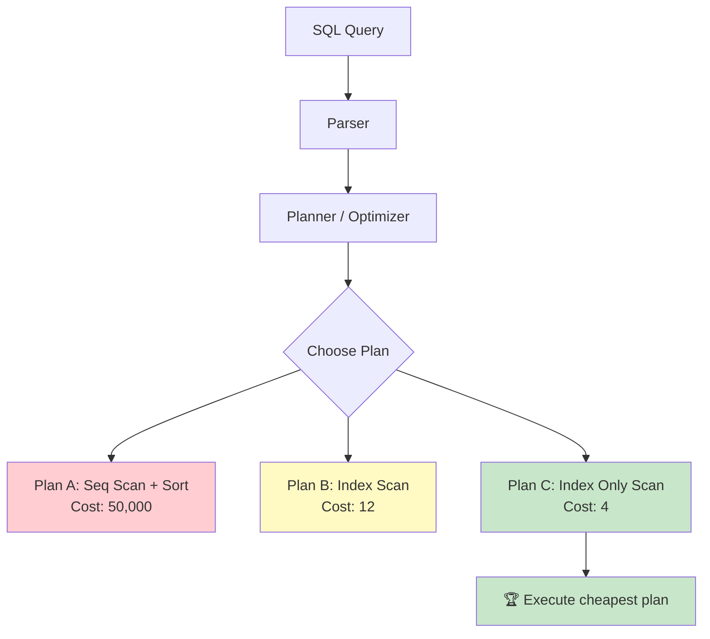
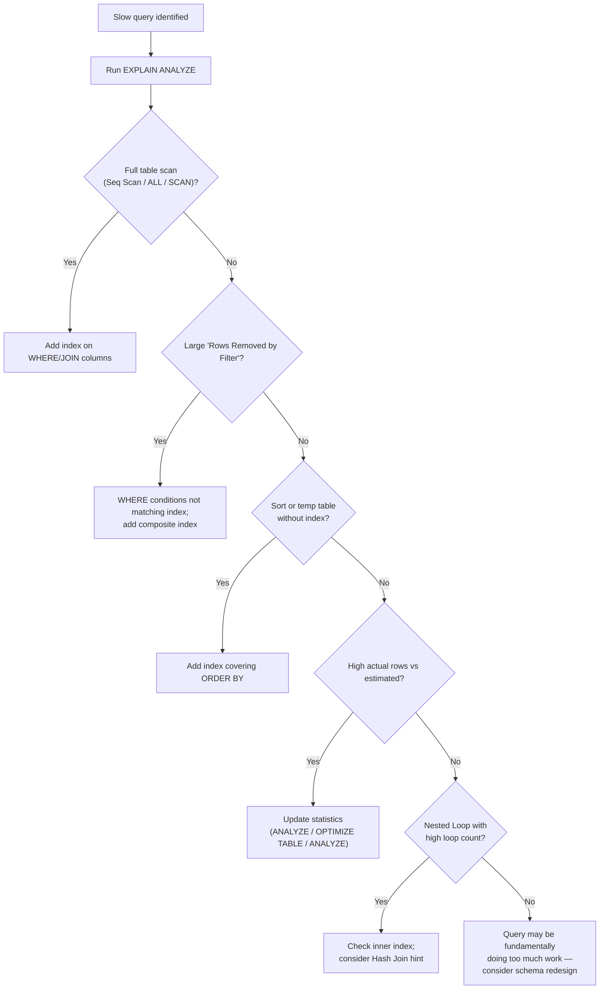

# Reading the EXPLAIN Plan 🔴

> **What you'll learn:**
> - How to use `EXPLAIN ANALYZE` (Postgres), `EXPLAIN` / `EXPLAIN ANALYZE` (MySQL), and `EXPLAIN QUERY PLAN` (SQLite) to diagnose slow queries
> - How to read execution plan trees: identifying sequential scans, index scans, hash joins, nested loops, and sorts
> - The critical node types and cost metrics for each database, and what "good" vs. "bad" plans look like
> - A systematic methodology for query optimization based on plan analysis

---

## Why Read Execution Plans?

The query optimizer transforms your SQL into a physical execution plan — a tree of operations that the engine actually runs. Two logically equivalent queries can have execution plans that differ by orders of magnitude in performance. Reading the plan is the only way to know **why** a query is slow.



## PostgreSQL: EXPLAIN ANALYZE

### Basic Syntax

```sql
-- Plan only (does NOT execute)
EXPLAIN SELECT * FROM users WHERE email = 'alice@example.com';

-- Plan + actual execution (RUNS the query)
EXPLAIN ANALYZE SELECT * FROM users WHERE email = 'alice@example.com';

-- Full details with buffers and timing
EXPLAIN (ANALYZE, BUFFERS, FORMAT TEXT)
SELECT * FROM users WHERE email = 'alice@example.com';

-- JSON format (for tooling like pgMustard, explain.dalibo.com)
EXPLAIN (ANALYZE, BUFFERS, FORMAT JSON)
SELECT * FROM users WHERE email = 'alice@example.com';
```

### Reading Postgres Plans

A Postgres plan is a tree read **bottom-up, innermost to outermost**. Each node shows:

```
Node Type on table (cost=startup..total rows=estimated width=bytes)
  (actual time=startup..total rows=actual loops=iterations)
```

**Example — Index Scan:**
```
Index Scan using idx_users_email on users  (cost=0.42..8.44 rows=1 width=256)
  (actual time=0.028..0.030 rows=1 loops=1)
  Index Cond: (email = 'alice@example.com'::text)
  Buffers: shared hit=3
Planning Time: 0.085 ms
Execution Time: 0.052 ms
```

**Example — Sequential Scan (bad):**
```
Seq Scan on users  (cost=0.00..125000.00 rows=1 width=256)
  (actual time=892.451..892.453 rows=1 loops=1)
  Filter: (email = 'alice@example.com'::text)
  Rows Removed by Filter: 4999999
  Buffers: shared hit=75000
Planning Time: 0.055 ms
Execution Time: 892.480 ms
```

### Postgres Node Types — Quick Reference

| Node | What It Does | Speed | When You See It |
|---|---|---|---|
| **Seq Scan** | Reads every row in the table | 🔴 Slow for large tables | No usable index; or table is small |
| **Index Scan** | B-tree traversal + heap fetch | 🟢 Fast | Selective WHERE on indexed column |
| **Index Only Scan** | B-tree only, no heap fetch | 🟢🟢 Fastest | All columns in the index (covering) |
| **Bitmap Index Scan** | Builds bitmap of matching pages | 🟡 Medium | Multiple conditions on different indexes |
| **Bitmap Heap Scan** | Fetches pages from bitmap | 🟡 | Follows Bitmap Index Scan |
| **Nested Loop** | For each outer row, scan inner | 🟢 if indexed inner | Small outer set; indexed JOIN |
| **Hash Join** | Build hash table, probe | 🟡 | Large equi-joins |
| **Merge Join** | Merge two sorted inputs | 🟡 | Pre-sorted or indexed inputs |
| **Sort** | In-memory or on-disk sort | 🔴 if on-disk | ORDER BY, DISTINCT, Merge Join |
| **HashAggregate** | GROUP BY via hash table | 🟢 | Small number of groups |
| **GroupAggregate** | GROUP BY via sorted input | 🟡 | Large number of groups |
| **Materialize** | Cache subquery results | 🟡 | CTE or subquery reuse |
| **Gather / Gather Merge** | Parallel worker combination | 🟢 | Parallel query |

### Interpreting Costs and Buffers

| Metric | What It Means |
|---|---|
| `cost=0.42..8.44` | Estimated cost in arbitrary units (based on `seq_page_cost` etc.). First number = startup cost, second = total cost. |
| `rows=1` | Estimated rows returned by this node |
| `actual time=0.028..0.030` | Real wall-clock time in milliseconds (with ANALYZE) |
| `rows=1` (actual) | Actual rows returned |
| `loops=1` | How many times this node was executed (important for Nested Loops) |
| `Buffers: shared hit=3` | Pages read from PostgreSQL's buffer cache |
| `Buffers: shared read=50` | Pages read from disk (OS may have cached them) |
| `Rows Removed by Filter: 4999999` | 🔴 Red flag — filtered rows = wasted work |

```sql
-- 💥 PERFORMANCE HAZARD: Large "Rows Removed by Filter" in Seq Scan
EXPLAIN ANALYZE
SELECT * FROM events WHERE user_id = 42 AND created_at > '2025-01-01';
-- Seq Scan on events  (cost=0.00..1250000.00 rows=500 width=128)
--   Filter: ((user_id = 42) AND (created_at > '2025-01-01'))
--   Rows Removed by Filter: 9999500  ← Read 10M rows to find 500

-- ✅ FIX: Composite index matching the query
CREATE INDEX idx_events_user_date ON events (user_id, created_at);
-- Index Scan using idx_events_user_date on events  (cost=0.56..52.30 rows=500 width=128)
--   Index Cond: ((user_id = 42) AND (created_at > '2025-01-01'))
--   Buffers: shared hit=35
```

## MySQL: EXPLAIN and EXPLAIN ANALYZE

### Basic Syntax

```sql
-- Tabular format (traditional)
EXPLAIN SELECT * FROM users WHERE email = 'alice@example.com';

-- Tree format (MySQL 8.0.16+, more like Postgres)
EXPLAIN FORMAT=TREE SELECT * FROM users WHERE email = 'alice@example.com';

-- JSON format (detailed cost info)
EXPLAIN FORMAT=JSON SELECT * FROM users WHERE email = 'alice@example.com';

-- EXPLAIN ANALYZE (MySQL 8.0.18+): Actually executes
EXPLAIN ANALYZE SELECT * FROM users WHERE email = 'alice@example.com';
```

### Reading MySQL's Tabular EXPLAIN

```
+----+-------------+-------+------+---------------+-----------+---------+-------+------+-------+
| id | select_type | table | type | possible_keys | key       | key_len | ref   | rows | Extra |
+----+-------------+-------+------+---------------+-----------+---------+-------+------+-------+
|  1 | SIMPLE      | users | ref  | idx_email     | idx_email | 767     | const |    1 |       |
+----+-------------+-------+------+---------------+-----------+---------+-------+------+-------+
```

### MySQL Access Types (Recap from Ch 7)

| type | Description | Action |
|---|---|---|
| `system` / `const` | Exactly one row | ✅ Perfect |
| `eq_ref` | Unique index lookup per join row | ✅ Great |
| `ref` | Non-unique index lookup | ✅ Good |
| `range` | Index range scan | ✅ Acceptable |
| `index` | Full index scan (all entries) | ⚠️ May be slow |
| `ALL` | **Full table scan** | 🔴 Fix this |

### EXPLAIN ANALYZE Tree Format

```sql
EXPLAIN ANALYZE
SELECT u.name, COUNT(o.id)
FROM users u
JOIN orders o ON o.user_id = u.id
WHERE u.created_at > '2025-01-01'
GROUP BY u.id\G
```

```
-> Group aggregate: count(o.id)  (actual time=12.5..145.3 rows=5000 loops=1)
    -> Nested loop inner join  (actual time=0.15..120.8 rows=25000 loops=1)
        -> Filter: (u.created_at > '2025-01-01')  (actual time=0.08..5.2 rows=5000 loops=1)
            -> Index range scan on u using idx_created  (actual time=0.07..3.8 rows=5000 loops=1)
        -> Index lookup on o using idx_user_id (user_id=u.id)  (actual time=0.015..0.020 rows=5 loops=5000)
```

**Reading this tree:**
1. Start from the innermost (most indented) node
2. `Index range scan on u` — reads 5,000 users using the created_at index
3. For each user, `Index lookup on o` — finds matching orders (5 per user, 5000 loops)
4. `Nested loop inner join` — combines them (5000 × 5 = 25,000 rows)
5. `Group aggregate` — groups by user and counts

## SQLite: EXPLAIN QUERY PLAN

### Basic Syntax

```sql
-- Human-readable plan
EXPLAIN QUERY PLAN
SELECT * FROM users WHERE email = 'alice@example.com';
```

**Output:**
```
QUERY PLAN
`--SEARCH users USING INDEX idx_users_email (email=?)
```

### SQLite Plan Operations

| Operation | Meaning | Speed |
|---|---|---|
| `SCAN table` | Full table scan (reads all rows) | 🔴 |
| `SEARCH table USING INDEX idx (col=?)` | Index lookup | 🟢 |
| `SEARCH table USING INTEGER PRIMARY KEY (rowid=?)` | Direct rowid lookup | 🟢🟢 |
| `SEARCH table USING COVERING INDEX idx (col=?)` | Index-only (no table access) | 🟢🟢 |
| `USE TEMP B-TREE FOR ORDER BY` | Sort required (no index) | ⚠️ |
| `USE TEMP B-TREE FOR GROUP BY` | Temp structure for grouping | ⚠️ |
| `USING TEMP B-TREE FOR DISTINCT` | Deduplication without index | ⚠️ |
| `COMPOUND SUBQUERIES` | UNION / UNION ALL | — |
| `CORRELATED SCALAR SUBQUERY` | Runs subquery per row | 🔴 |

### SQLite's Full EXPLAIN

```sql
-- Bytecode-level plan (for experts)
EXPLAIN SELECT * FROM users WHERE email = 'alice@example.com';
```

This shows the SQLite virtual machine opcodes:
```
addr  opcode         p1    p2    p3    p4             p5  comment
----  -------------  ----  ----  ----  -------------  --  --------
0     Init           0     12    0                    0   Start at 12
1     OpenRead       0     2     0     3              0   root=2 iDb=0; users
2     OpenRead       1     4     0     k(2,,)         2   root=4 iDb=0; idx_users_email
3     String8        0     1     0     alice@example  0   r[1]='alice@example.com'
4     SeekGE         1     11    1     1              0   key=r[1]
...
```

> Most developers should use `EXPLAIN QUERY PLAN`, not `EXPLAIN`. The bytecodes are only useful for SQLite engine developers.

## Cross-Database EXPLAIN Comparison

| Aspect | PostgreSQL | MySQL | SQLite |
|---|---|---|---|
| **Command** | `EXPLAIN ANALYZE` | `EXPLAIN ANALYZE` (8.0.18+) | `EXPLAIN QUERY PLAN` |
| **Shows actual timing** | ✅ (with ANALYZE) | ✅ (with ANALYZE) | ❌ |
| **Shows buffer/IO info** | ✅ (with BUFFERS) | Partial | ❌ |
| **Shows row estimates vs actual** | ✅ | ✅ (tree format) | ❌ (estimates only in `.eqp on`) |
| **Format options** | TEXT, JSON, XML, YAML | Traditional, TREE, JSON | Text only |
| **Must execute query** | Only with ANALYZE | Only with ANALYZE | Never (plan only) |

## A Systematic Optimization Methodology



### Step-by-Step Checklist

1. **Add `EXPLAIN ANALYZE`** (or `EXPLAIN QUERY PLAN` for SQLite) before your query
2. **Find the most expensive node** (highest actual time, most rows examined)
3. **Check the access method:**
   - `Seq Scan` / `type=ALL` / `SCAN table` → Missing index
   - `Bitmap Heap Scan` → Multiple conditions; may need composite index
   - `Index Scan` → Good; check selectivity
4. **Check for sorts without indexes:** `Sort` / `Using filesort` / `USE TEMP B-TREE FOR ORDER BY`
5. **Check row estimates vs. actuals:** If wildly different, run `ANALYZE` to update statistics
6. **Check for Nested Loops with high loop counts:** Each loop executes the inner node once

```sql
-- PostgreSQL: Update statistics
ANALYZE users;
ANALYZE events;

-- MySQL: Update statistics
ANALYZE TABLE users;
ANALYZE TABLE events;

-- SQLite: Update statistics
ANALYZE;
-- Or on connection close: PRAGMA optimize;
```

---

<details>
<summary><strong>🏋️ Exercise: The Slow Dashboard Query</strong> (click to expand)</summary>

You have this query running on a 10-million row `events` table:

```sql
SELECT
    u.name,
    COUNT(*) AS event_count,
    MAX(e.created_at) AS last_event
FROM users u
JOIN events e ON e.user_id = u.id
WHERE e.event_type = 'purchase'
  AND e.created_at >= '2025-01-01'
  AND e.created_at < '2025-04-01'
GROUP BY u.id, u.name
ORDER BY event_count DESC
LIMIT 20;
```

Indexes currently on the `events` table:
```sql
CREATE INDEX idx_events_user_id ON events (user_id);
CREATE INDEX idx_events_created ON events (created_at);
CREATE INDEX idx_events_type ON events (event_type);
```

The query takes 8 seconds. The EXPLAIN shows a Bitmap Heap Scan combining all three indexes with a BitmapOr, followed by a Sort.

**Challenge:** Diagnose why this is slow and propose the optimal index. Write the `CREATE INDEX` statement and explain why it solves the problem.

<details>
<summary>🔑 Solution</summary>

**Diagnosis:** The optimizer is combining three single-column indexes via BitmapOr/BitmapAnd, which requires reading all bitmap results, ANDing them, then fetching rows from the heap. This is slow because:
1. Each individual index returns many rows
2. The intersection step is expensive
3. The final sort (`ORDER BY event_count DESC`) requires a full GroupAggregate + Sort

**The optimal index is a composite covering index:**

```sql
-- PostgreSQL:
CREATE INDEX idx_events_type_date_user ON events (event_type, created_at, user_id);
-- Column order matters:
-- 1. event_type = 'purchase' (equality first — narrows immediately)
-- 2. created_at >= ... AND < ... (range second — B-tree range scan)
-- 3. user_id (included for covering — avoids heap fetch)

-- MySQL (same):
CREATE INDEX idx_events_type_date_user ON events (event_type, created_at, user_id);

-- SQLite (same):
CREATE INDEX idx_events_type_date_user ON events (event_type, created_at, user_id);
```

**Why this works:**
1. The B-tree navigates directly to `event_type = 'purchase'` entries
2. Within those, it range-scans `created_at >= '2025-01-01' AND < '2025-04-01'`
3. `user_id` is in the index, so the join can proceed without a heap lookup (covering index)
4. The optimizer can now use a single index scan instead of three bitmap scans

**Verification:**
```sql
-- PostgreSQL
EXPLAIN ANALYZE SELECT ...;
-- Expected: Index Only Scan using idx_events_type_date_user
-- Execution time: ~50ms (down from 8s)

-- MySQL
EXPLAIN FORMAT=TREE SELECT ...;
-- Expected: Index range scan using idx_events_type_date_user

-- SQLite
EXPLAIN QUERY PLAN SELECT ...;
-- Expected: SEARCH events USING INDEX idx_events_type_date_user (event_type=? AND created_at>? AND created_at<?)
```

**The rule for composite index column order:**
1. **Equality columns first** (highest selectivity)
2. **Range columns second** (the B-tree can still range-scan)
3. **Covering columns last** (avoid heap lookup; ORDER BY columns if possible)

</details>
</details>

---

> **Key Takeaways**
> - Always use `EXPLAIN ANALYZE` (Postgres/MySQL) or `EXPLAIN QUERY PLAN` (SQLite) — never guess about performance.
> - Read plans bottom-up (innermost/most-indented node first). The most expensive node is usually the root cause.
> - Full table scans (`Seq Scan` / `ALL` / `SCAN`) on large tables are the #1 performance problem — add an index.
> - For composite indexes: **equality columns first, range columns second, covering columns last**.
> - Large discrepancies between estimated and actual rows mean stale statistics — run `ANALYZE`.
> - Postgres shows the most detail (`BUFFERS`, `IO`, custom formats). MySQL's tree format (8.0.18+) is catching up. SQLite is plan-only with no timing data.
