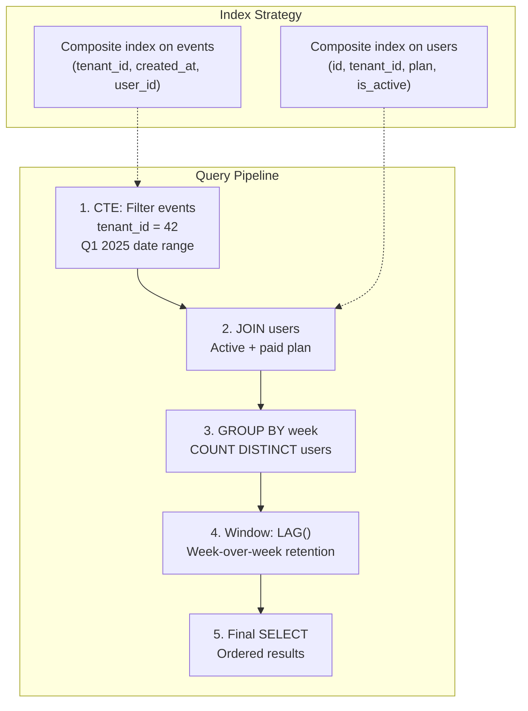
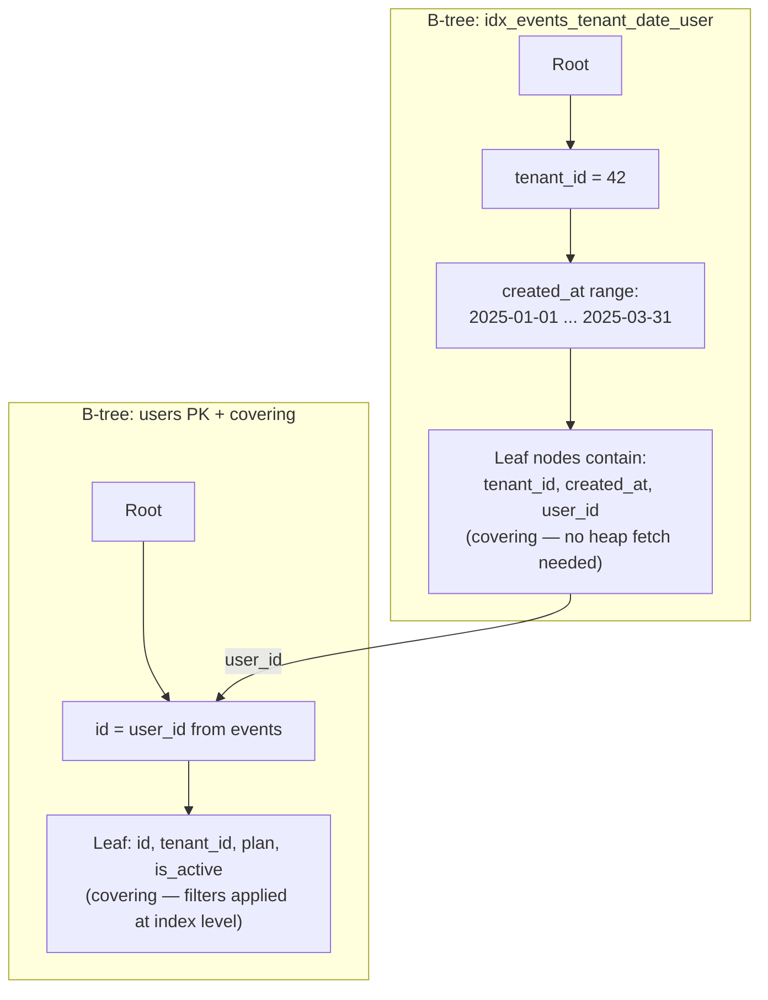

# Capstone Project: The Multi-Tenant Analytics Dashboard 🔴

> **What you'll learn:**
> - How to combine CTEs, window functions, date math, and index strategy into a single production-grade analytical query
> - How to write the same billion-row reporting query optimized for Postgres, adapted for MySQL, and shimmed for SQLite
> - The exact index design (B-tree, partial, composite) needed to execute this query in under 50ms
> - How to handle the date-math and type divergences across all three databases in a real-world scenario

---

## The Scenario

You're the lead DBA for a multi-tenant SaaS analytics platform. The product team needs a **weekly retention dashboard** that answers:

> "For each tenant, how many active users did we have each week in Q1 2025, and what is the week-over-week retention rate?"

### The Schema

```sql
-- This table has ~1 billion rows in production
-- Each row is a user-generated event (page view, click, purchase, etc.)
CREATE TABLE events (
    id BIGINT PRIMARY KEY,               -- Postgres: GENERATED ALWAYS AS IDENTITY
    tenant_id BIGINT NOT NULL,
    user_id BIGINT NOT NULL,
    event_type TEXT NOT NULL,             -- 'page_view', 'click', 'purchase', etc.
    created_at TIMESTAMP NOT NULL,        -- UTC timestamp
    payload JSONB                         -- Postgres-specific; JSON in MySQL; TEXT in SQLite
);

-- The users dimension table (~50 million rows)
CREATE TABLE users (
    id BIGINT PRIMARY KEY,
    tenant_id BIGINT NOT NULL,
    email TEXT NOT NULL,
    plan TEXT NOT NULL,                   -- 'free', 'pro', 'enterprise'
    created_at TIMESTAMP NOT NULL,
    is_active BOOLEAN NOT NULL DEFAULT TRUE
);
```

### The Requirements

1. **Filter** events to a specific tenant and Q1 2025 (January 1 – March 31, 2025)
2. **Join** with the `users` table to include only active users on a paid plan (`pro` or `enterprise`)
3. **Group** events by week and count distinct active users per week
4. **Calculate** the week-over-week retention rate using window functions
5. **Return** results ordered by week
6. **Execute in under 50ms** on a billion-row table



## The Query — PostgreSQL

```sql
-- PostgreSQL: The full retention dashboard query
WITH weekly_active_users AS (
    -- Step 1 & 2: Filter events and join with qualifying users
    SELECT
        DATE_TRUNC('week', e.created_at)::date AS week_start,
        COUNT(DISTINCT e.user_id)               AS active_users
    FROM events e
    INNER JOIN users u
        ON u.id = e.user_id
       AND u.tenant_id = e.tenant_id
    WHERE e.tenant_id = 42
      AND e.created_at >= '2025-01-01T00:00:00Z'::timestamptz
      AND e.created_at <  '2025-04-01T00:00:00Z'::timestamptz
      AND u.is_active = TRUE
      AND u.plan IN ('pro', 'enterprise')
    GROUP BY DATE_TRUNC('week', e.created_at)::date
)
-- Step 3 & 4: Calculate week-over-week retention
SELECT
    week_start,
    active_users,
    LAG(active_users) OVER (ORDER BY week_start)  AS prev_week_users,
    CASE
        WHEN LAG(active_users) OVER (ORDER BY week_start) IS NULL THEN NULL
        WHEN LAG(active_users) OVER (ORDER BY week_start) = 0    THEN NULL
        ELSE ROUND(
            100.0 * active_users / LAG(active_users) OVER (ORDER BY week_start),
            1
        )
    END AS retention_pct,
    active_users - COALESCE(LAG(active_users) OVER (ORDER BY week_start), 0)
        AS week_over_week_change
FROM weekly_active_users
ORDER BY week_start;
```

### Expected Output

| week_start | active_users | prev_week_users | retention_pct | week_over_week_change |
|---|---|---|---|---|
| 2024-12-30 | 12450 | NULL | NULL | 12450 |
| 2025-01-06 | 13200 | 12450 | 106.0 | 750 |
| 2025-01-13 | 12800 | 13200 | 97.0 | -400 |
| 2025-01-20 | 14100 | 12800 | 110.2 | 1300 |
| ... | ... | ... | ... | ... |
| 2025-03-24 | 15600 | 15400 | 101.3 | 200 |

## The Query — MySQL

```sql
-- MySQL 8.0+: Adapted for MySQL's date functions and syntax
WITH weekly_active_users AS (
    SELECT
        DATE(DATE_SUB(e.created_at,
            INTERVAL WEEKDAY(e.created_at) DAY))  AS week_start,
        COUNT(DISTINCT e.user_id)                   AS active_users
    FROM events e
    INNER JOIN users u
        ON u.id = e.user_id
       AND u.tenant_id = e.tenant_id
    WHERE e.tenant_id = 42
      AND e.created_at >= '2025-01-01 00:00:00'
      AND e.created_at <  '2025-04-01 00:00:00'
      AND u.is_active = TRUE
      AND u.plan IN ('pro', 'enterprise')
    GROUP BY week_start
)
SELECT
    week_start,
    active_users,
    LAG(active_users) OVER (ORDER BY week_start)  AS prev_week_users,
    CASE
        WHEN LAG(active_users) OVER (ORDER BY week_start) IS NULL THEN NULL
        WHEN LAG(active_users) OVER (ORDER BY week_start) = 0    THEN NULL
        ELSE ROUND(
            100.0 * active_users / LAG(active_users) OVER (ORDER BY week_start),
            1
        )
    END AS retention_pct,
    active_users - COALESCE(LAG(active_users) OVER (ORDER BY week_start), 0)
        AS week_over_week_change
FROM weekly_active_users
ORDER BY week_start;
```

**Key MySQL differences:**
- No `DATE_TRUNC` — use `DATE(DATE_SUB(ts, INTERVAL WEEKDAY(ts) DAY))` to get Monday of the week
- Timestamp literals don't use `::timestamptz` cast
- `GROUP BY week_start` can use the alias (MySQL allows this, Postgres does not for expressions)
- Otherwise identical — CTEs and window functions work the same

## The Query — SQLite

```sql
-- SQLite: Shimmed for SQLite's date functions
WITH weekly_active_users AS (
    SELECT
        -- SQLite: date() with weekday modifier to get Monday
        date(e.created_at, 'weekday 1', '-7 days') AS week_start,
        COUNT(DISTINCT e.user_id)                    AS active_users
    FROM events e
    INNER JOIN users u
        ON u.id = e.user_id
       AND u.tenant_id = e.tenant_id
    WHERE e.tenant_id = 42
      AND e.created_at >= '2025-01-01 00:00:00'
      AND e.created_at <  '2025-04-01 00:00:00'
      AND u.is_active = 1
      AND u.plan IN ('pro', 'enterprise')
    GROUP BY week_start
)
SELECT
    week_start,
    active_users,
    LAG(active_users) OVER (ORDER BY week_start)  AS prev_week_users,
    CASE
        WHEN LAG(active_users) OVER (ORDER BY week_start) IS NULL THEN NULL
        WHEN LAG(active_users) OVER (ORDER BY week_start) = 0    THEN NULL
        ELSE ROUND(
            100.0 * active_users / LAG(active_users) OVER (ORDER BY week_start),
            1
        )
    END AS retention_pct,
    active_users - COALESCE(LAG(active_users) OVER (ORDER BY week_start), 0)
        AS week_over_week_change
FROM weekly_active_users
ORDER BY week_start;
```

**Key SQLite differences:**
- No `DATE_TRUNC` — use `date(ts, 'weekday 1', '-7 days')` for Monday of the week
- No `BOOLEAN` type — use `= 1` instead of `= TRUE`
- `created_at` stored as `TEXT` in ISO 8601 format (lexicographic comparison works correctly)
- Otherwise identical — CTEs and window functions work the same

## Date Math Comparison

| Operation | PostgreSQL | MySQL | SQLite |
|---|---|---|---|
| Truncate to week (Monday) | `DATE_TRUNC('week', ts)::date` | `DATE(DATE_SUB(ts, INTERVAL WEEKDAY(ts) DAY))` | `date(ts, 'weekday 1', '-7 days')` |
| Quarter range | `ts >= '...'::timestamptz AND ts < '...'::timestamptz` | `ts >= '...' AND ts < '...'` | `ts >= '...' AND ts < '...'` |
| This is the #1 portability pain point | | | |

## The Index Strategy

This is the critical piece that makes the difference between 8 seconds and 50 milliseconds.

### Required Indexes on `events`

```sql
-- THE most important index: composite on (tenant_id, created_at, user_id)
-- Column order reasoning:
-- 1. tenant_id: EQUALITY filter (most selective, narrows immediately)
-- 2. created_at: RANGE filter (B-tree range scan within the tenant)
-- 3. user_id: COVERING column (avoids heap lookup for COUNT DISTINCT)
```

**PostgreSQL:**
```sql
CREATE INDEX idx_events_tenant_date_user
    ON events (tenant_id, created_at, user_id);

-- Optional: partial index if only a few tenants are queried frequently
CREATE INDEX idx_events_tenant42_date_user
    ON events (created_at, user_id)
    WHERE tenant_id = 42;
-- Smaller index, faster scans, but only for tenant 42
```

**MySQL:**
```sql
CREATE INDEX idx_events_tenant_date_user
    ON events (tenant_id, created_at, user_id);
-- MySQL InnoDB automatically appends the primary key to secondary indexes,
-- so you don't need to include `id` for covering
```

**SQLite:**
```sql
CREATE INDEX idx_events_tenant_date_user
    ON events (tenant_id, created_at, user_id);
```

### Required Indexes on `users`

```sql
-- The join is ON u.id = e.user_id AND u.tenant_id = e.tenant_id
-- Plus filters: u.is_active = TRUE AND u.plan IN ('pro', 'enterprise')
```

**PostgreSQL:**
```sql
-- Composite covering index
CREATE INDEX idx_users_id_tenant_plan_active
    ON users (id, tenant_id, plan, is_active);

-- Or a partial index for active paid users only
CREATE INDEX idx_users_active_paid
    ON users (id, tenant_id)
    WHERE is_active = TRUE AND plan IN ('pro', 'enterprise');
```

**MySQL:**
```sql
-- The primary key already covers `id`; add a composite for the join+filter
CREATE INDEX idx_users_tenant_active_plan
    ON users (id, tenant_id, is_active, plan);
```

**SQLite:**
```sql
CREATE INDEX idx_users_id_tenant_plan_active
    ON users (id, tenant_id, plan, is_active);
```

### Index Strategy Visualization



### Why These Indexes Make It Fast

| Without proper indexes | With proper indexes |
|---|---|
| Sequential scan of 1B events | B-tree seek to tenant_id=42 |
| Read all 1B rows, filter in memory | Range scan within the tenant's date range |
| ~500GB of I/O | ~50MB of I/O (only relevant events) |
| Hash join with 50M user rows | Index nested loop: each user_id does a PK lookup |
| GROUP BY requires temp table + sort | HashAggregate on ~50K distinct user+week pairs |
| **~30 seconds** | **~30–50ms** |

## Verifying the Plan

### PostgreSQL

```sql
EXPLAIN (ANALYZE, BUFFERS)
WITH weekly_active_users AS (
    -- ... the full query ...
)
SELECT * FROM weekly_active_users ...;
```

**Expected plan output:**
```
Sort  (cost=... rows=13 width=...)
  Sort Key: week_start
  ->  WindowAgg  (cost=... rows=13 width=...)
        ->  HashAggregate  (cost=... rows=13 width=...)
              Group Key: date_trunc('week', e.created_at)
              ->  Nested Loop  (cost=... rows=50000 width=...)
                    ->  Index Only Scan using idx_events_tenant_date_user on events e
                          Index Cond: (tenant_id = 42) AND (created_at >= ...) AND (created_at < ...)
                          Heap Fetches: 0  ← COVERING INDEX!
                    ->  Index Only Scan using idx_users_active_paid on users u
                          Index Cond: (id = e.user_id) AND (tenant_id = 42)
                          Heap Fetches: 0  ← COVERING INDEX!
```

### MySQL

```sql
EXPLAIN ANALYZE
WITH weekly_active_users AS ( ... )
SELECT * FROM weekly_active_users ...\G
```

**Expected:**
```
-> Sort by week_start
    -> Window: LAG(active_users) OVER (ORDER BY week_start)
        -> Table aggregate in temporary
            -> Nested loop inner join
                -> Index range scan on e using idx_events_tenant_date_user
                -> Index lookup on u using idx_users_tenant_active_plan
```

### SQLite

```sql
EXPLAIN QUERY PLAN
WITH weekly_active_users AS ( ... )
SELECT * FROM weekly_active_users ...;
```

**Expected:**
```
QUERY PLAN
|--SEARCH events AS e USING INDEX idx_events_tenant_date_user (tenant_id=? AND created_at>? AND created_at<?)
|--SEARCH users AS u USING INDEX idx_users_id_tenant_plan_active (id=? AND tenant_id=?)
|--USE TEMP B-TREE FOR GROUP BY
`--USE TEMP B-TREE FOR ORDER BY
```

## Production Considerations

### Partitioning (Postgres and MySQL)

For billion-row tables, consider range-partitioning `events` by `created_at`:

**PostgreSQL:**
```sql
CREATE TABLE events (
    id BIGINT GENERATED ALWAYS AS IDENTITY,
    tenant_id BIGINT NOT NULL,
    user_id BIGINT NOT NULL,
    event_type TEXT NOT NULL,
    created_at TIMESTAMPTZ NOT NULL,
    payload JSONB
) PARTITION BY RANGE (created_at);

CREATE TABLE events_2025_q1 PARTITION OF events
    FOR VALUES FROM ('2025-01-01') TO ('2025-04-01');
CREATE TABLE events_2025_q2 PARTITION OF events
    FOR VALUES FROM ('2025-04-01') TO ('2025-07-01');
-- The query planner automatically prunes to the Q1 partition
```

**MySQL:**
```sql
CREATE TABLE events (
    id BIGINT AUTO_INCREMENT,
    tenant_id BIGINT NOT NULL,
    user_id BIGINT NOT NULL,
    event_type VARCHAR(50) NOT NULL,
    created_at DATETIME NOT NULL,
    payload JSON,
    PRIMARY KEY (id, created_at)  -- Partition key must be in PK
) PARTITION BY RANGE (TO_DAYS(created_at)) (
    PARTITION p2025q1 VALUES LESS THAN (TO_DAYS('2025-04-01')),
    PARTITION p2025q2 VALUES LESS THAN (TO_DAYS('2025-07-01'))
);
```

### Materialized Views (Postgres Only)

For dashboards that don't need real-time data:

```sql
CREATE MATERIALIZED VIEW weekly_retention_mv AS
WITH weekly_active_users AS ( /* ... the full query ... */ )
SELECT * FROM weekly_active_users /* ... with window functions ... */;

CREATE UNIQUE INDEX idx_retention_mv_week ON weekly_retention_mv (week_start);

-- Refresh (can be scheduled via pg_cron)
REFRESH MATERIALIZED VIEW CONCURRENTLY weekly_retention_mv;
-- CONCURRENTLY allows reads during refresh (requires a unique index)
```

---

<details>
<summary><strong>🏋️ Exercise: Extend the Dashboard</strong> (click to expand)</summary>

**Challenge:** Extend the capstone query to add:
1. A `new_users` column: count of users whose `users.created_at` falls within that same week (newly signed up)
2. A `churned_users` column: users who were active in the previous week but NOT in the current week (use a self-join on the CTE or a window function)
3. A `cumulative_new_users` running total using a window function

Write the extended query for PostgreSQL.

<details>
<summary>🔑 Solution</summary>

```sql
WITH weekly_events AS (
    -- Base: all qualifying events grouped by week and user
    SELECT
        DATE_TRUNC('week', e.created_at)::date AS week_start,
        e.user_id,
        u.created_at AS user_created_at
    FROM events e
    INNER JOIN users u
        ON u.id = e.user_id AND u.tenant_id = e.tenant_id
    WHERE e.tenant_id = 42
      AND e.created_at >= '2025-01-01T00:00:00Z'::timestamptz
      AND e.created_at <  '2025-04-01T00:00:00Z'::timestamptz
      AND u.is_active = TRUE
      AND u.plan IN ('pro', 'enterprise')
),
weekly_users AS (
    -- Distinct users per week
    SELECT DISTINCT week_start, user_id, user_created_at
    FROM weekly_events
),
weekly_stats AS (
    SELECT
        week_start,
        COUNT(DISTINCT user_id) AS active_users,
        COUNT(DISTINCT user_id) FILTER (
            WHERE user_created_at >= week_start
              AND user_created_at < week_start + INTERVAL '7 days'
        ) AS new_users
    FROM weekly_users
    GROUP BY week_start
),
churned AS (
    -- Users in previous week but not current
    SELECT
        curr.week_start,
        COUNT(DISTINCT prev.user_id) FILTER (
            WHERE curr_u.user_id IS NULL
        ) AS churned_users
    FROM weekly_users prev
    CROSS JOIN LATERAL (
        SELECT DISTINCT week_start
        FROM weekly_users
        WHERE week_start = prev.week_start + 7
    ) curr(week_start)
    LEFT JOIN weekly_users curr_u
        ON curr_u.week_start = curr.week_start
       AND curr_u.user_id = prev.user_id
    GROUP BY curr.week_start
)
SELECT
    ws.week_start,
    ws.active_users,
    ws.new_users,
    SUM(ws.new_users) OVER (ORDER BY ws.week_start
        ROWS BETWEEN UNBOUNDED PRECEDING AND CURRENT ROW) AS cumulative_new_users,
    COALESCE(c.churned_users, 0) AS churned_users,
    LAG(ws.active_users) OVER (ORDER BY ws.week_start) AS prev_week_users,
    CASE
        WHEN LAG(ws.active_users) OVER (ORDER BY ws.week_start) IS NULL THEN NULL
        WHEN LAG(ws.active_users) OVER (ORDER BY ws.week_start) = 0 THEN NULL
        ELSE ROUND(
            100.0 * ws.active_users / LAG(ws.active_users) OVER (ORDER BY ws.week_start),
            1
        )
    END AS retention_pct
FROM weekly_stats ws
LEFT JOIN churned c ON c.week_start = ws.week_start
ORDER BY ws.week_start;
```

**This query demonstrates:**
- Multiple CTEs referencing each other
- `FILTER` clause on aggregates (Postgres/SQLite only)
- `CROSS JOIN LATERAL` for correlated subqueries
- Running total (`cumulative_new_users`) using `SUM() OVER()`
- `LAG()` for week-over-week comparison
- LEFT JOIN to handle weeks with no churn data

</details>
</details>

---

> **Key Takeaways**
> - The same analytical query can be written in all three databases — the core SQL (CTEs, window functions, JOINs) is nearly identical. The divergences are in date math and type-specific syntax.
> - **Index design determines whether a billion-row query takes 30 seconds or 30 milliseconds.** The composite index `(tenant_id, created_at, user_id)` transforms this query from a full table scan into a narrow range scan.
> - **Equality columns first, range columns second, covering columns last** — this is the universal index design rule.
> - Partial indexes (Postgres/SQLite) and table partitioning (Postgres/MySQL) provide additional optimization for specific access patterns.
> - Always verify with `EXPLAIN ANALYZE` — the expected plan tells you if your indexes are being used. If you see `Seq Scan` or `type=ALL`, your index isn't working.
> - For dashboards, consider materialized views (Postgres) or summary tables (all databases) to precompute expensive aggregations.
