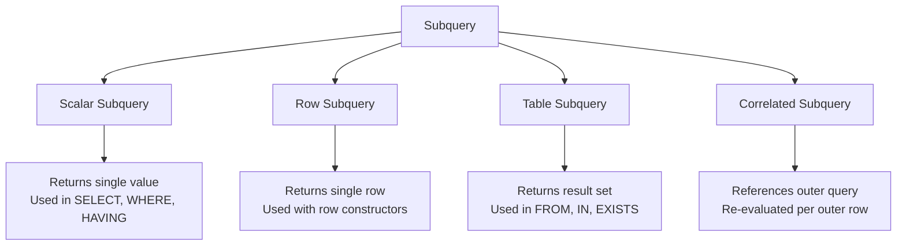
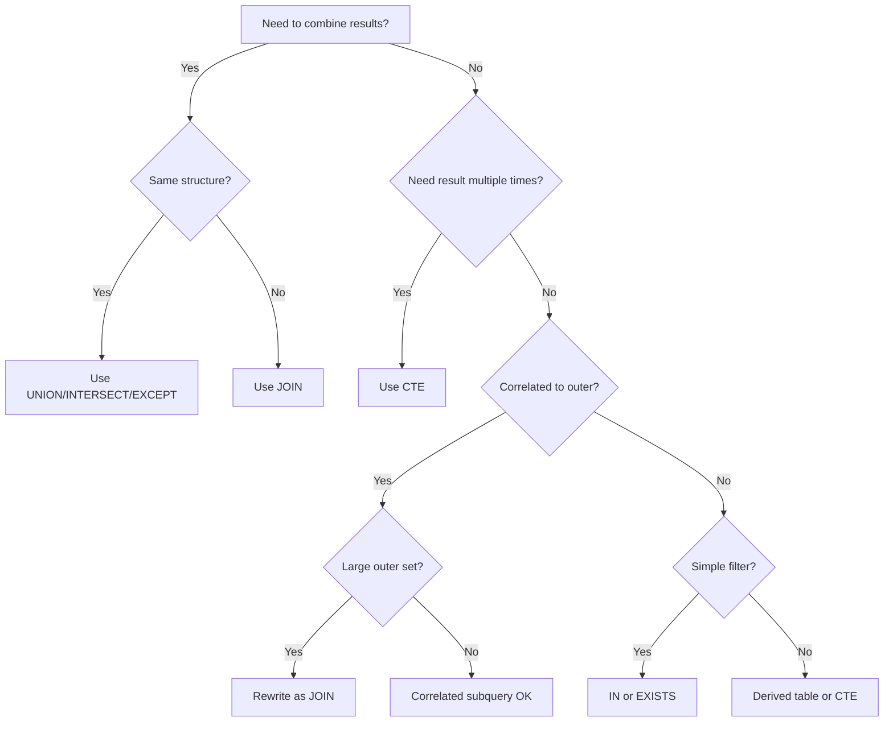

# Subqueries and SET Operations 🟡

> **Learning objectives:** Master scalar, row, and table subqueries in all three dialects. Understand correlated subqueries and when to prefer `EXISTS` over `IN`. Use UNION, INTERSECT, and EXCEPT effectively — and know where each engine diverges.

Subqueries are the SQL equivalent of inline functions: they let you nest one query inside another. Combined with SET operations (`UNION`, `INTERSECT`, `EXCEPT`), they form the backbone of complex data retrieval patterns that CTEs later build upon. This chapter dissects how each database handles them — and where the traps lie.

## Subquery Taxonomy



| Type | Returns | Used In | Example Pattern |
|---|---|---|---|
| Scalar | Single value | `SELECT`, `WHERE`, `HAVING` | `(SELECT MAX(salary) FROM emp)` |
| Row | Single row with multiple columns | `WHERE` with row constructor | `WHERE (a, b) = (SELECT ...)` |
| Table | Full result set | `FROM`, `IN`, `EXISTS` | `FROM (SELECT ...) AS sub` |
| Correlated | Varies; references outer query | `WHERE`, `SELECT` | `WHERE x > (SELECT AVG(x) FROM ... WHERE t.id = outer.id)` |

## Scalar Subqueries

A scalar subquery returns exactly one value. All three databases support them in `SELECT`, `WHERE`, and `HAVING` clauses.

**PostgreSQL / MySQL / SQLite:**
```sql
-- Find employees earning more than the company average
SELECT name, salary
FROM employees
WHERE salary > (SELECT AVG(salary) FROM employees);
```

### Scalar Subquery in a SELECT List

```sql
-- Attach department name inline (all dialects)
SELECT
    e.name,
    e.salary,
    (SELECT d.name FROM departments d WHERE d.id = e.dept_id) AS dept_name
FROM employees e;
```

⚠️ **Warning:** Scalar subqueries in `SELECT` execute once per outer row. For large result sets, a `JOIN` is almost always faster:

```sql
-- ✅ FIX: Replace scalar subquery with JOIN
SELECT e.name, e.salary, d.name AS dept_name
FROM employees e
JOIN departments d ON d.id = e.dept_id;
```

### Dialect Divergence: Scalar Subquery Returning Multiple Rows

| Behavior | PostgreSQL | MySQL | SQLite |
|---|---|---|---|
| Scalar subquery returns >1 row | ❌ Runtime error | ❌ Runtime error | ❌ Runtime error |
| Scalar subquery returns 0 rows | Returns `NULL` | Returns `NULL` | Returns `NULL` |

All three engines agree here — a scalar subquery **must** return at most one row.

## Row Subqueries and Row Constructors

Row subqueries return a single row with multiple columns, compared using a row constructor.

**PostgreSQL:**
```sql
-- Find the employee with the highest salary in each department
SELECT *
FROM employees e
WHERE (e.dept_id, e.salary) = (
    SELECT dept_id, MAX(salary)
    FROM employees
    WHERE dept_id = e.dept_id
    GROUP BY dept_id
);
```

**MySQL:**
```sql
-- Same syntax — MySQL supports row constructors
SELECT *
FROM employees e
WHERE (e.dept_id, e.salary) = (
    SELECT dept_id, MAX(salary)
    FROM employees
    WHERE dept_id = e.dept_id
    GROUP BY dept_id
);
```

**SQLite:**
```sql
-- ⚠️ SQLite does NOT support row constructors in comparisons
-- You must break it into individual column comparisons
SELECT *
FROM employees e
WHERE e.dept_id = (
    SELECT dept_id FROM employees WHERE dept_id = e.dept_id GROUP BY dept_id
)
AND e.salary = (
    SELECT MAX(salary) FROM employees WHERE dept_id = e.dept_id
);
```

| Feature | PostgreSQL | MySQL | SQLite |
|---|---|---|---|
| Row constructor `(a, b) = (SELECT ...)` | ✅ | ✅ | ❌ |
| Row constructor in `IN` | ✅ | ✅ | ❌ |
| Row constructor in `ORDER BY` | ✅ | ❌ | ❌ |

## Table Subqueries (Derived Tables)

A table subquery in the `FROM` clause creates a derived table. All three databases require an alias.

```sql
-- Top 3 departments by headcount (all dialects)
SELECT sub.dept_id, sub.headcount
FROM (
    SELECT dept_id, COUNT(*) AS headcount
    FROM employees
    GROUP BY dept_id
) AS sub
ORDER BY sub.headcount DESC
LIMIT 3;
```

### Lateral Joins (Correlated Derived Tables)

A `LATERAL` join lets the derived table reference columns from preceding tables — essentially a correlated table subquery.

**PostgreSQL:**
```sql
-- For each department, get the top-3 earners
SELECT d.name, top3.name AS emp_name, top3.salary
FROM departments d
CROSS JOIN LATERAL (
    SELECT e.name, e.salary
    FROM employees e
    WHERE e.dept_id = d.id
    ORDER BY e.salary DESC
    LIMIT 3
) AS top3;
```

**MySQL (8.0.14+):**
```sql
-- MySQL supports LATERAL since 8.0.14
SELECT d.name, top3.name AS emp_name, top3.salary
FROM departments d
CROSS JOIN LATERAL (
    SELECT e.name, e.salary
    FROM employees e
    WHERE e.dept_id = d.id
    ORDER BY e.salary DESC
    LIMIT 3
) AS top3;
```

**SQLite:**
```sql
-- ⚠️ SQLite does NOT support LATERAL joins
-- Workaround: use a correlated subquery with a CTE or window function
SELECT d.name, e.name AS emp_name, e.salary
FROM departments d
JOIN (
    SELECT *, ROW_NUMBER() OVER (PARTITION BY dept_id ORDER BY salary DESC) AS rn
    FROM employees
) e ON e.dept_id = d.id AND e.rn <= 3;
```

| Feature | PostgreSQL | MySQL | SQLite |
|---|---|---|---|
| `LATERAL` join | ✅ | ✅ (8.0.14+) | ❌ |
| Derived table alias required | ✅ | ✅ | ✅ |
| Correlated subquery in `FROM` (without `LATERAL`) | ❌ | ❌ | ❌ |

## Correlated Subqueries

A correlated subquery references a column from the outer query. It is re-evaluated for **every row** of the outer query.

```sql
-- Employees earning more than their department's average
-- Works in all three dialects
SELECT e.name, e.salary, e.dept_id
FROM employees e
WHERE e.salary > (
    SELECT AVG(e2.salary)
    FROM employees e2
    WHERE e2.dept_id = e.dept_id
);
```

### Performance Impact

```sql
-- 💥 PERFORMANCE HAZARD: Correlated subquery in SELECT
-- Executes once per row in the outer query
SELECT
    e.name,
    (SELECT COUNT(*) FROM orders o WHERE o.customer_id = e.id) AS order_count
FROM employees e;

-- ✅ FIX: Use a LEFT JOIN with aggregation
SELECT e.name, COALESCE(o.order_count, 0) AS order_count
FROM employees e
LEFT JOIN (
    SELECT customer_id, COUNT(*) AS order_count
    FROM orders
    GROUP BY customer_id
) o ON o.customer_id = e.id;
```

The optimizer in Postgres and MySQL can sometimes *decorrelate* subqueries into joins automatically, but you should never rely on this — write the join yourself.

## EXISTS vs IN

Two of the most frequently confused patterns:

```sql
-- Using IN with a subquery
SELECT name FROM customers
WHERE id IN (SELECT customer_id FROM orders WHERE total > 100);

-- Using EXISTS with a correlated subquery
SELECT name FROM customers c
WHERE EXISTS (SELECT 1 FROM orders o WHERE o.customer_id = c.id AND o.total > 100);
```

### When to Use Which

| Scenario | Preferred | Reason |
|---|---|---|
| Subquery returns small result set | `IN` | Simple, readable |
| Subquery returns large result set | `EXISTS` | Short-circuits on first match |
| Subquery may contain NULLs | `EXISTS` | `IN` with NULLs has tricky three-valued logic |
| Checking non-existence | `NOT EXISTS` | `NOT IN` fails silently with NULLs |

### The NOT IN / NULL Trap

```sql
-- 💥 PERFORMANCE HAZARD (and correctness hazard):
-- If orders.customer_id contains ANY null, this returns ZERO rows!
SELECT name FROM customers
WHERE id NOT IN (SELECT customer_id FROM orders);

-- ✅ FIX: Always use NOT EXISTS for anti-joins
SELECT name FROM customers c
WHERE NOT EXISTS (
    SELECT 1 FROM orders o WHERE o.customer_id = c.id
);
```

This is one of SQL's most dangerous gotchas. `NOT IN` uses three-valued logic: if any element in the subquery result is `NULL`, the entire `NOT IN` predicate evaluates to `UNKNOWN` (which is treated as `FALSE`), returning zero rows.

| Behavior with `NULL` in subquery | `NOT IN` | `NOT EXISTS` |
|---|---|---|
| Any NULL value in subquery results | Returns **empty set** | Returns correct results |
| Optimizer can use anti-join | Sometimes | Always |

## SET Operations: UNION, INTERSECT, EXCEPT

SET operations combine the results of two or more `SELECT` statements.

### UNION and UNION ALL

```sql
-- UNION removes duplicates (all dialects)
SELECT name, 'customer' AS source FROM customers
UNION
SELECT name, 'vendor' AS source FROM vendors;

-- UNION ALL keeps duplicates — much faster (no dedup sort)
SELECT name, 'customer' AS source FROM customers
UNION ALL
SELECT name, 'vendor' AS source FROM vendors;
```

⚠️ Always prefer `UNION ALL` unless you specifically need deduplication. `UNION` forces a sort or hash aggregate to remove duplicates.

### INTERSECT

```sql
-- Customers who are also vendors (by name)
SELECT name FROM customers
INTERSECT
SELECT name FROM vendors;
```

| Feature | PostgreSQL | MySQL | SQLite |
|---|---|---|---|
| `INTERSECT` | ✅ | ✅ (8.0+) | ✅ |
| `INTERSECT ALL` | ✅ | ✅ (8.0+) | ❌ |

### EXCEPT (MINUS)

```sql
-- Customers who are NOT vendors
SELECT name FROM customers
EXCEPT
SELECT name FROM vendors;
```

| Feature | PostgreSQL | MySQL | SQLite |
|---|---|---|---|
| `EXCEPT` | ✅ | ✅ (8.0+) | ✅ |
| `EXCEPT ALL` | ✅ | ✅ (8.0+) | ❌ |
| `MINUS` (Oracle-style synonym) | ❌ | ❌ | ❌ |

### Operator Precedence

```sql
-- ⚠️ INTERSECT has higher precedence than UNION in standard SQL
-- This is respected by Postgres and SQLite, but MySQL (pre 8.0.31) may differ

-- All customers and vendors, minus those who are both:
SELECT name FROM customers
UNION ALL
SELECT name FROM vendors
EXCEPT
SELECT name FROM customers
INTERSECT
SELECT name FROM vendors;
-- Due to precedence: INTERSECT binds first, then EXCEPT, then UNION ALL
-- Use parentheses to be explicit:
(SELECT name FROM customers)
UNION ALL
(SELECT name FROM vendors)
EXCEPT
((SELECT name FROM customers) INTERSECT (SELECT name FROM vendors));
```

| Precedence Rule | PostgreSQL | MySQL 8.0.31+ | SQLite |
|---|---|---|---|
| `INTERSECT` > `UNION` / `EXCEPT` | ✅ (SQL standard) | ✅ | ✅ |
| Parenthesized subqueries | ✅ | ✅ | ✅ |

### ORDER BY and LIMIT with SET Operations

```sql
-- ORDER BY applies to the final combined result
SELECT name, 'customer' AS source FROM customers
UNION ALL
SELECT name, 'vendor' AS source FROM vendors
ORDER BY name
LIMIT 10;
```

To order individual branches before combining, wrap in a subquery:

**PostgreSQL / MySQL:**
```sql
(SELECT name FROM customers ORDER BY name LIMIT 5)
UNION ALL
(SELECT name FROM vendors ORDER BY name LIMIT 5);
```

**SQLite:**
```sql
-- SQLite requires a slightly different approach
SELECT * FROM (SELECT name FROM customers ORDER BY name LIMIT 5)
UNION ALL
SELECT * FROM (SELECT name FROM vendors ORDER BY name LIMIT 5);
```

## Subqueries vs CTEs vs JOINs: Decision Guide



| Pattern | Best For | Watch Out For |
|---|---|---|
| Scalar subquery | Single-value lookups, `HAVING` comparisons | N+1 execution if in `SELECT` list |
| `IN (subquery)` | Small result sets, readability | NULL trap with `NOT IN` |
| `EXISTS` | Large subquery results, anti-joins | Must be correlated |
| Derived table | One-off transformations in `FROM` | Readability; prefer CTE for complex queries |
| CTE | Reuse, recursion, readability | Materialization overhead (see Ch05) |
| `LATERAL` join | Top-N-per-group, correlated derived tables | Not available in SQLite |

## Exercises

### The Duplicate Detector

You have two tables, `inventory_warehouse_a` and `inventory_warehouse_b`, with schema `(sku TEXT, quantity INT)`. Write queries to:

1. **Find SKUs present in both warehouses** (with quantities from both)
2. **Find SKUs only in warehouse A** (not in B)
3. **For each SKU in warehouse A, find whether warehouse B has more stock** (using a correlated subquery, then rewrite as a JOIN)

<details>
<summary>Solution</summary>

**1. SKUs in both warehouses:**

```sql
-- Using INTERSECT (all dialects)
SELECT sku FROM inventory_warehouse_a
INTERSECT
SELECT sku FROM inventory_warehouse_b;

-- With quantities from both (JOIN approach):
SELECT a.sku, a.quantity AS qty_a, b.quantity AS qty_b
FROM inventory_warehouse_a a
JOIN inventory_warehouse_b b ON a.sku = b.sku;
```

**2. SKUs only in warehouse A:**

```sql
-- Using EXCEPT (all dialects)
SELECT sku FROM inventory_warehouse_a
EXCEPT
SELECT sku FROM inventory_warehouse_b;

-- Using NOT EXISTS (safer with NULLs):
SELECT a.sku, a.quantity
FROM inventory_warehouse_a a
WHERE NOT EXISTS (
    SELECT 1 FROM inventory_warehouse_b b WHERE b.sku = a.sku
);
```

**3. Correlated subquery → JOIN rewrite:**

```sql
-- Correlated subquery version
SELECT a.sku, a.quantity AS qty_a
FROM inventory_warehouse_a a
WHERE a.quantity < (
    SELECT b.quantity
    FROM inventory_warehouse_b b
    WHERE b.sku = a.sku
);

-- ✅ Rewritten as JOIN (preferred)
SELECT a.sku, a.quantity AS qty_a, b.quantity AS qty_b
FROM inventory_warehouse_a a
JOIN inventory_warehouse_b b ON a.sku = b.sku
WHERE a.quantity < b.quantity;
```

The JOIN version lets the optimizer choose the best execution plan (often a hash join), while the correlated subquery forces a nested loop.

</details>

## Key Takeaways

- **Scalar subqueries** return one value; all three databases error on >1 row
- **Row constructors** work in Postgres and MySQL but **not** SQLite
- **`LATERAL` joins** enable correlated derived tables in Postgres and MySQL 8.0.14+ but not SQLite
- **Always use `NOT EXISTS` instead of `NOT IN`** — `NOT IN` silently returns empty sets if any NULL exists in the subquery
- **`UNION ALL`** is dramatically faster than `UNION` — only use `UNION` when deduplication is genuinely needed
- **`INTERSECT` and `EXCEPT`** are supported in all three (MySQL since 8.0), but `ALL` variants are absent in SQLite
- **Prefer JOINs over correlated subqueries** for large datasets; the optimizer can choose better plans
- **`INTERSECT` binds tighter than `UNION`/`EXCEPT`** per the SQL standard — use parentheses when mixing
