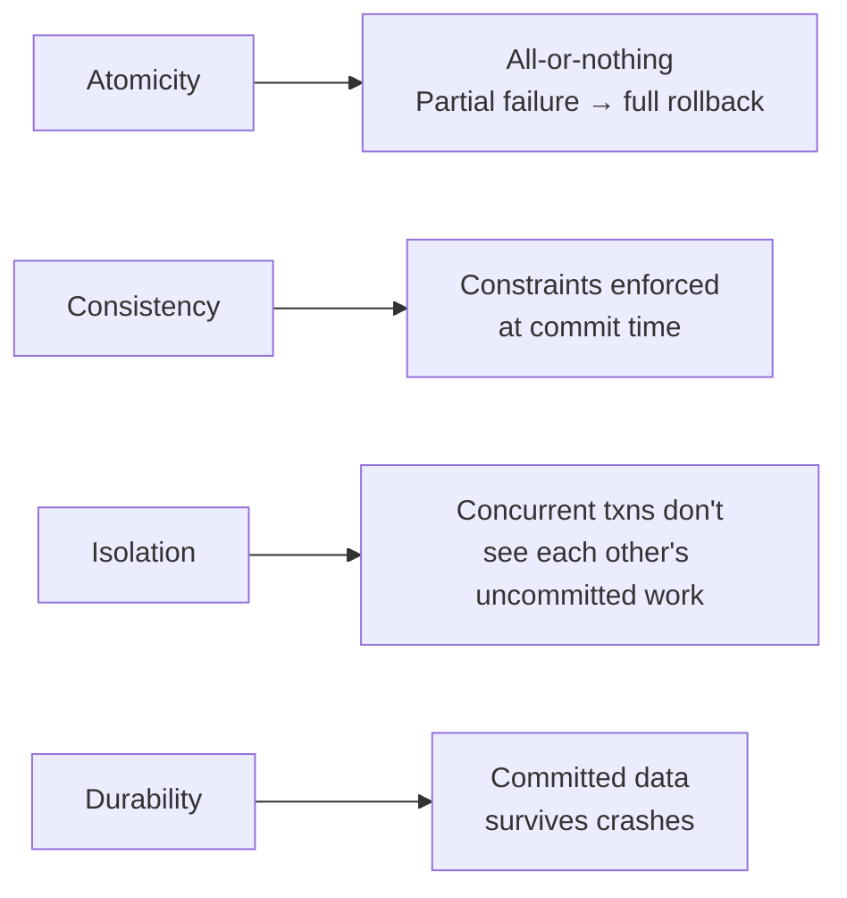
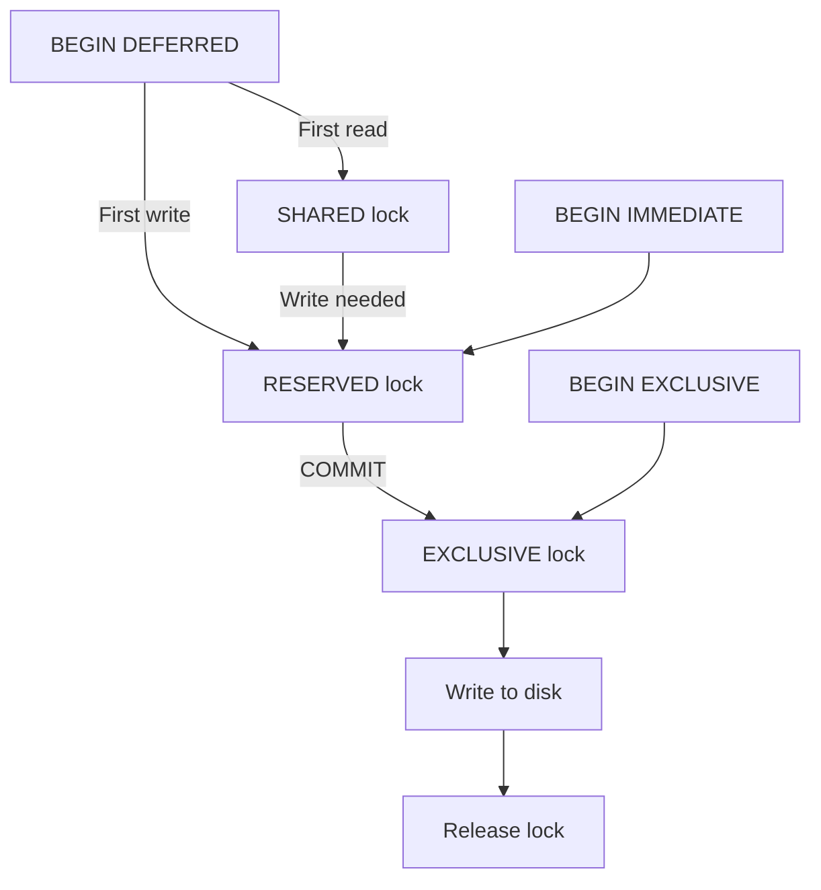

# Transactions and Isolation Levels 🟡

> **Learning objectives:** Understand ACID guarantees across Postgres, MySQL (InnoDB), and SQLite. Master `BEGIN`/`COMMIT`/`ROLLBACK` syntax differences, savepoints, isolation level trade-offs, and how each engine handles concurrency anomalies — from dirty reads to serialization failures.

Transactions are the contract that separates a database from a fancy CSV file. Every production system relies on them, yet the semantics vary enormously across engines. This chapter maps the full landscape.

## ACID at a Glance



| Property | PostgreSQL | MySQL (InnoDB) | SQLite |
|---|---|---|---|
| Atomicity | ✅ Full | ✅ Full | ✅ Full |
| Consistency | ✅ Immediate constraint checking | ✅ Immediate (most constraints) | ✅ Immediate |
| Isolation | MVCC (snapshot-based) | MVCC + gap locks | File-level locking / WAL |
| Durability | WAL + `fsync` | Doublewrite buffer + redo log | Journal or WAL mode |

## Transaction Syntax

### Basic Transaction

**PostgreSQL:**
```sql
BEGIN;  -- or START TRANSACTION
UPDATE accounts SET balance = balance - 100 WHERE id = 1;
UPDATE accounts SET balance = balance + 100 WHERE id = 2;
COMMIT;
```

**MySQL:**
```sql
START TRANSACTION;  -- or BEGIN
UPDATE accounts SET balance = balance - 100 WHERE id = 1;
UPDATE accounts SET balance = balance + 100 WHERE id = 2;
COMMIT;
```

**SQLite:**
```sql
BEGIN TRANSACTION;  -- TRANSACTION keyword is optional
UPDATE accounts SET balance = balance - 100 WHERE id = 1;
UPDATE accounts SET balance = balance + 100 WHERE id = 2;
COMMIT;
```

| Feature | PostgreSQL | MySQL | SQLite |
|---|---|---|---|
| `BEGIN` | ✅ | ✅ (alias for `START TRANSACTION`) | ✅ |
| `START TRANSACTION` | ✅ | ✅ | ❌ |
| `BEGIN TRANSACTION` | ✅ | ❌ | ✅ |
| Autocommit by default | ✅ | ✅ | ✅ |
| DDL in transactions | ✅ (transactional DDL) | ❌ (implicit commit) | ✅ (transactional DDL) |

### ⚠️ MySQL's DDL Auto-Commit Trap

```sql
-- 💥 DANGEROUS in MySQL:
START TRANSACTION;
INSERT INTO users (name) VALUES ('Alice');
CREATE INDEX idx_name ON users(name);  -- Implicitly COMMITs everything above!
INSERT INTO users (name) VALUES ('Bob');
ROLLBACK;  -- Only rolls back Bob, not Alice!
```

MySQL implicitly commits before and after DDL statements (`CREATE`, `ALTER`, `DROP`, `TRUNCATE`). Postgres and SQLite do **not** have this behavior — their DDL is fully transactional.

## Savepoints

Savepoints create named checkpoints within a transaction, allowing partial rollback.

**All three dialects:**
```sql
BEGIN;
INSERT INTO orders (id, total) VALUES (1, 100.00);
SAVEPOINT sp1;
INSERT INTO order_items (order_id, sku) VALUES (1, 'WIDGET-A');
-- Oops, wrong item — roll back just the item insert
ROLLBACK TO SAVEPOINT sp1;
INSERT INTO order_items (order_id, sku) VALUES (1, 'GADGET-B');
COMMIT;  -- order 1 with GADGET-B is committed
```

| Feature | PostgreSQL | MySQL | SQLite |
|---|---|---|---|
| `SAVEPOINT name` | ✅ | ✅ | ✅ |
| `ROLLBACK TO SAVEPOINT name` | ✅ | ✅ | ✅ |
| `RELEASE SAVEPOINT name` | ✅ | ✅ | ✅ |
| Nested savepoints | ✅ | ✅ | ✅ |
| Rolling back to a savepoint releases later savepoints | ✅ | ✅ | ✅ |

### Error Handling Difference

```sql
-- 💥 PostgreSQL: After an error, the entire transaction is "aborted"
BEGIN;
INSERT INTO users (id, name) VALUES (1, 'Alice');
INSERT INTO users (id, name) VALUES (1, 'Bob');  -- Duplicate key error
-- At this point, Postgres marks the txn as ABORTED
SELECT 1;  -- ERROR: current transaction is aborted

-- ✅ FIX: Use savepoints for error recovery in Postgres
BEGIN;
INSERT INTO users (id, name) VALUES (1, 'Alice');
SAVEPOINT sp1;
INSERT INTO users (id, name) VALUES (1, 'Bob');  -- Error
ROLLBACK TO sp1;  -- Recover
SELECT 1;  -- Works!
COMMIT;
```

MySQL and SQLite do **not** abort the entire transaction on a single statement error — subsequent statements continue to execute within the transaction.

| After a statement error | PostgreSQL | MySQL | SQLite |
|---|---|---|---|
| Transaction state | **Aborted** (must rollback/savepoint) | Continues | Continues |
| Subsequent statements | Fail | Succeed | Succeed |

## Isolation Levels

The SQL standard defines four isolation levels. Each database implements them differently.

### The Four Levels

| Level | Dirty Read | Non-Repeatable Read | Phantom Read | Serialization Anomaly |
|---|---|---|---|---|
| READ UNCOMMITTED | Possible | Possible | Possible | Possible |
| READ COMMITTED | ❌ Prevented | Possible | Possible | Possible |
| REPEATABLE READ | ❌ Prevented | ❌ Prevented | Possible | Possible |
| SERIALIZABLE | ❌ Prevented | ❌ Prevented | ❌ Prevented | ❌ Prevented |

### Default Isolation Level

| Database | Default Level | Notes |
|---|---|---|
| PostgreSQL | **READ COMMITTED** | Each statement sees the latest committed data |
| MySQL (InnoDB) | **REPEATABLE READ** | Snapshot taken at first read in transaction |
| SQLite | **SERIALIZABLE** | File-level locking enforces total ordering |

### Setting the Isolation Level

**PostgreSQL:**
```sql
-- Per-transaction
BEGIN ISOLATION LEVEL SERIALIZABLE;
-- or
BEGIN;
SET TRANSACTION ISOLATION LEVEL SERIALIZABLE;

-- Session-wide
SET SESSION CHARACTERISTICS AS TRANSACTION ISOLATION LEVEL SERIALIZABLE;
```

**MySQL:**
```sql
-- Per-transaction (must be set BEFORE START TRANSACTION)
SET TRANSACTION ISOLATION LEVEL SERIALIZABLE;
START TRANSACTION;

-- Session-wide
SET SESSION TRANSACTION ISOLATION LEVEL SERIALIZABLE;

-- Global default
SET GLOBAL TRANSACTION ISOLATION LEVEL SERIALIZABLE;
```

**SQLite:**
```sql
-- SQLite doesn't support isolation level settings
-- It always operates at SERIALIZABLE
-- Concurrency is controlled by transaction type:
BEGIN DEFERRED;    -- Acquires locks lazily (default)
BEGIN IMMEDIATE;   -- Acquires RESERVED lock immediately
BEGIN EXCLUSIVE;   -- Acquires EXCLUSIVE lock immediately
```

## Concurrency Anomalies Explained

### Dirty Read

Reading uncommitted data from another transaction. **None** of the three databases allow this in their default configuration.

```
Transaction A:              Transaction B:
BEGIN;
UPDATE acct SET bal = 0;
                            BEGIN;
                            SELECT bal FROM acct;
                            -- Dirty read: sees 0 (uncommitted!)
ROLLBACK;
                            -- Balance was never actually 0
```

- **Postgres:** Impossible even at READ UNCOMMITTED (Postgres treats it as READ COMMITTED)
- **MySQL:** Only possible if explicitly set to READ UNCOMMITTED
- **SQLite:** Impossible (always SERIALIZABLE)

### Non-Repeatable Read

Reading the same row twice within a transaction and getting different values because another transaction committed between the reads.

```
Transaction A:              Transaction B:
BEGIN;
SELECT bal FROM acct;
-- Returns 100
                            BEGIN;
                            UPDATE acct SET bal = 50;
                            COMMIT;
SELECT bal FROM acct;
-- Non-repeatable: now sees 50!
```

- **Postgres (READ COMMITTED):** ⚠️ Possible — each statement sees latest committed data
- **MySQL (REPEATABLE READ):** ❌ Prevented — snapshot taken at first read
- **SQLite:** ❌ Prevented — SERIALIZABLE isolation

### Phantom Read

A range query returns different rows because another transaction inserted/deleted rows that match the filter.

```
Transaction A:              Transaction B:
BEGIN;
SELECT COUNT(*) FROM orders
WHERE status = 'pending';
-- Returns 5
                            BEGIN;
                            INSERT INTO orders (status)
                            VALUES ('pending');
                            COMMIT;
SELECT COUNT(*) FROM orders
WHERE status = 'pending';
-- Phantom: now returns 6!
```

- **Postgres (READ COMMITTED):** ⚠️ Possible
- **MySQL (REPEATABLE READ):** ❌ Prevented by gap locks and next-key locks
- **SQLite:** ❌ Prevented

### Serialization Anomaly (Write Skew)

Two transactions both read a condition, make a decision, and write — but the combined result violates a constraint that neither transaction alone violated.

```sql
-- Classic example: on-call schedule
-- Rule: at least one doctor must be on call
-- Both doctors try to remove themselves concurrently

-- Transaction A:                    Transaction B:
-- Sees 2 doctors on call            Sees 2 doctors on call
-- "Safe to remove myself"           "Safe to remove myself"
-- UPDATE SET on_call=false           UPDATE SET on_call=false
--   WHERE name='Alice'                WHERE name='Bob'
-- COMMIT                            COMMIT
-- Result: 0 doctors on call! 💥
```

Only `SERIALIZABLE` isolation prevents this:

**PostgreSQL (SERIALIZABLE):**
```sql
-- Postgres uses Serializable Snapshot Isolation (SSI)
-- It detects the conflict and aborts one transaction
BEGIN ISOLATION LEVEL SERIALIZABLE;
SELECT COUNT(*) FROM doctors WHERE on_call = true;
-- Sees 2
UPDATE doctors SET on_call = false WHERE name = 'Alice';
COMMIT;
-- One transaction succeeds; the other gets:
-- ERROR: could not serialize access due to read/write dependencies
```

**MySQL (SERIALIZABLE):**
```sql
-- MySQL uses shared locks on reads at SERIALIZABLE
-- This causes one transaction to block (and possibly deadlock)
SET TRANSACTION ISOLATION LEVEL SERIALIZABLE;
START TRANSACTION;
SELECT COUNT(*) FROM doctors WHERE on_call = true;
-- Takes a shared lock on the range
UPDATE doctors SET on_call = false WHERE name = 'Alice';
-- Blocks if Txn B already has a shared lock
COMMIT;
```

## SQLite Transaction Types

SQLite's concurrency model is fundamentally different from Postgres/MySQL. It uses file-level locks rather than row-level locks.



| Transaction Type | Lock Acquired | Use Case |
|---|---|---|
| `DEFERRED` (default) | None until first statement | Read-mostly workloads |
| `IMMEDIATE` | RESERVED on `BEGIN` | Write transactions (avoids deadlocks) |
| `EXCLUSIVE` | EXCLUSIVE on `BEGIN` | Batch writes with no concurrent readers |

### The SQLite BUSY Timeout

```sql
-- Set a timeout to wait for locks instead of immediately returning SQLITE_BUSY
PRAGMA busy_timeout = 5000;  -- Wait up to 5 seconds
```

⚠️ In WAL mode, readers never block writers and writers never block readers. But only **one writer** can proceed at a time. Use `BEGIN IMMEDIATE` for write transactions to fail fast rather than deadlocking mid-transaction.

## Deadlock Detection

| Mechanism | PostgreSQL | MySQL (InnoDB) | SQLite |
|---|---|---|---|
| Detection method | Wait-for graph | Wait-for graph | Timeout-based |
| Automatic detection | ✅ (immediate) | ✅ (immediate) | Via `busy_timeout` |
| Which txn is rolled back | The last one detected | The one with fewest locks | The one that got `BUSY` |
| Prevention strategy | Lock ordering | Lock ordering, `NOWAIT` | `BEGIN IMMEDIATE` |

### PostgreSQL Lock Timeout

```sql
-- Don't wait forever for a lock
SET lock_timeout = '5s';

-- Or per-statement with NOWAIT
SELECT * FROM accounts WHERE id = 1 FOR UPDATE NOWAIT;
-- Raises error immediately if row is locked
```

### MySQL Lock Wait Timeout

```sql
-- InnoDB lock wait timeout (default: 50 seconds)
SET innodb_lock_wait_timeout = 10;

-- Or use NOWAIT / SKIP LOCKED (MySQL 8.0+)
SELECT * FROM accounts WHERE id = 1 FOR UPDATE NOWAIT;
SELECT * FROM accounts WHERE status = 'pending' FOR UPDATE SKIP LOCKED;
```

### Advisory Locks (Postgres Only)

```sql
-- Application-level locks not tied to any table
SELECT pg_advisory_lock(12345);    -- Blocks until acquired
-- ... do exclusive work ...
SELECT pg_advisory_unlock(12345);

-- Non-blocking try
SELECT pg_try_advisory_lock(12345);  -- Returns true/false

-- Session-level vs transaction-level
SELECT pg_advisory_xact_lock(12345); -- Released at COMMIT/ROLLBACK
```

Advisory locks are unique to Postgres. MySQL has `GET_LOCK()` / `RELEASE_LOCK()` which is similar but limited to one lock per session (until MySQL 5.7; multiple locks supported since 5.7).

**MySQL advisory locks:**
```sql
SELECT GET_LOCK('my_lock', 10);    -- Wait up to 10 seconds
-- ... do exclusive work ...
SELECT RELEASE_LOCK('my_lock');
```

## SELECT ... FOR UPDATE

Explicit row-level locking for read-then-write patterns.

```sql
-- All three dialects support basic FOR UPDATE
BEGIN;
SELECT balance FROM accounts WHERE id = 1 FOR UPDATE;
-- Row is now locked; other transactions block on this row
UPDATE accounts SET balance = balance - 100 WHERE id = 1;
COMMIT;
```

| Feature | PostgreSQL | MySQL | SQLite |
|---|---|---|---|
| `FOR UPDATE` | ✅ | ✅ | ❌ (no row-level locks) |
| `FOR SHARE` / `FOR KEY SHARE` | ✅ | ✅ (`LOCK IN SHARE MODE`) | ❌ |
| `NOWAIT` | ✅ | ✅ (8.0+) | ❌ |
| `SKIP LOCKED` | ✅ | ✅ (8.0+) | ❌ |

### Queue Processing with SKIP LOCKED

```sql
-- Process the next pending job without blocking other workers
-- PostgreSQL / MySQL 8.0+:
BEGIN;
SELECT id, payload
FROM job_queue
WHERE status = 'pending'
ORDER BY created_at
LIMIT 1
FOR UPDATE SKIP LOCKED;

UPDATE job_queue SET status = 'processing' WHERE id = ?;
COMMIT;
```

`SKIP LOCKED` is a game-changer for queue-like access patterns — it lets multiple workers dequeue concurrently without contention.

## Exercises

### The Transfer Audit

Design a money transfer between two accounts that:
1. Verifies sufficient funds before debiting
2. Handles concurrent transfers safely (no overdrafts)
3. Logs the transfer in an `audit_log` table within the same transaction
4. Works across all three dialects (adapt as needed for SQLite's limitations)

<details>
<summary>Solution</summary>

**PostgreSQL:**
```sql
BEGIN;
-- Lock the source account to prevent concurrent debit
SELECT balance FROM accounts WHERE id = 1 FOR UPDATE;
-- Application checks: if balance >= 100, proceed

UPDATE accounts SET balance = balance - 100 WHERE id = 1 AND balance >= 100;
-- Check affected rows; if 0, insufficient funds → ROLLBACK

UPDATE accounts SET balance = balance + 100 WHERE id = 2;
INSERT INTO audit_log (from_acct, to_acct, amount, ts)
VALUES (1, 2, 100, NOW());
COMMIT;
```

**MySQL:**
```sql
START TRANSACTION;
SELECT balance FROM accounts WHERE id = 1 FOR UPDATE;
-- Application logic: check balance >= 100

UPDATE accounts SET balance = balance - 100 WHERE id = 1 AND balance >= 100;
UPDATE accounts SET balance = balance + 100 WHERE id = 2;
INSERT INTO audit_log (from_acct, to_acct, amount, ts)
VALUES (1, 2, 100, NOW());
COMMIT;
```

**SQLite:**
```sql
-- Use IMMEDIATE to acquire the write lock up front
BEGIN IMMEDIATE;
-- No FOR UPDATE in SQLite, but IMMEDIATE ensures exclusive write access
SELECT balance FROM accounts WHERE id = 1;
-- Application checks balance >= 100

UPDATE accounts SET balance = balance - 100 WHERE id = 1;
UPDATE accounts SET balance = balance + 100 WHERE id = 2;
INSERT INTO audit_log (from_acct, to_acct, amount, ts)
VALUES (1, 2, 100, datetime('now'));
COMMIT;
```

Key differences:
- **Postgres/MySQL:** Use `FOR UPDATE` to lock the specific row, allowing concurrent reads of other rows
- **SQLite:** No row-level locks; `BEGIN IMMEDIATE` locks the entire database for writes, but readers in WAL mode can still proceed
- The `AND balance >= 100` guard in the `UPDATE` prevents overdrafts even if the application check races

</details>

## Key Takeaways

- **MySQL implicitly commits on DDL** — never mix DDL and DML in the same transaction in MySQL
- **Default isolation levels differ**: Postgres = READ COMMITTED, MySQL = REPEATABLE READ, SQLite = SERIALIZABLE
- **Postgres aborts the entire transaction on any error** — use savepoints for error recovery
- **SQLite has no row-level locking** — use `BEGIN IMMEDIATE` for write transactions to avoid deadlocks
- **`SKIP LOCKED`** (Postgres, MySQL 8.0+) enables efficient concurrent queue processing
- **Write skew** is only prevented at `SERIALIZABLE` — Postgres uses SSI detection, MySQL uses shared locks
- **Advisory locks** (Postgres `pg_advisory_lock`, MySQL `GET_LOCK`) provide application-level coordination outside the normal row-locking model
- **Always set timeouts**: `lock_timeout` in Postgres, `innodb_lock_wait_timeout` in MySQL, `busy_timeout` in SQLite
