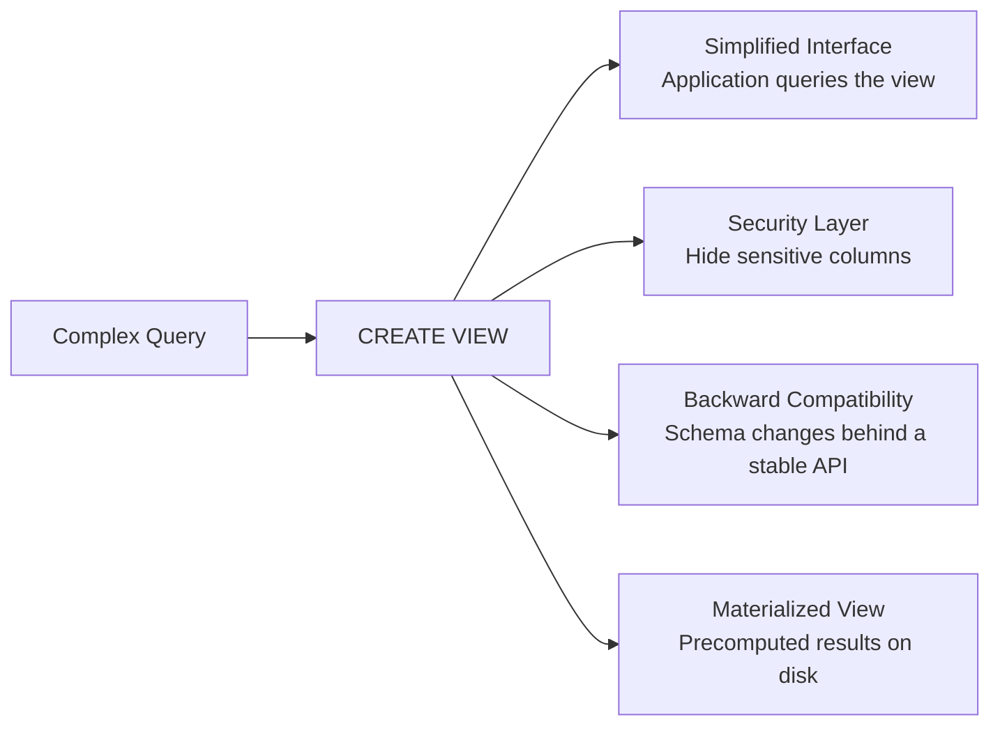

# Views and Materialized Views 🟡

> **Learning objectives:** Create and manage views across all three dialects. Understand updatable views, `WITH CHECK OPTION`, and the security implications of view-based access. Master Postgres materialized views and MySQL view algorithms. Know SQLite's view limitations.

Views are named queries stored in the catalog — "virtual tables" that abstract complexity, enforce security boundaries, and simplify application code. But the implementation details vary more than most developers expect.

## Why Views?



| Use Case | Mechanism |
|---|---|
| Simplify complex joins | View wraps the join; apps query a "flat" table |
| Column-level security | View exposes only non-sensitive columns |
| Schema migration shim | Old application queries the view while the real table changes underneath |
| Precomputed aggregates | Materialized view stores results; refreshed periodically |

## Creating Views

### Basic Syntax

**PostgreSQL / MySQL / SQLite:**
```sql
CREATE VIEW active_customers AS
SELECT id, name, email, created_at
FROM customers
WHERE status = 'active';

-- Query it like a table
SELECT * FROM active_customers WHERE created_at > '2025-01-01';
```

### CREATE OR REPLACE

| Feature | PostgreSQL | MySQL | SQLite |
|---|---|---|---|
| `CREATE OR REPLACE VIEW` | ✅ | ✅ | ❌ |
| Drop + Create required | No | No | ✅ |
| Adding columns to existing view | ✅ (columns can be added at the end) | ✅ | N/A (must drop/create) |
| Removing columns from existing view | ❌ (must drop and recreate) | ✅ | N/A |

**SQLite workaround:**
```sql
-- SQLite doesn't support CREATE OR REPLACE VIEW
DROP VIEW IF EXISTS active_customers;
CREATE VIEW active_customers AS
SELECT id, name, email, created_at
FROM customers
WHERE status = 'active';
```

### Column Aliases

```sql
-- All dialects — column aliases in view definition
CREATE VIEW order_summary (order_id, customer_name, total_amount) AS
SELECT o.id, c.name, SUM(oi.price * oi.quantity)
FROM orders o
JOIN customers c ON c.id = o.customer_id
JOIN order_items oi ON oi.order_id = o.id
GROUP BY o.id, c.name;
```

## Updatable Views

An updatable view allows `INSERT`, `UPDATE`, and `DELETE` through the view — the database maps the DML back to the underlying table.

### Rules for Updatability

| Requirement | PostgreSQL | MySQL | SQLite |
|---|---|---|---|
| Single underlying table | ✅ Required | ✅ Required | ✅ Required |
| No `DISTINCT` | ✅ Required | ✅ Required | ✅ Required |
| No `GROUP BY` / aggregates | ✅ Required | ✅ Required | ✅ Required |
| No `UNION` / set operations | ✅ Required | ✅ Required | ✅ Required |
| No subquery in `FROM` | ✅ Required | ✅ Required | ✅ Required |
| No window functions | ✅ Required | ✅ Required | ✅ Required |

**Updatable view example (all dialects):**
```sql
CREATE VIEW us_customers AS
SELECT id, name, email, country
FROM customers
WHERE country = 'US';

-- These work because the view maps to a single table with no aggregation
INSERT INTO us_customers (name, email, country) VALUES ('Dave', 'dave@ex.com', 'US');
UPDATE us_customers SET email = 'dave@new.com' WHERE name = 'Dave';
DELETE FROM us_customers WHERE name = 'Dave';
```

### WITH CHECK OPTION

Without `CHECK OPTION`, you can insert rows through a view that don't satisfy the view's `WHERE` clause — they become "invisible" through the view.

```sql
-- 💥 Without CHECK OPTION:
CREATE VIEW us_customers AS
SELECT id, name, email, country FROM customers WHERE country = 'US';

INSERT INTO us_customers (name, email, country) VALUES ('Hans', 'hans@de.com', 'DE');
-- Succeeds! But SELECT * FROM us_customers won't show Hans (country != 'US')
```

```sql
-- ✅ FIX: WITH CHECK OPTION prevents inserting/updating rows that violate the WHERE clause
CREATE VIEW us_customers AS
SELECT id, name, email, country FROM customers WHERE country = 'US'
WITH CHECK OPTION;

INSERT INTO us_customers (name, email, country) VALUES ('Hans', 'hans@de.com', 'DE');
-- ERROR: violates check option
```

| Feature | PostgreSQL | MySQL | SQLite |
|---|---|---|---|
| `WITH CHECK OPTION` | ✅ | ✅ | ❌ |
| `WITH LOCAL CHECK OPTION` | ✅ | ✅ | ❌ |
| `WITH CASCADED CHECK OPTION` | ✅ | ✅ (default) | ❌ |

**LOCAL vs CASCADED:** If view B is built on view A, `CASCADED` checks both A's and B's conditions. `LOCAL` only checks B's conditions. MySQL defaults to `CASCADED`; Postgres requires you to specify.

## MySQL View Algorithms

MySQL has a unique `ALGORITHM` hint that controls how views are processed:

```sql
-- Merge: the view definition is merged into the outer query
CREATE ALGORITHM = MERGE VIEW active_customers AS
SELECT * FROM customers WHERE status = 'active';

-- Temptable: the view is materialized into a temporary table first
CREATE ALGORITHM = TEMPTABLE VIEW order_totals AS
SELECT customer_id, SUM(total) AS lifetime_total
FROM orders
GROUP BY customer_id;

-- Undefined: let MySQL choose (default)
CREATE ALGORITHM = UNDEFINED VIEW my_view AS ...;
```

| Algorithm | Updatable? | Performance | Use When |
|---|---|---|---|
| `MERGE` | ✅ Yes | Best — predicates pushed down to base table | Simple views, no aggregation |
| `TEMPTABLE` | ❌ No | Materializes first | Aggregating views, `DISTINCT`, `GROUP BY` |
| `UNDEFINED` | Depends | MySQL chooses optimal | Default; let the optimizer decide |

⚠️ `TEMPTABLE` views are never updatable. If you need an updatable view in MySQL, ensure the optimizer can use `MERGE`.

**Check the algorithm being used:**
```sql
EXPLAIN SELECT * FROM active_customers WHERE name = 'Alice';
-- Look for "derived" in the select_type — that means TEMPTABLE
-- "SIMPLE" means MERGE was used
```

## Materialized Views (PostgreSQL)

A materialized view stores query results on disk, like a cached table. Only **PostgreSQL** has native materialized views.

```sql
-- Create a materialized view
CREATE MATERIALIZED VIEW monthly_revenue AS
SELECT
    date_trunc('month', created_at) AS month,
    SUM(total) AS revenue,
    COUNT(*) AS order_count
FROM orders
GROUP BY date_trunc('month', created_at);

-- Query it like a table (reads from disk, not re-executing the query)
SELECT * FROM monthly_revenue WHERE month >= '2025-01-01';
```

### Refreshing Materialized Views

```sql
-- Full refresh: drops all data and re-runs the query
REFRESH MATERIALIZED VIEW monthly_revenue;

-- Concurrent refresh: allows reads during refresh (requires unique index)
CREATE UNIQUE INDEX ON monthly_revenue (month);
REFRESH MATERIALIZED VIEW CONCURRENTLY monthly_revenue;
```

| Refresh Type | Blocks Reads? | Requires Unique Index? | Use Case |
|---|---|---|---|
| `REFRESH MATERIALIZED VIEW` | ✅ Yes (briefly) | No | Off-peak batch refresh |
| `REFRESH ... CONCURRENTLY` | ❌ No | ✅ Yes | Production; continuous availability |

### Automating Refresh

PostgreSQL does not have built-in scheduled refresh. Common approaches:

```sql
-- Option 1: pg_cron extension
SELECT cron.schedule('refresh_revenue', '0 * * * *',
    'REFRESH MATERIALIZED VIEW CONCURRENTLY monthly_revenue');

-- Option 2: Application-triggered (after bulk inserts)
-- Option 3: OS cron job calling psql
```

### Materialized Views on MySQL and SQLite

Neither MySQL nor SQLite have native materialized views. Common workarounds:

**MySQL — table + scheduled event:**
```sql
-- Create a summary table
CREATE TABLE monthly_revenue (
    month DATE PRIMARY KEY,
    revenue DECIMAL(15,2),
    order_count INT
);

-- Refresh via scheduled event
CREATE EVENT refresh_monthly_revenue
ON SCHEDULE EVERY 1 HOUR
DO
BEGIN
    TRUNCATE TABLE monthly_revenue;
    INSERT INTO monthly_revenue
    SELECT DATE_FORMAT(created_at, '%Y-%m-01'), SUM(total), COUNT(*)
    FROM orders
    GROUP BY DATE_FORMAT(created_at, '%Y-%m-01');
END;
```

**SQLite — trigger-based or application-managed:**
```sql
-- Create a summary table
CREATE TABLE monthly_revenue (
    month TEXT PRIMARY KEY,
    revenue REAL,
    order_count INTEGER
);

-- Refresh from application code
DELETE FROM monthly_revenue;
INSERT INTO monthly_revenue
SELECT strftime('%Y-%m-01', created_at), SUM(total), COUNT(*)
FROM orders
GROUP BY strftime('%Y-%m-01', created_at);
```

## Indexed Views / Covering Indexes on Views

**PostgreSQL:**
```sql
-- Index the materialized view for fast lookups
CREATE INDEX ON monthly_revenue (month);
CREATE INDEX ON monthly_revenue (revenue DESC);
```

**MySQL:**
```sql
-- Cannot index a VIEW directly, but MERGE views use underlying table indexes
-- For TEMPTABLE views, consider indexing the materialized summary table
```

**SQLite:**
```sql
-- Cannot index views; queries through views use underlying table indexes
```

## Views for Schema Migration

Views provide a stable API while the underlying schema changes:

```sql
-- Phase 1: Original table
CREATE TABLE users (
    id SERIAL PRIMARY KEY,
    name TEXT NOT NULL,
    email TEXT NOT NULL
);

-- Phase 2: Split name into first_name + last_name
ALTER TABLE users ADD COLUMN first_name TEXT;
ALTER TABLE users ADD COLUMN last_name TEXT;
-- Backfill first_name, last_name from name...

-- Phase 3: Create a compatibility view for old application code
CREATE VIEW users_v1 AS
SELECT id, first_name || ' ' || last_name AS name, email
FROM users;

-- Old code queries users_v1 and sees the same schema
-- New code queries users directly with first_name, last_name
```

## Dropping Views

```sql
-- All dialects
DROP VIEW IF EXISTS active_customers;

-- PostgreSQL: cascade drops dependent views
DROP VIEW IF EXISTS active_customers CASCADE;

-- MySQL: drop multiple views at once
DROP VIEW IF EXISTS view1, view2, view3;
```

| Feature | PostgreSQL | MySQL | SQLite |
|---|---|---|---|
| `DROP VIEW IF EXISTS` | ✅ | ✅ | ✅ |
| `CASCADE` (drop dependents) | ✅ | ❌ | ❌ |
| Drop multiple in one statement | ✅ | ✅ | ❌ |

## System Catalog: Listing Views

**PostgreSQL:**
```sql
-- List all views in the current schema
SELECT table_name FROM information_schema.views
WHERE table_schema = 'public';

-- View the definition of a view
SELECT pg_get_viewdef('active_customers', true);
-- Or use \dv in psql
```

**MySQL:**
```sql
-- List all views
SELECT table_name FROM information_schema.views
WHERE table_schema = DATABASE();

-- View the definition
SHOW CREATE VIEW active_customers;
```

**SQLite:**
```sql
-- List all views
SELECT name FROM sqlite_master WHERE type = 'view';

-- View the definition
SELECT sql FROM sqlite_master WHERE type = 'view' AND name = 'active_customers';
```

## Exercises

### The Reporting Layer

Design a reporting layer using views for an e-commerce system with tables `orders`, `order_items`, `products`, and `customers`:

1. Create a view `order_details_v` that joins all four tables into a flat reporting view
2. Create a Postgres materialized view `daily_revenue_mv` that aggregates daily revenue with a unique index for concurrent refresh
3. Create a MySQL equivalent using a summary table and scheduled event
4. Add `WITH CHECK OPTION` to a view that filters orders by region

<details>
<summary>Solution</summary>

**1. Reporting view (all dialects):**
```sql
CREATE VIEW order_details_v AS
SELECT
    o.id AS order_id,
    o.created_at AS order_date,
    c.name AS customer_name,
    c.email AS customer_email,
    p.name AS product_name,
    oi.quantity,
    oi.unit_price,
    oi.quantity * oi.unit_price AS line_total
FROM orders o
JOIN customers c ON c.id = o.customer_id
JOIN order_items oi ON oi.order_id = o.id
JOIN products p ON p.id = oi.product_id;
```

**2. Postgres materialized view:**
```sql
CREATE MATERIALIZED VIEW daily_revenue_mv AS
SELECT
    date_trunc('day', created_at)::date AS day,
    SUM(total) AS revenue,
    COUNT(DISTINCT customer_id) AS unique_customers,
    COUNT(*) AS order_count
FROM orders
GROUP BY date_trunc('day', created_at)::date;

CREATE UNIQUE INDEX ON daily_revenue_mv (day);

-- Refresh concurrently
REFRESH MATERIALIZED VIEW CONCURRENTLY daily_revenue_mv;
```

**3. MySQL scheduled refresh:**
```sql
CREATE TABLE daily_revenue (
    day DATE PRIMARY KEY,
    revenue DECIMAL(15,2),
    unique_customers INT,
    order_count INT
);

DELIMITER //
CREATE EVENT refresh_daily_revenue
ON SCHEDULE EVERY 1 HOUR
DO
BEGIN
    TRUNCATE TABLE daily_revenue;
    INSERT INTO daily_revenue
    SELECT DATE(created_at), SUM(total), COUNT(DISTINCT customer_id), COUNT(*)
    FROM orders
    GROUP BY DATE(created_at);
END //
DELIMITER ;
```

**4. Region-filtered view with CHECK OPTION:**
```sql
-- PostgreSQL / MySQL:
CREATE VIEW us_orders AS
SELECT id, customer_id, total, region, created_at
FROM orders
WHERE region = 'US'
WITH CASCADED CHECK OPTION;

-- Attempting to insert an order with region != 'US' will fail
INSERT INTO us_orders (customer_id, total, region)
VALUES (1, 99.99, 'EU');
-- ERROR: new row violates check option for view "us_orders"
```

</details>

## Key Takeaways

- **All three databases support views** — but `CREATE OR REPLACE VIEW` is absent in SQLite (use `DROP` + `CREATE`)
- **Updatable views** require a single underlying table with no aggregation, `DISTINCT`, or set operations
- **`WITH CHECK OPTION`** prevents inserting/updating rows that violate the view's `WHERE` clause (Postgres, MySQL only)
- **MySQL's `ALGORITHM` hint** controls merge vs temptable execution — `TEMPTABLE` views are never updatable
- **Only PostgreSQL has native materialized views** — MySQL and SQLite must emulate them with summary tables
- **`REFRESH MATERIALIZED VIEW CONCURRENTLY`** avoids blocking readers but requires a unique index
- **Views are excellent migration shims** — expose a stable API while the underlying schema evolves
- **Indexing:** Postgres can index materialized views; regular views in all databases use underlying table indexes
