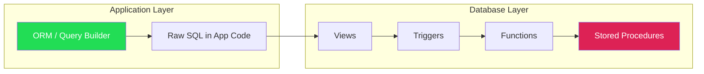

# Stored Procedures, Functions, and Triggers 🔴

> **Learning objectives:** Write server-side logic with PL/pgSQL functions (Postgres), stored routines (MySQL), and understand why SQLite deliberately omits them. Master triggers — `BEFORE`, `AFTER`, `INSTEAD OF` — across all three dialects. Know when server-side logic is the right choice vs application code.

Moving logic into the database is one of the most polarizing decisions in software engineering. This chapter gives you the tools to make that decision with clarity — and the syntax to implement it in each dialect.

## The Server-Side Logic Spectrum



| Database | Functions | Stored Procedures | Triggers | User-Defined Aggregates |
|---|---|---|---|---|
| PostgreSQL | ✅ PL/pgSQL, SQL, PL/Python, PL/Perl, ... | ✅ (`CREATE PROCEDURE`, Pg 11+) | ✅ Full | ✅ |
| MySQL | ✅ SQL-only | ✅ SQL-only | ✅ (with limitations) | ❌ |
| SQLite | ❌ (app-registered only) | ❌ | ✅ (limited) | ❌ (app-registered only) |

## Functions

### PostgreSQL: PL/pgSQL Functions

```sql
-- A function that calculates compound interest
CREATE OR REPLACE FUNCTION compound_interest(
    principal NUMERIC,
    rate NUMERIC,
    years INT
) RETURNS NUMERIC
LANGUAGE plpgsql
IMMUTABLE  -- Pure function; same inputs → same output
AS $$
BEGIN
    RETURN principal * POWER(1 + rate, years);
END;
$$;

-- Usage
SELECT compound_interest(1000, 0.05, 10);  -- 1628.89...
```

### Function Volatility (PostgreSQL)

| Category | Meaning | Optimizer Effect |
|---|---|---|
| `IMMUTABLE` | Same inputs always produce same output | Can be pre-evaluated at plan time |
| `STABLE` | Same inputs produce same output within a single statement | Can be evaluated once per scan |
| `VOLATILE` (default) | Output can change at any time | Re-evaluated for every row |

```sql
-- 💥 PERFORMANCE HAZARD: Default VOLATILE prevents optimization
CREATE FUNCTION get_tax_rate(state TEXT) RETURNS NUMERIC
LANGUAGE sql AS $$
    SELECT rate FROM tax_rates WHERE state_code = state;
$$;
-- Called once per row because Postgres assumes it might have side effects

-- ✅ FIX: Mark as STABLE since tax_rates doesn't change mid-query
CREATE OR REPLACE FUNCTION get_tax_rate(state TEXT) RETURNS NUMERIC
LANGUAGE sql
STABLE
AS $$
    SELECT rate FROM tax_rates WHERE state_code = state;
$$;
```

### SQL Functions (All Dialects That Support Functions)

**PostgreSQL — pure SQL function:**
```sql
CREATE OR REPLACE FUNCTION full_name(first TEXT, last TEXT)
RETURNS TEXT
LANGUAGE sql
IMMUTABLE
AS $$
    SELECT first || ' ' || last;
$$;
```

**MySQL — stored function:**
```sql
DELIMITER //
CREATE FUNCTION full_name(first VARCHAR(100), last VARCHAR(100))
RETURNS VARCHAR(201)
DETERMINISTIC
NO SQL
BEGIN
    RETURN CONCAT(first, ' ', last);
END //
DELIMITER ;
```

**SQLite — no SQL-level functions:**
```sql
-- SQLite cannot define functions in SQL
-- Functions must be registered from the host application:
-- C: sqlite3_create_function()
-- Python: connection.create_function("full_name", 2, lambda f, l: f"{f} {l}")
-- Rust (rusqlite): db.create_scalar_function(...)
```

### Returning Tables (Set-Returning Functions)

**PostgreSQL:**
```sql
CREATE OR REPLACE FUNCTION get_top_customers(min_orders INT)
RETURNS TABLE(customer_id INT, name TEXT, order_count BIGINT)
LANGUAGE sql
STABLE
AS $$
    SELECT c.id, c.name, COUNT(o.id)
    FROM customers c
    JOIN orders o ON o.customer_id = c.id
    GROUP BY c.id, c.name
    HAVING COUNT(o.id) >= min_orders
    ORDER BY COUNT(o.id) DESC;
$$;

-- Use like a table in FROM
SELECT * FROM get_top_customers(10);
```

**MySQL:**
```sql
-- MySQL functions cannot return result sets
-- Use stored procedures with OUT parameters or result sets instead
```

### Functions in Indexes (PostgreSQL)

```sql
-- Functional index using a custom function
CREATE FUNCTION normalize_email(email TEXT) RETURNS TEXT
LANGUAGE sql IMMUTABLE AS $$
    SELECT LOWER(TRIM(email));
$$;

CREATE INDEX idx_normalized_email ON users (normalize_email(email));

-- This query now uses the index
SELECT * FROM users WHERE normalize_email(email) = 'alice@example.com';
```

MySQL supports generated columns (which can then be indexed) but not direct functional indexes until 8.0.13.

## Stored Procedures

Stored procedures differ from functions: they don't return a value in the SQL sense, can have `OUT` parameters, and can contain transaction control statements.

### PostgreSQL (11+)

```sql
CREATE OR REPLACE PROCEDURE transfer_funds(
    from_acct INT,
    to_acct INT,
    amount NUMERIC
)
LANGUAGE plpgsql
AS $$
BEGIN
    UPDATE accounts SET balance = balance - amount WHERE id = from_acct;
    UPDATE accounts SET balance = balance + amount WHERE id = to_acct;

    -- Procedures can control transactions
    COMMIT;
END;
$$;

-- Call with CALL
CALL transfer_funds(1, 2, 100.00);
```

### MySQL

```sql
DELIMITER //
CREATE PROCEDURE transfer_funds(
    IN from_acct INT,
    IN to_acct INT,
    IN amount DECIMAL(15,2)
)
BEGIN
    DECLARE EXIT HANDLER FOR SQLEXCEPTION
    BEGIN
        ROLLBACK;
        RESIGNAL;
    END;

    START TRANSACTION;
    UPDATE accounts SET balance = balance - amount WHERE id = from_acct;
    UPDATE accounts SET balance = balance + amount WHERE id = to_acct;
    COMMIT;
END //
DELIMITER ;

-- Call
CALL transfer_funds(1, 2, 100.00);
```

### Functions vs Procedures

| Feature | Function | Procedure |
|---|---|---|
| Returns a value | ✅ (used in `SELECT`, `WHERE`) | ❌ (uses `OUT` parameters or result sets) |
| Callable in SQL expressions | ✅ | ❌ |
| Transaction control (`COMMIT`/`ROLLBACK`) | ❌ (Postgres) / Limited (MySQL) | ✅ |
| Called with | `SELECT func()` | `CALL proc()` |
| Can return a table | ✅ (Postgres) | ✅ (MySQL result sets) |

## Triggers

Triggers are functions that fire automatically on table events (`INSERT`, `UPDATE`, `DELETE`).

### Trigger Timing

| Timing | Meaning | Use Case |
|---|---|---|
| `BEFORE` | Runs before the row change | Validation, default values, transformation |
| `AFTER` | Runs after the row change | Audit logging, cascade updates |
| `INSTEAD OF` | Replaces the operation (views only) | Updatable views with complex logic |

### PostgreSQL Triggers

PostgreSQL triggers call a separate trigger function:

```sql
-- Step 1: Create the trigger function
CREATE OR REPLACE FUNCTION audit_update()
RETURNS TRIGGER
LANGUAGE plpgsql
AS $$
BEGIN
    INSERT INTO audit_log (table_name, record_id, old_data, new_data, changed_at)
    VALUES (
        TG_TABLE_NAME,
        NEW.id,
        row_to_json(OLD),
        row_to_json(NEW),
        NOW()
    );
    RETURN NEW;  -- Must return NEW for BEFORE triggers, or NULL to cancel
END;
$$;

-- Step 2: Attach it to a table
CREATE TRIGGER trg_users_audit
AFTER UPDATE ON users
FOR EACH ROW
EXECUTE FUNCTION audit_update();
```

### MySQL Triggers

MySQL triggers embed the logic inline:

```sql
DELIMITER //
CREATE TRIGGER trg_users_audit
AFTER UPDATE ON users
FOR EACH ROW
BEGIN
    INSERT INTO audit_log (table_name, record_id, old_name, new_name, changed_at)
    VALUES ('users', NEW.id, OLD.name, NEW.name, NOW());
END //
DELIMITER ;
```

### SQLite Triggers

```sql
CREATE TRIGGER trg_users_audit
AFTER UPDATE ON users
FOR EACH ROW
BEGIN
    INSERT INTO audit_log (table_name, record_id, old_name, new_name, changed_at)
    VALUES ('users', NEW.id, OLD.name, NEW.name, datetime('now'));
END;
```

### Trigger Feature Comparison

| Feature | PostgreSQL | MySQL | SQLite |
|---|---|---|---|
| `BEFORE INSERT/UPDATE/DELETE` | ✅ | ✅ | ✅ |
| `AFTER INSERT/UPDATE/DELETE` | ✅ | ✅ | ✅ |
| `INSTEAD OF` (on views) | ✅ | ❌ | ✅ |
| Statement-level triggers | ✅ (`FOR EACH STATEMENT`) | ❌ | ❌ |
| Row-level triggers | ✅ (`FOR EACH ROW`) | ✅ (only option) | ✅ (only option) |
| `WHEN` clause (conditional) | ✅ | ❌ | ✅ |
| `OLD` / `NEW` references | ✅ | ✅ | ✅ |
| Multiple triggers per event | ✅ (ordered by name) | ❌ (one per event per timing) | ✅ |
| Recursive triggers | ✅ | ❌ | ✅ (`PRAGMA recursive_triggers`) |
| Call stored procedure from trigger | ✅ | ✅ | ❌ |
| Transaction control in trigger | ❌ | ❌ | ❌ |

### INSTEAD OF Triggers (Updatable Views)

When a view is too complex for automatic updatability, use `INSTEAD OF` triggers:

**PostgreSQL:**
```sql
CREATE VIEW customer_orders_v AS
SELECT c.id, c.name, c.email, COUNT(o.id) AS order_count
FROM customers c
LEFT JOIN orders o ON o.customer_id = c.id
GROUP BY c.id, c.name, c.email;

-- This view is not auto-updatable (has GROUP BY)
-- Add INSTEAD OF trigger to handle inserts:
CREATE OR REPLACE FUNCTION insert_customer_order_v()
RETURNS TRIGGER
LANGUAGE plpgsql AS $$
BEGIN
    INSERT INTO customers (id, name, email)
    VALUES (NEW.id, NEW.name, NEW.email);
    RETURN NEW;
END;
$$;

CREATE TRIGGER trg_customer_orders_insert
INSTEAD OF INSERT ON customer_orders_v
FOR EACH ROW
EXECUTE FUNCTION insert_customer_order_v();
```

**SQLite:**
```sql
CREATE VIEW customer_orders_v AS
SELECT c.id, c.name, c.email, COUNT(o.id) AS order_count
FROM customers c
LEFT JOIN orders o ON o.customer_id = c.id
GROUP BY c.id, c.name, c.email;

CREATE TRIGGER trg_customer_orders_insert
INSTEAD OF INSERT ON customer_orders_v
FOR EACH ROW
BEGIN
    INSERT INTO customers (id, name, email)
    VALUES (NEW.id, NEW.name, NEW.email);
END;
```

### Conditional Triggers (WHEN Clause)

**PostgreSQL:**
```sql
-- Only fire when the salary actually changes
CREATE TRIGGER trg_salary_audit
AFTER UPDATE ON employees
FOR EACH ROW
WHEN (OLD.salary IS DISTINCT FROM NEW.salary)
EXECUTE FUNCTION audit_salary_change();
```

**SQLite:**
```sql
CREATE TRIGGER trg_salary_audit
AFTER UPDATE ON employees
FOR EACH ROW
WHEN OLD.salary != NEW.salary
BEGIN
    INSERT INTO salary_audit (emp_id, old_salary, new_salary, changed_at)
    VALUES (OLD.id, OLD.salary, NEW.salary, datetime('now'));
END;
```

**MySQL:**
```sql
-- ⚠️ MySQL doesn't support WHEN clause on triggers
-- Must use IF inside the trigger body
DELIMITER //
CREATE TRIGGER trg_salary_audit
AFTER UPDATE ON employees
FOR EACH ROW
BEGIN
    IF OLD.salary != NEW.salary THEN
        INSERT INTO salary_audit (emp_id, old_salary, new_salary, changed_at)
        VALUES (OLD.id, OLD.salary, NEW.salary, NOW());
    END IF;
END //
DELIMITER ;
```

## Event Scheduling

For periodic background tasks, each database has a different mechanism:

**PostgreSQL — pg_cron extension:**
```sql
-- Requires pg_cron extension
SELECT cron.schedule('nightly_cleanup', '0 3 * * *',
    $$DELETE FROM sessions WHERE expires_at < NOW() - INTERVAL '30 days'$$);

-- List scheduled jobs
SELECT * FROM cron.job;

-- Unschedule
SELECT cron.unschedule('nightly_cleanup');
```

**MySQL — Event Scheduler:**
```sql
-- Enable the event scheduler
SET GLOBAL event_scheduler = ON;

CREATE EVENT nightly_cleanup
ON SCHEDULE EVERY 1 DAY STARTS '2025-01-01 03:00:00'
DO
    DELETE FROM sessions WHERE expires_at < NOW() - INTERVAL 30 DAY;

-- List events
SHOW EVENTS;

-- Drop
DROP EVENT nightly_cleanup;
```

**SQLite:**
```sql
-- No built-in scheduler
-- Use application timers, OS cron, or a background thread
```

## When to Use Server-Side Logic vs Application Code

| Factor | Server-Side (Triggers/Functions) | Application Code |
|---|---|---|
| **Data integrity** | ✅ Enforced regardless of client | Depends on all clients implementing it |
| **Performance** | ✅ Avoids round-trips for simple ops | ✅ Better for complex business logic |
| **Testability** | ⚠️ Harder to unit test | ✅ Standard test frameworks |
| **Debugging** | ⚠️ Opaque; invisible side effects | ✅ Full stack traces and logging |
| **Portability** | ❌ Vendor-specific syntax | ✅ Database-agnostic |
| **Deployment** | ⚠️ Requires migration tooling | ✅ Standard CI/CD |
| **Version control** | ⚠️ Often forgotten in VCS | ✅ Lives in the codebase |

**Rule of thumb:** Use triggers for audit logging, generated columns, and denormalization. Use functions for computed values that need to participate in indexes or constraints. Keep business logic in application code.

## Exercises

### The Audit Trail

Build a complete audit system:
1. Create an `audit_log` table with columns: `id`, `table_name`, `operation` (INSERT/UPDATE/DELETE), `record_id`, `old_data` (JSON), `new_data` (JSON), `changed_at`, `changed_by`
2. Create triggers on a `products` table that log all INSERT, UPDATE, and DELETE operations
3. Implement in all three dialects (noting that MySQL requires separate triggers per operation)

<details>
<summary>Solution</summary>

**PostgreSQL:**
```sql
CREATE TABLE audit_log (
    id BIGSERIAL PRIMARY KEY,
    table_name TEXT NOT NULL,
    operation TEXT NOT NULL,
    record_id INT,
    old_data JSONB,
    new_data JSONB,
    changed_at TIMESTAMPTZ DEFAULT NOW(),
    changed_by TEXT DEFAULT current_user
);

CREATE OR REPLACE FUNCTION audit_trigger_fn()
RETURNS TRIGGER
LANGUAGE plpgsql AS $$
BEGIN
    INSERT INTO audit_log (table_name, operation, record_id, old_data, new_data)
    VALUES (
        TG_TABLE_NAME,
        TG_OP,
        COALESCE(NEW.id, OLD.id),
        CASE WHEN TG_OP IN ('UPDATE', 'DELETE') THEN row_to_json(OLD)::jsonb END,
        CASE WHEN TG_OP IN ('INSERT', 'UPDATE') THEN row_to_json(NEW)::jsonb END
    );
    RETURN COALESCE(NEW, OLD);
END;
$$;

CREATE TRIGGER trg_products_audit
AFTER INSERT OR UPDATE OR DELETE ON products
FOR EACH ROW EXECUTE FUNCTION audit_trigger_fn();
```

**MySQL:**
```sql
CREATE TABLE audit_log (
    id BIGINT AUTO_INCREMENT PRIMARY KEY,
    table_name VARCHAR(100) NOT NULL,
    operation VARCHAR(10) NOT NULL,
    record_id INT,
    old_data JSON,
    new_data JSON,
    changed_at DATETIME DEFAULT NOW(),
    changed_by VARCHAR(100) DEFAULT (CURRENT_USER())
);

-- MySQL requires separate triggers per operation
DELIMITER //
CREATE TRIGGER trg_products_insert
AFTER INSERT ON products FOR EACH ROW
BEGIN
    INSERT INTO audit_log (table_name, operation, record_id, new_data)
    VALUES ('products', 'INSERT', NEW.id, JSON_OBJECT('id', NEW.id, 'name', NEW.name, 'price', NEW.price));
END //

CREATE TRIGGER trg_products_update
AFTER UPDATE ON products FOR EACH ROW
BEGIN
    INSERT INTO audit_log (table_name, operation, record_id, old_data, new_data)
    VALUES ('products', 'UPDATE', NEW.id,
        JSON_OBJECT('id', OLD.id, 'name', OLD.name, 'price', OLD.price),
        JSON_OBJECT('id', NEW.id, 'name', NEW.name, 'price', NEW.price));
END //

CREATE TRIGGER trg_products_delete
AFTER DELETE ON products FOR EACH ROW
BEGIN
    INSERT INTO audit_log (table_name, operation, record_id, old_data)
    VALUES ('products', 'DELETE', OLD.id,
        JSON_OBJECT('id', OLD.id, 'name', OLD.name, 'price', OLD.price));
END //
DELIMITER ;
```

**SQLite:**
```sql
CREATE TABLE audit_log (
    id INTEGER PRIMARY KEY AUTOINCREMENT,
    table_name TEXT NOT NULL,
    operation TEXT NOT NULL,
    record_id INTEGER,
    old_data TEXT,
    new_data TEXT,
    changed_at TEXT DEFAULT (datetime('now'))
);

CREATE TRIGGER trg_products_insert
AFTER INSERT ON products FOR EACH ROW
BEGIN
    INSERT INTO audit_log (table_name, operation, record_id, new_data)
    VALUES ('products', 'INSERT', NEW.id,
        json_object('id', NEW.id, 'name', NEW.name, 'price', NEW.price));
END;

CREATE TRIGGER trg_products_update
AFTER UPDATE ON products FOR EACH ROW
BEGIN
    INSERT INTO audit_log (table_name, operation, record_id, old_data, new_data)
    VALUES ('products', 'UPDATE', NEW.id,
        json_object('id', OLD.id, 'name', OLD.name, 'price', OLD.price),
        json_object('id', NEW.id, 'name', NEW.name, 'price', NEW.price));
END;

CREATE TRIGGER trg_products_delete
AFTER DELETE ON products FOR EACH ROW
BEGIN
    INSERT INTO audit_log (table_name, operation, record_id, old_data)
    VALUES ('products', 'DELETE', OLD.id,
        json_object('id', OLD.id, 'name', OLD.name, 'price', OLD.price));
END;
```

Key differences:
- **Postgres** can handle all three operations in one trigger (`AFTER INSERT OR UPDATE OR DELETE`) and has `row_to_json()` for automatic serialization
- **MySQL** requires one trigger per operation per timing and needs explicit `JSON_OBJECT()` construction
- **SQLite** also needs separate triggers but supports `json_object()` (3.38+) and has similar syntax to MySQL

</details>

## Key Takeaways

- **PostgreSQL** has the richest server-side programming model: PL/pgSQL, multiple language extensions, set-returning functions, and reusable trigger functions
- **MySQL** supports stored procedures and functions but is limited to SQL-only (no PL extensions) and allows only one trigger per event per timing
- **SQLite** has **no server-side functions or procedures** — functions must be registered from the host application (C, Python, Rust, etc.)
- **Function volatility** (`IMMUTABLE`/`STABLE`/`VOLATILE`) in Postgres dramatically impacts query performance — always set it correctly
- **`INSTEAD OF` triggers** (Postgres, SQLite) enable DML through complex views that aren't automatically updatable
- **MySQL implicitly commits** around DDL — be careful with `CREATE TRIGGER` inside transactions
- **Triggers are invisible side effects** — document them aggressively and prefer application-level logic for complex business rules
- **Use `WHEN` clauses** (Postgres, SQLite) to avoid firing triggers unnecessarily; MySQL requires `IF` inside the trigger body
