# Security: Roles, Permissions, and Row-Level Security 🔴

> **Learning objectives:** Implement access control across Postgres, MySQL, and SQLite. Master GRANT/REVOKE, role hierarchies, schema isolation, row-level security (RLS) policies, and connection security. Understand SQLite's fundamentally different trust model.

Security is the one topic where "it works" is never sufficient — it must work *correctly* under adversarial conditions. This chapter maps the access control landscape across all three engines.

## The Security Model Spectrum

```mermaid
graph TD
    subgraph "PostgreSQL"
        PA[Superuser] --> PB[Roles with LOGIN]
        PB --> PC[Schema-level isolation]
        PC --> PD[Table/Column GRANT]
        PD --> PE[Row-Level Security Policies]
    end
    subgraph "MySQL"
        MA[root user] --> MB[User accounts<br/>user@host]
        MB --> MC[Database-level GRANT]
        MC --> MD[Table/Column GRANT]
        MD --> ME[No built-in RLS]
    end
    subgraph "SQLite"
        SA[File System] --> SB[No authentication<br/>No authorization]
        SB --> SC[Trust the application]
    end
```



| Capability | PostgreSQL | MySQL | SQLite |
|---|---|---|---|
| Authentication | ✅ Multiple methods (md5, scram-sha-256, cert, LDAP, etc.) | ✅ Native + PAM, LDAP, Kerberos | ❌ None (file permissions only) |
| Users/Roles | ✅ Unified role system | ✅ user@host accounts + roles (8.0+) | ❌ |
| Schema isolation | ✅ Schemas within a database | ✅ Separate databases | ❌ |
| Table/Column privileges | ✅ | ✅ | ❌ |
| Row-Level Security | ✅ Native RLS policies | ❌ (emulate with views) | ❌ |
| Encryption at rest | ✅ (TDE via extensions) | ✅ (InnoDB tablespace encryption) | ✅ (SEE or SQLCipher) |
| TLS/SSL connections | ✅ | ✅ | N/A (embedded) |

## PostgreSQL: Roles and Privileges

### Creating Roles

```sql
-- Create a login role (user)
CREATE ROLE app_user WITH LOGIN PASSWORD 'strong_password_here';

-- Create a group role (no login)
CREATE ROLE readonly;
CREATE ROLE readwrite;

-- Grant group roles to login roles
GRANT readonly TO app_user;

-- Inheritance: app_user inherits all privileges of readonly
ALTER ROLE app_user INHERIT;
```

### Schema Isolation

```sql
-- Create isolated schemas for different application modules
CREATE SCHEMA billing;
CREATE SCHEMA inventory;

-- Grant schema usage
GRANT USAGE ON SCHEMA billing TO readwrite;
GRANT USAGE ON SCHEMA inventory TO readonly;

-- Default privileges for future tables
ALTER DEFAULT PRIVILEGES IN SCHEMA billing
    GRANT SELECT, INSERT, UPDATE ON TABLES TO readwrite;

ALTER DEFAULT PRIVILEGES IN SCHEMA inventory
    GRANT SELECT ON TABLES TO readonly;
```

### Table and Column Privileges

```sql
-- Table-level grants
GRANT SELECT ON employees TO readonly;
GRANT SELECT, INSERT, UPDATE, DELETE ON employees TO readwrite;

-- Column-level grants (hide salary from most users)
GRANT SELECT (id, name, email, dept_id) ON employees TO readonly;
-- readonly can SELECT those columns but NOT salary

-- Revoke specific privileges
REVOKE DELETE ON employees FROM readwrite;
```

### GRANT Options

```sql
-- Allow a role to grant its privileges to others
GRANT SELECT ON employees TO team_lead WITH GRANT OPTION;

-- team_lead can now:
-- GRANT SELECT ON employees TO another_user;
```

### Viewing Current Grants

```sql
-- See privileges on a table
\dp employees
-- Or query information_schema:
SELECT grantee, privilege_type
FROM information_schema.table_privileges
WHERE table_name = 'employees';

-- See role memberships
SELECT r.rolname AS role, m.rolname AS member
FROM pg_auth_members am
JOIN pg_roles r ON r.oid = am.roleid
JOIN pg_roles m ON m.oid = am.member;
```

## PostgreSQL: Row-Level Security (RLS)

Row-Level Security lets you define policies that filter which rows each user can see or modify — enforced at the database level, invisible to the application.

### Enabling RLS

```sql
-- Step 1: Enable RLS on the table
ALTER TABLE orders ENABLE ROW LEVEL SECURITY;

-- Step 2: Force RLS for table owner too (optional)
ALTER TABLE orders FORCE ROW LEVEL SECURITY;

-- ⚠️ Without FORCE, the table owner bypasses all policies
```

### Creating Policies

```sql
-- Allow users to see only their own orders
CREATE POLICY orders_isolation ON orders
    FOR ALL  -- applies to SELECT, INSERT, UPDATE, DELETE
    USING (tenant_id = current_setting('app.tenant_id')::INT);

-- Set the tenant context before querying
SET app.tenant_id = '42';
SELECT * FROM orders;  -- Only sees rows where tenant_id = 42
```

### Separate Policies for Read vs Write

```sql
-- Read policy: see only your tenant's data
CREATE POLICY orders_read ON orders
    FOR SELECT
    USING (tenant_id = current_setting('app.tenant_id')::INT);

-- Insert policy: can only insert with your tenant_id
CREATE POLICY orders_insert ON orders
    FOR INSERT
    WITH CHECK (tenant_id = current_setting('app.tenant_id')::INT);

-- Update policy: can modify your rows, but can't change tenant_id
CREATE POLICY orders_update ON orders
    FOR UPDATE
    USING (tenant_id = current_setting('app.tenant_id')::INT)
    WITH CHECK (tenant_id = current_setting('app.tenant_id')::INT);

-- Delete policy
CREATE POLICY orders_delete ON orders
    FOR DELETE
    USING (tenant_id = current_setting('app.tenant_id')::INT);
```

### RLS with Role-Based Access

```sql
-- Admins can see all rows
CREATE POLICY admin_full_access ON orders
    FOR ALL
    TO admin_role
    USING (true)
    WITH CHECK (true);

-- Regular users see only their own
CREATE POLICY user_own_orders ON orders
    FOR ALL
    TO app_user
    USING (user_id = current_user_id());
```

### Multi-Tenant Pattern

```sql
-- Complete multi-tenant isolation pattern
CREATE TABLE tenants (
    id INT PRIMARY KEY,
    name TEXT NOT NULL
);

CREATE TABLE projects (
    id SERIAL PRIMARY KEY,
    tenant_id INT REFERENCES tenants(id),
    name TEXT NOT NULL
);

ALTER TABLE projects ENABLE ROW LEVEL SECURITY;

-- Policy using session variable
CREATE POLICY tenant_isolation ON projects
    FOR ALL
    USING (tenant_id = current_setting('app.tenant_id')::INT)
    WITH CHECK (tenant_id = current_setting('app.tenant_id')::INT);

-- Application sets tenant context on each connection:
-- SET app.tenant_id = '42';
-- All subsequent queries are automatically filtered
```

⚠️ **Critical:** Always set the tenant context at connection setup (e.g., via connection pool `on_connect` hook), not per-query. If you forget, and there's no default policy, the user sees **no rows** (secure by default).

### Viewing RLS Policies

```sql
SELECT tablename, policyname, cmd, qual, with_check
FROM pg_policies
WHERE tablename = 'orders';
```

## MySQL: User Accounts and Privileges

### Creating Users

```sql
-- MySQL uses user@host format
CREATE USER 'app_user'@'%' IDENTIFIED BY 'strong_password_here';
CREATE USER 'app_user'@'localhost' IDENTIFIED BY 'strong_password_here';
-- These are two DIFFERENT accounts!

-- Create user with authentication plugin
CREATE USER 'app_user'@'%'
    IDENTIFIED WITH caching_sha2_password BY 'strong_password_here';
```

### Roles (MySQL 8.0+)

```sql
-- Create roles
CREATE ROLE 'readonly', 'readwrite', 'admin';

-- Grant privileges to roles
GRANT SELECT ON mydb.* TO 'readonly';
GRANT SELECT, INSERT, UPDATE, DELETE ON mydb.* TO 'readwrite';
GRANT ALL PRIVILEGES ON mydb.* TO 'admin';

-- Assign roles to users
GRANT 'readonly' TO 'analyst'@'%';
GRANT 'readwrite' TO 'app_user'@'%';

-- Activate roles (must be done per session or set as default)
SET DEFAULT ROLE 'readwrite' TO 'app_user'@'%';
-- Or per session:
SET ROLE 'readwrite';
```

### Privilege Levels

```sql
-- Global (all databases)
GRANT SELECT ON *.* TO 'readonly_global'@'%';

-- Database level
GRANT SELECT ON mydb.* TO 'analyst'@'%';

-- Table level
GRANT SELECT ON mydb.employees TO 'hr_viewer'@'%';

-- Column level
GRANT SELECT (id, name, email) ON mydb.employees TO 'limited'@'%';

-- Stored procedure
GRANT EXECUTE ON PROCEDURE mydb.transfer_funds TO 'app_user'@'%';
```

### Viewing Grants

```sql
-- Show grants for current user
SHOW GRANTS;

-- Show grants for another user
SHOW GRANTS FOR 'app_user'@'%';

-- Detailed privilege information
SELECT * FROM information_schema.user_privileges
WHERE grantee LIKE '%app_user%';
```

### Emulating RLS in MySQL (With Views)

MySQL has no built-in RLS. The common workaround is views + `CURRENT_USER()`:

```sql
-- Create the base table
CREATE TABLE orders (
    id INT AUTO_INCREMENT PRIMARY KEY,
    tenant_id INT NOT NULL,
    total DECIMAL(15,2),
    created_at DATETIME
);

-- Create a view that filters by tenant
-- Requires a tenant_users mapping table
CREATE TABLE tenant_users (
    tenant_id INT,
    db_user VARCHAR(100),
    PRIMARY KEY (tenant_id, db_user)
);

CREATE VIEW orders_v AS
SELECT o.*
FROM orders o
JOIN tenant_users tu ON tu.tenant_id = o.tenant_id
WHERE tu.db_user = CURRENT_USER();

-- Grant access to the view, not the table
GRANT SELECT, INSERT, UPDATE, DELETE ON mydb.orders_v TO 'app_user'@'%';
REVOKE ALL ON mydb.orders TO 'app_user'@'%';
```

⚠️ This is fragile and doesn't scale well. For serious multi-tenant isolation in MySQL, consider application-level enforcement or separate databases per tenant.

## SQLite: The Trust Model

SQLite has **no authentication or authorization system**. Security relies entirely on:

1. **File system permissions** — who can read/write the database file
2. **Application logic** — the app enforces access rules
3. **Encryption at rest** — via SQLCipher or SEE (SQLite Encryption Extension)

```sql
-- There are no GRANT, REVOKE, CREATE USER, or CREATE ROLE statements in SQLite
-- There is no pg_hba.conf or mysql.user table equivalent
```

### SQLite Authorizer Callback

SQLite provides a C-level hook for access control:

```python
# Python example: restrict DELETE operations
import sqlite3

def authorizer(action, arg1, arg2, db_name, trigger_name):
    if action == sqlite3.SQLITE_DELETE:
        return sqlite3.SQLITE_DENY
    return sqlite3.SQLITE_OK

conn = sqlite3.connect('app.db')
conn.set_authorizer(authorizer)
```

```rust
// Rust (rusqlite) example:
// db.authorizer(Some(|ctx: AuthContext<'_>| {
//     if ctx.action == AuthAction::Delete { Authorization::Deny }
//     else { Authorization::Ok }
// }));
```

### SQLCipher (Encryption at Rest)

```sql
-- SQLCipher provides transparent AES-256 encryption
-- Open an encrypted database:
PRAGMA key = 'your-secret-key';

-- Change the key:
PRAGMA rekey = 'new-secret-key';

-- Encrypt an existing unencrypted database:
-- Use sqlcipher_export() or ATTACH + copy
ATTACH DATABASE 'encrypted.db' AS encrypted KEY 'secret-key';
SELECT sqlcipher_export('encrypted');
DETACH DATABASE encrypted;
```

## Connection Security (TLS/SSL)

### PostgreSQL

```sql
-- pg_hba.conf — require SSL for remote connections
# TYPE  DATABASE  USER      ADDRESS       METHOD
hostssl all       all       0.0.0.0/0     scram-sha-256

-- postgresql.conf
-- ssl = on
-- ssl_cert_file = '/path/to/server.crt'
-- ssl_key_file = '/path/to/server.key'
```

Client connection:
```bash
psql "host=db.example.com dbname=mydb user=app sslmode=verify-full sslrootcert=ca.crt"
```

| `sslmode` | Encryption | Server Certificate Verified | Recommended |
|---|---|---|---|
| `disable` | ❌ | ❌ | Never for production |
| `allow` | If available | ❌ | No |
| `prefer` (default) | If available | ❌ | No |
| `require` | ✅ | ❌ | Minimum for production |
| `verify-ca` | ✅ | ✅ CA only | Better |
| `verify-full` | ✅ | ✅ CA + hostname | Best |

### MySQL

```sql
-- Require SSL for a user
ALTER USER 'app_user'@'%' REQUIRE SSL;

-- Require specific cipher or X.509 certificate
ALTER USER 'app_user'@'%' REQUIRE X509;

-- Server configuration (my.cnf):
-- [mysqld]
-- ssl_cert = /path/to/server-cert.pem
-- ssl_key  = /path/to/server-key.pem
-- ssl_ca   = /path/to/ca-cert.pem
-- require_secure_transport = ON
```

## SQL Injection Prevention

Though not strictly a database feature, SQL injection is the most common security vulnerability involving databases. All three engines are equally vulnerable when queries are constructed via string concatenation.

```sql
-- 💥 NEVER DO THIS (any language, any database):
-- query = "SELECT * FROM users WHERE name = '" + user_input + "'"
-- If user_input = "'; DROP TABLE users; --", you lose your data

-- ✅ ALWAYS use parameterized queries / prepared statements:
```

**PostgreSQL (via psycopg / libpq):**
```python
cursor.execute("SELECT * FROM users WHERE name = %s", (user_input,))
```

**MySQL (via mysql2 / mysqlclient):**
```python
cursor.execute("SELECT * FROM users WHERE name = %s", (user_input,))
```

**SQLite (via sqlite3):**
```python
cursor.execute("SELECT * FROM users WHERE name = ?", (user_input,))
```

**Rust (via sqlx):**
```rust
sqlx::query("SELECT * FROM users WHERE name = $1")
    .bind(&user_input)
    .fetch_all(&pool)
    .await?;
```

| Prevention Method | Effectiveness | Notes |
|---|---|---|
| Parameterized queries | ✅ Best | Always use this |
| Stored procedures with parameters | ✅ Good | But don't build dynamic SQL inside them |
| ORM with query builder | ✅ Good | Unless using raw SQL escape hatches |
| Input validation | ⚠️ Defense-in-depth | Not sufficient alone — always parameterize |
| Escaping special characters | ❌ Fragile | Easy to get wrong; don't rely on this |

## Security Hardening Checklist

### PostgreSQL

```sql
-- 1. Revoke PUBLIC schema access (Postgres 15+ does this by default)
REVOKE CREATE ON SCHEMA public FROM PUBLIC;

-- 2. Disable superuser login from remote
-- pg_hba.conf: only allow local connections for postgres user

-- 3. Set password encryption to scram-sha-256
ALTER SYSTEM SET password_encryption = 'scram-sha-256';

-- 4. Enable connection logging
ALTER SYSTEM SET log_connections = on;
ALTER SYSTEM SET log_disconnections = on;

-- 5. Set statement timeout to prevent runaway queries
ALTER DATABASE mydb SET statement_timeout = '30s';

-- 6. Use separate roles for migrations vs application
CREATE ROLE migration_user WITH LOGIN;
GRANT ALL ON SCHEMA public TO migration_user;

CREATE ROLE app_user WITH LOGIN;
GRANT USAGE ON SCHEMA public TO app_user;
GRANT SELECT, INSERT, UPDATE, DELETE ON ALL TABLES IN SCHEMA public TO app_user;
```

### MySQL

```sql
-- 1. Remove anonymous users
DROP USER ''@'localhost';

-- 2. Remove test database
DROP DATABASE IF EXISTS test;

-- 3. Require secure transport
SET GLOBAL require_secure_transport = ON;

-- 4. Set password policy
SET GLOBAL validate_password.policy = STRONG;
SET GLOBAL validate_password.length = 14;

-- 5. Enable audit logging (Enterprise) or general_log (dev only)
SET GLOBAL general_log = ON;  -- ⚠️ Very verbose, dev only

-- 6. Limit max connections per user
ALTER USER 'app_user'@'%' WITH MAX_CONNECTIONS_PER_HOUR 1000;
```

### SQLite

```sql
-- 1. Set restrictive file permissions
-- chmod 600 app.db  (owner read/write only)

-- 2. Use WAL mode for concurrent access
PRAGMA journal_mode = WAL;

-- 3. Enable foreign keys (off by default!)
PRAGMA foreign_keys = ON;

-- 4. Use SQLCipher for encryption at rest
PRAGMA key = 'your-encryption-key';

-- 5. Use the authorizer callback for fine-grained SQL control
-- (See application-level code above)
```

## Exercises

### The Multi-Tenant Lockdown

Design a secure multi-tenant system in PostgreSQL:

1. Create a `tenants` table and an `items` table with `tenant_id`
2. Create three roles: `admin_role` (sees all), `tenant_user` (sees own tenant only), `readonly_user` (reads own tenant only)
3. Enable RLS with appropriate policies for each role
4. Set up connection-time tenant context via `app.tenant_id`
5. Test that a tenant_user cannot see or modify another tenant's data

<details>
<summary>Solution</summary>

```sql
-- Schema
CREATE TABLE tenants (
    id INT PRIMARY KEY,
    name TEXT NOT NULL
);

CREATE TABLE items (
    id SERIAL PRIMARY KEY,
    tenant_id INT NOT NULL REFERENCES tenants(id),
    name TEXT NOT NULL,
    price NUMERIC(10,2)
);

-- Roles
CREATE ROLE admin_role;
CREATE ROLE tenant_user;
CREATE ROLE readonly_user;

-- Table grants
GRANT ALL ON items TO admin_role;
GRANT SELECT, INSERT, UPDATE, DELETE ON items TO tenant_user;
GRANT SELECT ON items TO readonly_user;
GRANT USAGE ON SEQUENCE items_id_seq TO tenant_user;

-- Enable RLS
ALTER TABLE items ENABLE ROW LEVEL SECURITY;

-- Admin policy: unrestricted
CREATE POLICY admin_all ON items
    FOR ALL TO admin_role
    USING (true) WITH CHECK (true);

-- Tenant user policy: own tenant only
CREATE POLICY tenant_rw ON items
    FOR ALL TO tenant_user
    USING (tenant_id = current_setting('app.tenant_id')::INT)
    WITH CHECK (tenant_id = current_setting('app.tenant_id')::INT);

-- Readonly user policy: own tenant, select only
CREATE POLICY readonly_own ON items
    FOR SELECT TO readonly_user
    USING (tenant_id = current_setting('app.tenant_id')::INT);

-- Create login users
CREATE ROLE alice WITH LOGIN PASSWORD 'alice_pass';
CREATE ROLE bob WITH LOGIN PASSWORD 'bob_pass';
GRANT tenant_user TO alice;
GRANT readonly_user TO bob;

-- Test as Alice (tenant 1)
SET ROLE alice;
SET app.tenant_id = '1';

INSERT INTO items (tenant_id, name, price) VALUES (1, 'Widget', 9.99);  -- ✅ Works
INSERT INTO items (tenant_id, name, price) VALUES (2, 'Hack', 0.01);   -- ❌ Blocked by WITH CHECK
SELECT * FROM items;  -- Only sees tenant 1's rows

-- Test as Bob (readonly, tenant 2)
SET ROLE bob;
SET app.tenant_id = '2';
SELECT * FROM items;  -- Only sees tenant 2's rows
INSERT INTO items (tenant_id, name, price) VALUES (2, 'Test', 1.00);   -- ❌ Permission denied (SELECT only)
```

</details>

## Key Takeaways

- **PostgreSQL** has the most complete built-in security: roles, schema isolation, column grants, and native Row-Level Security
- **MySQL** supports users, roles (8.0+), and granular GRANT/REVOKE but **lacks built-in RLS** — you must emulate it with views or enforce it in application code
- **SQLite has no access control** — security depends entirely on file permissions, application logic, and optionally SQLCipher encryption
- **Row-Level Security (Postgres)** is a game-changer for multi-tenancy: `USING` filters reads, `WITH CHECK` filters writes, and policies are enforced transparently
- **Always use `verify-full` SSL mode** (Postgres) or `REQUIRE X509` (MySQL) for production connections
- **Parameterized queries are non-negotiable** — they are the only reliable defense against SQL injection in all three dialects
- **MySQL's user@host model** means `'app'@'localhost'` and `'app'@'%'` are separate accounts — this confuses many developers
- **Separate your migration role from your application role** — the app should never have `CREATE`/`ALTER`/`DROP` privileges in production
