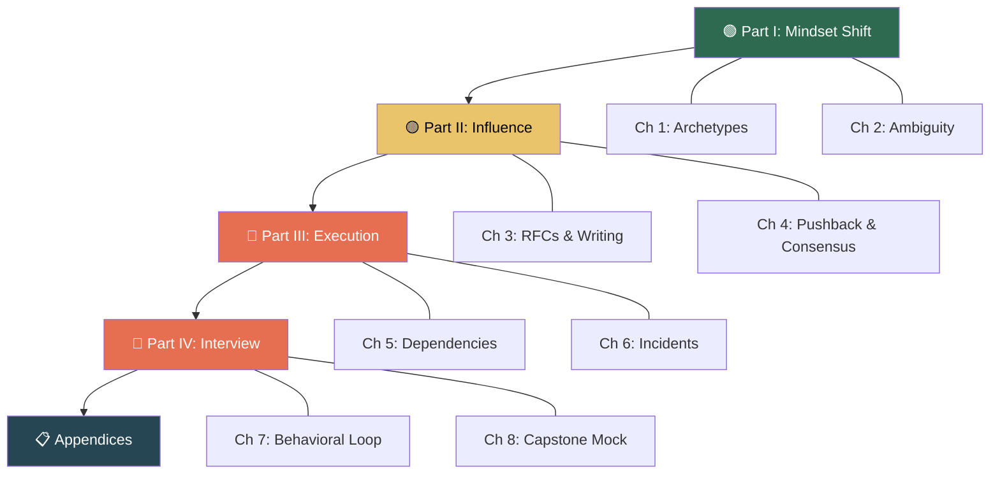

# The Staff Engineer's Playbook: Navigating Ambiguity, Influence, and Impact

## Speaker Intro

I'm a Principal Engineer and engineering leader who has spent over a decade building, breaking, and scaling distributed systems at FAANG-scale companies. I've served on hiring committees for L6 (Staff) and L7 (Principal) roles across multiple organizations, reviewed thousands of behavioral interviews, and calibrated hundreds of promotion packets.

I've also been on the other side: I climbed from IC3 to Principal without ever managing a team. Every lesson in this book was earned through painful trial and error — failed alignment meetings, projects that died because I couldn't convince the right VP, and Sev-1 incidents that taught me more about leadership than any management seminar ever could.

This book is the guide I wish someone had handed me the day I got the "Senior" title and realized that being good at code was no longer enough.

## Who This Is For

- **Senior engineers** (L5/IC5) who are technically strong but keep getting feedback like "needs more impact" or "should demonstrate broader influence."
- **Staff candidates** preparing for behavioral interview loops at companies where $400k+ total compensation is on the table — and where the bar is "show me you can operate without a roadmap."
- **Recently promoted Staff engineers** who landed the title but feel like impostors because nobody told them what the job *actually* is.
- **Engineering managers** who want to understand what great Staff engineers do so they can sponsor and grow them.

## Prerequisites

This book assumes you are already a competent engineer. We will not teach you how to write code, design systems, or pass a coding interview.

| Concept | Where to Learn |
|---|---|
| System design fundamentals | *Designing Data-Intensive Applications* (Kleppmann) |
| Basic leadership vocabulary | *The Manager's Path* (Fournier) |
| How leveling works at tech companies | levels.fyi, internal career ladders |
| Comfort with ambiguity | Life experience (or read Chapter 2) |

## How to Use This Book

| Emoji | Meaning | Audience |
|---|---|---|
| 🟢 | **Senior-to-Staff Transition** | You're preparing for promotion or you just got the title |
| 🟡 | **Staff Applied** | You're in the role and need to level up specific competencies |
| 🔴 | **Principal / Org-Level Impact** | You're operating at the highest IC levels or preparing for L7 loops |

**Read linearly the first time.** Each chapter builds on the one before it. After that, use it as a reference — jump to the chapter that matches the challenge you're facing this week.

## Pacing Guide

| Chapters | Topic | Time | Checkpoint |
|---|---|---|---|
| Ch 00 | Introduction & orientation | 30 min | Can you name the four Staff archetypes? |
| Ch 01–02 | Mindset shift | 3–4 hours | Write a one-page problem framing for a vague business request |
| Ch 03–04 | Influence without authority | 4–6 hours | Draft a real RFC and practice a "managed no" conversation |
| Ch 05–06 | Execution at scale | 4–6 hours | Map your current cross-team dependencies and draft a postmortem |
| Ch 07–08 | Interview & capstone | 6–8 hours | Complete the full mock behavioral loop |
| Ch 09 | Reference card | As needed | Keep this open during interview prep |

## Table of Contents

### Part I — The Mindset Shift
1. **The Staff Archetypes 🟢** — Tech Lead, Architect, Solver, and Right Hand. Recognizing that "typing code" is no longer your primary deliverable.
2. **Navigating Ambiguity 🟢** — Turning a vague 3-word business request into a multi-quarter technical roadmap.

### Part II — Influence Without Authority
3. **Writing to Scale Yourself 🟡** — RFCs, PRFAQs, ADRs, and the art of the 6-pager. Framing tech debt as a business problem.
4. **Alignment and the Art of Pushback 🟡** — How to say "No" without burning bridges. Managing up, resolving stalemates, and building consensus before the meeting.

### Part III — Execution at Scale
5. **Managing Cross-Team Dependencies 🔴** — Horse-trading, escalation ladders, and designing fallback mechanisms when another team won't help you.
6. **Incident Command and Blameless Culture 🔴** — Leading during a Sev-1 outage. Writing postmortems that actually prevent recurrence.

### Part IV — The Interview & Capstone
7. **Mastering the Behavioral Loop 🔴** — STAR+ (Situation, Task, Action, Result, *Learnings, Trade-offs*). Talking about failure. "Disagree and Commit."
8. **Capstone Project 🔴** — A complete L7 behavioral mock interview simulation.

### Appendices
9. **Reference Card & Cheat Sheets** — Interview questions, anti-patterns, and an RFC template.

## Companion Guides

This book focuses on the *human* and *organizational* skills of a Staff+ engineer. For the technical depth that underpins your credibility, see:

- [Rust Architecture & Design Patterns](../architecture-book/src/SUMMARY.md) — System design thinking translated to code
- [Rust Engineering Practices](../engineering-book/src/SUMMARY.md) — CI/CD, tooling, and production discipline
- [Enterprise Rust](../enterprise-rust-book/src/SUMMARY.md) — Observability, security, and compliance at scale
- [Hardcore Distributed Systems](../distributed-systems-book/src/SUMMARY.md) — The technical foundation for the scenarios in this book
