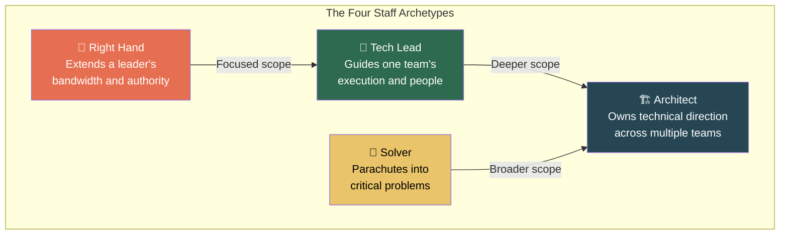

# 1. The Staff Archetypes 🟢

> **What you'll learn:**
> - The four canonical Staff engineer archetypes and how to identify which one you are
> - Why "writing more code" is the wrong answer to "How do I get promoted to Staff?"
> - How to map your natural strengths to the archetype that maximizes your organizational impact
> - The critical difference between *scope* and *seniority*

---

## The Uncomfortable Truth About the Senior-to-Staff Transition

Here is the single most important sentence in this book:

**The Staff engineer's primary deliverable is not code — it is *organizational clarity*.**

At the Senior level, you are measured by your ability to take a well-scoped problem, produce a high-quality solution, and ship it. You're a force multiplier for your own team. The feedback you receive is about execution quality.

At the Staff level, the game changes completely. You are measured by outcomes you influence across teams, across quarters, and often across organizations. The problems you solve are ones that *nobody has scoped yet*. The code you write — if you write code at all — is incidental to the strategic decisions you make about *what* gets built and *why*.

| Dimension | Senior Engineer | Staff Engineer |
|---|---|---|
| **Primary output** | Code, design docs, code reviews | Organizational clarity, technical direction |
| **Scope** | Single team, single project | Cross-team, multi-quarter |
| **How problems arrive** | Scoped tickets, sprint backlog | Vague business signals, cross-cutting pain |
| **Success metric** | "Did you ship it well?" | "Did the *org* ship the right thing?" |
| **Failure mode** | Bugs, missed deadlines | Misaligned teams, wasted quarters |
| **Who evaluates you** | Your manager, tech lead | Directors, VPs, peer Staff engineers |

If you're reading this and thinking "but I just want to write code," that's fine — and you should probably stay at the Senior level. There is no shame in that, and many organizations have Senior engineers who are paid extremely well. But if you want the Staff title, you need to internalize that **code is a tool, not a deliverable**.

---

## The Four Archetypes

Will Larson's *Staff Engineer* identifies four archetypes that describe how Staff+ engineers create impact. These are not rigid boxes — most people are a blend — but understanding them helps you find your lane.

### The Tech Lead

**What they do:** Guide a single team to deliver on complex, ambiguous projects. They set technical direction for the team, unblock engineers, run design reviews, and serve as the primary interface between the team and its stakeholders.

**Key behavior:** The Tech Lead is *in the room* for product discussions. They don't wait for a ticket — they shape what the tickets say. They are accountable for the team's technical quality and delivery velocity.

**Where they write code:** Extensively, but strategically. They pick up the hardest or riskiest pieces themselves, and delegate the rest in a way that grows the team.

**Failure mode:** Becoming a bottleneck. The Tech Lead who reviews every PR, makes every design decision, and never lets anyone else present to leadership is *hoarding context*, not leading.

### The Architect

**What they do:** Own the technical direction across multiple teams or an entire system. They are the person who can explain how the search indexing pipeline, the recommendation engine, and the user-facing API should evolve *together* over the next two years.

**Key behavior:** The Architect writes the RFCs, ADRs, and system design documents that define the "north star" architecture. They attend design reviews across teams to ensure consistency. They care deeply about interfaces, contracts, and the gaps *between* teams.

**Where they write code:** Selectively — usually prototypes, proof-of-concepts, or critical path components that set the pattern for others to follow.

**Failure mode:** The Ivory Tower Architect. Producing beautiful design documents that nobody follows because the Architect never sits with the teams doing the actual work.

### The Solver

**What they do:** Parachute into the organization's hardest problems and drive them to resolution. The problem might be a thorny performance bottleneck, a critical migration, a compliance deadline, or a system that nobody understands anymore.

**Key behavior:** The Solver has a high tolerance for ambiguity and context-switching. They can ramp up on a new codebase in days, identify the root cause of a problem that's stumped a team for months, and leave behind a solution that the team can maintain without them.

**Where they write code:** Heavily, but temporarily. They produce the critical fix, the migration tool, the gnarly refactor — and then they move on.

**Failure mode:** Becoming "that person" who swoops in, writes code nobody understands, declares victory, and leaves. The Solver who doesn't transfer knowledge creates a different kind of organizational debt.

### The Right Hand

**What they do:** Extend the bandwidth and authority of a senior leader (usually a VP or Director of Engineering). They attend meetings the leader can't, represent the leader's technical perspective, and drive execution across the leader's entire organization.

**Key behavior:** The Right Hand is deeply trusted by the leader and deeply aware of organizational dynamics. They often "sniff out" problems before anyone reports them, because they have enough context across teams to see patterns.

**Where they write code:** Rarely. Their impact comes from coordination, communication, and judgment.

**Failure mode:** Becoming a "shadow manager" without the title. The Right Hand who accumulates power but doesn't share context with the teams creates a single point of failure.

---

## Finding Your Archetype

Most people don't choose their archetype — they discover it by paying attention to which work energizes them and which work drains them.

| Signal | Likely Archetype |
|---|---|
| You love sprint planning and hate being away from your team | **Tech Lead** |
| You get excited drawing boxes-and-arrows diagrams of 10-system architectures | **Architect** |
| You're happiest debugging a system you've never seen before at 2 AM | **Solver** |
| You spend more time in 1:1s and leadership syncs than writing code | **Right Hand** |
| You feel uncomfortable when you don't know the business context for your work | **Architect** or **Right Hand** |
| You feel uncomfortable when you're not shipping code every week | **Tech Lead** or **Solver** |

### The Trap: "I Just Want to Code"

Let's address this directly. Many Senior engineers aspire to Staff because they believe it means "more Senior" — more complex code, harder problems, same basic job. This is incorrect.

Staff is not "Senior+". It is a *different job* that requires a different set of skills. The technical skills that got you to Senior are necessary but not sufficient. The organizational, communication, and strategic skills described in this book are the delta.

**The Junior/Senior Answer (Tactical):**
> "How will I get to Staff? I'll ship a really big, technically impressive project."

**The Staff Answer (Strategic):**
> "How will I get to Staff? I'll identify the highest-leverage problem in our org that nobody owns, define the solution space, align stakeholders across three teams, ship a credible v1, and make sure the org learns from the process."

The first answer might get you promoted. The second answer *is* the job.

---

## Scope vs. Seniority

A common misunderstanding: seniority means bigger scope. This is partially true but dangerously incomplete. **Seniority means bigger *judgment*.**

A Senior engineer with a large scope will drown. They'll try to do everything themselves, context-switch until they burn out, and eventually become a bottleneck. A Staff engineer with the same scope will *ruthlessly prioritize*, delegate effectively, influence without authority, and ensure the right outcomes without personally doing all the work.

| Dimension | Large Scope, Low Seniority | Large Scope, High Seniority |
|---|---|---|
| Response to overload | Works longer hours | Ruthlessly deprioritizes |
| Response to ambiguity | Asks manager to clarify | Proposes a framing and gets buy-in |
| Response to conflict | Escalates immediately | Resolves directly, escalates surgically |
| Response to failure | "I tried my best" | "Here's what the org should change" |

---

<strong>🏋️ Exercise: Identify Your Archetype</strong> (click to expand)

### Situational Challenge

You're a Senior engineer at a mid-size company. Your manager tells you: "I want to put you forward for Staff promotion this cycle. The committee needs to see evidence of Staff-level impact over the last year. Let's figure out your narrative."

You review your work from the past year:
- Led the migration of your team's monolith service to microservices (6 months, 3 engineers)
- Debugged a critical cross-service latency issue that two other teams had given up on (2 weeks)
- Wrote the company's first Architectural Decision Record (ADR) template, now used by 4 teams
- Regularly represent your team in the weekly architecture review meeting
- Mentored two junior engineers through their first production deployments

**Questions:**
1. Which archetype best describes your past year?
2. Which work items would you highlight for a Staff promotion packet?
3. What is the *single biggest gap* in your narrative that the committee might push back on?

---

🔑 Solution

**1. Archetype:** You're primarily a **Tech Lead** with Solver tendencies. The migration was a Tech Lead activity (guiding a team through a complex, scoped project). The cross-service debugging was a Solver activity (parachuting into someone else's problem).

**2. Highlight these items (and why):**

- **The ADR template** — This is your strongest Staff signal because it *scaled beyond your team*. You didn't just solve a problem; you created a reusable structure that improved architectural decision-making across the org. This demonstrates influence without authority.
- **The cross-service debugging** — Frame this not as "I found the bug" but as "I identified a systemic gap in our cross-service observability and proposed a fix." The staff narrative is about the *systemic* fix, not the heroic debugging.
- **The migration** — Only highlight this if you can show that it set a pattern for other teams. If it was a one-team project, it's Senior-level work (excellent execution on a scoped problem).

**3. The gap:** You're missing a clear **cross-team, multi-quarter initiative that you *defined* (not just executed)**. The committee will ask: "Who gave you the migration project? Did you scope it yourself or execute someone else's plan?" If the answer is "my manager told me to do it," that's Senior. If the answer is "I analyzed our deployment frequency, identified the monolith as the bottleneck, wrote an RFC proposing the migration strategy, and got three teams aligned on the plan" — that's Staff.

// 💥 CAREER HAZARD: Listing accomplishments without connecting them to organizational impact  
// ✅ FIX: Every bullet in your promo packet should answer "So what?" for the org, not just for your team

---

> **Key Takeaways**
> - Staff is a *different job* than Senior, not a harder version of the same job.
> - The four archetypes (Tech Lead, Architect, Solver, Right Hand) describe how Staff engineers create impact — identify yours.
> - Your primary deliverable is **organizational clarity**, not code.
> - Scope without judgment leads to burnout. Seniority means knowing when *not* to do the work yourself.
> - In a promotion narrative, always answer "So what?" at the organizational level.

> **See also:**
> - [Chapter 2: Navigating Ambiguity](ch02-navigating-ambiguity.md) — How to operate when nobody tells you what to work on
> - [Chapter 3: Writing to Scale Yourself](ch03-writing-to-scale-yourself.md) — The primary tool Architects use to multiply their impact
> - [Chapter 7: Mastering the Behavioral Loop](ch07-mastering-the-behavioral-loop.md) — How to present your archetype narrative in an interview
